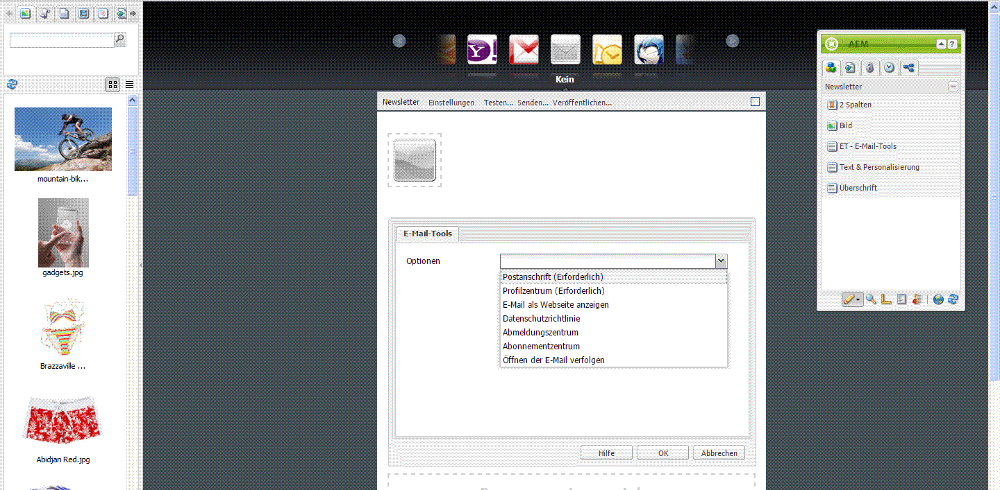
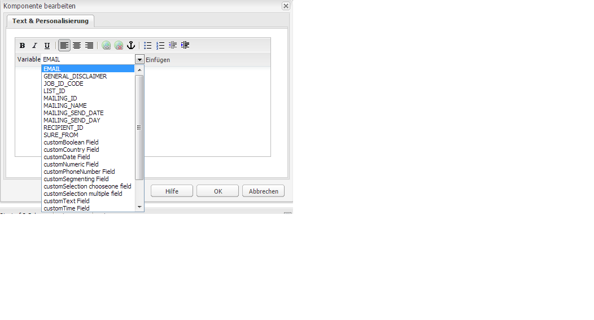
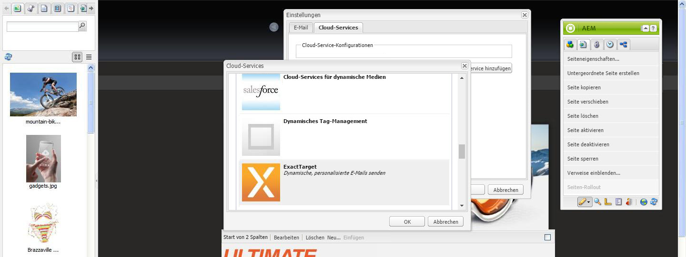
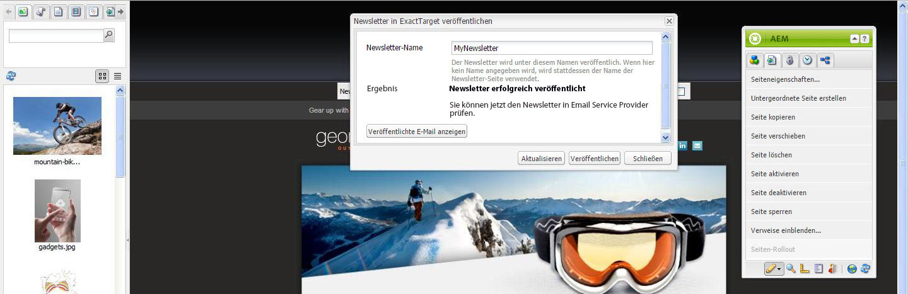

# Veröffentlichen von E-Mails bei E-Mail-Dienstanbietern{#publishing-an-email-to-email-service-providers}

Sie können Newsletter in E-Mail-Diensten wie ExactTarget und Silverpop Engage veröffentlichen. In diesem Dokument wird beschrieben, wie Sie AEM so konfigurieren, dass ein Newsletter in diesen E-Mail-Diensten veröffentlicht wird.

>[!NOTE]
>
>Sie müssen den Dienstanbieter zunächst konfigurieren, bevor Sie E-Mails verfassen und veröffentlichen können. Weitere Informationen finden Sie unter [Konfigurieren von ExactTarget](/help/sites-administering/exacttarget.md) und [Konfigurieren von Silverpop Engage](/help/sites-administering/silverpop.md) .

Zur Veröffentlichung einer Mail bei Ihrem E-Mail-Dienstanbieter müssen Sie Folgendes tun:

1. Verfassen Sie eine E-Mail.
1. Wenden Sie die Konfiguration des E-Mail-Dienstanbieters auf die E-Mail an.
1. Veröffentlichen Sie die E-Mail.

>[!NOTE]
>
>Sollten Sie E-Mail-Dienste aktualisieren, einen Testlauf durchführen oder einen Newsletter verschicken wollen, schlagen diese Aktionen fehl, wenn der Newsletter nicht zunächst in der Veröffentlichungsinstanz veröffentlicht wurde oder wenn diese Instanz nicht verfügbar ist. Stellen Sie sicher, dass Sie Ihren Newsletter veröffentlichen und die Veröffentlichungsinstanz ordnungsgemäß funktioniert.

## Erstellen von E-Mails  {#creating-an-email}

Eine E-Mail oder ein Newsletter, die/der Sie in einem E-Mail-Dienst veröffentlichen möchten, kann unter Verwendung der Vorlage **Geometrixx Newsletter** einer Kampagne erstellt werden. Alternativ können Sie auch die Vorlage **Geometrixx Outdoors-E-Mail** verwenden. Beispiel-E-Mail/Newsletter basierend auf der Vorlage **Geometrixx Outdoors E-Mail** sind unter `https://<hostname>:<port>/cf#/content/campaigns/geometrixx-outdoors/e-mails.html` verfügbar.

So erstellen Sie eine neue E-Mail, die im konfigurierten E-Mail-Dienst veröffentlicht wird:

1. Gehen Sie zu **Websites** und dann **Kampagnen**. Wählen Sie eine Kampagne.
1. Wählen Sie **Neu**, um das Fenster **Seite erstellen** zu öffnen.
1. Geben Sie den Titel und den Namen ein und wählen Sie in der Liste der verfügbaren Vorlagen **Geometrixx-Newsletter**.
1. Klicken Sie auf **Erstellen**.
1. Öffnen Sie die erstellte E-Mail.
1. Wechseln Sie zum Designmodus und wählen Sie die Komponenten, die Sie im Sidekick anzeigen möchten.
1. Wechseln Sie in den Bearbeitungsmodus und beginnen Sie damit, Ihrer E-Mail Inhalte (Text, Bilder, [E-Mail-Tools](#adding-exacttarget-email-tools-to-your-email), [Personalisierungsvariablen](#adding-text-and-personalization-tool-to-your-e-mail) usw.) hinzuzufügen.

### Hinzufügen von Exact Target-E-Mail-Tools zu E-Mails {#adding-exacttarget-email-tools-to-your-email}

>[!NOTE]
>
>Dieser Abschnitt bezieht sich ausschließlich auf den Dienst ExactTarget.

Mit der Komponente **E-Mail-Tools** für ExactTarget können Sie Ihrer E-Mail/Ihrem Newsletter zusätzliche E-Mail-Funktionen hinzufügen.

1. Öffnen Sie eine E-Mail, die in ExactTarget veröffentlicht werden soll.
1. Fügen Sie Ihrer Seite über den Sidekick die Komponente **ET - E-Mail-Tools** hinzu. Öffnen Sie die Komponente im Bearbeitungsmodus.

   

1. Wählen Sie im Menü **Optionen** eine Option aus:

<table>
 <tbody>
  <tr>
   <td>Postanschrift (Erforderlich)</td>
   <td>Diese Komponente fügt die Postanschrift Ihres Unternehmens in die E-Mail ein.</td>
  </tr>
  <tr>
   <td>Profilzentrum (Erforderlich)</td>
   <td>Das Profilzentrum ist eine Webseite, auf der Abonnenten die persönlichen Daten, die Sie von ihnen speichern, eingeben und verwalten können.</td>
  </tr>
  <tr>
   <td>E-Mail als Webseite anzeigen</td>
   <td>Mit dieser Komponente kann der Benutzer die E-Mail als Webseite anzeigen..</td>
  </tr>
  <tr>
   <td>Datenschutzrichtlinie</td>
   <td>Diese Komponente fügt einen Link zu Ihren Datenschutzrichtlinien in die E-Mail ein.  </td>
  </tr>
  <tr>
   <td>Abmeldungszentrum</td>
   <td>Bietet dem Benutzer die Möglichkeit, sich von der Mailing-Liste abzumelden..</td>
  </tr>
  <tr>
   <td>Abonnementzentrum</td>
   <td>Ein Abonnement-Center ist eine Webseite, auf der ein Abonnent die von Ihrem Unternehmen empfangenen Nachrichten steuern kann.</td>
  </tr>
  <tr>
   <td>Öffnen der E-Mail verfolgen</td>
   <td>Eine verborgene Komponente, die Ihnen die Nutzung der Tracking-Funktion von ExactTarget ermöglicht.  </td>
  </tr>
 </tbody>
</table>

>[!NOTE]
>
>Das Dropdown-Menü **Optionen** enthält nur dann Einträge, wenn eine ExactTarget-Konfiguration auf die E-Mail angewendet wurde. Weitere Informationen finden Sie unter [Anwenden der E-Mail-Dienstkonfiguration auf E-Mail-Einstellungen](#applying-e-mail-service-configuration-to-e-mail-settings) .

1. Veröffentlichen Sie die E-Mail in ExactTarget.

   Die E-Mail mit den E-Mail-Tools ist im konfigurierten ExactTarget-Konto verfügbar.

>[!NOTE]
>
>* Die URLs innerhalb der E-Mail-Tools werden (in der empfangenen E-Mail) nur dann durch ihre tatsächlichen Werte ersetzt, wenn eine E-Mail mit **Einfacher Versand** oder **Geführter Versand** gesendet wird, nicht jedoch mit **Testversand**.
   >
   >
* Zwei der E-Mail-Tools sind erforderlich: **Postanschrift (Erforderlich)** und **Profilzentrum (Erforderlich)**. Diese beiden E-Mail-Tools werden bei der Veröffentlichung der E-Mail in ExactTarget standardmäßig am Ende jeder E-Mail hinzugefügt.

>

### Hinzufügen des Tools „Text und Personalisierung“ zu E-Mails  {#adding-text-and-personalization-tool-to-your-e-mail}

Durch Hinzufügen der Komponente **Text und Personalisierung** zu Ihrer Seite können Sie E-Mails um benutzerdefinierte Felder erweitern:

1. Öffnen Sie die E-Mail, die auf dem E-Mail-Dienst veröffentlicht werden soll.
1. Möchten Sie in Ihrem E-Mail-Dienst benutzerdefinierte Felder freischalten, fügen Sie bei dessen Einrichtung die Framework-Konfiguration hinzu. Weitere Informationen finden Sie unter [Konfigurieren von Silverpop Engage](/help/sites-administering/silverpop.md) und [Konfigurieren von Exact Target](/help/sites-administering/exacttarget.md) .
1. Fügen Sie die Komponente **Text und Personalisierung** aus dem Sidekick hinzu. Diese Komponente ist Teil der Newslettergruppe. Öffnen Sie die Komponente im Bearbeitungsmodus.

   

1. Fügen Sie die erforderlichen personalisierten Felder hinzu, indem Sie die entsprechenden Felder aus dem Dropdown-Menü auswählen und auf **Einfügen** klicken.
1. Klicken Sie auf **OK**, um den Vorgang abzuschließen.

## Anwenden von E-Mail-Dienstkonfigurationen auf E-Mail-Einstellungen {#applying-e-mail-service-configuration-to-e-mail-settings}

So wenden Sie E-Mail-Dienstkonfigurationen auf Newsletter an:

1. Erstellen Sie eine Konfiguration des Typs „E-Mail-Dienst“.
1. Öffnen Sie die E-Mail/den Newsletter.
1. Öffnen Sie die Einstellungen für E-Mail/Newsletter, indem Sie entweder auf **Einstellungen** klicken oder **Seiteneigenschaften in** im Sidekick klicken.
1. Klicken Sie auf der Registerkarte **Cloud-Services** auf **Service hinzufügen**. Die Liste der Dienste wird angezeigt. Wählen Sie die gewünschte Konfiguration (**ExactTarget** oder **Silverpop**) aus der Dropdown-Liste aus.

   

1. Klicken Sie auf **OK**.

## Veröffentlichen von E-Mails im E-Mail-Dienst {#publishing-emails-to-email-service}

So veröffentlichen Sie E-Mails/Newsletter im E-Mail-Dienst:

1. Öffnen Sie die E-Mail.
1. Bevor Sie eine E-Mail veröffentlichen, vergewissern Sie sich, dass Sie die korrekte Konfiguration auf die E-Mail angewendet haben.
1. Klicken Sie auf **Veröffentlichen**. Das Fenster **Newsletter bei E-Mail-Dienstanbieter veröffentlichen** wird geöffnet.
1. Füllen Sie das Feld **Newsletter-Name** aus. Die E-Mail/der Newsletter wird unter diesem Namen im E-Mail-Dienst veröffentlicht. Wenn kein E-Mail-Name angegeben wurde, wird die E-Mail unter dem Seitennamen des Newsletters in AEM veröffentlicht.
1. Klicken Sie auf **Veröffentlichen**.

   

   Wenn der Vorgang erfolgreich war, erhalten Sie in AEM eine Meldung, dass Sie die E-Mail in ExactTarget oder Silverpop Engage anzeigen können.

   Im Fall von ExactTarget kann die veröffentlichte E-Mail durch Klicken auf **Veröffentlichte E-Mail anzeigen** angezeigt werden. Dadurch gelangen Sie direkt zum veröffentlichten Newsletter in ExactTarget ([https://members.exacttarget.com/](https://members.exacttarget.com/).).

>[!NOTE]
>
>Wenn eine E-Mail/ein Newsletter unter einem Namen veröffentlicht wird, unter dem bereits eine andere E-Mail/ein anderer Newsletter vorhanden ist, wird die ältere E-Mail/der ältere Newsletter nicht ersetzt. Stattdessen wird eine neue E-Mail/ein neuer Newsletter mit demselben Namen erstellt (die IDs der beiden E-Mails/Newsletter unterscheiden sich jedoch).
>
>Bei der Veröffentlichung im E-Mail-Dienst wird die E-Mail/der Newsletter zudem auch in der Veröffentlichungsinstanz von AEM veröffentlicht.

### Aktualisieren von veröffentlichten E-Mails {#updating-a-published-e-mail}

Mit der Schaltfläche **Aktualisieren** im Dialogfeld &quot;Veröffentlichen&quot;können Sie einen bereits in einem E-Mail-Dienstleister veröffentlichten Newsletter aktualisieren. Sollten Sie bei einem noch nicht veröffentlichten Newsletter auf **Aktualisieren** klicken, erscheint die Nachricht, dass der **Newsletter noch nicht veröffentlicht** wurde.

So aktualisieren Sie eine veröffentlichte E-Mail:

1. Öffnen Sie die E-Mail/den Newsletter, die oder der bereits in einem E-Mail-Dienst veröffentlicht wurde und die oder der nach vorgenommenen Änderungen erneut veröffentlicht werden soll.
1. Klicken Sie auf **Veröffentlichen**. Das Fenster **Newsletter an E-Mail-Dienstanbieter veröffentlichen** wird angezeigt. Klicken Sie auf **Aktualisieren**.

   Um zu überprüfen, ob die E-Mail/der Newsletter in ExactTarget aktualisiert wurde, klicken Sie auf **Veröffentlichte E-Mail anzeigen**. Sie werden zur veröffentlichten E-Mail in ExactTarget weitergeleitet.

   Möchten Sie prüfen, ob die E-Mail/der Newsletter im Silverpop-E-Mail-Dienst aktualisiert wurde, rufen Sie die Silverpop-Engage-Site auf.
