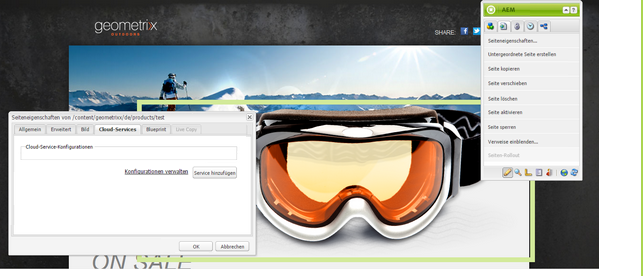
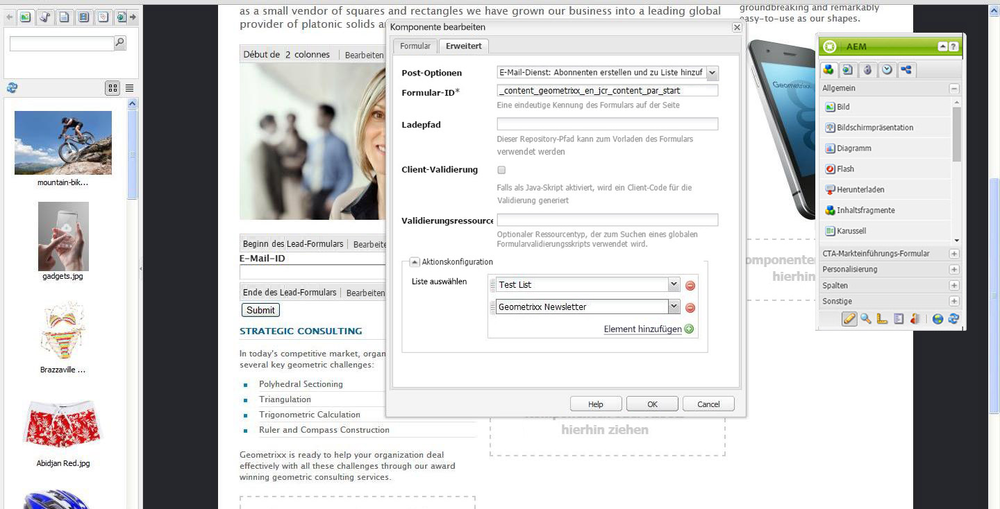
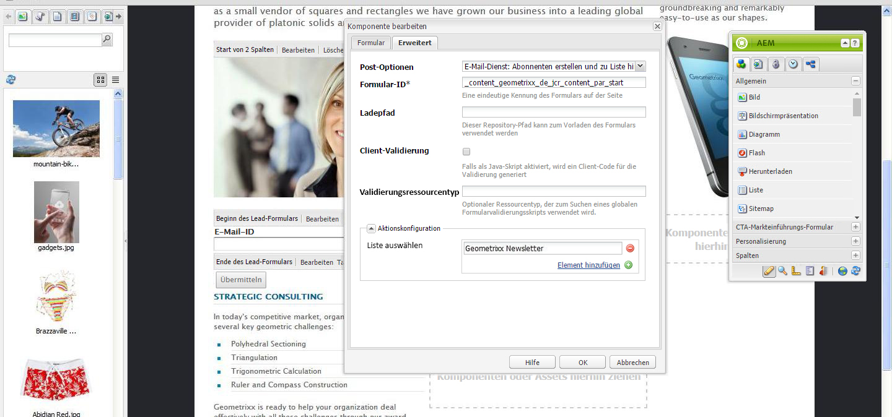
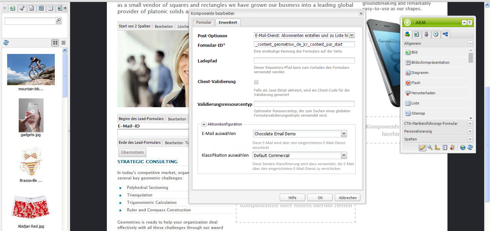

# Verwalten von Abonnements{#managing-subscriptions}

>[!NOTE]
>
>Adobe plant nicht, diese Funktion weiter auszubauen (Leads und Listen verwalten).
>Es wird empfohlen, [Adobe Campaign und seine AEM Integration](/help/sites-administering/campaign.md) zu nutzen.

Benutzer können mithilfe der **Formular**-Komponente des E-Mail-Dienstanbieters, die auf einer AEM Web-Seite verwendet wird, aufgefordert werden, **E-Mail-Dienstanbieter-Mailinglisten** zu abonnieren. Damit Sie eine AEM-Seite mit einem Abonnementformular erstellen können, das für die Anmeldung bei Ihren E-Mail-Dienst-Mailing-Listen konfiguriert ist, müssen Sie die entsprechende Dienstkonfiguration auf die AEM-Seite anwenden, die der potenzielle Abonnent besuchen wird.

## Anwenden der E-Mail-Dienstanbieterkonfiguration auf eine Seite {#applying-email-service-configuration-to-a-page}

So konfigurieren Sie eine AEM-Seite:

1. Navigieren Sie zur Registerkarte **Websites**.
1. Wählen Sie die Seite, die für den Dienst konfiguriert werden soll. Klicken Sie mit der rechten Maustaste auf die Seite und wählen Sie **Eigenschaften** aus.

1. Wählen Sie **Cloud Services** und dann **Dienst hinzufügen**. Wählen Sie eine Konfiguration aus der Liste der verfügbaren Konfigurationen.

   

1. Klicken Sie auf **OK**.

## Erstellen von Abonnementformularen auf einer AEM-Seite für das Abonnieren/Abbestellen von Listen  {#creating-a-sign-up-form-on-an-aem-page-for-subscribing-unsubscribing-to-lists}

So erstellen Sie ein Abonnementformular und konfigurieren es für die Anmeldung bei E-Mail-Dienstanbieter-Mailing-Listen:

1. Öffnen Sie die AEM-Seite, die der Besucher aufrufen wird.
1. Wenden Sie die Konfiguration des E-Mail-Dienstanbieters auf die Seite an.

1. Fügen Sie eine Komponente des Typs **Formular** hinzu, indem Sie sie aus dem Sidekick auf die Seite ziehen. Wenn die Komponente nicht verfügbar ist, wechseln Sie in den Designmodus und aktivieren Sie die **Formulargruppe**.
1. Klicken Sie in der Leiste **Beginn des Formulars** auf **und navigieren Sie zur Registerkarte** Erweitert **.**
1. Wählen Sie im Dropdown-Menü **Formular** die Option **E-Mail-Dienst: Erstellen Sie Abonnenten** und fügen Sie sie zur Liste hinzu.
1. Öffnen Sie am unteren Rand des Dialogfelds die Dropdown-Liste **Aktionskonfiguration** , in der Sie eine oder mehrere Abonnementlisten auswählen können.
1. Wählen Sie unter **Liste auswählen** die Liste aus, bei der sich Benutzer anmelden sollen. Über die Schaltfläche mit dem Plus (**Element hinzufügen**) können Sie mehrere Listen hinzufügen.

   

   >[!NOTE]
   >
   >Ihr Dialogfeld unterscheidet sich je nach E-Mail-Dienstanbieter möglicherweise vom hier beschriebenen.

1. Wählen Sie auf der Registerkarte **Formular** die Dankeseite aus, auf die Benutzer nach Absenden des Formulars weitergeleitet werden sollen (wird dieses Feld leer gelassen, wird nach dem Absenden erneut das Formular angezeigt). Klicken Sie auf **OK**. Im Formular wird eine **E-Mail-ID**-Komponente angezeigt, mit deren Hilfe Sie ein Formular erstellen können, in das Benutzer zur Anmeldung bei oder der Abmeldung aus der Mailingliste ihre E-Mail-Adresse eingeben können.
1. Fügen Sie im Sidekick die **Senden**-Schaltflächenkomponente für das **Formular** hinzu.

   Das Formular ist jetzt einsatzbereit. Veröffentlichen Sie die in den oben genannten Schritten konfigurierte Seite gemeinsam mit der **Dankeseite** in der Veröffentlichungsinstanz. Jeder potenzielle Abonnent, der die Seite besucht, kann das Formular ausfüllen und sich bei der in der Konfiguration angegebenen Liste anmelden.

   >[!NOTE]
   >
   >Damit das Abonnieren über das Formular ordnungsgemäß funktioniert, [müssen die Verschlüsselungsschlüssel des Autors exportiert und in die Veröffentlichungsinstanz importiert werden](#exporting-keys-from-author-and-importing-on-publish).

## Exportieren der Autorenschlüssel und Importieren in die Veröffentlichungsinstanz  {#exporting-keys-from-author-and-importing-on-publish}

Damit das Abonnieren und Abbestellen von E-Mail-Diensten über Abonnementformulare auf Veröffentlichungsinstanzen funktioniert, müssen Sie die folgenden Schritte ausführen:

1. Navigieren Sie in der Autoreninstanz zu Package Manager.
1. Erstellen Sie ein neues Paket. Legen Sie den Filter auf `/etc/key` fest.
1. Erstellen Sie das Paket und laden Sie es herunter.
1. Navigieren Sie in der Veröffentlichungsinstanz zu Package Manager und laden Sie dieses Paket hoch.
1. Navigieren Sie zur OSGi-Konsole für die Veröffentlichung und starten Sie das Bundle **Adobe Granite Crypto Support**.

## Abmelden von Benutzern aus Listen  {#unsubscribing-users-from-lists}

So melden Sie Benutzer aus Listen ab:

1. Öffnen Sie die Seiteneigenschaften der AEM-Seite, die das Abonnementformular enthält, über das sich ein Lead abmelden kann.
1. Wenden Sie die Dienst-Konfiguration auf die Seite an.
1. Erstellen Sie auf der Seite ein Abonnementformular.
1. Wählen Sie beim Konfigurieren der Komponente die Aktion **E-Mail-Dienst** aus: **Benutzer von Liste abmelden.**
1. Wählen Sie in der Dropdown-Liste die Liste, von der der Benutzer beim Abmelden gelöscht wird.

   

1. Exportieren Sie die Schlüssel des Autors zur Veröffentlichung.

## Konfigurieren von automatischen Nachrichten für einen E-Mail-Dienst  {#configuring-auto-responder-emails-for-email-service}

So konfigurieren Sie eine automatische Nachricht für einen Abonnenten:

1. Öffnen Sie die Seiteneigenschaften der AEM Seite, die über das Anmeldeformular verfügt, um den automatischen Antwortsender für einen Lead zu konfigurieren.
1. Wenden Sie die ExactTarget-Konfiguration auf die Seite an.

1. Fügen Sie eine Komponente des Typs **Formular** hinzu, indem Sie sie aus dem Sidekick auf die Seite ziehen. Wenn die Komponente nicht verfügbar ist, wechseln Sie in den Designmodus und aktivieren Sie die **Formulargruppe**.
1. Klicken Sie in der Leiste **Beginn des Formulars** auf **und navigieren Sie zur Registerkarte** Erweitert **.**
1. Wählen Sie im Dropdown-Menü **Formular** die Option **E-Mail-Dienst: Automatische Antwort-E-Mail senden.**
1. **Wählen Sie eine E-Mail**  aus (dies ist die E-Mail, die als automatische Nachricht gesendet wird).

1. **Wählen Sie Classification**  aus (diese Classification wird zum Senden der E-Mail verwendet).
1. Wählen Sie die Seite **Vielen Dank** aus (die Seite, auf die Benutzer weitergeleitet werden, sobald sie das Formular senden).

   Wählen Sie auf der Registerkarte **Formular** die Dankeseite, die Benutzer sehen sollen, nachdem sie das Formular gesendet haben. (Erfolgt hier keine Angabe, wird das Formular nach der Übermittlung erneut angezeigt.) Klicken Sie auf **OK**.

1. Exportieren Sie die Schlüssel des Autors zur Veröffentlichung.
1. Fügen Sie im Sidekick die **Senden**-Schaltflächenkomponente für das **Formular** hinzu.

   Das Anmeldeformular ist jetzt einsatzbereit. Veröffentlichen Sie die in den oben genannten Schritten konfigurierte Seite gemeinsam mit der **Dankeseite** in der Veröffentlichungsinstanz. Jeder potenzielle Abonnent, der die Seite besucht, kann das Formular ausfüllen. Beim Senden des Formulars erhält der Besucher eine automatische Nachricht an die E-Mail-Adresse, die er im Formular angegeben hat.

   >[!NOTE]
   >
   >Damit das Abonnieren über das Formular ordnungsgemäß funktioniert, [müssen die Verschlüsselungsschlüssel des Autors exportiert und in die Veröffentlichungsinstanz importiert werden](#exporting-keys-from-author-and-importing-on-publish).

   
