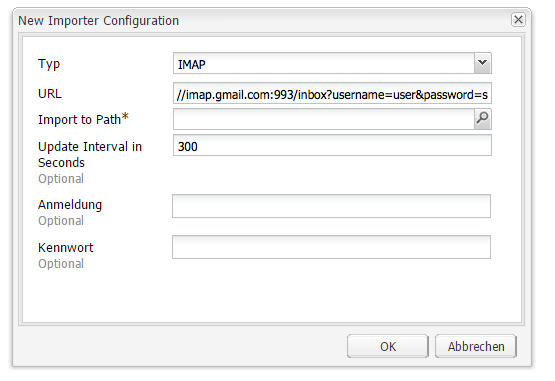

# Nachverfolgen nicht zugestellter E-Mails{#tracking-bounced-emails}

>[!NOTE]
>
>Adobe plant nicht, das Tracking geöffneter/Bounce-E-Mails, die von AEM SMTP-Dienst gesendet werden, weiter zu verbessern.
>
>Es wird empfohlen, [Adobe Campaign und seine AEM-Integration](/help/sites-administering/campaign.md) zu nutzen.

Wenn Sie einen Newsletter an viele Benutzer senden, sind in der Liste im Allgemeinen einige ungültige E-Mail-Adressen enthalten. Newsletter, die an diese Adressen gesendet werden, können nicht zugestellt werden. AEM kann diese nicht zugestellten E-Mails verwalten und den Versand von Newslettern an diese Adressen einstellen, wenn die festgelegte Anzahl nicht erfolgreicher Zustellversuche überschritten wird. Der Standardwert für fehlgeschlagene Zustellversuche beträgt 3, er kann jedoch angepasst werden.

Wenn Sie AEM so einrichten möchten, dass nicht zugestellte E-Mails nachverfolgt werden, müssen Sie festlegen, dass AEM vorhandene Postfächer abfragt, an die E-Mails nicht zugestellt werden können (im Allgemeinen handelt es sich dabei um die E-Mail-Adresse, die Sie für den Versand des Newsletters angegeben haben). AEM fragt diesen Posteingang ab und importiert alle E-Mails in das in den Abrufeinstellungen festgelegte Verzeichnis. Anschließend wird ein Workflow ausgelöst, der innerhalb der Benutzer nach den nicht zugestellten E-Mail-Adressen sucht und den Wert der Eigenschaft &quot;bounceCounter&quot;des Benutzers entsprechend aktualisiert. Wenn der festgelegte Maximalwert für fehlgeschlagene Zustellversuche überschritten wird, wird der Benutzer aus der Newsletter-Liste gelöscht.

## Konfigurieren des Feed Importers  {#configuring-the-feed-importer}

Mit dem Feed Importer können Sie wiederholt Inhalte aus externen Quellen in Ihr Repository importieren. Bei dieser Konfiguration des Feed Importers prüft AEM den Posteingang des Absenders auf nicht zugestellte E-Mails.

So konfigurieren Sie den Feed Importer für das Nachverfolgen nicht zugestellter E-Mails:

1. Wählen Sie unter **Tools** die Option „Feed Importer“.

1. Klicken Sie auf **Hinzufügen**, um eine neue Konfiguration zu erstellen.

   

1. Fügen Sie eine neue Konfiguration hinzu, indem Sie den Typ wählen und Informationen zur Abruf-URL angeben, um so den Host und den Port zu konfigurieren. Außerdem müssen Sie der URL-Abfrage einige Mail- und Protokoll-spezifische Parameter hinzufügen. Richten Sie die Konfiguration so ein, dass der Abruf mindestens einmal pro Tag erfolgt.

   Sämtliche Konfigurationen benötigen in der Abruf-URL Informationen zu folgenden Bereichen:

   `username`: Der Benutzername für die Verbindung

   `password`: Das Kennwort für die Verbindung

   Außerdem können Sie je nach Protokoll bestimmte Einstellungen konfigurieren.

   **Eigenschaften der POP3-Konfiguration:**

   `pop3.leave.on.server`: Definiert, ob Nachrichten auf dem Server bleiben sollen oder nicht. Wählen Sie „true“, wenn Nachrichten auf dem Server bleiben sollen, bzw. „false“, wenn dies nicht der Fall sein soll. Standardwert ist „true“.

   **POP3-Beispiele:**

   | pop3s://pop.gmail.com:995/INBOX?username=user&amp;password=secret | Verwendung von pop3 über SSL, um an Port 995 eine Verbindung zu GMail mit dem Konto user/secret herzustellen, Nachrichten bleiben standardmäßig auf dem Server |
   |---|---|
   | pop3s://pop.gmail.com:995/INBOX?username=user&amp;password=secret&amp;pop3.leave.on.server=false | pop3s://pop.gmail.com:995/INBOX?username=user&amp;password=secret&amp;pop3.leave.on.server=false |

   **Eigenschaften der IMAP-Konfiguration:**

   Bietet Ihnen die Möglichkeit, Kennzeichnungen zu setzen, nach denen Sie suchen können. 

   `imap.flag.SEEN`:Wählen Sie „false“ für eine neue/nicht gelesene Nachricht und „true“ für bereits gelesene Nachrichten

   Eine vollständige Liste der Flags finden Sie unter [https://java.sun.com/products/javamail/javadocs/javax/mail/Flags.Flag.html](https://java.sun.com/products/javamail/javadocs/javax/mail/Flags.Flag.html) .

   **IMAP-Beispiele:**

   | imaps://imap.gmail.com:993/inbox?username=user&amp;password=secret | Verwendung von IMAP über SSL, um an Port 993 eine Verbindung zu GMail mit dem Konto user/secret herzustellen. Standardmäßig werden nur neue Nachrichten empfangen. |
   |---|---|
   | imaps://imap.gmail.com:993/inbox?username=user&amp;password=secret&amp;imap.flag.SEEN=true | Verwendung von IMAP über SSL, um an Port 993 eine Verbindung zu GMail mit dem Konto user/secret herzustellen. Es werden nur bereits gelesene Nachrichten abgerufen. |
   | imaps://imap.gmail.com:993/inbox?username=user&amp;password=secret&amp;imap.flag.SEEN=true&amp;imap.flag.SEEN=false | Verwendung von IMAP über SSL, um an Port 993 eine Verbindung zu GMail mit dem Konto user/secret herzustellen. Es werden bereits gelesene ODER neue Nachrichten abgerufen. |

1. Speichern Sie die Konfiguration.

## Konfigurieren der Newsletter-Dienstkomponente  {#configuring-the-newsletter-service-component}

Nachdem Sie den Feed Importer konfiguriert haben, müssen Sie die Absenderadresse und den Zähler für nicht erfolgreiche Zustellversuche konfigurieren.

So konfigurieren Sie den Newsletter-Dienst:

1. Navigieren Sie in der OSGi-Konsole unter `<host>:<port>/system/console/configMgr` zu **MCM-Newsletter**.

1. Konfigurieren Sie den Dienst und speichern Sie anschließend die Änderungen.

   

   Die folgenden Konfigurationen können angepasst werden:

   | Bounce Counter Maximum (max.bounce.count) | Bestimmt, nach wie vielen erfolglosen Zustellversuchen ein Benutzer beim Versand eines Newsletters nicht mehr berücksichtigt wird. Wenn Sie diesen Wert auf 0 einstellen, wird die Prüfung erfolgloser Zustellversuche komplett deaktiviert. |
   |---|---|
   | Activity No Cache (sent.activity.nocache) | Definiert die Cache-Einstellung, die für die Aktivität „Newsletter gesendet“ verwendet werden soll |

   Nach dem Speichern führt der Newsletter-MCM-Dienst die folgenden Funktionen aus:

   * Schreibt nach dem erfolgreichen Versand eines Newsletters eine Aktivität in den verborgenen Stream des Benutzers.
   * Schreibt eine Aktivität, wenn eine nicht zugestellte Nachricht ermittelt wird und die Anzahl der nicht zugestellten Nachrichten für einen Benutzer sich ändert.
