# E-Mail-Marketing{#e-mail-marketing}

>[!NOTE]
>
>Adobe plant nicht, die E-Mail-Verfolgung von über den AEM-SMTP-Dienst gesendeten offenen/zurückgesendeten (nicht zustellbaren) Nachrichten weiter auszubauen.
> Es wird deshalb empfohlen, [Adobe Campaign und dessen Integration mit AEM zu nutzen](/help/sites-administering/campaign.md).

E-Mail-Marketing (z. B. Newsletter) ist ein wichtiger Bestandteil jeder Marketingkampagne, da Sie auf diese Weise Ihren Leads Inhalte zukommen lassen können. In AEM können Sie Newsletter aus bestehendem AEM-Inhalt erstellen und neue für die Newsletter spezifische Inhalte hinzufügen.

Nach der Erstellung können Sie die Newsletter sofort oder (mithilfe eines Arbeitsablaufs) zu einem geplanten Zeitpunkt an bestimmte Benutzergruppen senden. Darüber hinaus können Benutzer Newsletter in dem gewünschten Format abonnieren.

AEM ermöglicht es Ihnen auch, die Newsletter-Funktion zu verwalten, z. B. durch die Verwaltung von Themen, Archivierung von Newslettern und Anzeige von Newsletter-Statistiken.

>[!NOTE]
>
>In Geometrixx wird die Newsletter-Vorlage automatisch im E-Mail-Editor geöffnet. Sie können den E-Mail-Editor auch für andere Vorlagen verwenden, die Sie per E-Mail versenden möchten, z. B. Einladungen. Der E-Mail-Editor wird immer dann angezeigt, wenn eine Seite aus **mcm/components/newsletter/page** vererbt wird.

In diesem Dokument werden die Grundlagen der Newslettererstellung in AEM erläutert. Genauere Informationen zur Verwendung der E-Mail-Verfolgung finden Sie in folgenden Dokumenten:

* [Erstellen einer effektiven Einstiegsseite für Newsletter](/help/sites-classic-ui-authoring/classic-personalization-campaigns-email-landingpage.md)
* [Verwalten von Abonnements](/help/sites-classic-ui-authoring/classic-personalization-campaigns-email-subscriptions.md)
* [Veröffentlichen von E-Mails bei E-Mail-Dienstanbietern](/help/sites-classic-ui-authoring/classic-personalization-campaigns-email-newsletters.md)
* [Nachverfolgen nicht zugestellter E-Mails](/help/sites-classic-ui-authoring/classic-personalization-campaigns-email-tracking-bounces.md)

>[!NOTE]
>
>Sollten Sie E-Mail-Dienste aktualisieren, einen Testlauf durchführen oder einen Newsletter verschicken wollen, schlagen diese Aktionen fehl, wenn der Newsletter nicht zunächst in der Veröffentlichungsinstanz veröffentlicht wurde oder wenn diese Instanz nicht verfügbar ist. Stellen Sie sicher, dass Sie Ihren Newsletter veröffentlichen und die Veröffentlichungsinstanz ordnungsgemäß funktioniert.

## Erstellen eines Newsletter-Erlebnisses  {#creating-a-newsletter-experience}

>[!NOTE]
>
>E-Mail-Benachrichtigungen müssen mit der OSGi-Konfiguration bearbeitet werden. Weitere Informationen finden Sie unter [Konfigurieren von E-Mail-Benachrichtigungen.](/help/sites-administering/notification.md)

1. Wählen Sie im linken Bereich die neue Kampagne oder doppelklicken Sie im rechten Bereich darauf.

1. Wählen Sie die Listenansicht mit folgendem Symbol:

   

1. Klicken Sie auf **Neu...**

   Sie können den **Titel**, den **Namen** und den Typ des zu erstellenden Erlebnisses angeben, in diesem Fall wählen Sie „Newsletter“.

   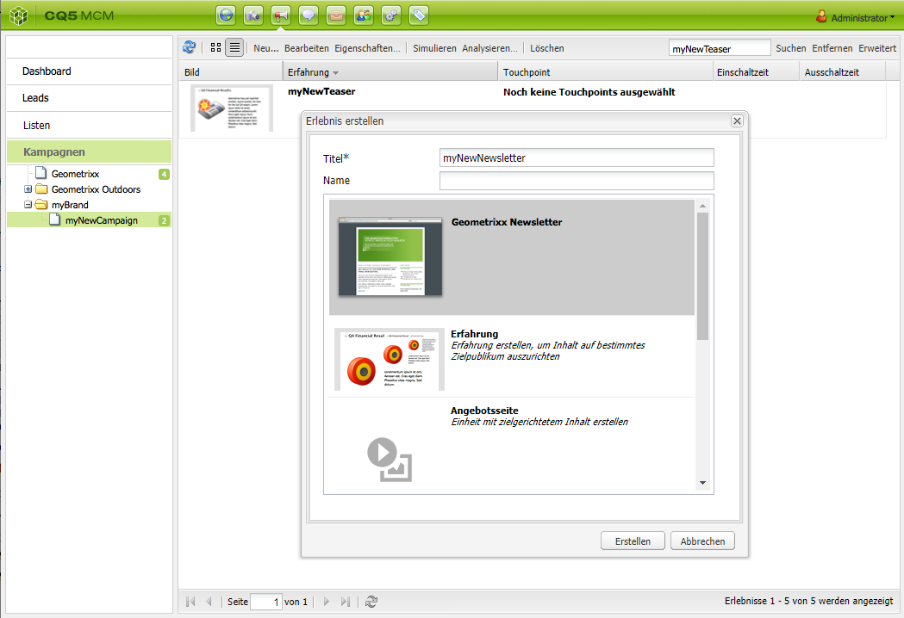

1. Klicken Sie auf **Erstellen**.

1. Ein neues Dialogfeld wird geöffnet. Hier können Sie die Eigenschaften des Newsletters festlegen.

   Das Feld **Standard-Empfängerliste** muss ausgefüllt werden, da es den Touchpoint für den Newsletter bildet (weitere Informationen zu Listen finden Sie unter [Arbeiten mit Listen](/help/sites-classic-ui-authoring/classic-personalization-campaigns.md#workingwithlists)).

   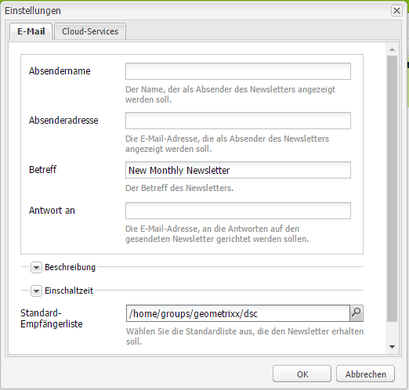

   * **Absendername** Der Name, der als Absender des Newsletters angezeigt werden soll.

   * **Absenderadresse** Die E-Mail-Adresse, die als Absender des Newsletters angezeigt werden soll.

   * **Betreff** Der Betreff des Newsletters.

   * **Antwort an** Die E-Mail-Adresse, an die Antworten auf den gesendeten Newsletter gerichtet werden sollen.

   * **Beschreibung** Beschreibung des Newsletters.

   * **Einschaltzeit** Die Einschaltzeit für den Versand des Newsletters.

   * **Standard-Empfängerliste** Standardliste der Empfänger, die den Newsletter erhalten sollen.
   Sie können in größerem Umfang im Dialogfeld **Eigenschaften...** aktualisiert werden.

1. Klicken Sie zum Speichern auf **OK**.

## Hinzufügen von Newsletterinhalten {#adding-content-to-newsletters}

Sie können Ihrem Newsletter wie bei jeder anderen AEM-Komponente Inhalt hinzufügen, darunter auch dynamischen Inhalt. Die Newsletter-Vorlage in Geometrixx verfügt über bestimmte Komponenten, mit denen Inhalt in Newslettern hinzugefügt und geändert werden kann.

1. Klicken Sie im MCM auf die Registerkarte **Kampagnen** und doppelklicken Sie dann auf den Newsletter, dem Sie Inhalt hinzufügen möchten oder dessen Inhalt Sie bearbeiten möchten. Der Newsletter wird geöffnet.

1. Wenn keine Komponenten sichtbar sind, gehen Sie zur Designansicht und aktivieren Sie die erforderlichen Komponenten (z.&amp;nbsp;B. die Newsletter-Komponente), bevor Sie mit der Bearbeitung beginnen.
1. Geben Sie wie erforderlich neuen Text, neue Bilder oder andere Komponenten ein. Im Geometrixx-Beispiel stehen 4 Komponenten zur Verfügung: „Text“, „Bild“, „Überschrift“ und „2 Spalten“. Ihr Newsletter kann mehr oder weniger Komponenten enthalten, je nachdem wie Sie ihn eingerichtet haben.

   >[!NOTE]
   >
   >Mithilfe von Variablen können Sie den Newsletter personalisieren. Im Geometrixx-Newsletter stehen in der Text-Komponente Variablen zur Verfügung. Die Werte für die Variablen werden aus den Informationen im Benutzerprofil vererbt.

   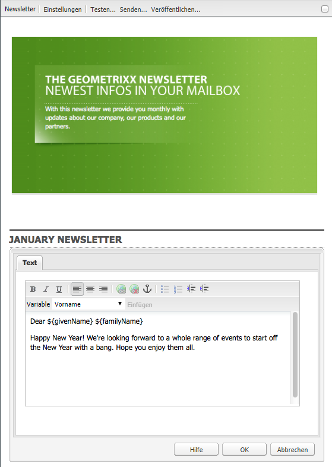

1. Wählen Sie die Variable aus der Liste aus und klicken Sie auf **Einfügen**, um die Variablen einzufügen. Variablen werden aus dem Profil gefüllt.

## Personalisieren von Newslettern {#personalizing-newsletters}

Sie können die Newsletter anpassen, indem Sie vordefinierte Variablen in die Text-Komponente des Geometrixx-Newsletters einfügen. Die Werte für die Variablen werden aus den Informationen im Benutzerprofil vererbt.

Sie können auch simulieren, wie ein Newsletter angepasst wird, indem Sie ein Profil in Client Context laden.

So personalisieren Sie einen Newsletter und simulieren das Erscheinungsbild:

1. Öffnen Sie im MCM den Newsletter, für den Sie Einstellungen anpassen möchten.

1. Öffnen Sie die Text-Komponente, die Sie personalisieren möchten.

1. Platzieren Sie den Cursor an die Stelle, an der die Variable angezeigt werden soll, und wählen Sie eine Variable aus der Dropdown-Liste aus. Klicken Sie dann auf **Einfügen**. Führen Sie diesen Schritt für so viele Variablen wie erforderlich aus und klicken Sie auf **OK**.

   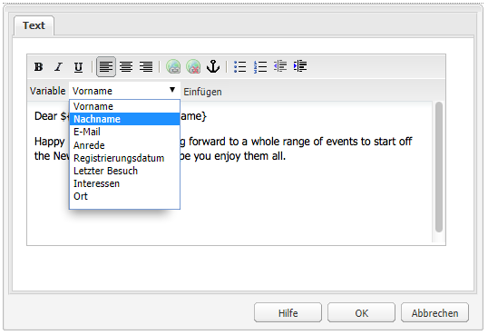

1. Drücken Sie Strg+Alt+C, um ClientContext zu öffnen, und wählen Sie **Laden**, um zu simulieren, wie die Variable beim Versenden dargestellt wird. Wählen Sie den Benutzer aus der Liste aus, dessen Profil Sie laden möchten, und klicken Sie auf **OK**.

   Die Informationen des geladenen Profils werden in die Variablen eingefügt.

   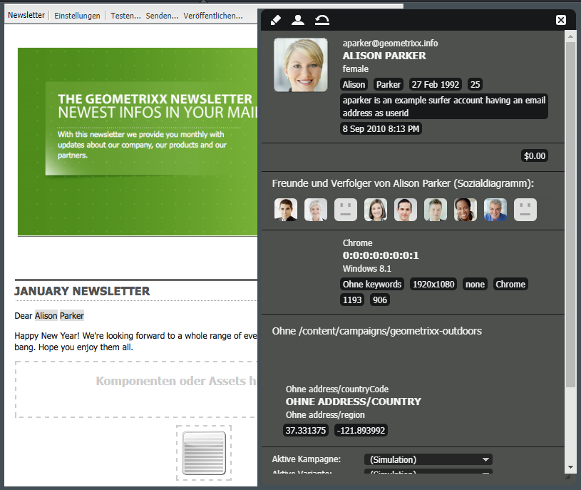

## Testen von Newslettern in verschiedenen E-Mail-Clients {#testing-newsletters-in-different-e-mail-clients}

>[!NOTE]
>
>Prüfen Sie vor dem Versand von Newslettern die OSGi-Konfiguration für Day CQ Link Externalizer unter `https://localhost:4502/system/console/configMgr`.
>
>Der Wert des Parameters ist standardmäßig `localhost:4502` und der Vorgang kann nicht abgeschlossen werden, wenn der Port für die aktive Instanz geändert wird.

Schalten Sie zwischen allgemeinen E-Mail-Clients um, um eine Ansicht des Newsletters für Ihre Leads anzuzeigen. Standardmäßig wird der Newsletter ohne ausgewählten E-Mail-Client geöffnet.

Derzeit können Sie Newsletter in einem der folgenden E-Mail-Clients anzeigen.

* Yahoo! Mail
* Gmail
* Hotmail
* Thunderbird
* Microsoft Outlook 2007
* Apple Mail

Um zwischen den Clients zu wechseln und den Newsletter in einem anderen E-Mail-Client anzuzeigen, klicken Sie auf das entsprechende Symbol:

1. Öffnen Sie im MCM den Newsletter, für den Sie Einstellungen anpassen möchten.

1. Klicken Sie in der oberen Leiste auf einen E-Mail-Client, um sich anzuschauen, wie der Newsletter in diesem Client dargestellt wird.

   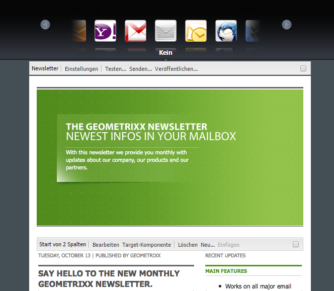

1. Wiederholen Sie diesen Schritt für alle weiteren E-Mail-Clients, die Sie testen möchten.

   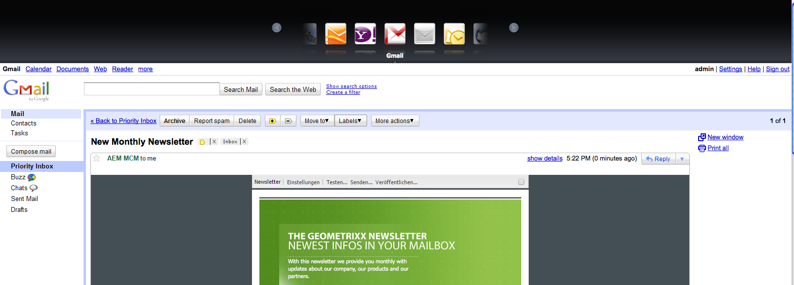

## Anpassen von Newsletter-Einstellungen {#customizing-newsletter-settings}

Auch wenn nur berechtigte Benutzer einen Newsletter versenden können, sollten Sie Folgendes anpassen:

* Den Betreff, damit Benutzer auch geneigt sind, Ihre E-Mail zu öffnen und um sicherzustellen, dass Ihr Newsletter nicht als Spam markiert wird.
* Die Von-Adresse, z.&amp;nbsp;B. noreply@geometrixx.com, damit Benutzer die E-Mail von einer bestimmten Adresse erhalten.

So passen Sie die Newsletter-Einstellungen an:

1. Öffnen Sie im MCM den Newsletter, für den Sie Einstellungen anpassen möchten.

   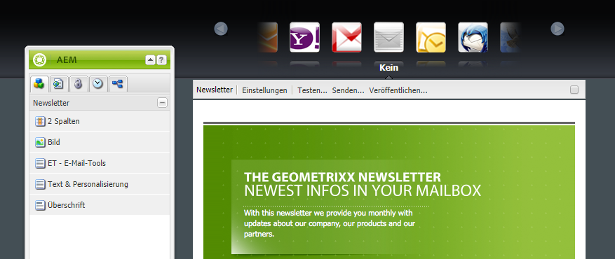

1. Klicken Sie oben im Newsletter auf **Einstellungen**.

   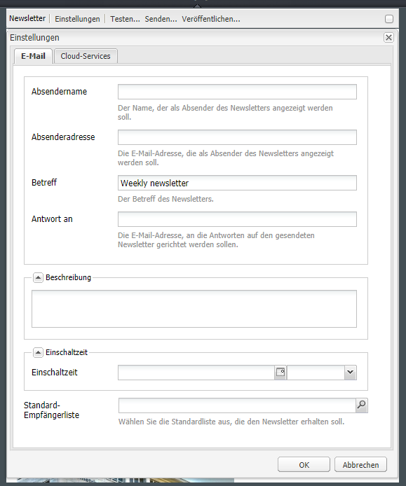
1. Geben Sie unter **Von** die E-Mail-Adresse ein.

1. Ändern Sie bei Bedarf den **Betreff** der E-Mail.

1. Wählen Sie aus der Dropdown-Liste eine **Standard-Empfängerliste** aus.

1. Klicken Sie auf **OK**.

   Wenn Sie den Newsletter testen oder versenden, erhalten die Empfänger E-Mails mit der angegebenen E-Mail-Adresse und dem festgelegten Betreff.

## Newsletter-Testlauf {#flight-testing-newsletters}

Ein Testlauf vor dem Versand des Newsletters ist nicht zwingend erforderlich, aber er bietet sich an, um sicherzustellen, dass er wie gewünscht dargestellt wird.

Mit Testläufen haben Sie folgende Möglichkeiten:

* Sehen Sie sich den Newsletter in [allen gewünschten Clients](#testing-newsletters-in-different-e-mail-clients) an.
* Stellen Sie sicher, dass der Mail-Server ordnungsgemäß eingerichtet ist.
* Ermitteln Sie, ob Ihre E-Mail als Spam eingestuft wird. (Stellen Sie sicher, dass Sie sich selbst in der Liste der Empfänger angeben.)

>[!NOTE]
>
>Sollten Sie E-Mail-Dienste aktualisieren, einen Testlauf durchführen oder einen Newsletter verschicken wollen, schlagen diese Aktionen fehl, wenn der Newsletter nicht zunächst in der Veröffentlichungsinstanz veröffentlicht wurde oder wenn diese Instanz nicht verfügbar ist. Stellen Sie sicher, dass Sie Ihren Newsletter veröffentlichen und die Veröffentlichungsinstanz ordnungsgemäß funktioniert.

So führen Sie einen Testlauf für Newsletter durch:

1. Öffnen Sie im MCM den Newsletter, den Sie testen und versenden möchten.

1. Klicken Sie oben im Newsletter auf **Testen**, um vor dem Versand einen Test durchzuführen.

   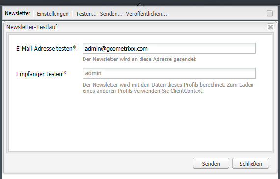

1. Geben Sie die Test-E-Mail-Adresse ein, an die der Newsletter geschickt werden soll und klicken Sie auf **Senden**. Wenn Sie das Profil ändern möchten, laden Sie ein anderes Profil in ClientContext. Drücken Sie dazu Strg+Alt+C und wählen Sie die Option „Laden“ aus. Laden Sie dann das gewünschte Profil.

## Versenden von Newslettern {#sending-newsletters}

>[!NOTE]
>
>Adobe plant nicht, die E-Mail-Verfolgung von über den AEM-SMTP-Dienst gesendeten offenen/zurückgesendeten (nicht zustellbaren) Nachrichten weiter auszubauen.
> Es wird deshalb empfohlen, [Adobe Campaign und dessen Integration mit AEM zu nutzen](/help/sites-administering/campaign.md).

Sie können einen Newsletter entweder aus dem Newsletter selbst oder aus der Liste versenden. Beide Methoden werden im Folgenden beschrieben.

>[!NOTE]
>
>Prüfen Sie vor dem Versand von Newslettern die OSGi-Konfiguration für Day CQ Link Externalizer unter `https://localhost:4502/system/console/configMgr`.
>
>Der Wert des Parameters ist standardmäßig `localhost:4502` und der Vorgang kann nicht abgeschlossen werden, wenn der Port für die aktive Instanz geändert wird.

>[!NOTE]
>
>Sollten Sie E-Mail-Dienste aktualisieren, einen Testlauf durchführen oder einen Newsletter verschicken wollen, schlagen diese Aktionen fehl, wenn der Newsletter nicht zunächst in der Veröffentlichungsinstanz veröffentlicht wurde oder wenn diese Instanz nicht verfügbar ist. Stellen Sie sicher, dass Sie Ihren Newsletter veröffentlichen und die Veröffentlichungsinstanz ordnungsgemäß funktioniert.

### Senden von Newslettern aus einer Kampagne heraus {#sending-newsletters-from-a-campaign}

So versenden Sie einen Newsletter aus einer Kampagne:

1. Öffnen Sie im MCM den Newsletter, den Sie versenden möchten.

   >[!NOTE]
   >
   >Stellen Sie vor dem Senden sicher, dass Sie den Betreff und die Absender-E-Mail-Adresse durch [Anpassung der Einstellungen](#customizing-newsletter-settings) personalisiert haben.
   >
   >
   >Vor dem Versenden des Newsletters wird ein [Newsletter-Testlauf](#flight-testing-newsletters) empfohlen.

1. Klicken Sie oben im Newsletter auf **Senden**. Der Newsletter-Assistent wird geöffnet.

1. Wählen Sie in der Liste der Empfänger die Liste aus, die den Newsletter erhalten soll und klicken Sie auf **Weiter**.

   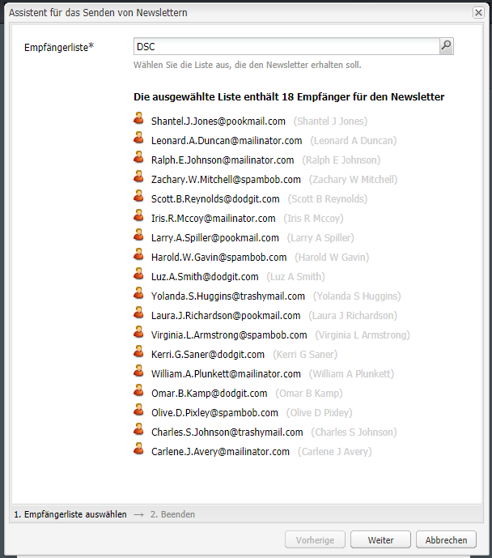

1. Es wird eine Bestätigung angezeigt, dass die Einrichtung abgeschlossen wurde. Klicken Sie auf **Senden**, um den Newsletter dann tatsächlich zu versenden.

   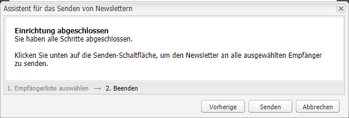

   >[!NOTE]
   >
   >Stellen Sie sicher, dass Sie einer der Empfänger sind, um auf diese Weise sicherzustellen, dass der Newsletter versandt wurde.

### Senden von Newslettern aus einer Liste heraus  {#sending-newsletters-from-a-list}

So versenden Sie einen Newsletter aus einer Liste:

1. Klicken Sie im MCM im linken Bereich auf **Listen**.

   >[!NOTE]
   >
   >Stellen Sie vor dem Senden sicher, dass Sie den Betreff und die Absender-E-Mail-Adresse durch [Anpassung der Einstellungen](#customizing-newsletter-settings) personalisiert haben. Sie können einen Newsletter nicht testen, wenn Sie ihn aus der Liste versenden. Sie können nur dann einen [Testlauf](#flight-testing-newsletters) durchführen, wenn Sie ihn aus dem Newsletter versenden.

1. Aktivieren Sie das Kontrollkästchen neben der Liste der Leads, an die Sie den Newsletter senden möchten.

1. Wählen Sie im Menü **Tools** die Option **Newsletter senden** aus. Das Fenster **Newsletter senden** wird geöffnet.

   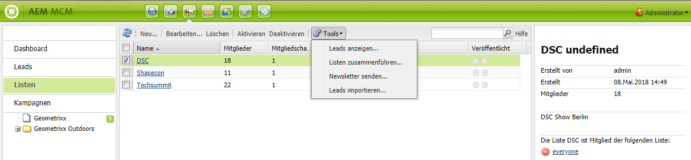

1. Wählen Sie im Feld **Newsletter** den Newsletter aus, den Sie senden möchten, und klicken Sie auf **Weiter**.

   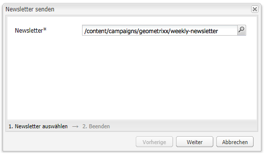

1. Es wird eine Bestätigung angezeigt, dass die Einrichtung abgeschlossen wurde. Klicken Sie auf **Senden**, um den ausgewählten Newsletter an die angegebene Liste der Leads zu senden.

   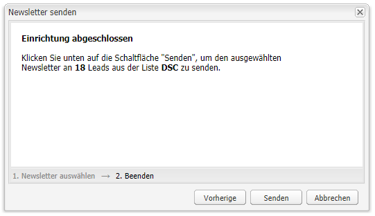

   Ihr Newsletter wird an die angegebenen Empfänger gesendet.

## Abonnieren von Newslettern {#subscribing-to-a-newsletter}

In diesem Abschnitt wird beschrieben, wie Sie einen Newsletter abonnieren können.

### Abonnieren von Newslettern  {#subscribing-to-a-newsletter-1}

Gehen Sie folgendermaßen vor, um einen Newsletter zu abonnieren (als Beispiel wird die Geometrixx-Website verwendet):

1. Klicken Sie auf **Websites**, navigieren Sie zur Geometrixx-**Symbolleiste** und öffnen Sie sie.

   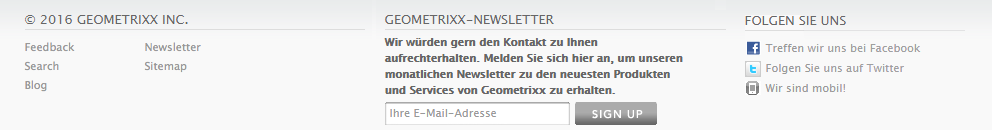

1. Geben Sie in dem Feld **Registrieren** in dem Geometrixx-Newsletter Ihre E-Mail-Adresse ein und klicken Sie auf **Registrieren**. Sie haben nun den Newsletter abonniert.
