# Landing Pages{#landing-pages}

Mit der Funktion für Einstiegsseiten können Sie schnell und einfach ein Design und Inhalte direkt in eine AEM-Seite importieren. Ein Web-Entwickler kann das HTML und zusätzliche Assets vorbereiten, die als komplette Seite oder nur als Teil einer Seite importiert werden können. Diese Funktion ist hilfreich beim Erstellen von Marketing-Einstiegsseiten, die nur für begrenzte Zeit aktiv sind und schnell erstellt werden müssen.

Auf dieser Seite wird Folgendes beschrieben:

* Aussehen von Einstiegsseiten in AEM einschließlich verfügbarer Komponenten
* Erstellen einer Einstiegsseite und Importieren eines Designpakets
* Arbeiten mit Einstiegsseiten in AEM
* Einrichten mobiler Einstiegsseiten

Das Vorbereiten des Designpakets für den Import wird unter [Erweitern und Konfigurieren des Design Importers](/help/sites-administering/extending-the-design-importer-for-landingpages.md) erläutert. Informationen zur Integration mit Adobe Analytics finden Sie unter [Einstiegsseiten mit Analytics integrieren](/help/sites-administering/integrating-landing-pages-with-adobe-analytics.md).

>[!CAUTION]
>
>Das Design-Importtool, das zum Import von Landingpages verwendet wurde, [ist ab AEM 6.5 nicht mehr verfügbar](/help/release-notes/deprecated-removed-features.md#deprecated-features).

>[!CAUTION]
>
>Da der Design Importer Zugriff auf `/apps` erfordert, funktioniert er nicht in containerisierten Cloud-Umgebungen, in denen `/apps` unveränderlich ist.

## Was sind Einstiegsseiten? {#what-are-landing-pages}

Einstiegsseiten sind Websites mit einer oder mehreren Seiten, die den „Endpunkt“ einer Marketingkampagne darstellen – beispielsweise mit E-Mail, Adwords/Bannern oder sozialen Medien. Eine Einstiegsseite kann verschiedenen Zwecken dienen, denen jedoch immer eins gemeinsam ist: Der Besucher soll eine Aufgabe erfüllen und dadurch wird der Erfolg der Einstiegsseite definiert.

Mit der Funktion „Einstiegsseiten“ in AEM können Marketingexperten mit Web-Designern in Agenturen oder internen Kreativteams gemeinsam Seitendesigns entwickeln, die ganz einfach in AEM importiert und weiterhin von den Marketingexperten bearbeitet und gemeinsam mit den anderen AEM-gestützten Websites veröffentlicht werden können.

In AEM erstellen Sie Einstiegsseiten mithilfe der folgenden Schritte:

1. Erstellen Sie eine Seite in AEM, die die Leinwandseite für die Einstiegsseiten enthält. Im Lieferumfang von AEM ist ein Beispiel namens **Importtool-Seite** enthalten.

1. [Bereiten Sie HTML und Assets vor.](/help/sites-administering/extending-the-design-importer-for-landingpages.md)
1. Komprimieren Sie die Ressourcen in einer ZIP-Datei, die hier als „Designpaket“ bezeichnet wird.
1. Importieren Sie das Designpaket in die Importtool-Seite. 
1. Bearbeiten und veröffentlichen Sie die Seite.

### Desktop-Einstiegsseiten  {#desktop-landing-pages}

Eine Beispiel-Einstiegsseite in AEM sieht wie folgt aus:

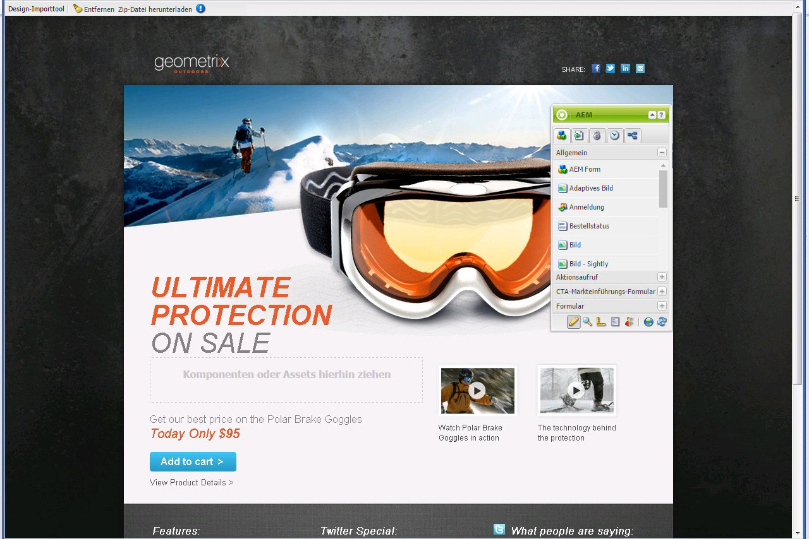

### Mobile Einstiegsseiten {#mobile-landing-pages}

Eine Einstiegsseite kann auch über eine mobile Version der Seite verfügen. Um über eine separate mobile Version der Landingpage zu verfügen, muss das Importdesign über zwei HTML-Dateien verfügen: *index.htm(l)* und *mobile.index.htm(l)*.

Der Importvorgang für die Einstiegsseite ist identisch mit jenem für eine normale Einstiegsseite, das Einstiegsseiten-Design verfügt über eine zusätzliche HTML-Datei, die der mobilen Einstiegsseite entspricht. Diese HTML-Datei muss genau wie die Desktop-Einstiegsseiten-HTML ebenfalls über ein Leinwand-`div` mit `id=cqcanvas` verfügen und sie unterstützt sämtliche bearbeitbaren Komponenten, die für die Desktop-Einstiegsseite beschrieben sind.

Die mobile Einstiegsseite wird als untergeordnetes Element der Desktop-Einstiegsseite erstellt. Um Sie zu öffnen, navigieren Sie in „Websites“ zur Einstiegsseite und öffnen Sie die untergeordnete Seite.

>[!NOTE]
>
>Die mobile Einstiegsseite wird zusammen mit der Desktop-Einstiegsseite gelöscht/deaktiviert, wenn diese gelöscht oder deaktiviert wird.

## Komponenten der Einstiegsseite  {#landing-page-components}

Um Teile des HTML zu markieren, damit diese beim Import in AEM bearbeitbar bleiben, können Sie Inhalt im Einstiegsseiten-HTML direkt AEM-Komponenten zuweisen. Das Design-Importtool erkennt standardmäßig die folgenden Komponenten:

* Text, für beliebigen Text
* Title, für Inhalt in H1-6-Tags
* Image, für Bilder, die austauschbar sein sollen
* Aktionsaufrufe

   * Clickthrough-Link
   * Grafischer Link

* CTA-Lead-Formular, zum Erfassen von Benutzerinformationen
* Paragraph System (Parsys), um das Hinzufügen beliebiger Komponenten bzw. das Konvertieren der obenstehenden Komponente zuzulassen

Außerdem ist es möglich, dies zu erweitern und benutzerdefinierte Komponenten zu unterstützen. In diesem Abschnitt werden die Komponenten im Detail beschrieben.

### Text {#text}

Mit der Text-Komponente können Sie über einen WYSIWYG-Editor einen Textblock eingeben. Weitere Informationen finden Sie unter [Text-Komponente](/help/sites-authoring/default-components.md#text).

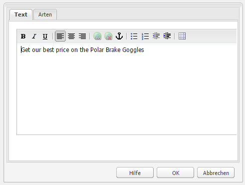

Im Folgenden finden Sie ein Beispiel für eine Text-Komponente auf einer Einstiegsseite:

#### Titel {#title}

In der title-Komponente können Sie einen Titel anzeigen und die Größe konfigurieren (h1-6). Weitere Informationen finden Sie unter [Titel-Komponente](/help/sites-authoring/default-components.md#title).

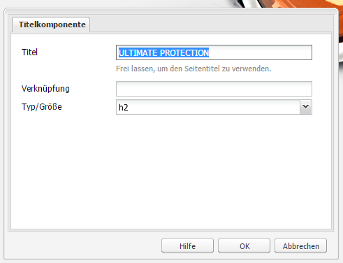

Im Folgenden finden Sie ein Beispiel für eine Titel-Komponente auf einer Einstiegsseite:

#### Bild {#image}

Die image-Komponente zeigt ein Bild an, das Sie entweder per Drag-and-Drop aus dem Content Finder ziehen oder per Klick hochladen können. Weitere Informationen finden Sie unter [Bild-Komponente](/help/sites-authoring/default-components.md).

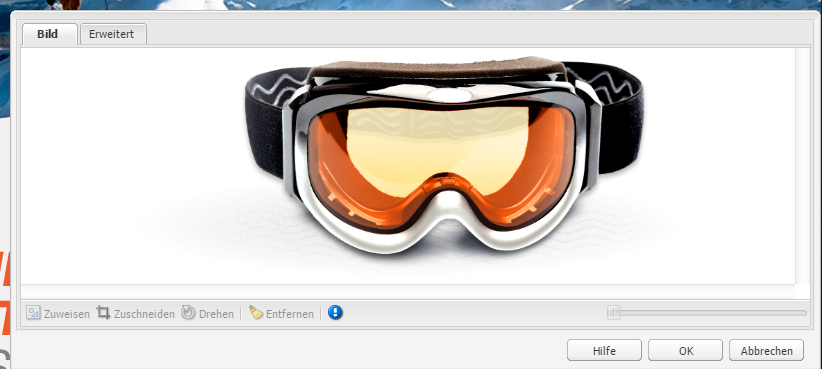

Im Folgenden finden Sie ein Beispiel für eine Bild-Komponenten auf einer Einstiegsseite:

#### Call to Action (CTA) {#call-to-action-cta}

Ein Einstiegsseiten-Design kann mehrere Links enthalten, einige davon können als Aktionsaufruf angelegt sein.

Ein Aktionsaufruf („Call to Action“, CTA) wird dazu verwendet, den Besucher unmittelbar zu einer Handlung aufzufordern. Beispiele hierfür sind „Jetzt abonnieren“, „Dieses Video ansehen“, „Nur für kurze Dauer“ und Ähnliches.

* Click Through-Link – Sie können einen Textlink hinzufügen. Wenn der Besucher auf diesen klickt, wird er zu einer Ziel-URL weitergeleitet.
* Grafischer Link - Sie können ein Bild hinzufügen. Wenn der Besucher darauf klickt, wird er zu einer Ziel-URL weitergeleitet.

Beide CTA-Komponenten verfügen über ähnliche Optionen. Der Click Through-Link verfügt über zusätzliche Rich-Text-Optionen. Diese Komponenten werden im Detail in den folgenden Absätzen beschrieben.

#### Click Through-Link {#click-through-link}

Diese CTA-Komponente kann dazu verwendet werden, der Einstiegsseite einen Textlink hinzuzufügen. Der Benutzer kann auf den Link klicken und wird dann zur in den Komponenteneigenschaften angegebenen URL weitergeleitet. All diese Beispiele sind Teil der Gruppe „Aktionsaufruf“.

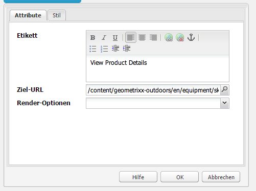

**** BeschriftungDer Text, den Benutzer sehen. Sie können die Formatierung mit dem Rich-Text-Editor anpassen.

**Ziel-** URL Geben Sie den URI ein, den Benutzer besuchen sollen, wenn sie auf den Text klicken.

**Rendering** OptionsBeschreibt Rendering-Optionen. Wählen Sie aus den Folgenden:

* Seite in neuem Browserfenster laden
* Seite in aktuellem Fenster laden
* Seite im übergeordneten Frame laden
* Alle Frames abbrechen und Seite im Vollbild-Browserfenster laden

**** CSSO Geben Sie auf der Registerkarte &quot;Stil&quot;einen Pfad zu Ihrem CSS-Stylesheet ein.

**** IDO Geben Sie auf der Registerkarte &quot;Stil&quot;eine ID für die Komponente ein, um sie eindeutig zu identifizieren.

Im Folgenden finden Sie ein Beispiel für einen Clickthrough-Link:

#### Grafischer Link {#graphical-link}

Diese CTA-Komponente kann dazu verwendet werden, ein beliebiges grafisches Bild mit Link auf der Einstiegsseite hinzuzufügen. Beim Bild kann es sich um eine einfache Schaltfläche oder um ein grafisches Bild als Hintergrund handeln. Wenn der Benutzer auf das Bild klickt, wird er zur in den Komponenteneigenschaften angegebenen Ziel-URL weitergeleitet. Es ist Teil der Gruppe **Aktionsaufruf**.

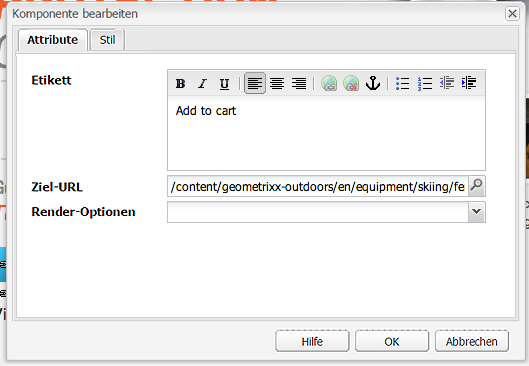

**** BeschriftungDer Text, den Benutzer in der Grafik sehen. Sie können die Formatierung mit dem Rich-Text-Editor anpassen.

**Ziel-** URL Geben Sie den URI ein, den Benutzer besuchen sollen, wenn sie auf das Bild klicken.

**Rendering** OptionsBeschreibt Rendering-Optionen. Wählen Sie aus den Folgenden:

* Seite in neuem Browserfenster laden
* Seite in aktuellem Fenster laden
* Seite im übergeordneten Frame laden
* Alle Frames abbrechen und Seite im Vollbild-Browserfenster laden

**** CSSO Geben Sie auf der Registerkarte &quot;Stil&quot;einen Pfad zu Ihrem CSS-Stylesheet ein.

**** IDO Geben Sie auf der Registerkarte &quot;Stil&quot;eine ID für die Komponente ein, um sie eindeutig zu identifizieren.

Im Folgenden finden Sie ein Beispiel für einen grafischen Link:

### Lead-Formular für Aktionsaufruf (CTA){#call-to-action-cta-lead-form}

Ein Lead-Formular ist ein Formular, das dazu verwendet wird, die Informationen eines Besuchers/Leads zu sammeln. Diese Informationen können gespeichert und später dazu verwendet werden, anhand dieser Informationen effizientes Marketing durchzuführen. Die Informationen enthalten im Allgemeinen Titel, Namen, E-Mail, Geburtsdatum, Adresse, Interessen usw. Sie sind Teil der Gruppe **CTA-Lead-Formular**.

Im Folgenden finden Sie ein Beispiel für ein CTA-Lead-Formular:

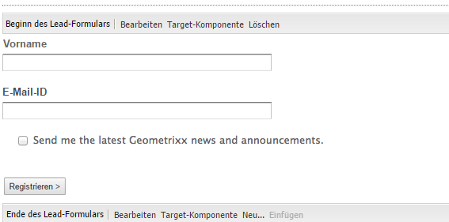

CTA-Lead-Formulare bestehen aus mehreren verschiedenen Komponenten:

* **Lead-Formular**
Die Lead-Formular-Komponente definiert den Beginn und das Ende eines neuen Lead-Formulars auf einer Seite. Andere Komponenten können dann zwischen diesen Elementen eingefügt werden, z. B. E-Mail-ID, Vorname usw.

* **Formularfelder und -elemente**
Formularfelder und -elemente können Textfelder, Optionsschaltflächen, Bilder usw. umfassen. Der Benutzer führt oft eine Aktion in einem Formularfeld aus, z. B. Eingabe von Text. Unter den Abschnitten für die einzelnen Formularelemente finden Sie weitere Informationen.

* **Profil-Komponenten**
Profil-Komponenten beziehen sich auf Besucherprofile, die für die Social Collaboration und andere Bereiche verwendet werden, für die eine Personalisierung erforderlich ist.

Das obige Beispiel zeigt ein Beispielformular. Es besteht aus der Komponente **Lead-Formular** (Start und Ende) mit den Feldern **Vorname** und **E-Mail-ID**, die für die Eingabe verwendet werden, und einem Feld **Senden** .

Im Sidekick sind folgende Komponenten für das CTA-Lead-Formular verfügbar:

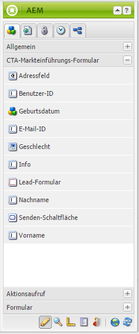

#### Gemeinsame Einstellungen vieler Formular-Komponenten {#settings-common-to-many-lead-form-components}

Zwar dient jede Lead-Formular-Komponente einem anderen Zweck, viele enthalten jedoch ähnliche Optionen und Parameter.

Wenn Sie eine beliebige Formular-Komponente konfigurieren, sind im Dialogfeld die folgenden Registerkarten verfügbar:

* **Titel und Text**
Hier müssen Sie grundlegende Informationen angeben, wie den Titel der Komponente und begleitenden Text. Gegebenenfalls können Sie hier auch andere Schlüsselinformationen definieren, z. B. ob für das Feld mehrere Auswahlen möglich sind und welche Elemente ausgewählt werden können.

* **Anfangswerte**
Ermöglicht Ihnen das Festlegen eines Standardwerts.

* **Beschränkungen**
Hier können Sie angeben, ob ein Feld erforderlich ist, und diese Beschränkungen für dieses Feld platzieren (z. B. ob nur numerische Werte zulässig sind).

* **Stile**
Gibt die Größe und den Stil der Felder an.

>[!NOTE]
>
>Die angezeigten Felder können je nach Komponente unterschiedlich groß sein.
>
>Nicht alle Optionen stehen für alle Lead-Formular-Komponenten zur Verfügung. Unter „Formulare“ finden Sie weitere Informationen zu diesen [allgemeinen Einstellungen](/help/sites-authoring/default-components.md#formsgroup).

#### Lead-Formular-Komponenten {#lead-form-components}

Im folgenden Abschnitt werden die Komponenten beschrieben, die in CTA-Lead-Formularen verfügbar sind.

**** Info Ermöglicht Benutzern das Hinzufügen von Informationen.

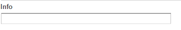

**Adressfeld** Ermöglicht Benutzern die Eingabe von Adressinformationen. Wenn Sie diese Komponente konfigurieren, müssen Sie im Dialogfeld den Elementnamen eingeben. Der Elementname ist der Name des Formularelements. Gibt an, wo im Repository die Daten gespeichert werden.

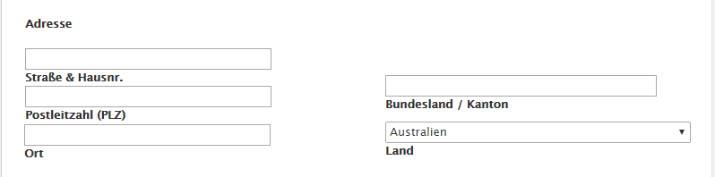

**Datum der** GeburtBenutzer können Informationen zum Geburtsdatum eingeben.

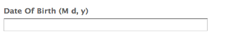

**Email** IdErmöglicht Benutzern die Eingabe einer E-Mail-Adresse (Identifikation).

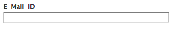

**Vorname** Stellt ein Feld bereit, in das Benutzer ihren Vornamen eingeben können.

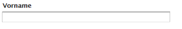

**** GenderUsers können ihr Geschlecht aus einer Dropdown-Liste auswählen.

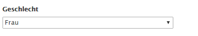

**Last** NameBenutzer können Nachname-Informationen eingeben.

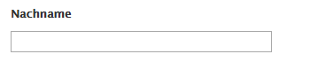

**Lead** FormularFügen Sie diese Komponente hinzu, um ein Lead-Formular zu Ihrer Landingpage hinzuzufügen. Ein Lead-Formular enthält automatisch die Felder Beginn des Lead-Formulars und Ende des Lead-Formulars. Zwischen diesen Feldern fügen Sie die in diesem Abschnitt beschriebenen Lead-Formular-Komponenten hinzu.

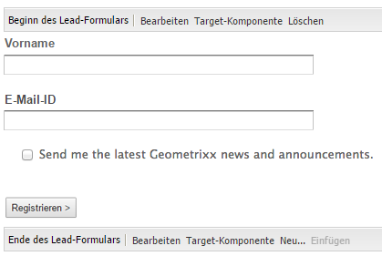

Die Komponente Lead-Formular definiert den Beginn und das Ende eines Formulars mithilfe der Elemente **Formular-Start** und **Formular-Ende**. Diese treten immer gemeinsam auf, damit das Formular ordnungsgemäß definiert wird.

Wenn Sie das Lead-Formular bearbeitet haben, können Sie den Start oder das Ende des Formulars konfigurieren, indem Sie in der entsprechenden Leiste auf **Bearbeiten** klicken.

**Beginn des Lead-Formulars**

Für die Konfiguration sind zwei Registerkarten verfügbar: **Formular** und **Erweitert**:

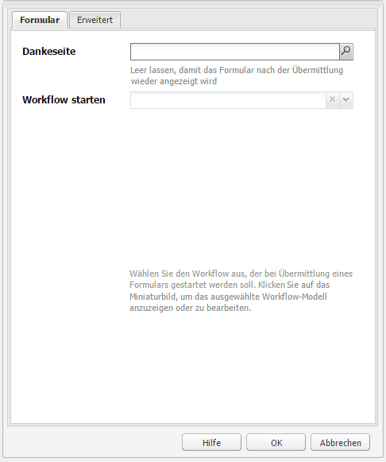

**Danksagungsseite**
Die Seite, auf die verwiesen wird, um Besuchern für ihre Eingabe zu danken. Wenn dies leer gelassen wird, wird das Formular nach der Übermittlung erneut angezeigt.

**Start** WorkflowBestimmt, welcher Workflow ausgelöst wird, sobald ein Lead-Formular gesendet wird.

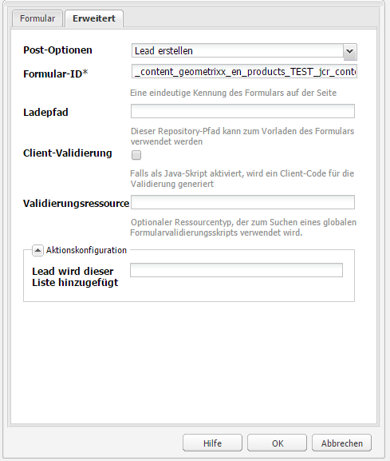

**Beitragsoptionen** Die folgenden Beitragsoptionen sind verfügbar:

* Lead erstellen
* E-Mail-Dienst: Abonnenten erstellen und zu Liste hinzufügen - Verwenden Sie diese Option, wenn Sie einen E-Mail-Dienstanbieter wie ExactTarget nutzen.
* Email Service: Automatische Antwort-E-Mail senden - Verwenden Sie diese Option, wenn Sie einen E-Mail-Dienstanbieter wie ExactTarget verwenden.
* Email Service: Benutzer von Liste abmelden - Verwenden Sie diese Option, wenn Sie einen E-Mail-Dienstanbieter wie ExactTarget verwenden.
* Benutzer entfernen

**Formular-** ID Die Formular-ID identifiziert das Lead-Formular eindeutig. Verwenden Sie die Formular-ID, wenn sich mehrere Formulare auf einer Seite befinden. Achten Sie darauf, dass die Formulare unterschiedliche IDs haben.

**Load** PathDer Pfad zu den Knoteneigenschaften, die zum Laden vordefinierter Werte in die Lead-Formularfelder verwendet werden.

Dies ist ein optionales Feld, das den Pfad zu einem Knoten im Repository angibt. Wenn dieser Knoten Eigenschaften hat, die den Feldnamen entsprechen, werden die jeweiligen Felder im Formular vorab mit den Werten dieser Eigenschaften ausgefüllt. Wenn keine Übereinstimmung besteht, steht im Feld der Standardwert.

**Client-** Validierung Gibt an, ob für dieses Formular eine Client-Validierung erforderlich ist (Server-Überprüfung findet immer statt). Dies kann in Verbindung mit der Forms Captcha-Komponente erreicht werden.

**Validation Resource** TypeDefiniert den Formularvalidierungsressourcentyp, wenn Sie das gesamte Lead-Formular (anstelle einzelner Felder) überprüfen möchten.

Wenn Sie das gesamte Formular überprüfen, führen Sie auch eine der folgenden Aufgaben aus:

* Ein Skript zur Client-Überprüfung:
   ` /apps/<myApp>/form/<myValidation>/formclientvalidation.jsp`

* Ein Skript zur Überprüfung auf der Server-Seite:
   ` /apps/<myApp>/form/<myValidation>/formservervalidation.jsp`

**Aktionskonfiguration** Abhängig von der Auswahl unter Beitragsoptionen ändert sich die Aktionskonfiguration. Wenn Sie z. B. Lead erstellen wählen, können Sie konfigurieren, welcher Liste der Lead hinzugefügt werden soll.

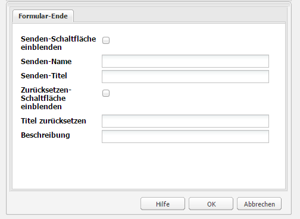

* **Senden-Schaltfläche einblenden**
Gibt an, ob eine Senden-Schaltfläche angezeigt werden soll.

* **Senden-Name**
Eine ID, die erforderlich ist, wenn Sie mehrere Senden-Schaltflächen in einem Formular verwenden.

* **Senden-Titel**
Der Name, der auf der Schaltfläche angezeigt wird, z. B. „Senden“ oder „Übermitteln“.

* **Zurücksetzen-Schaltfläche einblenden**
Aktivieren Sie das Kontrollkästchen, um die Schaltfläche zum Zurücksetzen einzublenden.

* **Titel zurücksetzen**
Der Name, der auf der Schaltfläche zum Zurücksetzen angezeigt wird.

* **Beschreibung**
Informationen, die unter der Schaltfläche angezeigt werden.

## Erstellen einer Einstiegsseite {#creating-a-landing-page}

Beim Erstellen einer Einstiegsseite müssen Sie drei Schritte ausführen:

1. Erstellen Sie eine Importtool-Seite.
1. [Bereiten Sie das HTML für den Import vor.](/help/sites-administering/extending-the-design-importer-for-landingpages.md)
1. Importieren Sie das Designpaket.

### Verwendung des Design-Importtools  {#use-of-the-design-importer}

Da der Import von Seiten die Vorbereitung von HTML umfasst, wird die Überprüfung und das Testen der Seiten sowie der Import von Landingpages als Admin-Aufgabe betrachtet. Der Administrator, der den Import ausführt, benötigt Lese-, Schreib-, Erstellungs- und Löschberechtigungen für `/apps`. Wenn der Benutzer nicht über diese Berechtigungen verfügt, schlägt der Import fehl.

>[!NOTE]
>
>Da das Design Importer als Admin-Tool gedacht ist, für das Lese-, Schreib-, Erstellungs- und Löschberechtigungen für `/apps` erforderlich sind, empfiehlt Adobe nicht, das Design Importer in der Produktion zu verwenden.

Adobe empfiehlt, das Design-Importtool auf einer Staging-Instanz zu verwenden. Auf einer Staging-Instanz kann der Import von einem Entwickler getestet und geprüft werden, der dann für die Bereitstellung des Codes für die Produktionsinstanz zuständig ist.

### Erstellen einer Importtool-Seite {#creating-an-importer-page}

Damit Sie Ihr Einstiegsseitendesign importieren können, müssen Sie eine Importtool-Seite erstellen. Dies ist z. B. unter einer Kampagne möglich. Mit der Vorlage „Importtool-Seite“ können Sie Ihre komplette HTML-Einstiegsseite importieren. Die Seite enthält einen Ablagebereich, in den das Designpaket für die Einstiegsseite per Drag-and-Drop importiert werden kann.

>[!NOTE]
>
>Standardmäßig kann eine Importtool-Seite nur unter Kampagnen erstellt werden. Sie können diese Vorlage jedoch auch überlagern, um eine Landingpage unter `/content/mysite` zu erstellen.

So erstellen Sie eine neue Einstiegsseite:

1. Wechseln Sie zur **Websites-Konsole**.
1. Wählen Sie im linken Bereich Ihre Kampagne aus.
1. Wählen Sie **Neu**, um das Fenster **Seite erstellen** zu öffnen.
1. Wählen Sie die Vorlage **Importtool-Seite** aus, fügen Sie einen Titel und optional einen Namen hinzu und klicken Sie auf **Erstellen**.

   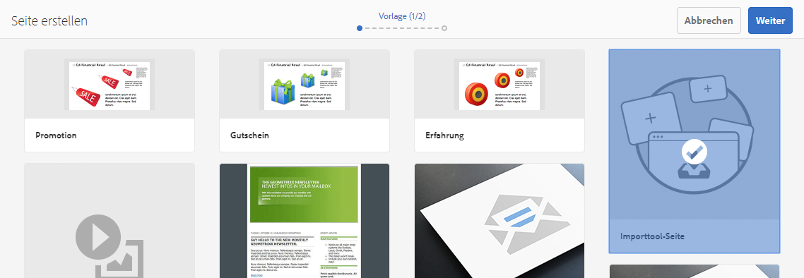

   Ihre neue Importtool-Seite wird angezeigt.

### Vorbereiten des HTML für den Import {#preparing-the-html-for-import}

Vor dem Import des Designpakets muss das HTML vorbereitet werden. Weitere Informationen finden Sie unter [Erweitern und Konfigurieren des Design-Importtools](/help/sites-administering/extending-the-design-importer-for-landingpages.md).

### Importieren des Designpakets  {#importing-the-design-package}

Wenn Sie eine Importtool-Seite erstellt haben, können Sie ein Designpaket importieren. Details zum Erstellen des Designpakets und der empfohlenen Struktur werden unter [Erweitern und Konfigurieren des Design Importers](/help/sites-administering/extending-the-design-importer-for-landingpages.md) erläutert.

Nachdem Sie das Designpaket fertiggestellt haben, können Sie es folgendermaßen in eine Importtool-Seite importieren.

1. Öffnen Sie die Importtool-Seite, [die Sie zuvor erstellt haben](#creatingablankcanvaspage).

   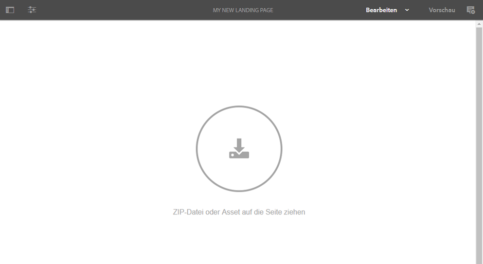

1. Ziehen Sie das Designpaket per Drag-and-Drop auf den Ablagebereich. Beachten Sie, dass die Richtung des Pfeiles sich ändert, wenn ein Paket darüber gezogen wird.
1. Als Ergebnis des Drag-and-Drop-Vorgangs sehen Sie Ihre Einstiegsseite anstatt der Importtool-Seite. Ihre HTML-Landingpage wurde erfolgreich importiert.

   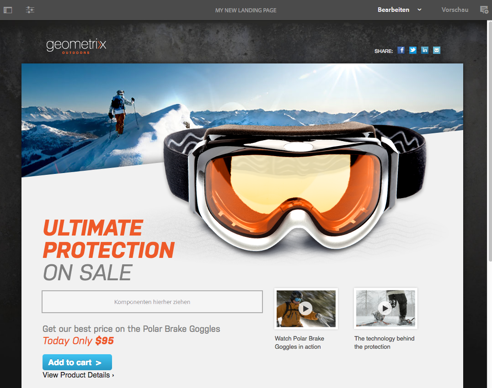

>[!NOTE]
>
>Nach dem Importieren wird das Markup aus Sicherheitsgründen bereinigt, um den Import und die Veröffentlichung von ungültigem Markup zu verhindern. Dabei wird davon ausgegangen, dass sämtliches reines HTML-Markup und alle anderen Elemente Wie Inline-SVG oder Webkomponenten herausgefiltert werden.

>[!NOTE]
>
>Wenn Sie Probleme beim Importieren des Designpakets haben, finden Sie weitere Informationen unter [Fehlerbehebung](/help/sites-administering/extending-the-design-importer-for-landingpages.md#troubleshooting).

## Arbeiten mit Einstiegsseiten {#working-with-landing-pages}

Das Design und die Assets für eine Einstiegsseite werden im Allgemeinen von einem Designer, häufig in einer Agentur, in branchenüblichen Tools wie Adobe Photoshop oder Adobe Dreamweaver erstellt. Wenn das Design vollständig ist, sendet der Designer eine Zip-Datei mit sämtlichen Assets an die Marketing-Abteilung. Der Kontakt in der Marketing-Abteilung ist dann für das Ablegen der Zip-Datei in AEM und die Veröffentlichung des Inhalts verantwortlich.

Außerdem muss der Designer unter Umständen nach dem Import Veränderungen an der Einstiegsseite vornehmen, indem er Inhalte bearbeitet oder löscht und die Aktionsaufruf-Komponenten konfiguriert. Schließlich möchte der Marketing-Experte eine Vorschau der Einstiegsseite anzeigen und die Kampagne dann aktivieren, um sicherzustellen, dass die Einstiegsseite darin veröffentlicht ist.

In diesem Abschnitt werden folgende Vorgänge beschrieben:

* Löschen einer Einstiegsseite
* Herunterladen des Designpakets
* Anzeigen wichtiger Informationen
* Zurücksetzen einer Einstiegsseite
* [Konfigurieren der CTA-Komponenten und Hinzufügen von Inhalt zur Seite](#call-to-action-cta)
* Vorschau der Einstiegsseite anzeigen
* Aktivieren/Veröffentlichen der Einstiegsseite

Wenn Sie das Designpaket importieren, stehen die Optionen **Design löschen** und **Importierte ZIP-Datei herunterladen** im Einstellungsmenü der Seite zur Verfügung:

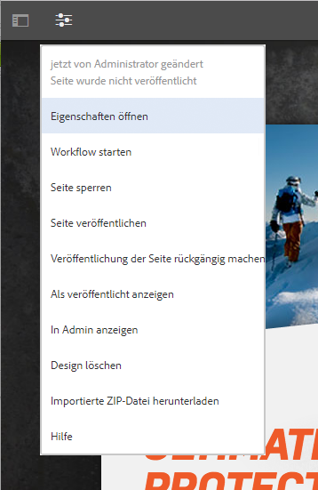

### Herunterladen des importierten Designpakets {#downloading-the-imported-design-package}

Beim Herunterladen der Zip-Datei können Sie aufzeichnen, welche Zip-Datei mit einer bestimmten Einstiegsseite importiert wurde. Beachten Sie, dass an einer Seite vorgenommene Änderungen nicht der Zip-Datei hinzugefügt werden.

Klicken Sie zum Herunterladen des importierten Designpakets in der Symbolleiste der Einstiegsseite auf **ZIP-Datei herunterladen**.

### Anzeigen wichtiger Informationen  {#viewing-import-information}

Sie können zu jedem Zeitpunkt Informationen zum letzten Import anzeigen, indem Sie in der klassischen Benutzeroberfläche oben auf der Einstiegsseite auf das blaue Ausrufezeichen klicken.

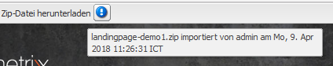

Wenn im importierten Designpaket Probleme auftreten, weil es z. B. auf Bilder/Skripts verweist, die nicht im Paket enthalten sind, werden solche Probleme im Design Importer in Form einer Liste angezeigt. Um die Liste der Probleme anzuzeigen, klicken Sie in der klassischen Benutzeroberfläche in der Symbolleiste der Einstiegsseite auf den Link „Probleme“. Wenn Sie in der folgenden Abbildung auf den Link **Probleme** klicken, wird das Fenster Importprobleme geöffnet.

### Zurücksetzen einer Einstiegsseite {#resetting-a-landing-page}

Wenn Sie das Designpaket für Ihre Einstiegsseite erneut importieren möchten, nachdem Sie Änderungen daran vorgenommen haben, können Sie die Einstiegsseite löschen, indem Sie in der klassischen Benutzeroberfläche am oberen Rand der Einstiegsseite auf **Entfernen** klicken oder in der Touch-optimierten Benutzeroberfläche im Einstellungsmenü auf „Entfernen“ klicken. Dadurch wird die importierte Einstiegsseite gelöscht und stattdessen wird eine leere Importtool-Seite erstellt.

Wenn Sie die Einstiegsseite entfernen, können Sie die Inhaltsänderungen löschen. Wenn Sie auf **Nein** klicken, bleiben die Inhaltsänderungen erhalten, d. h. die Struktur unter `jcr:content/importer`bleibt erhalten und nur die Importtool-Seitenkomponente und die Ressourcen in `etc/design` werden entfernt. Wenn Sie hingegen auf **Ja** klicken, wird auch `jcr:content/importer` entfernt.

>[!NOTE]
>
>Wenn Sie sich entscheiden, sämtliche Inhaltsänderungen zu löschen, gehen sämtliche Änderungen, die Sie an der importierten Einstiegsseite vorgenommen haben, sowie sämtliche Seiteneigenschaften verloren, wenn Sie auf **Entfernen** klicken.

### Bearbeiten und Hinzufügen von Komponenten auf einer Einstiegsseite {#modifying-and-adding-components-on-a-landing-page}

Um Komponenten auf der Einstiegsseite zu bearbeiten, doppelklicken Sie darauf, um sie zu öffnen, und bearbeiten Sie sie wie jede andere Komponente.

Sie können Komponenten per Drag-and-Drop auf der Einstiegsseite hinzufügen – entweder aus dem Sidekick in der klassischen Benutzeroberfläche oder aus der Komponentenseite in der Touch-optimierten Benutzeroberfläche – und diese bearbeiten.

>[!NOTE]
>
>Wenn eine Komponente auf der Einstiegsseite nicht bearbeitet werden kann, müssen Sie die ZIP-Datei erneut importieren, nachdem Sie die [HTML-Datei bearbeitet haben.](/help/sites-administering/extending-the-design-importer-for-landingpages.md) Dies bedeutet, dass die nicht bearbeitbaren Teile während des Imports nicht in AEM-Komponenten konvertiert wurden.

### Löschen einer Einstiegsseite  {#deleting-a-landing-page}

Einstiegsseiten werden genau wie normale AEM-Seiten gelöscht.

Der einzige Unterschied liegt darin, dass Sie bei Löschen einer Desktop-Einstiegsseite auch die entsprechende mobile Einstiegsseite (sofern vorhanden) löschen, nicht jedoch umgekehrt.

### Veröffentlichen einer Einstiegsseite  {#publishing-a-landing-page}

Sie können die Landingpage und alle zugehörigen Abhängigkeiten wie eine normale Seite veröffentlichen.

>[!NOTE]
>
>Beim Veröffentlichen einer Desktop-Einstiegsseite wird auch die entsprechende mobile Version veröffentlicht (sofern vorhanden). Wenn Sie eine mobile Einstiegsseite veröffentlichen, wird die Desktop-Version jedoch nicht veröffentlicht.
