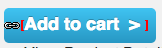

# Einstiegsseiten{#landing-pages}

Mit der Funktion für Einstiegsseiten können Sie schnell und einfach ein Design und Inhalte direkt in eine AEM-Seite importieren. Ein Web-Entwickler kann das HTML und zusätzliche Assets vorbereiten, die als komplette Seite oder nur als Teil einer Seite importiert werden können. Die Funktion ist nützlich, um Landing Pages für das Marketing zu erstellen, die nur für eine begrenzte Zeit aktiv sind und schnell erstellt werden müssen.

Diese Seite beschreibt Folgendes:

* Wie Landing Pages in AEM mit den verfügbaren Komponenten aussehen
* Erstellen einer Landingpage und Importieren eines Design-Pakets
* Arbeiten mit Landing Pages in AEM
* Einrichten mobiler Landing Pages

Die Vorbereitung des Design-Pakets für den Import wird unter [Erweitern und Konfigurieren des Design-Import-Tools](/help/sites-administering/extending-the-design-importer-for-landingpages.md) beschrieben. Die Integration in Adobe Analytics wird unter [Integrieren von Einstiegsseiten mit Adobe Analytics](/help/sites-administering/integrating-landing-pages-with-adobe-analytics.md) beschrieben.

>[!CAUTION]
>
>Das Design-Import-Tool zum Importieren von Einstiegsseiten [ist seit AEM 6.5 veraltet](/help/release-notes/deprecated-removed-features.md#deprecated-features).

>[!CAUTION]
>
>Da das Design-Import-Tool Zugriff auf `/apps` erfordert, funktioniert es in containerisierten Cloud-Umgebungen nicht, in denen `/apps` unveränderlich ist.

## Was sind Landing Pages? {#what-are-landing-pages}

Landingpages sind einzelne oder mehrseitige Websites, die den &quot;Endpunkt&quot;einer Marketing-Zielgruppe darstellen, z. B. mit E-Mail, Adwords/Bannern und sozialen Medien. Eine Landingpage kann verschiedenen Zwecken dienen, die jedoch alle eins gemeinsam haben – die Person, die die Seite besucht, sollte eine Aufgabe erfüllen, wodurch sich der Erfolg einer Landingpage definiert.

Mit der Landing Pages-Funktion in AEM können Marketing-Fachleute mit Web-Designerinnen und -Designern in Agenturen oder internen Kreativ-Teams zusammenarbeiten, um Seitenentwürfe zu erstellen, die einfach in AEM importiert und von Marketing-Fachleuten bearbeitet und unter der gleichen Governance wie die übrigen AEM-gesteuerten Sites veröffentlicht werden können.

Gehen Sie in AEM wie folgt vor, um Landing Pages zu erstellen:

1. Erstellen Sie eine Seite in AEM, die die Leinwandseite für die Einstiegsseiten enthält. Im Lieferumfang von AEM ist ein Beispiel namens **Import-Tool-Seite** enthalten.

1. [Bereiten Sie HTML und Assets vor.](/help/sites-administering/extending-the-design-importer-for-landingpages.md)
1. Komprimieren Sie die Ressourcen in einer ZIP-Datei, die hier als „Designpaket“ bezeichnet wird.
1. Importieren Sie das Designpaket in die Import-Tool-Seite. 
1. Ändern und veröffentlichen Sie die Seite.

### Landing Pages für Desktops {#desktop-landing-pages}

Eine Landingpage in AEM sieht wie folgt aus:

### Mobile Landing Pages {#mobile-landing-pages}

Eine Einstiegsseite kann auch über eine mobile Version der Seite verfügen. Wenn Sie über eine separate mobile Version der Einstiegsseite verfügen möchten, muss das Importdesign zwei HTML-Dateien aufweisen: *index.htm(l)* und *mobile.index.htm(l)*.

Der Importvorgang für die Einstiegsseite ist identisch mit jenem für eine normale Einstiegsseite, das Einstiegsseiten-Design verfügt über eine zusätzliche HTML-Datei, die der mobilen Einstiegsseite entspricht. Diese HTML-Datei muss genau wie die Desktop-Einstiegsseiten-HTML ebenfalls über ein Leinwand-`div` mit `id=cqcanvas` verfügen und sie unterstützt sämtliche bearbeitbaren Komponenten, die für die Desktop-Einstiegsseite beschrieben sind.

Die mobile Einstiegsseite wird als untergeordnetes Element der Desktop-Einstiegsseite erstellt. Um sie zu öffnen, navigieren Sie zur Landingpage der Websites und öffnen Sie die untergeordnete Seite.

>[!NOTE]
>
>Die mobile Landingpage wird zusammen mit der Desktop-Landingpage gelöscht/deaktiviert, wenn die Desktop-Landingpage gelöscht oder deaktiviert wird.

## Komponenten einer Landingpage {#landing-page-components}

Um Teile des HTML zu markieren, damit diese beim Import in AEM bearbeitbar bleiben, können Sie Inhalt im Einstiegsseiten-HTML direkt AEM-Komponenten zuweisen. Das Design-Import-Tool versteht standardmäßig folgende Komponenten:

* Text, für jede Art von Text
* Titel, für Inhalt in H1-6-Tags
* Bild, für Bilder, die austauschbar sein sollten
* Aktionsaufrufe:

   * Clickthrough-Link
   * Grafischer Link

* CTA-Lead-Formular zum Erfassen von Benutzerinformationen
* Absatzsystem (Parsys), zum Hinzufügen beliebiger Komponenten oder Konvertieren der obigen Komponente

Außerdem ist es möglich, dies zu erweitern und benutzerdefinierte Komponenten zu unterstützen. In diesem Abschnitt werden die Komponenten im Detail beschrieben.

### Text {#text}

Mit der Text-Komponente können Sie über einen WYSIWYG-Editor einen Textblock eingeben. Weitere Informationen finden Sie unter [Textkomponente](/help/sites-authoring/default-components.md#text).

Im Folgenden finden Sie ein Beispiel für eine Text-Komponente auf einer Einstiegsseite:

#### Titel {#title}

In der title-Komponente können Sie einen Titel anzeigen und die Größe konfigurieren (h1-6). Weitere Informationen finden Sie unter [Titelkomponente](/help/sites-authoring/default-components.md#title).

Im Folgenden finden Sie ein Beispiel für eine Titel-Komponente auf einer Einstiegsseite:

#### Bild {#image}

Die image-Komponente zeigt ein Bild an, das Sie entweder per Drag-and-Drop aus dem Content Finder ziehen oder per Klick hochladen können. Weitere Informationen finden Sie unter [Bildkomponente](/help/sites-authoring/default-components.md).

Im Folgenden finden Sie ein Beispiel für eine Bild-Komponenten auf einer Einstiegsseite:

#### Aktionsaufruf (CTA) {#call-to-action-cta}

Das Design einer Landingpage kann mehrere Links enthalten, von denen einige als Aktionsaufrufe angelegt sein können.

Aktionsaufrufe (CTA) werden verwendet, um Besucher dazu zu bringen, sofort auf der Landingpage Maßnahmen zu ergreifen, z. B. &quot;Jetzt anmelden&quot;, &quot;Dieses Video anzeigen&quot;, &quot;Nur für begrenzte Zeit&quot;usw.

* Clickthrough-Link: Sie können einen Text-Link hinzufügen. Wer auf diesen klickt, wird zu einer Ziel-URL weitergeleitet.
* Grafischer Link: Sie können ein Bild hinzufügen. Wer darauf klickt, wird zu einer Ziel-URL weitergeleitet.

Beide CTA-Komponenten verfügen über ähnliche Optionen. Der Click Through-Link verfügt über zusätzliche Rich-Text-Optionen. Die Komponenten werden in den folgenden Abschnitten detailliert beschrieben.

#### Clickthrough-Link {#click-through-link}

Diese CTA-Komponente kann dazu verwendet werden, der Einstiegsseite einen Textlink hinzuzufügen. Der Benutzer kann auf den Link klicken und wird dann zur in den Komponenteneigenschaften angegebenen URL weitergeleitet. Es ist Teil der Gruppe „Aktionsaufruf“.

**Beschriftung**: Der Text, den Benutzer sehen. Sie können die Formatierung mit dem Rich-Text-Editor anpassen.

**Ziel-URL**: Geben Sie den URI ein, zu dem Benutzer beim Klicken auf den Text weitergeleitet werden sollen.

**Rendering-Optionen**: Beschreibt Render-Optionen. Ihnen stehen die folgenden Optionen zur Auswahl:

* Seite in neuem Browser-Fenster laden
* Seite im aktuellen Fenster laden
* Seite im übergeordneten Frame laden
* Alle Frames abbrechen und Seite in Vollbild-Browser-Fenster laden

**CSS**: Geben Sie auf der Registerkarte „Stil“ einen Pfad zu Ihrem CSS-Stylesheet ein.

**ID**: Geben Sie auf der Registerkarte „Stil“ eine eindeutige ID für die Komponente ein.

Im Folgenden finden Sie ein Beispiel für einen Clickthrough-Link:

#### Grafischer Link {#graphical-link}

Diese CTA-Komponente kann dazu verwendet werden, ein beliebiges grafisches Bild mit Link auf der Einstiegsseite hinzuzufügen. Beim Bild kann es sich um eine einfache Schaltfläche oder um ein grafisches Bild als Hintergrund handeln. Wenn der Benutzer auf das Bild klickt, wird er zur in den Komponenteneigenschaften angegebenen Ziel-URL weitergeleitet. Gehört zur Gruppe **Aktionsaufruf**.

**Beschriftung**: Der Text, der Benutzern in der Grafik angezeigt wird. Sie können die Formatierung mit dem Rich-Text-Editor anpassen.

**Ziel-URL**: Geben Sie die URL ein, zu dem Benutzer beim Klicken auf das Bild weitergeleitet werden sollen.

**Rendering-Optionen**: Beschreibt Render-Optionen. Ihnen stehen die folgenden Optionen zur Auswahl:

* Seite in neuem Browser-Fenster laden
* Seite im aktuellen Fenster laden
* Seite im übergeordneten Frame laden
* Alle Frames abbrechen und Seite in Vollbild-Browser-Fenster laden

**CSS**: Geben Sie auf der Registerkarte „Stil“ einen Pfad zu Ihrem CSS-Stylesheet ein.

**ID**: Geben Sie auf der Registerkarte „Stil“ eine eindeutige ID für die Komponente ein.

Im Folgenden finden Sie ein Beispiel für einen grafischen Link:

### Lead-Formular für Aktionsaufrufe (CTA) {#call-to-action-cta-lead-form}

Ein Lead-Formular ist ein Formular, das dazu verwendet wird, die Informationen eines Besuchers/Leads zu sammeln. Diese Informationen können gespeichert und später dazu verwendet werden, anhand dieser Informationen effizientes Marketing durchzuführen. Die Informationen enthalten im Allgemeinen Titel, Namen, E-Mail, Geburtsdatum, Adresse, Interessen usw. Gehört zur Gruppe **CTA-Lead-Formular**.

Nachfolgend ein Beispiel für ein CTA-Lead-Formular:

CTA-Lead-Formulare bestehen aus mehreren verschiedenen Komponenten:

* **Lead-Formular**
Die Lead-Formular-Komponente definiert den Beginn und das Ende eines neuen Lead-Formulars auf einer Seite. Andere Komponenten können dann zwischen diesen Elementen eingefügt werden, z. B. E-Mail-ID und Vorname.

* **Formularfelder und -elemente**
Formularfelder und -elemente können Textfelder, Optionsschaltflächen, Bilder usw. umfassen. Der Benutzer führt oft eine Aktion in einem Formularfeld aus, z. B. Eingabe von Text. Unter den Abschnitten für die einzelnen Formularelemente finden Sie weitere Informationen.

* **Profil-Komponenten**
Profil-Komponenten beziehen sich auf Besucherprofile, die für die Social Collaboration und andere Bereiche verwendet werden, für die eine Personalisierung erforderlich ist.

Oben sehen Sie ein Beispielformular. Es besteht aus der Komponente **Lead-Formular** (Start und Ende) mit den Eingabefeldern **Vorname** und **E-Mail-Adresse** sowie einem Feld **Senden**.

Im Sidekick sind folgende Komponenten für das CTA-Lead-Formular verfügbar:

#### Gemeinsame Einstellungen für viele Lead-Formularkomponenten {#settings-common-to-many-lead-form-components}

Obwohl jede Lead-Formularkomponente einen anderen Zweck hat, bestehen viele aus ähnlichen Optionen und Parametern.

Zur Konfiguration der einzelnen Formularkomponenten stehen im Dialogfeld stehen folgende Registerkarten zur Verfügung:

* **Titel und Text**
Hier müssen Sie grundlegende Informationen angeben, wie den Titel der Komponente und etwaigen begleitenden Text. Gegebenenfalls können Sie hier auch andere Schlüsselinformationen definieren, z. B. ob für das Feld mehrere Optionen möglich sind und welche Elemente ausgewählt werden können.

* **Anfangswerte**
Hier können Sie einen Standardwert festlegen.

* **Beschränkungen**
Hier können Sie angeben, ob ein Feld erforderlich ist, und diese Beschränkungen für dieses Feld platzieren (z. B. ob nur numerische Werte zulässig sind).

* **Stile**
Gibt die Größe und den Stil der Felder an.

>[!NOTE]
>
>Die angezeigten Felder können je nach Komponente sehr unterschiedlich sein.
>
>Nicht alle Optionen stehen für alle Lead-Formular-Komponenten zur Verfügung. Weitere Informationen zu diesen [allgemeinen Einstellungen](/help/sites-authoring/default-components.md#formsgroup) finden Sie unter „Formulare“.

#### Lead-Formularkomponenten {#lead-form-components}

Im folgenden Abschnitt werden die Komponenten beschrieben, die für Aktionsaufruf-Lead-Formulare verfügbar sind.

**Über**: Bietet Benutzern die Möglichkeit, Informationen hinzuzufügen.

**Adressfeld**: Ermöglicht Benutzern die Eingabe von Adressinformationen. Wenn Sie diese Komponente konfigurieren, müssen Sie im Dialogfeld den Elementnamen eingeben. Der Elementname ist der Name des Formularelements. Gibt an, wo im Repository die Daten gespeichert werden.

**Geburtsdatum**: Benutzer können das Geburtsdatum eingeben.

**E-Mail**: Bietet Benutzern die Möglichkeit, eine E-Mail-Adresse (zur Identifikation) einzugeben.

**Vorname**: Stellt ein Feld bereit, in dem Benutzer ihren Vornamen angeben können.

**Geschlecht**: Benutzer können ihr Geschlecht aus einer Dropdown-Liste auswählen.

**Nachname**: Benutzer können Informationen zum Nachnamen eingeben.

**Formular**: Fügen Sie diese Komponente hinzu, um Ihrer Einstiegsseite ein Lead-Formular hinzuzufügen. Ein Lead-Formular enthält automatisch die Felder „Beginn des Lead-Formulars“ und „Ende des Lead-Formulars“. Zwischen diesen Feldern fügen Sie die in diesem Abschnitt beschriebenen Lead-Formular-Komponenten hinzu.

Die Lead-Formular-Komponente definiert den Beginn und das Ende eines Formulars mithilfe der Elemente **Formular-Start** und **Formular-Ende**. Diese treten immer gemeinsam auf, damit das Formular ordnungsgemäß definiert wird.

Nachdem Sie das Lead-Formular hinzugefügt haben, können Sie den Beginn oder das Ende des Formulars konfigurieren, indem Sie in der entsprechenden Leiste auf **Bearbeiten** klicken.

**Beginn des Lead-Formulars**

Für die Konfiguration sind zwei Registerkarten verfügbar: **Formular** und **Erweitert**:

**Dankeseite**: Die Seite, auf die verwiesen wird, um Besuchern für ihre Eingabe zu danken. Wenn dies leer gelassen wird, wird das Formular nach der Übermittlung erneut angezeigt.

**Workflow starten**: Bestimmt, welcher Workflow ausgelöst wird, sobald ein Lead-Formular übermittelt wird.

**Post-Optionen** Die folgenden Post-Optionen sind verfügbar:

* Lead erstellen
* E-Mail-Dienst: Abonnenten erstellen und zur Liste hinzufügen − Verwenden Sie diese Option, wenn Sie einen E-Mail-Dienstleister wie ExactTarget verwenden.
* E-Mail-Dienst: Abwesenheitsnachricht senden – Verwenden Sie diese Option, wenn Sie einen E-Mail-Dienstleister wie ExactTarget nutzen.
* E-Mail-Dienst: Benutzer von Liste entfernen – Verwenden Sie diese Option, wenn Sie einen E-Mail-Dienstleister wie ExactTarget nutzen.
* Benutzer entfernen

**Formular-ID**: Mit der Formular-ID wird das Formular eindeutig gekennzeichnet. Verwenden Sie die Formular-ID, wenn sich mehrere Formulare auf einer Seite befinden. Achten Sie darauf, dass die Formulare unterschiedliche IDs haben.

**Ladepfad**: Dies ist der Pfad zu den Knoteneigenschaften, mit denen vordefinierte Werte in die Formularfelder geladen werden.

Dies ist ein optionales Feld, das den Pfad zu einem Knoten im Repository angibt. Wenn dieser Knoten Eigenschaften hat, die den Feldnamen entsprechen, werden die jeweiligen Felder im Formular vorab mit den Werten dieser Eigenschaften ausgefüllt. Wenn keine Übereinstimmung besteht, steht im Feld der Standardwert.

**Client-Überprüfung**: Gibt an, ob für dieses Formular eine Client-Überprüfung erforderlich ist (eine Server-Überprüfung findet immer statt). Dies kann in Zusammenarbeit mit der Captcha-Formularkomponente geschehen.

**Validierungsressource**: Hiermit wird der Ressourcentyp für die Formularvalidierung definiert, wenn Sie das gesamte Lead-Formular (anstatt einzelne Felder) überprüfen möchten.

Wenn Sie das gesamte Formular überprüfen, führen Sie auch eine der folgenden Aufgaben aus:

* Ein Skript zur Client-Überprüfung:
  ` /apps/<myApp>/form/<myValidation>/formclientvalidation.jsp`

* Ein Skript zur Überprüfung auf der Server-Seite:
  ` /apps/<myApp>/form/<myValidation>/formservervalidation.jsp`

**Aktionskonfiguration**: Je nach Auswahl unter Post-Optionen ändert sich die Aktionskonfiguration. Wenn Sie z. B. „Lead erstellen“ auswählen, können Sie konfigurieren, welcher Liste der Lead hinzugefügt werden soll.

* **Senden-Schaltfläche einblenden**
Gibt an, ob eine Senden-Schaltfläche angezeigt werden soll.

* **Senden-Name**
Eine ID, die erforderlich ist, wenn Sie mehrere Senden-Schaltflächen in einem Formular verwenden.

* **Senden-Titel**
Der Name, der auf der Schaltfläche angezeigt wird, z. B. „Senden“ oder „Übermitteln“.

* **Zurücksetzen-Schaltfläche einblenden**
Aktivieren Sie das Kontrollkästchen, um die Schaltfläche zum Zurücksetzen einzublenden.

* **Titel zurücksetzen**
Der Name, der auf der Schaltfläche zum Zurücksetzen angezeigt wird.

* **Beschreibung**
Informationen, die unter der Schaltfläche angezeigt werden.

## Erstellen einer Landingpage {#creating-a-landing-page}

Beim Erstellen einer Landing Page müssen Sie drei Schritte ausführen:

1. Erstellen Sie eine Import-Tool-Seite.
1. [Bereiten Sie den HTML-Code für den Import vor.](/help/sites-administering/extending-the-design-importer-for-landingpages.md)
1. Importieren Sie das Designpaket.

### Verwenden des Design-Import-Tools {#use-of-the-design-importer}

Da der Import von Seiten die Vorbereitung von HTML umfasst, wird die Überprüfung und das Testen der Seiten sowie der Import von Landingpages als Admin-Aufgabe betrachtet. Die bzw. der Admin, die bzw. der den Import ausführt, benötigt Lese-, Schreib-, Erstellungs- und Löschberechtigungen für `/apps`. Wenn der Benutzer nicht über diese Berechtigungen verfügt, schlägt der Import fehl.

>[!NOTE]
>
>Da das Design-Import-Tool als Admin-Tool gedacht ist, das Lese-, Schreib-, Erstellungs- und Löschberechtigungen für `/apps` erfordert, empfiehlt Adobe, das Design-Import-Tool nicht in der Produktion zu verwenden.

Adobe empfiehlt, das Design-Import-Tool in einer Staging-Instanz zu verwenden. In einer Staging-Instanz kann der Import von einem Mitglied aus dem Entwickler-Team getestet und geprüft werden, das dann für die Bereitstellung des Codes in der Produktionsinstanz zuständig ist.

### Erstellen einer Import-Tool-Seite {#creating-an-importer-page}

Bevor Sie Ihren Entwurf für die Einstiegsseite importieren können, müssen Sie eine Importtool-Seite erstellen, z. B. unter einer Kampagne. Mit der Vorlage „Importtool-Seite“ können Sie Ihre komplette HTML-Einstiegsseite importieren. Die Seite enthält eine Dropbox, in der das Design-Paket für die Landingpage per Drag-and-Drop importiert werden kann.

>[!NOTE]
>
>Standardmäßig kann eine Importtool-Seite nur unter Kampagnen erstellt werden. Sie können diese Vorlage jedoch auch überlagern, um eine Landingpage unter `/content/mysite`.

So erstellen Sie eine Landingpage:

1. Navigieren Sie zur **Websites**-Konsole.
1. Wählen Sie im linken Bereich Ihre Kampagne aus.
1. Wählen Sie **Neu** aus, um das Fenster **Seite erstellen** zu öffnen.
1. Wählen Sie die Vorlage **Import-Tool-Seite** aus, fügen Sie einen Titel und optional einen Namen hinzu und klicken Sie auf **Erstellen**.

   

   Ihre neue Import-Tool-Seite wird angezeigt.

### Vorbereiten von HTML für den Import {#preparing-the-html-for-import}

Vor dem Import des Designpakets muss das HTML vorbereitet werden. Weitere Informationen finden Sie unter [Erweitern und Konfigurieren des Design-Imports](/help/sites-administering/extending-the-design-importer-for-landingpages.md).

### Importieren des Design-Pakets {#importing-the-design-package}

Wenn Sie eine Importtool-Seite erstellt haben, können Sie ein Designpaket importieren. Weitere Informationen zum Erstellen des Design-Pakets und zu der empfohlenen Struktur finden Sie unter [Erweitern und Konfigurieren des Design-Imports](/help/sites-administering/extending-the-design-importer-for-landingpages.md).

Wenn Ihr Design-Paket fertig ist, wird in den folgenden Schritten beschrieben, wie Sie das Design-Paket in eine Import-Tool-Seite importieren.

1. Öffnen Sie die [zuvor erstellte](#creatingablankcanvaspage) Import-Tool-Seite.

   

1. Ziehen Sie das Designpaket per Drag-and-Drop auf den Ablagebereich. Der Pfeil ändert die Richtung, wenn ein Paket darüber gezogen wird.
1. Als Ergebnis des Drag-and-Drop-Vorgangs sehen Sie Ihre Einstiegsseite anstatt der Importtool-Seite. Ihre HTML-Einstiegsseite wurde erfolgreich importiert.

   

>[!NOTE]
>
>Beim Import wird das Markup aus Sicherheitsgründen bereinigt, um den Import und die Veröffentlichung von ungültigem Markup zu vermeiden. Dabei wird davon ausgegangen, dass sämtliches reines HTML-Markup und alle anderen Elemente wie Inline-SVG oder Web-Komponenten herausgefiltert werden.

>[!NOTE]
>
>Wenn Sie Probleme beim Importieren des Design-Pakets haben, finden Sie weitere Informationen unter [Fehlerbehebung](/help/sites-administering/extending-the-design-importer-for-landingpages.md#troubleshooting).

## Arbeiten mit Landing Pages {#working-with-landing-pages}

Das Design und die Assets für eine Einstiegsseite werden im Allgemeinen von einem Designer, häufig in einer Agentur, in branchenüblichen Tools wie Adobe Photoshop oder Adobe Dreamweaver erstellt. Wenn das Design vollständig ist, sendet der Designer eine Zip-Datei mit sämtlichen Assets an die Marketing-Abteilung. Die Kontaktperson im Marketing ist dann dafür verantwortlich, die ZIP-Datei in AEM abzulegen und den Inhalt zu veröffentlichen.

Außerdem muss der Designer unter Umständen nach dem Import Veränderungen an der Einstiegsseite vornehmen, indem er Inhalte bearbeitet oder löscht und die Aktionsaufruf-Komponenten konfiguriert. Schließlich sollte die Marketing-Fachkraft die Landingpage in einer Vorschau anzeigen und dann die Kampagne aktivieren, um sicherzustellen, dass die Landingpage veröffentlicht wird.

In diesem Abschnitt wird die Ausführung der folgenden Vorgänge beschrieben:

* Löschen einer Landingpage
* Herunterladen des Design-Pakets
* Anzeigen der Importinformationen
* Zurücksetzen einer Landingpage
* [Konfigurieren der CTA-Komponenten und Hinzufügen von Inhalt zur Seite](#call-to-action-cta)
* Vorschau der Landingpage
* Aktivieren/Publizieren einer Landingpage

Wenn Sie das Design-Paket importieren, sind die Optionen **Design löschen** und **Importierte Zip herunterladen** im Einstellungsmenü der Seite verfügbar:

### Herunterladen des importierten Design-Pakets {#downloading-the-imported-design-package}

Beim Herunterladen der Zip-Datei können Sie aufzeichnen, welche Zip-Datei mit einer bestimmten Einstiegsseite importiert wurde. Auf einer Seite vorgenommene Änderungen werden der Zip-Datei nicht hinzugefügt.

Um das importierte Design-Paket herunterzuladen, klicken Sie in der Symbolleiste der Landingpage auf **Zip herunterladen**.

### Anzeigen von Importinformationen {#viewing-import-information}

Sie können jederzeit Informationen zum letzten Import anzeigen, indem Sie in der klassischen Benutzeroberfläche auf das blaue Ausrufezeichen oben auf der Landingpage klicken.

Wenn im importierten Designpaket Probleme auftreten, weil es z. B. auf Bilder/Skripts verweist, die nicht im Paket enthalten sind, werden solche Probleme im Design Importer in Form einer Liste angezeigt. Um die Liste der Probleme anzuzeigen, klicken Sie in der klassischen Benutzeroberfläche in der Symbolleiste der Einstiegsseite auf den Link „Probleme“. Wenn Sie im folgenden Bild auf den Link **Probleme** klicken, wird das Fenster „Probleme beim Import“ geöffnet.

### Zurücksetzen einer Einstiegsseite {#resetting-a-landing-page}

Wenn Sie das Designpaket für Ihre Einstiegsseite erneut importieren möchten, nachdem Sie Änderungen daran vorgenommen haben, können Sie die Einstiegsseite löschen, indem Sie in der klassischen Benutzeroberfläche am oberen Rand der Einstiegsseite auf **Entfernen** klicken oder in der Touch-optimierten Benutzeroberfläche im Einstellungsmenü auf „Entfernen“ klicken. Dadurch wird die importierte Einstiegsseite gelöscht und stattdessen wird eine leere Import-Tool-Seite erstellt.

Wenn Sie die Einstiegsseite entfernen, können Sie die Inhaltsänderungen löschen. Wenn Sie auf **Nein** klicken, bleiben Inhaltsänderungen erhalten. Das heißt, dass die Struktur unter `jcr:content/importer` beibehalten wird und nur die Import-Tool-Seitenkomponente und die Ressourcen in `etc/design` entfernt werden. Wenn Sie dagegen auf **Ja** klicken, wird `jcr:content/importer` ebenfalls gelöscht.

>[!NOTE]
>
>Wenn Sie die Inhaltsänderungen entfernen, gehen alle Änderungen, die Sie auf der importierten Landingpage vorgenommen haben, sowie alle Seiteneigenschaften verloren, wenn Sie auf **Löschen**.

### Ändern und Hinzufügen von Komponenten einer Landingpage {#modifying-and-adding-components-on-a-landing-page}

Um Komponenten auf der Landingpage zu ändern, doppelklicken Sie darauf, um sie zu öffnen und dann wie jede andere Komponente zu bearbeiten.

Um Komponenten zur Landingpage hinzuzufügen, ziehen Sie Komponenten per Drag-and-Drop auf die Landingpage (entweder aus dem Sidekick in der klassischen Benutzeroberfläche oder aus dem Bereich „Komponenten“ in der Touch-optimierten Benutzeroberfläche) und bearbeiten Sie sie entsprechend.

>[!NOTE]
>
>Wenn eine Komponente auf der Landingpage nicht bearbeitet werden kann, müssen Sie die ZIP-Datei nach dem [Ändern der HTML-Datei erneut importieren.](/help/sites-administering/extending-the-design-importer-for-landingpages.md) Das bedeutet, dass die nicht bearbeitbaren Teile während des Imports nicht in AEM Komponenten konvertiert wurden.

### Löschen einer Landingpage {#deleting-a-landing-page}

Zum Löschen einer Landingpage gehen Sie wie beim Löschen einer normalen AEM-Seite vor.

Die einzige Ausnahme besteht darin, dass beim Löschen einer Desktop-Landingpage auch die entsprechende mobile Landingpage gelöscht wird (sofern vorhanden), jedoch nicht umgekehrt.

### Veröffentlichen einer Landingpage {#publishing-a-landing-page}

Sie können die Einstiegsseite und sämtliche abhängigen Elemente genau wie eine normale Seite veröffentlichen.

>[!NOTE]
>
>Beim Veröffentlichen einer Desktop-Einstiegsseite wird auch die entsprechende mobile Version veröffentlicht (sofern vorhanden). Mit der Veröffentlichung einer mobilen Landingpage wird jedoch die Desktop-Version nicht veröffentlicht.
