# Konzeption einer Kampagne{#setting-up-your-campaign}

Das Einrichten einer neuen Kampagne umfasst die folgenden (allgemeinen) Schritte:

1. [Erstellen Sie eine Marke](#creating-a-new-brand) für Ihre Kampagnen.
1. Bei Bedarf können Sie [die Eigenschaften der neuen Marke definieren](#defining-the-properties-for-your-new-brand).
1. [Erstellen Sie eine Kampagne](#creating-a-new-campaign), die Kundenerlebnisse bereitstellt, z. B. mithilfe von Teaser-Seiten oder einem Newsletter.
1. Bei Bedarf können Sie [die Eigenschaften der neuen Kampagne definieren](#defining-the-properties-for-your-new-campaign).

Anschließend müssen Sie, abhängig vom Typ des Erlebnisses, das Sie erstellen, [ein Erlebnis erstellen](#creating-a-new-experience). Die Details des Erlebnisses und die Schritte, die auf die Erstellung folgen, hängen vom erstellten Erlebnistyp ab.

* Falls ein Teaser erstellt wird:

   1. [Erstellen Sie ein Teaser-Erlebnis](/help/sites-classic-ui-authoring/classic-personalization-campaigns.md#creatingateaserexperience).
   1. [Fügen Sie dem Teaser Inhalte hinzu](/help/sites-classic-ui-authoring/classic-personalization-campaigns.md#addingcontenttoyourteaser).
   1. [Erstellen Sie einen Touchpoint für Ihren Teaser](/help/sites-classic-ui-authoring/classic-personalization-campaigns.md#creatingatouchpointforyourteaser) (fügen Sie den Teaser einer Inhaltsseite hinzu).

* Falls ein Newsletter erstellt wird:

   1. [Erstellen Sie ein Newsletter-Erlebnis](/help/sites-classic-ui-authoring/classic-personalization-campaigns.md#creatinganewsletterexperience).
   1. [Fügen Sie dem Newsletter Inhalt hinzu.](/help/sites-classic-ui-authoring/classic-personalization-campaigns.md#addingcontenttonewsletters)
   1. [Personalisieren Sie den Newsletter.](/help/sites-classic-ui-authoring/classic-personalization-campaigns.md#personalizingnewsletters)
   1. [Erstellen Sie eine Aufmerksamkeit erregende Einstiegsseite für den Newsletter](/help/sites-classic-ui-authoring/classic-personalization-campaigns.md#settingupanewsletterlandingpage).
   1. [Senden Sie den Newsletter](/help/sites-classic-ui-authoring/classic-personalization-campaigns.md#sendingnewsletters) an Abonnenten oder Leads.

* Bei Erstellung eines Adobe Target-Angebots (ehemals Test&amp;Target):

   1. [Erstellen Sie ein Adobe Target-Angebot](/help/sites-classic-ui-authoring/classic-personalization-campaigns.md#creatingatesttargetofferexperience).
   1. [Integrieren Sie es mit Adobe Target](/help/sites-classic-ui-authoring/classic-personalization-campaigns.md#integratewithadobetesttarget)

>[!NOTE]
>
>Detaillierte Anweisungen zum Definieren der Segmente finden Sie unter [Segmentierung](/help/sites-administering/campaign-segmentation.md).

## Creating a New Brand {#creating-a-new-brand}

So erstellen Sie einen neue Marke:

1. Öffnen Sie den **MCM** und wählen Sie im linken Bereich **Kampagnen**.

1. Wählen Sie **Neu...**, um den **Titel** und **Namen** für die neue Marke sowie die zu verwendende Vorlage einzugeben:

   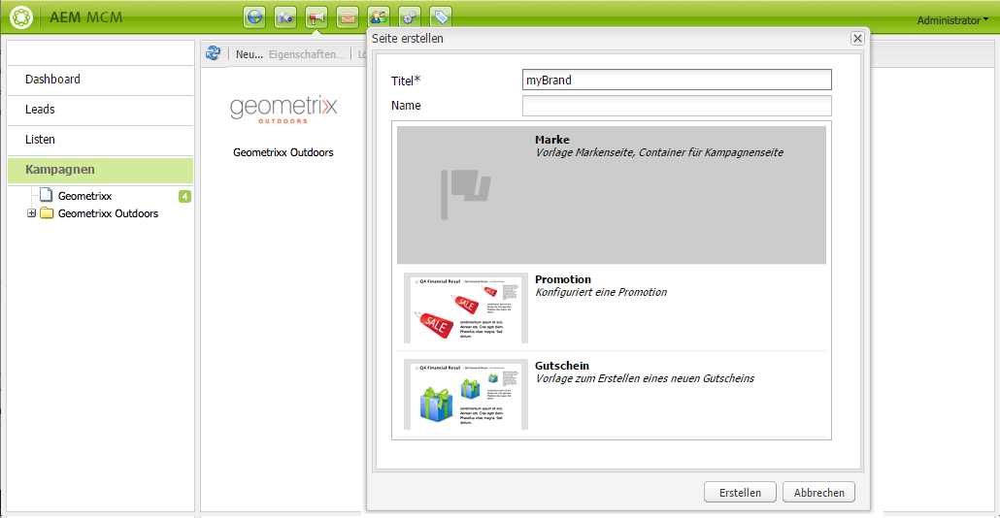

1. Klicken Sie auf **Erstellen**. Ihre neue Marke wird im MCM angezeigt (mit einem Standardsymbol).

### Definieren der Eigenschaften für die neue Marke  {#defining-the-properties-for-your-new-brand}

1. Wählen Sie im linken Bereich **Kampagnen**, wählen Sie im rechten Bereich das Symbol der neuen Marke und klicken Sie auf **Eigenschaften...**

   Sie können einen **Titel** und eine **Beschreibung** eingeben und ein Bild wählen, das als Symbol verwendet werden soll.

   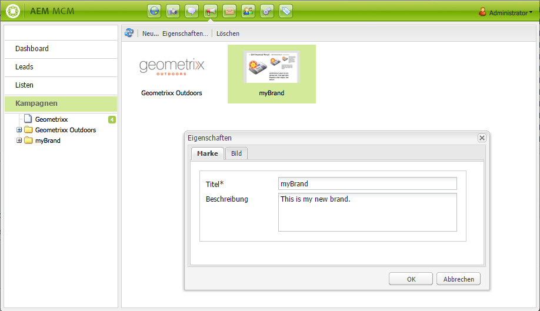

1. Klicken Sie zum Speichern auf **OK**.

### Erstellen einer neuen Kampagne  {#creating-a-new-campaign}

So erstellen Sie einen neue Kampagne:

1. Wählen Sie im linken Bereich unter **Kampagnen** die neue Marke oder doppelklicken Sie im rechten Bereich auf das Symbol.

   Die Übersicht wird angezeigt (bei einer neuen Marke ist sie leer).

1. Klicken Sie auf **Neu...** und geben Sie den **Titel** und den **Namen** für die neue Kampagne sowie die zu verwendende Vorlage an.

   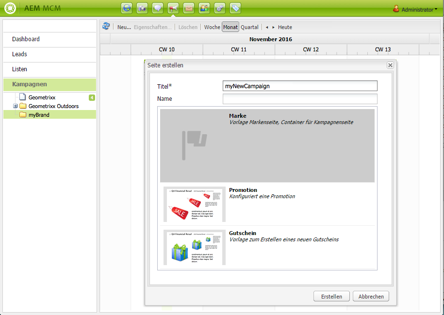

1. Klicken Sie auf **Erstellen**. Ihre neue Kampagne wird im MCM angezeigt.

### Definieren der Eigenschaften für die neue Kampagne  {#defining-the-properties-for-your-new-campaign}

Konfigurieren Sie Kampagneneigenschaften, die das Verhalten beeinflussen:

* **Priorität:** Die Priorität dieser Kampagne in Bezug auf andere Kampagnen. Sind mehrere Kampagnen gleichzeitig aktiv, wird das Besuchererlebnis über diejenige Kampagne mit der höchsten Priorität gesteuert.
* **Ein- und Ausschaltzeit:** Mit diesen Eigenschaften wird festgelegt, wann die Kampagne das Besuchererlebnis steuert. Über die Eigenschaft „Einschaltzeit“ wird festgelegt, ab wann die Kampagne die Kontrolle über das Benutzererlebnis übernimmt. Mit der „Ausschaltzeit“ wird bestimmt, ab wann die Kampagne das Erlebnis nicht mehr steuert.
* **Bild:** Das Bild, das in AEM die Kampagne repräsentiert.
* **Cloud-Services:** Die Konfigurationen des Cloud-Service, in den die Kampagne integriert wurde. (Weitere Informationen finden Sie unter [Integration mit der Adobe Marketing Cloud](/help/sites-administering/marketing-cloud.md).)

* **Adobe Target:** Mit diesen Eigenschaften werden Kampagnen konfiguriert, die in Adobe Target integriert wurden. (Weitere Informationen finden Sie unter [Integration mit Adobe Target](/help/sites-administering/target.md).)

1. Wählen Sie unter **Kampagnen** Ihre Marke aus. Aktivieren Sie im rechten Bereich Ihre Kampagne und klicken Sie auf **Eigenschaften**. 

   Sie können verschiedene Eigenschaften eingeben, unter anderem **Titel**, **Beschreibung** und sämtliche gewünschten **Cloud-Services**.

   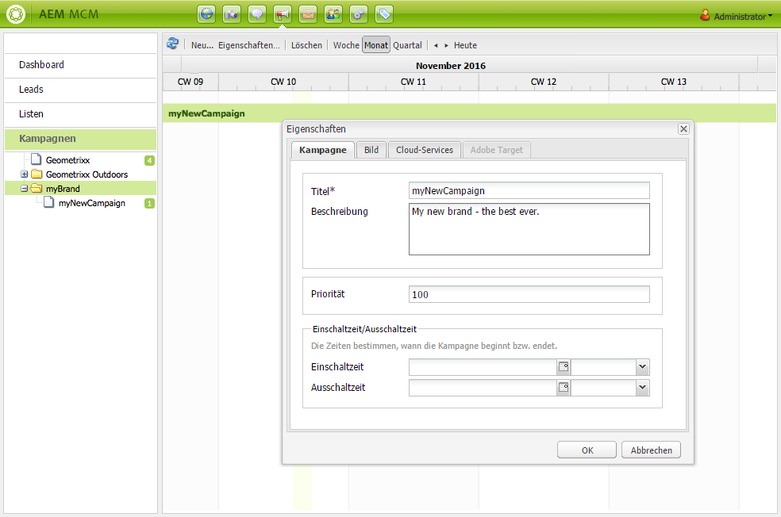

1. Klicken Sie zum Speichern auf **OK**.

### Erstellen eines neuen Erlebnisses  {#creating-a-new-experience}

Die Vorgehensweise beim Erstellen eines neuen Erlebnisses hängt vom Erlebnistyp ab.

* [Erstellen eines Teasers](/help/sites-classic-ui-authoring/classic-personalization-campaigns.md#creatingateaser)
* [Erstellen eines Newsletters](/help/sites-classic-ui-authoring/classic-personalization-campaigns.md#creatinganewsletter)
* [Erstellen eines Adobe Target-Angebots](/help/sites-classic-ui-authoring/classic-personalization-campaigns.md#creatingatesttargetoffer)

>[!NOTE]
>
>Wie in früheren Versionen ist es weiterhin möglich, das Erlebnis als Seite in der **Websites-Konsole** zu erstellen (und entsprechende Seiten, die in früheren Versionen erstellt wurden, werden weiterhin voll unterstützt).
>
>Es wird jedoch empfohlen, jetzt den MCM für das Erstellen von Erlebnissen zu verwenden.

### Konfigurieren des neuen Erlebnisses  {#configuring-your-new-experience}

Nachdem Sie das Grundgerüst für Ihr Erlebnis erstellt haben, müssen Sie jetzt abhängig vom Erlebnistyp die folgenden Schritte ausführen:

* [Teaser](/help/sites-classic-ui-authoring/classic-personalization-campaigns.md#teasers):

   * [Verknüpfen Sie die Teaser-Seite mit Besuchersegmenten.](/help/sites-classic-ui-authoring/classic-personalization-campaigns.md#applyingasegmenttoyourteaser)
   * [Erstellen Sie einen Touchpoint für Ihren Teaser](/help/sites-classic-ui-authoring/classic-personalization-campaigns.md#creatingatouchpointforyourteaser) (fügen Sie den Teaser einer Inhaltsseite hinzu).

* [Newsletter](/help/sites-classic-ui-authoring/classic-personalization-campaigns.md#newsletters):

   * [Fügen Sie dem Newsletter Inhalt hinzu.](/help/sites-classic-ui-authoring/classic-personalization-campaigns.md#addingcontenttonewsletters)
   * [Personalisieren Sie den Newsletter.](/help/sites-classic-ui-authoring/classic-personalization-campaigns.md#personalizingnewsletters)
   * [Senden Sie den Newsletter](/help/sites-classic-ui-authoring/classic-personalization-campaigns.md#sendingnewsletters) an Abonnenten oder Leads.
   * [Erstellen Sie eine Aufmerksamkeit erregende Einstiegsseite für den Newsletter](/help/sites-classic-ui-authoring/classic-personalization-campaigns.md#settingupanewsletterlandingpage).

* [Adobe Target-Angebot](/help/sites-classic-ui-authoring/classic-personalization-campaigns.md#testtargetoffers):

   * [Integrieren Sie es mit Adobe Target](/help/sites-administering/target.md)

### Hinzufügen eines neuen Touchpoints {#adding-a-new-touchpoint}

Wenn Sie über vorhandene Erlebnisse verfügen, können Sie einen Touchpoint direkt aus der Kalenderansicht im MCM hinzufügen:

1. Wählen Sie die Kalenderansicht für die Kampagne.

1. Klicken Sie auf **Touchpoint hinzufügen...**, um das Dialogfeld zu öffnen. Wählen Sie das Erlebnis aus, das Sie hinzufügen möchten:

   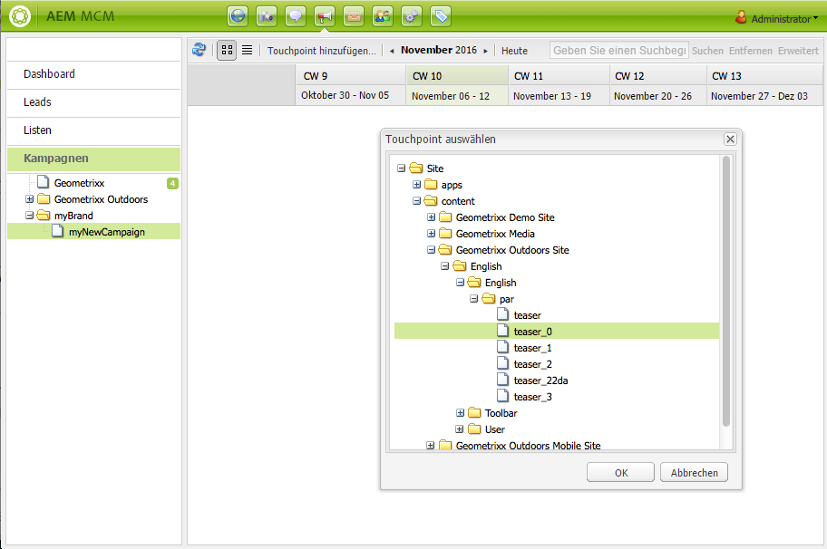

1. Klicken Sie zum Speichern auf **OK**.

## Arbeiten mit Leads {#working-with-leads}

>[!NOTE]
>
>Adobe plant nicht, diese Funktion (Lead-Verwaltung) weiter auszubauen.
> Es wird deshalb empfohlen, [Adobe Campaign und dessen Integration mit AEM zu nutzen](/help/sites-administering/campaign.md).

In AEM MCM können Sie Leads ordnen und hinzufügen, indem Sie sie manuell eingeben oder indem Sie eine kommagetrennte Liste importieren, z. B. eine Mailing-Liste. Sie können Leads auch anhand von Newsletter- oder Community-Anmeldungen generieren. (Wenn dies konfiguriert wurde, kann nach einer Anmeldung ein Workflow ausgelöst werden, aus dem Leads hervorgehen.)

Leads werden im Allgemeinen in Kategorien eingeteilt und in Listen gruppiert, sodass Sie zu einem späteren Zeitpunkt Aktionen für die gesamte Liste ausführen können, z. B. eine E-Mail an eine bestimmte Liste senden.

Über das Dashboard haben Sie Zugriff auf alle Leads, indem Sie im linken Bereich auf **Leads** klicken. Sie können auch über den Bereich **Listen** auf die Leads zugreifen.

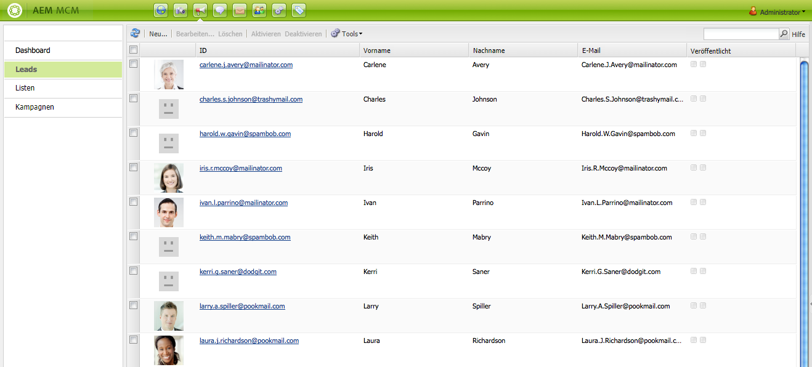

>[!NOTE]
>
>Um die Avatare von Benutzern hinzuzufügen oder zu ändern, müssen Sie die Clickstream-Cloud (Strg+Alt+C) öffnen, das Profil laden und dann auf **Bearbeiten** klicken.

### Erstellen neuer Leads  {#creating-new-leads}

Denken Sie daran, die Leads nach dem Erstellen zu [aktivieren](#activating-or-deactivating-leads), damit Sie deren Aktivitäten auf der Veröffentlichungsinstanz verfolgen und das Benutzererlebnis personalisieren können.

So erstellen Sie einen neuen Lead manuell:

1. Navigieren Sie in AEM zum MCM. Klicken Sie im Dashboard auf **Leads**.
1. Klicken Sie auf **Neu**. Das Dialogfeld **Lead erstellen** wird geöffnet.

   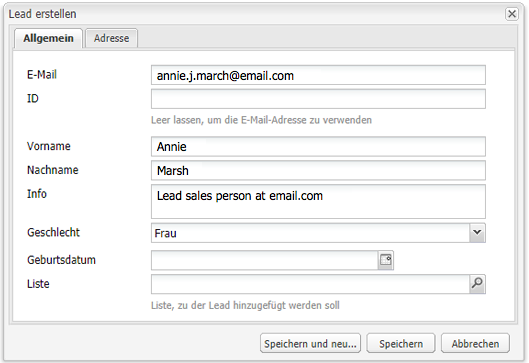

1. Geben Sie die Informationen in die Felder ein. Klicken Sie auf die Registerkarte **Adresse**.

   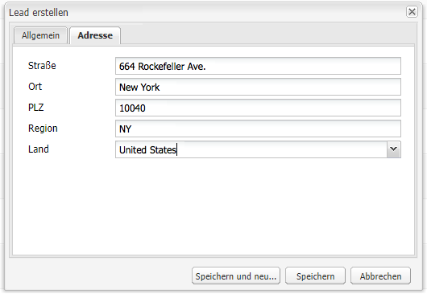

1. Geben Sie die Adressinformationen ein. Klicken Sie auf **Speichern**, um den Lead zu speichern. Wenn Sie zusätzliche Leads hinzufügen müssen, klicken Sie auf **Speichern und neu**.

   Der neue Lead wird im Bereich „Leads“ angezeigt. Wenn Sie auf den Eintrag klicken, werden alle eingegebenen Informationen im rechten Bereich angezeigt. Sobald Sie den Lead erstellt haben, können Sie ihn einer Liste hinzufügen.

   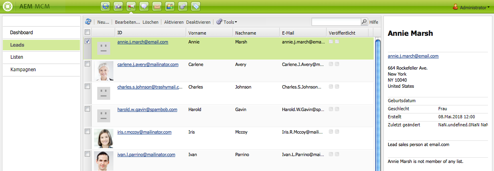

### Activating or deactivating leads {#activating-or-deactivating-leads}

Durch Aktivieren des Leads können Sie dessen Aktivitäten auf der Veröffentlichungsinstanz verfolgen und das Benutzererlebnis personalisieren. Wenn Sie die Aktivitäten nicht mehr verfolgen möchten, können Sie den Lead deaktivieren.

So aktivieren oder deaktivieren Sie Leads:

1. Navigieren Sie in AEM zum MCM und klicken Sie auf **Leads**.

1. Wählen Sie die Leads aus, die Sie aktivieren oder deaktivieren möchten, und klicken Sie auf **Aktivieren** oder **Deaktivieren**.

   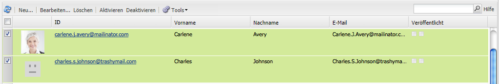

   Wie bei AEM-Seiten wird der Veröffentlichungsstatus in der Spalte **Veröffentlicht** angezeigt.

   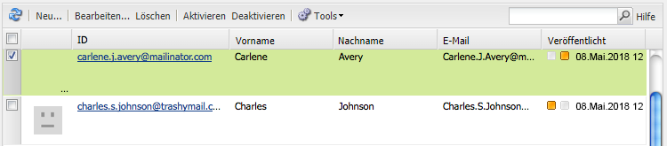

### Importieren neuer Leads {#importing-new-leads}

Wenn Sie neue Leads importieren, können Sie sie automatisch einer bereits vorhandenen Liste hinzufügen oder Sie können eine neue Liste erstellen, die diese Leads umfasst.

So importieren Sie Leads aus einer kommagetrennten Liste:

1. Navigieren Sie in AEM zum MCM und klicken Sie auf **Leads**.

   >[!NOTE]
   >
   >Alternativ können Sie Leads importieren, indem Sie eine der folgenden Aufgaben ausführen:
   >
   >
   >
   >    * Klicken Sie im Dashboard im Bereich **Listen** auf **Leads importieren**.
      >
      >    
   * Klicken Sie auf **Listen** und wählen Sie im Menü **Tools** die Option **Leads importieren** aus.

1. Wählen Sie im Menü **Tools** die Option **Leads** **importieren** aus.

1. Geben Sie die Informationen wie beschrieben unter „Beispieldaten“ ein. Die folgenden Felder können importiert werden: email,familyName,givenName,gender,aboutMe,city,country,phoneNumber,postalCode,region,streetAddress

   >[!NOTE]
   >
   >Bei der ersten Zeile in der CSV-Liste handelt es sich um vordefinierte Etiketten, die genau wie im Beispiel angegeben geschrieben werden müssen:
   >
   >
   >`email,givenName,familyName` - wenn es beispielsweise als  `givenname`Beispiel geschrieben wurde, wird das System es nicht erkennen.

   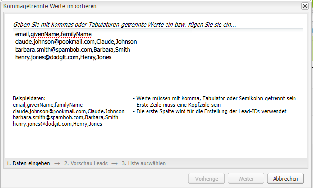

1. Klicken Sie auf **Weiter**. Hier können Sie eine Vorschau der Leads anzeigen, um sicherzustellen, dass die Angaben richtig sind.

   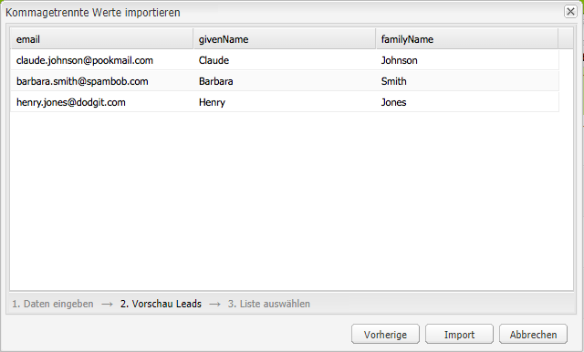

1. Klicken Sie auf **Weiter**. Wählen Sie die Liste aus, der die Leads angehören sollen. Wenn sie keiner Liste zugewiesen werden sollen, löschen Sie die Informationen aus dem Feld. Standardmäßig erstellt AEM einen Listennamen, der das Datum und die Uhrzeit enthält. Wählen Sie **Importieren**.

   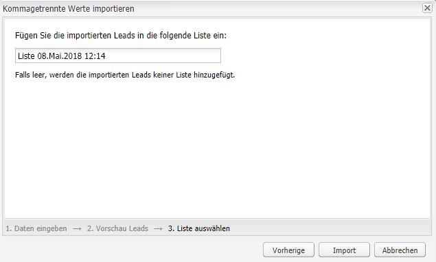

   Der neue Lead wird im Bereich „Leads“ angezeigt. Wenn Sie auf den Eintrag klicken, werden alle eingegebenen Informationen im rechten Bereich angezeigt. Sobald Sie den Lead erstellt haben, können Sie ihn einer Liste hinzufügen.

### Hinzufügen von Leads zu Listen  {#adding-leads-to-lists}

So fügen Sie schon bestehenden Listen Leads hinzu:

1. Klicken Sie im MCM auf **Leads**, um alle verfügbaren Leads anzuzeigen.

1. Wählen Sie die Leads aus, die Sie einer Liste hinzufügen möchten, indem Sie das Kontrollkästchen neben dem Lead aktivieren. Sie können beliebig viele Leads hinzufügen.

   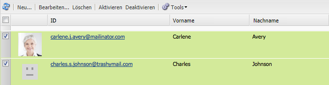

1. Wählen Sie aus dem Menü **Tools** die Option **Zu Liste hinzufügen...**. Das Fenster **Zu Liste hinzufügen** wird geöffnet.

   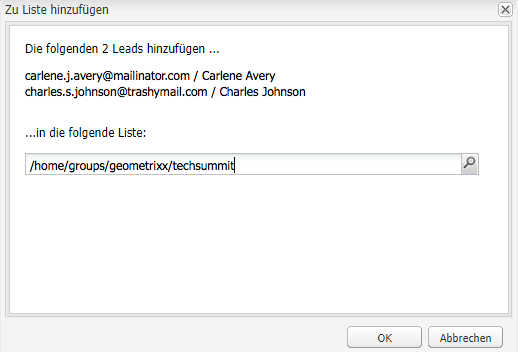

1. Wählen Sie aus, welcher Liste Sie die Leads hinzufügen möchten und klicken Sie auf **OK**. Die Leads werden den entsprechenden Listen hinzugefügt.

### Anzeigen von Lead-Informationen  {#viewing-lead-information}

Um Lead-Informationen im MCM anzuzeigen, klicken Sie auf das Kontrollkästchen neben dem Lead. Rechts wird ein Bereich geöffnet mit allen Informationen zum Lead, darunter auch die Listenzugehörigkeit.

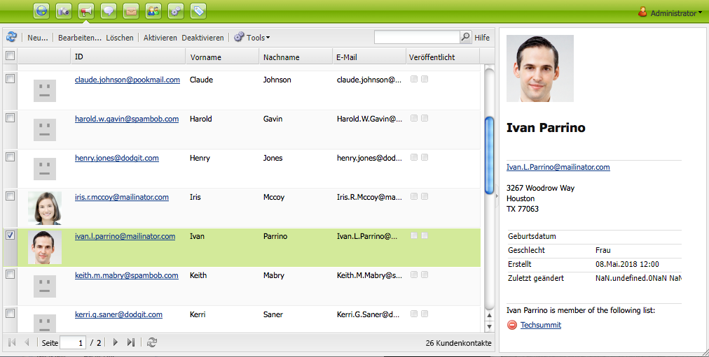

### Ändern vorhandener Leads {#modifying-existing-leads}

So ändern Sie bestehende Lead-Informationen:

1. Klicken Sie im MCM auf **Leads**. Aktivieren Sie in der Liste der Leads das Kontrollkästchen neben dem Lead, den Sie bearbeiten möchten. Alle Lead-Informationen werden im rechten Bereich angezeigt.

   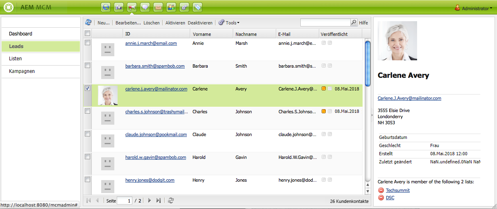

   >[!NOTE]
   >
   >Sie können nur jeweils einen Lead bearbeiten. Wenn Sie Leads bearbeiten müssen, die auf der gleichen Liste stehen, können Sie stattdessen auch die Liste bearbeiten.

1. Klicken Sie auf **Bearbeiten**. Das Fenster **Lead bearbeiten** wird geöffnet.

   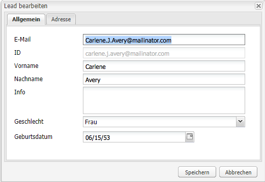

1. Nehmen Sie die gewünschten Änderungen vor und klicken Sie auf **Speichern**, um Ihre Änderungen zu speichern.

   >[!NOTE]
   >
   >Gehen Sie zum Benutzerprofil, um den Lead-Avatar zu ändern. Über Strg+Alt+C können Sie das Profil in die Clickstream Cloud laden. Klicken Sie dann auf **Laden** und wählen Sie dann das Profil aus.

### Löschen vorhandener Leads  {#deleting-existing-leads}

Wählen Sie zum Löschen von bestehenden Leads im MCM das Kontrollkästchen neben dem Lead aus und klicken Sie auf **Löschen**. Der Lead wird aus der Lead-Liste und allen zugehörigen Listen entfernt.

>[!NOTE]
>
>Vor dem Löschen fragt AEM noch einmal nach, ob Sie den bestehenden Lead wirklich löschen möchten. Nach dem Löschen kann er nicht wiederhergestellt werden.

## Arbeiten mit Listen  {#working-with-lists}

>[!NOTE]
>
>Adobe plant nicht, diese Funktion (Listenverwaltung) weiter auszubauen.
> Es wird deshalb empfohlen, [Adobe Campaign und dessen Integration mit AEM zu nutzen](/help/sites-administering/campaign.md).

Mithilfe von Listen können Sie Ihre Leads in Gruppen organisieren. Mit Listen können Sie Marketing-Kampagnen gezielt für eine bestimmte Personengruppe erstellen, z. B. können Sie einen speziellen Newsletter an eine bestimmte Liste senden. Auf die Listen können Sie im MCM über das Dashboard oder durch Klicken auf **Listen** zugreifen. Bei beiden Methoden werden Ihnen der Name der Liste sowie die Mitgliederanzahl angezeigt.

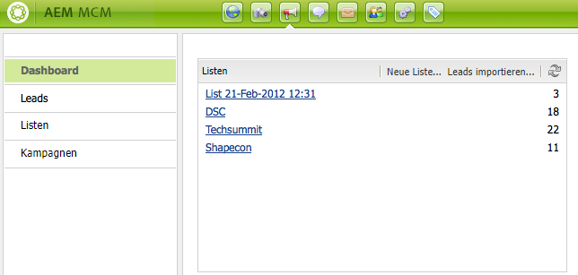

Wenn Sie auf **Listen** klicken, können Sie auch sehen, ob die Liste Mitglied einer anderen Liste ist und Sie können eine Beschreibung anzeigen.

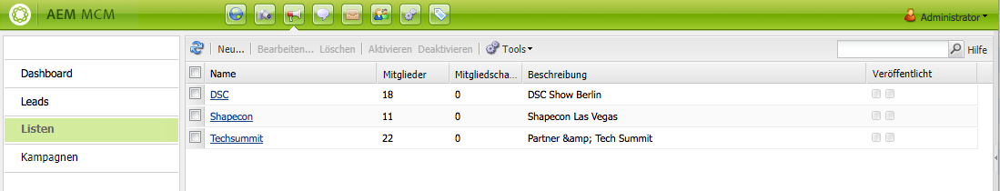

### Erstellen neuer Listen {#creating-new-lists}

So erstellen Sie eine neue Liste (Gruppe):

1. Klicken Sie im MCM-Dashboard auf **Neue Liste...** oder klicken Sie unter **Listen** auf **Neu...**. Das Fenster „Liste erstellen“ wird geöffnet.

   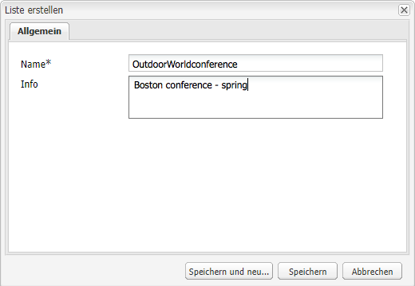

1. Geben Sie einen Namen (erforderliche Angabe) und falls gewünscht eine Beschreibung ein und klicken Sie auf **Speichern**. Die Liste wird im Bereich **Listen** angezeigt.

   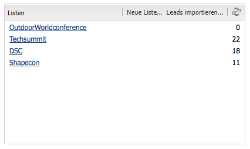

### Ändern vorhandener Listen {#modifying-existing-lists}

So ändern Sie eine bestehende Liste:

1. Klicken Sie im MCM auf **Listen**.

1. Aktivieren Sie in der Liste das Kontrollkästchen neben der Liste, die Sie bearbeiten möchten, und klicken Sie auf **Bearbeiten**. Das Fenster **Liste bearbeiten** wird geöffnet.

   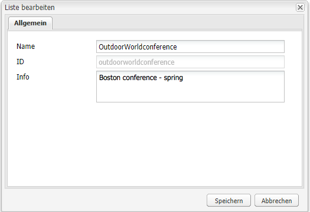

   >[!NOTE]
   >
   >Sie können nur jeweils eine Liste bearbeiten.

1. Nehmen Sie die gewünschten Änderungen vor und klicken Sie auf **Speichern**, um Ihre Änderungen zu speichern.

### Löschen vorhandener Listen  {#deleting-existing-lists}

Wählen Sie zum Löschen von bestehenden Listen im MCM das Kontrollkästchen neben der Liste aus und klicken Sie auf **Löschen**. Die Liste wird gelöscht. Leads, die der Liste zugeordnet waren, werden nicht entfernt; es wird nur die Zugehörigkeit zur Liste entfernt.

>[!NOTE]
>
>Vor dem Löschen fragt AEM noch einmal nach, ob Sie die bestehende Liste wirklich löschen möchten. Nach dem Löschen kann er nicht wiederhergestellt werden.

### Zusammenführen von Listen  {#merging-lists}

Sie können eine bestehende Liste mit einer anderen zusammenführen. Dabei wird die Liste, die Sie zusammenführen, Mitglied der anderen Liste. Sie besteht weiterhin als eigenständige Liste und sollte nicht gelöscht werden.

Es bietet sich beispielsweise an, Listen zusammenzuführen, wenn dieselbe Konferenz an zwei Orten stattfinden wird und sie eine Teilnehmerliste aller Konferenzen zusammenstellen möchten.

So führen Sie bestehende Listen zusammen:

1. Klicken Sie im MCM auf **Listen**.

1. Wählen Sie die Liste aus, die Sie mit einer anderen Liste zusammenführen möchten, indem Sie das zugehörige Kontrollkästchen aktivieren.

1. Wählen Sie aus dem Menü **Tools** die Option **Listen zusammenführen**.

   >[!NOTE]
   >
   >Sie können nur jeweils eine Liste zusammenführen.

1. Wählen Sie im Fenster **Listen zusammenführen** die gewünschte Liste aus und klicken Sie auf **OK**.

   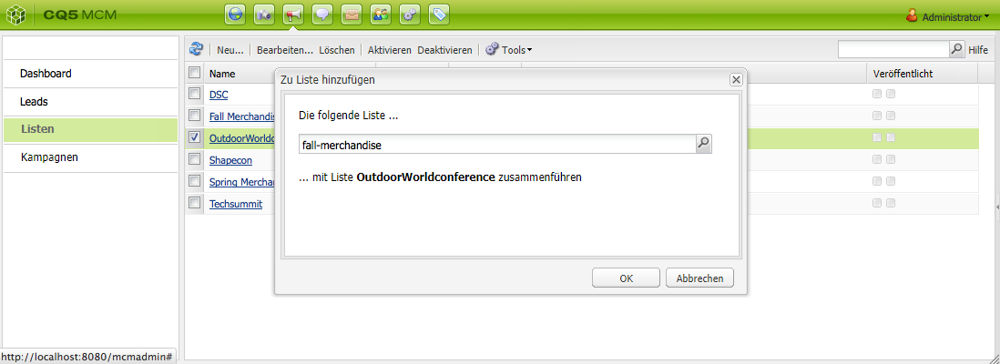

   Die zusammengeführte Liste sollte ein zusätzliches Mitglied anzeigen. Um zu überprüfen, ob Ihre Liste zusammengeführt wurde, wählen Sie die zusammengeführte Liste aus und klicken Sie im Menü **Tools** auf **Leads anzeigen**.

1. Wiederholen Sie diesen Schritt, bis alle gewünschten Listen zusammengeführt wurden.

   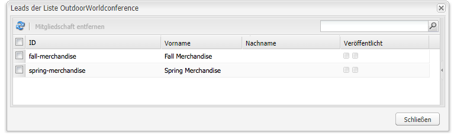

>[!NOTE]
>
>Das Entfernen einer zusammengeführten Liste aus der Mitgliedschaft entspricht dem Entfernen von Leads aus einer Liste. Öffnen Sie die Registerkarte **Listen**, wählen Sie die Liste aus, die die zusammengeführte Liste enthält, und entfernen Sie diese Mitgliedschaft, indem Sie neben der Liste auf den roten Kreis klicken.

### Anzeigen von Leads in Listen  {#viewing-leads-in-lists}

Sie können jederzeit anzeigen, welche Leads einer bestimmten Liste angehören, indem Sie nach den Mitgliedern suchen oder die Liste durchsuchen.

So zeigen Sie Leads an, die einer Liste angehören:

1. Klicken Sie im MCM auf **Listen**.

1. Aktivieren Sie die Kontrollkästchen neben der Liste, deren Mitglieder Sie anzeigen möchten.

1. Wählen Sie im Menü **Tools** die Option **Leads anzeigen** aus. AEM zeigt die Leads an, die Mitglieder dieser Liste sind. Sie können die Liste durchsuchen oder nach Mitgliedern suchen.

   >[!NOTE]
   >
   >Darüber hinaus können Sie Leads aus einer Liste löschen, indem Sie sie auswählen und auf **Mitgliedschaft entfernen** klicken.

   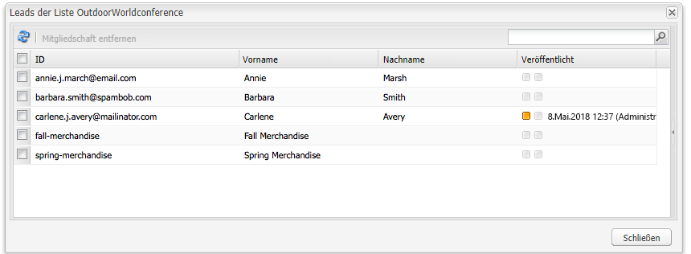

1. Klicken Sie auf **Schließen**, um zum MCM zurückzukehren.
