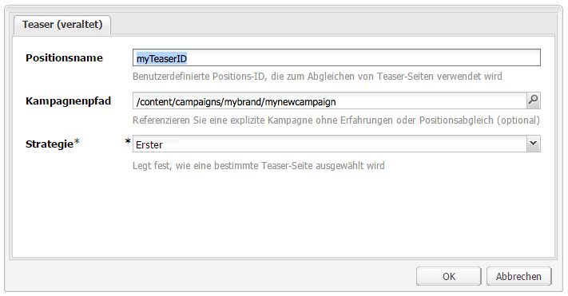
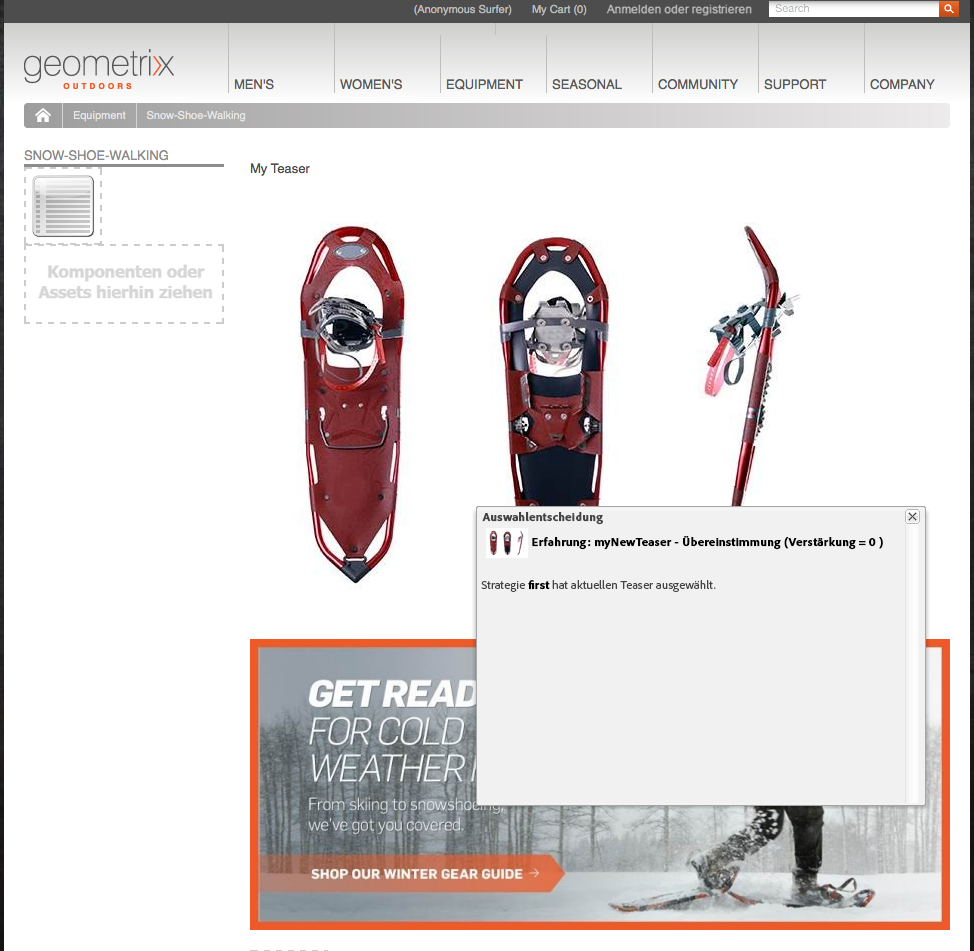
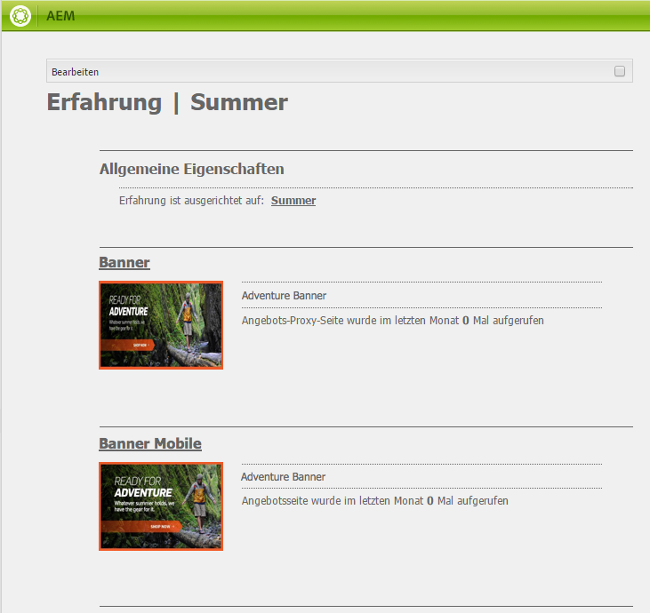

# Teaser und Strategien{#teasers-and-strategies}

In Kampagnen werden häufig Teaser verwendet, um ein bestimmtes Besuchersegment zu Inhalten zu leiten, die genau auf dessen Interessen ausgerichtet sind. Für eine bestimmte Kampagne sind ein oder mehrere Teaser definiert.

>[!NOTE]
>
>Die Teaser-Komponente ist seit AEM 6.2 veraltet. Verwenden Sie stattdessen die [Target-Komponente](/help/sites-authoring/content-targeting-touch.md).

* **Markenseiten** werden im Abschnitt Kampagnen der Website gespeichert. Eine Marke enthält die einzelnen Kampagnen.
* **Kampagnenseiten** werden im Abschnitt Kampagnen der Website gespeichert. Jede Kampagne weist eine individuelle Seite auf, unter der sich die Teaserdefinitionen befinden. Die Container- oder Übersichtsseite enthält auch bestimmte Informationen und Statistiken bezüglich der einzelnen Teaser-Seiten.

Teaser innerhalb von AEM bestehen aus mehreren Teilen:

* **Teaser-** Seiten werden auf der entsprechenden Kampagnenseite gespeichert und enthalten die Definitionen der Teaser-Absätze, die für jede bestimmte Kampagne verfügbar sind. Diese Definitionen werden bei der Anzeige der Teaser-Absätze verwendet und enthalten auch Inhaltsänderungen, das für das Auswählen einer Änderung zu verwendende Segment sowie einen Verstärkungsfaktor.
* Die **Teaser-Komponente** ist im Lieferumfang enthalten und ermöglicht Ihnen das Erstellen einer Instanz eines speziellen Teaser-Absatzes auf einer Inhaltsseite. Sie können die Teaser-Komponenten aus dem Sidekick ziehen und dann Ihre Teaser-Definition angeben, um einen eigenen Teaser-Absatz zu erstellen. **Hinweis:** Die Teaser-Komponente wird seit AEM 6.2 nicht mehr unterstützt. Verwenden Sie stattdessen die  [Target-](/help/sites-authoring/content-targeting-touch.md) Komponente.
* **Teaser-Absätze** sind tatsächliche Instanzen Ihres Teasers innerhalb einer Inhaltsseite. Dadurch wir ein Besuchersegment zu Inhalten geleitet, die auf ihre Interessen ausgerichtet sind.
* Seiten, die den Kampagneninhalt für ein spezifisches Besuchersegment enthalten. Durch die Teaser-Absätze werden die Besucher in der Regel auf solche Seiten geleitet.

## Strategien {#strategies}

Wenn Sie einen Teaser-Absatz zu einer Seite hinzufügen, müssen Sie die **Strategie** definieren.

Dies ist für den Fall, dass mehrere Teaser zur Auswahl stehen, wenn sich alle zugewiesenen Segmente erfolgreich auflösen. Die **Strategie** gibt dann ein zusätzliches Kriterium an, das zur Auswahl des angezeigten Teasers verwendet wird:

* Das **Clickstream-Ergebnis** basiert auf den Tags und zugehörigen Tag-Treffern, die im ClientContext des Besuchers enthalten sind (der Client Context zeigt an, wie oft ein Besucher auf Seiten mit dem jeweiligen Tag geklickt hat). Die Trefferraten für Tags, die auf der Teaser-Seite definiert sind, werden verglichen.
* **Zufällig** für &quot;zufällige&quot;Auswahl; verwendet den für eine Seite generierten Zufallsfaktor. Dies ist im  [Client-Kontext](/help/sites-administering/client-context.md) zu sehen.
* **** Erstellen Sie zunächst die Liste der aufgelösten Segmente. Die Reihenfolge ist die gleiche wie die der Teaser in der Kampagnen-Containerseite.

Der [Verstärkungsfaktor](/help/sites-administering/campaign-segmentation.md#boost-factor) des Segments wirkt sich ebenfalls auf die Auswahl aus. Dabei handelt es sich um einen Gewichtungsfaktor, der einer Segmentdefinition hinzugefügt wird, um die relative Wahrscheinlichkeit, dass diese ausgewählt wird, zu erhöhen/verringern.

Der Prozess und die Beziehungen zwischen den unterschiedlichen Auswahlkriterien werden am besten in einem Beispiel veranschaulicht (eine Methode, die auch verwendet werden kann, um sicherzustellen, dass Ihre Teaser die richtige Zielgruppe erreichen).

Wenn die folgenden Segmente bereits erstellt und ihrem jeweiligen Verstärkungsfaktor zugewiesen wurden:

| Segment | Verstärkungsfaktor |
|---|---|
| S1 | 0 |
| S2 | 0 |
| S3 | 10 |
| S4 | 30 |
| S5 | 0 |
| S6 | 100 |

Und es werden die folgenden Teaser-Definitionen verwendet:

<table>
 <tbody>
  <tr>
   <td>Campaign</td>
   <td>Teaser</td>
   <td>Zugewiesenes Segment bzw. zugewiesene Segmente</td>
   <td>Zugewiesene Tags </td>
  </tr>
  <tr>
   <td>C1</td>
   <td>T1</td>
   <td>S1, S2</td>
   <td>Business, Marketing</td>
  </tr>
  <tr>
   <td>C1</td>
   <td>T2 </td>
   <td>S1</td>
   <td>  </td>
  </tr>
  <tr>
   <td>C1 </td>
   <td>T3</td>
   <td>S3, S4</td>
   <td>  </td>
  </tr>
  <tr>
   <td>C1 </td>
   <td>T4</td>
   <td>S2, S5</td>
   <td>  </td>
  </tr>
  <tr>
   <td>C1 </td>
   <td>T5</td>
   <td>S1, S2, S6</td>
   <td>Marketing</td>
  </tr>
  <tr>
   <td>C1 </td>
   <td>T6</td>
   <td>S6</td>
   <td>Business  </td>
  </tr>
 </tbody>
</table>

Wenn dies auf einen Besucher angewendet wird, bei dem Folgendes gilt:

* **S1**,  **S2** und  **S6**  wurden erfolgreich aufgelöst

* Das Tag **Marketing** hat 3 Treffer.
* Das Tag **Business** hat 6 Treffer.

Es ergibt sich Folgendes:

* Erfolgreiche Übereinstimmung: Werden Segmente, die dem Teaser zugewiesen sind, für den aktuellen Besucher erfolgreich aufgelöst?
* Verstärkungsfaktor: Der höchste Verstärkungsfaktor aller geeigneten Segmente
* Clickstream-Ergebnis: Die Gesamtanzahl aller geeigneten Tagtreffer,

die vor der Anwendung der entsprechenden Strategie berechnet werden:

<table>
 <tbody>
  <tr>
   <td>Kampagne</td>
   <td>Teaser</td>
   <td>Zugewiesenes Segment bzw. zugewiesene Segmente</td>
   <td>Tags </td>
   <td>Erfolgreiche Übereinstimmung?</td>
   <td>Resultierender Verstärkungsfaktor</td>
   <td>Resultierendes Clickstream-Ergebnis </td>
  </tr>
  <tr>
   <td>C1</td>
   <td>T1</td>
   <td>S1, S2</td>
   <td>Business, Marketing</td>
   <td>Ja</td>
   <td>0</td>
   <td>9</td>
  </tr>
  <tr>
   <td>C1</td>
   <td>T2 </td>
   <td>S1</td>
   <td>  </td>
   <td>Ja</td>
   <td>0</td>
   <td>  </td>
  </tr>
  <tr>
   <td>C1 </td>
   <td>T3</td>
   <td>S3, S4</td>
   <td>  </td>
   <td>Nein</td>
   <td>  </td>
   <td>  </td>
  </tr>
  <tr>
   <td>C1 </td>
   <td>T4</td>
   <td>S2, S5</td>
   <td>  </td>
   <td>Ja  </td>
   <td>0  </td>
   <td>  </td>
  </tr>
  <tr>
   <td>C1 </td>
   <td>T5</td>
   <td>S1, S2, S6</td>
   <td>Marketing</td>
   <td>Ja</td>
   <td>100</td>
   <td>3</td>
  </tr>
  <tr>
   <td>C1 </td>
   <td>T6</td>
   <td>S6</td>
   <td>Unternehmen</td>
   <td>Ja</td>
   <td>100</td>
   <td>6 </td>
  </tr>
 </tbody>
</table>

Diese Werte werden verwendet, um die Teaser zu ermitteln, die für den Besucher in Abhängigkeit von der für den Teaser-Absatz übernommenen **Strategie** angezeigt werden.

<table>
 <tbody>
  <tr>
   <td>Strategie</td>
   <td>Resultierender Teaser</td>
   <td>Kommentare</td>
  </tr>
  <tr>
   <td>First</td>
   <td>T5</td>
   <td>Nur T5 und T6 werden berücksichtigt, da all ihre Segmente aufgelöst werden <i>und</i> sie den höchsten Verstärkungsfaktor aufweisen. Die zurückgegebene Liste ist in der Reihenfolge T5, T6; T5 wird daher ausgewählt und angezeigt.</td>
  </tr>
  <tr>
   <td>Willkürlich</td>
   <td>T5 oder T6</td>
   <td>Beide Teaser weisen Segmente, die alle aufgelöst werden, und den gleichen Verstärkungsfaktor auf. Die beiden Teaser werden daher in gleicher Proportion angezeigt.</td>
  </tr>
  <tr>
   <td>Clickstream-Ergebnis</td>
   <td>T6</td>
   <td>
Die Segmente für T1, T4, T5 und T6 werden für den Besucher alle aufgelöst. Aufgrund der höheren Verstärkungsfaktoren von T5 und T6 werden T1 und T4 ausgeschlossen. Das höhere Clickstream-Ergebnis von T6 führt letztendlich dazu, dass dieses ausgewählt wird.
 </td>
  </tr>
 </tbody>
</table>

>[!NOTE]
>
>Wenn nach den oben erwähnten Auflösungstechniken mehrere Teaser zur Auswahl stehen, muss durch eine interne (willkürliche) Auswahl ein einziger Teaser für die Anzeige ausgewählt werden.
>
>Wenn die Strategie beispielsweise Clickstream-Ergebnis war und T5 wies das gleiche Clickstream-Ergebnis wie T6 auf (d. h. 6 anstelle von 3), so würde die interne (willkürliche) Auswahl verwendet, um eine dieser beiden Optionen auszuwählen.

Teaser-Seiten/-Absätze: Um bestimmte Besuchersegmente auf Inhalte zu lenken, die speziell auf deren Interessen abgestimmt sind. Sie können eine Reihe von Optionen enthalten, aus denen der Besucher eine Auswahl treffen kann. Alternativ wird nur ein Teaser-Absatz basierend auf dem jeweiligen Besuchersegment angezeigt. Der angezeigte Teaser-Absatz kann beispielsweise vom Alter des Besuchers abhängig sein.

Bei einer Teaser-Seite handelt es sich in der Regel um eine temporäre Aktion, die für eine bestimmte Zeitdauer gültig ist, bis sie durch die nächste Teaser-Seite ersetzt wird.

Wenn Sie Ihre Marke und Kampagne erstellt haben, können Sie Ihr Teaser-Erlebnis erstellen und einrichten.

### Erstellen eines Touchpoints für den Teaser {#creating-a-touchpoint-for-your-teaser}

>[!NOTE]
>
>Die Teaser-Komponente ist seit AEM 6.2 veraltet. Verwenden Sie stattdessen die [Target-Komponente](/help/sites-authoring/content-targeting-touch.md).

1. Navigieren Sie zur Inhaltsseite, auf der Sie den Teaser-Absatz platzieren möchten, der zu Ihrer Kampagnenseite führt.
1. Fügen Sie an der erforderlichen Position eine **Teaser**-Komponente (verfügbar im Bereich **Personalisierung** des Sidekicks) hinzu. Direkt nach dem Erstellen wird angezeigt, dass der Kampagnenpfad noch nicht konfiguriert wurde.

   

1. Bearbeiten Sie die Teaser-Komponente, um Folgendes hinzuzufügen: 

   * **Kampagnenpfad**
Pfad zur Kampagnenseite, auf der die einzelne Teaser-Seite enthalten ist; Segmente bestimmen genau, welcher Teaser angezeigt wird.

   * **[Strategie](/help/sites-classic-ui-authoring/classic-personalization-campaigns.md#strategies)** Methode, die zur Auswahl verwendet wird, wenn ein Besucher die Kriterien mehrerer Segmente erfüllt.
   

1. Klicken Sie zum Speichern auf **OK**. Abhängig von den Segmenten, die Sie für den Teaser eingerichtet haben, und dem Benutzerprofil, mit dem Sie zurzeit angemeldet sind, werden entsprechende Inhalte angezeigt.

   

1. Bewegen Sie den Mauszeiger auf den Teaser-Absatz, um das Fragezeichen-Symbol einzublenden (rechte untere Ecke der Komponente). Klicken Sie darauf, um die angewendeten Segmente anzuzeigen und festzustellen, ob sie gegenwärtig zutreffen.

   

### Teaser-Übersicht {#teaser-overview}

Wie die Kampagnenansicht im MCM enthält die Kampagnenseite ebenfalls Informationen zu den damit verbundenen Teasern:

1. Öffnen Sie aus der **Websites**-Konsole die Kampagnenseite. Beispiel:

   `https://localhost:4502/content/campaigns/geometrixx-outdoors/storefront/summer.html`

   Hier finden Sie eine Übersicht über die Teaser-Definitionen und die Anzeigestatistik:

   
