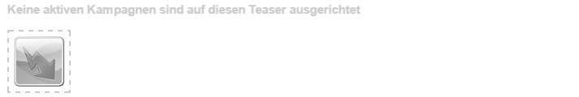

# Teaser und Strategien{#teasers-and-strategies}

In Kampagnen werden häufig Teaser verwendet, um ein bestimmtes Besuchersegment zu Inhalten zu leiten, die auf ihre Interessen ausgerichtet sind. Für eine bestimmte Kampagne werden ein oder mehrere Teaser definiert.

>[!NOTE]
>
>Die Teaser-Komponente wird in AEM 6.2 nicht mehr unterstützt. Verwenden Sie stattdessen die [Zielkomponente](/help/sites-authoring/content-targeting-touch.md).

* **Markenseiten** werden innerhalb des Kampagnenbereichs der Website gespeichert. Eine Marke enthält die einzelnen Kampagnen.
* **Kampagnenseiten** werden innerhalb des Kampagnenbereichs der Website gespeichert. Jede Kampagne weist eine individuelle Seite auf, unter der sich die Teaserdefinitionen befinden. Die Container- oder Übersichtsseite enthält auch bestimmte Informationen und Statistiken zu den einzelnen Teaser-Seiten.

Teaser in AEM bestehen aus mehreren Teilen:

* **Teaser-Seiten** werden in der entsprechenden Kampagnenseite gespeichert und enthalten die Definitionen der Teaser-Absätze, die für die jeweilige Kampagne verfügbar sind. Diese Definitionen werden bei der Anzeige der Teaser-Absätze verwendet, einschließlich der Inhaltsvarianten, des Segments, das zur Auswahl einer Variante verwendet werden soll, und des Verstärkungsfaktors.
* Die **Teaser-Komponente** ist bereits vorkonfiguriert, sodass Sie damit eine Instanz eines speziellen Teaser-Absatzes auf einer Inhaltsseite erstellen können. Sie können die Teaser-Komponente aus dem Sidekick ziehen und dann Ihre Teaser-Definition angeben, um einen eigenen Teaser-Absatz zu erstellen. **Hinweis:** Die Teaser-Komponente ist seit AEM 6.2 veraltet. Verwenden Sie stattdessen die [Zielkomponente](/help/sites-authoring/content-targeting-touch.md).
* **Teaser-Absätze** sind tatsächliche Instanzen Ihres Teasers innerhalb einer Inhaltsseite. Dadurch wird ein Besuchersegment zu Inhalten geleitet, die auf ihre Interessen ausgerichtet sind.
* Seiten, die den Kampagneninhalt für ein spezifisches Besuchersegment enthalten. Normalerweise führen Teaser-Absätze die Person zu solchen Seiten.

## Strategien {#strategies}

Wenn Sie zu einer Seite einen Teaser-Absatz hinzufügen, müssen Sie eine **Strategie** definieren.

Dies ist für den Fall, dass mehrere Teaser zur Auswahl stehen, wenn sich alle zugewiesenen Segmente erfolgreich auflösen. Die **Strategie** gibt dann ein zusätzliches Kriterium an, mit dem der angezeigte Teaser ausgewählt wird:

* Das **Clickstream-Ergebnis** basiert auf den Tags und zugehörigen Tag-Treffern, die im ClientContext der Besucherin bzw. des Besuchers enthalten sind (dieser zeigt an, wie oft die Person auf Seiten mit dem jeweiligen Tag geklickt hat). Die Trefferraten für Tags, die auf der Teaser-Seite definiert sind, werden verglichen.
* Mit **Willkürlich** für eine „willkürliche“ Auswahl wird der für eine Seite generierte Zufallsfaktor eingesetzt. Dieser kann im [ClientContext](/help/sites-administering/client-context.md) angezeigt werden.
* **Erste(r)** in der Liste aufgelöster Segmente. Die Reihenfolge ist die gleiche wie die der Teaser in der Kampagnen-Containerseite.

Der [Verstärkungsfaktor](/help/sites-administering/campaign-segmentation.md#boost-factor) des Segments hat auch Auswirkungen auf die Auswahl. Dieser Gewichtungsfaktor wird zu einer Segmentdefinition hinzugefügt, um die relative Wahrscheinlichkeit der Auswahl zu erhöhen bzw. zu verringern.

Der Prozess und die Zusammenhänge der verschiedenen Auswahlkriterien werden am besten mit einem Beispiel veranschaulicht (eine Methode, die auch verwendet werden kann, um sicherzustellen, dass Ihre Teaser die gewünschte Zielgruppe erreichen).

Wenn folgende Segmente bereits erstellt wurden und ihnen der jeweilige Verstärkungsfaktor zugewiesen wurde:

| Segment | Verstärkungsfaktor |
|---|---|
| S1 | 0 |
| S2 | 0 |
| S3 | 10 |
| S4 | 30 |
| S5 | 0 |
| S6 | 100 |

Und wir verwenden folgende Teaser-Definitionen:

<table>
 <tbody>
  <tr>
   <td>Kampagne</td>
   <td>Teaser</td>
   <td>Zugewiesene Segmente</td>
   <td>Zugewiesene Tags </td>
  </tr>
  <tr>
   <td>C1</td>
   <td>T1</td>
   <td>S1, S2</td>
   <td>Business, Marketing</td>
  </tr>
  <tr>
   <td>C1</td>
   <td>T2 </td>
   <td>S1</td>
   <td>  </td>
  </tr>
  <tr>
   <td>C1 </td>
   <td>T3</td>
   <td>S3, S4</td>
   <td>  </td>
  </tr>
  <tr>
   <td>C1 </td>
   <td>T4</td>
   <td>S2, S5</td>
   <td>  </td>
  </tr>
  <tr>
   <td>C1 </td>
   <td>T5</td>
   <td>S1, S2, S6</td>
   <td>Marketing</td>
  </tr>
  <tr>
   <td>C1 </td>
   <td>T6</td>
   <td>S6</td>
   <td>Geschäft  </td>
  </tr>
 </tbody>
</table>

Wenn wir dies auf eine Besucherin bzw. einen Besucher anwenden, wo:

* **S1**, **S2 und **S6** erfolgreich aufgelöst werden

* das Tag **Marketing** drei Treffer hat
* das Tag **Business** sechs Treffer hat

Dann wird folgendes Ergebnis angezeigt:

* Erfolgreiche Übereinstimmung – Wird mindestens eines der dem Teaser zugewiesenen Segmente für diese Person erfolgreich aufgelöst?
* Verstärkungsfaktor – der höchste Verstärkungsfaktor aller anwendbaren Segmente
* Clickstream-Ergebnis – die kumulierte Summe aller relevanten Tag-Treffer

Diese werden vor Anwendung der entsprechenden Strategie berechnet:

<table>
 <tbody>
  <tr>
   <td>Kampagne</td>
   <td>Teaser</td>
   <td>Zugewiesene Segmente</td>
   <td>Tags </td>
   <td>Erfolgreiche Übereinstimmung?</td>
   <td>Resultierender Verstärkungsfaktor</td>
   <td>Resultierendes Clickstream-Ergebnis </td>
  </tr>
  <tr>
   <td>C1</td>
   <td>T1</td>
   <td>S1, S2</td>
   <td>Business, Marketing</td>
   <td>Ja</td>
   <td>0</td>
   <td>9</td>
  </tr>
  <tr>
   <td>C1</td>
   <td>T2 </td>
   <td>S1</td>
   <td>  </td>
   <td>Ja</td>
   <td>0</td>
   <td>  </td>
  </tr>
  <tr>
   <td>C1 </td>
   <td>T3</td>
   <td>S3, S4</td>
   <td>  </td>
   <td>Nein</td>
   <td>  </td>
   <td>  </td>
  </tr>
  <tr>
   <td>C1 </td>
   <td>T4</td>
   <td>S2, S5</td>
   <td>  </td>
   <td>Ja  </td>
   <td>0  </td>
   <td>  </td>
  </tr>
  <tr>
   <td>C1 </td>
   <td>T5</td>
   <td>S1, S2, S6</td>
   <td>Marketing</td>
   <td>Ja</td>
   <td>100</td>
   <td>3</td>
  </tr>
  <tr>
   <td>C1 </td>
   <td>T6</td>
   <td>S6</td>
   <td>Geschäft</td>
   <td>Ja</td>
   <td>100</td>
   <td>6 </td>
  </tr>
 </tbody>
</table>

Diese Werte werden verwendet, um die Teaser zu ermitteln, die für die Besucherin bzw. den Besucher in Abhängigkeit von der für den Teaser-Absatz übernommenen **Strategie** angezeigt werden.

<table>
 <tbody>
  <tr>
   <td>Strategie</td>
   <td>Resultierender Teaser</td>
   <td>Kommentare</td>
  </tr>
  <tr>
   <td>Erste</td>
   <td>T5</td>
   <td>Nur T5 und T6 werden berücksichtigt, da all ihre Segmente aufgelöst werden <i>und</i> sie den höchsten Verstärkungsfaktor aufweisen. Die Liste wird in der Reihenfolge T5, T6 zurückgegeben; daher wird T5 ausgewählt und angezeigt.</td>
  </tr>
  <tr>
   <td>Willkürlich</td>
   <td>T5 oder T6</td>
   <td>Beide Teaser weisen Segmente, die alle aufgelöst werden, und den gleichen Verstärkungsfaktor auf. Die beiden Teaser werden daher in gleicher Proportion angezeigt.</td>
  </tr>
  <tr>
   <td>Clickstream-Ergebnis</td>
   <td>T6</td>
   <td>
Die Segmente für T1, T4, T5 und T6 werden für den Besucher alle aufgelöst. Aufgrund der höheren Verstärkungsfaktoren von T5 und T6 werden T1 und T4 ausgeschlossen. Das höhere Clickstream-Ergebnis von T6 führt letztendlich dazu, dass dies ausgewählt wird.
 </td>
  </tr>
 </tbody>
</table>

>[!NOTE]
>
>Wenn nach den oben erwähnten Auflösungstechniken mehrere Teaser zur Auswahl stehen, wird durch eine interne (willkürliche) Auswahl ein einziger Teaser für die Anzeige ausgewählt.
>
>Lautet die Strategie „Clickstream-Ergebnis“ und weist T5 das gleiche Clickstream-Ergebnis wie T6 auf (d. h. 6 anstelle von 3), so wird im Rahmen der internen (willkürlichen) Auswahl eine dieser beiden Optionen ausgewählt.

Teaser-Seiten/-Absätze haben das Ziel, bestimmte Besuchersegmente auf Inhalte zu lenken, die speziell auf deren Interessen abgestimmt sind. Sie können eine Reihe von Optionen bereitstellen, aus denen die Person auswählen kann, oder einfach nur einen Teaser-Absatz anzeigen, der auf dem spezifischen Besuchersegment basiert. Beispielsweise kann der angezeigte Teaser-Absatz vom Alter der Person abhängen.

Bei einer Teaser-Seite handelt es sich in der Regel um eine temporäre Aktion, die für eine bestimmte Zeit gültig ist, bis sie durch die nächste Teaser-Seite ersetzt wird.

Nachdem Sie Ihre Marke und Kampagne erstellt haben, können Sie Ihr Teaser-Erlebnis erstellen und einrichten.

### Erstellen eines Touchpoints für Ihren Teaser {#creating-a-touchpoint-for-your-teaser}

>[!NOTE]
>
>Die Teaser-Komponente wird in AEM 6.2 nicht mehr unterstützt. Verwenden Sie stattdessen die [Zielkomponente](/help/sites-authoring/content-targeting-touch.md).

1. Navigieren Sie zur Inhaltsseite, auf der Sie den Teaser-Absatz platzieren möchten, der zu Ihrer Kampagnenseite führt.
1. Fügen Sie eine **Teaser**-Komponente (verfügbar im Abschnitt **Personalisierung** des Sidekicks) an der gewünschten Position ein. Bei der ersten Erstellung wird angezeigt, dass der Kampagnenpfad noch nicht konfiguriert ist:

   

1. Fügen Sie Folgendes zur Teaser-Komponente hinzu:

   * **Kampagnenpfad**
Pfad zur Kampagnenseite, auf der die einzelne Teaser-Seite enthalten ist. Die Segmente bestimmen genau, welcher Teaser angezeigt wird.

   * **[Strategie](/help/sites-classic-ui-authoring/classic-personalization-campaigns.md#strategies)**
Methode, die zur Auswahl verwendet wird, wenn ein Besucher die Kriterien mehrerer Segmente erfüllt.

   

1. Klicken Sie zum Speichern auf **OK**. Je nachdem, welche Segmente Sie für den Teaser festgelegt haben und mit welchem Benutzerprofil Sie aktuell angemeldet sind, wird der entsprechende Inhalt angezeigt:

   

1. Bewegen Sie den Mauszeiger über den Teaser-Absatz, um das Fragezeichen-Symbol einzublenden (rechte untere Ecke der Komponente). Klicken Sie auf diese Option, um die angewendeten Segmente anzuzeigen und zu sehen, ob sie derzeit aufgelöst werden.

   

### Teaser-Übersicht {#teaser-overview}

Neben der Kampagnenansicht im MCM enthält die Kampagnenseite auch Informationen zu den mit ihr verbundenen Teasern:

1. Öffnen Sie auf der **Websites**-Konsole die Kampagnenseite, zum Beispiel:

   `https://localhost:4502/content/campaigns/geometrixx-outdoors/storefront/summer.html`

   Hier finden Sie eine Übersicht über die Teaser-Definitionen und die Anzeigestatistik:

   
