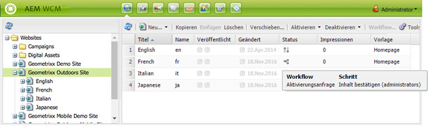

# Anwenden von Workflows auf Seiten{#applying-workflows-to-pages}

Wenn Sie den Workflow anwenden, geben Sie die folgenden Informationen an:

* Der anzuwendende Workflow.

   Sie können jeden beliebigen Workflow anwenden (auf den Sie Zugriff haben, wie von Ihrem AEM-Administrator zugewiesen).
* Optional:

   * Ein Kommentar, der Informationen darüber enthält, weshalb Sie den Workflow gestartet haben.
   * Ein Titel, der dabei hilft, die Workflow-Instanz im Posteingang eines Benutzers zu identifizieren.

>[!NOTE]
>
>AEM-Administratoren können Workflows mithilfe [mehrerer anderer Methoden](/help/sites-administering/workflows-starting.md) starten.

## Anwenden von Workflows  {#applying-workflows}

Workflows können entweder aus der Websites-Konsole oder, beim Bearbeiten einer Seite, aus dem Sidekick gestartet werden.

Die Spalte **Status** in der Konsole **Websites** gibt an, ob ein Workflow auf eine Seite angewendet wurde:

### Starten eines Workflows aus der Websites-Konsole {#starting-a-workflow-from-the-websites-console}

1. Öffnen Sie die Websites-Konsole. ([http://localhost:4502/siteadmin)](http://localhost:4502/siteadmin)
1. Wählen Sie in der Websitestruktur das übergeordnete Element der Seite aus, auf die Sie den Workflow anwenden möchten.
1. Wählen Sie in der Seitenliste die Seite aus und klicken Sie dann auf „Workflow“.
1. Wählen Sie im Dialogfeld „Workflow starten“ den Workflow aus, der angewendet werden soll. Geben Sie optional einen Kommentar und einen Titel ein. Klicken Sie dann auf „Start“.

### Starten eines Workflows aus dem Sidekick  {#starting-a-workflow-using-sidekick}

1. Öffnen Sie die Websites-Konsole. 
1. Öffnen Sie die gewünschte Seite.
1. Wählen Sie die Registerkarte „Workflow“ aus dem Sidekick aus.
1. Erweitern Sie das Dialogfeld **Workflow**, sodass Sie den **Workflow** auswählen und optional **Workflow-Titel** und **Kommentar** eingeben können.

   

1. Klicken Sie auf **Workflow starten**, um eine neue Workflow-Instanz mit den Eigenschaften zu starten, die Sie konfiguriert haben, und mit der aktuellen Seite als Payload. Jetzt wird der Workflow ausgeführt.
