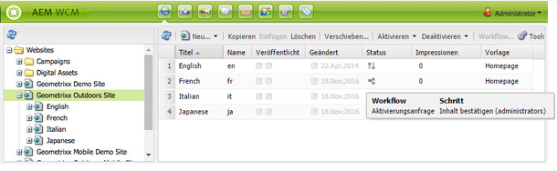
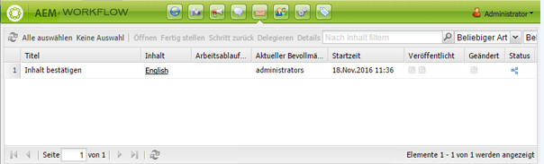
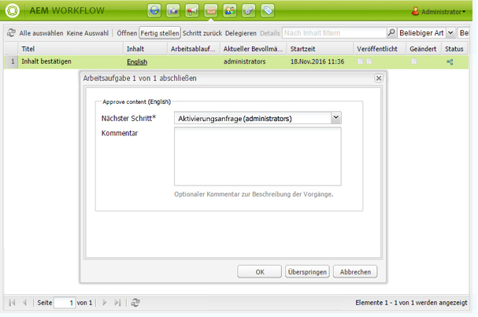
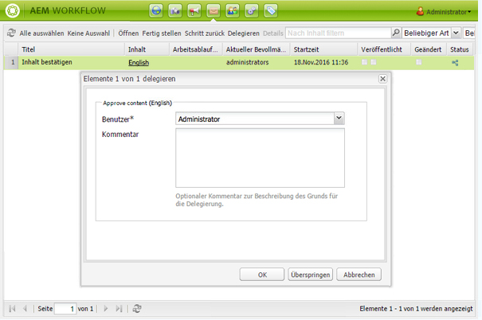
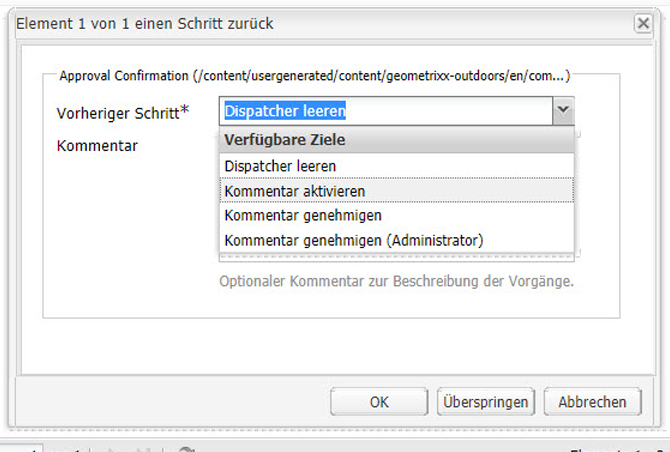

# Teilnehmen an Workflows{#participating-in-workflows}

Workflows enthalten normalerweise Schritte, bei denen eine Person eine Aktivität auf einer Seite oder in einem Asset ausführen muss. Der Workflow wählt einen Benutzer oder eine Gruppe zum Durchführen der Aktivität aus und weist dieser Person oder Gruppe ein Arbeitselement zu.

## Verarbeiten der Arbeitselemente {#processing-your-work-items}

Sie können die folgenden Aktionen durchführen, um ein Arbeitselement zu verarbeiten:

* **Fertig stellen**

   Sie können ein Element abschließen, damit der Workflow zum nächsten Schritt übergehen kann.

* **Delegieren**

   Wenn Ihnen ein Schritt zugewiesen wurde, Sie aber aus irgendeinem Grund keine entsprechende Maßnahme ergreifen können, können Sie den Schritt an einen anderen Benutzer oder eine Gruppe delegieren.

   An welche Benutzer delegiert werden kann, hängt davon ab, wem das Arbeitselement zugewiesen wurde:

   * Wenn das Arbeitselement einer Gruppe zugewiesen wurde, sind die Gruppenmitglieder verfügbar.
   * Wenn das Arbeitselement einer Gruppe zugewiesen und dann an einen Benutzer delegiert wurde, sind die Gruppenmitglieder und die Gruppe verfügbar.
   * Wenn das Arbeitselement einem einzelnen Benutzer zugewiesen wurde, kann es nicht delegiert werden.

* **Schritt zurück**

   Wenn Sie erkennen, dass ein Schritt oder eine Reihe von Schritten wiederholt werden muss, können Sie zu einem vorherigen Schritt zurückkehren. Auf diese Weise können Sie einen früheren Schritt im Workflow zur erneuten Verarbeitung auswählen. Der Workflow kehrt zum angegebenen Schritt zurück und wird ab dieser Stelle fortgesetzt.

## Teilnehmen an einem Workflow  {#participating-in-a-workflow}

### Benachrichtigungen über zugewiesene Workflow-Aktionen {#notifications-of-assigned-workflow-actions}

Wenn Ihnen ein Arbeitselement zugewiesen wird (z. B. **Inhalte genehmigen**), werden verschiedene Warnungen und/oder Benachrichtigungen angezeigt:

* Die Spalte **Status** der Websites-Konsole zeigt an, wenn eine Seite in einem Workflow enthalten ist:

   

* Wenn Ihnen oder einer Gruppe, der Sie angehören, ein Arbeitselement im Rahmen eines Workflows zugewiesen wird, wird das Arbeitselement in Ihrem AEM-Workflow-Posteingang angezeigt.

   

### Fertigstellen eines Teilnehmerschritts {#completing-a-participant-step}

Nachdem Sie die angegebene Aktion abgeschlossen haben, können Sie das Arbeitselement fertig stellen, damit der Workflow fortgesetzt wird. Gehen Sie folgendermaßen vor, um das Arbeitselement abzuschließen.

1. Wählen Sie den Workflow-Schritt aus und klicken Sie in der oberen Navigationsleiste auf die Schaltfläche **Fertig stellen**.
1. Wählen Sie im angezeigten Dialogfeld die Option **Nächster Schritt** aus. Damit ist der Schritt gemeint, der als nächster ausgeführt werden soll. Eine Dropdown-Liste zeigt alle entsprechenden Ziele an. Sie können auch einen **Kommentar** eingeben.

   

   Die Anzahl der aufgeführten Schritte hängt vom Design des Workflow-Modells ab.

1. Klicken Sie auf **OK**, um die Aktion zu bestätigen.

### Delegieren eines Teilnehmerschritts    {#delegating-a-participant-step}

Gehen Sie folgendermaßen vor, um ein Arbeitselement zu delegieren.

1. Klicken Sie in der oberen Navigationsleiste auf die Schaltfläche **Delegieren**.
1. Wählen Sie im Dialogfeld mithilfe der Dropdown-Liste den **Benutzer** aus, an den das Arbeitselement delegiert wird. Sie können auch einen **Kommentar** hinzufügen.

   

1. Klicken Sie auf **OK**, um die Aktion zu bestätigen.

### Wechseln zu einem vorherigen Teilnehmerschritt {#performing-step-back-on-a-participant-step}

Gehen Sie folgendermaßen vor, um zu einem vorherigen Teilnehmerschritt zurückzuwechseln.

1. Klicken Sie in der oberen Navigationsleiste auf die Schaltfläche „Schritt zurück“.
1. Wählen Sie im angezeigten Dialogfeld einen Schritt unter „Vorheriger Schritt“ aus. Dies ist der Schritt, der als nächster ausgeführt werden soll (wobei es sich natürlich um einen Schritt handelt, der weiter vorne im Workflow steht). Eine Dropdown-Liste zeigt alle entsprechenden Ziele an.

   

1. Klicken Sie auf „OK“, um die Aktion zu bestätigen.
