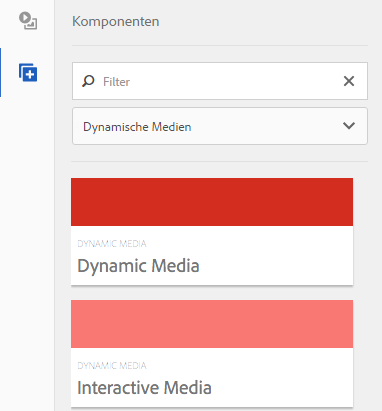
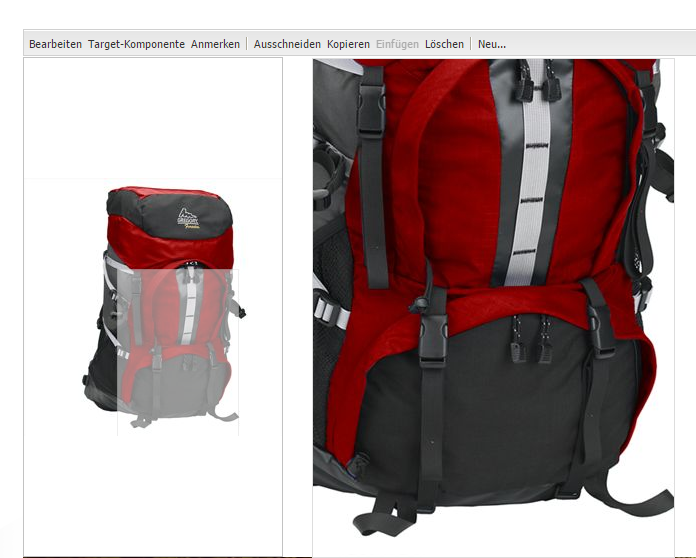
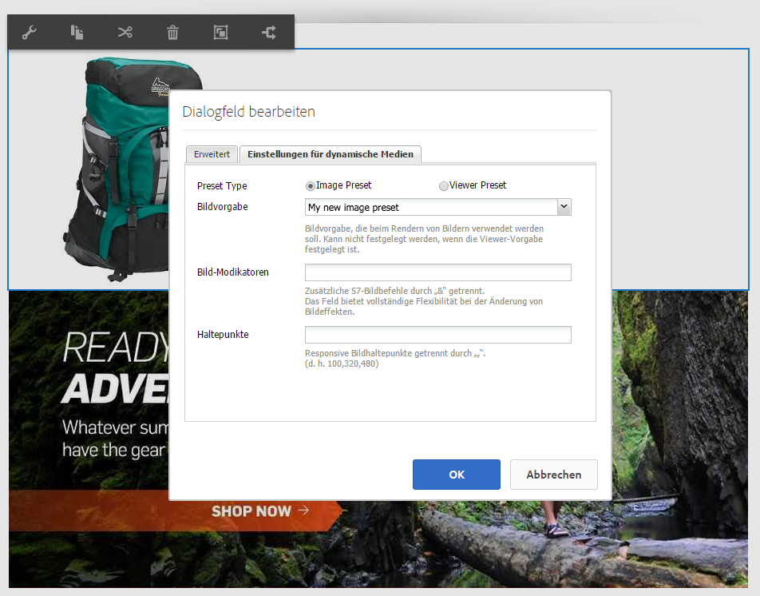
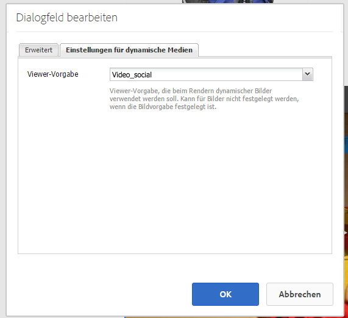

# Hinzufügen von Dynamic Media-Assets zu Seiten{#adding-dynamic-media-assets-to-pages}

Zum Hinzufügen der Funktion „Dynamic Media“ zu auf Websites verwendeten Assets können Sie die Komponente **[!UICONTROL Dynamic Media]** oder **[!UICONTROL Interaktive Medien]** direkt auf der Seite hinzufügen. Rufen Sie den Modus **[!UICONTROL Design]** auf und aktivieren Sie die Komponenten für Dynamic Media. Anschließend können Sie der Seite diese Komponenten und der Komponente Assets hinzufügen. „Dynamic Media“ und „Interaktive Medien“ sind intelligente Komponenten, die erkennen, ob Sie ein Bild oder ein Video hinzufügen. Die verfügbaren Optionen werden entsprechend angepasst.

Sie fügen Dynamic Media-Assets direkt zur Seite hinzu, wenn Sie Adobe Experience Manager als WCM verwenden.

>[!NOTE]
>
>Imagemaps sind für Karussellbanner umgehend verfügbar.

## Hinzufügen einer Dynamic Media-Komponente zu einer Seite {#adding-a-dynamic-media-component-to-a-page}

Das Hinzufügen einer Komponente vom Typ [!UICONTROL Dynamic Media] oder [!UICONTROL Interaktive Medien] entspricht dem Hinzufügen einer Komponente zu einer Seite. Die Komponenten vom Typ [!UICONTROL Dynamic Media] oder [!UICONTROL Interaktive Medien] werden in den folgenden Abschnitten ausführlicher beschrieben.

So fügen Sie einer Seite eine Komponente bzw. einen Viewer vom Typ „Dynamic Media“ hinzu:

1. Öffnen Sie in Experience Manager die Seite, auf der Sie die Dynamic Media-Komponente hinzufügen möchten.
1. Wenn keine Komponente vom Typ „Dynamic Media“ verfügbar ist, wählen Sie das Lineal im [!UICONTROL Sidekick], um in den Modus **[!UICONTROL Design]** zu gelangen.
1. Wählen Sie den Parsys **[!UICONTROL Bearbeiten]** aus.
1. Wählen Sie **[!UICONTROL Dynamic Media]** aus, damit Sie die Dynamic Media-Komponenten verfügbar machen können.

   >[!NOTE]
   >
   >Weitere Informationen finden Sie unter [Konfigurieren von Komponenten im Design-Modus](/help/sites-authoring/default-components-designmode.md).

1. Kehren Sie zum Modus **[!UICONTROL Bearbeiten]** zurück, indem Sie auf das Stiftsymbol im [!UICONTROL Sidekick] klicken.
1. Ziehen Sie die Komponente **[!UICONTROL Dynamic Media]** oder **[!UICONTROL Interaktive Medien]** aus der Gruppe **[!UICONTROL Sonstige]** im Sidekick an die gewünschte Stelle auf der Seite.
1. Klicken Sie auf **[!UICONTROL Bearbeiten]**, sodass die Komponente geöffnet wird.
1. [Bearbeiten Sie die Komponente](#dynamic-media-component) nach Bedarf.
1. Klicken Sie auf **[!UICONTROL OK]**, damit Ihre Änderungen gespeichert werden.

## Komponenten vom Typ „Dynamic Media“ {#dynamic-media-components}

[!UICONTROL Dynamic Media] und [!UICONTROL Interaktive Medien] sind im [!UICONTROL Sidekick] unter **[!UICONTROL Dynamic Media]** verfügbar. Verwenden Sie die Komponente **[!UICONTROL Interaktive Medien]** für beliebige interaktive Assets wie interaktive Videos, interaktive Bilder oder Karussellsets. Verwenden Sie für alle anderen Komponenten vom Typ „Dynamic Media“ die Komponente **[!UICONTROL Dynamic Media]**.

>[!NOTE]
>
>Diese Komponenten sind standardmäßig nicht verfügbar und müssen im Design-Modus ausgewählt werden, bevor sie verwendet werden können. [Nachdem sie im Design-Modus zur Verfügung gestellt wurden](/help/sites-authoring/default-components-designmode.md), können Sie die Komponenten wie jede andere Experience Manager-Komponente zu Ihrer Seite hinzufügen.

### Komponente „Dynamic Media“ {#dynamic-media-component}

Die Komponente „Dynamic Media“ ist intelligent. In Abhängigkeit davon, ob Sie ein Bild oder Video hinzufügen, haben Sie verschiedene Optionen. Die Komponente unterstützt Bildvorgaben, bildbasierte Viewer wie Bildsets sowie Rotationssets, Sets für gemischte Medien und Videos. Darüber hinaus ist der Viewer responsiv. Das heißt, die Größe des Bildschirms ändert sich automatisch entsprechend der Bildschirmgröße. Bei allen Viewern handelt es sich um HTML5-Viewer.

>[!NOTE]
>
>Wenn Sie die Komponente [!UICONTROL Dynamic Media] hinzufügen und **[!UICONTROL Einstellungen für Dynamic Media]** leer ist oder es nicht möglich ist, ein Asset ordnungsgemäß hinzuzufügen, überprüfen Sie Folgendes:
>
>* Sie haben [Dynamic Media aktiviert](/help/assets/config-dynamic.md). Dynamic Media ist standardmäßig deaktiviert.
>* Das Bild weißt eine Pyramid TIFF-Datei auf. Bilder, die vor der Aktivierung von Dynamic Media importiert wurden, verfügen nicht über eine Pyramid TIFF-Datei.
>

#### Arbeiten mit Bildern {#when-working-with-images}

Mit der Komponente [!UICONTROL Dynamic Media] können Sie dynamische Bilder, einschließlich Bildsets, Rotationssets und Sets für gemischte Medien, hinzufügen. Sie können Vergrößerungen sowie Verkleinerungen vornehmen und (sofern zutreffend) ein Bild in einem Rotationsset drehen oder ein Bild aus einem anderen Set auswählen.

Sie können zudem die Viewer-Vorgabe, Bildvorgabe oder das Bildformat direkt in der Komponente konfigurieren. Um ein Bild dynamisch zu machen, können Sie die Breakpoints festlegen oder eine dynamische Bildvorgabe anwenden.

Sie können die folgenden Einstellungen für Dynamic Media bearbeiten, indem Sie in der Komponente auf **[!UICONTROL Bearbeiten]** und dann auf die Registerkarte **[!UICONTROL Einstellungen für Dynamic Media]** klicken.

>[!NOTE]
>
>Standardmäßig ist die Bildkomponente für Dynamic Media adaptiv. Wenn Sie eine feste Größe einrichten möchten, legen Sie sie in der Komponente auf der Registerkarte **[!UICONTROL Erweitert]** mit den Eigenschaften **[!UICONTROL Breite]** und **[!UICONTROL Höhe]** fest.

**[!UICONTROL Viewer-Vorgabe]**: Wählen Sie im Dropdown-Menü eine vorhandene Viewer-Vorgabe aus. Wenn die gewünschte Viewer-Vorgabe nicht sichtbar ist, müssen Sie sie möglicherweise sichtbar machen. Siehe [Verwalten von Viewer-Vorgaben](/help/assets/managing-viewer-presets.md). Es ist nicht möglich, eine Viewer-Vorgabe auszuwählen, wenn Sie eine Bildvorgabe verwenden, und umgekehrt.

Diese Option ist nur beim Anzeigen von Bildsets, Rotationssets oder Sets für gemischte Medien verfügbar. Die angezeigten Viewer-Vorgaben sind intelligent. Das heißt, es werden nur relevante Viewer-Vorgaben angezeigt.

**[!UICONTROL Bildvorgabe]**: Wählen Sie im Dropdown-Menü eine vorhandene Bildvorgabe aus. Wenn die gewünschte Bildvorgabe nicht sichtbar ist, müssen Sie sie möglicherweise sichtbar machen. Siehe [Verwalten von Bildvorgaben](/help/assets/managing-image-presets.md). Es ist nicht möglich, eine Viewer-Vorgabe auszuwählen, wenn Sie eine Bildvorgabe verwenden, und umgekehrt.

Diese Option ist beim Anzeigen von Bildsets, Rotationssets oder Sets für gemischte Medien nicht verfügbar.

**[!UICONTROL Bildmodifikatoren]**: Sie können Bildeffekte ändern, indem Sie zusätzliche Bildbefehle bereitstellen. Diese werden unter [Verwalten von Bildvorgaben](/help/assets/managing-viewer-presets.md) und in der [Befehlsreferenz](https://experienceleague.adobe.com/docs/dynamic-media-developer-resources/image-serving-api/image-serving-api/http-protocol-reference/command-reference/c-command-reference.html?lang=de) beschrieben.

Diese Option ist beim Anzeigen von Bildsets, Rotationssets oder Sets für gemischte Medien nicht verfügbar.

**[!UICONTROL Breakpoints]**: Wenn Sie dieses Asset auf einer responsiven Website verwenden, müssen Sie die Seiten-Breakpoints hinzufügen. Bild-Breakpoints werden durch Kommas (,) getrennt. Diese Option kann verwendet werden, wenn in einer Bildvorgabe keine Höhe oder Breite festgelegt ist.

Diese Option ist beim Anzeigen von Bildsets, Rotationssets oder Sets für gemischte Medien nicht verfügbar.

Sie können die folgenden [!UICONTROL erweiterten Einstellungen] bearbeiten, indem Sie in der Komponente auf **[!UICONTROL Bearbeiten]** klicken.

**[!UICONTROL Titel]**: Ändern Sie den Bildtitel.

**[!UICONTROL Alternativer Text]**: Geben Sie dem Bild einen Titel, für die Benutzer, deren Grafiken deaktiviert sind.

Diese Option ist beim Anzeigen von Bildsets, Rotationssets oder Sets für gemischte Medien nicht verfügbar.

**[!UICONTROL URL, Öffnen in]**: Sie können ein Asset so einrichten, dass ein Link geöffnet wird. Legen Sie die **[!UICONTROL URL]** und **[!UICONTROL Öffnen in]** fest, um anzugeben, ob die Seite im selben Fenster oder in einem neuen Fenster geöffnet werden soll.

Diese Option ist beim Anzeigen von Bildsets, Rotationssets oder Sets für gemischte Medien nicht verfügbar.

**[!UICONTROL Breite und Höhe]**: Geben Sie einen Wert in Pixeln an, wenn das Bild eine feste Größe aufweisen soll. Wenn die Werte leer gelassen werden, ist das Asset adaptiv.

#### Arbeiten mit Videos {#when-working-with-video}

Verwenden Sie die Komponente **[!UICONTROL Dynamic Media]**, um Ihren Web-Seiten dynamische Videos hinzuzufügen. Beim Bearbeiten der Komponente können Sie eine vordefinierte Video-Viewer-Vorgabe für das Wiedergeben des Videos auf der Seite verwenden.

Sie können die folgenden [!UICONTROL Einstellungen für Dynamic Media] bearbeiten, indem Sie in der Komponente auf **[!UICONTROL Bearbeiten]** klicken.

>[!NOTE]
>
>Die Videokomponente für Dynamic Media ist standardmäßig adaptiv. Wenn sie eine feste Größe aufweisen soll, müssen Sie dies in der Komponente auf der Registerkarte **[!UICONTROL Erweitert]** mit **[!UICONTROL Breite]** und **[!UICONTROL Höhe]** festlegen.

**[!UICONTROL Viewer-Vorgabe]**: Wählen Sie im Dropdown-Menü eine vorhandene Video-Viewer-Vorgabe aus. Wenn die gewünschte Viewer-Vorgabe nicht sichtbar ist, müssen Sie sie möglicherweise sichtbar machen. Siehe [Verwalten von Viewer-Vorgaben](/help/assets/managing-viewer-presets.md).

Sie können die folgenden [!UICONTROL erweiterten] Einstellungen bearbeiten, indem Sie in der Komponente auf **[!UICONTROL Bearbeiten]** klicken.

**[!UICONTROL Titel]**: Ändern Sie den Videotitel.

**[!UICONTROL Breite und Höhe]**: Geben Sie einen Wert in Pixeln an, wenn das Video eine feste Größe aufweisen soll. Wenn die Werte leer gelassen werden, wird es adaptiv.

#### Wiedergabe von sicheren Videos {#how-to-delivery-secure-video}

Wenn Sie in Experience Manager 6.2 [FP-13480](https://experience.adobe.com/#/downloads/content/software-distribution/en/aem.html?package=/content/software-distribution/en/details.html/content/dam/aem/public/adobe/packages/cq620/featurepack/cq-6.2.0-featurepack-13480) installieren, können Sie festlegen, ob ein Video über eine sichere SSL-Verbindung (HTTPS) oder eine unsichere Verbindung (HTTP) wiedergegeben wird. Standardmäßig wird automatisch das Videowiedergabeprotokoll der Web-Seite übernommen, in die das Video eingebettet wird. Wenn die Webseite über HTTPS geladen wird, wird das Video ebenfalls über HTTPS wiedergegeben. Umgekehrt wird das Video über HTTP wiedergegeben, wenn die Web-Seite HTTP verwendet. In den meisten Fällen ist dieses Verhalten korrekt und es müssen keine Konfigurationsänderungen vorgenommen werden. Sie können dieses Standardverhalten jedoch überschreiben. Hängen Sie `VideoPlayer.ssl=on` entweder an das Ende eines URL-Pfads oder an die Liste der anderen Viewer-Konfigurationsparameter in einem Einbettungs-Code-Snippet an. Beide Aktionen erzwingen die sichere Videowiedergabe.

Weitere Informationen zur sicheren Videowiedergabe sowie zur Verwendung des Konfigurationsattributs `VideoPlayer.ssl` in Ihrem URL-Pfad finden Sie im Referenzhandbuch zu den Viewern unter [Sichere Videowiedergabe](https://experienceleague.adobe.com/docs/dynamic-media-developer-resources/library/viewers-aem-assets-dmc/video/c-html5-video-viewer-20-securevideodelivery.html?lang=de). Neben dem Video-Viewer ist die sichere Videowiedergabe auch für den Viewer für gemischte Medien und den Viewer für interaktive Videos verfügbar.

### Komponente „Interaktive Medien“ {#interactive-media-component}

Die interaktive Medienkomponente eignet sich für Assets, die interaktiv sind, wie Hotspots oder Imagemaps. Verwenden Sie bei interaktiven Bildern, interaktiven Videos oder Karussellbannern die Komponente **[!UICONTROL Interaktive Medien]**.

Die Komponente [!UICONTROL Interaktive Medien] ist eine intelligente Komponente. Je nachdem, ob Sie ein Bild oder Video hinzufügen, werden Ihnen unterschiedliche Optionen zur Verfügung gestellt. Darüber hinaus ist der Viewer responsiv. Das heißt, die Größe des Bildschirms ändert sich automatisch entsprechend der Bildschirmgröße. Bei allen Viewern handelt es sich um HTML5-Viewer.

Sie können die folgenden **[!UICONTROL allgemeinen]** Einstellungen bearbeiten, indem Sie in der Komponente auf **[!UICONTROL Bearbeiten]** klicken.

**[!UICONTROL Viewer-Vorgabe]**: Wählen Sie im Dropdown-Menü eine vorhandene Viewer-Vorgabe aus. Wenn die gewünschte Viewer-Vorgabe nicht sichtbar ist, müssen Sie sie möglicherweise sichtbar machen. Viewer-Vorgaben müssen veröffentlicht werden, bevor sie verwendet werden können. Siehe [Verwalten von Viewer-Vorgaben](/help/assets/managing-viewer-presets.md).

**[!UICONTROL Titel]**: Ändern Sie den Videotitel.

**[!UICONTROL Breite und Höhe]**: Geben Sie einen Wert in Pixeln an, wenn das Video eine feste Größe aufweisen soll. Wenn die Werte leer gelassen werden, wird es adaptiv.

Sie können die folgenden Einstellungen von **[!UICONTROL Zu Warenkorb hinzufügen]** bearbeiten, indem Sie in der Komponente auf **[!UICONTROL Bearbeiten]** klicken.

**[!UICONTROL Produkt-Asset anzeigen]**: Dieser Wert ist standardmäßig ausgewählt. Das Produkt-Asset zeigt ein Bild des Produkts an, wie im Commerce-Modul definiert. Deaktivieren Sie das Kontrollkästchen, um das Produkt-Asset nicht anzuzeigen.

**[!UICONTROL Produktpreis anzeigen]**: Dieser Wert ist standardmäßig ausgewählt. Der Produktpreis gibt den Preis des Artikels an, wie im Commerce-Modul definiert. Deaktivieren Sie das Kontrollkästchen, um den Produktpreis nicht anzuzeigen.

**[!UICONTROL Produktformular anzeigen]**: Dieser Wert ist standardmäßig nicht ausgewählt. Das Produktformular beinhaltet jegliche Produktvarianten, etwa hinsichtlich der Größe und der Farbe. Deaktivieren Sie das Kontrollkästchen, um die Produktvarianten nicht anzuzeigen.
