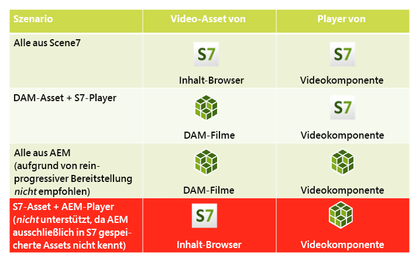
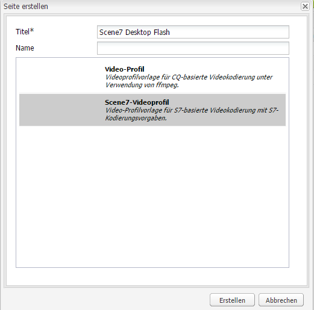
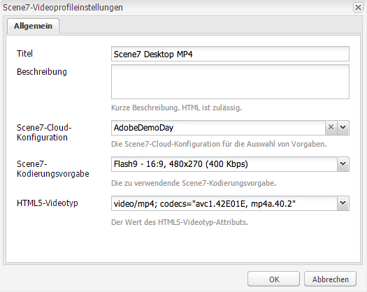

# Video{#video}

Assets bietet eine zentralisierte Video-Asset-Verwaltung, mit der Sie Videos direkt in Assets hochladen können, um sie automatisch in Dynamic Media Classic zu kodieren, und über Assets direkt auf Dynamic Media Classic-Videos zugreifen können, um sie für die Seitenbearbeitung zu erstellen.

Die Dynamic Media Classic-Videointegration erweitert die Reichweite optimierter Videos auf alle Bildschirme (automatische Geräte- und Bandbreitenerkennung).

* Die Dynamic Media Classic-Videokomponente führt automatisch eine Geräte- und Bandbreitenerkennung durch, um auf Desktop-, Tablet- und Mobilgeräten das richtige Format und die richtige Qualität für Videos wiederzugeben.
* Assets – Sie können adaptive Videosets statt einzelner Video-Assets verwenden. Ein adaptives Videoset ist ein Container für alle Videoausgabeformate, die zur nahtlosen Wiedergabe von Videos auf verschiedenen Bildschirmen erforderlich sind. Es umfasst Versionen desselben Videos, die mit unterschiedlichen Bitraten und Formaten kodiert wurden, wie 400 kBit/s, 800 kBit/s und 1000 kBit/s. Ein adaptives Videoset wird zusammen mit der S7-Videokomponente für adaptives Videostreaming auf mehreren Bildschirmen verwendet, einschließlich Desktopgeräten und iOS-, Android-, Blackberry- und Windows-Mobilgeräten. Weitere Informationen finden Sie in der [Dynamic Media Classic-Dokumentation zu adaptiven Videosets](https://experienceleague.adobe.com/docs/dynamic-media-classic/using/video/quick-start-video.html#video).

## Über FFMPEG und Dynamic Media Classic {#about-ffmpeg-and-scene}

Die Grundlage des standardmäßigen Videokodierungsprozesses ist die Verwendung der FFMPEG-basierten Integration mit Videoprofilen. Daher enthält der vordefinierte Workflow [!UICONTROL DAM Update Asset] die folgenden beiden ffmpeg-basierten Workflow-Schritte:

* FFMPEG-Miniaturen
* FFMPEG-Kodierung

Beachten Sie, dass die Aktivierung und Konfiguration der Dynamic Media Classic-Integration diese beiden Workflow-Schritte nicht automatisch aus dem standardmäßigen [!UICONTROL DAM Update Asset]-Erfassungsarbeitsablauf entfernt oder deaktiviert. Wenn Sie die FFMPEG-basierte Videokodierung in AEM bereits nutzen, ist es wahrscheinlich, dass FFMPEG in Ihren Erstellungsumgebungen bereits installiert ist. In diesem Fall würde ein neues Video, das mit Assets erfasst wird, zweimal kodiert: einmal vom FFMPEG-Kodierer und einmal von der Dynamic Media Classic-Integration.

Wenn Sie die FFMPEG-basierte Videokodierung in AEM konfiguriert und FFMPEG installiert haben, empfiehlt Adobe, die beiden FFMPEG-Workflows aus den Workflows [!UICONTROL DAM Update Asset] zu entfernen.

### Unterstützte Formate {#supported-formats}

Die folgenden Formate werden für die Dynamic Media Classic-Videokomponente unterstützt:

* F4V H.264
* H.264 (.mp4)

### Festlegen eines Speicherorts für hochgeladene Videos  {#deciding-where-to-upload-your-video}

Der Speicherort für hochgeladene Videos hängt von folgenden Faktoren ab:

* Benötigen Sie für das Video-Asset einen Workflow?
* Benötigen Sie für das Video-Asset eine Versionskontrolle?

Falls Sie eine der Fragen mit „ja“ beantworten können, laden Sie Ihr Video direkt in Adobe DAM hoch. Wenn die Antwort auf beide Fragen &quot;Nein&quot;lautet, laden Sie Ihr Video direkt in Dynamic Media Classic hoch. Der Workflow für die einzelnen Szenarien wird im folgenden Abschnitt beschrieben.

#### Wenn Sie Ihr Video direkt in Adobe Assets hochladen  {#if-you-are-uploading-your-video-directly-to-adobe-assets}

Wenn Sie einen Workflow oder eine Versionierung für Ihre Assets benötigen, sollten Sie sie zuerst in Adobe Assets hochladen. Der folgende Workflow wird empfohlen:

1. Laden Sie das Video-Asset in Adobe Assets hoch und kodieren und veröffentlichen Sie es automatisch in Dynamic Media Classic.
1. Öffnen Sie AEM und greifen Sie in WCM auf der Registerkarte **[!UICONTROL Filme]** des Content Finders auf Video-Assets zu.
1. Erstellen Sie mit der Video- oder Foundation-Videokomponente von Dynamic Media Classic.

#### Wenn Sie Ihr Video in Dynamic Media Classic hochladen {#if-you-are-uploading-your-video-to-scene}

Wenn Sie keinen Workflow oder keine Versionierung für Ihre Assets benötigen, sollten Sie Ihre Assets in Dynamic Media Classic hochladen. Der folgende Workflow wird empfohlen:

1. Richten Sie im Dynamic Media Classic-Desktop-Programm [ein geplantes FTP-Upload- und -Kodierungsprogramm für Dynamic Media Classic (systemautomatisiert)](https://help.adobe.com/en_US/scene7/using/WS70B173EC-4CAD-4b4c-BF9C-43A11F3A5950.html) ein.
1. Rufen Sie in AEM Video-Assets in WCM auf der Registerkarte **[!UICONTROL Dynamic Media Classic]** im Content Finder auf.
1. Erstellen Sie mit der Dynamic Media Classic-Videokomponente.

### Konfigurieren der Integration mit Dynamic Media Classic Video {#configuring-integration-with-scene-video}

**So konfigurieren Sie universelle Vorlagen**:

1. Navigieren Sie in **[!UICONTROL Cloud Services]** zu Ihrer **[!UICONTROL Dynamic Media Classic]**-Konfiguration und klicken Sie auf **[!UICONTROL Bearbeiten.]**
1. Wählen Sie die Registerkarte **[!UICONTROL Video]** aus.

   >[!NOTE]
   >
   >Die Registerkarte **[!UICONTROL Video]** wird nicht angezeigt, wenn die Seite keine Cloud-Konfiguration hat. Siehe [Aktivieren von Dynamic Media Classic für WCM](#enablingscene7forwcm).

1. Wählen Sie das Profil für adaptive Videokodierung, ein Standardprofil für die Kodierung einzelner Videos, oder ein benutzerdefiniertes Videokodierungsprofil aus.

   >[!NOTE]
   >
   >Weitere Informationen dazu, was die Videovorgaben bedeuten, finden Sie unter [Videovorgaben für die Kodierung von Videodateien](https://experienceleague.adobe.com/docs/dynamic-media-classic/using/setup/application-setup.html?lang=en#video-presets-for-encoding-video-files).
   >
   >Adobe empfiehlt, entweder beide adaptive Videosets bei der Konfiguration der universellen Vorlagen oder die Option **[!UICONTROL Adaptive Videokodierung]** auszuwählen.

1. Die ausgewählten Kodierungsprofile werden automatisch auf alle Videos angewendet, die in den für diese Dynamic Media Classic-Cloud-Konfiguration eingerichteten CQ DAM-Zielordner hochgeladen wurden. Sie können mehrere Dynamic Media Classic-Cloud-Konfigurationen mit verschiedenen Zielordnern einrichten, um bei Bedarf unterschiedliche Kodierungsprofile anzuwenden.

### Aktualisieren von Viewer- und Kodierungsvorlagen {#updating-viewer-and-encoding-presets}

Wenn Sie die Viewer- und Kodierungsvorgaben für Videos in AEM aktualisieren müssen, da die Vorgaben in Dynamic Media Classic aktualisiert wurden, navigieren Sie zur Dynamic Media Classic-Konfiguration in der Cloud-Konfiguration und klicken Sie auf **Viewer- und Kodierungsvorgaben aktualisieren**.

### Hochladen des Primärvideos {#uploading-your-master-video}

So laden Sie Ihr Primärvideo von Adobe DAM in Dynamic Media Classic hoch:

1. Navigieren Sie zum CQ DAM-Zielordner, in dem Sie Ihre Cloud-Konfiguration mit Dynamic Media Classic-Kodierungsprofilen eingerichtet haben.
1. Klicken Sie auf **[!UICONTROL Upload]** , um das Primärvideo hochzuladen. Das Hochladen und die Kodierung von Videos sind abgeschlossen, nachdem der Workflow [!UICONTROL DAM-Update-Asset] abgeschlossen ist und **[!UICONTROL In Dynamic Media Classic veröffentlichen]** ein Häkchen aufweist.

   >[!NOTE]
   >
   >Es kann etwas Zeit in Anspruch nehmen, bis die Videominiaturen erstellt wurden.

   Wenn Sie das DAM-Primärvideo auf die Videokomponente ziehen, wird auf *alle* der Dynamic Media Classic-kodierten Proxy-Ausgabeformate für die Bereitstellung zugegriffen.

### Foundation-Videokomponente versus Dynamic Media Classic-Videokomponente {#foundation-video-component-versus-scene-video-component}

Bei Verwendung von AEM haben Sie Zugriff auf die Videokomponente, die in Sites verfügbar ist, und die Dynamic Media Classic-Videokomponente. Diese Komponenten sind nicht austauschbar.

Die Dynamic Media Classic-Videokomponente funktioniert nur für Dynamic Media Classic-Videos. Die Foundation-Komponente funktioniert mit Videos, die in AEM (mithilfe von ffmpeg) und Dynamic Media Classic-Videos gespeichert sind.

Die folgende Matrix verdeutlicht, wann Sie welche Komponente nutzen sollten:

>[!NOTE]
>
>Standardmäßig verwendet die Dynamic Media Classic-Videokomponente das universelle Videoprofil. Sie können jedoch den HTML5-basierten Videoplayer für die Verwendung durch AEM abrufen. Kopieren Sie in Dynamic Media Classic den Einbettungscode des vordefinierten HTML5-Videoplayers und fügen Sie ihn in Ihre AEM ein.

## AEM-Videokomponente {#aem-video-component}

Auch wenn die Verwendung der Dynamic Media Classic-Videokomponente für die Anzeige von Dynamic Media Classic-Videos empfohlen wird, wird in diesem Abschnitt beschrieben, wie Dynamic Media Classic-Videos mit der [!UICONTROL Foundation-Videokomponente] in AEM verwendet werden, um die Vollständigkeit zu gewährleisten.

### Vergleich von AEM und Dynamic Media Classic-Videos {#aem-video-and-scene-video-comparison}

Die folgende Tabelle bietet einen allgemeinen Vergleich der unterstützten Funktionen zwischen der AEM Foundation-Videokomponente und der Dynamic Media Classic-Videokomponente:

|  | AEM Foundation Video | Dynamic Media Classic-Video |
|---|---|---|
| Ansatz | HTML5 hat Priorität. Flash dient nur zum Ausweichen bei Nicht-HTML5-Inhalten. | Flash auf den meisten Desktopgeräten HTML5 kommt auf Mobilgeräten und Tablets zum Einsatz. |
| Bereitstellung | Progressiv | Adaptives Streaming |
| Nachverfolgung | Ja | Ja |
| Erweiterbarkeit | Ja | Nein |
| Mobile Videos | Ja | Ja |

### Einrichtung  {#setting-up}

#### Erstellen von Videoprofilen {#creating-video-profiles}

Die verschiedenen Videokodierungen werden entsprechend den in der Cloud-Konfiguration von Dynamic Media Classic ausgewählten Dynamic Media Classic-Kodierungsvorgaben erstellt. Damit die Foundation-Videokomponente diese verwenden kann, muss für jede ausgewählte Dynamic Media Classic-Kodierungsvorgabe ein Videoprofil erstellt werden. Damit kann die Videokomponente die DAM-Ausgabeformate entsprechend auswählen.

>[!NOTE]
>
>Neue Videoprofile und Änderungen daran müssen für eine Veröffentlichung aktiviert werden.

1. Starten Sie AEM, gehen Sie zu **[!UICONTROL Tools]** und wählen Sie **[!UICONTROL Konfigurationskonsole aus.]** Navigieren Sie in der Konfigurationskonsole in der Navigationsstruktur zu  **[!UICONTROL Tools]**  >  **[!UICONTROL Assets]**  >  **[!UICONTROL Video-]** Profile.
1. Erstellen Sie ein neues Dynamic Media Classic-Videoprofil. Im **[!UICONTROL Neu..]** wählen Sie im Menü **[!UICONTROL Seite erstellen]** aus und wählen Sie dann die Vorlage Dynamic Media Classic-Videoprofil aus. Geben Sie der neuen Videoprofilseite einen Namen und klicken Sie auf **[!UICONTROL Erstellen.]**

   

1. Bearbeiten Sie das neue Videoprofil. Wählen Sie zuerst die Cloud-Konfiguration aus. Wählen Sie anschließend dieselbe Kodierungsvorlage aus, die Sie bereits in der Cloud-Konfiguration ausgewählt haben.

   

   | Eigenschaft | Beschreibung |
   |---|---|
   | Dynamic Media Classic Cloud-Konfiguration | Die Cloud-Konfiguration, die für die Kodierungsvorlagen verwendet werden soll |
   | Dynamic Media Classic-Kodierungsvorgabe | Die Kodierungsvorlage, die diesem Videoprofil zugeordnet werden soll |
   | HTML5-Videotyp | Diese Eigenschaft ermöglicht, den Wert der Typeigenschaft des HTML5-Videoquellelements festzulegen. Diese Informationen werden nicht von den Kodierungsvorgaben von Dynamic Media Classic bereitgestellt, sind aber für die korrekte Wiedergabe der Videos mit dem HTML5-Videoelement erforderlich. Eine Liste für gängige Formate wird bereitgestellt, kann jedoch für andere Formate überschrieben werden. |

   Wiederholen Sie diesen Schritt für alle in der Cloud-Konfiguration ausgewählten Kodierungsvorlagen, die Sie in der Videokomponente verwenden möchten.

#### Konfigurieren des Designs  {#configuring-design}

Die Foundation-Videokomponente muss darüber informiert sein, welche Videoprofile verwendet werden sollen, damit sie die Videoquellenliste erstellen kann. Öffnen Sie den Designdialog der Videokomponenten und konfigurieren Sie das Design der Komponenten für die Nutzung der neuen Videoprofile.

>[!NOTE]
>
>Wenn Sie die Foundation-Videokomponente auf einer Mobilseite verwenden, müssen Sie diese Schritte für das Design der Mobilseite möglicherweise wiederholen.

>[!NOTE]
>
>Bei Änderungen am Design ist eine Aktivierung des Designs erforderlich, damit sie für die Veröffentlichung übernommen wird.

1. Öffnen Sie den Designdialog der Foundation-Videokomponente und wechseln Sie auf die Registerkarte **[!UICONTROL Profile]**. Löschen Sie dann die nativen Profile und fügen Sie die neuen Dynamic Media Classic-Videoprofile hinzu. Die Reihenfolge der Profilliste im Dialogfeld &quot;Design&quot;definiert auch die Reihenfolge des Videoquellenelements beim Rendern.
1. Bei Browsern, die kein HTML5 unterstützen, ermöglicht die Videokomponente ein Ausweichen auf Flash. Öffnen Sie den Designdialog der Videokomponenten und wechseln Sie auf die Registerkarte **[!UICONTROL Flash]**. Konfigurieren Sie die Einstellungen des Flash-Players und ordnen Sie ein Ersatzprofil für den Flash-Player zu.

#### Checkliste {#checklist}

1. Erstellen Sie eine Dynamic Media Classic-Cloud-Konfiguration. Vergewissern Sie sich, dass die Videokodierungsvorlagen festgelegt sind und das Importprogramm ausgeführt wird.
1. Erstellen Sie für jede in der Cloud-Konfiguration ausgewählte Videokodierungsvorgabe ein Dynamic Media Classic-Videoprofil.
1. Die Videoprofile müssen aktiviert sein.
1. Konfigurieren Sie das Design der Foundation-Videokomponente auf Ihrer Seite.
1. Aktivieren Sie das Design, nachdem Sie mit Ihren Designänderungen fertig sind.
