# Hinzufügen von Scene7-Features zu Ihrer Seite{#adding-scene-features-to-your-page}

[Adobe Scene7](https://help.adobe.com/en_US/scene7/using/WS26AB0D9A-F51C-464e-88C8-580A5A82F810.html) ist eine gehostete Lösung für das Verwalten, Erweitern, Veröffentlichen und Bereitstellen von Rich-Media-Ressourcen für das Web, für Mobilgeräte, E-Mails, für mit dem Internet verbundene Anzeigen und für den Druck.

Sie können Experience Manager-Assets anzeigen, die in Scene7 in verschiedenen Viewern veröffentlicht wurden:

* Zoom
* Flyout
* Video
* Bildvorlage
* Bild

Sie können digitale Assets direkt aus Experience Manager in Scene7 veröffentlichen und digitale Assets aus Scene7 in Experience Manager veröffentlichen.

In diesem Dokument wird beschrieben, wie Sie digitale Assets von Experience Manager in Scene7 veröffentlichen und umgekehrt. Die Viewer werden auch detailliert beschrieben. Informationen zum Konfigurieren von Experience Manager für Scene7 finden Sie unter [Integrieren von Scene7 mit Experience Manager](/help/sites-administering/scene7.md).

Siehe auch [Hinzufügen von Imagemaps](/help/assets/image-maps.md).

Weitere Informationen zur Verwendung von Videokomponenten mit Experience Manager finden Sie unter folgenden Themen:

* [Video](/help/sites-classic-ui-authoring/manage-assets-classic-s7-video.md)

>[!NOTE]
>
>Wenn Scene7-Assets nicht richtig angezeigt werden, stellen Sie sicher, dass Dynamic Media [disabled](/help/assets/config-dynamic.md#disabling-dynamic-media) ist, und aktualisieren Sie dann die Seite.

## Manuelles Veröffentlichen über Assets in Scene7 {#manually-publishing-to-scene-from-assets}

Sie können digitale Assets über die Konsole „Assets“ auf der klassischen Benutzeroberfläche oder direkt über das Asset in Scene7 veröffentlichen.

>[!NOTE]
>
>Experience Manager wird asynchron in Scene7 veröffentlicht. Nachdem Sie auf **Veröffentlichen** geklickt haben, dauert es möglicherweise ein paar Sekunden, bis das Asset in Scene7 veröffentlicht wird.

### Veröffentlichen über die Asset-Konsole {#publishing-from-the-assets-console}

So veröffentlichen Sie über die Konsole „Assets“ in Scene7, wenn sich die Assets in einem Scene7-Zielordner befinden:

1. Klicken Sie in der klassischen Experience Manager-Benutzeroberfläche auf **Digitale Assets** , um auf den Digital Asset Manager zuzugreifen.

1. Wählen Sie das Asset (oder die Assets) oder den Ordner innerhalb des Zielordners aus, den Sie in Scene7 veröffentlichen möchten, klicken Sie dann mit der rechten Maustaste und wählen Sie **In Scene7 veröffentlichen** aus. Alternativ können Sie **In Scene7 veröffentlichen** über das Menü **Tools auswählen**.

   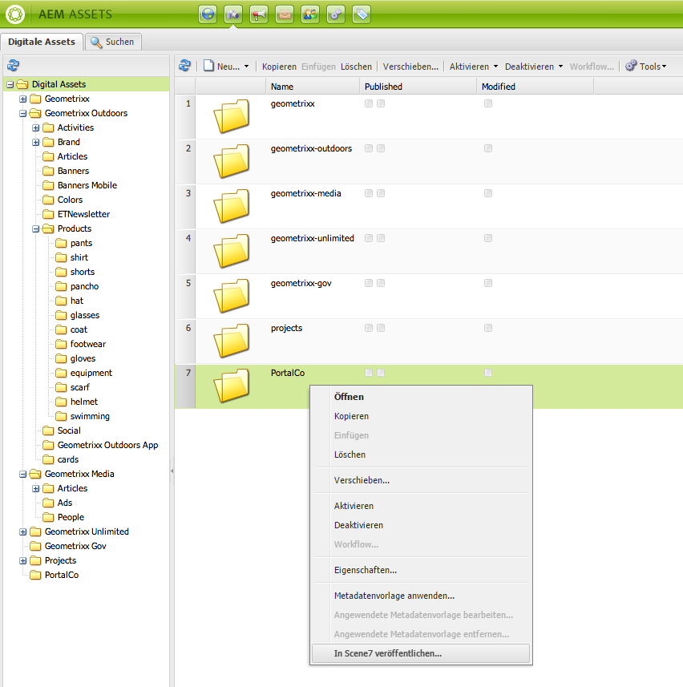

1. Wechseln Sie zu Scene7 und überprüfen Sie, ob die Assets verfügbar sind.

   >[!NOTE]
   >
   >Wenn sich die Assets nicht in einem Scene7-synchronisierten Ordner befinden, ist **In Scene7 veröffentlichen** zwar in beiden Menüs sichtbar, aber deaktiviert.

### Veröffentlichen über ein Asset  {#publishing-from-an-asset}

Sie können ein Asset manuell veröffentlichen, sofern sich dieses Asset im synchronisierten Scene7-Ordner befindet.

>[!NOTE]
>
>Wenn sich das Asset nicht im Scene7-synchronisierten Ordner befindet, wird der Link **In Scene7 veröffentlichen** nicht angezeigt.

So veröffentlichen Sie direkt über ein digitales Asset in Scene7:

1. Klicken Sie in Experience Manager auf **Digitale Assets** , um auf den Digital Asset Manager zuzugreifen.

1. Doppelklicken Sie, um ein Asset zu öffnen.

1. Wählen Sie im Asset-Detailbereich **In Scene7 veröffentlichen** aus.

   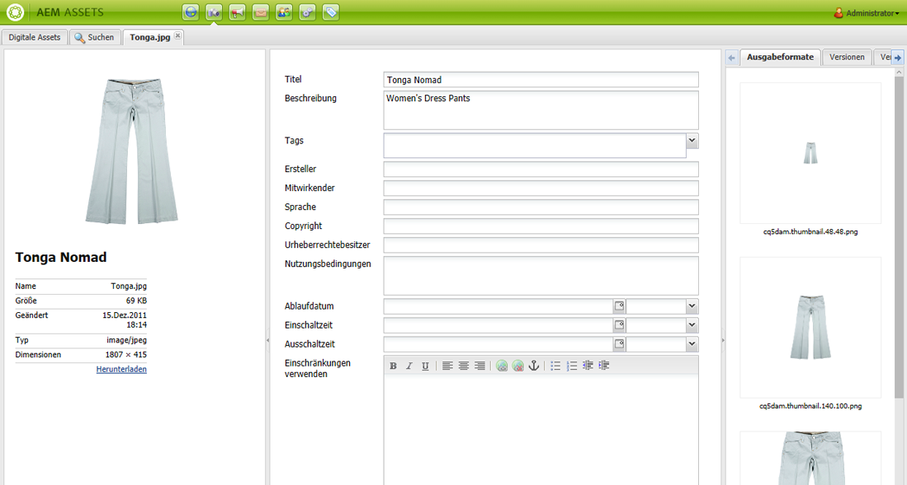

1. Der Link ändert sich zu **Wird veröffentlicht ...** und dann zu **Veröffentlicht**. Wechseln Sie zu Scene7 und überprüfen Sie, ob das Asset verfügbar ist.

   >[!NOTE]
   >
   >Wenn das Asset nicht ordnungsgemäß in Scene7 veröffentlicht wurde, wird der Link zu **Veröffentlichung fehlgeschlagen** geändert. Wenn das Asset bereits in Scene7 veröffentlicht wurde, lautet der Link **Erneut in Scene7 veröffentlichen**. Durch das erneute Veröffentlichen können Sie Änderungen an einem Asset in Experience Manager vornehmen und es erneut veröffentlichen.

### Veröffentlichen von Assets außerhalb des CQ-Zielordners {#publishing-assets-from-outside-the-cq-target-folder}

Adobe empfiehlt, dass Sie Assets nur über die im Scene7-Zielordner befindlichen Assets in Scene7 veröffentlichen. Wenn Sie jedoch Assets aus einem Ordner außerhalb des Zielordners hochladen müssen, können Sie dies dennoch tun, indem Sie sie in einen Ordner **Ad-hoc** in Scene7 hochladen.

Dafür müssen Sie zunächst die Cloud-Konfiguration für die Seite konfigurieren, auf der das Asset angezeigt wird. Anschließend fügen Sie der Seite eine Scene7-Komponente hinzu, ziehen ein Asset und legen es auf der Komponente ab. Nachdem die Seiteneigenschaften für diese Seite festgelegt wurden, wird ein Link **In Scene7 veröffentlichen** angezeigt, der beim Hochladen ausgewählter Trigger auf Scene7 erscheint.

>[!NOTE]
>
>Im Ad-hoc-Ordner befindliche Assets werden im Scene7-Inhaltsbrowser nicht angezeigt.

So veröffentlichen Sie außerhalb des CQ-Zielordners befindliche Assets:

1. Klicken Sie in der klassischen Benutzeroberfläche in Experience Manager auf **Websites** und navigieren Sie zur Webseite, der Sie ein digitales Asset hinzufügen möchten, das noch nicht in Scene7 veröffentlicht wurde. (Es gelten normale Seitenübernahmeregeln.)

1. Klicken Sie im Sidekick auf das Symbol **Seite** und klicken Sie auf **Seiteneigenschaften**.

1. Klicken Sie auf **Cloud-Services**, klicken Sie auf **Service hinzufügen** und wählen Sie **Scene7** aus.
1. Wählen Sie in der Dropdown-Liste **Adobe Scene7** die gewünschte Konfiguration aus und klicken Sie auf **OK**.

   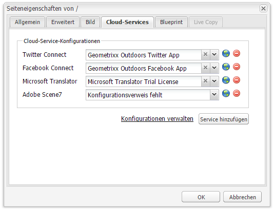

1. Fügen Sie auf der Webseite eine Scene7-Komponente zur gewünschten Position auf der Seite hinzu.
1. Ziehen Sie in der Inhaltssuche ein digitales Asset zur Komponente. Es wird ein Link zur **Prüfung des Scene7-Veröffentlichungsstatus** angezeigt.

   >[!NOTE]
   >
   >Wenn sich das digitale Asset im CQ-Zielordner befindet, wird kein Link zu **Überprüfen des Scene7-Veröffentlichungsstatus** angezeigt. Die Assets werden einfach in der Komponente platziert.

   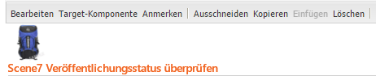

1. Klicken Sie auf die Option zum Prüfen des Scene7-Veröffentlichungsstatus. **** Wenn die Assets nicht veröffentlicht werden, veröffentlicht Experience Manager das Asset in Scene7. Nach dem Upload befindet sich das Asset im Ad-hoc-Ordner. Standardmäßig befindet sich der Ad-hoc-Ordner unter **Name_des_Unternehmens/CQ5_adhoc**. Sie können dies [bei Bedarf konfigurieren](#configuringtheadhocfolder).

   >[!NOTE]
   >
   >Wenn sich das Asset nicht in einem Scene7-synchronisierten Ordner befindet und keine Scene7-Cloud-Konfiguration mit der aktuellen Seite verknüpft ist, ist der Upload fehlerhaft.

## Scene7-Komponenten  {#scene-components}

Die folgenden Scene7-Komponenten sind in Experience Manager verfügbar:

* Zoom
* Flyout (Zoom)
* Bildvorlage
* Bild
* Video

>[!NOTE]
>
>Diese Komponenten sind standardmäßig nicht verfügbar und müssen im Designmodus ausgewählt werden, bevor sie verwendet werden können.

Nachdem sie im Designmodus verfügbar gemacht wurden, können Sie die Komponenten wie jede andere Experience Manager-Komponente zu Ihrer Seite hinzufügen. Noch nicht in Scene7 veröffentlichte Assets werden in Scene7 in einem synchronisierten Ordner oder auf einer Seite oder mit einer Scene7-Cloud-Konfiguration veröffentlicht.

>[!NOTE]
>
>Wenn Sie benutzerdefinierte S7-Viewer erstellen und entwickeln und die Inhaltssuche verwenden, müssen Sie den Parameter **allowfullscreen** explizit hinzufügen.

### Hinweis zur Einstellung von Flash-Viewer {#flash-viewers-end-of-life-notice}

Mit Wirkung vom 31. Januar 2017 wird die Flash-Viewer-Plattform nicht mehr offiziell von Adobe Scene7 unterstützt.

Weitere Informationen zu dieser wichtigen Änderung finden Sie unter [Fragen und Antworten zum Lebenszyklusende von Flash Viewer](https://docs.adobe.com/content/docs/en/aem/6-1/administer/integration/marketing-cloud/scene7/flash-eol.html).

### Hinzufügen einer Scene7-Komponente zu einer Seite  {#adding-a-scene-component-to-a-page}

Das Hinzufügen einer Scene7-Komponente zu einer Seite entspricht dem Hinzufügen einer Komponente zu einer Seite. Die Scene7-Komponenten werden in den folgenden Abschnitten detailliert beschrieben.

So fügen Sie eine Scene7-Komponente bzw. einen -Viewer zu einer Seite auf der klassischen Benutzeroberfläche hinzu:

1. Öffnen Sie in Experience Manager die Seite, auf der Sie die Scene7-Komponente hinzufügen möchten.

1. Klicken Sie bei nicht verfügbaren Scene7-Komponenten auf das Lineal im Sidekick, um in den Modus **Design** zu wechseln. Klicken Sie auf das ParSys **Bearbeiten** und wählen Sie alle **Scene7**-Komponenten aus, um sie verfügbar zu machen.

1. Kehren Sie zum Modus **Bearbeiten** zurück, indem Sie im Sidekick auf das Stiftsymbol klicken.

1. Ziehen Sie eine Komponente aus der **Scene7**-Gruppe in den Sidekick auf die Seite an der gewünschten Position.

1. Klicken Sie auf **Bearbeiten**, um die Komponente zu öffnen.

1. Bearbeiten Sie die Komponente bei Bedarf und klicken Sie auf **OK**, um die Änderungen zu speichern.

### Hinzufügen von interaktiven Anzeigeerlebnissen zu einer dynamischen Website  {#adding-interactive-viewing-experiences-to-a-responsive-website}

Dynamisches Design für Ihre Assets bedeutet, dass Ihre Assets in Abhängigkeit ihrer Anzeigeposition angepasst werden. Mithilfe des dynamischen Designs können dieselben Assets auf mehreren Geräten effektiv dargestellt werden.

So fügen Sie ein interaktives Anzeigeerlebnis zu einer dynamischen Website auf der klassischen Benutzeroberfläche hinzu:

1. Melden Sie sich bei Experience Manager an und stellen Sie sicher, dass Sie [konfigurierte Adobe Scene7-Cloud Services](/help/sites-administering/scene7.md#configuring-scene-integration) haben und dass Scene7-Komponenten verfügbar sind.

   >[!NOTE]
   >
   >Wenn Scene7 WCM-Komponenten nicht verfügbar sind, aktivieren Sie sie unbedingt im Designmodus.

1. Ziehen Sie auf einer Website mit aktivierten Scene7-Komponenten einen **Bild**-Viewer auf die Seite.
1. Bearbeiten Sie die Komponente und passen Sie die Haltepunkte auf der Registerkarte **Scene7-Einstellungen** an.

   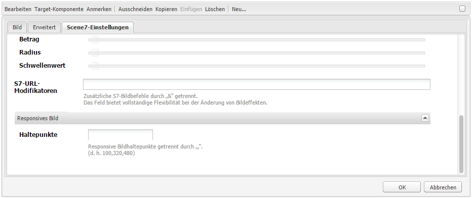

1. Bestätigen Sie, dass die Größe der Viewer dynamisch geändert wird und dass alle Interaktionen für Desktopcomputer, Tablets und Mobilgeräte optimiert sind.

### Für alle Scene7-Komponenten gemeinsame Einstellungen  {#settings-common-to-all-scene-components}

Auch wenn sich die Konfigurationsoptionen unterscheiden, sind folgende für alle Scene7-Komponenten gleich:

* **Dateiverweis**: Navigieren Sie zu einer Datei, die Sie referenzieren möchten. Der Dateiverweis zeigt die Asset-URL und nicht zwangsläufig die vollständige Scene7-URL, einschließlich der URL-Befehle und -Parameter. Das Hinzufügen von Scene7-URL-Befehlen und -Parametern ist in diesem Feld nicht möglich. Sie müssen über die entsprechende Funktionalität in der Komponente hinzugefügt werden.
* **Breite**: Hiermit kann die Breite angepasst werden.
* **Höhe**: Hiermit kann die Höhe angepasst werden.

Sie können diese Konfigurationsoptionen festlegen, indem Sie eine Scene7-Komponente (per Doppelklick) öffnen. Zum Beispiel beim Öffnen einer **Zoom**-Komponente:

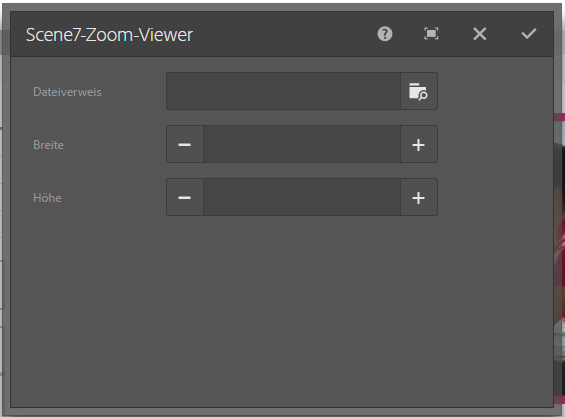

### Zoom {#zoom}

Die HTML5 Zoom-Komponente zeigt ein größeres Bild an, wenn Sie die Taste „+“ drücken.

Das Asset verfügt unten über Zoomwerkzeuge. Klicken Sie auf **+** zum Vergrößern. Klicken Sie auf **-** zum Verkleinern. Wenn Sie auf **x** oder den Pfeil zum Zurücksetzen des Zooms klicken, wird das Bild wieder in die Originalgröße des importierten Bildes versetzt. Klicken Sie auf die diagonalen Pfeile, um es im Vollbild anzuzeigen. Klicken Sie auf **Bearbeiten**, um die Komponente zu konfigurieren. Mit dieser Komponente können Sie [Einstellungen konfigurieren, die für alle Scene7-Komponenten](#settings-common-to-all-scene-components) gelten.

### Flyout {#flyout}

In der HTML5 Flyout-Komponente wird das Asset als geteilter Bildschirm angezeigt. Links wird das Asset in der angegebenen Größe angezeigt, rechts wird der Zoomteil angezeigt. Klicken Sie auf **Bearbeiten**, um die Komponente zu konfigurieren. Mit dieser Komponente können Sie [Einstellungen konfigurieren, die für alle Scene7-Komponenten](/help/sites-administering/scene7.md#settingscommontoallscene7components) gelten.

>[!NOTE]
>
>Wenn die Flyout-Komponente eine benutzerdefinierte Größe aufweist, wird diese benutzerdefinierte Größe verwendet und die dynamische Einrichtung der Komponente ist deaktiviert.
>
>Wenn Ihre Flyout-Komponente die in der Designansicht festgelegte Standardgröße verwendet, wird die Standardgröße verwendet und die Komponente erstreckt sich, um die Seitenlayoutgröße mit der responsiven Einrichtung der aktivierten Komponente anzupassen. Beachten Sie jedoch, dass die responsive Einrichtung der Komponente eingeschränkt ist. Beim Verwenden der Flyout-Komponente mit dynamischer Einrichtung sollten Sie sie nicht mit vollständiger Seitendehnung verwenden. Andernfalls kann das Flyout über den rechten Rand der Seite hinausgehen.

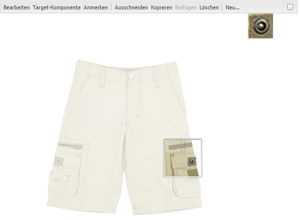

### Bild {#image}

Mit der Scene7-Bildkomponente können Sie Ihren Bildern Scene7-Funktionen hinzufügen. Dazu zählen beispielsweise Scene7-Modifizierer, -Bilder oder Viewer-Vorgaben und Scharfzeichnen. Die Scene7-Bildkomponente ähnelt anderen Bildkomponenten in Experience Manager mit speziellen Scene7-Funktionen. In diesem Beispiel wurde der Scene7-URL-Modifizierer **&amp;op_invert=1** auf das Bild angewendet.

**Titel, Alt** Text: Fügen Sie auf der Registerkarte Erweitert einen Titel zum Bild und alternativen Text für die Benutzer hinzu, deren Grafiken deaktiviert sind.

**URL, Öffnen** in: Sie können ein Asset von festlegen, um einen Link zu öffnen. Legen Sie die URL fest. Geben Sie in „Öffnen in“ an, ob der Link im selben oder einem neuen Fenster geöffnet werden soll.

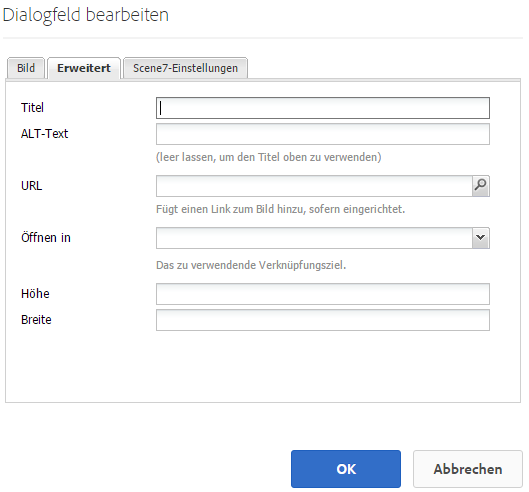

**Viewer-** Vorgabe: Wählen Sie eine vorhandene Viewer-Vorgabe aus dem Dropdown-Menü aus. Wenn die gewünschte Viewer-Vorgabe nicht sichtbar ist, müssen Sie sie möglicherweise sichtbar machen. Siehe „Verwalten von Viewer-Vorgaben“. Es ist nicht möglich, eine Viewer-Vorgabe auszuwählen, wenn Sie eine Bildvorgabe verwenden, und umgekehrt.

**Scene7-** Konfiguration Wählen Sie die Scene7-Konfiguration aus, die Sie zum Abrufen aktiver Bildvorgaben aus dem SPS verwenden möchten.

**Bildvorgabe** Wählen Sie eine vorhandene Bildvorgabe aus dem Dropdown-Menü aus. Wenn die gewünschte Bildvorgabe nicht sichtbar ist, müssen Sie sie möglicherweise sichtbar machen. Siehe „Verwalten von Bildvorgaben“. Es ist nicht möglich, eine Viewer-Vorgabe auszuwählen, wenn Sie eine Bildvorgabe verwenden, und umgekehrt.

**Ausgabeformat** Wählen Sie das Ausgabeformat des Bildes aus, z. B. jpeg. In Abhängigkeit des von Ihnen ausgewählten Ausgabeformats stehen Ihnen möglicherweise zusätzliche Konfigurationsoptionen zur Verfügung. Siehe Best Practices für Bildvorgaben.

**** ScharfzeichnenWählen Sie aus, wie das Bild scharfgezeichnet werden soll. Das Scharfzeichnen wird unter Best Practices für Bildvorgaben und in den Best Practices für das Scharfzeichnen detailliert beschrieben.

**URL** ModifiersSie können Bildeffekte ändern, indem Sie zusätzliche S7-Bildbefehle bereitstellen. Diese werden unter Bildvorgaben und in der Befehlsreferenz beschrieben.

**** HaltepunkteWenn Ihre Website dynamisch ist, möchten Sie die Haltepunkte anpassen. Haltepunkte müssen durch Kommas (,) voneinander getrennt werden.

### Bildvorlage {#image-template}

Bei [Scene7-Bildvorlagen](https://help.adobe.com/en_US/scene7/using/WS60B68844-9054-4099-BF69-3DC998A04D3C.html) handelt es sich um Photoshop-Inhalt mit mehreren Ebenen, der in Scene7 importiert wurde, wo Inhalt und Eigenschaften zwecks Variabilität parametrisiert wurden. Mit der Komponente **Bildvorlage** können Sie Bilder importieren und den Text dynamisch in Experience Manager ändern. Zusätzlich können Sie die Komponente **Bildvorlage** dahingehend konfigurieren, dass sie Werte aus dem Clientkontext übernimmt, damit das Bild jedem Benutzer personalisiert angezeigt wird.

Klicken Sie auf **Bearbeiten**, um die Komponente zu konfigurieren. Sie können [Einstellungen konfigurieren, die für alle Scene7-Komponenten](/help/sites-administering/scene7.md#settingscommontoallscene7components) gelten, sowie andere in diesem Abschnitt beschriebene Einstellungen.

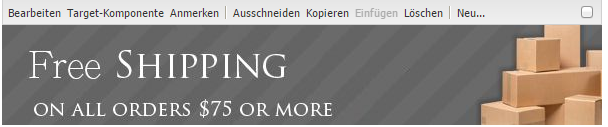

**Dateiverweis, Breite,** HeightSee Einstellungen, die für alle Scene7-Komponenten gelten.

>[!NOTE]
>
>Scene7-URL-Befehle und -Parameter können nicht direkt zur Dateiverweis-URL hinzugefügt werden. Sie können nur auf der Komponenten-Benutzeroberfläche im Bedienfeld **Parameter** definiert werden.

**Titel, ALT-** Text: Fügen Sie auf der Registerkarte Scene7-Bildvorlage einen Titel zum Bild und Alternativtext für die Benutzer hinzu, deren Grafiken deaktiviert sind.

**URL, Öffnen** in: Sie können ein Asset von festlegen, um einen Link zu öffnen. Legen Sie die URL fest. Geben Sie in „Öffnen in“ an, ob der Link im selben oder einem neuen Fenster geöffnet werden soll.

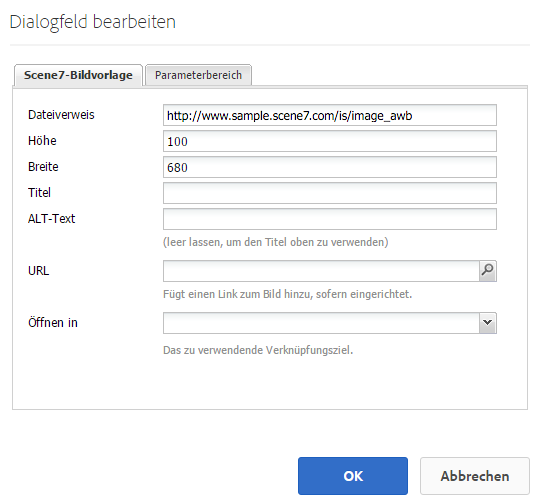

**Parameter** PanelBeim Importieren eines Bildes werden die Parameter vorab mit Informationen aus dem Bild gefüllt. Wenn kein Inhalt vorhanden ist, der dynamisch geändert werden kann, ist dieses Fenster leer.

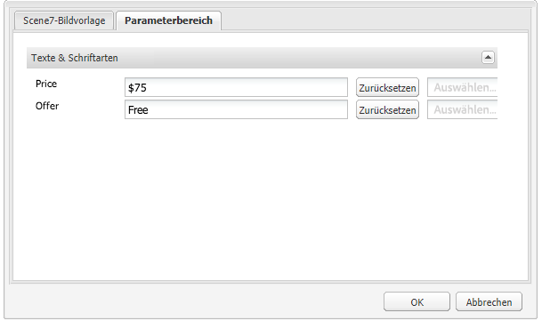

#### Dynamisches Ändern von Text {#changing-text-dynamically}

Geben Sie zum dynamischen Ändern des Texts neuen Text in die Felder ein und klicken Sie auf **OK**. In diesem Beispiel lautet der **Preis** 50 $ und der Versand kostet 0,99 $.

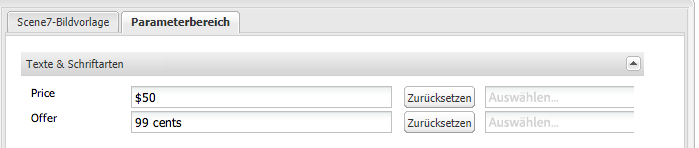

Der Text im Bild ändert sich. Sie können den Text auf den ursprünglichen Wert zurücksetzen, indem Sie neben dem Feld auf **Zurücksetzen** klicken.

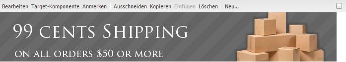

#### Ändern von Text zum Berücksichtigen des Werts eines Clientkontextwerts {#changing-text-to-reflect-the-value-of-a-client-context-value}

Um ein Feld mit einem Client-Kontextwert zu verknüpfen, klicken Sie auf **Auswählen**, um das Client-Kontextmenü zu öffnen, wählen Sie den Client-Kontext aus und klicken Sie auf **OK**. In diesem Beispiel ändert sich der Name auf Grundlage der Verknüpfung des Namens mit dem formatierten Namen im Profil.

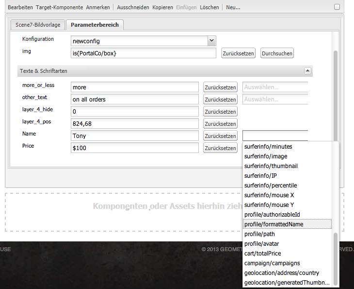

Der Text berücksichtigt den Namen des aktuell angemeldeten Benutzers. Sie können den Text auf den ursprünglichen Wert zurücksetzen, indem Sie neben dem Feld auf **Zurücksetzen** klicken.

#### Ändern der Scene7-Bildvorlage zu einem Link {#making-the-scene-image-template-a-link}

So machen Sie aus der Scene7-Bildvorlagenkomponente einen klickbaren Link:

1. Klicken Sie auf der Seite mit der Scene7-Bildvorlagenkomponente auf **Bearbeiten**.
1. Geben Sie im Feld **URL** die URL ein, zu der Benutzer wechseln, wenn sie auf das Bild klicken. Wählen Sie im Feld **Öffnen in** aus, ob das Ziel (in einem neuen oder im selben Fenster) geöffnet werden soll.

   

1. Klicken Sie auf **OK**.

### Komponente „Video“{#video-component}

Die Komponente Scene7 **Video** (verfügbar im Scene7-Abschnitt des Sidekicks) verwendet die Geräte- und Bandbreitenerkennung, um jedem Bildschirm das richtige Video bereitzustellen. Bei dieser Komponente handelt es sich um einen HTML5-Video-Player. Es ist ein einzelner Viewer, der kanalübergreifend verwendet werden kann.

Er kann für adaptive Videosets, ein einzelnes MP4-Video oder ein einzelnes F4V-Video verwendet werden.

Weitere Informationen darüber, wie Videos mit Scene7-Integration funktionieren, finden Sie unter [Video](/help/sites-classic-ui-authoring/manage-assets-classic-s7-video.md). Sehen Sie sich darüber hinaus einen [Vergleich der **Scene7-Video**-Komponente mit der grundlegenden **Video**-Komponente an](/help/sites-classic-ui-authoring/manage-assets-classic-s7-video.md).

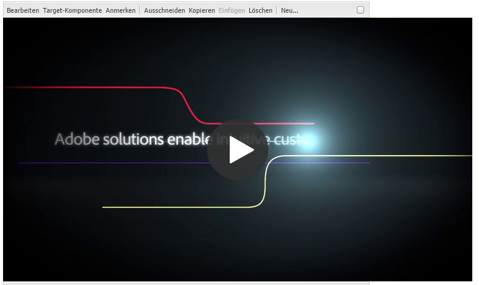

### Bekannte Einschränkungen für die Videokomponente {#known-limitations-for-the-video-component}

Adobe DAM und WCM zeigen an, ob ein Primärvideo hochgeladen wurde. Sie zeigen diese Proxy-Assets nicht an:

* Kodierte Scene7-Ausgabeformate
* Adaptive Scene7-Videosets

Beim Verwenden eines adaptiven Videosets mit der Scene7-Videokomponente muss die Größe der Komponente geändert werden, um sie an die Abmessungen des Videos anzupassen.

## Scene7-Inhaltsbrowser {#scene-content-browser}

Mit dem Scene7-Inhaltsbrowser können Sie Inhalte aus Scene7 direkt in Experience Manager anzeigen. Um auf den Inhaltsbrowser zuzugreifen, wählen Sie im Content Finder **Scene7** in der Touch-optimierten Benutzeroberfläche oder in der klassischen Benutzeroberfläche das Symbol **S7** aus. Die Funktionalität ist zwischen den beiden Benutzeroberflächen identisch.

Wenn mehrere Konfigurationen vorhanden sind, zeigt Experience Manager standardmäßig die Standardkonfiguration [a1/> an. ](/help/sites-administering/scene7.md#configuring-a-default-configuration) Sie können unterschiedliche Kategorien direkt im Scene7-Inhaltsbrowser im Dropdownmenü auswählen.

>[!NOTE]
>
>* Im Ad-hoc-Ordner befindliche Assets werden im Scene7-Inhaltsbrowser nicht angezeigt.
>* Bei [aktivierter sicherer Vorschau](/help/sites-administering/scene7.md#configuring-the-state-published-unpublished-of-assets-pushed-to-scene) werden die auf Scene7 veröffentlichten und nicht veröffentlichten Assets im Scene7-Inhaltsbrowser angezeigt.
>* Wenn **Scene7** oder das Symbol **S7** nicht als Option im Inhaltsbrowser angezeigt wird, müssen Sie [Scene7 für die Verwendung mit Experience Manager](/help/sites-administering/scene7.md) konfigurieren.
>* Für Videos unterstützt der Scene7-Inhaltsbrowser Folgendes:
   >   * Adaptive Videosets: Container von allen für die bildschirmübergreifende optimierte Wiedergabe erforderlichen Videoausgabeformaten
   >   * Einzelnes MP4-Video
   >   * Einzelnes F4V-Video

### Inhalt durchsuchen {#browsing-content-in-the-classic-ui}

Durchsuchen Sie Inhalt in Scene7, indem Sie auf die Registerkarte **S7** klicken.

Sie können die Konfiguration ändern, auf die Sie zugreifen, indem Sie die Konfiguration auswählen. Die Ordner ändern sich in Abhängigkeit der von Ihnen ausgewählten Konfiguration.

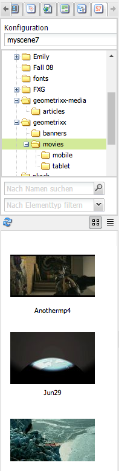

Wie mit der Inhaltssuche für Assets können Sie nach Assets suchen und Ergebnisse filtern. Im Gegensatz zur Asset-Suche **beginnt** der Dateiname jedoch beim Eingeben eines Keywords auf der Registerkarte **S7** mit dem von Ihnen eingegebenen String, anstatt dass das Keyword im Dateinamen **enthalten** ist.

Standardmäßig werden Assets nach Dateiname angezeigt. Sie können Ergebnisse auch nach Asset-Typ filtern.

>[!NOTE]
>
>Für Videos unterstützt der Scene7-Inhaltsbrowser von WCM Folgendes:
>
>* Adaptive Videosets: Container von allen für die bildschirmübergreifende optimierte Wiedergabe erforderlichen Videoausgabeformaten
>* Einzelnes MP4-Video
>* Einzelnes F4V-Video

>

### Durchsuchen von Scene7-Assets mit dem Inhaltsbrowser {#searching-for-scene-assets-with-the-content-browser}

Die Suche nach Scene7-Assets verläuft ähnlich wie die Suche nach Experience Manager-Assets. Bei der Suche wird Ihnen jedoch eine Remote-Ansicht der Assets im Scene7-System angezeigt, anstatt sie direkt in Experience Manager zu importieren.

Sie können die klassische oder Touch-optimierte Benutzeroberfläche verwenden, um Assets anzuzeigen und nach ihnen zu suchen. In Abhängigkeit von der Oberfläche unterscheidet sich die Art und Weise der Suche etwas.

Wenn Sie auf einer der Benutzeroberflächen suchen, können Sie nach den folgenden Kriterien filtern (wird hier in der Touch-optimierten Benutzeroberfläche gezeigt):

**Geben Sie** Keywords ein. Sie können Assets nach Namen suchen. Bei der Suche entsprechen die von Ihnen eingegebenen Keywords dem Beginn des Dateinamens. Zum Beispiel führt die Eingabe des Worts „schwimmen“ dazu, dass nach Asset-Dateinamen gesucht wird, die mit diesen Buchstaben in dieser Reihenfolge beginnen. Drücken Sie die Eingabetaste, nachdem Sie den Begriff eingegeben haben, um nach dem Asset zu suchen.

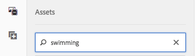

**Ordner/** Pfad Der Name des angezeigten Ordners basiert auf der von Ihnen ausgewählten Konfiguration. Sie können niedrigere Ebenen anzeigen, indem Sie auf das Ordnersymbol klicken, einen Unterordner auswählen und dann auf das Häkchen klicken, um ihn auszuwählen.

Wenn Sie einen Suchbegriff eingeben und einen Ordner auswählen, durchsucht Experience Manager diesen und alle Unterordner. Wenn Sie jedoch bei der Suche keine Keywords eingeben, wird durch die Auswahl des Ordners das Asset nur in diesem Ordner angezeigt und nicht in Unterordnern.

Standardmäßig durchsucht Experience Manager den ausgewählten Ordner und alle Unterordner.

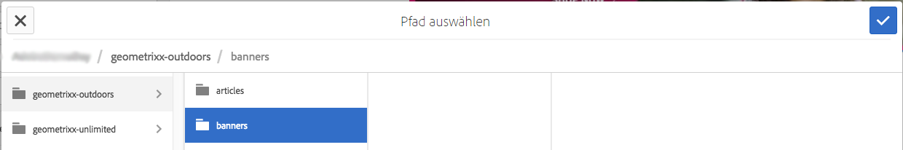

**Typ von** AssetWählen Sie Scene7 aus, um Scene7-Inhalte zu durchsuchen. Diese Option ist nur verfügbar, wenn Scene7 konfiguriert wurde.

**** KonfigurationWenn in Cloud Services mehr als eine Scene7-Konfiguration definiert ist, können Sie sie hier auswählen. Der Ordner ändert sich anhand der von Ihnen ausgewählten Konfiguration.

**Asset-** Typ Im Scene7-Browser können Sie die Ergebnisse filtern, um Folgendes einzuschließen: Bilder, Vorlagen, Videos und adaptive Videosets. Wenn Sie keinen Asset-Typ auswählen, durchsucht Experience Manager standardmäßig alle Asset-Typen.

>[!NOTE]
>
>* Auf der klassischen Benutzeroberfläche können Sie auch nach **Flash** und **FXG** suchen. Das Filtern nach diesen auf der Touch-optimierten Benutzeroberfläche wird derzeit nicht unterstützt.
   >
   >
* Beim Durchsuchen eines Videos suchen Sie nach einem einzelnen Ausgabeformat. Die Ergebnisse geben das ursprüngliche (nur *.mp4) und das kodierte Ausgabeformat zurück.
* Bei der Suche nach einem adaptiven Videoset durchsuchen Sie den Ordner und alle Unterordner, jedoch nur, wenn Sie der Suche ein Keyword hinzugefügt haben. Wenn Sie keinen Suchbegriff hinzugefügt haben, durchsucht Experience Manager nicht die Unterordner.

**Veröffentlichungsstatus** Sie können nach Assets basierend auf dem Veröffentlichungsstatus filtern: Veröffentlichung rückgängig gemacht oder veröffentlicht. Wenn Sie keinen Veröffentlichungsstatus auswählen, durchsucht Experience Manager standardmäßig alle Veröffentlichungsstatus.

