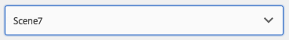

# Hinzufügen von Dynamic Media Classic (Scene7)-Funktionen zu Ihrer Seite{#adding-scene-features-to-your-page}

[Adobe Dynamic Media Classic (Scene7)](https://experienceleague.adobe.com/docs/dynamic-media-classic/using/home.html?lang=de) eine gehostete Lösung für die Verwaltung, Optimierung, Veröffentlichung und Bereitstellung von Rich-Media-Assets für Web-, Mobil-, E-Mail- und Internet-verbundene Anzeigen und Ausdrucke.

Sie können in Dynamic Media Classic (Scene7) veröffentlichte Experience Manager-Assets in verschiedenen Viewern anzeigen:

* Zoom
* Flyout
* Video
* Bildvorlage
* Bild

Sie können digitale Assets direkt aus Experience Manager in Dynamic Media Classic (Scene7) veröffentlichen und umgekehrt.

In diesem Dokument wird beschrieben, wie Sie digitale Assets von Experience Manager in Dynamic Media Classic (Scene7) veröffentlichen und umgekehrt. Die Viewer werden auch detailliert beschrieben. Informationen zum Konfigurieren von Experience Manager für Dynamic Media Classic (Scene7) finden Sie unter [Integration von Dynamic Media Classic (Scene7) in Experience Manager](/help/sites-administering/scene7.md).

Siehe auch [Hinzufügen von Imagemaps](/help/assets/image-maps.md).

Weitere Informationen über die Verwendung von Videokomponenten mit Experience Manager finden Sie unter:

* [Video](/help/sites-classic-ui-authoring/manage-assets-classic-s7-video.md)

>[!NOTE]
>
>Wenn Dynamic Media Classic (Scene7)-Assets nicht korrekt angezeigt werden, stellen Sie sicher, dass Dynamic Media [deaktiviert](/help/assets/config-dynamic.md#disabling-dynamic-media) ist und aktualisieren Sie dann die Seite.

## Manuelles Veröffentlichen in Dynamic Media Classic (Scene7) aus Assets {#manually-publishing-to-scene-from-assets}

Sie können digitale Assets entweder über die Assets-Konsole auf der klassischen Benutzeroberfläche oder direkt über das Asset in Dynamic Media Classic (Scene7) veröffentlichen.

>[!NOTE]
>
>Experience Manager veröffentlicht asynchron in Dynamic Media Classic (Scene7). Nachdem Sie auf **[!UICONTROL Veröffentlichen]** geklickt haben, dauert es möglicherweise ein paar Sekunden, bis das Asset in Dynamic Media Classic (Scene7) veröffentlicht wird.
>

### Veröffentlichen über die Asset-Konsole {#publishing-from-the-assets-console}

Sie können über die Assets-Konsole in Dynamic Media Classic (Scene7) veröffentlichen, wenn sich die Assets in einem Dynamic Media Classic (Scene7)-Zielordner befinden.

1. Wählen Sie auf der klassischen Experience Manager-Benutzeroberfläche **[!UICONTROL Digitale Assets]** aus, um auf den Digital Asset Manager zuzugreifen.

1. Wählen Sie das Asset (oder die Assets) oder den Ordner innerhalb des Zielordners aus, den Sie in Dynamic Media Classic (Scene7) veröffentlichen möchten. Klicken Sie dann mit der rechten Maustaste darauf und wählen Sie **[!UICONTROL In Dynamic Media Classic (Scene7) veröffentlichen]** aus. Alternativ können Sie **[!UICONTROL In Dynamic Media Classic (Scene7) veröffentlichen]** auch im Menü **[!UICONTROL Tools]** auswählen.

   

1. Wechseln Sie zu Dynamic Media Classic (Scene7) und überprüfen Sie, ob die Assets verfügbar sind.

   >[!NOTE]
   >
   >Wenn sich die Assets nicht in einem synchronisierten Dynamic Media Classic (Scene7)-Ordner befinden, ist **[!UICONTROL Dynamic Media Classic (Scene7) veröffentlichen]** zwar in beiden Menüs sichtbar, aber deaktiviert.

### Veröffentlichen über ein Asset {#publishing-from-an-asset}

Sie können ein Asset manuell veröffentlichen, sofern sich dieses Asset im synchronisierten Dynamic Media Classic (Scene7)-Ordner befindet.

>[!NOTE]
>
>Wenn sich das Asset nicht im synchronisierten Dynamic Media Classic (Scene7)-Ordner befindet, wird der Link zu **[!UICONTROL In Dynamic Media Classic veröffentlichen (Scene7)]** nicht angezeigt.

So veröffentlichen über ein digitales Asset direkt in Dynamic Media Classic (Scene7):

1. Wählen in Experience Manager **[!UICONTROL Digitale Assets]** aus, um auf den Digital Asset Manager zuzugreifen.

1. Doppelklicken Sie, um ein Asset zu öffnen.

1. Wählen Sie im Bereich mit Asset-Details **[!UICONTROL In Dynamic Media Classic (Scene7) veröffentlichen]** aus.

   

1. Der Link ändert sich zu **[!UICONTROL Wird veröffentlicht ...]** und dann zu **[!UICONTROL Veröffentlicht]**. Wechseln Sie zu Dynamic Media Classic (Scene7) und überprüfen Sie, ob die Assets verfügbar sind.

   >[!NOTE]
   >
   >Wenn das Asset nicht ordnungsgemäß in Dynamic Media Classic (Scene7) veröffentlicht wird, ändert sich der Link in **[!UICONTROL Veröffentlichung fehlgeschlagen]**. Wenn das Asset bereits in Dynamic Media Classic (Scene7) veröffentlicht wurde, lautet der Link **[!UICONTROL Erneutes Veröffentlichen in Dynamic Media Classic (Scene7)]**. Beim erneuten Veröffentlichen können Sie Assets in Experience Manager ändern und erneut veröffentlichen.

### Veröffentlichen von Assets außerhalb des CQ-Zielordners {#publishing-assets-from-outside-the-cq-target-folder}

Adobe empfiehlt, Assets nur aus Assets innerhalb des Dynamic Media Classic (Scene7)-Zielordners in Dynamic Media Classic (Scene7) zu veröffentlichen. Wenn Sie Assets jedoch über einen Ordner hochladen müssen, der sich außerhalb des Zielordners befindet, können Sie dies dennoch tun, indem Sie sie in einen On-Demand-Ordner in Dynamic Media Classic (Scene7) hochladen. Konfigurieren Sie zunächst die Cloud-Konfiguration für die Seite, auf der das Asset angezeigt werden soll. Fügen Sie der Seite anschließend eine Dynamic Media Classic (Scene7)-Komponente hinzu, und legen Sie ein Asset per Drag &amp; Drop auf der Komponente ab. Nachdem die Seiteneigenschaften für diese Seite festgelegt wurden, wird der Link **[!UICONTROL In Dynamic Media Classic (Scene7) veröffentlichen]** angezeigt, wenn ausgewählte Auslöser den Upload zu Dynamic Media Classic (Scene7) vornehmen.

>[!NOTE]
>
>Im On-Demand-Ordner befindliche Assets werden im Dynamic Media Classic (Scene7)-Inhaltsbrowser nicht angezeigt.

**Veröffentlichen von Assets außerhalb des CQ-Zielordners:**

1. Wählen Sie in Experience Manager auf der klassischen Benutzeroberfläche **[!UICONTROL Websites]** aus, und navigieren Sie zur Webseite, zu der Sie ein digitales Asset hinzufügen möchten, das bisher noch nicht in Dynamic Media Classic (Scene7) veröffentlicht wurde. (Es gelten normale Seitenübernahmeregeln.)

1. Wählen Sie im Sidekick das Symbol **[!UICONTROL Seite]** und dann **[!UICONTROL Seiteneigenschaften]** aus.

1. Wählen Sie **[!UICONTROL Cloud Services]** aus.
1. Wählen Sie **[!UICONTROL Dienste hinzufügen]** aus.
1. Wählen Sie **[!UICONTROL Dynamic Media Classic (Scene7)]** aus.
1. Wählen Sie in der Dropdown-Liste **[!UICONTROL Adobe Dynamic Media Classic (Scene7)]** die gewünschte Konfiguration aus, und klicken Sie auf **[!UICONTROL OK]**.

   

1. Fügen Sie auf der Webseite eine Dynamic Media Classic (Scene7)-Komponente an der gewünschten Position auf der Seite hinzu.
1. Ziehen Sie in der Inhaltssuche ein digitales Asset zur Komponente. Es wird ein Link zur **[!UICONTROL Prüfung des Dynamic Media Classic (Scene7)-Veröffentlichungsstatus]** angezeigt.

   >[!NOTE]
   >
   >Wenn sich das digitale Asset im CQ-Zielordner befindet, wird kein Link zur **[!UICONTROL Prüfung des Dynamic Media Classic (Scene7)-Veröffentlichungsstatus]** angezeigt. Die Assets werden in der Komponente platziert.

   

1. Wählen Sie **[!UICONTROL Überprüfen des Dynamic Media Classic (Scene7)-Veröffentlichungsstatus]** aus. Wenn die Assets nicht veröffentlicht wurden, veröffentlicht Experience Manager das Asset in Dynamic Media Classic (Scene7). Nach dem Upload befindet sich das Asset im On-Demand Ordner. Standardmäßig befindet sich der On-Demand-Ordner unter **[!UICONTROL Name_des_Unternehmens/CQ5_adhoc]**. Sie können den [On-Demand-Ordner bei Bedarf konfigurieren](#configuringtheadhocfolder).

   >[!NOTE]
   >
   >Wenn sich das Asset nicht in einem synchronisierten Dynamic Media Classic (Scene7)-Ordner befindet und keine Dynamic Media Classic (Scene7)-Konfiguration mit der aktuellen Seite verknüpft ist, schlägt der Upload fehl.

## Dynamic Media Classic (Scene7)-Komponenten {#scene-components}

Die folgenden Dynamic Media Classic (Scene7)-Komponenten sind in Experience Manager verfügbar:

* Zoom
* Flyout (Zoom)
* Bildvorlage
* Bild
* Video

>[!NOTE]
>
>Diese Komponenten sind standardmäßig nicht verfügbar und müssen im Designmodus ausgewählt werden, bevor sie verwendet werden können.

Nachdem sie im Designmodus zur Verfügung gestellt wurden, können Sie Komponenten wie jede andere Experience Manager-Komponente zu Ihrer Seite hinzufügen. Assets, die noch nicht in Dynamic Media Classic (Scene7) veröffentlicht wurden, werden in Dynamic Media Classic (Scene7) veröffentlicht, wenn sie sich in einem synchronisierten Ordner, auf einer Seite oder in einer Dynamic Media Classic (Scene7)-Cloud-Konfiguration befinden.

>[!NOTE]
>
>Beim Erstellen und Entwickeln von benutzerdefinierten S7 Viewern und Arbeiten mit dem Content Finder müssen Sie den Parameter `allowfullscreen` explizit hinzufügen.

### Hinweis zum End of Life von Flash-Viewern {#flash-viewers-end-of-life-notice}

Ab dem 31. Januar 2017 hat Adobe Dynamic Media Classic (Scene7) offiziell die Unterstützung für die Flash Viewer-Plattform beendet.

### Hinzufügen einer Dynamic Media-(Scene7)-Komponente zu einer Seite {#adding-a-scene-component-to-a-page}

Das Hinzufügen einer Dynamic Media Classic (Scene7)-Komponente zu einer Seite entspricht dem Hinzufügen einer Komponente zu einer beliebigen Seite. Dynamic Media Classic (Scene7)-Komponenten werden in den folgenden Abschnitten detailliert beschrieben.

So fügen Sie eine Dynamic Media Classic (Scene7)-Komponente bzw. einen -Viewer zu einer Seite auf der klassischen Benutzeroberfläche hinzu:

1. Öffnen Sie in Experience Manager die Seite, auf der Sie die Dynamic Media (Scene7)-Komponente hinzufügen möchten.

1. Klicken Sie, wenn keine Dynamic Media Classic (Scene7)-Komponenten verfügbar sind, auf das Lineal im Sidekick, um in den **Design**-Modus zu wechseln. Wählen Sie das ParSys **[!UICONTROL Bearbeiten]** aus, und wählen Sie dann alle **[!UICONTROL Dynamic Media Classic (Scene7)]**-Komponenten aus, um sie verfügbar zu machen.

1. Kehren Sie zum Modus **Bearbeiten** zurück, indem Sie auf den Stift im Sidekick klicken.

1. Ziehen Sie eine Komponente aus der **[!UICONTROL Dynamic Media Classic (Scene7)]**-Gruppe im Sidekick an die gewünschte Position auf der Seite.

1. Wählen Sie ***[!UICONTROL Bearbeiten]** aus, damit Sie die Komponente öffnen können.

1. Bearbeiten Sie die Komponente und klicken Sie auf **[!UICONTROL OK]**, um die Änderungen zu speichern.

### Hinzufügen von interaktiven Anwendererlebnissen zu einer responsiven Website {#adding-interactive-viewing-experiences-to-a-responsive-website}

Responsives Design für Ihre Assets bedeutet, dass Ihre Assets je nach Anzeigeort angepasst werden. Mithilfe des responsiven Designs können dieselben Assets auf mehreren Geräten effektiv dargestellt werden.

So fügen Sie ein interaktives Anwendererlebnis zu einer responsiven Website auf der klassischen Benutzeroberfläche hinzu:

1. Melden Sie sich bei Experience Manager an und stellen Sie sicher, dass Sie [Adobe Dynamic Media Classic (Scene7)-Cloud Services konfiguriert](/help/sites-administering/scene7.md#configuring-scene-integration) haben und dass Dynamic Media Classic (Scene7)-Komponenten verfügbar sind.

   >[!NOTE]
   >
   >Wenn keine Dynamic Media Classic (Scene7)-WCM-Komponenten verfügbar sind, sollten Sie sicherstellen, sie über den Designmodus zu aktivieren.

1. Ziehen Sie auf einer Website mit aktivierten Dynamic Media Classic (Scene7) einen **[!UICONTROL Bild]**-Viewer auf die Seite.
1. Bearbeiten Sie die Komponente und passen Sie die Haltepunkte auf der Registerkarte **[!UICONTROL Dynamic Media Classic (Scene7)-Einstellungen]** an.

   

1. Bestätigen Sie, dass die Größe der Viewer dynamisch geändert wird und dass alle Interaktionen für Desktop-Computer, Tablets und Mobilgeräte optimiert sind.

### Für alle Dynamic Media Classic (Scene7)-Komponenten gemeinsame Einstellungen {#settings-common-to-all-scene-components}

Auch wenn sich die Konfigurationsoptionen unterscheiden, sind folgende für alle Dynamic Media Classic (Scene7)-Komponenten gleich:

* **Dateiverweis**: Navigieren Sie zu einer Datei, die Sie referenzieren möchten. Der Dateiverweis zeigt die Asset-URL und nicht zwangsläufig die vollständige Dynamic Media Classic (Scene7)-URL, einschließlich der URL-Befehle und -Parameter. Das Hinzufügen von Dynamic Media Classic (Scene7)-Befehlen und -Parametern ist in diesem Feld nicht möglich. Sie müssen über die entsprechende Funktionalität in der Komponente hinzugefügt werden.
* **Breite**: Hier können Sie die Breite festlegen.
* **Höhe**: Hier können Sie die Höhe festlegen.

Sie können diese Konfigurationsoptionen festlegen, indem Sie eine Dynamic Media Classic (Scene7)-Komponente (per Doppelklick) öffnen. Beispiel: Beim Öffnen einer **Zoom**-Komponente:

### Zoom {#zoom}

Die HTML5-Zoom-Komponente zeigt ein größeres Bild an, wenn Sie die Taste „+“ drücken.

Das Asset verfügt unten über Zoomwerkzeuge. Wählen Sie **[!UICONTROL +]** zum Vergrößern aus. Wählen Sie **[!UICONTROL -]** zum Verkleinern aus. Durch Auswählen von **[!UICONTROL x]** oder des Pfeils zum Zurücksetzen des Zooms wird das Bild auf die ursprüngliche Größe zurückgesetzt, wie es importiert wurde. Wählen Sie die diagonalen Pfeile aus, um den Vollbildmodus zu aktivieren. Wählen Sie **[!UICONTROL Bearbeiten]** aus, um die Komponente zu konfigurieren. Mit dieser Komponente können Sie die [für alle Dynamic Media Classic (Scene7)-Komponenten gemeinsamen Einstellungen](#settings-common-to-all-scene-components) konfigurieren.

### Flyout {#flyout}

In der HTML5 Flyout-Komponente wird das Asset als geteilter Bildschirm angezeigt. Links wird das Asset in der angegebenen Größe angezeigt, rechts wird der Zoomteil angezeigt. Wählen Sie **[!UICONTROL Bearbeiten]** aus, um die Komponente zu konfigurieren. Mit dieser Komponente können Sie die [für alle Dynamic Media Classic (Scene7)-Komponenten gemeinsamen Einstellungen](/help/sites-administering/scene7.md#settingscommontoallscene7components) konfigurieren.

>[!NOTE]
>
>Wenn die Flyout-Komponente eine benutzerdefinierte Größe aufweist, wird diese benutzerdefinierte Größe verwendet und die responsive Einrichtung der Komponente deaktiviert.
>
>Wenn Ihre Flyout-Komponente die in der Designansicht festgelegte Standardgröße verwendet, wird die Standardgröße verwendet. Wenn die responsive Einrichtung der Komponente aktiviert ist, dehnt sich die Komponente, um sich der Layoutgröße der Seite anzupassen. Beachten Sie jedoch, dass es eine Einschränkung hinsichtlich der responsiven Einrichtung der Komponente gibt. Beim Verwenden der Flyout-Komponente mit responsiver Einrichtung sollten Sie sie nicht mit vollständiger Seitendehnung verwenden. Andernfalls ragt das Flyout möglicherweise über den rechten Rand der Seite hinaus.

### Bild {#image}

Mit der Dynamic Media Classic (Scene7)-Bildkomponente können Sie Ihren Bildern Dynamic Media Classic (Scene7)-Funktionen hinzufügen, z. B. Dynamic Media Classic (Scene7)-Modifikatoren, Bild- oder Viewer-Vorgaben und Scharfzeichnung. Die Dynamic Media Classic (Scene7)-Bildkomponente ähnelt anderen Bildkomponenten in Experience Manager mit speziellen Dynamic Media Classic (Scene7)-Funktionen. In diesem Beispiel enthält das Bild den URL-Modifikator Dynamic Media Classic (Scene7) mit `&op_invert=1`.

**Titel, ALT-Text**: Fügen Sie auf der Registerkarte „Erweitert“ einen Titel zum Bild und alternativen Text für die Benutzerinnen und Benutzer hinzu, die Grafiken deaktiviert haben.

**URL, Öffnen in**: Sie können ein Asset so einrichten, dass ein Link geöffnet wird. Legen Sie die URL fest. Geben Sie in „Öffnen in“ an, ob der Link im selben oder einem neuen Fenster geöffnet werden soll.

**Viewer-Vorgabe**: Wählen Sie im Dropdown-Menü eine vorhandene Viewer-Vorgabe aus. Wenn die gewünschte Viewer-Vorgabe nicht sichtbar ist, müssen Sie sie möglicherweise sichtbar machen. Siehe „Verwalten von Viewer-Vorgaben“. Es ist nicht möglich, eine Viewer-Vorgabe auszuwählen, wenn Sie eine Bildvorgabe verwenden, und umgekehrt.

**Dynamic Media Classic (Scene7)-Konfiguration**: Wählen Sie die Dynamic Media Classic (Scene7)-Konfiguration aus, die Sie verwenden möchten, um aktive Bildvorgaben aus dem SPS abzurufen.

**Bildvorgabe**: Wählen Sie im Dropdown-Menü eine vorhandene Bildvorgabe aus. Wenn die gewünschte Bildvorgabe nicht sichtbar ist, müssen Sie sie sichtbar machen. Siehe „Verwalten von Bildvorgaben“. Es ist nicht möglich, eine Viewer-Vorgabe auszuwählen, wenn Sie eine Bildvorgabe verwenden, und umgekehrt.

**Ausgabeformat** - Wählen Sie das Ausgabeformat des Bildes aus, z. B. jpeg. In Abhängigkeit des von Ihnen ausgewählten Ausgabeformats stehen Ihnen möglicherweise zusätzliche Konfigurationsoptionen zur Verfügung. Siehe Best Practices für Bildvorgaben.

**Scharfzeichnen**: Wählen Sie aus, wie Sie das Bild scharfzeichnen möchten. Das Scharfzeichnen wird unter Best Practices für Bildvorgaben und in den Best Practices für das Scharfzeichnen detailliert beschrieben.

**URL-Modifikatoren**: Sie können Bildeffekte ändern, indem Sie zusätzliche S7-Bildbefehle bereitstellen. Diese werden unter „Bildvorgaben“ und in der Befehlsreferenz beschrieben.

**Haltepunkte:** Wenn Ihre Website responsiv ist, können Sie die Haltepunkte anpassen. Haltepunkte müssen durch Kommas (,) voneinander getrennt werden.

### Bildvorlage {#image-template}

Bei Dynamic Media Classic (Scene7)-Bildvorlagen handelt es sich um Photoshop-Inhalt mit mehreren Ebenen, der in Dynamic Media Classic (Scene7) importiert wurde, wo Inhalt und Eigenschaften zwecks Variabilität parametrisiert wurden. Mit der Komponente **[!UICONTROL Bildvorlage]** können Sie Bilder importieren und den Text in Experience Manager dynamisch ändern. Zusätzlich können Sie die Komponente **[!UICONTROL Bildvorlage]** dahingehend konfigurieren, dass sie Werte aus dem Clientkontext übernimmt, damit das Bild jedem Benutzer personalisiert angezeigt wird.

Wählen Sie **[!UICONTROL Bearbeiten]** aus, um die Komponente zu konfigurieren. Sie können [für alle Dynamic Media Classic (Scene7)-Komponenten gemeinsame Einstellungen](/help/sites-administering/scene7.md#settingscommontoallscene7components) und andere Einstellungen konfigurieren, die in diesem Abschnitt beschrieben werden.

**Dateiverweis, Breite, Höhe**: Siehe [Für alle Dynamic Media Classic (Scene7)-Komponenten gemeinsame Einstellungen](/help/sites-administering/scene7.md#settingscommontoallscene7components).

>[!NOTE]
>
>Dynamic Media Classic (Scene7)-URL-Befehle und -Parameter können nicht direkt zur Dateiverweis-URL hinzugefügt werden. Sie können nur auf der Komponenten-Benutzeroberfläche im Bedienfeld **[!UICONTROL Parameter]** definiert werden.

**Titel, ALT-Text**: Fügen Sie auf der Registerkarte „Dynamic Media Classic (Scene7)-Bildvorlage“ einen Titel zum Bild und alternativen Text für die Benutzerinnen und Benutzer hinzu, die Grafiken deaktiviert haben.

**URL, Öffnen in**: Sie können ein Asset so einrichten, dass ein Link geöffnet wird. Legen Sie die URL fest. Geben Sie in „Öffnen in“ an, ob der Link im selben oder einem neuen Fenster geöffnet werden soll.

**Bedienfeld „Parameter“**: Beim Importieren eines Bildes werden die Parameter mit den Informationen aus dem Bild vorab aufgefüllt. Wenn kein Inhalt vorhanden ist, der dynamisch geändert werden kann, ist dieses Fenster leer.

#### Dynamisches Ändern von Text {#changing-text-dynamically}

Geben Sie zum dynamischen Ändern des Texts neuen Text in die Felder ein und klicken Sie auf **[!UICONTROL OK]**. In diesem Beispiel lautet der **Preis** 50 $ und der Versand kostet 0,99 $.

Der Text im Bild ändert sich. Sie können den Text auf den ursprünglichen Wert zurücksetzen, indem Sie neben dem Feld auf **[!UICONTROL Zurücksetzen]** klicken.

#### Ändern von Text entsprechend dem Wert eines Client-Kontextwerts {#changing-text-to-reflect-the-value-of-a-client-context-value}

Wählen Sie zum Verknüpfen eines Felds mit einem Client-Kontextwert **[!UICONTROL Auswählen]** aus, um das Client-Kontextmenü zu öffnen. Wählen Sie den Client-Kontext und dann **[!UICONTROL OK]** aus. In diesem Beispiel ändert sich der Name auf Grundlage der Verknüpfung des Namens mit dem formatierten Namen im Profil.

Der Text berücksichtigt den Namen des aktuell angemeldeten Benutzers. Sie können den Text auf den ursprünglichen Wert zurücksetzen, indem Sie neben dem Feld auf **[!UICONTROL Zurücksetzen]** klicken.

#### Definieren der Dynamic Media Classic (Scene7)-Bildvorlage als Link {#making-the-scene-image-template-a-link}

Sie können die Dynamic Media Classic (Scene7)-Bildvorlagenkomponente zu einem anklickbaren Link machen.

1. Wählen Sie auf der Seite mit der Dynamic Media Classic (Scene7)-Bildvorlagenkomponente die Option **[!UICONTROL Bearbeiten]** aus.
1. Geben Sie im Feld **[!UICONTROL URL]** die URL ein, zu der Benutzer wechseln, wenn sie auf das Bild klicken. Wählen Sie im Feld **[!UICONTROL Öffnen in]** aus, ob das Ziel (in einem neuen oder im selben Fenster) geöffnet werden soll.

   

1. Klicken Sie auf **[!UICONTROL OK]**.

### Komponente „Video“ {#video-component}

Die Dynamic Media Classic (Scene7)-**[!UICONTROL Video]**-Komponente (im Abschnitt „Dynamic Media Classic (Scene7)“ im Sidekick) verwendet Geräte- und Bandbreitenerkennung, um auf jedem Bildschirm das richtige Video bereitzustellen. Bei dieser Komponente handelt es sich um einen HTML5-Video-Player. Es ist ein einzelner Viewer, der kanalübergreifend verwendet werden kann.

Er kann für adaptive Videosets, ein einzelnes MP4-Video oder ein einzelnes F4V-Video verwendet werden.

Weitere Informationen darüber, wie Videos mit Dynamic Media Classic (Scene7)-Integration funktionieren, finden Sie unter [Video](/help/sites-classic-ui-authoring/manage-assets-classic-s7-video.md). Sehen Sie sich darüber hinaus einen [Vergleich der **Dynamic Media Classic (Scene7)-Video**-Komponente mit der Foundation-**Video**-Komponente](/help/sites-classic-ui-authoring/manage-assets-classic-s7-video.md) an.

### Bekannte Einschränkungen für die Videokomponente {#known-limitations-for-the-video-component}

Adobe DAM und WCM zeigen, ob ein primäres Quellvideo hochgeladen wurde. Sie zeigen diese Proxy-Assets nicht an:

* Dynamic Media Classic (Scene7)-kodierte Ausgabedarstellungen
* Adaptive Dynamic Media Classic (Scene7)-Videosets 

Bei Verwendung eines adaptiven Videosets mit der Dynamic Media Classic (Scene7)-Videokomponente muss die Größe der Komponente an die Abmessungen des Videos angepasst werden.

## Dynamic Media Classic (Scene7)-Inhaltsbrowser {#scene-content-browser}

Mit dem Dynamic Media Classic (Scene7)-Inhaltsbrowser können Sie Inhalte aus Dynamic Media Classic (Scene7) direkt in Experience Manager anzeigen. Wählen Sie für den Zugriff auf den Inhaltsbrowser **Dynamic Media Classic (Scene7)** auf der Touch-optimierten Benutzeroberfläche oder das Symbol **S7** auf der klassischen Benutzeroberfläche aus. Die Funktionalität ist zwischen den beiden Benutzeroberflächen identisch.

Wenn Sie über mehrere Konfigurationen verfügen, zeigt Experience Manager standardmäßig die [Standardkonfiguration](/help/sites-administering/scene7.md#configuring-a-default-configuration) an. Sie können unterschiedliche Kategorien direkt im Dynamic Media Classic (Scene7)-Inhaltsbrowser im Dropdown-Menü auswählen.

>[!NOTE]
>
>* Assets im On-Demand-Ordner werden nicht im Dynamic Media Classic (Scene7)-Inhaltsbrowser angezeigt.
>* Bei [aktivierter sicherer Vorschau](/help/sites-administering/scene7.md#configuring-the-state-published-unpublished-of-assets-pushed-to-scene) werden die auf Dynamic Media Classic (Scene7) veröffentlichten und nicht veröffentlichten Assets im Dynamic Media Classic (Scene7)-Inhaltsbrowser angezeigt.
>* Wenn **[!UICONTROL Dynamic Media Classic (Scene7)]** oder das Symbol **[!UICONTROL S7]** nicht als Option im Inhaltsbrowser angezeigt wird, müssen Sie [Dynamic Media Classic (Scene7) für die Verwendung mit Experience Manager konfigurieren](/help/sites-administering/scene7.md).
>* Für Videos unterstützt der Dynamic Media Classic (Scene7)-Inhaltsbrowser Folgendes:
>   * Adaptive Videosets: Container von allen für die bildschirmübergreifende optimierte Wiedergabe erforderlichen Videoausgabeformaten
>   * Einzelnes MP4-Video
>   * Einzelnes F4V-Video

### Durchsuchen von Inhalten {#browsing-content-in-the-classic-ui}

Durchsuchen von Inhalten in Dynamic Media Classic (Scene7) durch Auswahl der Registerkarte **[!UICONTROL S7]**.

Sie können die Konfiguration, auf die Sie zugreifen, ändern, indem Sie die Konfiguration auswählen. Die Ordner ändern sich je nach der ausgewählten Konfiguration.

Wie bei der Inhaltssuche für Assets können Sie nach Assets suchen und Ergebnisse filtern. Im Gegensatz zur Assets-Suche **beginnt** der Dateiname bei der Eingabe eines Schlüsselworts auf der Registerkarte **S7** jedoch mit der eingegebenen Zeichenfolge, anstatt das Schlüsselwort im Dateinamen zu **enthalten**.

Standardmäßig werden Assets nach Dateinamen angezeigt. Sie können die Ergebnisse aber auch nach Asset-Typ filtern.

>[!NOTE]
>
>Für Videos unterstützt der Dynamic Media Classic (Scene7)-Inhaltsbrowser von WCM Folgendes:
>
>* Adaptive Videosets: Container von allen für die bildschirmübergreifende optimierte Wiedergabe erforderlichen Videoausgabeformaten
>* Einzelnes MP4-Video
>* Einzelnes F4V-Video
>

### Suchen nach Dynamic Media Classic (Scene7)-Assets mit dem Inhaltsbrowser {#searching-for-scene-assets-with-the-content-browser}

Die Suche nach Dynamic Media Classic (Scene7)-Assets ähnelt der Suche nach Experience Manager-Assets. Eine Ausnahme besteht darin, dass bei der Suche tatsächlich eine Remote-Ansicht der Assets im Dynamic Media Classic (Scene7)-System angezeigt wird, während sie in Experience Manager direkt importiert werden.

Sie können entweder die klassische oder die Touch-optimierte Benutzeroberfläche verwenden, um Assets anzuzeigen und nach ihnen zu suchen. Je nach Benutzeroberfläche unterscheidet sich die Suchweise geringfügig.

Wenn Sie auf einer der Benutzeroberflächen suchen, können Sie nach den folgenden Kriterien filtern (wird hier in der Touch-optimierten Benutzeroberfläche gezeigt):

**Keywords eingeben**: Sie können Assets nach Namen suchen. Bei der Suche entsprechen die von Ihnen eingegebenen Keywords dem Beginn des Dateinamens. Zum Beispiel führt die Eingabe des Worts „schwimmen“ dazu, dass nach Asset-Dateinamen gesucht wird, die mit diesen Buchstaben in dieser Reihenfolge beginnen. Achten Sie darauf, dass Sie `Enter` drücken, nachdem Sie den Begriff eingegeben haben, um das Asset zu finden.

**Ordner/Pfad**: Der Name des Ordners basiert auf der von Ihnen ausgewählten Konfiguration. Sie können ein Drilldown in niedrigere Ebenen durchführen, indem Sie auf das Ordnersymbol klicken, einen Unterordner auswählen und dann auf das Häkchen klicken, um ihn auszuwählen.

Wenn Sie ein Keyword eingeben und einen Ordner auswählen, durchsucht Experience Manager diesen Ordner und die zugehörigen Unterordner. Wenn Sie jedoch bei der Suche keine Keywords eingeben, werden durch die Auswahl des Ordners nur die Assets in diesem Ordner angezeigt und nicht in Unterordnern.

Standardmäßig durchsucht Experience Manager den ausgewählten Ordner und alle Unterordner.

**Asset-Typ**: Wählen Sie „Dynamic Media Classic (Scene7)“ aus, um Dynamic Media Classic (Scene7)-Inhalte zu durchsuchen. Diese Option ist nur verfügbar, wenn Dynamic Media Classic (Scene7) konfiguriert wurde.

**Konfiguration**: Wenn Sie über mehr als eine in Cloud-Services definierte Dynamic Media Classic (Scene7)-Konfiguration verfügen, können Sie diese hier auswählen. Daher ändert sich der Ordner je nach ausgewählter Konfiguration.

**Asset-Typ**: Im Dynamic Media Classic (Scene7)-Browser können Sie Ergebnisse nach folgenden Elementen filtern: Bilder, Vorlagen, Videos und adaptive Videosets. Wenn Sie keinen Asset-Typ auswählen, durchsucht Experience Manager standardmäßig alle Asset-Typen.

>[!NOTE]
>
>* Auf der klassischen Benutzeroberfläche können Sie auch nach **Flash** und **FXG** suchen. Auf der Touch-optimierten Benutzeroberfläche wird das Filtern nach diesen Begriffen nicht unterstützt.
>
>* Beim Durchsuchen eines Videos suchen Sie nach einem einzelnen Ausgabeformat. Die Ergebnisse geben die ursprüngliche (nur &#42;.mp4) und die kodierte Ausgabedarstellung zurück.
* Beim Suchen nach einem adaptiven Videoset durchsuchen Sie den Ordner und alle Unterordner, jedoch nur dann, wenn Sie zur Suche ein Keyword hinzugefügt haben. Wenn Sie kein Keyword hinzugefügt haben, durchsucht Experience Manager nicht die Unterordner.
>

**Veröffentlichungsstatus**: Sie können Assets nach dem Veröffentlichungsstatus filtern: „Unveröffentlicht“ oder „Veröffentlicht“. Wenn Sie keinen Veröffentlichungsstatus auswählen, durchsucht Experience Manager standardmäßig alle Veröffentlichungsstatus.

