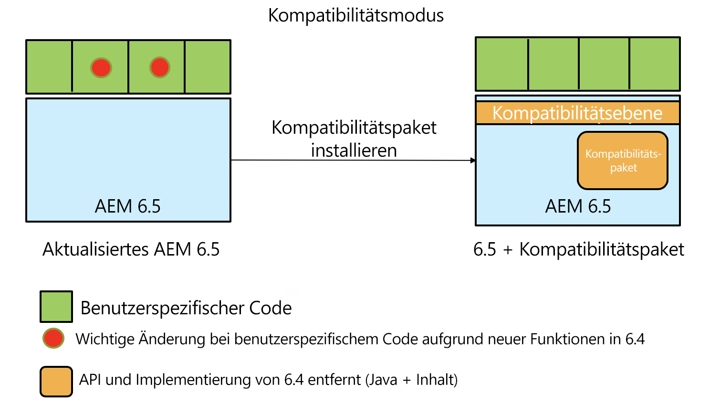
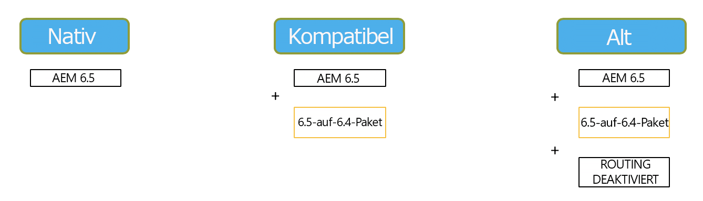

# Abwärtskompatibilität in AEM 6.5{#backward-compatibility-in-aem}

## Übersicht {#overview}

>[!NOTE]
>
>Eine Liste der Änderungen am Inhalt und an der Konfiguration, die das Kompatibilitätspaket nicht betreffen, finden Sie unter [Repository-Neustrukturierung in AEM](/help/sites-deploying/repository-restructuring.md).

In AEM 6.5 wurden alle Funktionen im Hinblick auf die Abwärtskompatibilität entwickelt.

In den meisten Fällen sollten Kunden, die mit AEM 6.3 arbeiten, weder ihren Code noch ihre Anpassungen ändern müssen, wenn sie die Aktualisierung durchführen. Kunden mit AEM 6.1 und 6.2 müssen nicht mehr zusätzliche Änderungen durchführen, als dies bei einem Upgrade auf 6.3 erforderlich ist.

Für Ausnahmen, in denen Funktionen nicht abwärtskompatibel gehalten werden konnten, können Abwärtskompatibilitätsprobleme für Bundles und Inhalte durch die Installation eines Kompatibilitätspakets für 6.4 reduziert werden (weitere Informationen dazu, wo Sie diese herunterladen können, finden Sie unten). Dieses Compat-Paket wird in den meisten Fällen dazu beitragen, die Kompatibilität für Anwendungen wiederherzustellen, die mit AEM 6.4 kompatibel sind.

Mit dem Kompatibilitätspaket können Sie AEM im Kompatibilitätsmodus ausführen und so die benutzerdefinierte Entwicklung für neue AEM-Funktionen zurückstellen:

>[!NOTE]
>
>Bitte beachten Sie, dass das Kompatibilitätspaket nur eine Zwischenlösung ist, um die für die Kompatibilität mit AEM 6.5 erforderliche Entwicklung aufzuschieben. Es wird nur als letzte Option empfohlen, falls Sie Kompatibilitätsprobleme nicht direkt nach der Aktualisierung durch Eigenentwicklungen beheben können. Es wird dringend empfohlen, in den nativen Modus zu wechseln und das Kompatibilitätspaket zu deinstallieren, sobald Sie auf 6.5 basierende Eigenentwicklungen vornehmen, damit Sie den vollen Funktionsumfang von 6.5 nutzen können.

Das Kompatibilitätspaket bietet zwei Modi: **Routing aktiviert** und **Routing deaktiviert**.

Damit kann AEM 6.5 in drei Modi ausgeführt werden:

**Nativer Modus:**

Der native Modus eignet sich für Kunden, die alle neuen Funktionen von AEM 6.5 nutzen möchten und bereit sind, ihre Anpassungen durch Entwicklungsarbeiten an alle neuen Funktionen anzupassen.

Dies bedeutet, dass Sie die Korrekturen in Ihrer Anwendung sofort nach der Aktualisierung durchführen müssen.

**Kompatibilitätsmodus: Kompatibilitätspaket mit aktiviertem Routing installiert** 

Der Kompatibilitätsmodus eignet sich für Kunden, die Schnittstellen angepasst haben, die nicht abwärtskompatibel sind. Damit kann AEM im Kompatibilitätsmodus ausgeführt und die für nicht mit Ihrem benutzerdefinierten Code kompatible neue AEM-Funktionen erforderliche Eigenentwicklung zurückgestellt werden.

**Legacy-Modus: Kompatibilitätspaket mit deaktiviertem Routing installiert** 

Der Legacy-Modus eignet sich für Kunden, die benutzerdefinierte Schnittstellen besitzen, die auf Legacy- oder veraltetem Code von AEM basieren, der in das Kompatibilitätspaket ausgelagert wurde.

## Einrichtung {#how-to-set-up}

Die **AEM 6.4 Kompatibilitätspaket für 6.5** kann als Paket mit Package Manager installiert werden. Sie können die [AEM 6.4 Kompatibilitätspaket für 6.5 von der Softwareverteilung](https://experience.adobe.com/#/downloads/content/software-distribution/en/aem.html?fulltext=compat*&amp;orderby=%40jcr%3Acontent%2Fjcr%3AlastModified&amp;orderby.sort=desc&amp;layout=list&amp;p.offset=0&amp;p.limit=20&amp;package=%2Fcontent%2Fsoftware-distribution%2Fen%2Fdetails.html%2Fcontent%2Fdam%2Faem%2Fpublic%2Fadobe%2Fpackages%2Fcq650%2Fcompatpack%2Faem-compat-cq65-to-cq64) Site.

Sobald das Kompatibilitätspaket installiert wurde, können Sie das Routing über einen Schalter in der OSGi-Konfiguration aktivieren oder deaktivieren:

Sobald das Kompatibilitätspaket installiert und konfiguriert wurde, werden die Funktionen basierend auf dem ausgewählten Kompatibilitätsmodus verwendet.
