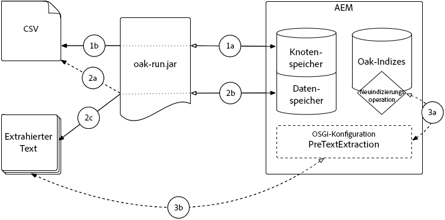

# Best Practices für Abfragen und Indizierung{#best-practices-for-queries-and-indexing}

Neben dem Übergang zu Oak in AEM 6 wurden auch einige bedeutende Änderungen in Bezug auf die Verwaltung von Abfragen und Indizes vorgenommen. Unter Jackrabbit 2 wurden alle Inhalte standardmäßig indiziert und konnten frei abgefragt werden. In Oak müssen Indizes manuell unter dem Knoten `oak:index` erstellt werden. Eine Abfrage kann ohne Index ausgeführt werden. Bei großen Datensätzen wird sie jedoch sehr langsam ausgeführt oder sogar abgebrochen.

In diesem Artikel wird beschrieben, wann Indizes zu erstellen sind und wann auf sie verzichtet werden kann. Außerdem finden Sie hierin Tricks zum Vermeiden von nicht benötigten Abfragen sowie Tipps zur Funktionsoptimierung von Indizes und Abfragen.

Darüber hinaus sollten Sie die [Oak-Dokumentation zum Erstellen von Abfragen und Indizes](/help/sites-deploying/queries-and-indexing.md) lesen. Neben Indizes, die in AEM 6 ein neues Konzept darstellen, gibt es syntaktische Unterschiede in Oak-Abfragen, die bei der Migration von Code aus einer vorherigen AEM berücksichtigt werden müssen.

## Verwenden von Abfragen {#when-to-use-queries}

### Repository- und Taxonomiedesign {#repository-and-taxonomy-design}

Beim Entwerfen der Taxonomie für ein Repository müssen verschiedene Faktoren berücksichtigt werden. Hierzu gehören u. a. die Zugriffssteuerung, Lokalisierung, Vererbung von Komponenten- und Seiteneigenschaften.

In ein Taxonomiedesign, das auf diese Punkte eingeht, muss zudem auch die „Durchlauffähigkeit“ des Indexdesigns einfließen. In diesem Kontext bezeichnet dieser Begriff die Fähigkeit einer Taxonomie zuzulassen, dass auf Inhalt, basierend auf seinem Pfad, planbar zugegriffen werden kann. Dies ermöglicht ein leistungsfähigeres System, das einfacher unterhalten werden kann als ein System, für das eine Vielzahl von Abfragen ausgeführt werden muss.

Darüber hinaus muss beim Entwerfen einer Taxonomie bedacht werden, ob sortiert werden muss. Wenn auf eine explizite Sortierung verzichtet werden kann und eine große Anzahl gleichgeordneter Knoten erwartet wird, sind unsortierte Knotentypen wie `sling:Folder` oder `oak:Unstructured` vorzuziehen. In Fällen, in denen eine Bestellung erforderlich ist, wären `nt:unstructured` und `sling:OrderedFolder` angemessener.

### Abfragen in Komponenten {#queries-in-components}

Da Abfragen zu den schwierigeren Vorgängen in einem AEM-System gehören können, empfiehlt es sich, diese in Komponenten zu vermeiden. Wenn beim Rendering einer Seite mehrere Abfragen gleichzeitig ausgeführt werden, kann dies die Leistung des Systems beeinträchtigen. Es gibt zwei Strategien, mit denen sich beim Rendering von Komponenten die Ausführung von Abfragen vermeiden lässt: **Durchlaufen von Knoten** und **Vorabrufen von Ergebnissen**.

#### Durchlaufen von Knoten  {#traversing-nodes}

Wenn das Repository so aufgebaut ist, dass eine Vorabkenntnis des Speicherorts der erforderlichen Daten zulässig ist, kann der Code, der diese Daten von den notwendigen Pfaden abruft, ohne Abfragen gefunden und bereitgestellt werden.

Ein Beispiel hierfür wäre etwa das Rendering von Inhalt, der zu einer bestimmten Kategorie passt. Ein möglicher Ansatz: den Inhalt mit einer Kategorieeigenschaft zu organisieren, die abgefragt werden kann, um eine Komponente mit Elementen einer Kategorie aufzufüllen.

Besser wäre es allerdings, diesen Inhalt in einer Taxonomie nach Kategorie zu strukturieren, damit er manuell abgerufen werden kann.

Angenommen, der Inhalt wird in einer Taxonomie wie der folgenden gespeichert:

```xml
/content/myUnstructuredContent/parentCategory/childCategory/contentPiece
```

Wenn der Knoten `/content/myUnstructuredContent/parentCategory/childCategory` einfach abgerufen werden kann, können seine untergeordneten Elemente analysiert und zum Rendern der Komponente verwendet werden.

Bei einem kleinen oder homogenen Ergebnissatz kann es außerdem schneller sein, das Repository zu durchlaufen und die erforderlichen Knoten zu erfassen, statt eine Abfrage zu erstellen, die denselben Ergebnissatz zurückgibt. Generell gilt, dass Abfragen nach Möglichkeit vermieden werden sollten.

#### Vorabruf von Ergebnissen  {#prefetching-results}

Mitunter lassen die Inhalte oder Anforderungen im Zusammenhang mit der Komponente nicht zu, dass Knoten zum Abrufen der erforderlichen Daten durchlaufen werden. In diesen Fällen müssen die erforderlichen Abfragen vor dem Rendering der Komponente ausgeführt werden, damit eine optimale Leistung für den Endbenutzer sichergestellt werden kann.

Sofern die für die Komponente erforderlichen Ergebnisse zum Zeitpunkt der Erstellung ermittelt werden können und von einer Änderung des Inhalts nicht auszugehen ist, kann die Abfrage ausgeführt werden, wenn der Autor Einstellungen im Dialogfeld anwendet.

Wenn sich Daten oder Inhalte regelmäßig ändern, kann die Abfrage nach einem Plan oder über einen Listener für Updates der zugrundeliegenden Daten ausgeführt werden. Anschließend können die Ergebnisse in einen freigegebenen Speicherort im Repository geschrieben werden. Alle Komponenten, die diese Daten benötigen, können dann die Werte aus diesem einzelnen Knoten beziehen, ohne eine Abfrage zur Laufzeit auszuführen.

## Abfrageoptimierung {#query-optimization}

Beim Ausführen einer indexfreien Abfrage werden Warnungen in Bezug auf das Durchlaufen von Knoten protokolliert. Im Falle einer Abfrage, die für eine häufige Ausführung vorgesehen ist, sollte ein Index erstellt werden. Um festzustellen, welcher Index von einer bestimmten Abfrage verwendet wird, wird das [Tool „Abfrage erläutern“](/help/sites-administering/operations-dashboard.md#explain-query) empfohlen. Zum Erhalt weiterer Informationen kann die DEBUG-Protokollierung für die entsprechenden Such-APIs aktiviert werden.

>[!NOTE]
>
>Nach Ändern einer Indexdefinition muss der Index neu erstellt (neu indiziert) werden. Je nach Indexgröße kann dies etwas dauern.

Beim Ausführen komplexer Abfragen kann es leistungsfähiger sein, die Abfrage in mehrere kleinere Abfragen zu unterteilen und die Daten später mithilfe von Code zusammenzuführen. Für solche Fälle wird empfohlen, die Leistung der beiden Ansätze miteinander zu vergleichen, um die für den jeweiligen Anwendungsfall besser geeignete Option zu ermitteln.

In AEM können Abfragen mit einer der drei folgenden Methoden geschrieben werden:

* Über die [QueryBuilder-APIs](/help/sites-developing/querybuilder-api.md) (empfohlen)
* Verwenden von XPath (empfohlen)
* Verwenden von SQL2

Zwar werden alle Abfragen vor der Ausführung in SQL2 konvertiert, jedoch ist der Mehraufwand durch die Abfragenkonvertierung minimal. Daher stehen beim Auswählen einer Abfragesprache in erster Linie die Lesbarkeit und der Komfort für das Entwicklungsteam im Vordergrund.

>[!NOTE]
>
>Bei QueryBuilder wird die Ergebnisanzahl standardmäßig ermittelt, was in Oak im Vergleich zu vorherigen Jackrabbit-Versionen langsamer geschieht. Um dies auszugleichen, können Sie den [guessTotal-Parameter](/help/sites-developing/querybuilder-api.md#using-p-guesstotal-to-return-the-results) verwenden.

### Tool „Abfrage erläutern“  {#the-explain-query-tool}

Wie bei jeder Abfragesprache besteht der erste Schritt zur Optimierung einer Abfrage darin, deren Ausführung zu verstehen. Dies ermöglicht das [Tool „Abfrage erläutern“](/help/sites-administering/operations-dashboard.md#explain-query), das zum Vorgangs-Dashboard gehört. Mithilfe dieses Tools kann eine Abfrage geladen und erläutert werden. Neben der Ausführungsdauer und den verwendeten Indizes wird eine Warnung angezeigt, wenn die Abfrage Probleme bei einem großen Repository verursachen wird. Das Tool kann außerdem eine Liste langsamer und gängiger Abfragen laden, die dann erläutert und optimiert werden können.

### DEBUG-Protokollierung für Abfragen  {#debug-logging-for-queries}

Um weitere Informationen darüber zu erhalten, wie Oak den zu verwendenden Index auswählt und wie das Abfragemodul eine Abfrage tatsächlich ausführt, kann für die folgenden Pakete eine **DEBUG**-Protokollierungskonfiguration hinzugefügt werden:

* org.apache.jackrabbit.oak.plugins.index
* org.apache.jackrabbit.oak.query
* com.day.cq.search

Achten Sie darauf, diesen Logger zu entfernen, wenn Sie das Debugging für Ihre Abfrage abgeschlossen haben, da der Logger eine große Anzahl von Aktivitäten ausgibt. Dies kann schließlich dazu führen, dass Ihre Festplatte mit Protokolldateien aufgefüllt wird.

Weitere Informationen hierzu finden Sie in der [Dokumentation zur Protokollierung](/help/sites-deploying/configure-logging.md).

### Indexstatistiken {#index-statistics}

Lucene registriert ein JMX-Bean, das Details zum indizierten Inhalt enthält, einschließlich Größe und Anzahl der in jedem Index vorhandenen Dokumente.

Sie können sie erreichen, indem Sie auf die JMX-Konsole unter `https://server:port/system/console/jmx` zugreifen.

Führen Sie nach Anmeldung bei der JMX-Konsole eine Suche nach **Lucene Index Statistics** durch. Weitere Indexstatistiken sind im **IndexStats** MBean verfügbar.

Um Abfragestatistiken zu erhalten, sehen Sie sich das MBean mit der Bezeichnung **Oak Query Statistics** an.

Um Ihre Indizes mit einem Tool wie [Luke](https://code.google.com/p/luke/) durchzugehen, müssen Sie die Oak-Konsole aufrufen und den Index vom `NodeStore` in einem Dateisystemverzeichnis sichern. Anleitungen hierzu finden Sie in der [Lucene-Dokumentation](https://jackrabbit.apache.org/oak/docs/query/lucene.html).

Sie können die Indizes Ihres Systems auch im JSON-Format extrahieren. Dazu müssen Sie auf `https://server:port/oak:index.tidy.-1.json` zugreifen

### Abfragelimits {#query-limits}

**Während der Entwicklung**

Legen Sie niedrige Schwellenwerte für `oak.queryLimitInMemory` (z. B. 10000) und oak. `queryLimitReads` (z. B. 5000) fest und optimieren Sie die ressourcenintensive Abfrage, wenn die UnsupportedOperationException-Ausnahme „The query read more than x nodes...“ auftritt.

Dies trägt zur Vermeidung ressourcenintensiver Abfragen bei (d. h. keine Sicherung durch einen Index oder Sicherung durch einen weniger abdeckenden Index). Beispielsweise führt eine Abfrage, die 1 Million Knoten liest, zu einer I/O-Steigerung – mit negativen Folgen für die Gesamtleistung der Anwendung. Jede Abfrage, die aufgrund eines überschrittenen Limits fehlschlägt, sollte analysiert und optimiert werden.

#### **Nach der Bereitstellung**  {#post-deployment}

* Überwachen Sie die Protokolle auf Abfragen, die einen großen Knotendurchlauf oder einen hohen Heap-Speicherverbrauch auslösen: &quot;

   * `*WARN* ... java.lang.UnsupportedOperationException: The query read or traversed more than 100000 nodes. To avoid affecting other tasks, processing was stopped.`
   * Optimieren Sie die Abfrage, um die Anzahl durchlaufener Knoten zu reduzieren.

* Überwachen Sie die Protokolle auf Abfragen, die einen hohen Heap-Speicherverbrauch auslösen:

   * `*WARN* ... java.lang.UnsupportedOperationException: The query read more than 500000 nodes in memory. To avoid running out of memory, processing was stopped`
   * Optimieren Sie die Abfrage, um den Heap-Speicherverbrauch zu reduzieren.

Bei AEM Versionen 6.0 bis 6.2 können Sie den Schwellenwert für die Knotendurchlaufbarkeit über JVM-Parameter im AEM Startskript anpassen, um zu verhindern, dass große Abfragen die Umgebung überlasten.

Folgende Werte werden empfohlen:

* `-Doak.queryLimitInMemory=500000`
* `-Doak.queryLimitReads=100000`

In AEM 6.3 sind die beiden oben stehenden Parameter vorkonfigurierte OOTB-Kategorien, die über die OSGi QueryEngineSettings beibehalten werden können.

Weitere Informationen finden Sie unter: [https://jackrabbit.apache.org/oak/docs/query/query-engine.html#Slow_Queries_and_Read_Limits](https://jackrabbit.apache.org/oak/docs/query/query-engine.html#Slow_Queries_and_Read_Limits)

## Tipps zum Erstellen effizienter Indizes {#tips-for-creating-efficient-indexes}

### Sollte ein Index erstellt werden? {#should-i-create-an-index}

Die erste Frage, die beim Erstellen oder Optimieren von Indizes gestellt werden muss, bezieht sich darauf, ob Indizes für eine bestimmte Situation wirklich erforderlich sind. Wenn Sie eine Abfrage nur einmal oder gelegentlich außerhalb der systembezogenen Stoßzeiten durch einen Batch-Prozess ausführen, kann es besser sein, auf die Indexerstellung komplett zu verzichten.

Wenn ein Index erstellt wurde, muss mit jeder Aktualisierung der indizierten Daten auch der Index aktualisiert werden. Da sich dies auf die Leistung des Systems auswirkt, sollten Indizes nur dann erstellt werden, wenn sie tatsächlich benötigt werden.

Außerdem sind Indizes nur nützlich, wenn die im Index enthaltenen Daten so besonders sind, dass sie diesen Vorgang rechtfertigen. Denken Sie in diesem Zusammenhang an einen Index in einem Buch und die damit abgedeckten Themen. Beim Indizieren verschiedener Themen in einem Text gibt es gewöhnlich Hunderte oder Tausende von Einträgen, über die Sie schnell zu einzelnen Seiten und damit zur gesuchten Information springen können. Wenn dieser Index nur zwei oder drei Einträge hätte, jeweils mit einem Verweis auf mehrere hundert Seiten, wäre der Index nicht sonderlich nützlich. Dasselbe Konzept gilt für Datenbankindizes. Sind nur einige eindeutige Werte vorhanden, ist der Index nicht sehr nützlich. Dabei kann ein Index auch zu umfangreich werden und dadurch seine Nützlichkeit verlieren. Informationen zu Indexstatistiken finden Sie weiter oben unter [Indexstatistiken](/help/sites-deploying/best-practices-for-queries-and-indexing.md#index-statistics).

### Lucene- oder Eigenschaftenindizes?  {#lucene-or-property-indexes}

Lucene-Indizes wurden in Oak 1.0.9 aufgenommen und bieten verschiedene Optimierungsvarianten, die gegenüber den bei der Ersteinführung von AEM 6 enthaltenen Eigenschaftenindizes leistungsstärker sind. Bei der Entscheidung zwischen Lucene-Indizes oder Eigenschaftenindizes müssen die folgenden Aspekte berücksichtigt werden:

* Lucene-Indizes weisen deutlich mehr Funktionen auf als Eigenschaftenindizes. Beispielsweise kann ein Eigenschaftenindex nur eine einzige Eigenschaft indizieren, während ein Lucene-Index eine Vielzahl von Eigenschaften umfassen kann. Weitere Informationen zu den in Lucene-Indizes verfügbaren Funktionen finden Sie in der [Dokumentation](https://jackrabbit.apache.org/oak/docs/query/lucene.html).
* Lucene-Indizes sind asynchron. Dies ist zwar mit einer erheblichen Leistungssteigerung verbunden, kann aber auch eine Verzögerung zwischen dem Schreiben von Daten in das Repository und dem Aktualisieren des Index hervorrufen. Wenn Abfragen zu 100 % genaue Ergebnisse zurückgeben müssen, ist ein Eigenschaftenindex erforderlich.
* Da Lucene-Indizes asynchron sind, können sie keine Eindeutigkeitseinschränkungen erzwingen. Sofern erforderlich, muss ein Eigenschaftenindex angelegt werden.

Im Allgemeinen werden Lucene-Indizes empfohlen, außer es besteht eine zwingende Notwendigkeit für Eigenschaftenindizes, damit Sie von höherer Leistung und Flexibilität profitieren können.

### Solr-Indizierung  {#solr-indexing}

AEM unterstützt zudem standardmäßig die Solr-Indizierung. Hauptsächlich dient dies der Unterstützung von Volltextsuchen; diese Art der Indizierung kann aber auch zum Unterstützen beliebiger JCR-Abfragen verwendet werden. Solr sollte in Betracht gezogen werden, wenn die CPU-Kapazität der AEM-Instanzen nicht für die benötigte Anzahl an Anfragen in suchintensiven Bereitstellungen wie suchgesteuerten Websites mit einer hohen Anzahl gleichzeitiger Benutzer ausreicht. Solr kann auch in einem Crawler-basierten Ansatz implementiert werden, um einige der hochmodernen Funktionen dieser Plattform nutzen zu können.

Solr-Indizes können so konfiguriert werden, dass sie eingebettet auf dem AEM-Server für Entwicklungsumgebungen ausgeführt werden, oder sie können auf eine Remote-Instanz abgeladen werden, um die Suchskalierbarkeit der Produktions- und Staging-Umgebungen zu verbessern. Zwar wird die Skalierbarkeit durch Abladen von Suchvorgängen optimiert, allerdings kommt es zu Latenz und daher wird von einem solchen Vorgehen, sofern nicht erforderlich, abgeraten. Weitere Informationen zum Konfigurieren einer Solr-Integration und zum Erstellen von Solr-Indizes finden Sie in der [Dokumentation zu Oak-Abfragen und -Indizierung](/help/sites-deploying/queries-and-indexing.md#the-solr-index).

>[!NOTE]
>
>Der integrierte Solr-Suchansatz ermöglicht es, die Indizierung auf den Solr-Server abzuladen. Wenn die fortschrittlicheren Funktionen des Solr-Servers über einen Crawler-basierten Ansatz verwendet werden, sind zusätzliche Konfigurationsvorgänge erforderlich. Headwire hat einen [Open-Source-Connector](https://www.aemsolrsearch.com/#/) entwickelt, um diese Arten der Implementierung zu beschleunigen.

Der Nachteil dieses Ansatzes: AEM-Abfragen berücksichtigen zwar standardmäßig ACLs, sodass die Ergebnisse ausgeblendet werden, auf die ein Benutzer keinen Zugriff hat, aber beim Externalisieren von Suchvorgängen auf einen Solr-Server wird diese Funktion nicht unterstützt. Wenn Suchvorgänge auf eine solche Art und Weise externalisiert werden sollen, muss besonders vorsichtig vorgegangen werden, um sicherzustellen, dass für Benutzer nur die für sie vorgesehenen Ergebnisse angezeigt werden.

Potenzielle Anwendungsbeispiele, für die dieser Ansatz geeignet sein kann, sind etwa Fälle, in denen Suchdaten von mehreren Quellen aggregiert werden müssen. Angenommen, Sie verfügen über eine auf AEM gehostete Website sowie über eine zweite auf einer Drittanbieterplattform gehostete Website. Solr kann so konfiguriert werden, dass der Inhalt von beiden Websites durchforstet und in einem aggregierten Index gespeichert wird. Dies würde Website-übergreifende Suchvorgänge ermöglichen.

### Designhinweise {#design-considerations}

Die Oak-Dokumentation für Lucene-Indizes führt verschiedene Hinweise für das Design von Indizes auf:

* Verwendet die Abfrage verschiedene Pfadeinschränkungen, nutzen Sie `evaluatePathRestrictions`. Hierdurch kann die Abfrage eine Teilmenge von Ergebnissen unter dem angegebenen Pfad zurückgeben und diese dann basierend auf der Abfrage filtern. Andernfalls sucht die Abfrage nach allen Ergebnissen im Repository, die den Abfrageparametern entsprechen, und filtert diese dann basierend auf dem Pfad.
* Wenn für die Abfrage die Sortierfunktion verwendet wird, ist eine explizite Eigenschaftendefinition erforderlich. Außerdem müssen Sie `ordered` auf `true` setzen. So können Ergebnisse im Index sortiert werden und ressourcenintensive Sortiervorgänge können zum Zeitpunkt der Abfrageausführung eingespart werden.

* Nehmen Sie nur das in den Index auf, was erforderlich ist. Werden nicht benötigte Funktionen oder Eigenschaften hinzugefügt, wird zum einen der Index größer, zum anderen nimmt die Geschwindigkeit ab.
* In einem Eigenschaftenindex trägt ein eindeutiger Eigenschaftsname dazu bei, die Indexgröße zu reduzieren, aber für Lucene-Indizes sollten `nodeTypes` und `mixins` zum Erstellen kohäsiver Indizes verwendet werden. Die Abfrage eines bestimmten `nodeType` oder `mixin` ist leistungsfähiger als die Abfrage von `nt:base`. Definieren Sie bei Verwendung dieses Ansatzes `indexRules` für die betreffenden `nodeTypes`.

* Wenn Ihre Abfragen nur unter bestimmten Pfaden ausgeführt werden, erstellen Sie diese Indizes unter diesen Pfaden. Indizes müssen sich nicht im Repository-Stammverzeichnis befinden.
* Es wird empfohlen, einen einzelnen Index zu verwenden, wenn alle indizierten Eigenschaften miteinander zusammenhängen, damit Lucene so viele Eigenschaftseinschränkungen wie möglich nativ bewerten kann. Darüber hinaus wird für eine Abfrage nur ein Index genutzt, selbst im Falle einer Zusammenführung.

### CopyOnRead {#copyonread}

Wenn `NodeStore` remote gespeichert wird, kann die Option `CopyOnRead` aktiviert werden. Diese Option bewirkt, dass der Remote-Index beim Lesen auf das lokale Dateisystem geschrieben wird. Hierdurch kann sich die Leistung bei Abfragen, die häufig gegen diese Remote-Indizes ausgeführt werden, verbessern.

Dies kann in der OSGi-Konsole unter dem **LuceneIndexProvider**-Dienst konfiguriert werden (standardmäßig aktiviert ab Oak 1.0.13).

### Entfernen von Indizes  {#removing-indexes}

Beim Entfernen eines Index wird immer empfohlen, den Index durch Einstellen der Eigenschaft `type` auf `disabled` vorübergehend zu deaktivieren und Tests durchzuführen, um vor dem Löschen eine ordnungsgemäße Funktionsweise der Anwendung sicherzustellen. Ein Index wird nicht aktualisiert, wenn er deaktiviert ist, sodass bei einer erneuten Aktivierung möglicherweise nicht der richtige Inhalt vorhanden ist und eine Neuindizierung erfolgen muss.

Nachdem ein Eigenschaftenindex in einer TarMK-Instanz entfernt wurde, muss eine Komprimierung durchgeführt werden, um belegten Festplattenspeicher wieder freizugeben. Der tatsächliche Inhalt von Lucene-Indizes befindet sich im Blob-Speicher, sodass eine automatische Bereinigung des Datenspeichers erforderlich ist.

Wenn ein Index in einer MongoDB-Instanz entfernt wird, verhält sich der Löschaufwand proportional zur Anzahl der Knoten im Index. Da das Löschen eines großen Index zu Problemen führen kann, wird empfohlen, den Index nur während eines Wartungsfensters mit einem Tool wie **oak-mongo.js** zu deaktivieren und zu löschen. Dieser Ansatz sollte nicht für regulären Knoteninhalt eingesetzt werden, da damit Dateninkonsistenzen eingeführt werden können.

>[!NOTE]
>
>Weitere Informationen zu oak-mongo.js finden Sie im [Abschnitt zu den Befehlszeilentools](https://jackrabbit.apache.org/oak/docs/command_line.html) der Oak-Dokumentation.

## Neuindizieren {#re-indexing}

In diesem Abschnitt werden die akzeptablen Gründe für die Neuindizierung von Oak-Indizes **nur** erläutert.

Außerhalb der unten aufgeführten Gründe wird durch das Initiieren von Neuindizes von Oak-Indizes **nicht** das Verhalten geändert oder Probleme gelöst und die Last auf AEM automatisch erhöht.

Eine Neuindizierung von Oak-Indizes muss vermieden werden, sofern nicht einer der in den folgenden Tabellen genannten Gründe vorliegt.

>[!NOTE]
>
>Bevor Sie die Tabellen unten durchsuchen, um festzustellen, ob eine Neuindizierung nützlich ist, sollten Sie** immer **überprüfen:
>
>* die Abfrage korrekt ist
>* Die Abfrage wird in den erwarteten Index aufgelöst (mit dem [Tool „Abfrage erläutern“](/help/sites-administering/operations-dashboard.md#diagnosis-tools)).
>* Der Indizierungsvorgang wurde abgeschlossen.

>


### Konfigurationsänderungen von Oak-Indizes {#oak-index-configuration-changes}

Die Neuindizierung von Oak-Indizes ist nur dann sinnvoll, wenn sich die Konfiguration für einen Oak-Index geändert hat.

*Vor einer Neuindizierung sollten die damit verbundenen Auswirkungen auf die AEM-Gesamtleistung angemessen berücksichtigt werden. Darüber hinaus sollte die Neuindizierung in Zeiträumen geringer Aktivität oder während Wartungsfenstern stattfinden.*

Im Folgenden finden Sie Details zu möglichen Problemen sowie entsprechende Lösungen:

* [Definitionsänderung des Eigenschaftenindex](#property-index-definition-change)
* [Definitionsänderung des Lucene-Index](#lucene-index-definition-change)

#### Definitionsänderung des Eigenschaftenindex {#property-index-definition-change}

* Gilt für folgende Fälle:

   * Alle Oak-Versionen
   * Ausschließlich [Eigenschaftenindizes](https://jackrabbit.apache.org/oak/docs/query/property-index.html)

* Symptome:

   * Knoten, die bereits vor der Definitionsaktualisierung des Eigenschaftenindex vorhanden waren, fehlen in den Ergebnissen.

* Überprüfen des Problems:

   * Bestimmen Sie, ob die fehlenden Knoten vor Bereitstellung der aktualisierten Indexdefinition erstellt/geändert wurden.
   * Überprüfen Sie die Eigenschaften `jcr:created` oder `jcr:lastModified` fehlender Knoten anhand der geänderten Indexzeit.

* Beheben des Problems:

   * [Indizieren](/help/sites-deploying/best-practices-for-queries-and-indexing.md#how-to-re-index) Sie den Lucene-Index neu.
   * Sie können auch einen Schreibvorgang ohne Auswirkungen für den fehlenden Knoten durchführen.

      * Es sind manuelle Bearbeitungen oder benutzerdefinierter Code erforderlich.
      * Die fehlenden Knoten müssen bekannt sein.
      * Eine beliebige Eigenschaft des jeweiligen Knotens muss geändert werden.

#### Definitionsänderung des Lucene-Index  {#lucene-index-definition-change}

* Gilt für folgende Fälle:

   * Alle Oak-Versionen
   * Nur [Lucene-Indizes](https://jackrabbit.apache.org/oak/docs/query/lucene.html)

* Symptome:

   * Der Lucene-Index enthält keine erwarteten Ergebnisse.
   * Die Abfrageergebnisse spiegeln nicht das erwartete Verhalten der Indexdefinition wider.
   * Der Abfrageplan berichtet nicht die erwartete, auf der Indexdefinition basierende Ausgabe.

* Überprüfen des Problems:

   * Überprüfen Sie, ob die Indexdefinition mithilfe der Lucene Index Statistics JMX Mbean (LuceneIndex), Methode `diffStoredIndexDefinition` geändert wurde.

* Beheben des Problems:

   * Oak-Versionen vor 1.6:

      * [Indizieren](#how-to-re-index) Sie den Lucene-Index neu.
   * Oak-Versionen ab 1.6:

      * Wenn sich Änderungen nicht auf den vorhandenen Inhalt auswirken, ist lediglich eine Aktualisierung erforderlich.

         * [](https://jackrabbit.apache.org/oak/docs/query/lucene.html#stored-index-definition) Aktualisieren Sie den Lucene-Index, indem Sie  [oak:queryIndexDefinition]@refresh=true festlegen.
      * [Indizieren](#how-to-re-index) Sie andernfalls den Lucene-Index neu.

         * Hinweis: Der Indexstatus der letzten erfolgreichen Neuindizierung (oder Erstindizierung) wird so lange verwendet, bis eine Neuindizierung ausgelöst wird.


### Fehler- und Ausnahmesituationen  {#erring-and-exceptional-situations}

In der folgenden Tabelle werden die einzigen akzeptablen Fehler- und Ausnahmesituationen beschrieben, in denen das Problem durch Neuindizieren der Oak-Indizes behoben wird.

Wenn in AEM ein Problem auftritt, das nicht den nachfolgend beschriebenen Kriterien entspricht, indizieren Sie Indizes **nicht** neu, da das Problem hierdurch nicht gelöst wird.

Im Folgenden finden Sie Details zu möglichen Problemen sowie entsprechende Lösungen:

* [Fehlende Lucene-Index-Binärdateien](#lucene-index-binary-is-missing)
* [Beschädigte Lucene-Index-Binärdateien](#lucene-index-binary-is-corrupt)

#### Fehlende Lucene-Index-Binärdateien {#lucene-index-binary-is-missing}

* Gilt für folgende Fälle:

   * Alle Oak-Versionen
   * Nur [Lucene-Indizes](https://jackrabbit.apache.org/oak/docs/query/lucene.html)

* Symptome:

   * Der Lucene-Index enthält keine erwarteten Ergebnisse.

* Überprüfen des Problems:

   * Die Fehlerprotokolldatei enthält eine Ausnahme, wonach eine Binärdatei des Lucene-Index fehlt.

* Beheben des Problems:

   * Durchführen einer Repository-Durchsuchungsprüfung; Beispiel:

      [http://localhost:4502/system/console/repositorycheck](http://localhost:4502/system/console/repositorycheck)

      Durch das Durchlaufen des Repositorys wird bestimmt, ob andere Binärdateien (außer Lucene-Dateien) fehlen.

   * Wenn andere Binärdateien als Lucene-Indizes fehlen, stellen Sie diese anhand einer Sicherung wieder her.
   * Andernfalls [re-index](#how-to-re-index) *alle* Lucene-Indizes
   * Hinweis:

      Diese Bedingung ist ein Hinweis auf einen falsch konfigurierten Datenspeicher, der zu einer beliebigen Binärdatei (z. B. Asset-Binärdateien) verloren gehen.

      Stellen Sie in diesem Fall die letzte einwandfreie Version des Repositorys wieder her, um alle fehlenden Binärdateien wiederzugewinnen.

#### Beschädigte Lucene-Index-Binärdateien {#lucene-index-binary-is-corrupt}

* Gilt für folgende Fälle:

   * Alle Oak-Versionen
   * Nur [Lucene-Indizes](https://jackrabbit.apache.org/oak/docs/query/lucene.html)

* Symptome:

   * Der Lucene-Index enthält keine erwarteten Ergebnisse.

* Überprüfen des Problems:

   * `AsyncIndexUpdate` (alle 5s) schlägt mit einer Ausnahme im error.log fehl:

      `...a Lucene index file is corrupt...`

* Beheben des Problems:

   * Entfernen Sie die lokale Kopie des Lucene-Index.

      1. Stoppen Sie AEM.
      1. Löschen Sie die lokale Kopie des Lucene-Index unter `crx-quickstart/repository/index`
      1. Starten Sie AEM neu.
   * Wenn das Problem dadurch nicht behoben wird und die `AsyncIndexUpdate` -Ausnahmen bestehen bleiben, dann:

      1. [Indizieren](#how-to-re-index) Sie den fehlerhaften Index neu.
      1. Senden Sie auch ein Ticket für [Adobe-Support](https://helpx.adobe.com/de/support.html)


### Neuindizieren von Indizes {#how-to-re-index}

>[!NOTE]
>
>In AEM 6.5 ist [oak-run.jar die EINZIGE unterstützte Methode](/help/sites-deploying/indexing-via-the-oak-run-jar.md#reindexingapproachdecisiontree) für die Neuindizierung in MongoMK- oder RDBMK-Repositorys.

#### Neuindizieren von Eigenschaftenindizes {#re-indexing-property-indexes}

* Verwenden Sie [oak-run.jar](/help/sites-deploying/oak-run-indexing-usecases.md#usecase3reindexing), um den Eigenschaftenindex neu zu indizieren.
* Stellen Sie im Eigenschaftenindex die Eigenschaft „reindex-async“ auf „true“ ein:

   * `[oak:queryIndexDefinition]@reindex-async=true`

* Indizieren Sie den Eigenschaftenindex asynchron mithilfe der Web-Konsole über das MBean **PropertyIndexAsyncReindex** neu.

   Beispiel,

   [http://localhost:4502/system/console/jmx/org.apache.jackrabbit.oak%3Aname%3Dasync%2Ctype%3DPropertyIndexAsyncReindex](http://localhost:4502/system/console/jmx/org.apache.jackrabbit.oak%3Aname%3Dasync%2Ctype%3DPropertyIndexAsyncReindex)

#### Neuindizieren von Lucene-Eigenschaftenindizes {#re-indexing-lucene-property-indexes}

* Verwenden Sie [oak-run.jar](/help/sites-deploying/oak-run-indexing-usecases.md#usecase3reindexing), um den Lucene-Eigenschaftenindex neu zu indizieren.
* Stellen Sie im  Lucene-Eigenschaftsindex

   * `[oak:queryIndexDefinition]@reindex-async=true`

>[!NOTE]
>
>Im vorherigen Abschnitt ist die Anleitung zur Oak-Neuindizierung aus der [Apache Oak-Dokumentation](https://jackrabbit.apache.org/oak/docs/query/indexing.html#reindexing) im AEM-Kontext zusammengefasst und formuliert.

### Textvorextraktion von Binärdateien  {#text-pre-extraction-of-binaries}

Die Vorextraktion von Text ist das Extrahieren und Verarbeiten von Text aus Binärdateien, und zwar direkt aus dem Datenspeicher über einen isolierten Prozess, sowie das direkte Offenlegen des extrahierten Texts für nachfolgende Neuindizierungen von Oak-Indizes.

* Die Oak-Textvorextraktion wird für Neuindizierungen von Lucene-Indizes in Repositorys mit einer großen Menge an (Binär-) Dateien mit extrahierbarem Text (z. B. PDF-, Word-, PPT-, TXT-Dateien usw.) empfohlen, die für die Volltextsuche über bereitgestellte Oak-Indizes qualifiziert sind; zum Beispiel `/oak:index/damAssetLucene`.
* Von einer Textvorextraktion profitiert lediglich die Neuindizierung von Lucene-Indizes, aber nicht von Oak-Eigenschaftenindizes, da Eigenschaftenindizes keinen Text aus Binärdateien extrahieren.
* Die Textvorextraktion wirkt sich enorm positiv auf die Volltext-Neuindizierung von textlastigen Binärdateien (PDF, DOC, TXT usw.) aus, während ein Repository von Bildern hier nicht dieselbe Effizienz bietet, da Bilder keinen extrahierbaren Text enthalten.
* Bei der Textvorextraktion wird der mit der Volltextsuche in Zusammenhang stehende Text überaus effizient extrahiert und gegenüber dem Oak-Prozess zur Neuindizierung auf eine Art und Weise offengelegt, die eine extrem effiziente Nutzung ermöglicht.

#### Wann kann die Textvorextraktion verwendet werden? {#when-can-text-pre-extraction-be-used}

Neuindizieren eines **vorhandenen** Lucene-Index mit aktivierter Binärdateiextraktion

* Neuindizierung der Verarbeitung **aller** Kandidateninhalte im Repository; Wenn die Binärdateien, aus denen Volltext extrahiert werden soll, zahlreich oder komplex sind, wird eine höhere Rechenlast für die Volltextextextextraktion auf AEM gelegt. Bei der Textvorextraktion werden die „rechenintensiven Arbeiten“ für die Textextraktion in einen isolierten Prozess mit direktem Zugriff auf den AEM-Datenspeicher ausgelagert, sodass Mehraufwand und Ressourcenkonflikte in AEM vermieden werden.

Unterstützung für die Bereitstellung eines **neuen** Lucene-Index in AEM mit aktivierter Binärdateiextraktion

* Wenn ein neuer Index (mit aktivierter Binärdateiextraktion) in AEM bereitgestellt wird, indiziert Oak automatisch sämtlichen in Frage kommenden Inhalt bei der nächsten asynchronen Volltextindizierung. Aus den gleichen Gründen, wie oben unter „Neuindizieren“ beschrieben, kann dies zu einer AEM-Überbelastung führen.

#### Wann kann die Textvorextraktion nicht verwendet werden?  {#when-can-text-pre-extraction-not-be-used}

Die Textvorextraktion kann nicht für neu zum Repository hinzugefügten Inhalt verwendet werden; dies ist aber auch nicht notwendig.

Neuer Inhalt, der dem Repository hinzugefügt wird, wird selbstverständlich und schrittweise durch die asynchrone Volltextindizierung indiziert (standardmäßig alle 5 Sekunden).

Bei normalem AEM-Betrieb, etwa beim Hochladen von Assets über die Web-Benutzeroberfläche oder die programmatische Aufnahme von Assets, führt AEM eine automatische und schrittweise Volltextindizierung des neuen Binärinhalts durch. Da die Datenmenge inkrementell und relativ klein ist (in etwa die Datenmenge, die 5 Sekunden lang im Repository aufbewahrt werden kann), kann AEM während der Indizierung eine Volltext-Extraktion der Binärdateien durchführen, ohne dass sich dies auf die Gesamtleistung des Systems auswirkt.

#### Voraussetzungen für eine Textvorextraktion  {#prerequisites-to-using-text-pre-extraction}

* Sie müssen einen Lucene-Index neu indizieren, der eine Volltext-Binärextraktion durchführt, oder einen neuen Index bereitstellen, der einen Volltextindex für die Binärdateien des vorhandenen Inhalts erstellt.
* Die Inhalte (Binärdateien) für die Textextraktion müssen sich im Repository befinden.
* Es muss ein Wartungsfenster vorhanden sein, um die CSV-Datei zu generieren und die abschließende Neuindizierung durchzuführen.
* Die folgenden Oak-Version müssen verwendet werden: 1.0.18 oder höher, 1.2.3 oder höher.
* [oak-run.](https://mvnrepository.com/artifact/org.apache.jackrabbit/oak-run/)jarversion 1.7.4+
* Ordner/Freigabe eines Dateisystems zum Speichern des extrahierten Texts, auf den über die Indizierungsinstanz(en) zugegriffen werden AEM

   * Die OSGi-Konfiguration zur Textvorextraktion setzt einen Dateisystempfad zu den extrahierten Textdateien voraus; diese dürfen also nicht direkt über die AEM-Instanz (lokales Laufwerk oder Bereitstellung der Dateifreigabe) verfügbar sein.

#### Durchführen der Textvorextraktion  {#how-to-perform-text-pre-extraction}

>[!NOTE]
>
>***Die folgenden oak-run.jar-Befehle werden vollständig unter  [https://jackrabbit.apache.org/oak/docs/query/pre-extract-text.html aufgelistet.](https://jackrabbit.apache.org/oak/docs/query/pre-extract-text.html)***
>
>Die obige Grafik und die darunter stehenden Schritte erläutern und ergänzen die in der Apache Oak-Dokumentation dargelegten technischen Schritte zur Textvorextraktion.



**Generieren einer Inhaltsliste für die Vorextraktion**

*Führen Sie Schritt 1(a–b) während eines Wartungsfensters oder in einem Zeitraum geringer Aktivität durch, da der Knotenspeicher während dieses Vorgangs durchlaufen wird, wodurch das System enorm belastet werden kann.*

1a. Führen Sie `oak-run.jar --generate` aus, um eine Liste der Knoten mit vorextrahiertem Text zu erstellen.

1b. Die Liste der Knoten (1a) wird auf dem Dateisystem als CSV-Datei gespeichert.

Beachten Sie, dass der gesamte Knotenspeicher (wie durch die Pfade im oak-run-Befehl angegeben) jedes Mal durchlaufen wird, wenn `--generate` ausgeführt wird, und dass eine CSV-Datei **new** erstellt wird. Die CSV-Datei ist **nicht**, die zwischen diskreten Ausführungen des Textvorextraktionsprozesses wiederverwendet wird (Schritte 1 bis 2).

**Vorextrahieren von Text für das Dateisystem**

*Schritt 2(a–c) kann während des normalen AEM-Betriebs ausgeführt werden, da lediglich eine Interaktion mit dem Datenspeicher stattfindet.*

2a. Führen Sie `oak-run.jar --tika` aus, um Text für die in der unter (1b) generierten CSV-Datei genannten Binärknoten vorzuextrahieren.

2b. Der in (2a) initiierte Prozess greift direkt auf die Binärknoten zu, die in der CSV-Datei im Datenspeicher definiert sind, und extrahiert Text.

2c.  Der extrahierte Text wird im Dateisystem in einem Format gespeichert, das vom Oak-Neuindizierungsprozess (3a) verarbeitet werden kann.

Vorextrahierter Text ist in der CSV-Datei durch einen binären Fingerabdruck gekennzeichnet. Wenn die Binärdatei identisch ist, kann derselbe vorextrahierte Text über mehrere AEM-Instanzen hinweg verwendet werden. Da AEM Publish normalerweise ein Teil von AEM Author ist, kann mit dem aus AEM Author vorextrahierten Text häufig auch AEM Publish neu indiziert werden (sofern AEM Publish über Dateisystemzugriff auf die extrahierten Textdateien verfügt).

Vorextrahierter Text kann im Laufe der Zeit schrittweise hinzugefügt werden. Bei der Textvorextraktion werden im Extraktionsvorgang zuvor extrahierte Binärdateien ausgelassen. Daher hat es sich bewährt, vorextrahierten Text für den Fall aufzubewahren, dass zukünftig eine Neuindizierung erforderlich sein sollte. (Dies gilt, sofern der extrahierte Inhalt nicht ungeheuer groß ist. Ziehen Sie sonst eine zwischenzeitliche Zip-Komprimierung des Inhalts in Betracht, da Text gut komprimiert werden kann.)

**Neuindizieren von Oak-Indizes, Beziehen von Volltext aus extrahierten Textdateien**

*Führen Sie die Neuindizierung (Schritt 3a–b) während eines Wartungsfensters oder in einem Zeitraum geringer Aktivität durch, da der Knotenspeicher während dieses Vorgangs durchlaufen wird, wodurch das System enorm belastet werden kann.*

3a. Die [Neuindizierung](#how-to-re-index) von Lucene-Indizes wird in AEM aufgerufen.

3b. Die OSGi-Konfiguration Apache Jackrabbit Oak DataStore PreExtractedTextProvider (konfiguriert, um über einen Dateisystempfad auf den extrahierten Text zu verweisen) weist Oak an, Volltext aus den extrahierten Dateien zu beziehen. Dadurch wird verhindert, dass die im Repository gespeicherten Daten direkt angefahren und verarbeitet werden.
