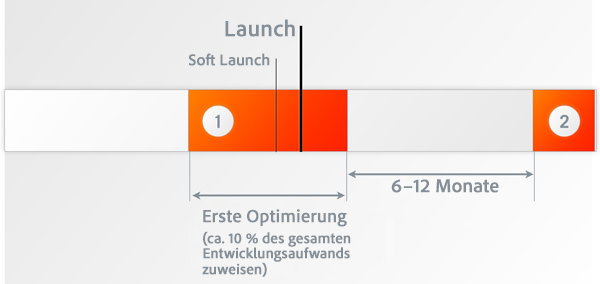
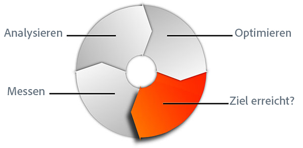
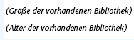
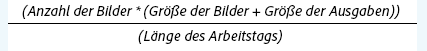
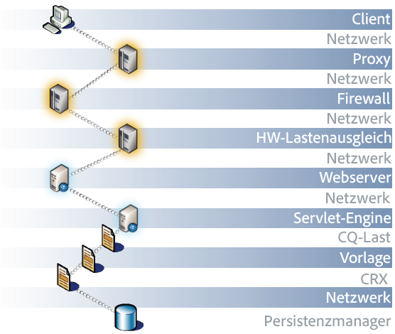
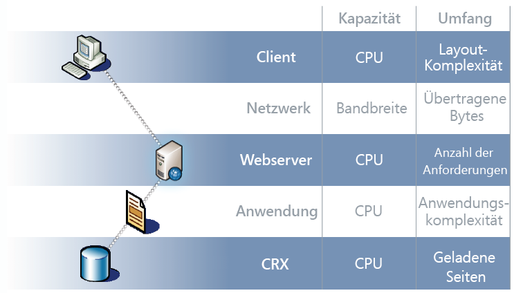
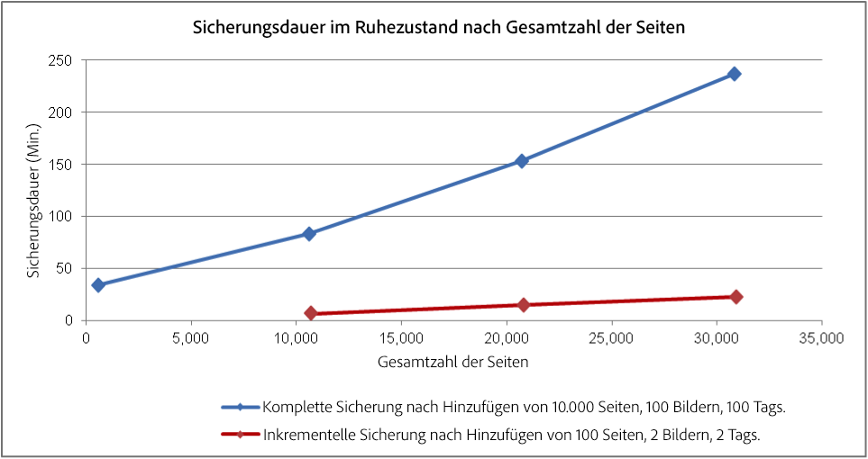
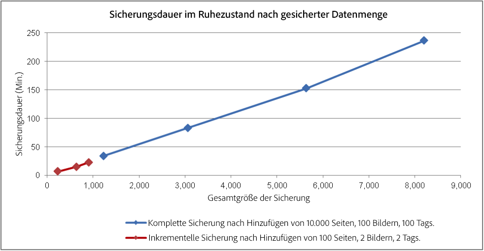
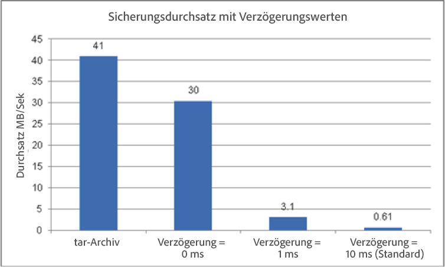

# Leistungsoptimierung {#performance-optimization}

>[!NOTE]
>
>Allgemeine Richtlinien zur Leistung finden Sie auf der Seite [Leistungsrichtlinien](/help/sites-deploying/performance-guidelines.md).
>
>Weitere Informationen zur Fehlerbehebung und zur Beseitigung von Leistungsproblemen finden Sie außerdem im [Leistungsbaum](/help/sites-deploying/performance-tree.md).
>
>Darüber hinaus können Sie einen Knowledge Base-Artikel zu [Tipps zur Leistungsoptimierung.](https://helpx.adobe.com/de/experience-manager/kb/performance-tuning-tips.html) lesen.

Ein wichtiger Faktor ist die Zeit, die Ihre Website benötigt, um auf Anforderungen durch Besucher zu reagieren. Obwohl dieser Wert für jede Anforderung anders ist, kann ein durchschnittlicher Zielwert definiert werden. Sobald sich gezeigt hat, dass dieser Wert längerfristig erreichbar ist, kann er verwendet werden, um die Leistung der Website zu überwachen und auf potenzielle Probleme hinzuweisen.

Die von Ihnen angestrebten Antwortzeiten sind aufgrund der unterschiedlichen Zielgruppen in der Autoren- und der Veröffentlichungsumgebung wahrscheinlich unterschiedlich:

## Autorenumgebung {#author-environment}

Diese Umgebung wird von Autoren zur Eingabe und Aktualisierung von Inhalten verwendet. Sie muss für eine kleine Anzahl von Benutzern geeignet sein, von denen jeder zahlreiche leistungsintensive Anforderungen beim Aktualisieren von Inhaltsseiten und einzelnen Elementen auf diesen Seiten erzeugt.

## Veröffentlichungsumgebung {#publish-environment}

Diese Umgebung enthält Inhalte, die Sie Ihren Benutzern zugänglich machen. In diesem Fall ist die Anzahl der Anforderungen sogar noch größer und die Geschwindigkeit ist ebenso wichtig, aber da die Anforderungen weniger dynamisch sind, können zusätzliche leistungssteigernde Mechanismen angewendet werden. wie das Zwischenspeichern des Inhalts oder den Lastenausgleich.

>[!NOTE]
>
>* Folgen Sie nach der Konfiguration zur Leistungsoptimierung der Anleitung in [Tough Day](/help/sites-developing/tough-day.md), um die Umgebung unter starker Belastung zu testen.
>* Siehe auch [Tipps zur Leistungsoptimierung.](https://helpx.adobe.com/experience-manager/kb/performance-tuning-tips.html)


## Methode zur Leistungsoptimierung {#performance-optimization-methodology}

Eine Leistungsoptimierungsmethode für AEM Projekte kann in fünf sehr einfachen Regeln zusammengefasst werden, die befolgt werden können, um Leistungsprobleme von Anfang an zu vermeiden:

1. [Zeit für die Optimierung einplanen](#planning-for-optimization)
1. [Reale Situationen simulieren](#simulate-reality)
1. [Konkrete Ziele festlegen](#establish-solid-goals)
1. [Relevante Maßnahmen treffen](#stay-relevant)
1. [Agile Iterationszyklen](#agile-iteration-cycles)

Diese Regeln gelten weitgehend für Webprojekte im Allgemeinen und sind für Projektmanager und Systemadministratoren relevant, um sicherzustellen, dass ihre Projekte bei Einführungszeiten nicht mit Leistungsproblemen konfrontiert werden.

### Zeit für die Optimierung einplanen {#planning-for-optimization}



Ca. 10 % der Projektarbeit sollten für die Leistungsoptimierung reserviert werden. Natürlich hängen die tatsächlichen Anforderungen an die Leistungsoptimierung von der Komplexität eines Projekts und der Erfahrung des Entwicklerteams ab. Auch wenn Ihr Projekt nicht die gesamte einkalkulierte Zeit beanspruchen sollte, ist es empfehlenswert, bei der Leistungsoptimierung die vorgeschlagene Zeit zu berücksichtigen.

Wenn möglich, sollte ein Projekt zunächst für eine begrenzte Zielgruppe sanft gestartet werden, um reale Erlebnisse zu sammeln und weitere Optimierungen durchzuführen, ohne dass der zusätzliche Druck entsteht, der auf eine vollständige Ankündigung folgt.

Doch auch nach dem Launch muss die Projektoptimierung fortgesetzt werden. Der Lauch ist der Moment, in dem Ihr System einer „echten“ Belastung ausgesetzt wird. Deshalb sollten nach dem Launch zusätzliche Anpassungen eingeplant werden.

Da die Systembelastung variiert und sich die Leistungsprofile Ihres Systems im Laufe der Zeit verändern, sollte alle sechs bis zwölf Monate eine Leistungsanpassung oder eine Systemüberprüfung vorgenommen werden.

### Reale Situationen simulieren  {#simulate-reality}


Wenn Sie nach dem Launch einer Website feststellen, dass Leistungsprobleme auftreten, gibt es nur einen Grund dafür: In Ihren Belastungs- und Leistungstests wurde die Realität nicht gut genug simuliert.

Die Simulation der Realität ist schwierig, und wie viel Aufwand Sie vernünftigerweise in &quot;real&quot; investieren wollen, hängt von der Art Ihres Projekts ab. „Real“ bedeutet nicht nur „realer Code“ und „realer Traffic“, sondern auch „realer Inhalt“, insbesondere was die Inhaltsgröße und Struktur anbelangt. Ihre Vorlagen können sich nämlich je nach Größe und Struktur des Repositorys völlig anders verhalten.

### Konkrete Ziele festlegen  {#establish-solid-goals}


Die Bedeutung der ordnungsgemäßen Festlegung von Leistungszielen ist nicht zu unterschätzen. Oft ist es sehr schwierig, diese Ziele nachträglich zu ändern, wenn Menschen sich auf bestimmte Leistungsziele konzentrieren, selbst wenn sie auf wilden Annahmen beruhen.

Das Festlegen guter, konkreter Leistungsziele ist eine der schwierigsten Aufgaben. Oft empfiehlt es sich, echte Protokolle und Benchmarks von einer vergleichbaren Website heranzuziehen (z. B. vom Vorgänger der neuen Website).

### Relevante Maßnahmen treffen  {#stay-relevant}


Es ist wichtig, immer jeweils einen Engpass nach dem anderen zu optimieren. Wenn Sie mehrere Maßnahmen gleichzeitig treffen, ohne die Auswirkungen der einzelnen Optimierungen zu überprüfen, wissen Sie nicht, welche Optimierungsmaßnahme tatsächlich erfolgreich war.

### Agile Iterationszyklen  {#agile-iteration-cycles}



Im Zuge der Leistungsanpassung werden Werte immer wieder gemessen, analysiert, optimiert und validiert, bis der Zielwert erreicht ist. Um diesem Aspekt angemessen Rechnung zu tragen, implementieren Sie nach jeder Iteration einen agilen Validierungsprozess in der Optimierungsphase und nicht einen schwereren Testprozess.

Der Entwickler, der die Optimierung durchführt, sollte rasch erkennen können, ob mit einer Optimierung der Zielwert erreicht wurde. Dies ist eine wertvolle Information, denn sobald der Zielwert erreicht ist, ist die Optimierung abgeschlossen.

## Allgemeine Leistungsrichtlinien  {#basic-performance-guidelines}

Im Allgemeinen sollten nicht gecachte HTML-Anforderungen weniger als 100 ms benötigen. Konkret wird Folgendes empfohlen:

* 70 % der Seitenanforderungen sollten in weniger als 100 ms beantwortet werden.
* 25 % der Seitenanforderungen sollten innerhalb von 100 ms bis 300 ms beantwortet werden.
* 4 % der Seitenanforderungen sollten innerhalb von 300 ms bis 500 ms beantwortet werden.
* 1 % der Seitenanforderungen sollten innerhalb von 500 ms bis 1000 ms beantwortet werden.
* Keine Seitenanforderung sollte länger als 1 Sekunde dauern.

Bei den obigen Zahlen gelten die folgenden Bedingungen:

* In der Veröffentlichungsumgebung gemessen (kein Mehraufwand im Zusammenhang mit einer Authoring-Umgebung)
* Auf dem Server gemessen (kein Netzwerkaufwand)
* Nicht zwischengespeichert (kein AEM Ausgabe-Cache, kein Dispatcher-Cache)
* Nur für komplexe Elemente mit vielen Abhängigkeiten (HTML, JS, PDF, ...)
* Keine andere Belastung des Systems

Häufige Ursachen für einen Leistungsabfall sind vor allem:

* Ineffizienz beim Dispatcher-Caching
* Die Verwendung von Abfragen in normalen Anzeigevorlagen.

Anpassungen auf JVM- und Betriebssystemebene bedingen normalerweise keine großen Leistungssprünge und sollten deshalb ganz am Ende des Optimierungszyklus ausgeführt werden.

Die Struktur des Inhaltsrepositorys kann sich ebenfalls auf die Leistung auswirken. Die beste Leistung wird erzielt, wenn die Anzahl der untergeordneten Knoten in einem Inhaltsrepository 1.000 nicht übersteigt (allgemeine Regel).

Besonders wichtig in einem herkömmlichen Leistungsoptimierungsschritt sind:

* Die `request.log`
* Komponentenbasiertes Timing
* Nicht zuletzt ein Java-Profiler.

### Leistung beim Laden und Bearbeiten von digitalen Assets {#performance-when-loading-and-editing-digital-assets}

Aufgrund des großen Datenvolumens beim Laden und Bearbeiten von digitalen Assets können Leistungsprobleme auftreten.

Die Leistung hängt dabei von zwei Faktoren ab:

* CPU - mehrere Kerne ermöglichen bei der Transkodierung eine reibungslosere Arbeit
* Festplatte: parallele RAID-Festplatten bewirken dasselbe

Stellen Sie zur Leistungssteigerung die folgenden Überlegungen an:

* Wie viele Assets werden pro Tag hochgeladen? Eine gute Schätzung erhalten Sie mit folgender Formel: 



* Der Zeitraum, in dem Änderungen vorgenommen werden (normalerweise die Dauer des Arbeitstags, mehr für internationale Vorgänge).
* Die durchschnittliche Größe der hochgeladenen Bilder (und die Größe der pro Bild generierten Darstellungen) in Megabyte.
* Bestimmen Sie die durchschnittliche Datenrate: 



* 80 % aller Bearbeitungen werden in 20 % der Zeit durchgeführt, weshalb zu Spitzenzeiten viermal die durchschnittliche Datenrate anfällt. Dies ist Ihr Leistungsziel.

## Leistungsüberwachung {#performance-monitoring}

Leistung (oder fehlende Leistung) ist das Erste, was Ihre Benutzer bemerken. Deshalb ist die Leistung wie bei jeder Anwendung mit einer Benutzeroberfläche von größter Bedeutung. Um die Leistung Ihrer AEM zu optimieren, müssen Sie verschiedene Attribute der Instanz und deren Verhalten überwachen.

Informationen zur Durchführung der Leistungsüberwachung finden Sie unter [Leistungsüberwachung](/help/sites-deploying/monitoring-and-maintaining.md#monitoring-performance).

Die Faktoren, die Leistungsprobleme verursachen, sind oft schwer zu erkennen, selbst wenn ihre Auswirkungen offenkundig sind.

Eine gute Basis ist die umfassende Kenntnis Ihres Systems bei Normalbetrieb. Wenn Sie nicht wissen, wie Ihre Umgebung im Normalbetrieb „aussieht“ und sich „verhält“, ist es schwierig, die Ursache eines Leistungsabfalls zu ermitteln. Deshalb sollten Sie sich Ihr System während des reibungslosen Betriebs genau ansehen und laufend Leistungsinformationen erfassen. Dies bietet Ihnen eine Vergleichsbasis, falls sich die Leistung verschlechtert.

Das folgende Diagramm zeigt den Pfad, den eine Anfrage für AEM Inhalt nehmen kann, und somit die Anzahl der verschiedenen Elemente, die sich auf die Leistung auswirken können.



Leistung ist auch ein Gleichgewicht zwischen Volumen und Kapazität:

* **Volumen**  - Die Menge der Ausgabe, die vom System verarbeitet und bereitgestellt wird.
* **Kapazität**  - Die Fähigkeit des Systems, das Volumen bereitzustellen.

Dies kann an unterschiedlichen Stellen des Web-Pfads veranschaulicht werden.



Es gibt einige Funktionsbereiche, die häufig für eine Leistungsminderung verantwortlich sind:

* Caching
* Code der Anwendung (Ihres Projekts)
* Suchfunktion

### Grundregeln für die Leistung  {#basic-rules-regarding-performance}

Gewisse Regeln sollten bei der Leistungsoptimierung beachtet werden:

* Die Leistungsanpassung *muss* Teil eines jeden Projekts sein.
* Führen Sie die Optimierung nicht in einer frühen Phase des Entwicklungszyklus durch.
* Die Leistung ist nur so gut wie das schwächste Glied.
* Achten Sie immer auf das Verhältnis zwischen Kapazität und Volumen.
* Optimieren Sie wichtige Dinge zuerst.
* Führen Sie nie Optimierungen ohne *realistische* Ziele durch.

>[!NOTE]
>
>Bedenken Sie, dass der zur Leistungsmessung verwendete Mechanismus häufig genau das beeinflusst, was Sie messen möchten. Sie sollten diese Aspekte stets berücksichtigen und dafür sorgen, dass ihre Auswirkungen möglichst gering gehalten werden. Insbesondere sollten Browser-Plug-ins deaktiviert werden.

## Konfiguration zur Leistungsoptimierung  {#configuring-for-performance}

Bestimmte Aspekte von AEM (bzw. des zugrunde liegenden Repositorys) können so konfiguriert werden, dass die Leistung optimiert wird. Im Folgenden werden Möglichkeiten und Vorschläge beschrieben. Überprüfen Sie zuerst, ob und wie Sie die beschriebene Funktionalität verwenden können, bevor Sie Änderungen vornehmen. 

>[!NOTE]
>
>Weitere Informationen finden Sie im [Artikel in der Wissensdatenbank](https://helpx.adobe.com/experience-manager/kb/performance-tuning-tips.html). 

### Suchindizierung {#search-indexing}

Ab AEM 6.0 wird eine Oak-basierte Repository-Architektur verwendet.

Hier finden Sie die aktuellen Indizierungsinformationen:

* [Best Practices für Abfragen und Indizierung](/help/sites-deploying/best-practices-for-queries-and-indexing.md)
* [Anforderungen und Indizierung](/help/sites-deploying/queries-and-indexing.md) 

### Gleichzeitige Verarbeitung von Workflows  {#concurrent-workflow-processing}

Begrenzen Sie die Anzahl der parallel ausgeführten Workflow-Prozesse, um die Leistung zu verbessern. Standardmäßig entspricht die Anzahl der gleichzeitig von der Workflow-Engine verarbeiteten Workflows der Anzahl der für die Java VM verfügbaren Prozessoren. Wenn Workflow-Schritte große Mengen an Verarbeitungsressourcen (RAM oder CPU) erfordern, kann die parallele Ausführung mehrerer dieser Workflows hohe Anforderungen an verfügbare Serverressourcen stellen.

Wenn beispielsweise Bilder (oder DAM-Assets im Allgemeinen) hochgeladen werden, importieren Workflows diese Bilder automatisch in DAM. Bilder besitzen häufig eine hohe Auslösung, wodurch oft hunderte von MB in Heap-Speichern zur Verarbeitung beansprucht werden. Die gleichzeitige Verarbeitung solcher Bilder bedeutet eine hohe Last für das Speicher-Subsystem und den Garbage Collector.

Die Workflow-Engine verwendet Apache Sling-Auftragswarteschlangen zur Handhabung und Planung der Verarbeitung der Arbeitselemente. Die folgenden Auftragswarteschlangendienste wurden standardmäßig in der Apache Sling Job Queue Configuration Service Factory für die Verarbeitung von Workflow-Aufträgen erstellt:

* Granite-Workflow-Warteschlange: Die meisten Workflow-Schritte, z. B. die, die DAM-Assets verarbeiten, verwenden den Granite Workflow Queue-Dienst.
* Warteschlange für externe Prozessaufträge im Granite-Workflow: Dieser Dienst wird für spezielle externe Workflow-Schritte verwendet, die normalerweise zum Kontaktieren eines externen Systems und zum Abruf von Ergebnissen verwendet werden. Beispielsweise wird der Schritt „InDesign Media Extraction Process“ als externer Prozess implementiert. Die Workflow-Engine verwendet die externe Warteschlange zur Verarbeitung der Abfrage. (Siehe [com.day.cq.workflow.exec.WorkflowExternalProcess](https://helpx.adobe.com/experience-manager/6-5/sites/developing/using/reference-materials/javadoc/com/day/cq/workflow/exec/WorkflowExternalProcess.html).)

Konfigurieren Sie diese Dienste, um die maximale Anzahl der parallel ausgeführten Workflow-Prozesse zu beschränken.

>[!NOTE]
>
>Die Konfiguration dieser Auftragswarteschlangen wirkt sich auf alle Workflows aus, es sei denn, Sie haben eine Auftragswarteschlange für ein bestimmtes Workflow-Modell erstellt (siehe [Konfigurieren der Warteschlange für ein bestimmtes Workflow-Modell](/help/sites-deploying/configuring-performance.md#configure-the-queue-for-a-specific-workflow) unten).

#### Konfiguration im Repository {#configuration-in-the-repo}

Wenn Sie die Dienste [mit einem sling:OsgiConfig -Knoten](/help/sites-deploying/configuring-osgi.md#adding-a-new-configuration-to-the-repository) konfigurieren, müssen Sie die PID der vorhandenen Dienste suchen, z. B.: org.apache.sling.event.jobs.QueueConfiguration.370aad73-d01b-4a0b-abe4-20198d85f705. Sie können den PID mithilfe der Webkonsole ermitteln.

Sie müssen die Eigenschaft `queue.maxparallel` konfigurieren.

#### Konfiguration in der Web-Konsole{#configuration-in-the-web-console} 

Suchen Sie zum Konfigurieren dieser Dienste [mithilfe der Web-Konsole](/help/sites-deploying/configuring-osgi.md#osgi-configuration-with-the-web-console) die vorhandenen Konfigurationselemente unter der Apache Sling Job Queue Configuration Service-Factory.

Sie müssen die Eigenschaft &quot;Maximum Parallel Jobs&quot;konfigurieren.

### Konfigurieren der Warteschlange für einen spezifischen Workflow {#configure-the-queue-for-a-specific-workflow}

Erstellen Sie eine Auftragswarteschlange für ein bestimmtes Workflow-Modell, sodass Sie die Auftragsabwicklung für dieses Workflow-Modell konfigurieren können. Dadurch wird die Verarbeitung dieses Workflows durch Ihre Konfigurationen gesteuert, während die Verarbeitung anderer Workflows durch die Konfiguration der standardmäßigen Granite Workflow Queue gesteuert wird.

Wenn Workflow-Modelle ausgeführt werden, erstellen sie Sling-Aufträge für ein bestimmtes Thema. Standardmäßig entspricht das Thema den Themen, die für die allgemeine Granite Workflow Queue oder die Granite Workflow External Process Job Queue konfiguriert werden:

* `com/adobe/granite/workflow/job*`
* `com/adobe/granite/workflow/external/job*`

Zu den Themen, die Workflow-Modelle tatsächlich erstellen, gehören modellspezifische Suffix. Beispielsweise generiert das Workflow-Modell **DAM Update Asset** Aufträge mit dem folgenden Thema:

`com/adobe/granite/workflow/job/etc/workflow/models/dam/update_asset/jcr_content/model`

Daher können Sie eine Auftragswarteschlange für das Thema erstellen, das dem Auftragsthema Ihres Workflow-Modells entspricht. Die Konfiguration der Leistungseigenschaften der Warteschlange wirkt sich nur auf das Workflow-Modell aus, das die Aufträge generiert, die dem Warteschlangenthema entsprechen.

Im folgenden Verfahren wird eine Auftragswarteschlange für einen Workflow erstellt, wobei als Beispiel der Workflow **DAM Update Asset** verwendet wird.

1. Führen Sie das Workflow-Modell aus, für das Sie die Auftragswarteschlange erstellen möchten, sodass Themenstatistiken generiert werden. Fügen Sie beispielsweise ein Bild zu Assets hinzu, um den Workflow **DAM Update Asset** auszuführen.
1. Öffnen Sie die Sling Jobs-Konsole (`https://<host>:<port>/system/console/slingevent`).
1. Suchen Sie die Workflow-Themen in der Konsole. Für „DAM-Update-Asset“ werden die folgenden Themen gefunden:

   * `com/adobe/granite/workflow/external/job/etc/workflow/models/dam/update_asset/jcr_content/model`
   * `com/adobe/granite/workflow/job/etc/workflow/models/dam/update_asset/jcr_content/model`
   * `com/adobe/granite/workflow/job/etc/workflow/models/dam-xmp-writeback/jcr_content/model`

1. Erstellen Sie für jedes Thema eine Auftragswarteschlange. Erstellen Sie zu diesem Zweck eine Werkskonfiguration für den Apache Sling Job Queue Factory Service.

   Die Werkskonfigurationen ähneln der Granite-Workflow-Warteschlange, die unter [Gleichzeitige Workflow-Verarbeitung](/help/sites-deploying/configuring-performance.md#concurrent-workflow-processing) beschrieben wird. Die Themeneigenschaft stimmt jedoch mit dem Thema Ihrer Workflow-Aufträge überein.

### AEM DAM Asset Synchronization Service {#cq-dam-asset-synchronization-service}

`AssetSynchronizationService` dient zur Synchronisation von Assets von gemounteten Repositorys (z. B. LiveLink, Documentum). Standardmäßig wird hierbei alle 300 Sekunden (5 Minuten) eine Prüfung durchgeführt. Wenn Sie keine installierten Repositorys verwenden, können Sie diesen Dienst deaktivieren.

[Konfigurieren Sie dazu den OSGi-Dienst](/help/sites-deploying/configuring-osgi.md) **CQ DAM Asset Synchronization Service**, sodass der **Synchronisationszeitraum** (`scheduler.period`)(mindestens) 1 Jahr beträgt (definiert in Sekunden). 

### Mehrere DAM-Instanzen {#multiple-dam-instances}

Das Bereitstellen mehrerer DAM-Instanzen kann in folgenden Fällen die Leistung steigern: 

* Sie haben eine hohe Belastung durch das regelmäßige Hochladen einer großen Anzahl von Assets für die Autorenumgebung. Hier kann eine separate DAM-Instanz für den Service-Autor bereitgestellt werden.
* Sie verfügen über mehrere Teams an weltweiten Standorten (z.B. USA, Europa, Asien).

Zusätzliche Erwägungen sind:

* Trennung von &quot;laufende Arbeit&quot;auf der Autoreninstanz von &quot;endgültig&quot;auf der Veröffentlichungsinstanz
* Trennung interner Benutzer vom Autor von externen Besuchern/Benutzern bei der Veröffentlichung (z. B. Agenten, Pressevertreter, Kunden, Studenten usw.).

## Best Practices zur Qualitätssicherung {#best-practices-for-quality-assurance}

Leistung ist von größter Bedeutung für Ihre Veröffentlichungsumgebung. Deshalb müssen Sie die Leistungstests für die Veröffentlichungsumgebung während der Implementierung Ihres Projekts sorgfältig planen und analysieren.

In diesem Abschnitt erhalten Sie einen standardisierten Überblick über die Probleme bei der Definition eines Testkonzepts speziell für Leistungstests in Ihrer *publish*-Umgebung. Dies ist vor allem für QA-Beauftragte, Projektleiter und Systemadministratoren von Interesse.

Im Folgenden wird ein standardisierter Ansatz für Leistungstests für eine AEM Anwendung in der Umgebung *Publish* beschrieben. Diese umfasst die folgenden fünf Phasen:

* [Überprüfung des Wissens](#verification-of-knowledge)
* [Definition des Umfangs ](#scope-definition)
* [Testmethoden](#test-methodologies)
* [Definition von Leistungszielen ](#defining-the-performance-goals)
* [Optimierung](#optimization)

Die Kontrolle ist ein zusätzlicher, alles umfassender Prozess, der nötig ist, sich aber nicht auf Tests beschränkt.

### Überprüfung des Wissens  {#verification-of-knowledge}

Der erste Schritt besteht darin, die grundlegenden für Tests erforderlichen Informationen zu dokumentieren:

* Die Architektur Ihrer Testumgebung
* Eine Anwendungszuordnung mit den internen Elementen, die getestet werden müssen (sowohl isoliert als auch kombiniert)

#### Testarchitektur {#test-architecture}

Sie sollten die Architektur der für die Leistungstests verwendeten Testumgebung genau dokumentieren.

Sie benötigen eine Reproduktion Ihrer geplanten Produktions-Veröffentlichungsumgebung gemeinsam mit dem Dispatcher und Load Balancer.

#### Anwendungsdiagramm  {#application-map}

Um einen Überblick zu erhalten, können Sie ein Diagramm von der Anwendung erstellen (möglicherweise können Sie ein Diagramm von Tests in der Autorenumgebung verwenden).

Durch die Darstellung der internen Elemente der Anwendung erhalten Sie einen Überblick über die Testanforderungen. Wenn Sie Farbkodierung verwenden, können Sie dieses Diagramm auch für einen Bericht verwenden.

### Definition des Umfangs {#scope-definition}

Eine Anwendung kann in der Regel auf vielfältige Weise eingesetzt werden. Oft sind dabei manche Anwendungsfälle wichtiger als andere.

Um den Umfang des Leistungstests speziell auf die Veröffentlichungsumgebung anzupassen, empfehlen wir Ihnen die Definition folgender Punkte:

* Die wichtigsten geschäftlichen Anwendungsfälle
* Die wichtigsten technischen Anwendungsfälle

Sie können die Anzahl von Anwendungsfällen frei wählen, sie sollte aber auf einen Wert beschränkt sein, der einfach zu handhaben ist (z. B. fünf bis zehn).

Nach der Auswahl der wichtigsten Anwendungsfälle können die KPIs (Key Performance Indicators) und die Werkzeuge für ihre Messung definiert werden. Beispiele für häufige KPIs sind:

* End-to-end-Antwortzeit
* Servlet-Antwortzeit
* Reaktionszeit für eine einzelne Komponente
* Reaktionszeit für die Dienste
* Anzahl der inaktiven Threads im Thread-Pool
* Anzahl der freien Verbindungen
* Systemressourcen wie CPU und I/O-Zugriff

### Testmethoden  {#test-methodologies}

Im Folgenden werden vier Szenarien für das Definieren und Testen der Leistungsziele beschrieben:

* Tests einzelner Komponenten
* Tests kombinierter Komponenten
* *Going Live*-Szenario
* Fehlerszenarien

Es gelten die folgenden Prinzipien:

#### Belastungsgrenze der Komponente{#component-breakpoints} 

* Jede Komponente hat eine bestimmte Belastungsgrenze in Bezug auf die Leistung. Dies bedeutet, dass eine Komponente bis zu einem gewissen Punkt eine gute Leistung erbringt, diese ab diesem Punkt aber rapide nachlässt.
* Um einen vollständigen Überblick über die Anwendung zu erhalten, müssen Sie zunächst feststellen, wann bei Ihren Komponenten diese Belastungsgrenze erreicht ist.
* Um die Belastungsgrenze festzustellen, können Sie einen Belastungstest durchführen, bei dem Sie über einen gewissen Zeitraum die Anzahl der Benutzer erhöhen und so die Last steigern. Durch die Überwachung dieser Last und der Antwort der Komponenten erkennen Sie ein spezifisches Leistungsverhalten, wenn die Belastungsgrenze der Komponente erreicht ist. Diese Grenze kann durch die Anzahl gleichzeitiger Transaktionen pro Sekunde zusammen mit der Anzahl gleichzeitiger Benutzer angegeben werden (sofern die Komponente von diesem KPI beeinflusst wird).
* Diese Information kann dann als Vergleichswert für Verbesserungen herangezogen werden und Ihnen helfen, die Effizienz der ergriffenen Maßnahmen zu beurteilen und Testszenarien zu definieren.

#### Transaktionen  {#transactions}

* Der Ausdruck „Transaktion“ bezieht sich auf die Anforderung einer kompletten Webseite, einschließlich der Seite selbst und aller darauf folgenden Aufrufe, d. h. auf die Seitenanforderung, etwaige AJAX-Aufrufe, Bilder und andere Objekte.**Anforderungsanalyse**
* Um jede Anforderung vollständig zu analysieren, können Sie jedes Element des Aufrufstapels abbilden und dann aus der durchschnittlichen Verarbeitungszeit eines jeden Elements die Summe berechnen.

### Leistungsziele definieren {#defining-the-performance-goals}

Nachdem der Umfang und die zugehörigen KPIs definiert wurden, können die spezifischen Leistungsziele festgelegt werden. Dies umfasst das Konzipieren von Testszenarien und Zielwerten.

Die Leistung muss bei durchschnittlicher Belastung und unter Spitzenlast getestet werden. Darüber hinaus müssen Sie Tests für „Going Live“-Szenarien durchführen, um zu gewährleisten, dass Ihre Website auch dem stärkeren Andrang unmittelbar nach dem Launch gewachsen ist.

Beim Festlegen künftiger Ziele können alle Erfahrungen und Statistiken von einer vorhandenen Website hilfreich sein, z. B. der maximale Datenverkehr auf Ihrer Live-Website.

#### Tests einzelner Komponenten  {#single-component-tests}

Schlüsselkomponenten müssen bei durchschnittlicher Belastung und unter Spitzenlast getestet werden.

In beiden Fällen können Sie die erwartete Anzahl von Transaktionen pro Sekunde definieren, wenn eine vordefinierte Anzahl von Benutzern das System verwendet.

| Komponente | Testtyp | Nein. der Benutzer | Tx/Sek (erwartet) | Tx/Sek (getestet) | Beschreibung |
|---|---|---|---|---|---|
| Startseiten-Einzelbenutzer | Durchschnitt | 1 | 1 |  |  |
|  | Spitze | 1 | 3 |  |  |
| Homepage 100 Benutzer | Durchschnitt | 100 | 1 |  |  |
|  | Spitze | 100 | 1 |  |

#### Tests kombinierter Komponenten {#combined-component-tests}

Durch das Testen der kombinierten Komponenten erhalten Sie eine genauere Darstellung des Verhaltens der Anwendung. Wiederum müssen Tests bei durchschnittlicher Belastung und unter Spitzenlast durchgeführt werden.

| Szenario | Komponente | Nein. der Benutzer | Tx/Sek (erwartet) | Tx/Sek (getestet) | Beschreibung |
|---|---|---|---|---|---|
| Gemischter Durchschnitt | Homepage | 10 | 1 |  |  |
|  | Suchen | 10 | 1 |  |  |
|  | Nachrichten | 10 | 2 |  |  |
|  | Ereignisse | 10 | 1 |  |  |
|  | Aktivierungen | 10 | 1 |  | Simulation des Autorenverhaltens. |
| Mixed Spitzenwert | Homepage | 100 | 5 |  |  |
|  | Suchen | 50 | 5 |  |  |
|  | Nachrichten | 100 | 10 |  |  |
|  | Ereignisse | 100 | 10 |  |  |
|  | Aktivierungen | 20 | 20 |  | Simulation des Autorenverhaltens. |

#### „Going Live“-Tests{#going-live-tests}

In den ersten Tagen nach dem Launch Ihrer Website ist mit erhöhtem Interesse zu rechnen. Dieses übersteigt wahrscheinlich die von Ihnen getesteten Spitzenwerte. Es wird dringend empfohlen, „Going Live“-Szenarien zu testen, um sicherzustellen, dass Ihr System einer solchen Situation gewachsen ist.

| Szenario | Testtyp | Nein. der Benutzer | Tx/Sek (erwartet) | Tx/Sek (getestet) | Beschreibung |
|---|---|---|---|---|---|
| Gehender Live-Peak | Homepage | 200 | 20 |  |  |
|  | Suchen | 100 | 10 |  |  |
|  | Nachrichten | 200 | 20 |  |  |
|  | Ereignisse | 200 | 20 |  |  |
|  | Aktivierungen | 20 | 20 |  | Simulation des Autorenverhaltens. |

#### Tests von Fehlerszenarien {#error-scenario-tests}

Fehlerszenarien müssen auch getestet werden, um sicherzustellen, dass das System ordnungsgemäß reagiert. Dies umfasst nicht nur die Handhabung eines Fehlers selbst, sondern auch die möglichen Auswirkungen eines Fehlers auf die Leistung. Beispiel:

* Was passiert, wenn der Benutzer versucht, einen ungültigen Suchbegriff in das Suchfeld einzugeben?
* Was passiert, wenn der Suchbegriff so allgemein ist, dass er eine übermäßige Anzahl von Ergebnissen zurückgibt?

Bei der Planung dieser Tests sollten Sie bedenken, dass nicht alle Szenarien regelmäßig auftreten. Dennoch ist ihre Auswirkung auf das gesamte System wichtig.

| Fehlerszenario | Fehlertyp | Nein. der Benutzer | Tx/Sek (erwartet) | Tx/Sek (getestet) | Beschreibung |
|---|---|---|---|---|---|
| Überlastung der Suchkomponente | Suche nach einem globalen Platzhalter (Sternchen) | 10 | 1 |  | Nur &amp;ast;&amp;ast;&amp;ast; durchsucht werden. |
|  | Stoppwort | 20 | 2 |  | Suchen nach einem Stoppwort. |
|  | Leere Zeichenfolge | 10 | 1 |  | Suchen nach einer leeren Zeichenfolge. |
|  | Sonderzeichen | 10 | 1 |  | Suchen nach Sonderzeichen. |

#### Belastungstests {#endurance-tests}

Gewisse Probleme treten erst auf, wenn das System über einen längeren Zeitraum hinweg aktiv war. Das können Stunden oder sogar Tage sein. Mit einem Belastungstest wird eine konstante durchschnittliche Belastung während eines bestimmten Zeitraums getestet. Danach kann ein etwaiger Leistungsabfall untersucht werden.

| Szenario | Testtyp | Nein. der Benutzer | Tx/Sek (erwartet) | Tx/Sek (getestet) | Beschreibung |
|---|---|---|---|---|---|
| Belastungsprüfung (72 Stunden) | Homepage | 10 | 1 |  |  |
|  | Suchen | 10 | 1 |  |  |
|  | Nachrichten | 20 | 2 |  |  |
|  | Ereignisse | 10 | 1 |  |  |
|  | Aktivierungen | 1 | 1 |  | Simulation des Autorenverhaltens. |

### Optimierung {#optimization}

In den späteren Implementierungsphasen werden Sie die Anwendung optimieren müssen, um die Leistungsziele zu erreichen bzw. zu maximieren.

Alle vorgenommenen Optimierungen müssen auf folgende Bedingungen hin getestet werden:

* Die Funktionalität ist davon nicht betroffen
* Mit den Belastungstests vor der Freigabe überprüft worden sein

Für die Lastgenerierung, Leistungsüberwachung und/oder Ergebnisanalyse steht eine Reihe von Tools zur Verfügung:

* [JMeter](https://jakarta.apache.org/jmeter/)
* [Load Runner](https://www.microfocus.com/en-us/products/loadrunner-load-testing/overview)
* [Determyne](https://www.determyne.com/) InsideApps
* [InfraRED](https://www.infraredsoftware.com/)
* [Java Interactive Profile](https://jiprof.sourceforge.net/)
* Viele weitere...

Nach der Optimierung müssen Sie einen erneuten Test durchführen, um die Auswirkungen zu überprüfen.

### Berichterstellung {#reporting}

Die laufende Berichterstellung ist erforderlich, um alle über den Status auf dem Laufenden zu halten, wie bereits erwähnt, mit Farbcodierung kann die Architekturkarte dafür verwendet werden.

Nachdem alle Tests abgeschlossen sind, können Sie Berichte über folgende Bereiche erstellen:

* Etwaige kritische Fehler
* Nichtkritische Fragen, die noch weiter untersucht werden müssen
* Annahmen während der Prüfung
* Empfehlungen, die sich aus den Tests ergeben

## Optimieren der Leistung durch den Einsatz des Dispatchers {#optimizing-performance-when-using-the-dispatcher}

Der [Dispatcher](https://helpx.adobe.com/experience-manager/dispatcher/using/dispatcher.html) ist das Caching- und/oder Lastausgleichs-Tool von Adobe. Bei Verwendung des Dispatchers sollten Sie Ihre Website hinsichtlich der Cache-Leistung optimieren. 

>[!NOTE]
>
>Dispatcher-Versionen sind unabhängig von AEM, die Dispatcher-Dokumentation ist jedoch in die AEM-Dokumentation eingebettet. Verwenden Sie immer die Dispatcher-Dokumentation, die in der Dokumentation für die neueste Version von AEM eingebettet ist.
>
>Möglicherweise wurden Sie von der Dispatcher-Dokumentation zu einer früheren AEM-Version zu dieser Seite weitergeleitet.

Der Dispatcher bietet verschiedene integrierte Mechanismen zur Optimierung der Leistung Ihrer Website. In diesem Abschnitt erfahren Sie, wie Sie Ihre Website einrichten, um die Vorteile der Zwischenspeicherung zu maximieren.

>[!NOTE]
>
>Beachten Sie dabei, dass der Dispatcher den Cache auf einem Standardwebserver speichert. Dies bedeutet, dass Sie:
>
>* Kann alles zwischenspeichern, das Sie als Seite speichern und mithilfe einer URL anfordern können
>* Andere Elemente, wie Cookies, Sitzungsdaten und Formulardaten, können nicht gespeichert werden.

>
>
Allgemein müssen für viele Caching-Strategien geeignete URLs ausgewählt werden, damit diese zusätzlichen Daten nicht benötigt werden.
>
>Mit der Dispatcher-Version 4.1.11 können Sie auch Antwortheader zwischenspeichern, siehe [Zwischenspeichern von HTTP-Antwortheadern](https://helpx.adobe.com/experience-manager/dispatcher/using/dispatcher-configuration.html#configuring-the-dispatcher-cache-cache).


### Dispatcher-Cache-Verhältnis berechnen {#calculating-the-dispatcher-cache-ratio}

Mit der Cache-Verhältnis-Formel wird der ungefähre Prozentsatz der vom Cache gehandhabten Anforderungen verglichen mit der Gesamtzahl der Systemanforderungen berechnet. Zur Berechnung des Cache-Verhältnisses benötigen Sie Folgendes:

* Die Gesamtzahl der Anforderungen. Diese Information können Sie der Apache-Datei `access.log` entnehmen. Weitere Informationen finden Sie in der [offiziellen Apache-Dokumentation](https://httpd.apache.org/docs/2.4/logs.html#accesslog).

* Die Anzahl der von der Veröffentlichungsinstanz gehandhabten Anforderungen. Diese Informationen sind im `request.log` der Instanz verfügbar. Weitere Informationen finden Sie unter [Interpretieren der request.log](/help/sites-deploying/monitoring-and-maintaining.md#interpreting-the-request-log) und [Suchen der Protokolldateien](/help/sites-deploying/monitoring-and-maintaining.md#finding-the-log-files).

Die Formel zur Berechnung des Cache-Verhältnisses lautet:

* (Die Gesamtanzahl der Anforderungen **minus** die Anzahl der Anforderungen bei der Veröffentlichung) **dividiert durch** durch die Gesamtanzahl der Anforderungen.

Beispiel: Die Gesamtzahl der Anforderungen ist 129491 und die Anzahl der von der Veröffentlichungsinstanz gehandhabten Anforderungen ist 58959. Das Cache-Verhältnis beträgt daher: **(129491 - 58959) : 129491 = 54,5 %**.

Wenn es keine direkte Entsprechung zwischen Publisher und Dispatcher gibt, müssen Sie die Anforderungen von allen Dispatchern und Publishern addieren, um eine korrekte Messung zu erhalten. Siehe auch [Empfohlene Bereitstellungen](/help/sites-deploying/recommended-deploys.md).

>[!NOTE]
>
>Für eine optimale Leistung empfiehlt Adobe ein Cache-Verhältnis von 90 % bis 95 %.

#### Verwenden einer einheitlichen Seitencodierung   {#using-consistent-page-encoding}

Mit der Dispatcher-Version 4.1.11 können Sie Antwort-Header cachen. Wenn Sie keine Antwort-Header im Dispatcher cachen, können Probleme auftreten, wenn Sie in der Kopfzeile Seitenkodierungsinformationen speichern. Wenn der Dispatcher in diesem Fall eine Seite aus dem Cache bereitstellt, wird die Standardkodierung des Webservers für die Seite verwendet. Es gibt zwei Möglichkeiten, um dieses Problem zu vermeiden:

* Wenn Sie nur eine Kodierung verwenden, achten Sie darauf, dass die auf dem Webserver verwendete Kodierung der Standardkodierung der AEM-Website entspricht.
* Verwenden Sie ein `<META>`-Tag im HTML-Abschnitt `head`, um die Codierung festzulegen. Beispiel:

```xml
        <META http-equiv="Content-Type" content="text/html; charset=EUC-JP">
```

#### Vermeiden von URL-Parametern {#avoid-url-parameters}

Vermeiden Sie, wenn möglich, URL-Parameter für Seiten, die Sie zwischenspeichern möchten. Wenn Sie beispielsweise eine Bildergalerie betrachten, wird die folgende URL nie zwischengespeichert (es sei denn, der Dispatcher wurde [entsprechend konfiguriert](https://helpx.adobe.com/experience-manager/dispatcher/using/dispatcher-configuration.html#configuring-the-dispatcher-cache-cache)):

```xml
www.myCompany.com/pictures/gallery.html?event=christmas&amp;page=1
```

Sie können diese Parameter allerdings in der URL der Seite platzieren:

```xml
www.myCompany.com/pictures/gallery.christmas.1.html
```

>[!NOTE]
>
>Diese URL ruft dieselbe Seite und dieselbe Vorlage wie `gallery.html` auf. In der Vorlagendefinition können Sie angeben, welches Skript die Seite rendern soll, oder Sie können ein Skript für alle Seiten verwenden.

#### Anpassen nach URL   {#customize-by-url}

Wenn Sie Benutzern die Möglichkeit geben, die Schriftgröße zu ändern (oder andere Layoutanpassungen vorzunehmen), stellen Sie sicher, dass die verschiedenen Anpassungen in der URL repräsentiert werden.

Beispielsweise werden Cookies nicht zwischengespeichert. Wenn Sie also die Schriftgröße in einem Cookie (oder einem ähnlichen Mechanismus) speichern, bleibt die Schriftgröße für die zwischengespeicherte Seite nicht erhalten. Daher gibt der Dispatcher Dokumente mit beliebiger Schriftgröße nach dem Zufallsprinzip zurück.

Wenn Sie die Schriftgröße in der URL als Selektor einschließen, wird dieses Problem vermieden:

```xml
www.myCompany.com/news/main.large.html
```

>[!NOTE]
>
>Bei den meisten Layoutkomponenten können auch Stylesheets und/oder clientseitige Skripts verwendet werden. Diese funktionieren normalerweise gut mit dem Zwischenspeichern.
>
>Dies ist auch für Druckversionen nützlich, für die Sie eine URL wie in diesem Beispiel erstellen können:
>
>`www.myCompany.com/news/main.print.html`
>
>Unter Verwendung des Skript-Globbings der Vorlagendefinition können Sie ein anderes Skript festlegen, das die Seiten für das Drucken anzeigt.

#### Invalidierung von als Titel verwendeten Bilddateien   {#invalidating-image-files-used-as-titles}

Wenn Sie Seitentitel oder anderen Text als Grafik rendern, sollten Sie die Dateien speichern, damit sie nach einer Inhaltsaktualisierung auf der Seite gelöscht werden:

1. Platzieren Sie die Bilddatei im selben Verzeichnis wie die Seite.
1. Verwenden Sie das folgende Namensformat für die Bilddatei:

   `<page file name>.<image file name>`

Sie können beispielsweise den Titel der Seite `myPage.html` im `file myPage.title.gif` speichern. Diese Datei wird automatisch gelöscht, wenn die Seite aktualisiert wird. Alle Änderungen des Seitentitels werden daher automatisch im Cache übernommen.

>[!NOTE]
>
>Die Bilddatei ist nicht unbedingt tatsächlich in der AEM-Instanz vorhanden. Sie können ein Skript verwenden, das die Bilddatei dynamisch erstellt. Der Dispatcher speichert die Datei dann auf dem Webserver.

#### Invalidierung von Bilddateien für die Navigation   {#invalidating-image-files-used-for-navigation}

Wenn Sie Bilder als Navigationseinträge verwenden, gehen Sie im Prinzip wie bei Titeln vor, das Verfahren ist nur etwas komplexer. Speichern Sie alle Navigationsgrafiken mit den Zielseiten. Wenn Sie zwei Bilder für den normalen und aktiven Status verwenden, können Sie die folgenden Skripts verwenden:

* Ein Skript, das die Seite normal anzeigt.
* Ein Skript, das „.normal“-Anforderungen verarbeitet und das normale Bild zurückgibt.
* Ein Skript, das „.active“ verarbeitet und das aktivierte Bild zurückgibt.

Sie müssen diese Grafiken mit demselben Namenhandle wie die Seite erstellen, um sicherzustellen, dass bei einer Inhaltsaktualisierung diese Bilder sowie die Seite gelöscht werden.

Bei Seiten, die nicht geändert werden, bleiben die Bilder im Cache, auch wenn die Seiten selbst normalerweise automatisch ungültig gemacht werden.

#### Personalisierung  {#personalization}

Es wird empfohlen, die Personalisierung auf den erforderlichen Bereich zu beschränken. Dies hat folgende Gründe:

* Wenn Sie eine frei anpassbare Startseite verwenden, muss diese Seite jedes Mal erstellt werden, wenn ein Benutzer sie anfordert.
* Wenn Sie stattdessen eine Auswahl von 10 verschiedenen Startseiten anbieten, können Sie diese zwischenspeichern und so die Leistung verbessern.

>[!TIP]
>Weitere Informationen zum Konfigurieren des Dispatcher-Caches finden Sie im [AEM Tutorial zum Dispatcher-Cache](https://experienceleague.adobe.com/docs/experience-manager-learn/dispatcher-tutorial/overview.html) und im Abschnitt zum Zwischenspeichern geschützter Inhalte [Zwischenspeichern.](https://experienceleague.adobe.com/docs/experience-manager-learn/dispatcher-tutorial/chapter-1.html#dispatcher-tips-and-tricks)

Wenn Sie die einzelnen Seiten personalisieren (z. B. durch Einfügen des Namens des Benutzers in die Titelleiste), kann dies Auswirkungen auf die Leistung haben.

>[!TIP]
>Informationen zum Zwischenspeichern gesicherter Inhalte finden Sie unter [Zwischenspeichern von geschützten Inhalten](https://experienceleague.adobe.com/docs/experience-manager-dispatcher/using/configuring/permissions-cache.html) im Dispatcher-Handbuch.

In Bezug auf das Mischen von beschränktem und öffentlichem Inhalt auf einer Seite sollten Sie eine Strategie in Betracht ziehen, die serverseitige Einfügungen im Dispatcher nutzt, oder clientseitige Einfügungen über Ajax im Browser.

>[!TIP]
>
>Informationen zum Umgang mit gemischten öffentlichen und eingeschränkten Inhalten finden Sie unter [Einrichten von Sling Dynamic Include.](https://experienceleague.adobe.com/docs/experience-manager-learn/foundation/development/set-up-sling-dynamic-include.html)

#### Sticky-Verbindungen   {#sticky-connections}

[Sticky-Verbindungen](https://helpx.adobe.com/experience-manager/dispatcher/using/dispatcher.html#the-benefits-of-load-balancing) stellen sicher, dass alle Dokumente für einen Benutzer auf demselben Server erstellt werden. Wenn ein Benutzer dieses Verzeichnis verlässt und später zurückkehrt, bleibt die Verbindung erhalten. Definieren Sie einen Ordner für alle Dokumente, die Sticky-Verbindungen für die Website benötigen. Speichern Sie möglichst keine anderen Dokumente in diesem Ordner. Dies wirkt sich auf den Lastenausgleich aus, wenn Sie personalisierte Seiten und Sitzungsdaten verwenden.

#### MIME-Typen   {#mime-types}

Es gibt zwei Möglichkeiten, wie ein Browser den Typ einer Datei bestimmen kann:

1. Durch seine Erweiterung (z. B. `.html`, `.gif`, `.jpg` usw.)
1. Durch den MIME-Typ, den der Server mit der Datei sendet.

Für die meisten Dateien wird der MIME-Typ durch die Dateierweiterung angegeben :

1. Durch seine Erweiterung (z. B. `.html`, `.gif`, `.jpg` usw.)
1. Durch den MIME-Typ, den der Server mit der Datei sendet.

Wenn der Dateiname keine Erweiterung aufweist, wird er als einfacher Text dargestellt.

Mit der Dispatcher-Version 4.1.11 können Sie Antwort-Header cachen. Wenn Sie keine Antwort-Header im Dispatcher cachen, beachten Sie, dass der Mime-Typ Bestandteil der HTTP-Kopfzeile ist. Wenn Ihre AEM-Anwendung also Dateien zurückgibt, deren Dateiende nicht erkannt wurde und die stattdessen den MIME-Typ verwenden, werden diese Dateien möglicherweise falsch angezeigt.

Um sicherzustellen, dass Dateien richtig zwischengespeichert werden, halten Sie sich an die folgenden Richtlinien.

* Stellen Sie sicher, dass Dateien immer die richtige Erweiterung aufweisen.
* Vermeiden Sie allgemeine Dateibereitstellungsskripte, die URLs wie `download.jsp?file=2214` enthalten. Schreiben Sie das Skript neu, um URLs zu verwenden, die die Dateispezifikation enthalten. Im vorherigen Beispiel wäre dies `download.2214.pdf`.

## Leistung bei der Sicherung {#backup-performance}

In diesem Abschnitt werden eine Reihe von Benchmarks vorgestellt, mit denen die Leistung AEM Backups und die Auswirkungen der Backup-Aktivität auf die Anwendungsleistung bewertet werden. AEM Backups stellen während der Ausführung eine erhebliche Belastung des Systems dar, und wir messen dies sowie die Auswirkungen der Backup-Verzögerungseinstellungen, die versuchen, diese Effekte zu modulieren. Ziel dabei ist es, Referenzdaten zur erwarteten Sicherungsleistung bei realistischen Konfigurationen und Produktionsdatenmengen zu erhalten. Außerdem soll eine Orientierungshilfe zur Schätzung der Sicherungsdauer in geplanten Systemen geboten werden.

### Referenzumgebung {#reference-environment}

#### Physisches System {#physical-system}

Die in diesem Dokument genannten Ergebnisse stammen von Benchmarks, die in einer Referenzumgebung ausgeführt wurden und die folgende Konfiguration aufweisen. Diese Konfiguration ähnelt einer typischen Produktionsumgebung in einem Rechenzentrum:

* H-P ProLiant DL380 G6, 8 CPUs x 2.533 GHz
* Seriell angeschlossene SCSI-Laufwerke mit 300 GB, 10.000 RPM
* Hardware-RAID-Controller; 8 Festplatten in einer „RAID 0+5“-Anordnung
* VMware-Image-CPU x 2 Intel Xeon E5540 @ 2,53 GHz
* RedHat Linux 2.6.18-194.el5; Java 1.6.0_29
* Einzelne Autoreninstanz

Das Plattensubsystem auf diesem Server ist relativ schnell und entspricht einer leistungsstarken RAID-Konfiguration, die auf einem Produktionsserver verwendet werden könnte. Die Leistung bei der Sicherung hängt von der Leistung der Festplatten ab und die Ergebnisse in dieser Umgebung spiegeln die Leistung einer extrem schnellen RAID-Konfiguration wider. Das VMWare-Abbild wird als ein einziger großer Datenträger konfiguriert, der sich physisch im lokalen Plattenspeicher im RAID-Array befindet.

Die AEM-Konfiguration legt das Repository und den Datenspeicher auf demselben logischen Volume zusammen mit dem gesamten Betriebssystem und AEM Software ab. Auch das Zielverzeichnis für Sicherungen befindet sich in diesem logischen Dateisystem.

#### Datenmengen  {#data-volumes}

In der folgenden Tabelle werden die für die Sicherungs-Benchmarks verwendeten Datenmengen dargestellt. Zunächst wird der ursprüngliche Inhalt installiert, danach werden weitere bekannte Datenmengen hinzugefügt, um die Größe des gesicherten Inhalts zu steigern. Sicherungen werden in Inkrementen erstellt, um einen starken Inhaltszuwachs und die produzierte Tagesmenge nachzubilden. Die Verteilung der Inhalte (Seiten, Bilder, Tags) entspricht in etwa einer realistischen Asset-Zusammensetzung. Seiten, Bilder und Tags sind auf maximal 800 untergeordnete Seiten beschränkt. Jede Seite enthält Titel-, Flash-, Text/Bild-, Video-, Diashow-, Formular-, Tabellen-, Cloud- und Karussellkomponenten. Bilder werden aus einem Pool von 400 Dateien hochgeladen, deren Größe von 37 KB bis 594 KB reicht.

| Inhalt | Knoten | Seiten | Bilder | Tags |
|---|---|---|---|---|
| Basisinstallation | 69.610 | 562 | 256 | 237 |
| Kleiner Inhalt für inkrementelle Sicherung |  | +100 | +2 | +2 |
| Großer Inhalt für vollständige Sicherung |  | +10 000 | +100 | +100 |

Der Sicherungs-Benchmark wird mit den zusätzlichen Inhaltssätzen wiederholt, die bei jeder Wiederholung hinzugefügt werden.

#### Benchmark-Szenarien {#benchmark-scenarios}

Die Sicherungs-Benchmarks beziehen sich auf zwei Hauptszenarien: Sicherungen bei hoher Anwendungslast und Sicherungen bei inaktivem System. Obwohl allgemein empfohlen wird, Sicherungen durchzuführen, wenn AEM so inaktiv wie möglich ist, gibt es Situationen, in denen es erforderlich ist, die Sicherung auszuführen, wenn das System unter Belastung ist.

* **Idle State**  - Backups werden ohne andere Aktivität auf AEM durchgeführt.
* **Unter Laden**  - Sicherungen werden durchgeführt, während das System zu 80 % von Online-Prozessen geladen wird. Die Sicherungsverzögerung variiert, um die Auswirkung auf die Last zu ermitteln.

Die Sicherungszeiten und die Größe der resultierenden Sicherung werden aus den AEM-Serverprotokollen abgerufen. Es wird normalerweise empfohlen, Backups für außerhalb liegende Zeiten zu planen, wenn AEM inaktiv ist, z. B. mitten in der Nacht. Dieses Szenario entspricht der empfohlenen Vorgehensweise.

Die Last besteht aus Seitenerstellungen/-löschungen, Traversierungen und Anforderungen, wobei der Großteil der Last von Traversierungen und Anforderungen stammt. Wenn laufend zu viele Seiten hinzugefügt und entfernt werden, wird die Größe des Arbeitsbereichs erhöht und Sicherungen können nicht durchgeführt werden. Die vom Skript verwendete Lastverteilung besteht aus 75 % Traversierungen, 24 % Anforderungen und 1 % Seitenerstellung (nur eine Ebene ohne verschachtelte Unterseiten). Die größte Anzahl an durchschnittlichen Transaktionen pro Sekunde in einem inaktiven System wird mit vier gleichzeitigen Threads erzielt, wie sie auch beim Testen von Sicherungen unter Last verwendet werden.

Die Auswirkung von Last auf die Sicherungsleistung kann geschätzt werden, indem die Differenz zwischen der Leistung mit Anwendungslast und der Leistung ohne Anwendungslast errechnet wird. Die Auswirkung der Sicherung auf den Anwendungsdurchsatz können Sie ermitteln, indem Sie den Durchsatz des Szenarios in Transaktionen pro Stunde mit und ohne gleichzeitige Sicherung mit Sicherungen vergleichen, die mit unterschiedlichen Verzögerungseinstellungen ausgeführt werden.

* **Verzögerungseinstellung**  - In verschiedenen Szenarien variierten wir auch die Sicherungsverzögerungseinstellung. Dabei wurden Werte von 10 ms (Standard), 1 ms und 0 ms verwendet, um zu untersuchen, wie sich diese Einstellung auf die Leistung von Backups auswirkte.
* **Sicherungstyp**  - Alle Sicherungen waren externe Sicherungen des Repositorys, die in einem Backup-Verzeichnis durchgeführt wurden, ohne eine ZIP-Datei zu erstellen, außer in einem Fall zum Vergleich, in dem der tar-Befehl direkt verwendet wurde. Da inkrementelle Sicherungen nicht in eine ZIP-Datei geschrieben werden können oder wenn die vorherige vollständige Sicherung eine ZIP-Datei ist, wird in Produktionssituationen meist die Sicherungsverzeichnismethode verwendet.

### Zusammenfassung der Ergebnisse {#summary-of-results}

#### Backup Time and Throughput {#backup-time-and-throughput}

Als Hauptergebnis dieser Benchmarks kann gezeigt werden, wie die Sicherungsdauer je nach Sicherungstyp und Datenmenge variiert. Das folgende Diagramm zeigt die erfasste Sicherungsdauer bei der Standard-Sicherungskonfiguration als eine Funktion der Seitenzahl.



Die Sicherungsdauer in einer inaktiven Instanz ist relativ konstant und beträgt im Schnitt 0,608 MB/s unabhängig davon, ob es sich um eine vollständige oder inkrementelle Sicherung handelt (siehe Diagramm unten). Die Sicherungsdauer ist einfach eine Funktion der gesicherten Datenmenge. Die Dauer einer vollständigen Sicherung nimmt eindeutig mit der Seitenzahl zu. Auch die Dauer einer inkrementellen Sicherung nimmt mit der Seitenzahl zu, aber in einem wesentlich geringeren Ausmaß. Die Dauer einer inkrementellen Sicherung ist aufgrund der relativ kleinen Datenmenge wesentlich kürzer.

Die Größe der erzeugten Sicherung ist entscheidend für die Sicherungsdauer. Das folgende Diagramm zeigt die Dauer als Funktion der Sicherungsgröße.



Dieses Diagramm zeigt, dass sowohl inkrementelle als auch vollständige Sicherungen einem einfachen Größe-Dauer-Verhältnis folgen, das wir als Durchsatz messen können. Die Sicherungsdauer in einer inaktiven Instanz ist relativ konstant und beträgt im Schnitt 0,61 MB/s unabhängig davon, ob es sich um eine vollständige oder inkrementelle Sicherung in der Benchmark-Umgebung handelt.

#### Sicherungsverzögerung {#backup-delay}

Mit dem Sicherungsverzögerungsparameter können Sie das Ausmaß beschränken, bis zu dem Produktionsaufgaben durch Sicherungen beeinträchtigt werden. Der Parameter gibt eine Wartezeit in Millisekunden an, die für jede Datei beim Sicherungsvorgang eingefügt wird. Die Wirkung hängt zum Teil von der Größe der jeweiligen Dateien ab. Durch das Messen der Sicherungsleistung in MB/s können die Auswirkungen der Verzögerung auf den Sicherungsvorgang verglichen werden.

* Die gleichzeitige Durchführung einer Sicherung während der regulären Anwendung wirkt sich negativ auf den Durchsatz der normalen Last aus.
* Die Auswirkungen können geringfügig (bis zu 5 %) oder sehr signifikant sein, was zu einem Rückgang des Durchsatzes um bis zu 75 % führt. Dies hängt wahrscheinlich von der Anwendung ab, mehr als alles andere.
* Die Sicherung stellt keine große Last für die CPU dar. Prozessorintensive Produktionsaufgaben werden deshalb durch die Sicherung weniger stark beeinträchtigt als I/O-intensive Aufgaben.



Zum Vergleich wurde der Durchsatz bei der Sicherung derselben Repository-Dateien mit einer Dateisystemsicherung (mit „tar“) geprüft. Die Leistung mit dem tar-Befehl ist vergleichbar, aber etwas höher als die Sicherung mit der mit null festgelegten Verzögerung. Wenn auch nur eine geringe Verzögerung ausgewählt wird, wird der Sicherungsdurchsatz stark reduziert. Die Standardverzögerung von 10 ms ergibt einen deutlich verringerten Durchsatz. Wenn eine Sicherung zu Zeiten geplant werden kann, in denen die Anwendung wenig ausgelastet oder völlig inaktiv ist, ist es empfehlenswert, die Verzögerung unter den Standardwert zu senken, damit die Sicherung schneller durchgeführt werden kann.

Die tatsächliche Auswirkung des Anwendungsdurchsatzes auf eine aktive Sicherung hängt von der Anwendung und der Infrastruktur ab. Die Auswahl des Verzögerungswerts sollte auf der Basis einer empirischen Analyse der Anwendung erfolgen, er sollte aber möglichst gering sein, damit Sicherungen so schnell wie möglich durchgeführt werden können. Da es nur eine schwache Korrelation zwischen der Wahl des Verzögerungswerts und der Auswirkung auf den Anwendungsdurchsatz gibt, sollte bei der Auswahl der Verzögerung eine kürzere Sicherungsdauer bevorzugt werden, um die Auswirkungen einer Sicherung zu minimieren. Eine Sicherung, die acht Stunden dauert, aber den Durchsatz um 20 % verringert, wirkt sich wahrscheinlich insgesamt stärker aus als eine Sicherung, die zwei Stunden dauert, aber den Durchsatz um 30 % verringert.

### Verweise {#references}

* [Administration – Sichern und Wiederherstellen ](/help/sites-administering/backup-and-restore.md)
* [Verwaltung – Kapazität und Volumen ](/help/managing/best-practices-further-reference.md#capacity-and-volume)
