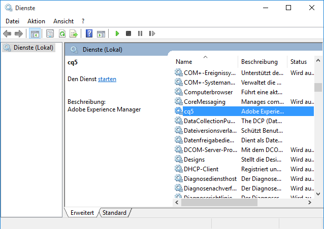
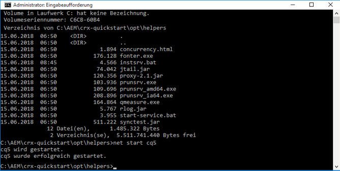
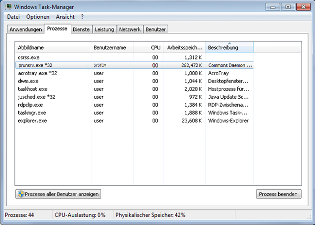
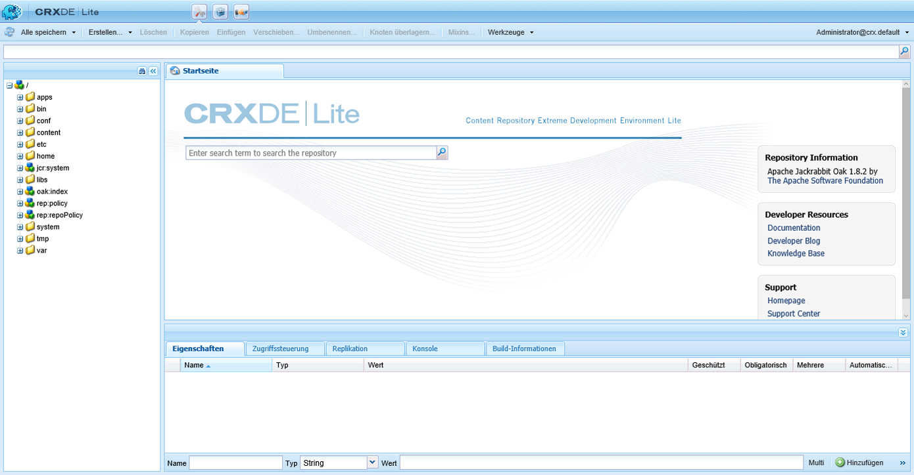

# Benutzerdefinierte eigenständige Installation{#custom-standalone-install}

In diesem Abschnitt wird beschrieben, welche Optionen bei der Installation einer AEM-Standalone-Instanz verfügbar sind. Weitere Informationen zur Auswahl des Backend-Speichertyps nach einer AEM 6-Neuinstallation finden Sie unter [Speicherelemente](/help/sites-deploying/storage-elements-in-aem-6.md).

## Ändern der Port-Nummer durch Umbenennung der Datei {#changing-the-port-number-by-renaming-the-file}

Der Standardport für AEM lautet 4502. Wenn dieser Port nicht verfügbar ist oder bereits verwendet wird, wird Quickstart automatisch so konfiguriert, dass die erste der folgenden verfügbaren Portnummern verwendet wird: 4502, 8080, 8081, 8082, 8083, 8084, 8085, 8888, 9362, `<*random*>`.

Sie können die Portnummer auch festlegen, indem Sie die Quickstart-JAR-Datei umbenennen, sodass der Dateiname die Portnummer enthält. Beispiel: `cq5-publish-p4503.jar` oder `cq5-author-p6754.jar`.

Beachten Sie beim Umbenennen der Quickstart-JAR-Datei die folgenden Regeln:

* Wenn Sie die Datei umbenennen, muss sie mit `cq;` beginnen, wie in `cq5-publish-p4503.jar`.

* Es wird empfohlen, die Port-Nummer *immer* mit dem Präfix „-p“ zu versehen, wie zum Beispiel in „cq5-publish-p4503.jar“ oder „cq5-author-p6754.jar“.

>[!NOTE]
>
>Hiermit stellen Sie sicher, dass Sie sich nicht um die Regeln zur Extraktion der Port-Nummer sorgen müssen:
>
>* Die Port-Nummer muss aus 4 bis 5 Ziffern bestehen.
>* Diese Ziffern müssen nach einem Bindestrich stehen.
>* Sollten sich andere Ziffern im Dateinamen befinden, muss die Portnummer mit dem Präfix `-p` versehen werden.
>* Das Präfix „cq5“ am Anfang des Dateinamens wird ignoriert.
>

>[!NOTE]
>
>Sie können die Portnummer auch ändern, indem Sie die Option `-port` im Startbefehl verwenden.

### Besonderheiten von Java 11 {#java-considerations}

Wenn Sie Oracle Java 11 ausführen (oder generell Java-Versionen höher als 8), müssen beim Starten von AEM zusätzliche Schalter zur Befehlszeile hinzugefügt werden.

* Die folgenden -`-add-opens`-Schalter müssen hinzugefügt werden, um entsprechende Reflection-Zugriffs-Warnmeldungen in `stdout.log` zu verhindern

```shell
--add-opens=java.desktop/com.sun.imageio.plugins.jpeg=ALL-UNNAMED --add-opens=java.base/sun.net.www.protocol.jrt=ALL-UNNAMED --add-opens=java.naming/javax.naming.spi=ALL-UNNAMED --add-opens=java.xml/com.sun.org.apache.xerces.internal.dom=ALL-UNNAMED --add-opens=java.base/java.lang=ALL-UNNAMED --add-opens=java.base/jdk.internal.loader=ALL-UNNAMED --add-opens=java.base/java.net=ALL-UNNAMED -Dnashorn.args=--no-deprecation-warning
```

* Darüber hinaus müssen Sie den Schalter `-XX:+UseParallelGC` verwenden, um potenzielle Leistungsprobleme zu minimieren.

Nachfolgend finden Sie ein Beispiel dafür, wie die zusätzlichen JVM-Parameter aussehen sollten, wenn Sie AEM auf Java 11 starten:

```shell
-XX:+UseParallelGC --add-opens=java.desktop/com.sun.imageio.plugins.jpeg=ALL-UNNAMED --add-opens=java.base/sun.net.www.protocol.jrt=ALL-UNNAMED --add-opens=java.naming/javax.naming.spi=ALL-UNNAMED --add-opens=java.xml/com.sun.org.apache.xerces.internal.dom=ALL-UNNAMED --add-opens=java.base/java.lang=ALL-UNNAMED --add-opens=java.base/jdk.internal.loader=ALL-UNNAMED --add-opens=java.base/java.net=ALL-UNNAMED -Dnashorn.args=--no-deprecation-warning
```

Wenn Sie eine Instanz ausführen, die von AEM 6.3 aktualisiert wurde, stellen Sie sicher, dass die folgende Eigenschaft auf **true** unter `sling.properties` eingestellt ist:

* `felix.bootdelegation.implicit`

## Ausführungsmodi {#run-modes}

Mit **Ausführungsmodi** können Sie Ihre AEM-Instanz auf einen bestimmten Zweck ausrichten, z. B. Author oder Publish, Test, Entwicklung, Intranet usw. Mit diesen Modi können Sie auch die Verwendung von Beispielinhalten steuern. Der Beispielinhalt wird vor der Erstellung des Schnellstarts definiert und kann Pakete, Konfigurationen usw. umfassen: Dies kann vor allem für produktionsbereite Installationen nützlich sein, wenn Sie sich eine schlanke Installation ohne Beispielinhalte wünschen. Weitere Informationen finden Sie unter:

* [Ausführungsmodi](/help/sites-deploying/configure-runmodes.md)

## Hinzufügen eines Dateiinstallationsanbieters {#adding-a-file-install-provider}

Standardmäßig wird der Ordner `crx-quickstart/install` auf Dateien überwacht.
Dieser Ordner existiert nicht, kann jedoch einfach beim Ausführen erstellt werden.

Wenn Bundles, Konfigurationen oder Inhaltspakete in diesem Verzeichnis abgelegt werden, werden diese automatisch registriert und installiert. Wenn sie entfernt werden, erfolgt die Deinstallation.
Dies stellt eine andere Möglichkeit dar, Bundles, Inhaltspakete oder Konfigurationen in das Repository aufzunehmen.

Dies kann für viele Anwendungsfälle besonders interessant sein:

* Während der Entwicklung kann es einfacher sein, etwas in das Dateisystem zu integrieren.
* Wenn etwas schiefgeht, sind die Web-Konsole und das Repository nicht erreichbar. Hiermit können Sie zusätzliche Bundles in diesem Verzeichnis ablegen, die dann installiert werden sollten.
* Der Ordner `crx-quickstart/install` kann erstellt werden, bevor der Schnellstart gestartet wird, und es können zusätzliche Pakete darin abgelegt werden.

>[!NOTE]
>
>Weitere Informationen und Beispiele finden Sie in [So installieren Sie CRX-Pakete automatisch beim Serverstart](https://helpx.adobe.com/de/experience-manager/kb/HowToInstallPackagesUsingRepositoryInstall.html).

## Installieren und Starten von Adobe Experience Manager als Windows-Dienst {#installing-and-starting-adobe-experience-manager-as-a-windows-service}

>[!NOTE]
>
>Führen Sie die folgenden Schritte durch, während Sie als Admin angemeldet sind, oder führen Sie sie über den Kontextmenüeintrag **Als Administrator ausführen** aus.
>
>**Es reicht nicht aus**, als Benutzerin oder Benutzer mit Administratorrechten angemeldet zu sein. Wenn Sie beim Durchführen dieser Schritte nicht als Admin angemeldet sind, erhalten Sie Fehler des Typs **Zugriff verweigert**.

Installieren und Starten von AEM als Windows-Dienst:

1. Öffnen Sie die Datei „crx-quickstart\opt\helpers\instsrv.bat“ in einem Texteditor.
1. Wenn Sie einen Windows-Server mit 64 Bit konfigurieren, ersetzen Sie, abhängig vom verwendeten Betriebssystem, alle Instanzen von „prunsrv“ durch einen der folgenden Befehle:

   * prunsrv_amd64
   * prunsrv_ia64

   Dieser Befehl ruft das passende Skript auf, das den Windows-Service-Daemon in der 64-Bit-Version von Java statt der 32-Bit-Variante startet.

1. Erhöhen Sie den PermGen-JVM-Parameter, um zu verhindern, dass sich der Prozess in mehrere Prozesse aufspaltet. Suchen Sie nach dem Befehl `set jvm_options` und legen Sie den Wert wie folgt fest:

   `set jvm_options=-Xmx1792m`

1. Öffnen Sie die Eingabeaufforderung, ändern Sie das aktuelle Verzeichnis zum Ordner „crx-quickstart/opt/helpers“ der AEM-Installation und geben Sie den folgenden Befehl ein, um den Dienst zu erstellen:

   `instsrv.bat cq5`

   Überprüfen Sie, ob der Dienst erstellt wurde, indem Sie in der Systemsteuerung „Verwaltung“ > „Dienste“ auswählen oder `start services.msc` in der Eingabeaufforderung eingeben. Der Dienst „cq5“ erscheint in der Liste.

1. Starten Sie den Dienst, indem Sie einen der folgenden Schritte ausführen:

   * Klicken Sie unter „Systemsteuerung“ > „Dienste“ auf „cq5“ und anschließend auf „Starten“.

   

   * Geben Sie in der Befehlszeile „net start cq5“ ein.

   

1. Windows gibt an, dass der Dienst ausgeführt wird.  AEM wird gestartet und die ausführbare Datei „prunsrv“ wird im Task-Manager angezeigt. Navigieren Sie in Ihrem Webbrowser zu AEM, beispielsweise `https://localhost:4502`, um mit der Nutzung von AEM zu beginnen.

   

>[!NOTE]
>
>Die Eigenschaftswerte in der Datei „instsrv.bat“ kommen zum Einsatz, wenn der Windows-Dienst erstellt wird. Wenn Sie die Eigenschaftswerte in „instsrv.bat“ bearbeiten, müssen Sie den Dienst deinstallieren und erneut installieren.

>[!NOTE]
>
>Wird AEM als Service installiert, müssen Sie über den Configuration Manager den absoluten Pfad für das Protokollverzeichnis unter `com.adobe.xmp.worker.files.ncomm.XMPFilesNComm` angegeben.

Deinstallieren Sie den Dienst, indem Sie entweder in der Systemsteuerung unter **Dienste** auf **Beenden** klicken oder in einer Befehlszeile zum Ordner navigieren und `instsrv.bat -uninstall cq5` eingeben. Der Dienst wird in der Systemsteuerung unter **Dienste** aus der Liste entfernt oder verschwindet in der Eingabeaufforderung aus der Liste, wenn Sie `net start` eingeben.

## Neudefinieren des Speicherorts für das temporäre Arbeitsverzeichnis {#redefining-the-location-of-the-temporary-work-directory}

Der Standardpfad für den temporären Ordner des Java-Computers ist `/tmp`. AEM greift ebenfalls auf diesen Ordner zurück, etwa beim Erstellen von Paketen.

Wenn Sie den Pfad des temporären Ordners ändern möchten (wenn Sie zum Beispiel ein Verzeichnis mit mehr freiem Speicherplatz benötigen), definieren Sie einen *`<new-tmp-path>`*, indem Sie den JVM-Parameter:

`-Djava.io.tmpdir="/<*new-tmp-path*>"`

entweder zu:

* der Befehlszeile zum Serverstart oder
* dem „CQ_JVM_OPTS“-Umgebungsparameter im „serverctl“- oder „start“-Skript hinzufügen.

## Weitere Optionen sind in der Schnellstartdatei verfügbar. {#further-options-available-from-the-quickstart-file}

Weitere Optionen und Konventionen zur Umbenennung sind in der Schnellstart-Hilfedatei beschrieben, die über die Option „-help“ aufgerufen werden kann. Geben Sie Folgendes ein, um auf die Hilfe zuzugreifen:

* `java -jar cq-quickstart-6.5.0.jar -help`

>[!CAUTION]
>
>Diese Optionen gelten ab der ursprünglichen Version von AEM 6.5 (6.5.0.0). Änderungen in späteren SP-Versionen sind möglich.

```shell
Loading quickstart properties: default
Loading quickstart properties: instance
Setting properties from filename '/Users/Desktop/AEM/cq-quickstart-6.5.0.jar'
--------------------------------------------------------------------------------
Adobe Experience Manager Quickstart (build 20190328)                            
--------------------------------------------------------------------------------
Usage:                                                                          
 Use these options on the Quickstart command line.                              
--------------------------------------------------------------------------------

-help (--help,-h)
         Show this help message                                                 
-quickstart.server.port (-p,-port) <port>
         Set server port number                                                 
-contextpath (-c,-org.apache.felix.http.context_path) <contextpath>
         Set context path                                                       
-debug <port>
         Enable Java Debugging on port number; forces forking                   
-gui 
         Show GUI if running on a terminal                                      
-nobrowser (-quickstart.nobrowser)
         Do not open browser at startup                                         
-unpack
         Unpack installation files only, do not start the server (implies       
         -verbose)                                                              
-v (-verbose)
         Do not redirect stdout/stderr to files and do not close stdin          
-nofork
         Do not fork the JVM, even if not running on a console                  
-fork
         Force forking the JVM if running on a console, using recommended       
         default memory settings for the forked JVM.                            
-forkargs <args> [<args> ...]
         Additional arguments for the forked JVM, defaults to '-Xmx1024m        
         -XX:MaxPermSize=256m '.  Use -- to specify values starting with -,     
         example: '-forkargs -- -server'                                        
-a (--interface) <interface>
         Optional IP address (interface) to bind to                             
-pt <string>
         Process type (main/fork) - do not use directly, used when forking a    
         process                                                                
-r <string> [<string> [<string> [<string> [<string> [<string> [<string> [<string> [<string> [<string>]]]]]]]]]
         Runmode(s) - Use this to define the run mode(s)                        
-b <string>
         Base folder - defines the path under which the quickstart work folder  
         is created                                                             
-low-mem-action <string>
         Low memory action - what to do if memory is insufficient at startup    
-use-control-port
         Start a control port                                                   
-nointeractive
         Start with no interactivity                                            
-ll <level>
         Define launchpad log level (1 = error...4 = debug)                     
-n   
         Do not install shutdown hook                                           
-D<property>=<value>
         Additional framework properties.                                       
-listener-port <listener-port>
         Set listener port number                                               
-x <string>
         Run a Quickstart extension.                                            
  Options for executing Quickstart extensions:
                                                                                
    -xargs <arg> [<arg> ...]
         Construct an arguments list for a Quickstart extension (for example, -xargs -- 
         -arg1 val1 -arg2 val2).                                                
--------------------------------------------------------------------------------
Quickstart filename options                                                     
--------------------------------------------------------------------------------
Usage:                                                                          
 Rename the jar file, including one of the patterns shown below, to set the     
corresponding option. Command-line options have priority on these filename      
patterns.                                                                       
--------------------------------------------------------------------------------

-NNNN
         Include -NNNN.jar or -pNNNN in the renamed jar filename to run on port 
         NNNN, for example: quickstart-8085.jar                                 
-nobrowser
         Include -nobrowser in the renamed jar filename to avoid opening the    
         browser at startup, example: quickstart-nobrowser-8085.jar             
-publish
         Include -publish in the renamed jar filename to run in "publish" mode, 
         example: cq-publish-7502.jar                                           
-dynamicmedia
         Include -dynamicmedia in the renamed jar filename to run in            
         "dynamicmedia" mode, example: quickstart-dynamicmedia-4502.jar         
-dynamicmedia_scene7
         Include -dynamicmedia_scene7 in the renamed jar filename to run in     
         "dynamicmedia_scene7" mode, example:                                   
         quickstart-dynamicmedia_scene7-p4502.jar                               
--------------------------------------------------------------------------------
The license.properties file
--------------------------------------------------------------------------------
  The license.properties file stores licensing information, created from the    
  licensing form displayed on first startup and stored in the folder from where 
  Quickstart is run.                                                            
--------------------------------------------------------------------------------
Log files
--------------------------------------------------------------------------------
  Once Quickstart has been unpacked and started, log files can be found under   
  /Users/aemdocs/CQInstallationKits/AEM-65150-L8/crx-quickstart/logs.           
--------------------------------------------------------------------------------
```

## Installieren von AEM in der Amazon EC2-Umgebung {#installing-aem-in-the-amazon-ec-environment}

Wenn Sie bei der Installation von AEM auf einer Amazon Elastic Compute Cloud (EC2)-Instanz sowohl die Autoren- als auch die Veröffentlichungsinstanz auf der EC2-Instanz installieren, wird die Autoreninstanz korrekt installiert, indem Sie der Anleitung [Installieren von AEM Manager-Instanzen](#installinginstancesofaemmanager) folgen. Die Veröffentlichungsinstanz wird jedoch zur Autoreninstanz.

Treffen Sie die folgenden Vorkehrungen, bevor Sie die Veröffentlichungsinstanz in Ihrer EC2-Umgebung installieren:

1. Entpacken Sie die JAR-Datei für die Veröffentlichungsinstanz, bevor Sie die Instanz erstmalig starten. Verwenden Sie zum Entpacken der Datei den folgenden Befehl:

   ```xml
   java -jar quickstart.jar -unpack
   ```

   >[!NOTE]
   >
   >Wenn Sie den Modus ändern, **nachdem** Sie die Instanz erstmalig gestartet haben, können Sie den Ausführungsmodus nicht ändern.

1. Starten Sie die Instanz, indem Sie Folgendes ausführen:

   ```xml
   java -jar quickstart.jar -r publish
   ```

   >[!CAUTION]
   >
   >Achten Sie darauf, die Instanz erst auszuführen, nachdem diese durch Ausführen des oben genannten Befehls entpackt wurde. Andernfalls wird die Datei „quickstart.properties“ nicht generiert. Ohne diese Datei schlagen zukünftige AEM-Upgrades fehl.

1. Öffnen Sie das **start**-Skript im Ordner **bin** und überprüfen Sie den folgenden Abschnitt:

   ```xml
   # runmode(s)
   if [ -z "$CQ_RUNMODE" ]; then
    CQ_RUNMODE='author'
   fi
   ```

1. Ändern Sie den Ausführungsmodus in **publish** und speichern Sie die Datei.

   ```xml
   # runmode(s)
   if [ -z "$CQ_RUNMODE" ]; then
    CQ_RUNMODE='publish'
   fi
   ```

1. Beenden Sie die Instanz und starten Sie sie neu, indem Sie das **start**-Skript ausführen.

## Überprüfen der Installation {#verifying-the-installation}

Mit den folgenden Links können Sie die Funktionsfähigkeit Ihrer Installation überprüfen (in sämtlichen Beispielen wird davon ausgegangen, dass die Instanz über Port 8080 von „localhost“ ausgeführt wird und dass CRX unter „/crx“ und Launchpad unter „/“ installiert ist):

* `https://localhost:8080/crx/de`
Die CRXDE Lite-Konsole.

* `https://localhost:8080/system/console`
Die Web-Konsole.

## Aktionen nach der Installation {#actions-after-installation}

Obwohl es viele Möglichkeiten gibt, AEM WCM zu konfigurieren, sollten bestimmte Aktionen durchgeführt oder zumindest unmittelbar nach der Installation überprüft werden:

* Orientieren Sie sich bezüglich Maßnahmen zur Gewährleistung der Sicherheit Ihres Systems an der [Sicherheits-Checkliste](/help/sites-administering/security-checklist.md).
* Überprüfen Sie die Liste der Standardbenutzenden und -gruppen, die mit AEM WCM installiert sind. Überprüfen Sie, ob Maßnahmen im Hinblick auf andere Konten getroffen werden sollten. Weitere Informationen finden Sie unter [Sicherheits- und Benutzerverwaltung](/help/sites-administering/security.md).

## Zugreifen auf CRXDE Lite und die Web-Konsole {#accessing-crxde-lite-and-the-web-console}

Nachdem AEM WCM gestartet wurde, können Sie auch auf Folgendes zugreifen:

* [CRXDE Lite](#accessing-crxde-lite) – für den Zugriff auf das Repository und seine Verwaltung
* [Web-Konsole](#accessing-the-web-console) – zum Verwalten oder Konfigurieren der OSGi-Bundles (auch als OSGi-Konsole bezeichnet)

### Zugreifen auf CRXDE Lite {#accessing-crxde-lite}

Öffnen Sie CRXDE Lite, indem Sie **CRXDE Lite** auf dem Willkommensbildschirm auswählen oder Ihren Browser öffnen und zu diesem Ziel navigieren.

```
 https://<<i>host</i>>:<<i>port</i>>/crx/de/index.jsp
```

Beispiel:
`https://localhost:4502/crx/de/index.jsp`



#### Zugreifen auf die Web-Konsole {#accessing-the-web-console}

Greifen Sie auf die Adobe CQ-Webkonsole zu, indem Sie auf dem Willkommensbildschirm **OSGi-Konsole** auswählen oder Ihren Browser öffnen und zu diesem Ziel navigieren.

```
 https://<host>:<port>/system/console
```

Beispiel:
`https://localhost:4502/system/console`
oder für die Seite „Bundles“
`https://localhost:4502/system/console/bundles`


Siehe [OSGi-Konfiguration mit der Web-Konsole](/help/sites-deploying/configuring-osgi.md#osgi-configuration-with-the-web-console) für weitere Informationen.

## Fehlerbehebung {#troubleshooting}

Informationen zur Behebung von Problemen, die möglicherweise bei der Installation auftreten, finden Sie unter:

* [Fehlerbehebung](/help/sites-deploying/troubleshooting.md)

## Deinstallation von Adobe Experience Manager {#uninstalling-adobe-experience-manager}

Da AEM nur in ein einziges Verzeichnis installiert wird, ist kein Deinstallationsprogramm erforderlich. Für eine Deinstallation kann es ausreichen, das gesamte Verzeichnis zu löschen, wobei die Art der Deinstallation von AEM davon abhängt, was Sie bezwecken möchten und welche Art persistenten Speicher Sie verwenden.

Wenn persistenter Speicher in das Installationsverzeichnis eingebettet ist, z. B. in der standardmäßigen TarPM-Installation, werden beim Löschen von Ordnern auch Daten entfernt.

>[!NOTE]
>
>Adobe empfiehlt dringend, Ihr Repository zu sichern, bevor Sie AEM löschen. Wenn Sie das gesamte &lt;CQ-Installationsverzeichnis> löschen, wird dabei auch das Repository gelöscht. Sichern Sie die Repository-Daten vor dem Löschen, indem Sie den Ordner „&lt;cq-installation-directory>/crx-quickstart/repository“ an einen anderen Speicherort verschieben oder kopieren, bevor Sie die anderen Ordner löschen.

Wenn Ihre AEM-Installation externen Speicher verwendet, z. B. einen Datenbank-Server, werden beim Entfernen des Ordners zwar nicht automatisch die Daten entfernt, aber die Speicherkonfiguration, wodurch die Wiederherstellung der JCR-Inhalte schwierig wird.
