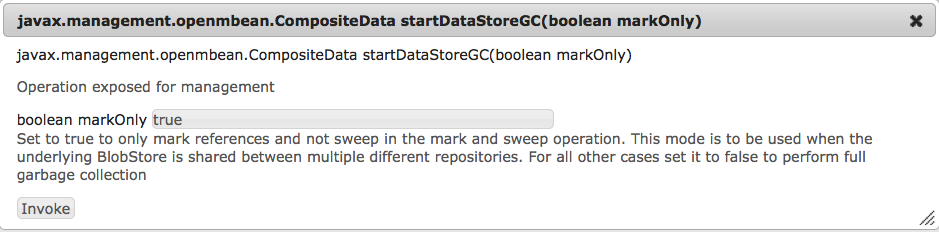

# Konfigurieren von Knotenspeichern und Datenspeichern in AEM 6{#configuring-node-stores-and-data-stores-in-aem}

## Einführung {#introduction}

In Adobe Experience Manager (AEM) können Binärdaten unabhängig von den Inhaltsknoten gespeichert werden. Die Binärdaten werden in einem Datenspeicher abgelegt, Inhaltsknoten in einem Knotenspeicher.

Sowohl Daten- als auch Knotenspeicher können mithilfe der OSGi-Konfiguration eingerichtet werden. Jede OSGi-Konfiguration wird über eine eindeutige Benennung (Persistent Identifier, PID) referenziert.

## Konfigurationsschritte {#configuration-steps}

Um sowohl Knoten- als auch Datenspeicher zu konfigurieren, führen Sie diese Schritte aus:

1. Kopieren Sie die AEM-Schnellstart-JAR-Datei in das Installationsverzeichnis.
1. Erstellen Sie einen Ordner `crx-quickstart/install` im Installationsordner.
1. Konfigurieren Sie zunächst den Knotenspeicher, indem Sie eine Konfigurationsdatei mit dem Namen der zu verwendenden Knotenspeicher-Option im Verzeichnis `crx-quickstart/install` erstellen.

   Der Knotenspeicher „Dokument“ (die Basis der AEM-MongoMK-Implementierung) nutzt etwa die Datei `org.apache.jackrabbit.oak.plugins.document.DocumentNodeStoreService.config`.

1. Bearbeiten Sie die Datei und legen Sie die gewünschten Konfigurationsoptionen fest.
1. Erstellen Sie eine Konfigurationsdatei mit der PID des zu verwendenden Datenspeichers. Bearbeiten Sie die Datei, um die Konfigurationsoptionen festzulegen.

   >[!NOTE]
   >
   >Weitere Informationen zu Konfigurationsoptionen finden Sie unter [Knotenspeicher-Konfigurationen](#node-store-configurations) und [Datenspeicher-Konfigurationen](#data-store-configurations).

1. Starten Sie AEM.

## Knotenspeicher-Konfigurationen {#node-store-configurations}

>[!CAUTION]
>
>Neuere Versionen von Oak nutzen ein neues Benennungsschema und Format für OSGi-Konfigurationsdateien. Das neue Benennungsschema setzt voraus, dass die Konfigurationsdatei mit **.config** benannt wird. Das neue Format erfordert die Eingabe von Werten und ist [hier dokumentiert](https://sling.apache.org/documentation/development/slingstart.html#default-configuration-format).
>
>Wenn Sie von einer älteren Oak-Version aktualisieren, stellen Sie sicher, dass Sie zunächst den Ordner `crx-quickstart/install`/  sichern. Stellen Sie nach dem Upgrade den Inhalt des Ordners in der aktualisierten Installation wieder her und ändern Sie die Erweiterung der Konfigurationsdateien von **.cfg** zu **.config**.
>
>Sollten Sie diesen Artikel zur Vorbereitung auf ein Upgrade von einer **AEM 5.x**-Installation lesen, denken Sie daran, sich zuerst mit der Dokumentation zu [Upgrades](https://docs.adobe.com/content/docs/de/aem/6-0/deploy/upgrade.html) vertraut zu machen.

### Knotenspeicher „Segment“  {#segment-node-store}

Der Knotenspeicher „Segment“ ist die Basis der Adobe-TarMK-Implementierung in AEM 6. Es verwendet die PID `org.apache.jackrabbit.oak.segment.SegmentNodeStoreService` für die Konfiguration.

>[!CAUTION]
>
>Die PID für den Segment-Knotenspeicher wurde in AEM 6.3 von `org.apache.jackrabbit.oak.plugins.segment.SegmentNodeStoreService in previous versions` von AEM 6 in `org.apache.jackrabbit.oak.segment.SegmentNodeStoreService` geändert. Stellen Sie sicher, dass Sie die erforderlichen Konfigurationsanpassungen vornehmen, um diese Änderung widerzuspiegeln.

Sie können die folgenden Optionen konfigurieren:

* `repository.home`: Pfad zum Repository-Stammverzeichnis, in dem Repository-bezogene Daten gespeichert werden. Standardmäßig werden Segmentdateien im Verzeichnis `crx-quickstart/segmentstore` gespeichert.

* `tarmk.size` : Maximale Größe eines Segments in MB. Der standardmäßige Maximalwert lautet 256 MB.
* `customBlobStore`: Boolescher Wert, der angibt, dass ein benutzerdefinierter Datenspeicher verwendet wird. Der Standardwert ist true für AEM 6.3 und höher. Vor AEM 6.3 war die Standardeinstellung „false“.

Die folgende Beispieldatei ist `org.apache.jackrabbit.oak.segment.SegmentNodeStoreService.config`:

```shell
#Path to repo
repository.home="crx-quickstart/repository"

#Max segment size
tarmk.size=I"256"

#Custom data store
customBlobStore=B"true"
```

#### Knotenspeicher „Dokument“{#document-node-store}

Der Knotenspeicher „Dokument“ ist die Basis der AEM-MongoMK-Implementierung. Es verwendet die `org.apache.jackrabbit.oak.plugins.document.DocumentNodeStoreService`* *PID. Folgende Konfigurationsoptionen sind verfügbar:

* `mongouri`: Die für die Verbindung zur Mongo-Datenbank erforderliche [MongoURI](https://docs.mongodb.org/manual/reference/connection-string/). Standard: `mongodb://localhost:27017`

* `db` : Name der Mongo-Datenbank. Die Standardeinstellung ist **Oak** ``. However, new AEM 6 installations use **aem-author** ``als Standarddatenbankname.

* `cache`: Cache-Größe in MB. Dieser Wert verteilt sich auf die verschiedenen in DocumentNodeStore verwendeten Caches. Standard: `256`

* `changesSize`: Größe (in MB) der begrenzten Sammlung, die in Mongo zum Zwischenspeichern unterschiedlicher Ausgaben verwendet wird. Standard: `256`

* `customBlobStore`: Boolescher Wert, der angibt, dass ein benutzerdefinierter Datenspeicher verwendet wird. Der Standardwert lautet `false`.

Die folgende Beispieldatei ist `org.apache.jackrabbit.oak.plugins.document.DocumentNodeStoreService.config`:

```shell
#Mongo server details
mongouri="mongodb://localhost:27017"

#Name of Mongo database to use
db="aem-author"

#Store binaries in custom BlobStore
customBlobStore=B"false"
```

## Datenspeicher-Konfigurationen {#data-store-configurations}

Muss eine große Anzahl von Binärdateien verarbeitet werden, wird empfohlen, statt der Standard-Knotenspeicher einen externen Datenspeicher zu verwenden, um die Leistung zu maximieren.

Wenn für Ihr Projekt z. B. eine große Anzahl von Medien-Assets erforderlich ist, wird ein schnellerer Zugriff ermöglicht, wenn Sie die Assets im Datei- oder S3-Datenspeicher und nicht direkt in einer MongoDB speichern.

Der Dateidatenspeicher ist leistungsstärker als eine MongoDB und Mongo-Sicherungen und -Wiederherstellungen sind bei einer Vielzahl von Assets ebenfalls langsamer.

Die verschiedenen Datenspeicher und Konfigurationen werden nachfolgend beschrieben.

>[!NOTE]
>
>Um benutzerdefinierte Datenspeicher verwenden zu können, müssen Sie `customBlobStore` in der entsprechenden Knotenspeicher-Konfigurationsdatei (`true`Knotenspeicher „Segment“ oder [Knotenspeicher „Dokument“](/help/sites-deploying/data-store-config.md#segment-node-store)) auf [](/help/sites-deploying/data-store-config.md#document-node-store) einstellen.

### Dateidatenspeicher {#file-data-store}

Hierbei handelt es sich um die [FileDataStore](https://jackrabbit.apache.org/api/2.8/org/apache/jackrabbit/core/data/FileDataStore.html)-Implementierung in Jackrabbit 2, die es ermöglicht, dass Binärdaten wie normale Dateien im Dateisystem gespeichert werden. Es verwendet die PID `org.apache.jackrabbit.oak.plugins.blob.datastore.FileDataStore`.

Die folgenden Konfigurationsoptionen sind verfügbar:

* `repository.home`: Pfad zum Repository-Stammverzeichnis, in dem diverse Repository-bezogene Daten gespeichert werden. Binäre Dateien werden standardmäßig im Ordner `crx-quickstart/repository/datastore` gespeichert

* `path`: Pfad zum Verzeichnis, unter dem Dateien gespeichert werden. Sofern angegeben, hat dieser Wert Vorrang gegenüber `repository.home`.

* `minRecordLength`: Mindestgröße in Byte einer im Datenspeicher abgelegten Datei. Binärinhalte, die unterhalb dieses Werts liegen, werden als Inline-Elemente dargestellt.

>[!NOTE]
>
>Wenn freigegebene Dateidatenspeicher mit einem NAS gespeichert werden, setzen Sie ausschließlich hochperformante Geräte ein, um Leistungsprobleme zu vermeiden.

## Amazon S3-Datenspeicher  {#amazon-s-data-store}

AEM kann so konfiguriert werden, dass Daten in Amazon Simple Storage Service (S3) gespeichert werden. Es verwendet die PID `org.apache.jackrabbit.oak.plugins.blob.datastore.S3DataStore.config` für die Konfiguration.

Zur Aktivierung der S3-Datenspeicherfunktionalität muss ein Feature Pack mit dem S3-Datenspeicher-Connector heruntergeladen und installiert werden. Gehen Sie zum [Adobe-Repository](https://repo.adobe.com/nexus/content/groups/public/com/adobe/granite/com.adobe.granite.oak.s3connector/) und laden Sie die neueste Version der 1.10.x-Versionen des Feature Packs herunter (z. B. com.adobe.granite.oak.s3connector-1.10.0.zip). Außerdem müssen Sie das neueste AEM Service Pack herunterladen und installieren, wie auf der Seite [AEM 6.5 Versionshinweise](/help/release-notes/sp-release-notes.md) aufgeführt.

>[!NOTE]
>
>Bei Verwendung von AEM  mit TarMK werden die Binärdateien standardmäßig im `FileDataStore` gespeichert. Um TarMK mit dem S3-Datenspeicher zu verwenden, müssen Sie AEM mit dem Ausführungsmodus `crx3tar-nofds` Beginn ausführen. Beispiel:

```shell
java -jar <aem-jar-file>.jar -r crx3tar-nofds
```

Nach dem Download können Sie den S3-Connector wie folgt installieren und konfigurieren:

1. Extrahieren Sie den Inhalt der ZIP-Datei des Feature Packs in einen temporären Ordner.

1. Gehen Sie zum temporären Ordner und navigieren Sie zu folgendem Ort:

   ```xml
   jcr_root/libs/system/install
   ```

   Kopieren Sie den gesamten Inhalt von oben nach `<aem-install>/crx-quickstart/install.`

1. Wenn AEM bereits für die Verwendung mit der Tar- oder MongoDB-Datenspeicherung konfiguriert ist, entfernen Sie alle vorhandenen Konfigurationsdateien aus dem Ordner *****/*crx-quickstart*/*install*, bevor Sie fortfahren. Die folgenden Dateien müssen entfernt werden:

   * `For MongoMK: org.apache.jackrabbit.oak.plugins.document.DocumentNodeStoreService.config`
   * `For TarMK: org.apache.jackrabbit.oak.segment.SegmentNodeStoreService.config`

1. Kehren Sie zum temporären Verzeichnis mit dem extrahierten Feature Pack zurück und kopieren Sie den Inhalt des folgenden Ordners:

   * `jcr_root/libs/system/config`

   in

   * `<aem-install>/crx-quickstart/install`

   Stellen Sie sicher, dass Sie nur die für die aktuelle Konfiguration benötigten Konfigurationsdateien kopieren. Kopieren Sie sowohl bei einem dedizierten Datenspeicher als auch bei einem freigegebenen Datenspeicher die Datei `org.apache.jackrabbit.oak.plugins.blob.datastore.S3DataStore.config`.

   >[!NOTE]
   >
   >Führen Sie bei einer Clustereinrichtung die oben genannten Schritte nach und nach für alle Knoten des Clusters durch. Stellen Sie weiterhin sicher, dieselben S3-Einstellungen für alle Knoten zu verwenden.

1. Bearbeiten Sie die Datei und fügen Sie die für Ihre Einrichtung erforderlichen Konfigurationsoptionen hinzu.
1. Starten Sie AEM.

### Aktualisieren auf eine neue Version des 1.10.x S3-Connectors {#upgrading-to-a-new-version-of-the-s-connector}

Wenn Sie auf eine neue Version des 1.10.x S3-Connectors aktualisieren müssen (z. B. von 1.10.0 auf 1.10.4), führen Sie die folgenden Schritte aus:

1. Halten Sie die AEM-Instanz an.

1. Navigieren Sie zu `<aem-install>/crx-quickstart/install/15` im AEM Installationsordner und erstellen Sie eine Sicherung des Inhalts.
1. Löschen Sie nach der Sicherung die alte Version des S3 Connector und dessen Abhängigkeiten, indem Sie alle JAR-Dateien im Ordner `<aem-install>/crx-quickstart/install/15` löschen. Beispiel:

   * **oak-blob-cloud-1.6.1.jar**
   * **aws-java-sdk-osgi-1.10.76.jar**

   >[!NOTE]
   >
   >Die oben dargestellten Dateinamen dienen nur zur Veranschaulichung.

1. Laden Sie die neueste Version des Feature Packs 1.8.x aus dem [Adobe-Repository](https://repo.adobe.com/nexus/content/groups/public/com/adobe/granite/com.adobe.granite.oak.s3connector/) herunter.
1. Dekomprimieren Sie den Inhalt in einen separaten Ordner und navigieren Sie dann zu `jcr_root/libs/system/install/15`.
1. Kopieren Sie die JAR-Dateien nach **&lt;aem-install>**/crx-quickstart/install/15 im AEM-Installationsverzeichnis.
1. Starten Sie AEM und überprüfen Sie die Funktionsweise des Connectors.

Sie können die Konfigurationsdatei mit den folgenden Optionen verwenden:

* accessKey: Der AWS-Zugriffsschlüssel.
* secretKey: Der geheime AWS-Zugriffsschlüssel. **Hinweis:** Alternativ kann  [IAM-](https://docs.aws.amazon.com/sdk-for-java/v1/developer-guide/java-dg-roles.html) Rollen für die Authentifizierung verwendet werden. Wenn Sie IAM-Rollen verwenden, müssen Sie die Variablen `accessKey` und `secretKey` nicht mehr angeben.

* s3Bucket: Der Eimername.
* s3Region: Der Eimerbereich.
* path: Der Pfad des Datenspeichers. Die Standardeinstellung ist **&lt;AEM-Installationsordner>/repository/datastore**
* minRecordLength: Die Mindestgröße eines Objekts, das im Datenspeicher gespeichert werden soll. Der Standardwert ist **16KB.**
* maxCachedBinarySize: Binärdateien, deren Größe kleiner oder gleich dieser Größe ist, werden im Arbeitsspeichercache gespeichert. Die Größe wird in Byte angegeben. Die Standardeinstellung ist **17408 **(17 KB).

* cacheSize: Die Größe des Zwischenspeichers. Der Wert wird in Byte angegeben. Die Standardeinstellung ist **64 GB**.
* geheim: Nur bei Verwendung der binaromatischen Replizierung für die Einrichtung eines gemeinsamen Datenspeichers zu verwenden.
* stagingSplitPercentage: Der Prozentsatz der Cachegröße, die für die Staging-Analyse asynchroner Uploads konfiguriert wurde. Der Standardwert lautet **10**.
* uploadThreads: Die Anzahl der Uploads von Threads, die für asynchrone Uploads verwendet werden. Der Standardwert lautet **10**.
* stagingPurgeInterval: Das Intervall in Sekunden zum Bereinigen der fertigen Uploads aus dem Staging-Cache. Der Standardwert ist **300** Sekunden (5 Minuten).
* stagingRetryInterval: Das Wiederholungsintervall in Sekunden für fehlgeschlagene Uploads. Der Standardwert ist **600** Sekunden (10 Minuten).

### Bucket-Regionsoptionen {#bucket-region-options}

<table>
 <tbody>
  <tr>
   <td>US Standard</td>
   <td><code>us-standard</code></td>
  </tr>
  <tr>
   <td>US-Westen</td>
   <td><code>us-west-2</code></td>
  </tr>
  <tr>
   <td>US West (Nordkalifornien)</td>
   <td><code>us-west-1</code></td>
  </tr>
  <tr>
   <td>EU (Irland)<br /> </td>
   <td><code>EU</code></td>
  </tr>
  <tr>
   <td>Asien/Pazifik (Singapur)<br /> </td>
   <td><code>ap-southeast-1</code></td>
  </tr>
  <tr>
   <td>Asien/Pazifik (Sydney)<br /> </td>
   <td><code>ap-southeast-2</code></td>
  </tr>
  <tr>
   <td>Asien/Pazifik (Tokio)</td>
   <td><code>ap-northeast-1</code></td>
  </tr>
  <tr>
   <td>Südamerika (Sao Paolo)<br /> </td>
   <td><code>sa-east-1</code></td>
  </tr>
 </tbody>
</table>

**Datenspeicher-Caching**

>[!NOTE]
>
>Die DataStore-Implementierungen von `S3DataStore`, `CachingFileDataStore` und `AzureDataStore` unterstützen die Zwischenspeicherung des lokalen Dateisystems. Die Implementierung von `CachingFileDataStore` ist nützlich, wenn sich der DataStore auf dem NFS (Network File System) befindet.


Beim Upgrade von einer älteren Cache-Implementierung (vor Oak 1.6) gibt es einen strukturellen Unterschied in Bezug auf das Cacheverzeichnis des lokalen Dateisystems. In der alten Cachestruktur wurden heruntergeladene und hochgeladene Dateien direkt unter dem Cachepfad abgelegt. In der neuen Struktur werden Downloads und Uploads voneinander getrennt und in zwei Verzeichnissen namens `upload` und `download` unter dem Cachepfad gespeichert. Der Upgradeprozess sollte nahtlos sein und etwaige ausstehende Uploads sollten zum Hochladen geplant werden; etwaige zuvor heruntergeladene Dateien werden bei Initialisierung im Cache abgelegt.

Sie können den Cache auch offline mit dem Befehl `datastorecacheupgrade` von oak-run aktualisieren. Weitere Einzelheiten zum Ausführen des Befehls finden Sie in der [Readme](https://svn.apache.org/repos/asf/jackrabbit/oak/trunk/oak-run/README.md)-Datei für das oak-run-Modul.

Der Cache hat eine Größenbeschränkung und kann mithilfe des Parameters cacheSize konfiguriert werden.

**Downloads**

Der lokale Cache wird auf die Datei-/Blobanforderung geprüft, bevor ein Zugriff auf den Datenspeicher erfolgt. Wenn der Cache das konfigurierte Limit (siehe `cacheSize`-Parameter) überschreitet, während dem Cache eine Datei hinzugefügt wird, werden einige der Dateien entfernt, um Speicher freizugeben.

**Asynchrone Uploads**

Der Cache unterstützt asynchrone Uploads in den Datenspeicher. Die Dateien werden lokal im Cache (im Dateisystem) bereitgestellt und ein asynchroner Auftrag mit dem Upload der Datei beginnt. Die Anzahl der asynchronen Uploads ist durch die Größe des Staging-Cache begrenzt. Die Größe des Staging-Cache wird mithilfe des `stagingSplitPercentage`-Parameters konfiguriert. Dieser Parameter definiert den Prozentsatz der Cachegröße, der für den Staging-Cache verwendet werden soll. Außerdem wird der Prozentsatz des für Downloads verfügbaren Cache wie folgt berechnet: **(100 - `stagingSplitPercentage`) *`cacheSize`**.

Asynchrone Uploads verlaufen in mehreren Threads und die Anzahl der Threads wird mithilfe des `uploadThreads`-Parameters konfiguriert.

Die Dateien werden nach Abschluss der Uploads in den Haupt-Downloadcache verschoben. Wenn die Größe des Staging-Cache das Limit überschreitet, werden die Dateien synchron in den Datenspeicher hochgeladen, bis die vorherigen asynchronen Uploads abgeschlossen sind und wieder Speicherplatz im Staging-Cache verfügbar ist. Die hochgeladenen Dateien werden durch einen periodischen Auftrag, dessen Intervall durch den Parameter `stagingPurgeInterval` konfiguriert wird, aus dem Staging-Bereich entfernt.

Fehlgeschlagene Uploads (etwa aufgrund von Netzwerkstörungen) werden in eine Warteschlange gestellt und regelmäßig wiederholt. Das Wiederholungsintervall wird mithilfe von `stagingRetryInterval parameter` konfiguriert.

#### Konfigurieren von nicht binären Replikationen mit Amazon S3 {#configuring-binaryless-replication-with-amazon-s}

Um nicht binäre Replikationen mit S3 zu konfigurieren, sind die folgenden Schritte erforderlich:

1. Installieren Sie die Autor- und Veröffentlichungsinstanzen und stellen Sie sicher, dass diese ordnungsgemäß gestartet werden.
1. Wechseln Sie zu den Einstellungen des Replizierungsagenten, indem Sie eine Seite zu *https://localhost:4502/etc/replication/agents.author/publish.html* öffnen.
1. Wählen Sie im Abschnitt **Einstellungen** die Schaltfläche **Bearbeiten**.
1. Ändern Sie die Option für den **Serialisierungs** typ in **Nicht binär**.

1. hinzufügen Sie den Parameter &quot; `binaryless`= `true`&quot;im Transport-URI. Nach dieser Änderung sollte der URI ungefähr wie folgt aussehen:

   *https://localhost:4503/bin/receive?sling:authRequestLogin=1&amp;binaryless=true*

1. Starten Sie alle Autor- und Veröffentlichungsinstanzen neu, um die Änderungen zu übernehmen.

#### Erstellen von Clustern mit S3 und MongoDB  {#creating-a-cluster-using-s-and-mongodb}

1. Entpacken Sie die CQ-Schnellstartdatei mithilfe des folgenden Befehls:

   `java -jar cq-quickstart.jar -unpack`

1. Nachdem AEM entpackt wurde, erstellen Sie einen Ordner im Installationsverzeichnis *crx-quickstart*/*install*.

1. Erstellen Sie diese beiden Dateien im Ordner `crx-quickstart`:

   * *org.apache.jackrabbit.oak.plugins.document.DocumentNodeStoreService*.*config*

   * *org.apache.jackrabbit.oak.plugins.blob.datastore.S3DataStore*.*config*

   Nachdem die Dateien erstellt wurden, fügen Sie die Konfigurationsoptionen nach Bedarf hinzu.

1. Installieren Sie die beiden für den S3-Datenspeicher erforderlichen Bundles, wie oben erläutert.
1. Stellen Sie sicher, dass MongoDB installiert ist und eine `mongod`-Instanz ausgeführt wird.
1. Starten Sie AEM mit dem folgenden Befehl:

   `java -Xmx1024m -XX:MaxPermSize=256M -jar cq-quickstart.jar -r crx3,crx3mongo`

1. Wiederholen Sie die Schritte 1 bis 4 für die zweite AEM-Instanz.
1. Starten Sie die zweite AEM-Instanz.

#### Konfigurieren von freigegebenen Datenspeichern  {#configuring-a-shared-data-store}

1. Erstellen Sie zunächst die Datenspeicher-Konfigurationsdatei in jeder Instanz, die zum Freigeben des Datenspeichers erforderlich ist:

   * Wenn Sie ein `FileDataStore` verwenden, erstellen Sie eine Datei mit dem Namen `org.apache.jackrabbit.oak.plugins.blob.datastore.FileDataStore.config` und legen Sie sie im Ordner `<aem-install>/crx-quickstart/install` ab.

   * Wenn Sie S3 als Datenspeicher verwenden, erstellen Sie eine Datei mit dem Namen `rg.apache.jackrabbit.oak.plugins.blob.datastore.S3DataStore.config` im Ordner `<aem-install>/crx-quickstart/install` wie oben beschrieben.

1. Ändern Sie die Datenspeicher-Konfigurationsdateien in jeder Instanz so, dass auf denselben Datenspeicher verwiesen wird. Weitere Informationen finden Sie in [diesem Artikel](/help/sites-deploying/data-store-config.md#data-store-configurations).
1. Wenn die Instanz von einem vorhandenen Server geklont wurde, müssen Sie die `clusterId` der neuen Instanz mit dem neuesten oak-run-Tool entfernen, während das Repository offline ist. Hierzu muss der folgende Befehl ausgeführt werden:

   ```xml
   java -jar oak-run.jar resetclusterid < repository path | Mongo URI >
   ```

   >[!NOTE]
   >
   >Wenn ein Knotenspeicher „Segment“ konfiguriert ist, muss der Repositorypfad angegeben werden. Standardmäßig ist der Pfad `<aem-install-folder>/crx-quickstart/repository/segmentstore.` Wenn ein Dokument-Knotenspeicher konfiguriert ist, können Sie einen [Mongo-Verbindungszeichenfolgen-URI](https://docs.mongodb.org/manual/reference/connection-string/) verwenden.

   >[!NOTE]
   >
   >Das oak-run-Tool kann über diese Adresse heruntergeladen werden:
   >
   >
   >[https://mvnrepository.com/artifact/org.apache.jackrabbit/oak-run/](https://mvnrepository.com/artifact/org.apache.jackrabbit/oak-run/)
   >
   >
   >Denken Sie daran, dass abhängig von der Oak-Version in der AEM-Installation verschiedene Toolversionen verwenden werden müssen. Prüfen Sie die nachfolgend aufgeführten Versionsanforderungen, bevor Sie das Tool nutzen:
   >
   >
   >
   >    * Setzen Sie für die Oak-Versionen **1.2.x** das oak-run-Tool der Version **1.2.12 oder höher** ein.
   >    * Für **neuere** Oak-Versionen verwenden Sie die oak-run-Version, die dem Oak-Core der AEM-Installation entspricht.


1. Überprüfen Sie schließlich die Konfiguration. Hierzu müssen Sie nach einer eindeutigen Datei suchen, die dem Datenspeicher von jedem Repository, das denselben Datenspeicher nutzt, hinzugefügt wird. Das Format der Dateien ist `repository-[UUID]`, wobei die UUID eine eindeutige Kennung jedes einzelnen Repositorys ist.

   Daher sollte in einer ordnungsgemäßen Konfiguration die Anzahl an eindeutigen Dateien und Repositorys mit gemeinsam genutztem Datenspeicher übereinstimmen.

   Die Dateien werden je nach Datenspeicher an unterschiedlichen Speicherorten abgelegt:

   * Für den `FileDataStore` werden die Dateien unter dem Stammverzeichnis des Datenspeicherordners erstellt.
   * Für das `S3DataStore` werden die Dateien im konfigurierten S3-Behälter unter dem Ordner `META` erstellt.

## Azure-Datenspeicher {#azure-data-store}

AEM kann so konfiguriert werden, dass Daten im Azure-Speicherdienst von Microsoft gespeichert werden. Es verwendet die PID `org.apache.jackrabbit.oak.plugins.blob.datastore.AzureDataStore.config` für die Konfiguration.

Zur Aktivierung der Azure-Datenspeicherfunktionalität muss ein Feature Pack mit dem Azure-Datenspeicher-Connector heruntergeladen und installiert werden. Wechseln Sie zum [Adobe-Repository](https://repo.adobe.com/nexus/content/groups/public/com/adobe/granite/com.adobe.granite.oak.azureblobconnector/) und laden Sie die neueste Version aus den 1.6.x-Versionen des Feature Packs herunter (z. B. com.adobe.granite.oak.azureblobconnector-1.6.3.zip).

>[!NOTE]
>
>Bei Verwendung von AEM  mit TarMK werden die Binärdateien standardmäßig im FileDataStore gespeichert. Um TarMK mit dem Azurblauen DataStore zu verwenden, müssen Sie AEM mit dem Ausführungsmodus `crx3tar-nofds` Beginn ausführen. Beispiel:

```shell
java -jar <aem-jar-file>.jar -r crx3tar-nofds
```

Nach dem Download können Sie den Azure-Connector wie folgt installieren und konfigurieren:

1. Extrahieren Sie den Inhalt der ZIP-Datei des Feature Packs in einen temporären Ordner.

1. Wechseln Sie zum temporären Ordner und kopieren Sie den Inhalt von `jcr_root/libs/system/install` in den Ordner `<aem-install>crx-quickstart/install`.
1. Wenn AEM bereits für die Verwendung mit der Tar- oder MongoDB-Datenspeicherung konfiguriert ist, entfernen Sie alle vorhandenen Konfigurationsdateien aus dem Ordner `/crx-quickstart/install`, bevor Sie fortfahren. Die folgenden Dateien müssen entfernt werden:

   Für MongoMK:

   `org.apache.jackrabbit.oak.plugins.document.DocumentNodeStoreService.config`

   Für TarMK:

   `org.apache.jackrabbit.oak.segment.SegmentNodeStoreService.config`

1. Kehren Sie zum temporären Speicherort zurück, an dem das Feature Pack extrahiert wurde, und kopieren Sie den Inhalt von `jcr_root/libs/system/config` in den Ordner `<aem-install>/crx-quickstart/install`.
1. Bearbeiten Sie die Konfigurationsdatei und fügen Sie die für Ihre Einrichtung erforderlichen Konfigurationsoptionen hinzu.
1. Starten Sie AEM.

Sie können die Konfigurationsdatei mit den folgenden Optionen verwenden:

* azureSas=&quot;&quot;: In Version 1.6.3 des Connectors wurde die Unterstützung für die &quot;Blue Shared Access Signature&quot;(SAS) hinzugefügt. **Wenn in der Konfigurationsdatei sowohl SAS als auch Speicheranmeldeinformationen vorhanden sind, hat SAS Priorität.** Weitere Informationen zu SAS finden Sie in der [offiziellen Dokumentation](https://docs.microsoft.com/en-us/azure/storage/common/storage-dotnet-shared-access-signature-part-1). Stellen Sie sicher, dass das Zeichen &#39;=&#39; wie &#39;\=&#39; mit Escape-Zeichen versehen ist.

* azureBlobEndpoint=&quot;&quot;: Der Azure-Blob-Endpunkt, Beispiel: https://&lt;Datenspeicherung-Account>.blob.core.windows.net.
* accessKey=&quot;&quot;: Der Speicherkontoname. Weitere Informationen zu den von Microsoft Azure-Anmeldeinformationen für die Authentifizierung finden Sie in der [offiziellen Dokumentation](https://azure.microsoft.com/en-us/documentation/articles/storage-create-storage-account).

* secretKey=&quot;&quot;: Der Speicherzugriffsschlüssel. Stellen Sie sicher, dass das Zeichen &#39;=&#39; wie &#39;\=&#39; mit Escape-Zeichen versehen ist.
* container=&quot;&quot;: Der Name des Blob-Speichercontainers von Microsoft Azure. Der Container stellt eine Gruppierung mehrerer Blobs dar. Zusätzliche Details finden Sie in der [offiziellen Dokumentation](https://msdn.microsoft.com/en-us/library/dd135715.aspx).
* maxConnections=&quot;&quot;: Die gleichzeitige Anzahl gleichzeitiger Anforderungen pro Vorgang. Der Standardwert ist 1.
* maxErrorRetry=&quot;&quot;: Anzahl der weitere Zustellversuche pro Anforderung. Der Standardwert ist 3. 
* socketTimeout=&quot;&quot;: Das Zeitüberschreitungsintervall in Millisekunden, das für die Anforderung verwendet wird. Der Standardwert ist 5 Minuten.

Neben den oben aufgeführten Einstellungen können auch die folgenden Einstellungen konfiguriert werden:

* path: Der Pfad des Datenspeichers. Standard: `<aem-install>/repository/datastore.`
* RecordLength: Die Mindestgröße eines Objekts, das im Datenspeicher gespeichert werden soll. Der Standardwert ist 16 KB.
* maxCachedBinarySize: Binärdateien, deren Größe kleiner oder gleich dieser Größe ist, werden im Arbeitsspeichercache gespeichert. Die Größe wird in Byte angegeben. Der Standardwert ist 17408 (17 KB).
* cacheSize: Die Größe des Zwischenspeichers. Der Wert wird in Byte angegeben. Der Standardwert ist 64 GB.
* geheim: Nur bei Verwendung der binaromatischen Replizierung für die Einrichtung eines gemeinsamen Datenspeichers zu verwenden.
* stagingSplitPercentage: Der Prozentsatz der Cachegröße, die für die Staging-Analyse asynchroner Uploads konfiguriert wurde. Der Standardwert ist 10. 
* uploadThreads: Die Anzahl der Uploads von Threads, die für asynchrone Uploads verwendet werden. Der Standardwert ist 10. 
* stagingPurgeInterval: Das Intervall in Sekunden zum Bereinigen der fertigen Uploads aus dem Staging-Cache. Der Standardwert ist 300 Sekunden (5 Minuten).
* stagingRetryInterval: Das Wiederholungsintervall in Sekunden für fehlgeschlagene Uploads. Der Standardwert ist 600 Sekunden (10 Minuten).

>[!NOTE]
>
>Alle Einstellungen sollten zwischen Anführungszeichen gesetzt werden, zum Beispiel:

```shell
accessKey="ASDASDERFAERAER"
secretKey="28932hfjlkwdo8fufsdfas\=\="
```

## Automatische Datenspeicherbereinigung {#data-store-garbage-collection}

Im Rahmen der automatischen Datenspeicherbereinigung werden nicht verwendete Dateien aus dem Datenspeicher entfernt. Dabei wird wertvoller Festplattenspeicher freigegeben.

Sie können die automatische Datenspeicherbereinigung wie folgt ausführen:

1. Wechseln Sie zur JMX-Konsole unter *https://&lt;server-address:port>/system/console/jmx*
1. Suchen Sie nach **RepositoryManagement.** Wenn Sie das MBean „Repository Manager“ gefunden haben, klicken Sie darauf, um die verfügbaren Optionen aufzurufen.
1. Führen Sie einen Bildlauf bis zum Ende der Seite durch und klicken Sie auf den Link **startDataStoreGC(boolean markOnly)**.
1. Geben Sie im folgenden Dialogfeld für den Parameter `false` den Wert `markOnly` ein und klicken Sie auf **Invoke**:

   

   >[!NOTE]
   >
   >Der Parameter `markOnly` gibt an, ob die Sweeping-Phase der automatischen Bereinigung ausgeführt wird oder nicht.

## Automatische Bereinigung für freigegebene Datenspeicher {#data-store-garbage-collection-for-a-shared-data-store}

>[!NOTE]
>
>Wenn Sie die automatische Bereinigung für einen eingerichteten Cluster- oder freigegebenen Speicher (mit Mongo oder Segment-Tar) durchführen, werden im Protokoll möglicherweise Warnungen angezeigt, wonach bestimmte Blob-IDs nicht gelöscht werden können. Dies geschieht, weil Blob-IDs, die in einer vorherigen Garbage Collection gelöscht wurden, von anderen Clustern oder freigegebenen Knoten, die keine Informationen über die ID-Löschungen haben, fälschlicherweise erneut referenziert werden. Daher wird bei der automatischen Bereinigung eine Warnung protokolliert, wenn versucht wird, eine bereits im vorherigen Durchgang gelöschte ID zu entfernen. Dieses Verhalten wirkt sich weder auf die Leistung noch auf die Funktionalität aus.

In neueren AEM-Versionen kann die automatische Datenspeicherbereinigung auch in einem Datenspeicher durchgeführt werden, der von mehreren Repositorys genutzt wird. Für eine automatische Datenspeicherbereinigung in einem freigegebenen Datenspeicher führen Sie die folgenden Schritte aus:

1. Stellen Sie sicher, dass etwaige für die automatische Datenspeicherbereinigung konfigurierte Wartungsaufgaben auf allen Repositoryinstanzen, die denselben Datenspeicher nutzen, deaktiviert sind.
1. Führen Sie die unter [Automatische Bereinigung von Binärdaten](/help/sites-deploying/data-store-config.md#data-store-garbage-collection) genannten Schritte einzeln für **alle** Repositoryinstanzen aus, die denselben Datenspeicher nutzen. Achten Sie jedoch darauf, den Wert `true` für den Parameter `markOnly` einzugeben, bevor Sie auf die Schaltfläche „Invoke“ klicken:

   

1. Führen Sie nach Abschluss des oben beschriebenen Verfahrens für alle Instanzen die automatische Datenspeicherbereinigung über eine **beliebige** Instanz aus:

   1. Rufen Sie die JMX-Konsole auf und wählen Sie das MBean „Repository Manager“ aus.
   1. Klicken Sie auf den Link **Click startDataStoreGC(boolean markOnly)**.
   1. Geben Sie im folgenden Dialogfeld `false` erneut für den Parameter `markOnly` ein.

   Hierdurch werden alle in der zuvor verwendeten Markierungsphase gefundenen Dateien ausgeblendet und die restlichen nicht verwendeten Dateien werden aus dem Datenspeicher gelöscht.

