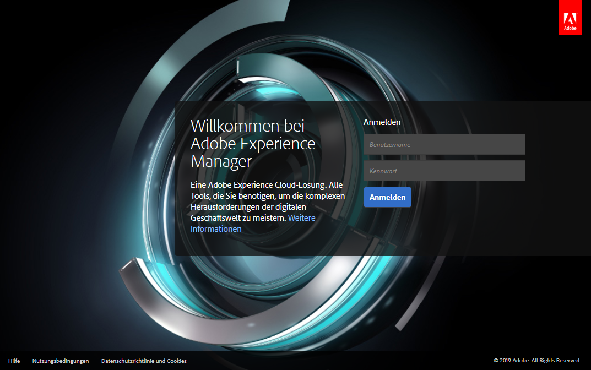

# Bereitstellen und Verwalten {#deploying-and-maintaining}

Auf dieser Seite finden Sie:

* [Grundlegende Konzepte](#basic-concepts)

   * [Was ist AEM?](#what-is-aem)
   * [Typische Bereitstellungen](#typical-deployment-scenarios)

      * [On-Premise](#on-premise)
      * [Managed Services mit Cloud Manager](#managed-services-using-cloud-manager)

* [Erste Schritte](#getting-started)

   * [Voraussetzungen](#prerequisites)
   * [Abrufen der Software](#getting-the-software)
   * [Standardmäßige lokale Installation](#default-local-install)
   * [Installation von Erstellungs- und Veröffentlichungsinstanzen](#author-and-publish-installs)
   * [Entpacktes Installationsverzeichnis](#unpacked-install-directory)
   * [Starten und Anhalten](#starting-and-stopping)

Sobald Sie sich mit diesen Grundlagen vertraut gemacht haben, finden Sie auf den folgenden Unterseiten erweiterte und detailliertere Informationen:

* [Technische Anforderungen](/help/sites-deploying/technical-requirements.md)
* [Empfohlene Bereitstellungen](/help/sites-deploying/recommended-deploys.md)
* [Benutzerdefinierte Standalone-Installation](/help/sites-deploying/custom-standalone-install.md)
* [Anwendungsserver-Installation](/help/sites-deploying/application-server-install.md)
* [Fehlerbehebung](/help/sites-deploying/troubleshooting.md)
* [Start und Stopp über die Befehlszeile](/help/sites-deploying/command-line-start-and-stop.md)
* [Konfiguration](/help/sites-deploying/configuring.md)
* [Aktualisieren auf AEM 6.5](/help/sites-deploying/upgrade.md)
* [E-Commerce](/help/commerce/cif-classic/deploying/ecommerce.md)
* [Artikel mit Anleitungen für die Konfiguration](/help/sites-deploying/ht-deploy.md)
* [Web-Konsole](/help/sites-deploying/web-console.md)
* [Fehlerbehebung bei Replikationsproblemen](/help/sites-deploying/troubleshoot-rep.md)
* [Best Practices](/help/sites-deploying/best-practices.md)
* [Bereitstellen von Communities](/help/communities/deploy-communities.md)
* [Einführung in die AEM-Plattform](/help/sites-deploying/platform.md)
* [Leistungsrichtlinien](/help/sites-deploying/performance-guidelines.md)
* [Erste Schritte mit AEM Mobile](/help/mobile/getting-started-aem-mobile.md)
* [Was ist AEM Screens? ](https://experienceleague.adobe.com/docs/experience-manager-screens/user-guide/aem-screens-introduction.html?lang=de)

## Grundlegende Konzepte {#basic-concepts}

### Was ist AEM? {#what-is-aem}

Adobe Experience Manager ist ein webbasiertes Client-Server-System zum Erstellen, Verwalten und Bereitstellen von kommerziellen Websites und zugehörigen Diensten. Es kombiniert mehrere Funktionen auf Infrastrukturebene und Anwendungsebene in einem einzelnen integrierten Paket.

Auf Infrastrukturebene bietet AEM Folgendes:

* **Web-Anwendungs-Server**: AEM kann im eigenständigen Modus (es umfasst einen integrierten Jetty-Webserver) oder als Web-Anwendung innerhalb eines Anwendungs-Servers eines Drittanbieters bereitgestellt werden.
* **Web-Anwendungs-Framework**: AEM beinhaltet das Sling-Web-Anwendungs-Framework, das das Schreiben von RESTful-Web-Anwendungen vereinfacht.
* **Inhalts-Repository**: AEM umfasst ein Java™ Content Repository (JCR), ein Typ hierarchischer Datenbank, die speziell für unstrukturierte und teilstrukturierte Daten entwickelt wurde. Das Repository speichert nicht nur den für den Benutzer sichtbaren Inhalt, sondern auch alle von der Anwendung verwendeten Code, Vorlagen und internen Daten.

Auf dieser Grundlage bietet AEM außerdem mehrere Funktionen auf Anwendungsebene für die Verwaltung von:

* **Websites**
* **Mobile Apps**
* **Digitalen Veröffentlichungen**
* **Formulare und Dokumente**
* **Digitale Assets**
* **Communities**
* **Online-Commerce**

Schließlich können Kundinnen und Kunden diese Bausteine auf Infrastruktur- und Anwendungsebene nutzen, um individuelle Lösungen zu erstellen, indem sie eigene Anwendungen entwickeln.

Der AEM-Server ist **Java-basiert** und kann auf den meisten Betriebssystemen ausgeführt werden, die diese Plattform unterstützen. Die gesamte Client-Interaktion mit AEM erfolgt über einen **Webbrowser**.

>[!NOTE]
>
>Die in AEM 6.5 QuickStart verfügbare Funktion Adaptive Forms ist nur für Explorations- und Auswertungszwecke konzipiert. Für die Verwendung in der Produktion ist es wichtig, eine gültige Lizenz für AEM Forms zu erhalten, da die Adaptive Forms-Funktion eine ordnungsgemäße Lizenzierung erfordert.

### Typische Bereitstellungsszenarien {#typical-deployment-scenarios}

In AEM Terminologie ist eine &quot;Instanz&quot;eine Kopie von AEM, die auf einem Server ausgeführt wird. AEM Installationen umfassen in der Regel mindestens zwei Instanzen, die normalerweise auf separaten Computern ausgeführt werden:

* **Autor**: Eine zum Erstellen, Hochladen und Bearbeiten von Inhalten sowie zum Verwalten der Website verwendete AEM-Instanz. Sobald der Inhalt für die Veröffentlichung bereit ist, wird er an die Veröffentlichungsinstanz repliziert.
* **Publish**: Eine AEM-Instanz, die den Inhalt veröffentlicht.

Diese Instanzen sind hinsichtlich der installierten Software identisch. Sie unterscheiden sich nur in Bezug auf ihre Konfiguration. Darüber hinaus verwenden die meisten Installationen einen Dispatcher:

* **Dispatcher**: Ein statischer Webserver (Apache httpd, Microsoft® IIS usw.), der mit dem AEM Dispatcher-Modul erweitert wird. Er speichert durch die Veröffentlichungsinstanz generierte Web-Seiten zwischen, um die Leistung zu verbessern.

Es gibt viele erweiterte Optionen und Ausarbeitungen dieses Setups, aber das grundlegende Muster von Autor, Veröffentlichung und Dispatcher bildet den Kern der meisten Implementierungen. Fangen wir mit einem einfachen Setup an. Es folgen Diskussionen über erweiterte Bereitstellungsoptionen.

In den folgenden Abschnitten werden beide Szenarien beschrieben:

* **On-Premise**: AEM in Ihrer Unternehmensumgebung bereitgestellt und verwaltet.

* **Managed Services – Cloud-Manager für Adobe Experience Manager**: AEM von Adobe Managed Services bereitgestellt und verwaltet.

### On-Premise {#on-premise}

Sie können AEM auf Servern in Ihrer Unternehmensumgebung installieren. Typische Instanzen der Installation sind: Entwicklungs-, Test- und Veröffentlichungsumgebungen. Siehe [Erste Schritte](/help/sites-deploying/deploy.md#getting%20started) für grundlegende Informationen, wie Sie die AEM Software dazu bringen, sie lokal zu installieren.

Weitere Informationen zu typischen lokalen Implementierungen finden Sie unter [Empfohlene Bereitstellungen](/help/sites-deploying/recommended-deploys.md).

### Managed Services mit Cloud Manager {#managed-services-using-cloud-manager}

AEM Managed Services ist eine Komplettlösung für das Management digitaler Erlebnisse. Es bietet Vorteile der Lösung zur Bereitstellung von Erlebnissen in der Cloud und behält gleichzeitig alle Kontroll-, Sicherheits- und Anpassungsvorteile einer On-Premise-Implementierung bei. AEM Managed Services ermöglicht Kunden schnellere Launches, indem sie in der Cloud bereitstellen und dabei auf die Best Practices und die Unterstützung von Adobe vertrauen können. Unternehmen und Anwenderinnen bzw. Anwender im Geschäftsbereich können Kundinnen und Kunden in kürzester Zeit ansprechen, Marktanteile steigern und sich auf die Erstellung innovativer Marketing-Kampagnen konzentrieren, während die IT-Abteilung entlastet wird.

Mit AEM Managed Services können Kundinnen und Kunden die folgenden Vorteile erzielen:

**Schnellere Markteinführungszeiten:** Dank der flexiblen Cloud-Infrastruktur von Adobe Managed Services können Unternehmen erfolgreiche digitale Erlebnisse schnell planen, starten und optimieren. Adobe verwaltet die Cloud-Architektur, ohne dass zusätzliches Kapital, Hardware oder Software erforderlich ist. Die Adobe-Fachleute für Kundenlösungen helfen bei der AEM-Architektur, der Bereitstellung, der Anpassung für die Verbindung mit Back-End-Anwendungen und den Best Practices für die Inbetriebnahme.

**Höhere Leistung:** Bietet zuverlässige digitale Erlebnisse für Ihr Unternehmen mit vier Service-Verfügbarkeitsoptionen, 99,5 %, 99,9 %, 99,95 % und 99,99 %. Außerdem ermöglicht es automatische Backup- und Multimode-Disaster Recovery-Modelle, um Zuverlässigkeit und Notfallmanagement zu gewährleisten.

**Optimierte IT-Kosten:** Proaktive Beratung und Expertenwissen helfen Unternehmen dabei, auf dem neuesten Stand der AEM zu bleiben. Adobe Platinum Maintenance and Support ist automatisch in neue Bereitstellungen von AMS Enterprise/Basic integriert und bietet technische Kenntnisse und Betriebserfahrung, um Unternehmen bei der Pflege ihrer unternehmenskritischen Anwendungen zu unterstützen. Kostenlose grundlegende Analytics- oder Target-Funktionen bieten zusätzlichen Mehrwert für mittelständische Unternehmen mit begrenztem Bedarf hinsichtlich Analysen und Personalisierung.

**Oberste Sicherheit:** Stellt physische, Netzwerk- und Datensicherheit auf Unternehmensniveau sicher, indem Kunden-Applikationen in einer Einrichtung mit beschränktem Zugang, hinter Firewall-Systemen oder in einer virtuellen, privaten Cloud, gehostet werden. Es beinhaltet virtuelle Maschinen für Einzelmandanten mit robuster Datenspeicherverschlüsselung, Virenschutz und Datenisolierung.

**Cloud Manager**: Cloud Manager, Teil von Adobe Experience Manager Managed Services, bietet ein Selbstbedienungsportal, das es Organisationen besser ermöglicht, Adobe Experience Manager in der Cloud selbst zu verwalten. Es enthält eine moderne kontinuierliche Integration und eine kontinuierliche Bereitstellungs-Pipeline (CI/CD), die IT-Teams und Implementierungspartner dazu nutzen können, die Geschwindigkeit der Lieferung von Personalisierungen oder Aktualisierungen zu erhöhen, ohne bei der Leistung oder Sicherheit Abstriche zu machen. Cloud Manager ist nur für Kundinnen und Kunden von Adobe Managed Services verfügbar.

Weitere Informationen zu Cloud Manager und seinen Ressourcen finden Sie unter [**Cloud Manager-Benutzerhandbuch**](https://experienceleague.adobe.com/docs/experience-manager-cloud-manager/content/introduction.html?lang=de).

## Erste Schritte {#getting-started}

### Voraussetzungen {#prerequisites}

Während Produktionsinstanzen auf dedizierten Computern ausgeführt werden, auf denen ein offiziell unterstütztes Betriebssystem ausgeführt wird (siehe [Technische Anforderungen](/help/sites-deploying/technical-requirements.md)), wird der Experience Manager-Server tatsächlich auf jedem System ausgeführt, das unterstützt [**Java™ Standard Edition 8**](https://www.oracle.com/java/technologies/downloads/#java8).

Zur Vertrautheit und zur Entwicklung auf AEM ist es üblich, eine auf Ihrem lokalen Computer installierte Instanz zu verwenden, auf der Apple OS X oder Desktop-Versionen von Microsoft® Windows oder Linux® ausgeführt werden.

Auf der Clientseite funktioniert AEM mit allen modernen Browsern (**Microsoft® Edge**, **Internet Explorer** 11, **Chrome **51+** **, **Firefox **47+, **Safari** 8+) auf Desktop- und Tablet-Betriebssystemen. Details finden Sie unter [Unterstützte Clientplattformen](/help/sites-deploying/technical-requirements.md#supported-client-platforms).

### Abrufen der Software {#getting-the-software}

Kunden mit einem gültigen Wartungs- und Supportvertrag sollten eine E-Mail-Benachrichtigung mit einem Code erhalten haben und in der Lage sein, AEM über die [**Adobe-Lizenzierungswebsite**](https://licensing.adobe.com/) herunterzuladen. Geschäftspartner können den Downloadzugriff über [**spphelp@adobe.com**](mailto:spphelp@adobe.com) anfordern.

Das AEM Softwarepaket ist in zwei Formen verfügbar:

* **cq-quickstart-6.5.0.jar:** Eine eigenständige ausführbare Datei *jar* -Datei, die alles enthält, was Sie zum Ausführen benötigen.

* **cq-quickstart-6.5.0.war:** Eine *WAR*-Datei für die Bereitstellung auf dem Anwendungsserver eines Drittanbieters.

Im folgenden Abschnitt wird die **eigenständige Installation** beschrieben. Weitere Informationen zum Installieren von AEM auf einem Anwendungs-Server finden Sie unter [Anwendungs-Server-Installation](/help/sites-deploying/application-server-install.md).

### Standardmäßige lokale Installation {#default-local-install}

1. Erstellen Sie auf Ihrem lokalen Computer ein Installationsverzeichnis. Beispiel:

   UNIX®-Installationsspeicherort: **/opt/aem**

   Windows-Installationsspeicherort: **`C:\Program Files\aem`**

   Ebenso ist es üblich, Beispielinstanzen in einem Ordner direkt auf dem Desktop zu installieren. Auf jeden Fall bezieht sich Adobe auf diesen Ort im Allgemeinen wie folgt:

   `<aem-install>`

   *Der Pfad des Dateiverzeichnisses darf nur aus US-ASCII-Zeichen bestehen.*

1. Legen Sie die Dateien **jar** und **license** in dieses Verzeichnis:

   ```shell
   <aem-install>/
       cq-quickstart-6.5.0.jar
       license.properties
   ```

   Wenn Sie keine `license.properties` -Datei, AEM Ihren Browser zu einem **Willkommen** -Bildschirm beim Start, wo Sie einen Lizenzschlüssel eingeben können. Sie müssen einen gültigen Lizenzschlüssel von Adobe anfordern, wenn Sie noch keinen haben.

1. Um die Instanz in einer GUI-Umgebung zu starten, doppelklicken Sie auf die **`cq-quickstart-6.5.0.jar`** -Datei.

   Alternativ können Sie AEM über die Befehlszeile starten:

   ```shell
       java -Xmx1024M -jar cq-quickstart-6.5.0.jar
   ```

AEM dauert ein paar Minuten, um die JAR-Datei zu entpacken, sich selbst zu installieren und zu starten. Das obige Verfahren führt zu:

* einer **AEM author**-Instanz,
* die auf **localhost**
* auf Port **4502** ausgeführt wird

Um auf die Instanz zuzugreifen, verweisen Sie Ihren Browser auf:

**`https://localhost:4502`**

Das Ergebnis in der Erstellungsinstanz wird automatisch so konfiguriert, dass eine Verbindung zu einer **Veröffentlichungsinstanz** auf **`localhost:4503`** hergestellt wird.

### Installation von Erstellungs- und Veröffentlichungsinstanzen {#author-and-publish-installs}

Die Standardinstallation (eine **author**-Instanz auf **`localhost:4502`**) kann einfach durch das Umbenennen der `jar`-Datei geändert werden, bevor sie das erste Mal gestartet wird. Das Benennungsmuster lautet:

**`cq-<instance-type>-p<port-number>.jar`**

So führt beispielsweise das Umbenennen der Datei zu

**`cq-author-p4502.jar`**

Und das Starten führt dazu, dass eine Autoreninstanz auf **`localhost:4502`**.

Ähnlich verhält es sich beim Umbenennen und Starten der Datei

**`cq-publish-p4503.jar`**

Ergebnisse in einer Veröffentlichungsinstanz, die auf ausgeführt wird **`localhost:4503`**.

Diese zwei Instanzen würden Sie beispielsweise installieren in:

`<aem-install>/author`und

**`<aem-install>/publish`**

Weitere Informationen über das Anpassen Ihrer Installation finden Sie unter:

* [Benutzerdefinierte Standalone-Installation](/help/sites-deploying/custom-standalone-install.md)
* [Ausführungsmodi](/help/sites-deploying/configure-runmodes.md)

### Entpacktes Installationsverzeichnis {#unpacked-install-directory}

Wenn die Schnellstart-JAR-Datei zum ersten Mal gestartet wird, wird sie sich selbst im selben Ordner unter einem neuen Unterverzeichnis mit dem Namen `crx-quickstart`. Sie sollten über Folgendes verfügen:

```xml
<aem-install>/
    license.properties
    cq-quickstart-6.5.0.jar
    crx-quickstart/
        app/
        bin/
        conf/
        launchpad/
        logs/
        metrics/
        monitoring/
        opt/
        repository/
        threaddumps/
        eula-de_DE.html
        eula-en_US.html
        eula-fr_FR.html
        eula-ja_JP.html
        readme.txt
```

Wenn die Instanz über die Benutzeroberfläche installiert wurde, wird automatisch ein Browser-Fenster geöffnet und ein Desktop-Programm-Fenster wird geöffnet, in dem der Host und Port der Instanz sowie ein Ein-/Ausschalten angezeigt werden:


>[!NOTE]
>
>Wenn Sie Symlinks verwenden, sehen Sie sich den Artikel [Probleme mit Symlink](https://helpx.adobe.com/de/experience-manager/kb/changing-symlink.html) an.

### Starten und Anhalten {#starting-and-stopping}

Nachdem AEM sich selbst entpackt und zum ersten Mal gestartet hat, wird durch Doppelklicken auf die JAR-Datei im Installationsverzeichnis einfach die Instanz gestartet, sie wird nicht erneut installiert.

Um die Instanz über die Benutzeroberfläche zu stoppen, klicken Sie auf das **ein/aus** Schalten Sie das Fenster der Desktop-Applikation ein.

Sie können AEM auch über die Befehlszeile anhalten und starten. Wenn Sie die Instanz bereits zum ersten Mal installiert haben, wird die **Befehlszeilenskripte** sind hier:

**`<aem-install>/crx-quickstart/bin/`**

Dieser Ordner enthält die folgenden UNIX® Bash-Shell-Skripte:

* **`start`**: Startet die Instanz
* `stop`: Hält die Instanz an
* **`status`**: Meldet den Status der Instanz
* **`quickstart`**: Wird bei Bedarf zum Konfigurieren der Startinformationen verwendet

Es stehen auch entsprechende **`bat`**-Dateien für Windows zur Verfügung. Weitere Informationen finden Sie unter:

* [Start und Stopp über die Befehlszeile](/help/sites-deploying/command-line-start-and-stop.md)

AEM startet und leitet Ihren Webbrowser automatisch zur entsprechenden Seite um. Für gewöhnlich handelt es sich um die Anmeldeseite, beispielsweise:

`https://localhost:4502/`



Nach der Anmeldung haben Sie Zugriff auf AEM. Weitere Informationen finden Sie je nach Ihrer Rolle in den folgenden Abschnitten:

* [Authoring –](/help/sites-authoring/home.md)
* [Verwalten](/help/sites-administering/home.md)
* [Entwickeln](/help/sites-developing/home.md)
* [Verwaltung](/help/managing/best-practices.md)

## Erweiterte Bereitstellung {#advanced-deployment}

Der obige Abschnitt sollte Ihnen ein gutes Verständnis der Grundlagen zur AEM-Installation vermitteln. Die Installation eines vollständigen Produktionssystems von AEM kann jedoch erheblich komplexer sein. In den folgenden Unterseiten wird die erweiterte Installation vollständig abgedeckt:

* [Technische Anforderungen](/help/sites-deploying/technical-requirements.md)
* [Empfohlene Bereitstellungen](/help/sites-deploying/recommended-deploys.md)
* [Benutzerdefinierte Standalone-Installation](/help/sites-deploying/custom-standalone-install.md)
* [Anwendungsserver-Installation](/help/sites-deploying/application-server-install.md)
* [Fehlerbehebung](/help/sites-deploying/troubleshooting.md)
* [Start und Stopp über die Befehlszeile](/help/sites-deploying/command-line-start-and-stop.md)
* [Konfiguration](/help/sites-deploying/configuring.md)
* [Aktualisieren auf AEM 6.5](/help/sites-deploying/upgrade.md)
* [E-Commerce](/help/commerce/cif-classic/deploying/ecommerce.md)
* [Artikel mit Anleitungen für die Konfiguration](/help/sites-deploying/ht-deploy.md)
* [Web-Konsole](/help/sites-deploying/web-console.md)
* [Fehlerbehebung bei Replikationsproblemen](/help/sites-deploying/troubleshoot-rep.md)
* [Best Practices](/help/sites-deploying/best-practices.md)
* [Bereitstellen von Communities](/help/communities/deploy-communities.md)
* [Einführung in die AEM-Plattform](/help/sites-deploying/platform.md)
* [Leistungsrichtlinien](/help/sites-deploying/performance-guidelines.md)
* [Erste Schritte mit AEM Mobile](/help/mobile/getting-started-aem-mobile.md)
* [Was ist AEM Screens? ](https://experienceleague.adobe.com/docs/experience-manager-screens/user-guide/aem-screens-introduction.html?lang=de)
