# Indizieren mit dem Oak-run JAR {#indexing-via-the-oak-run-jar}

Oak-run unterstützt alle Indizierungsszenarien über die Befehlszeile und muss nicht auf der JMX-Ebene ausgeführt werden. Vorteile des Oak-run-Ansatzes:

1. Bietet ein neues Toolset für AEM 6.4
1. Dadurch wird die Zeit bis zur Neuindizierung verkürzt, was sich positiv auf die Neuindizierungszeiten bei größeren Repositorys auswirkt
1. Verringert den Ressourcenverbrauch während der Neuindizierung in AEM, was die Systemleistung für andere AEM-Aktivitäten verbessert
1. Oak-run bietet Out-of-Band-Support: Wenn die Produktionsbedingungen keine Ausführung der Neuindizierung auf Produktionsinstanzen erlauben, kann für die Neuindizierung eine geklonte Umgebung genutzt werden, um eine kritische Leistungsbeeinträchtigung zu vermeiden.

Nachstehend finden Sie eine Liste von Anwendungsfällen, die Sie bei der Durchführung von Indizierungen mit dem Tool `oak-run` nutzen können. 

## Prüfung der Indexkonsistenz {#indexconsistencychecks}

>[!NOTE]
>
>Weitere Informationen zu diesem Szenario finden Sie unter [Anwendungsfall 1 - Prüfung der Indexkonsistenz](/help/sites-deploying/oak-run-indexing-usecases.md#usercase1indexconsistencycheck).

* `oak-run.jar`ermittelt schnell, ob Lucene-Oak-Indizes beschädigt sind.
* Es kann problemlos auf einer verwendeten AEM-Instanz ausgeführt werden, um die Konsistenz auf den Ebenen 1 und 2 zu prüfen.

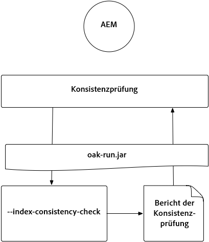

## Indexstatistiken {#indexstatistics}

>[!NOTE]
>
>Weitere Informationen zu diesem Szenario finden Sie unter [Anwendungsfall 2 - Indexstatistiken](/help/sites-deploying/oak-run-indexing-usecases.md#usecase2indexstatistics) 

* `oak-run.jar` sichert alle Indexdefinitionen, wichtige Indexstatistiken und Indexinhalte für Offline-Analysen. 
* Kann problemlos auf einer verwendeten AEM-Instanz ausgeführt werden.

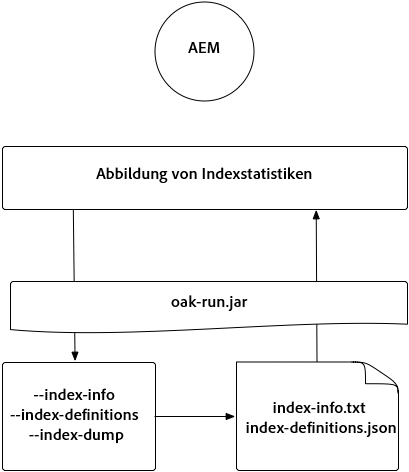

## Entscheidungsbaum für Neuindizierungsansätze {#reindexingapproachdecisiontree}

Dieses Diagramm ist ein Entscheidungsbaum für die Verwendung der verschiedenen Neuindizierungsansätze.

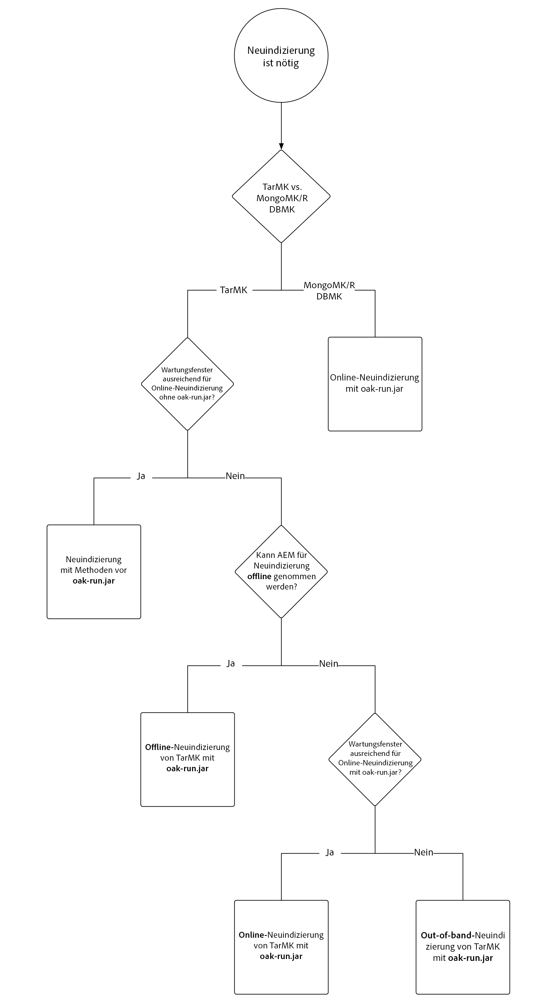

## Neuindizierung von MongoMK/RDMBMK {#reindexingmongomk}

>[!NOTE]
>
>Weitere Informationen zu diesem Szenario finden Sie unter [Anwendungsfall 3 - Neuindizierung](/help/sites-deploying/oak-run-indexing-usecases.md#usecase3reindexing).

### Textvorextraktion für SegmentNodeStore und DocumentNodeStore {#textpre-extraction}

Die [Textvorextraktion](/help/sites-deploying/best-practices-for-queries-and-indexing.md#how-to-perform-text-pre-extraction) (eine Funktion, die mit AEM 6.3 eingeführt wurde) kann genutzt werden, um die Zeit für die Neuindizierung zu verkürzen. Die Textvorextraktion kann mit allen Neuindizierungsansätzen verwendet werden.

Abhängig vom `oak-run.jar`-Indizierungsansatz, müssen, wie im Diagramm unten dargestellt, auf beiden Seiten des Schrittes zur Durchführung der Neuindizierung verschiedene Schritte ausgeführt werden.

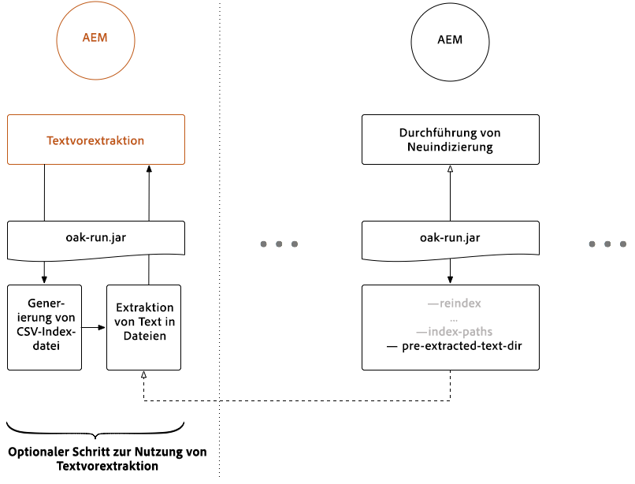

>[!NOTE]
>
>Aktivitäten, bei denen sich AEM in einem Wartungsfenster befinden muss, sind orange dargestellt.

### Online-Neuindizierung für MongoMK oder RDBMK mit oak-run.jar {#onlinere-indexingformongomk}

>[!NOTE]
>
>Weitere Informationen zu diesem Szenario finden Sie unter [Neuindizieren - DocumentNodeStore](/help/sites-deploying/oak-run-indexing-usecases.md#reindexdocumentnodestore).

Dies ist die empfohlene Methode für die Neuindizierung von MongoMK- (und RDBMK-) AEM Installationen. Wenden Sie keine andere Methode an.

Dieser Vorgang darf nur für eine einzelne AEM-Instanz im Cluster durchgeführt werden.

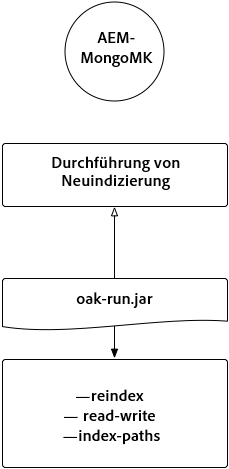

## Neuindizierung von TarMK {#re-indexingtarmk}

>[!NOTE]
>
>Weitere Informationen zu diesem Szenario finden Sie unter [Neuindizieren - SegmentNodeStore](/help/sites-deploying/oak-run-indexing-usecases.md#reindexsegmentnodestore).

* **Überlegungen zu Cold-Standby (TarMK)**

   * Es gibt keine besonderen Überlegungen zu Cold-Standby. Die Cold-Standby-Instanzen synchronisieren Änderungen wie üblich.

* **AEM-Veröffentlichungsfarmen (AEM-Veröffentlichungsfarmen müssen immer TarMK-Veröffentlichungsfarmen sein)**

   * Bei einer Veröffentlichungsfarm muss dies für alle Veröffentlichungen ausgeführt werden ODER die Schritte werden auf einer einzigen Veröffentlichung durchgeführt und das Setup wird dann für die anderen geklont (mit den üblichen Vorsichtsmaßnahmen für das Klonen von AEM-Instanzen. sling.id muss hier auf etwas verweisen)

### Online-Neuindizierung für TarMK {#onlinere-indexingfortarmk}

>[!NOTE]
>
>Weitere Informationen zu diesem Szenario finden Sie unter [Online-Neuindizierung - SegmentNodeStore](/help/sites-deploying/oak-run-indexing-usecases.md#onlinereindexsegmentnodestore).

Dies ist die Methode, die vor der Einführung der neuen Indizierungsfunktionen von oak-run.jar verwendet wurde. Sie kann verwendet werden, indem für den Oak-Index die Eigenschaft `reindex=true` festlegt wird.

Dieser Ansatz kann verwendet werden, wenn die Auswirkungen auf die Dauer und die Performance für den Kunden akzeptabel sind. Dies ist häufig bei kleinen und mittleren AEM-Installationen der Fall.

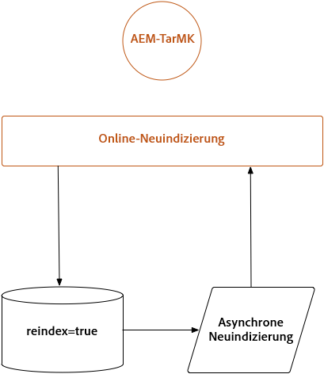

### Online-Neuindizierung von TarMK mit oak-run.jar {#onlinere-indexingtarmkusingoak-run-jar}

>[!NOTE]
>
>Weitere Informationen zu diesem Szenario finden Sie unter [Online-Neuindizierung - SegmentNodeStore - Die AEM-Instanz wird ausgeführt](/help/sites-deploying/oak-run-indexing-usecases.md#onlinereindexsegmentnodestoretheaeminstanceisrunning).

Die Online-Neuindizierung von TarMK mithilfe von oak-run.jar ist schneller als die oben beschriebene [Online-Neuindizierung für TarMK](#onlinere-indexingfortarmk). Sie erfordert jedoch auch die Ausführung während eines Wartungsfensters. wobei darauf hingewiesen wird, dass das Fenster kürzer wird und weitere Schritte erforderlich sind, um die Neuindizierung durchzuführen.

>[!NOTE]
>
>Vorgänge, bei denen sich AEM in einem Wartungsfenster befinden muss, sind orange dargestellt.

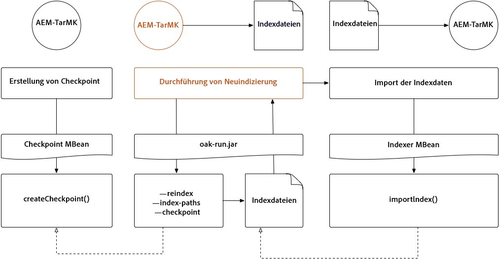

### Offline-Neuindizierung von TarMK mit oak-run.jar {#offlinere-indexingtarmkusingoak-run-jar}

>[!NOTE]
>
>Weitere Informationen zu diesem Szenario finden Sie unter [Online-Neuindizierung - SegmentNodeStore - Die AEM-Instanz muss ausgeschaltet sein](/help/sites-deploying/oak-run-indexing-usecases.md#onlinereindexsegmentnodestoreaeminstanceisdown).

Die Offline-Neuindizierung von TarMK ist der einfachste auf `oak-run.jar` basierende Neuindizierung sansatz für TarMK, da nur ein einziger `oak-run.jar`-Befehl erforderlich ist. Die AEM-Instanz muss jedoch heruntergefahren werden.

>[!NOTE]
>
>Vorgänge, bei denen AEM heruntergefahren sein muss, sind rot dargestellt.

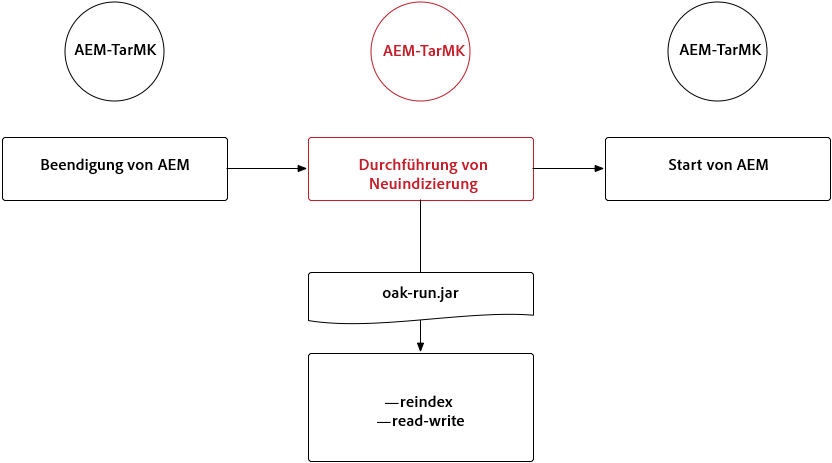

### Out-of-Band-Neuindizierung von TarMK mit oak-run.jar  {#out-of-bandre-indexingtarmkusingoak-run-jar}

>[!NOTE]
>
>Weitere Informationen zu diesem Szenario finden Sie unter [Out-of-Band-Neuindizierung - SegmentNodeStore](/help/sites-deploying/oak-run-indexing-usecases.md#outofbandreindexsegmentnodestore).

Die Out-of-Band-Neuindizierung minimiert die Auswirkung der Neuindizierung auf verwendete AEM-Instanzen.

>[!NOTE]
>
>Vorgänge, bei denen AEM heruntergefahren sein muss, sind rot dargestellt.

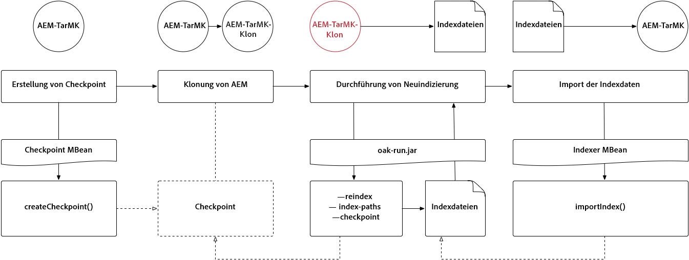

## Aktualisieren von Indexdefinitionen {#updatingindexingdefinitions}

>[!NOTE]
>
>Weitere Informationen zu diesem Szenario finden Sie unter [Anwendungsfall 4 - Aktualisieren von Indexdefinitionen](/help/sites-deploying/oak-run-indexing-usecases.md#usecase4updatingindexdefinitions).

### Erstellen und Aktualisieren von Indexdefinitionen auf TarMK mit ACS Ensure Index {#creatingandupdatingindexdefinitionsontarmkusingacsensureindex}

>[!NOTE]
>
>ACS Ensure Index ist ein Community-Projekt, das nicht vom Adobe-Support unterstützt wird.

Dadurch kann die Versandindexdefinition über das Inhaltspaket erfolgen, was später zu einer Neuindizierung führt, indem die Neuindizierungskennzeichnung auf `true` gesetzt wird. Dies funktioniert bei kleineren Setups, bei denen die Neuindizierung nicht lange dauert.

Weitere Informationen finden Sie in der [Dokumentation zu ACS Ensure Index](https://adobe-consulting-services.github.io/acs-aem-commons/features/ensure-oak-index/index.html).

### Erstellen und Aktualisieren von Indexdefinitionen auf TarMK mit oak-run.jar {#creatingandupdatingindexdefinitionsontarmkusingoak-run-jar}

Wenn die Dauer der Neuindizierung oder die Auswirkung auf die Performance bei Nicht-`oak-run.jar`-Methoden zu hoch ist, kann der folgende auf `oak-run.jar` basierende Ansatz genutzt werden, um Lucene-Indexdefinitionen in eine TarMK-basierte AEM-Installation zu importieren und neu zu indizieren.

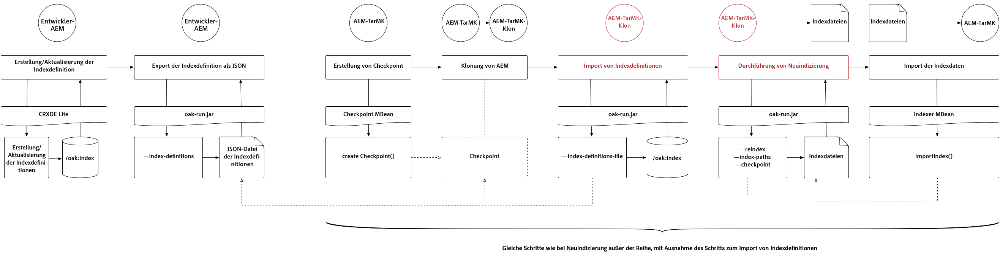

### Erstellen und Aktualisieren von Indexdefinitionen auf MongoMK mit oak-run.jar {#creatingandupdatingindexdefinitionsonmonogmkusingoak-run-jar}

Wenn die Dauer der Neuindizierung oder die Auswirkung auf die Performance bei Nicht-`oak-run.jar`-Methoden zu hoch ist, kann der folgende auf `oak-run.jar` basierende Ansatz genutzt werden, um Lucene-Indexdefinitionen in eine MongoMK-basierte AEM-Installation zu importieren und neu zu indizieren.

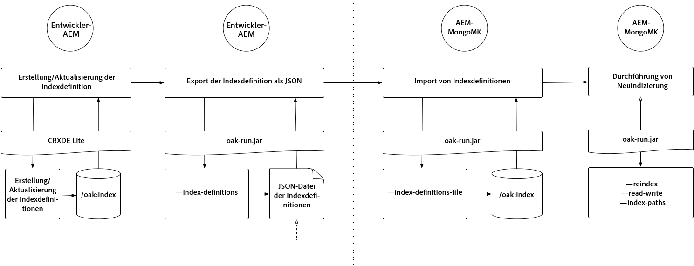
