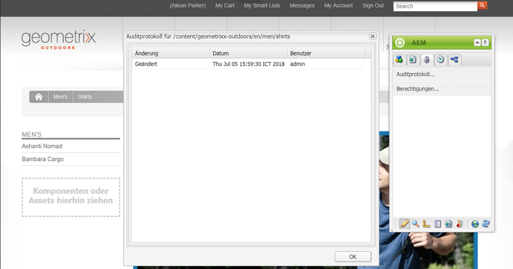
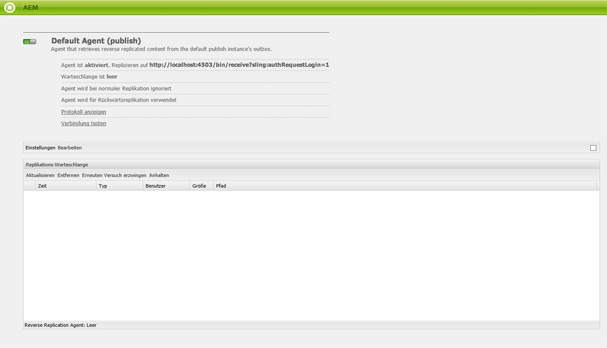

# Überwachung und Wartung der AEM-Instanz{#monitoring-and-maintaining-your-aem-instance}

Nach der Bereitstellung der AEM-Instanzen sind bestimmte Aufgaben erforderlich, um Betrieb, Leistung und Integrität zu überwachen und aufrechtzuerhalten.

Um potenzielle Probleme erkennen zu können, müssen Sie unbedingt wissen, wie Ihre Systeme unter normalen Bedingungen aussehen und sich verhalten. Dazu sollten Sie das System überwachen und über einen Zeitraum hinweg Daten erfassen.

| Überprüfen Sie Folgendes | Aspekte | Kommentar/Aktionen |
|---|---|---|
| Backup-Plan. |  | Gehen Sie wie folgt vor, um [ein Backup für Ihre Instanz zu erstellen](/help/sites-deploying/monitoring-and-maintaining.md#backups). |
| Plan für die Notfallwiederherstellung | Richtlinien Ihres Unternehmens für die Notfallwiederherstellung. |  |
| Ein System zur Fehlersuche steht Ihnen für die Problemberichterstattung zur Verfügung. | Zum Beispiel [Bugzilla](https://www.bugzilla.org/), [Jira](https://www.atlassian.com/software/jira/) oder eines von vielen anderen. |  |
| Dateisysteme werden überwacht. | Das CRX-Repository wird „eingeforen“, wenn nicht genügend freier Speicherplatz vorhanden ist. Es wird fortgesetzt, sobald Speicherplatz frei wird. | &quot; `*ERROR* LowDiskSpaceBlocker`&quot;-Meldungen werden in der Protokolldatei angezeigt, wenn der freie Speicherplatz gering ist. |
| [Protokolldateien](/help/sites-deploying/monitoring-and-maintaining.md#working-with-audit-records-and-log-files) werden überwacht. |  |  |
| Die Systemüberwachung wird (ständig) im Hintergrund ausgeführt. | Einschließlich CPU-, Arbeitsspeicher-, Festplatten- und Netzwerkauslastung. Verwendet wird z. B. iostat / vmstat / perfmon. | Protokollierte Daten werden angezeigt und können zum Nachverfolgen von Leistungsproblemen verwendet werden. Rohdaten sind ebenfalls verfügbar. |
| [Die AEM-Leistung wird überwacht](/help/sites-deploying/monitoring-and-maintaining.md#monitoring-performance). | Einschließlich [Anfragezähler](/help/sites-deploying/monitoring-and-maintaining.md#request-counters) zur Überwachung des Traffic-Niveaus. | Bei großem oder anhaltendem Leistungsverlust sollte eine detaillierte Analyse erfolgen. |
| Sie überwachen Ihre [Replikationsagenten](/help/sites-deploying/monitoring-and-maintaining.md#monitoring-your-replication-agents). |  |  |
| Regelmäßige Bereinigung von Workflow-Instanzen. | Repository-Größe und Workflow-Leistung. | Siehe [Regelmäßige Bereinigung von Workflow-Instanzen](/help/sites-administering/workflows-administering.md#regular-purging-of-workflow-instances). |

## Backups {#backups}

Es hat sich bewährt, Backups für folgende Komponenten zu erstellen:

* Ihre Software Installation: vor/nach wichtigen Konfigurationsänderungen
* Der Inhalt im Repository - regelmäßig

In Ihrem Unternehmen gibt es wahrscheinlich eine Sicherungsrichtlinie, die Sie einhalten müssen. Zusätzlich sollten Sie sich überlegen, welche Komponenten Sie wann sichern, z. B. anhand folgender Kriterien:

* Wie wichtig das System und die Daten sind.
* Wie oft Änderungen an der Software oder an den Daten vorgenommen werden.
* Datenmenge und Kapazität können u. U. ein Problem darstellen, ebenso die für das Erstellen von Sicherungskopien benötigte Zeit.
* Ob die Sicherung durchgeführt werden kann, während Benutzer online sind, und welche Auswirkungen auf die Leistung zu erwarten sind.
* Die geografische Verteilung der Nutzer. Wann ist z. B. die beste Zeit für die Sicherung (um Auswirkungen so gering wie möglich zu halten)?
* Die Richtlinie Ihres Unternehmens für die Notfallwiederherstellung. Es gibt Richtlinien, anhand derer gesicherte Daten gespeichert werden müssen (z. B. an externen Standorten, auf bestimmten Medien und dergleichen).

Oft werden in regelmäßigen Abständen (z. B. täglich, wöchentlich oder monatlich) vollständige Backups und zwischendurch (z. B. stündlich, täglich oder wöchentlich) inkrementelle Backups erstellt.

>[!CAUTION]
>
>Wenn Sie Sicherungskopien der Produktionsinstanzen erstellt haben, *müssen* Sie Tests durchführen, um sicherzustellen, dass die Sicherungskopie erfolgreich wiederhergestellt werden kann.
>
>Andernfalls ist das Backup womöglich nutzlos (im schlimmsten Fall).

>[!NOTE]
>
>Weitere Informationen zur Backup-Leistung finden Sie im Abschnitt [Backup-Leistung](/help/sites-deploying/configuring-performance.md#backup-performance).

### Erstellen Sie ein Backup Ihrer installierten Software {#backing-up-your-software-installation}

Nach der Installation oder nach größeren Konfigurationsänderungen sollten Sie ein Backup der installierten Software erstellen.

Dazu müssen Sie erst[ein Backup des gesamten Repositorys erstellen](#backing-up-your-repository) und dann folgende Schritte ausführen:

1. AEM anhalten.
1. Sichern Sie den gesamten `<cq-installation-dir>` aus Ihrem Dateisystem.

>[!CAUTION]
>
>Falls Sie einen Anwendungsserver eines Drittanbieters verwenden, gibt es möglicherweise zusätzliche Ordner an anderen Speicherorten, die Sie ebenfalls sichern müssen. Informationen dazu, wie Sie Anwendungsserver installieren, finden Sie unter [Installieren von AEM mit einem Anwendungsserver](/help/sites-deploying/application-server-install.md).

>[!CAUTION]
>
>Das inkrementelle Sichern des Dateidatenspeichers wird unterstützt. Wenn Sie inkrementelle Backups anderer Komponenten (z. B. der Lucene-Indizes) erstellen möchten, stellen Sie sicher, dass gelöschte Dateien auch im Backup als gelöscht markiert sind.

>[!NOTE]
>
>Die Festplattenspiegelung kann als Sicherungsmethode eingesetzt werden.

### Erstellen Sie ein Backup Ihres Repositorys {#backing-up-your-repository}

Im Abschnitt [Sicherung und Wiederherstellung](/help/sites-administering/backup-and-restore.md) der CRX-Dokumentation sind alle Aspekte der Sicherung des CRX-Repositorys abgedeckt.

Details zum Erstellen eines Hot-Backups im Online-Betrieb finden Sie unter [Erstellen eines Online-Backups](/help/sites-administering/backup-and-restore.md#online-backup).

## Versionsbereinigung {#version-purging}

Das Tool **Versionen bereinigen** dient zum Bereinigen der Versionen eines Knotens oder einer Hierarchie von Knoten in Ihrem Repository. Der Hauptzweck ist die Verkleinerung des Repositorys durch Löschen alter Knotenversionen.

In diesem Abschnitt werden die Wartungsaufgaben im Zusammenhang mit der Versionsfunktion von AEM behandelt. Mit dem Tool **Versionsbereinigung** können Sie Versionen eines Knotens oder eine Knotenhierarchie Ihres Repository bereinigen. Der Hauptzweck ist die Verkleinerung des Repositorys durch Löschen alter Knotenversionen.

### Übersicht {#overview}

Das Tool **Versionsbereinigung** ist in der **[Tools](/help/sites-administering/tools-consoles.md)-Konsole** unter **„Versionsverwaltung“** oder direkt unter folgender URL verfügbar:

`https://<server>:<port>/etc/versioning/purge.html`


**Start** PathEin absoluter Pfad, auf dem die Bereinigung durchgeführt werden muss. Sie können den Startpfadauswählen, indem Sie auf den Navigatorbaum im Repository klicken.

**** RekursivBeim Bereinigen von Daten können Sie zwischen der Ausführung des Vorgangs auf einem Knoten oder auf einer ganzen Hierarchie wählen, indem Sie Rekursiv auswählen. Im letzteren Fall definiert der angegebene Pfad den Stammknoten der Hierarchie.

**Maximale Versionen, die** beibehalten werden sollen Die maximale Anzahl von Versionen, die für einen Knoten beibehalten werden sollen. Wenn die Anzahl diesen Wert überschreitet, werden die ältesten Versionen gelöscht.

**Maximales** Alter der VersionenDas maximale Alter der Version eines Knotens. Wenn das Alter einer Version diesen Wert überschreitet, wird sie gelöscht.

**Trockenes** AusführenDa das Entfernen von Versionen Ihres Inhalts definiert ist und nicht ohne Wiederherstellen eines Backups rückgängig gemacht werden kann, bietet das Tool Versionen bereinigen einen trockenen Ausführungsmodus, mit dem Sie die bereinigten Versionen in der Vorschau anzeigen können. Klicken Sie auf Probelauf, um einen Probelauf des Bereinigungsvorgangs zu starten.

**** Bereinigen Sie Launch die Bereinigung der Versionen auf dem Knoten, der durch den Startpfad definiert wird.

### Bereinigen von Versionen einer Website {#purging-versions-of-a-web-site}

Um Versionen einer Website zu löschen, gehen Sie folgendermaßen vor:

1. Navigieren Sie zur **[Tools](/help/sites-administering/tools-consoles.md)****-Konsole**, wählen Sie **„Versionsverwaltung“** aus und doppelklicken Sie auf **„Versionen bereinigen“**.
1. Legen Sie den Startpfad für den zu löschenden Inhalt fest (z. B. `/content/geometrixx-outdoors`).

   * Falls Sie nur den durch den Pfad definierten Knoten löschen möchten, deaktivieren Sie die Option **„Rekursiv“**.
   * Falls Sie den durch den Pfad definierten Knoten und alle untergeordneten Knoten bereinigen möchten, aktivieren Sie die Option **„Rekursiv“**.

1. Legen Sie die maximale Anzahl von Versionen (für jeden Knoten) fest, die Sie beibehalten möchten. Lassen Sie das Feld frei, falls diese Einstellung nicht verwendet werden soll.

1. Legen Sie das maximale Versionsalter in Tagen (für jeden Knoten) fest, den Sie beibehalten möchten. Lassen Sie das Feld frei, falls diese Einstellung nicht verwendet werden soll.

1. Klicken Sie auf **Probelauf**, um eine Vorschau des Bereinigungsvorgangs anzuzeigen.
1. Klicken Sie auf **Löschen**, um den Vorgang zu starten.

>[!CAUTION]
>
>Bereinigte Knoten können ohne Wiederherstellung des Repository nicht zurückgesetzt werden. Da eine fehlerfreie Konfiguration sehr wichtig ist, empfiehlt es sich, vor einer Bereinigung immer einen Probelauf durchzuführen.

### Analysieren der Konsole {#analyzing-the-console}

Beim den Vorgängen **Probelauf** und **Löschen** werden alle Knoten aufgelistet, die verarbeitet werden. Während des Vorgangs kann ein Knoten einen der folgenden Statuswerte haben: 

* `ignore (not versionnable)`: Der Knoten unterstützt keine Versionierung und wird während des Prozesses ignoriert.

* `ignore (no version)`: Für den Knoten sind keine Versionen vorhanden und er wird beim Bereinigungsvorgang ignoriert.

* `retained`: Der Knoten wurde nicht gelöscht.
* `purged`: der Knoten bereinigt wird.

Darüber hinaus stellt die Konsole nützliche Informationen zu den Versionen bereit: 

* `V 1.0`: die Versionsnummer.
* `V 1.0.1` *: Der Stern gibt an, dass es sich um die aktuelle Version handelt. 

* `Thu Mar 15 2012 08:37:32 GMT+0100`: das Datum der Version.

Im folgenden ein Beispiel:

* Die Versionen unter **[!DNL Shirts]** werden gelöscht, da sie älter als 2 Tage sind.
* Die **[!DNL Tonga Fashions!]**-Versionen werden gelöscht, da die Anzahl der Versionen größer als 5 ist.


## Arbeiten mit Auditdatensätzen und Protokolldateien {#working-with-audit-records-and-log-files}

Auditdatensätze und Protokolldateien für Adobe Experience Manager (AEM) finden sich an diversen Speicherorten. Im Folgenden erhalten Sie einen Überblick, welche Dateien wo zu finden sind.

### Arbeiten mit Protokollen {#working-with-logs}

AEM WCM-System zeichnet detaillierte Protokolle auf. Wenn Sie Quickstart entpackt und gestartet haben, finden Sie Protokolle unter folgenden Pfaden:

* `<cq-installation-dir>/crx-quickstart/logs/`

* `<cq-installation-dir>/crx-quickstart/repository/`

#### Protokolldateirotation {#log-file-rotation}

Protokolldateirotation bezeichnet einen Vorgang, bei dem das Dateiwachstum durch das regelmäßige Erstellen einer neuen Datei beschränkt wird. In AEM wird die Protokolldatei `error.log` täglich nach folgenden Regeln rotiert:

* Die `error.log`-Datei wird gemäß dem Muster {original_filename} `.yyyy-MM-dd` umbenannt. Beispielsweise wird die aktuelle Protokolldatei am 11. Juli 2010 in `error.log-2010-07-10` umbenannt und dann ein neuer `error.og` erstellt.

* Vorherige Protokolldateien werden nicht gelöscht. Daher ist es Ihre Verantwortung, alte Protokolldateien regelmäßig zu bereinigen, um die Festplattenauslastung zu begrenzen.

>[!NOTE]
>
>Wenn Sie Ihre AEM-Installation aktualisieren, verbleiben vorhandene Protokolldateien, die nicht mehr von AEM verwendet werden, auf der Festplatte. Sie können diese ohne Risiko löschen. Alle neuen Protokolleinträge werden in die neuen Protokolldateien geschrieben. 

### Suchen nach Protokolldateien {#finding-the-log-files}

Diverse Protokolldateien werden auf dem Dateiserver gespeichert, auf dem Sie AEM installiert haben:

* `<cq-installation-dir>/crx-quickstart/logs`

   * `access.log`
Hier werden alle Zugriffsanfragen an das AEM WCM-System und das Repository registriert.

   * `audit.log`
Moderationsaktionen werden hier registriert.

   * `error.log`
Hier werden Fehlermeldungen (mit unterschiedlichem Schweregrad) registriert.

   * [ `ImageServer-<PortId>-yyyy>-<mm>-<dd>.log`](https://experienceleague.adobe.com/docs/dynamic-media-developer-resources/image-serving-api/image-serving-api/config-admin/server-logging/c-image-server-log.html)
Dieses Protokoll wird nur verwendet, wenn aktiviert  [!DNL Dynamic Media] ist. Es stellt Statistiken und analytische Informationen bereit, die zur Analyse des Verhaltens des internen ImageServer-Prozesses verwendet werden.

   * `request.log`
Hier werden alle Zugriffsanfragen zusammen mit der Antwort registriert.

   * [ `s7access-<yyyy>-<mm>-<dd>.log`](https://experienceleague.adobe.com/docs/dynamic-media-developer-resources/image-serving-api/image-serving-api/config-admin/server-logging/c-access-log.html)
Dieses Protokoll wird nur verwendet, wenn aktiviert  [!DNL Dynamic Media] ist. Das s7access-Protokoll zeichnet alle Anfragen auf, die an [!DNL Dynamic Media] über `/is/image` und `/is/content` gestellt wurden.

   * `stderr.log` Enthält Fehlermeldungen (ebenfalls mit unterschiedlichem Schweregrad), die beim Starten generiert werden. Standardmäßig ist die Protokollebene auf 
`Warning` ( `WARN`)

   * `stdout.log`
Enthält Protokollmeldungen, die auf Ereignisse beim Starten verweisen.

   * `upgrade.log`
Bietet ein Protokoll aller Aktualisierungsvorgänge, die von der 
`com.day.compat.codeupgrade` und  `com.adobe.cq.upgradesexecutor` Packages.

* `<cq-installation-dir>/crx-quickstart/repository`

   * `revision.log`
Informationen zur Revisionsjournalisierung.

>[!NOTE]
>
>Die Protokolle &quot;ImageServer&quot;und &quot;s7access&quot;sind nicht im Paket &quot;Download Full&quot;enthalten, das von der Seite &quot;system/console/status-Bundlelist&quot;generiert wird. Wenn Sie Probleme mit [!DNL Dynamic Media] haben, hängen Sie zur Unterstützung die Protokolle ImageServer und s7access an, wenn Sie sich an den Support wenden.

### Aktivieren der DEBUG-Protokollebene {#activating-the-debug-log-level}

Die Standard-Protokollebene ([Apache Sling-Protokollierungskonfiguration](/help/sites-deploying/osgi-configuration-settings.md#apacheslingloggingconfiguration)) ist „Information“, d. h. es werden keine Debugging-Meldungen protokolliert.

Um die Debugging-Protokollebene für eine Protokollierung zu aktivieren, müssen Sie für die Eigenschaften `org.apache.sling.commons.log.level` im Repository den Wert „debug“ festlegen. Beispielsweise auf `/libs/sling/config/org.apache.sling.commons.log.LogManager` zum Konfigurieren der [globalen Apache Sling-Protokollierung](/help/sites-deploying/osgi-configuration-settings.md#apacheslingloggingconfiguration).

>[!CAUTION]
>
>Legen Sie für das Protokoll nur so lange wie erforderlich „debug“ fest, da eine große Anzahl an Protokolleinträgen erstellt wird, die Ressourcen verbrauchen.

Eine Zeile in der Debugging-Datei beginnt üblicherweise mit DEBUG, gefolgt von der Protokollebene, der Installationsaktion und der Protokollmeldung. Beispiel:

```shell
DEBUG 3 WebApp Panel: WebApp successfully deployed
```

Die Protokollebenen lauten wie folgt:

| 0 | Schwerwiegender Fehler | Die Aktion ist fehlgeschlagen und das Installationsprogramm kann nicht fortgesetzt werden. |
|---|---|---|
| 1 | Fehler | Die Aktion ist fehlgeschlagen. Die Installation wird fortgesetzt, ein Teil des AEM WCM-Systems wird jedoch nicht richtig installiert und funktioniert nicht. |
| 2 | Warnung | Die Aktion war erfolgreich, stieß aber auf Probleme. Das AEM WCM-System funktioniert möglicherweise nicht ordnungsgemäß. |
| 3 | Informationen | Die Aktion war erfolgreich. |

### Erstellen einer benutzerdefinierten Protokolldatei {#create-a-custom-log-file}

>[!NOTE]
>
>Beim Arbeiten mit Adobe Experience Manager haben Sie mehrere Möglichkeiten, die Konfigurationseinstellungen für Dienste zu verwalten. Einzelheiten und empfohlene Vorgehensweisen finden Sie unter [Konfigurieren von OSGi](/help/sites-deploying/configuring-osgi.md).

Unter bestimmten Umständen müssen Sie möglicherweise eine benutzerdefinierte Protokolldatei mit einer anderen Protokollebene erstellen. Gehen Sie dazu im Repository wie folgt vor:

1. Erstellen Sie, falls nicht bereits vorhanden, einen neuen Konfigurationsordner (`sling:Folder`) für das Projekt `/apps/<project-name>/config`.
1. Erstellen Sie unter `/apps/<project-name>/config`[ einen Knoten für die neue Apache Sling Logging Logger-Konfiguration](/help/sites-deploying/osgi-configuration-settings.md#apacheslingloggingloggerconfigurationfactoryconfiguration):

   * Name: `org.apache.sling.commons.log.LogManager.factory.config-<identifier>` (da dies ein Logger ist)

      wobei `<identifier>` durch einen freien Text ersetzt wird, den Sie eingeben (müssen), um die Instanz zu identifizieren (diese Information darf nicht weggelassen werden).

      Beispiel: `org.apache.sling.commons.log.LogManager.factory.config-MINE`

   * Typ: `sling:OsgiConfig`
   >[!NOTE]
   >
   >Es gibt zwar keine spezifischen technischen Anforderungen, es ist jedoch ratsam, für `<identifier>` einen eindeutigen Parameter zu verwenden.

1. Legen Sie die folgenden Eigenschaften des Knotens fest:

   * Name: `org.apache.sling.commons.log.file`

      Typ: String

      Wert: die Protokolldatei angeben; Beispiel: `logs/myLogFile.log`

   * Name: `org.apache.sling.commons.log.names`

      Typ: String[] (String + Multi)

      Wert: die OSGi-Dienste angeben, für die der Logger Meldungen protokollieren soll; Beispiel: alle folgenden Elemente:

      * `org.apache.sling`
      * `org.apache.felix`
      * `com.day`
   * Name: `org.apache.sling.commons.log.level`

      Typ: String

      Wert: Geben Sie die erforderliche Protokollebene an ( `debug`, `info`, `warn` oder `error`); Beispiel: `debug`

   * Konfigurieren Sie ggf. weitere Parameter:

      * Name: `org.apache.sling.commons.log.pattern`

         Typ: `String`

         Wert: das Muster der Protokollmeldung nach Bedarf angeben; Beispiel:

         `{0,date,dd.MM.yyyy HH:mm:ss.SSS} *{4}* [{2}] {3} {5}`
   >[!NOTE]
   >
   >`org.apache.sling.commons.log.pattern` unterstützt bis zu sechs Argumente.
   >
   >{0} Der Zeitstempel des Typs `java.util.Date`
   >
   >{1} Protokollmarkierung
   >
   >{2} der Name des aktuellen Threads
   >
   >{3} Name des Loggers
   >
   >{4} Protokollebene
   >
   >{5} Protokollmeldung
   >
   >Falls der Protokollaufruf den Parameter `Throwable` enthält, wird der StackTrace an die Meldung angefügt.

   >[!CAUTION]
   >
   >„org.apache.sling.commons.log.names“ muss einen Wert enthalten.

   >[!NOTE]
   >
   >Die Protokollierungspfade sind vom Speicherort-`crx-quickstart`abhängig.
   >
   >Eine Protokolldatei wie:
   >
   >`logs/thelog.log`
   >
   >wird daher geschrieben in:
   >
   >`<cq-installation-dir>/crx-quickstart/logs/thelog.log`.
   >
   >Und eine Protokolldatei wie:
   >
   >`../logs/thelog.log`
   >
   >wird in folgendes Verzeichnis geschrieben:
   >
   >`<cq-installation-dir>/logs/`\
   >(d. h. neben `<cq-installation-dir>/crx-quickstart/`)

1. Dieser Schritt muss nur ausgeführt werden, wenn ein neuer Writer erforderlich ist (d. h. mit einer Konfiguration, die vom standardmäßigen Writer abweicht). 

   >[!CAUTION]
   >
   >Eine neue Logging-Writer-Konfiguration ist nur erforderlich, wenn die vorhandene Standardkonfiguration nicht geeignet ist.
   >
   >Wenn kein expliziter Writer konfiguriert ist, erstellt das System automatisch einen impliziten Writer auf Basis der Standardkonfiguration.

   Erstellen Sie unter `/apps/<project-name>/config` einen Knoten für die neue [Apache Sling Logging Writer Configuration](/help/sites-deploying/osgi-configuration-settings.md#apacheslingloggingwriterconfigurationfactoryconfiguration):

   * Name: `org.apache.sling.commons.log.LogManager.factory.writer-<identifier>` (da dies ein Writer ist)

      Wie beim Logger wird `<identifier>` durch freien Text ersetzt, den Sie eingeben (müssen), um die Instanz zu identifizieren (diese Informationen können nicht weggelassen werden). Beispiel: `org.apache.sling.commons.log.LogManager.factory.writer-MINE`

   * Typ: `sling:OsgiConfig`
   >[!NOTE]
   >
   >Es gibt zwar keine spezifischen technischen Anforderungen, es ist jedoch ratsam, für `<identifier>` einen eindeutigen Parameter zu verwenden.

   Legen Sie die folgenden Eigenschaften des Knotens fest:

   * Name: `org.apache.sling.commons.log.file`

      Typ: `String`

      Wert: Geben Sie die Protokolldatei so an, dass sie mit der im Logger angegebenen Datei übereinstimmt.

      für dieses Beispiel `../logs/myLogFile.log`.

   * Konfigurieren Sie ggf. weitere Parameter:

      * Name: `org.apache.sling.commons.log.file.number`

         Typ: `Long`

         Wert: die Anzahl der Protokolldateien angeben, die Sie beibehalten möchten; Beispiel: `5`

      * Name: `org.apache.sling.commons.log.file.size`

         Typ: `String`

         Wert: die Angabe, die erforderlich ist, um die Dateirotation nach Größe/Datum zu steuern; Beispiel: `'.'yyyy-MM-dd`
   >[!NOTE]
   >
   >`org.apache.sling.commons.log.file.size` steuert die Rotation der Protokolldatei durch eine der folgenden Einstellungen:
   >
   >* eine maximalen Dateigröße
   >* einen Zeit-/Terminplan

   >
   >um anzugeben, wann eine neue Datei erstellt wird (und die vorhandene Datei gemäß dem Namensmuster umbenannt wird).
   >
   >* Eine Größenbeschränkung kann mit einer Zahl angegeben werden. Wenn kein Größenindikator angegeben ist, wird dies als Anzahl von Bytes betrachtet oder Sie können einen der Größenindikatoren hinzufügen: `KB`, `MB` oder `GB` (Groß-/Kleinschreibung wird ignoriert).
   >* Sie können einen Zeit-/Terminplan nach dem `java.util.SimpleDateFormat`-Muster angeben. Dieser gibt den Zeitraum an, in dem die Datei rotiert wird, sowie das Suffix, das an die rotierte Datei angehängt wurde (zur einfachen Identifizierung).

   >
   >Der Standardwert lautet &#39;.&#39;yyyy-MM-dd (für die tägliche Protokollrotation).
   >
   >So wird beispielsweise um Mitternacht am 20. Januar 2010 (oder sobald die erste Protokollmeldung nach diesem Zeitpunkt ausgegeben wird), ../logs/error.log in ../logs/error.log.2010-01-20 umbenannt. Die Protokollierung für den 21. Januar erfolgt in (ein neues und leeres) ../logs/error.log und geht bei der nächsten Änderung zum nächsten Datum über. 
   >
   >| `'.'yyyy-MM` | Rotation zu Beginn jedes Monats |
   >|---|---|
   >| `'.'yyyy-ww` | Rotation am ersten Wochentag (abhängig vom Gebietsschema). |
   >| `'.'yyyy-MM-dd` | Rotation jeden Tag um Mitternacht. |
   >| `'.'yyyy-MM-dd-a` | Rotation jeden Tages um Mitternacht und Mittag. |
   >| `'.'yyyy-MM-dd-HH` | Rotation zu Beginn jeder Stunde. |
   >| `'.'yyyy-MM-dd-HH-mm` | Rotation zu Beginn jeder Minute. |
   >
   >Hinweis: Bei der Angabe einer Uhrzeit/eines Datums ist Folgendes zu beachten:
   > 1. Sie sollten literalen Text in einem Paar von einfachen Anführungszeichen (&#39; &#39;) &quot;Escape&quot;;
      >
      >     
      Dadurch wird verhindert, dass bestimmte Zeichen als Musterbuchstaben interpretiert werden.
      >
      >  
   1. Verwenden Sie nur Zeichen, die für einen gültigen Dateinamen im Optionsfeld zulässig sind.


1. Lesen Sie die neue Protokolldatei mit dem von Ihnen ausgewählten Tool.

   Die von diesem Beispiel erstellte Protokolldatei lautet `../crx-quickstart/logs/myLogFile.log`.

Die Felix-Konsole enthält auch Informationen zum Sling Log-Support unter `../system/console/slinglog`; beispielsweise `https://localhost:4502/system/console/slinglog`.

### Suchen nach Auditdatensätzen {#finding-the-audit-records}

Auditdatensätze werden als Nachweis darüber aufbewahrt, wer wann welche Aktion vorgenommen hat. Verschiedene Auditdatensätze werden für das AEM WCM-System und OSGi-Ereignisse generiert.

#### Bei der Seitenbearbeitung angezeigte AEM WCM-Auditdatensätze {#aem-wcm-audit-records-shown-when-page-authoring}

1. Öffnen Sie eine Seite.
1. Wählen Sie im Seitenmenü die Registerkarte mit dem Sperrsymbol aus und doppelklicken Sie auf **Auditprotokoll...**
1. Ein neues Fenster wird geöffnet, in dem die Liste der Auditdatensätze für die aktuelle Seite angezeigt werden.

   

1. Klicken Sie auf **OK**, wenn Sie das Fenster schließen möchten.

#### AEM WCM-Auditdatensätze im Repository {#aem-wcm-auditing-records-within-the-repository}

Im Ordner `/var/audit` werden Auditdatensätze entsprechend der Ressource gespeichert. Sie können ein Drilldown durchführen, bis einzelne Datensätze und die darin enthaltenen Informationen angezeigt werden.

Diese Einträge enthalten die gleichen Informationen wie sie beim Bearbeiten einer Seite angezeigt werden.

#### OSGi-Auditdatensätze aus der Web-Konsole {#osgi-audit-records-from-the-web-console}

OSGi-Ereignisse generieren ebenfalls Auditdatensätze, die Sie in der AEM-Web-Konsole auf der Registerkarte **Konfigurationsstatus** unter **Protokolldateien** anzeigen können:


## Überwachen der Replikationsagenten {#monitoring-your-replication-agents}

Sie können [Replikations-Warteschlangen](/help/sites-deploying/replication.md) darauf überwachen, ob eine Warteschlange ausgefallen oder gesperrt ist. Dies kann wiederum auf ein Problem mit einer Veröffentlichungsinstanz oder einem externen System hinweisen:

* Sind alle erforderlichen Warteschlangen aktiviert?
* Sind alle deaktivierten Warteschlangen noch erforderlich?
* alle `enabled`-Warteschlangen sollten den Status `idle` oder `active` aufweisen, der den normalen Betrieb angibt; keine Warteschlangen sollten `blocked` sein, was häufig ein Zeichen für Probleme auf der Empfängerseite ist.

* Wenn die Warteschlange im Laufe der Zeit größer wird, kann dies auf eine Blockierung hindeuten.

Gehen Sie wie folgt vor, um Replikationsagenten zu überwachen:

1. Wechseln Sie in AEM zur Registerkarte **Tools**.
1. Klicken Sie auf **Replikation**.
1. Doppelklicken Sie auf den Link zu den Agenten für die jeweilige Umgebung (entweder der linke oder der rechte Fensterbereich); z. B.**Agenten für Autor**.

   Das daraufhin angezeigte Fenster gibt einen Überblick über alle Replikationsagenten für die Autorenumgebung, einschließlich ihrer Ziele und Status.

1. Klicken Sie auf den jeweiligen Agenten (der als Link dargestellt ist), um detaillierte Informationen zu diesem Agenten anzuzeigen:

   

   Folgende Informationen/Optionen sind verfügbar:

   * Ob der Agent aktiviert ist.
   * Das Ziel einer beliebigen Replikation.
   * Ob die Replikations-Warteschlange derzeit aktiv (aktiviert) ist.
   * Ob die Warteschlange Elemente enthält.
   * **Aktualisieren** oder **Löschen** zum Aktualisieren der angezeigten Elemente in der Warteschlange. Mit diesen Optionen können Sie Elemente anzeigen, die in die Warteschlange gestellt werden oder diese verlassen.

   * **Protokoll anzeigen** für den Zugriff auf das Protokoll beliebiger Aktionen des Replikationsagenten.
   * **Verbindung testen** zum Testen der Verbindung mit der Zielinstanz.
   * **Erneuten Versuch erzwingen**, um einen erneuten Versuch auf beliebigen Elementen der Warteschlange zu erzwingen, falls erforderlich.

   >[!CAUTION]
   >
   >Verwenden Sie den Link „Verbindung testen“ nicht für den Postausgang der Rückwärtsreplikation auf der Veröffentlichungsinstanz.
   >
   >Falls Sie eine Replikation für eine Warteschlange in einem Postausgang testen, werden alle Elemente, die älter als die Testreplikation sind, bei jeder Rückwärtsreplikation erneut verarbeitet.
   >
   >Wenn solche Elemente bereits in einer Warteschlange vorhanden sind, können Sie mit der folgenden XPath JCR-Abfrage danach suchen und diese entfernen.
   >
   >`/jcr:root/var/replication/outbox//*[@cq:repActionType='TEST']`

Auch hier können Sie eine Lösung entwickeln, um alle Replikationsagenten (unter `/etc/replication/author` oder `/etc/replication/publish`) zu erkennen, und dann den Status des Agenten ( `enabled`, `disabled`) und die zugrunde liegende Warteschlange ( `active`, `idle`, `blocked`) überprüfen.

## Leistungsüberwachung {#monitoring-performance}

Die [Leistungsoptimierung](/help/sites-deploying/configuring-performance.md) ist ein interaktiver Vorgang, der bei der Entwicklung Priorität hat. Im Anschluss an die Bereitstellung wird die Leistung nach bestimmten Intervallen oder Ereignissen überprüft.

Die für das Erfassen von Informationen eingesetzten Methoden können auch zur kontinuierlichen Überwachung verwendet werden.

>[!NOTE]
>
>Spezifische [Konfigurationen, die die Leistung verbessern](/help/sites-deploying/configuring-performance.md#configuring-for-performance), können ebenfalls überprüft werden.

Nachfolgend finden Sie eine Liste mit häufigen Leistungsproblemen und Vorschlägen, wie Sie diese erkennen und beheben.

| Bereich | Symptom(e) | So steigern Sie Kapazitäten: | So reduzieren Sie Mengen: |
|---|---|---|---|
| Client | Hohe Auslastung der CPU durch den Client. | Installieren Sie eine Client-CPU mit höherer Leistung. | Vereinfachen Sie das (HTML-)Layout. |
|  | Geringe CPU-Auslastung des Servers. | Aktualisieren Sie auf einen schnelleren Browser. | Optimieren Sie den Client-seitigen Cache. |
|  | Einige Clients sind schnell, andere langsamer. |  |  |
| Server |  |  |  |
| Netzwerk | Geringe CPU-Auslastung sowohl auf Servern als auch auf Clients. | Beseitigen Sie eventuelle Netzwerkengpässe. | Verbessern/optimieren Sie die Konfiguration des Client-Cache. |
|  | Die lokale Suche auf dem Server ist (vergleichsweise) schnell. | Vergrößern Sie die Netzwerkbandbreite. | Verringern Sie das „Gewicht“ Ihrer Website (z. B. weniger Bilder, optimiertes HTML). |
| Webserver | Die CPU-Auslastung auf dem Webserver ist hoch. | Erstellen Sie Webserver-Cluster. | Reduzieren Sie die Treffer pro Seite (Aufruf). |
|  |  | Verwenden Sie einen Hardware Load Balancer. |  |
| Anwendung | Die CPU-Auslastung des Servers ist hoch. | Erstellen Sie Cluster Ihrer AEM-Instanzen. | Suchen Sie nach und beseitigen Sie CPU- und Arbeitsspeicherverschwendung (durch Überprüfung von Code, zeitliche Planung von Ausgaben usw.). |
|  | Hoher Speicherverbrauch. |  | Verbessern Sie das Zwischenspeichern auf allen Ebenen. |
|  | Kurze Antwortzeiten. |  | Optimieren Sie Vorlagen und Komponenten (z. B. Struktur, Logik). |
| Repository |  |  |  |
| Cache |  |  |  |

Leistungsprobleme können eine Reihe von Ursachen haben, die nichts mit Ihrer Website zu tun haben, z. B. eine vorübergehend langsamere Verbindungsgeschwindigkeit, CPU-Auslastung und vieles mehr.

Sie können sich auf alle Besucher oder nur bestimmte Benutzergruppen auswirken.

All diese Informationen müssen erfasst, sortiert und analysiert werden, bevor Sie die allgemeine Leistung optimieren oder gezielt Probleme lösen können.

* Bevor es zu einem Leistungsproblem kommt:

   * Sammeln Sie so viele Informationen wie möglich, um sich ein gutes Bild des Systems unter normalen Bedingungen zu machen.

* Wenn es zu einem Leistungsproblem kommt:

   * Versuchen Sie, das Problem mit einem (oder vorzugsweise mehr als einem) Standard-Webbrowser, auf einem anderen leistungsstarken Client oder, falls möglich, direkt auf dem Server zu replizieren.
   * Überprüfen Sie, ob (am System) in einem bestimmten Zeitraum Änderungen aufgetreten sind und ob diese Änderungen die Leistung beeinträchtigen können.
   * Stellen Sie Fragen wie:

      * Tritt das Problem nur zu bestimmten Zeitpunkten auf?
      * Tritt das Problem nur auf bestimmten Seiten auf?
      * Sind andere Anforderungen davon betroffen?
   * Sammeln Sie so viele Informationen wie möglich, um diese mit den Information zu vergleichen, die Sie zum System unter normalen Bedingungen haben:


### Tools für die Leistungsüberwachung und -analyse {#tools-for-monitoring-and-analyzing-performance}

Im Folgenden finden Sie einen kurzen Überblick über Tools, mit denen Sie die Leistung überwachen und analysieren können.

Einige von diesen sind von Ihrem Betriebssystem abhängig.

<table>
 <tbody>
  <tr>
   <td>Tool</td>
   <td>Zur Analyse genutzt:</td>
   <td>Verwendung/Weitere Informationen:</td>
  </tr>
  <tr>
   <td>request.log</td>
   <td>Antwortzeiten und parallele Verarbeitung.</td>
   <td><a href="#interpreting-the-request-log">Interpretieren von request.log</a>.</td>
  </tr>
  <tr>
   <td>truss/strace</td>
   <td>Seitenladenvorgänge</td>
   <td><p>Unix-/Linux-Befehle zur Verfolgung von Systemaufrufen und Signalen. Erhöhen Sie die Protokollebene auf <code>INFO</code>.</p> <p>Analysieren Sie die Seitenladefrequenz pro Anforderung, welche Seiten geladen wurden usw.</p> </td>
  </tr>
  <tr>
   <td>Thread-Dumps</td>
   <td>Beobachten Sie die JVM-Threads. Identifizieren Sie Konflikte, Sperren und lange Ausführungszeiten.</td>
   <td><p>Abhängig vom Betriebssystem:<br /> - Unix/Linux: <code>kill -QUIT &lt;<em>pid</em>&gt;</code><br /> - Windows (Konsolenmodus): Strg+Umbruch<br /> </p> <p>Analyse-Tools sind ebenso verfügbar, wie zum Beispiel <a href="https://java.net/projects/tda/">TDA</a>.<br /> </p> </td>
  </tr>
  <tr>
   <td>Heap-Dumps</td>
   <td>Probleme mit dem Speicher, die zu Leistungsverlusten führen.</td>
   <td><p>Fügen Sie die Option:<br /> <code>-XX:+HeapDumpOnOutOfMemoryError</code><br /> zum Java-Aufruf an AEM hinzu.</p> <p>Siehe <a href="https://java.sun.com/javase/6/webnotes/trouble/TSG-VM/html/clopts.html#gbzrr">Anleitung zur Fehlersuche für Java SE 6 with HotSpot VM</a>.</p> </td>
  </tr>
  <tr>
   <td>Systemaufrufe</td>
   <td>Erkennen von Zeitproblemen.</td>
   <td><p>Aufrufe von <code>System.currentTimeMillis()</code> oder <code>com.day.util</code>.Timing werden verwendet, um Zeitstempel aus Ihrem Code oder über <a href="#html-comments">HTML-Kommentare</a> zu generieren.</p> <p><strong>Hinweis:</strong> Diese sollten implementiert werden, damit sie bei Bedarf aktiviert/deaktiviert werden können. Wenn ein System reibungslos läuft, können Sie den Mehraufwand für das Erfassen von Statistiken vermeiden.</p> </td>
  </tr>
  <tr>
   <td>Apache Bench</td>
   <td>Identifizieren Sie Speicherlecks, analysieren Sie selektiv Reaktionszeiten.</td>
   <td><p>Grundlegende Verwendung:</p> <p><code>ab -k -n &lt;<em>requests</em>&gt; -c &lt;<em>concurrency</em>&gt; &lt;<em>url</em>&gt;</code></p> <p>Weitere Informationen finden Sie unter <a href="#apache-bench">Apache Bench</a> und auf der <a href="https://httpd.apache.org/docs/2.2/programs/ab.html">ab man-Seite</a> .</p> </td>
  </tr>
  <tr>
   <td>Rechercheanalyse</td>
   <td> </td>
   <td>Führen Sie Suchabfragen offline aus, ermitteln Sie die Antwortzeit der Abfrage, testen und bestätigen Sie den Ergebnissatz.<br /> </td>
  </tr>
  <tr>
   <td>JMeter</td>
   <td>Last- und Funktionstest.</td>
   <td><a href="https://jakarta.apache.org/jmeter/">https://jakarta.apache.org/jmeter/</a></td>
  </tr>
  <tr>
   <td>JProfiler</td>
   <td>Detaillierte CPU- und Speicherprofilerstellung.</td>
   <td><a href="https://www.ej-technologies.com/">https://www.ej-technologies.com/</a></td>
  </tr>
  <tr>
   <td>JConsole</td>
   <td>Beobachten Sie JVM-Metriken und -Threads.</td>
   <td><p>Verwendungszweck: jconsole</p> <p>Siehe <a href="https://java.sun.com/developer/technicalArticles/J2SE/jconsole.html">jconsole</a> und <a href="#monitoring-performance-using-jconsole">Leistungsüberwachung mit JConsole</a>.</p> <p><strong>Hinweis:</strong> Bei JDK 1.6 ist JConsole durch Plug-ins erweiterbar; z. B. Top oder TDA (Thread Dump Analyzer).</p> </td>
  </tr>
  <tr>
   <td>Java VisualVM</td>
   <td>Beobachten Sie JVM-Metriken, Threads, Arbeitsspeicher und Profiling.</td>
   <td><p>Verwendungszweck: jvisualvm oder visualvm<br /> </p> <p>Siehe <a href="https://java.sun.com/javase/6/docs/technotes/tools/share/jvisualvm.html">jvisualvm</a>, <a href="https://visualvm.dev.java.net/">visualvm</a> und <a href="#monitoring-performance-using-j-visualvm">Leistungsüberwachung mit (J)VisualVM</a>.</p> <p><strong>Hinweis:</strong> Bei JDK 1.6 ist VisualVM durch Plug-ins erweiterbar.</p> </td>
  </tr>
  <tr>
   <td>truss/strace, Isof</td>
   <td>Detaillierter Kernelaufruf und Prozessanalyse (Unix).</td>
   <td>Unix-/Linux-Befehle.</td>
  </tr>
  <tr>
   <td>Zeitstatistiken</td>
   <td>Siehe Zeitstatistiken für das Laden von Seiten.</td>
   <td><p>Um Zeitstatistiken für das Seiten-Rendering anzuzeigen, können Sie <strong>Strg-Umschalt-U</strong> zusammen mit <code>?debugClientLibs=true</code> verwenden, die in der URL festgelegt sind.</p> </td>
  </tr>
  <tr>
   <td>CPU- und Speicher-Profiling-Tool<br /> </td>
   <td><a href="#interpreting-the-request-log">Wird für die Analyse langsamer Anfragen während der Entwicklung verwendet</a>.</td>
   <td>Zum Beispiel <a href="https://www.yourkit.com/">YourKit</a>.</td>
  </tr>
  <tr>
   <td><a href="#information-collection">Informationserfassung</a></td>
   <td>Der aktuelle Stand Ihrer Installation.</td>
   <td>Wenn Sie möglichst viel über Ihre Installation wissen, kann Ihnen dies unter Umständen helfen, die Ursache für die Leistungsänderung herauszufinden und ob diese Änderungen sich begründen lassen. Diese Metriken müssen in regelmäßigen Abständen erfasst werden, sodass Sie signifikante Änderungen sofort sehen.</td>
  </tr>
 </tbody>
</table>

### Interpretieren von request.log {#interpreting-the-request-log}

In dieser Datei werden grundlegende Informationen zu allen Anforderungen an AEM registriert. Sie können daraus wertvolle Schlüsse ziehen.

`request.log` ist eine integrierte Möglichkeit, herauszufinden, wie lange Anforderungen brauchen. Zu Entwicklungszwecken ist es hilfreich, den Befehl `tail -f` auf `request.log` anzuwenden und nach langen Systemreaktionen zu suchen. Für das Analysieren einer größeren `request.log` empfiehlt sich die [Verwendung von `rlog.jar`, damit Sie nach Systemreaktionszeiten filtern und diese sortieren können](#using-rlog-jar-to-find-requests-with-long-duration-times).

Es wird empfohlen, „langsame“ Seiten aus `request.log` zu isolieren und einzeln für eine bessere Leistung zu optimieren. Dazu können Sie Leistungsmetriken pro Komponente oder ein Leistungprofil-Tool wie ` [yourkit](https://www.yourkit.com/)` verwenden. 

#### Überwachen der Traffic auf Ihrer Webseite {#monitoring-traffic-on-your-website}

Im Anforderungsprotokoll werden alle Anfragen zusammen mit der jeweiligen Antwort registriert:

```xml
09:43:41 [66] -> GET /author/y.html HTTP/1.1
09:43:41 [66] <- 200 text/html 797ms
```

Durch Addieren aller GET-Einträge über einen bestimmten Zeitraum (z. B. über mehrere 24-Stunden-Zeiträume) erhalten Sie aussagekräftige Informationen zum durchschnittlichen Traffic auf Ihrer Website.

#### Überwachung der Antwortzeiten mit request.log {#monitoring-response-times-with-the-request-log}

Ein guter Ausgangspunkt für Leistungsanalysen ist das Anforderungsprotokoll:

`<cq-installation-dir>/crx-quickstart/logs/request.log`

Das Protokoll sieht wie folgt aus (die Zeilen sind der Einfachheit halber gekürzt):

```xml
31/Mar/2009:11:32:57 +0200 [379] -> GET /path/x HTTP/1.1
31/Mar/2009:11:32:57 +0200 [379] <- 200 text/html 33ms
31/Mar/2009:11:33:17 +0200 [380] -> GET /path/y HTTP/1.1
31/Mar/2009:11:33:17 +0200 [380] <- 200 application/json 39ms
```

Dieses Protokoll enthält eine Zeile pro Anforderung oder Antwort mit:

* dem Datum, an dem jede Anforderung oder Antwort erfolgte;
* der Anzahl an Anforderungen, in eckigen Klammern; deren Zahl mit der Anfrage und der Antwort übereinstimmt;
* einem Pfeil, der angibt, ob es sich um eine Anfrage (Pfeil nach rechts) oder eine Antwort (Pfeil nach links) handelt.
* Bei Anforderungen enthält die Zeile:

   * die Methode (in der Regel GET, HEAD oder POST);
   * die angeforderte Seite;
   * das Protokoll.

* Bei Antworten enthält die Zeile: 

   * den Statuscode (200 steht für „Erfolg“, 404 steht für „Seite nicht gefunden“);
   * den MIME-Typ;
   * die Antwortzeit.

Anhand von kleinen Skripts können Sie die erforderlichen Informationen aus der Protokolldatei extrahieren und die gewünschten Statistiken erstellen. Daraus können Sie ersehen, welche Seiten oder Seitentypen langsam reagieren und ob die Gesamtleistung zufriedenstellend ist.

#### Überwachung der Suchantwortzeiten mit request.log {#monitoring-search-response-times-with-the-request-log}

Suchanforderungen werden ebenfalls in der Protokolldatei registriert:

```xml
31/Mar/2009:11:35:34 +0200 [338] -> GET /author/playground/en/tools/search.html?query=dilbert&size=5&dispenc=utf-8 HTTP/1.1
31/Mar/2009:11:35:34 +0200 [338] <- 200 text/html 1562ms
```

Wie oben bereits erwähnt, können Sie Skripts verwenden, um relevante Informationen zu extrahieren und Statistiken zu erstellen.

Wenn Sie die Antwortzeit bestimmt haben, müssen Sie möglicherweise analysieren, warum die Anforderung diese Zeit benötigt und wie sie diese verbessern können.

#### Überwachen der Anzahl und Auswirkung gleichzeitiger Benutzer {#monitoring-the-number-and-impact-of-concurrent-users}

Sie können `request.log` verwenden, um die gleichzeitige Nutzung und die Systemreaktion darauf zu überwachen.

Sie sollten testen, wie viele gleichzeitige Benutzer das System unterstützt, bevor es zu Leistungseinbußen kommt. Auch hier können Skripts verwendet werden, um die Ergebnisse aus der Protokolldatei zu extrahieren:

* Überwachen Sie, wie viele Anforderungen in einem bestimmten Zeitraum erfolgen, z. B. in einer Minute.
* Testen Sie die Auswirkungen, wenn eine bestimmte Anzahl Benutzer die gleiche Anforderung zur (möglichst) gleichen Zeit senden; z. B. 30 Benutzer klicken gleichzeitig auf **Speichern**.

```xml
31/Mar/2009:11:45:29 +0200 [333] -> GET /author/libs/Personalize/content/statics.close.gif HTTP/1.1
31/Mar/2009:11:45:29 +0200 [334] -> GET /author/libs/Personalize/content/statics.detach.gif HTTP/1.1
31/Mar/2009:11:45:30 +0200 [335] -> GET /author/libs/CFC/content/imgs/logo.rZMNURccynWcTpCxyuBNiTCoiBMmw000.default.gif HTTP/1.1
31/Mar/2009:11:45:32 +0200 [335] <- 304 text/html 0ms
31/Mar/2009:11:45:33 +0200 [334] <- 200 image/gif 31ms
31/Mar/2009:11:45:38 +0200 [333] <- 200 image/gif 31ms
31/Mar/2009:11:45:42 +0200 [336] -> GET /author/libs/CFC/content/imgs/logo.rZMNURccynWcTZRXunQbbQtvuuCMbRRBuWXz0000.default.gif HTTP/1.1
31/Mar/2009:11:45:43 +0200 [337] -> GET /author/titlebar_bg.gif HTTP/1.1
31/Mar/2009:11:45:43 +0200 [336] <- 304 text/html 0ms
31/Mar/2009:11:45:44 +0200 [337] <- 304 text/html 0ms
```

### Verwenden von rlog.jar bei der Suche nach Anforderungen mit langer Dauer {#using-rlog-jar-to-find-requests-with-long-duration-times}

AEM umfasst verschiedene Hilfstools unter:
`<cq-installation-dir>/crx-quickstart/opt/helpers`

Eines dieser Tools, `rlog.jar`, kann zum schnellen Sortieren von `request.log` verwendet werden, sodass Anforderungen nach Dauer (längste bis kürzeste Zeit) angezeigt werden.

Der folgende Befehl zeigt die möglichen Argumente:

```shell
$java -jar rlog.jar
Request Log Analyzer Version 21584 Copyright 2005 Day Management AG
Usage:
  java -jar rlog.jar [options] <filename>
Options:
  -h               Prints this usage.
  -n <maxResults>  Limits output to <maxResults> lines.
  -m <maxRequests> Limits input to <maxRequest> requests.
  -xdev            Exclude POST request to CRXDE.
```

Beispielsweise können Sie das Tool mit der `request.log`-Datei als Parameter ausführen und die ersten 10 Anforderungen mit der längsten Dauer anzeigen:

```shell
$ java -jar ../opt/helpers/rlog.jar -n 10 request.log
*Info * Parsed 464 requests.
*Info * Time for parsing: 22ms
*Info * Time for sorting: 2ms
*Info * Total Memory: 1mb
*Info * Free Memory: 1mb
*Info * Used Memory: 0mb
------------------------------------------------------
     18051ms 31/Mar/2009:11:15:34 +0200 200 GET /content/geometrixx/en/company.html text/ html
      2198ms 31/Mar/2009:11:15:20 +0200 200 GET /libs/cq/widgets.js application/x-javascript
      1981ms 31/Mar/2009:11:15:11 +0200 200 GET /libs/wcm/content/welcome.html text/html
      1973ms 31/Mar/2009:11:15:52 +0200 200 GET /content/campaigns/geometrixx.teasers..html text/html
      1883ms 31/Mar/2009:11:15:20 +0200 200 GET /libs/security/cq-security.js application/x-javascript
      1876ms 31/Mar/2009:11:15:20 +0200 200 GET /libs/tagging/widgets.js application/x-javascript
      1869ms 31/Mar/2009:11:15:20 +0200 200 GET /libs/tagging/widgets/themes/default.js application/x-javascript
      1729ms 30/Mar/2009:16:45:56 +0200 200 GET /libs/wcm/content/welcome.html text/html; charset=utf-8
      1510ms 31/Mar/2009:11:15:34 +0200 200 GET /bin/wcm/contentfinder/asset/view.json/ content/dam?_dc=1238490934657&query=&mimeType=image&_charset_=utf-8 application/json
      1462ms 30/Mar/2009:17:23:08 +0200 200 GET /libs/wcm/content/welcome.html text/html; charset=utf-8
```

Möglicherweise müssen Sie die einzelnen `request.log`-Dateien verketten, falls Sie diesen Vorgang auf ein großes Datenbeispiel anwenden möchten.

### Apache Bench {#apache-bench}

Um die Auswirkungen von Sonderfällen (z. B. Bereinigung usw.) zu minimieren, wird empfohlen, ein Tool wie `apachebench` zu verwenden (siehe z. B. die [ab](https://httpd.apache.org/docs/2.2/programs/ab.html)-Dokumentation), um Speicherlecks zu identifizieren und Antwortzeiten selektiv zu analysieren.

Apache Bench kann wie folgt verwendet werden:

```shell
$ ab -c 5 -k -n 1000 "https://localhost:4503/content/geometrixx/en/company.html"
This is ApacheBench, Version 2.3 <$Revision: 655654 $>
Copyright 1996 Adam Twiss, Zeus Technology Ltd, https://www.zeustech.net/
Licensed to The Apache Software Foundation, https://www.apache.org/

Benchmarking localhost (be patient)
Completed 100 requests
Completed 200 requests
Completed 300 requests
Completed 400 requests
Completed 500 requests
Completed 600 requests
Completed 700 requests
Completed 800 requests
Completed 900 requests
Completed 1000 requests
Finished 1000 requests

Server Software: Day-Servlet-Engine/4.1.52
Server Hostname: localhost
Server Port: 4503

Document Path: /content/geometrixx/en/company.html
Document Length: 24127 bytes

Concurrency Level: 5
Time taken for tests: 69.766 seconds
Complete requests: 1000
Failed requests: 998
(Connect: 0, Receive: 0, Length: 998, Exceptions: 0)
Write errors: 0
Keep-Alive requests: 0
Total transferred: 24160923 bytes
HTML transferred: 24010923 bytes
Requests per second: 14.33 /sec (mean)
Time per request: 348.828 [ms] (mean)
Time per request: 69.766 [ms] (mean, across all concurrent requests)
Transfer rate: 338.20 [Kbytes/sec] received

Connection Times (ms)
min mean[+/-sd] median max
Connect: 0 1 3.9 0 58
Processing: 138 347 568.5 282 8106
Waiting: 137 344 568.1 281 8106
Total: 139 348 568.4 283 8106

Percentage of the requests served within a certain time (ms)
50% 283
66% 323
75% 356
80% 374
90% 439
95% 512
98% 1047
99% 1132
100% 8106 (longest request)
```

Die obigen Zahlen stammen von einem MacBook Pro-Laptop (Mitte 2010), der auf die Unternehmensseite von Geometrixx zugreift, wie sie in einer Standardinstallation von AEM enthalten ist. Die Seite ist sehr einfach aufgebaut, aber nicht für Leistung optimiert.

`apachebench` zeigt außerdem die Zeit pro Anforderung als Mittelwert für alle gleichzeitigen Anforderungen an; siehe  `Time per request: 54.595 [ms]` (Mittelwert für alle gleichzeitigen Anforderungen). Sie können den Wert des Gleichzeitigkeitsparameters `-c` (Anzahl der gleichzeitig auszuführenden Mehrfachanfragen) ändern, um beliebige Auswirkungen anzuzeigen.

### Anforderungszähler {#request-counters}

Informationen zum Anforderungs-Traffic (Anzahl der Anforderungen in einem bestimmten Zeitraum) geben Ihnen Aufschluss über die Last auf der Instanz. Sie können diese Informationen aus [request.log](#interpreting-the-request-log) extrahieren. Mit Zählern können Sie Daten jedoch automatisch erfassen und Folgendes analysieren:

* Erhebliche Unterschiede bei Aktivitäten (z. B. „viele Anforderungen“ im Vergleich zu „geringer Aktivität“)
* Ob eine Instanz nicht verwendet wird
* Alle Neustarts (Zähler wird auf 0 zurückgesetzt)

Um die Datenerfassung zu automatisieren, können Sie auch Anforderungsfilter installieren, sodass ein Zähler bei jeder Anforderung erhöht wird. Mehrere Zähler können für verschiedene Zeiträume verwendet werden.

Informationen können erfasst werden, um Folgendes anzuzeigen:

* Wesentliche Veränderungen der Aktivität
* Eine redundante Instanz
* Alle Neustarts (der Zähler wird auf 0 zurückgesetzt)

### HTML-Kommentare {#html-comments}

Es wird empfohlen, dass jedes Projekt `html comments` für die Serverleistung enthält. Es gibt viele gute Beispiele. Öffnen Sie eine Seite, zeigen Sie den Quelltext an und scrollen Sie zum Ende, dann wird ein Code wie der Folgende angezeigt:

```xml
</body>
 </html>
        <!--
        Page took 58 milliseconds to be rendered by server
         -->
```

### Leistungsüberwachung mit JConsole {#monitoring-performance-using-jconsole}

Der Tool-Befehl `jconsole` ist bei JDK verfügbar.

1. Starten Sie Ihre AEM-Instanz.
1. Ausführen `jconsole.`
1. Wählen Sie Ihre AEM-Instanz und **Verbinden**.

1. Doppelklicken Sie in der Anwendung `Local` auf `com.day.crx.quickstart.Main`. Die Übersicht wird als Standard angezeigt:

   

   Anschließend können Sie weitere Optionen auswählen.

### Leistungsüberwachung mit (J)VisualVM {#monitoring-performance-using-j-visualvm}

Ab JDK 1.6 ist der Tool-Befehl `jvisualvm` verfügbar. Wenn Sie JDK 1.6 installiert haben, können Sie folgende Schritte ausführen:

1. Starten Sie Ihre AEM-Instanz.

   >[!NOTE]
   >
   >Bei Verwendung von Java 5 können Sie das `-Dcom.sun.management.jmxremote`-Argument zur Java-Befehlszeile hinzufügen, die Ihre JVM startet. JMX ist bei Java 6 standardmäßig aktiviert.

1. Führen Sie einen der beiden Befehle aus:

   * `jvisualvm`: im Ordner „bin“ von JDK 1.6 (getestete Version)
   * `visualvm`: kann von [VisualVM](https://visualvm.dev.java.net/) heruntergeladen werden (allerneueste Version)

1. Doppelklicken Sie in der Anwendung `Local` auf `com.day.crx.quickstart.Main`. Die Übersicht wird als Standard angezeigt:

   

   Danach können Sie noch weitere Optionen, einschließlich „Monitor“ auswählen:

   

Sie können dieses Tool zum Generieren von Thread-Dumps und Heap-Dump Speicherabbildern verwenden. Diese Informationen werden häufig vom technischen Support-Team angefordert.

### Informationserfassung {#information-collection}

Wenn Sie möglichst viele Informationen zur Installation haben, ist es einfacher herauszufinden, was die Leistungsänderung verursacht hat und ob diese Änderungen gerechtfertigt sind. Diese Metriken müssen in regelmäßigen Abständen erfasst werden, sodass Sie signifikante Änderungen sofort sehen.

Die folgenden Informationen können hilfreich sein:

* [Wie viele Autoren arbeiten mit dem System?](#how-many-authors-are-working-with-the-system)
* [Wie viele Seiten werden im Durchschnitt pro Tag aktiviert?](#what-is-the-average-number-of-page-activations-per-day)
* [Wie viele Seiten unterhalten Sie derzeit auf diesem System?](#how-many-pages-do-you-currently-maintain-on-this-system)
* [Falls Sie MSM verwenden, wie hoch ist die durchschnittliche Anzahl der Rollouts pro Monat?](#if-you-use-msm-what-is-the-average-number-of-rollouts-per-month)
* [Wie viele Live Copies pro Monat gibt es im Durchschnitt?](#what-is-the-average-number-of-live-copies-per-month)
* [Falls Sie AEM Assets verwenden, wie viele Assets verwalten Sie derzeit in Assets?](#ifyouusecqdamhowmanyassetsdoyoucurrentlymaintainincqdam)
* [Wie groß sind die Assets im Durchschnitt?](#what-is-the-average-size-of-the-assets)
* [Wie viele Vorlagen werden derzeit verwendet?](#how-many-templates-are-currently-used)
* [Wie viele Komponenten werden derzeit verwendet?](#how-many-components-are-currently-used)
* [Wie viele Anforderungen pro Stunde erfolgen zu Spitzenzeiten auf dem Autorensystem?](#how-many-requests-per-hour-do-you-have-on-the-author-system-at-peak-time)
* [Wie viele Anforderungen pro Stunde erfolgen zu Spitzenzeiten auf dem Veröffentlichungssystem?](#how-many-requests-per-hour-do-you-have-on-the-publish-system-at-peak-time)

#### Wie viele Autoren arbeiten mit dem System? {#how-many-authors-are-working-with-the-system}

Um die Anzahl der Autoren anzuzeigen, die das System seit der Installation verwendet haben, verwenden Sie folgende Befehlszeile:

```shell
cd <cq-installation-dir>/crx-quickstart/logs
cut -d " " -f 3 access.log | sort -u | wc -l
```

Um die Anzahl der Autoren anzuzeigen, die an einem bestimmten Tag mit dem System arbeiten, verwenden Sie:

```shell
grep "<date>" access.log | cut -d " " -f 3 | sort -u | wc -l
```

#### Wie viele Seiten werden im Durchschnitt pro Tag aktiviert? {#what-is-the-average-number-of-page-activations-per-day}

Um die Gesamtzahl der Seitenaktivierungen ab der Serverinstallation anzuzeigen, führen Sie eine Repository-Abfrage aus; via CRXDE – Tools – Abfrage:

* **Typ** `XPath`

* **Pfad** `/`

* **Abfrage** `//element(*, cq:AuditEvent)[@cq:type='Activate']`

Ermitteln Sie die Anzahl der Tage seit der Installation, um den Durchschnitt zu berechnen.

#### Wie viele Seiten unterhalten Sie derzeit auf diesem System? {#how-many-pages-do-you-currently-maintain-on-this-system}

Um die Anzahl der aktuellen Seiten auf dem Server anzuzeigen, führen Sie eine Repository-Abfrage aus; via CRXDE – Tools – Abfrage:

* **Typ** `XPath`

* **Pfad** `/`

* **Abfrage** `//element(*, cq:Page)`

#### Falls Sie MSM verwenden, wie hoch ist die durchschnittliche Anzahl der Rollouts pro Monat? {#if-you-use-msm-what-is-the-average-number-of-rollouts-per-month}

Um die Gesamtzahl der Rollouts ab der Installation anzuzeigen, verwenden Sie eine Repository-Abfrage über CRXDE – Tools – Abfrage:

* **Typ** `XPath`

* **Pfad** `/`

* **Abfrage** `//element(*, cq:AuditEvent)[@cq:type='PageRolledOut']`

Ermitteln Sie die Anzahl der Monate seit der Installation, um den Durchschnitt zu berechnen.

#### Wie viele Live Copies pro Monat gibt es im Durchschnitt? {#what-is-the-average-number-of-live-copies-per-month}

Um die Gesamtzahl der Live Copies ab der Installation anzuzeigen, verwenden Sie eine Repository-Abfrage über CRXDE – Tools – Abfrage:

* **Typ** `XPath`

* **Pfad** `/`

* **Abfrage** `//element(*, cq:LiveSyncConfig)`

Ermitteln Sie erneut die Anzahl der Monate seit der Installation, um den Durchschnitt zu berechnen.

#### Falls Sie AEM Assets verwenden, wie viele Assets verwalten Sie derzeit in Assets? {#if-you-use-aem-assets-how-many-assets-do-you-currently-maintain-in-assets}

Um anzuzeigen, wie viele DAM-Assets Sie derzeit unterhalten, verwenden Sie eine Repository-Abfrage über CRXDE – Tools – Abfrage:

* **Typ** `XPath`
* **Pfad** `/`
* **Abfrage** `/jcr:root/content/dam//element(*, dam:Asset)`

#### Wie groß sind die Assets im Durchschnitt? {#what-is-the-average-size-of-the-assets}

So bestimmen Sie die Gesamtgröße des Ordners `/var/dam` :

1. Verwenden Sie WebDAV, um das Repository dem lokalen Dateisystem zuzuordnen.

1. Verwenden Sie folgende Befehlszeile: 

   ```shell
   cd /Volumes/localhost/var
   du -sh dam/
   ```

   Um die durchschnittliche Größe zu erhalten, teilen Sie die globale Größe durch die Gesamtanzahl der Assets in `/var/dam` (ermittelt oben).

#### Wie viele Vorlagen werden derzeit verwendet? {#how-many-templates-are-currently-used}

Um die Anzahl der aktuellen Vorlagen auf dem Server anzuzeigen, führen Sie eine Repository-Abfrage aus; via CRXDE – Tools – Abfrage:

* **Typ** `XPath`
* **Pfad** `/`
* **Abfrage** `//element(*, cq:Template)`

#### Wie viele Komponenten werden derzeit verwendet? {#how-many-components-are-currently-used}

Um die Anzahl der aktuellen Komponenten auf dem Server anzuzeigen, führen Sie eine Repository-Abfrage aus; via CRXDE – Tools – Abfrage:

* **Typ** `XPath`
* **Pfad** `/`
* **Abfrage** `//element(*, cq:Component)`

#### Wie viele Anforderungen pro Stunde erfolgen zu Spitzenzeiten auf dem Autorensystem? {#how-many-requests-per-hour-do-you-have-on-the-author-system-at-peak-time}

Bestimmen Sie die Anforderungen pro Stunde auf dem Autorensystem zu Spitzenzeiten:

1. Um die Gesamtzahl der Anforderungen seit der Installation zu ermitteln, verwenden Sie folgende Befehlszeile:

   ```shell
   cd <cq-installation-dir>/crx-quickstart/logs
   grep -R "\->" request.log | wc -l
   ```

1. Um die Start- und Enddaten zu ermitteln, verwenden Sie:

   ```shell
   vim request.log
   G / 1G: for the last/first lines
   ```

   Verwenden Sie diese Werte, um die Anzahl der Stunden seit der Installation und dann die durchschnittliche Anzahl der Anforderungen pro Stunde zu berechnen.

#### Wie viele Anforderungen pro Stunde erfolgen zu Spitzenzeiten auf dem Veröffentlichungssystem? {#how-many-requests-per-hour-do-you-have-on-the-publish-system-at-peak-time}

Wiederholen Sie die obigen Schritte auf der Veröffentlichungsinstanz.

## Analyse spezifischer Szenarien {#analyzing-specific-scenarios}

Im Folgenden finden Sie eine Liste mit Vorschlägen, was Sie überprüfen sollten, falls Sie gewisse Leistungsprobleme bemerken. Die Liste ist (leider) nicht vollständig. 

>[!NOTE]
>
>In folgenden Artikeln finden Sie weitere Informationen:
>
>* [Thread-Dumps](https://helpx.adobe.com/de/experience-manager/kb/TakeThreadDump.html) 
>* [Analysieren von Speicherproblemen](https://helpx.adobe.com/de/experience-manager/kb/AnalyzeMemoryProblems.html) 
>* [Analysieren mit dem integrierten Profiler](https://helpx.adobe.com/de/experience-manager/kb/AnalyzeUsingBuiltInProfiler.html) 
>* [Analysieren langsamer und blockierter Prozesse](https://helpx.adobe.com/experience-manager/kb/AnalyzeSlowAndBlockedProcesses.html) 

>


### CPU bei 100 % {#cpu-at}

Wenn die CPU-Auslastung des Systems ständig bei 100 % liegt, sehen Sie in folgender Dokumentation nach:

* Wissensdatenbank:

   * [Analysieren langsamer und blockierter Prozesse](https://helpx.adobe.com/experience-manager/kb/AnalyzeSlowAndBlockedProcesses.html)

### Unzureichender Speicher {#out-of-memory}

Fehler dieser Art sollten zwar bereits bei der Entwicklung und beim Testen bemerkt werden, können aber in bestimmten Szenarien übersehen werden.

Falls das System nicht genügend Speicher hat, kann sich dies auf verschiedene Weise bemerkbar machen, u. a. durch Leistungsbeeinträchtigungen und Fehlermeldungen mit folgendem Subtext:

`java.lang.OutOfMemoryError`

In diesen Fällen müssen Sie Folgendes überprüfen:

* Die JVM-Einstellungen, die zum Starten von [AEM](/help/sites-deploying/deploy.md#getting-started) verwendet werden
* Wissensdatenbank:

   * [Analysieren von Speicherproblemen](https://helpx.adobe.com/experience-manager/kb/AnalyzeMemoryProblems.html) 

### Festplatten-I/O {#disk-i-o}

Falls das System keine Festplattenkapazität mehr hat oder Sie Festplatten-Trashing bemerken, überprüfen Sie Folgendes:

* Haben Sie die Erfassung von Debugging-Daten deaktiviert? Diese Option kann in verschiedenen Komponenten konfiguriert werden, u. a.:

   * [Apache Sling JSP Script Handler](/help/sites-deploying/osgi-configuration-settings.md#apacheslingjspscripthandler)
   * [Apache Sling Java Script Handler](/help/sites-deploying/osgi-configuration-settings.md#apacheslingjavascripthandler)
   * [Apache Sling Logging-Konfiguration](/help/sites-deploying/osgi-configuration-settings.md#apacheslingloggingconfiguration)
   * [CQ HTML-Bibliotheksmanager](/help/sites-deploying/osgi-configuration-settings.md#daycqhtmllibrarymanager)
   * [CQ WCM Debug-Filter](/help/sites-deploying/osgi-configuration-settings.md#daycqwcmdebugfilter)
   * [Loggers](/help/sites-deploying/monitoring-and-maintaining.md#activating-the-debug-log-level)

* Haben Sie die [Versionsbereinigung](/help/sites-deploying/version-purging.md) deaktiviert?
* Wissensdatenbank:

   * [Zu viele geöffnete Dateien](https://helpx.adobe.com/experience-manager/kb/TooManyOpenFiles.html) 
   * [Journalling verbraucht zu viel Festplattenspeicher](https://helpx.adobe.com/experience-manager/kb/JournalTooMuchDiskSpace.html)

### Normale Leistungsbeeinträchtigung {#regular-performance-degradation}

Falls Sie nach jedem Neustart (ggf. eine Woche oder mehr nach dem Neustart) eine Leistungsverschlechterung der Instanz bemerken, können Sie Folgendes überprüfen:

* [Unzureichender Speicher](#outofmemory)
* Wissensdatenbank:

   * [Nicht beendete Sitzungen](https://helpx.adobe.com/experience-manager/kb/AnalyzeUnclosedSessions.html) 

### JVM-Optimierung {#jvm-tuning}

Java Virtual Machine (JVM) ist im Hinblick auf die Optimierung sehr verbessert worden (insbesondere seit Java 7). Daher sind eine vernünftige feste JVM-Größe und die Verwendung der Standardeinstellungen oft ausreichend.

Falls die Standardeinstellungen nicht geeignet sind, ist es wichtig, eine Methode festzulegen, um die GC-Leistung zu überwachen und zu bewerten, bevor Sie JVM optimieren. Überprüfen Sie z. B. Faktoren wie die Heap-Größe, Algorithmen und dergleichen.

Einige der Optionen sind:

* VerboseGC:

   ```
   -verbose:gc \
    -Xloggc:$LOGS/verbosegc.log \
    -XX:+PrintGCDetails \
    -XX:+PrintGCDateStamps
   ```

Das entsprechende Protokoll kann mit einem GC-Visualizer erfasst werden:

` [https://www.ibm.com/developerworks/library/j-ibmtools2/](https://www.ibm.com/developerworks/library/j-ibmtools2/)`

Oder mit JConsole:

* Diese Einstellungen beziehen sich auf eine JMX-Verbindung mit &quot;breiter Öffnung&quot;:

   ```
   -Dcom.sun.management.jmxremote \
    -Dcom.sun.management.jmxremote.port=8889 \
    -Dcom.sun.management.jmxremote.authenticate=false \
    -Dcom.sun.management.jmxremote.ssl=false
   ```

* Stellen Sie dann mit der JConsole eine Verbindung zur JVM her. siehe:
   ` [https://docs.oracle.com/javase/6/docs/technotes/guides/management/jconsole.html](https://docs.oracle.com/javase/6/docs/technotes/guides/management/jconsole.html)`

Dies ist hilfreich, wenn Sie herausfinden möchten, wie viel Arbeitsspeicher belegt ist, welche GC-Algorithmen verwendet werden, wie lange diese ausgeführt werden und welche Auswirkung dies auf die Anwendungsleistung hat. Andernfalls ist die Tuning-Funktion nur &quot;zufällige Tupfen&quot;.

>[!NOTE]
>
>Informationen zu Oracle VM finden Sie unter:
>
>[https://docs.oracle.com/javase/7/docs/technotes/guides/vm/server-class.html](https://docs.oracle.com/javase/7/docs/technotes/guides/vm/server-class.html)
