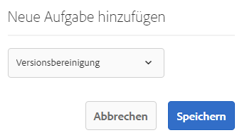
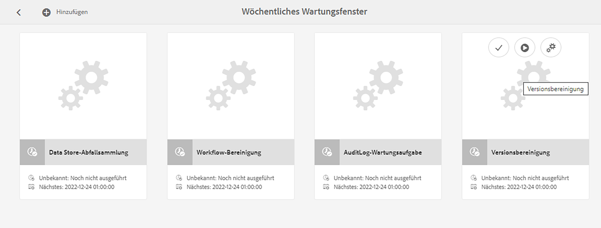

# Überwachen und Verwalten der Adobe Experience Manager-Instanz{#monitoring-and-maintaining-your-aem-instance}

Nach der Bereitstellung Ihrer AEM-Instanzen müssen Sie deren Betrieb, Leistung und Integrität überwachen und aufrechterhalten.

Um potenzielle Probleme erkennen zu können, müssen Sie unbedingt wissen, wie Ihr System unter normalen Bedingungen aussieht und sich verhält. Dies lässt sich am besten durch die Überwachung des Systems und das Sammeln von Informationen im Laufe der Zeit erreichen.

| Überprüfen | Zu beachten | Kommentar/Aktionen |
|---|---|---|
| Backup-Plan. |  | Gehen Sie wie folgt vor, um [ein Backup für Ihre Instanz zu erstellen](/help/sites-deploying/monitoring-and-maintaining.md#backups). |
| Plan für die Notfallwiederherstellung | Richtlinien Ihres Unternehmens für die Notfallwiederherstellung. |  |
| Ein System zur Fehlersuche steht Ihnen für das Problem-Reporting zur Verfügung. | Zum Beispiel [Bugzilla](https://www.bugzilla.org/), [Jira](https://www.atlassian.com/software/jira) oder eines von vielen anderen. |  |
| Dateisysteme werden überwacht. | Das CRX-Repository „friert ein“, wenn nicht genügend freier Speicherplatz vorhanden ist. Es wird fortgesetzt, sobald wieder Speicherplatz frei wird. | „`*ERROR* LowDiskSpaceBlocker`“-Meldungen werden in der Protokolldatei angezeigt, wenn der Speicherplatz zur Neige geht. |
| [Protokolldateien](/help/sites-deploying/monitoring-and-maintaining.md#working-with-audit-records-and-log-files) werden überwacht. |  |  |
| Die Systemüberwachung wird (ständig) im Hintergrund ausgeführt. | Einschließlich CPU-, Arbeitsspeicher-, Datenträger- und Netzwerkauslastung. Verwendet wird z. B. iostat / vmstat / perfmon. | Protokollierte Daten werden visualisiert und können zur Verfolgung von Leistungsproblemen verwendet werden. Auch Rohdaten sind verfügbar. |
| [Die AEM-Leistung wird überwacht](/help/sites-deploying/monitoring-and-maintaining.md#monitoring-performance). | Einschließlich [Anfragezähler](/help/sites-deploying/monitoring-and-maintaining.md#request-counters) zur Überwachung des Traffic-Niveaus. | Wird ein signifikanter oder langfristiger Leistungsverlust festgestellt, sollte eine eingehende Untersuchung durchgeführt werden. |
| Sie überwachen Ihre [Replikationsagenten](/help/sites-deploying/monitoring-and-maintaining.md#monitoring-your-replication-agents). |  |  |
| Regelmäßige Bereinigung von Workflow-Instanzen. | Repository-Größe und Workflow-Leistung. | Siehe [Regelmäßige Bereinigung von Workflow-Instanzen](/help/sites-administering/workflows-administering.md#regular-purging-of-workflow-instances). |

## Backups {#backups}

Es hat sich bewährt, Backups für Folgendes zu erstellen:

* Ihre Software-Installation: vor/nach wichtigen Konfigurationsänderungen
* Der Inhalt des Repositorys: regelmäßig

Ihr Unternehmen verfügt wahrscheinlich über eine Backup-Richtlinie, der Sie folgen. Weitere Aspekte, was und wann gesichert werden sollte, sind unter anderem die folgenden:

* Wie wichtig das System und die Daten sind.
* Wie oft Änderungen an der Software oder an den Daten vorgenommen werden.
* Datenmenge und Kapazität können gelegentlich ein Problem darstellen, ebenso wie die benötigte Zeit, um Sicherungskopien zu erstellen.
* Ob die Sicherung durchgeführt werden kann, während Benutzende online sind, und welche Auswirkungen auf die Leistung zu erwarten sind.
* Die geografische Verteilung der Benutzenden: wann ist der beste Zeitpunkt für eine Sicherung (um Auswirkungen so gering wie möglich zu halten)?
* Die Richtlinie Ihres Unternehmens für die Notfallwiederherstellung. Es gibt Richtlinien, anhand derer gesicherte Daten gespeichert werden müssen (z. B. Offsite und auf bestimmten Medien).

Häufig wird ein vollständiges Backup in regelmäßigen Abständen durchgeführt (z. B. täglich, wöchentlich oder monatlich), wobei inkrementelle Backups dazwischen liegen (z. B. stündlich, täglich oder wöchentlich).

>[!CAUTION]
>
>Tests bei der Implementierung von Backups Ihrer Produktionsinstanzen *müssen* vorgenommen werden, um sicherzustellen, dass Sie die Sicherung erfolgreich wiederherstellen können.
>
>Ohne diese Prüfung ist das Backup womöglich nutzlos (im schlimmsten Fall).

>[!NOTE]
>
>Weitere Informationen zur Backup-Leistung finden Sie im Abschnitt [Backup-Leistung](/help/sites-deploying/configuring-performance.md#backup-performance).

### Erstellen eines Backups Ihrer installierten Software {#backing-up-your-software-installation}

Erstellen Sie nach der Installation oder nach wesentlichen Änderungen der Konfiguration ein Backup Ihrer Software-Installation.

Um diese Aufgabe zu bewältigen, müssen Sie erst [ein Backup des gesamten Repositorys erstellen](#backing-up-your-repository) und dann folgende Schritte ausführen:

1. AEM anhalten.
1. Erstellen Sie eine vollständige Sicherungskopie von `<cq-installation-dir>` vom Dateisystem aus.

>[!CAUTION]
>
>Falls Sie einen Anwendungs-Server eines Drittanbieters verwenden, gibt es möglicherweise zusätzliche Ordner an anderen Speicherorten, die Sie ebenfalls sichern müssen. Informationen dazu, wie Sie Anwendungs-Server installieren, finden Sie unter [Installieren von AEM mit einem Anwendungs-Server](/help/sites-deploying/application-server-install.md).

>[!CAUTION]
>
>Das inkrementelle Sichern des Dateidatenspeichers wird unterstützt. Wenn Sie inkrementelle Backups anderer Komponenten (z. B. der Lucene-Indizes) erstellen möchten, stellen Sie sicher, dass gelöschte Dateien auch im Backup als gelöscht markiert sind.

>[!NOTE]
>
>Die Festplattenspiegelung kann ebenfalls als Sicherungsmechanismus verwendet werden.

### Erstellen eines Backups Ihres Repositorys {#backing-up-your-repository}

Der Abschnitt [Sicherung und Wiederherstellung](/help/sites-administering/backup-and-restore.md) in der CRX-Dokumentation behandelt alle Fragen im Zusammenhang mit Backups des CRX-Repositorys.

Details zum Erstellen eines „Hot“-Backups im Online-Betrieb finden Sie unter [Erstellen eines Online-Backups](/help/sites-administering/backup-and-restore.md#online-backup).

## Versionsbereinigung {#version-purging}

Das Tool **Versionen bereinigen** dient zum Bereinigen der Versionen eines Knotens oder einer Hierarchie von Knoten in Ihrem Repository. Der Hauptzweck ist die Verkleinerung des Repositorys durch Löschen alter Knotenversionen.

In diesem Abschnitt werden die Wartungsaufgaben im Zusammenhang mit der Versionsfunktion von AEM behandelt. Mit dem Tool **Versionsbereinigung** können Sie Versionen eines Knotens oder eine Knotenhierarchie Ihres Repository bereinigen. Der Hauptzweck ist die Verkleinerung des Repositorys durch Löschen alter Knotenversionen.

### Überblick {#overview}

Das Tool **Versionen bereinigen** ist als wöchentliche Wartungsaufgabe verfügbar. Vor der erstmaligen Verwendung muss die Aufgabe hinzugefügt und dann konfiguriert werden. Danach kann sie auf Anfrage oder wöchentlich ausgeführt werden.

### Bereinigen von Versionen einer Website {#purging-versions-of-a-web-site}

Um Versionen einer Website zu löschen, gehen Sie folgendermaßen vor:

1. Navigieren Sie zur **[Tools](/help/sites-administering/tools-consoles.md)**-**Konsole** und wählen Sie **Vorgang** > **Wartung** und dann **Wöchentliches Wartungsfenster** aus.

1. Wählen Sie **+ Hinzufügen** aus der oberen Symbolleiste aus.

   

1. Wählen Sie **Versionsbereinigung** aus der Dropdown-Liste im Dialogfeld **Neue Aufgabe hinzufügen** aus. Klicken Sie dann auf **Speichern**.

   

1. Die Aufgabe **Versionsbereinigung** wird hinzugefügt. Verwenden Sie die Kartenaktionen für folgende Aufgaben:
   * Auswählen – zeigt zusätzliche Aktionen in der oberen Symbolleiste an
   * Ausführen – führt die konfigurierte Bereinigung sofort aus
   * Konfigurieren – konfiguriert die wöchentliche Bereinigungsaufgabe

   

1. Wählen Sie die Aktion **Konfigurieren** zum Öffnen der Web-Konsole für **Day CQ WCM Version Purge Task** aus. Hier können Sie Folgendes konfigurieren:

   

   * **Bereinigungspfade**
Legen Sie den Startpfad des zu löschenden Inhalts fest, zum Beispiel: `/content/wknd`.

     >[!CAUTION]
     >
     >Adobe empfiehlt, für jede Ihrer Websites mehrere Pfade zu definieren.
     >
     >Wenn Sie einen Pfad mit zu vielen untergeordneten Elementen definieren, kann die Bereinigung erheblich mehr Zeit in Anspruch nehmen.

   * **Versionen rekursiv bereinigen**

      * Deaktivieren Sie diese Option, wenn Sie nur den durch den Pfad definierten Knoten löschen möchten.
      * Wählen Sie aus, ob Sie den durch Ihren Pfad und seine untergeordneten Pfade definierten Knoten löschen möchten.

   * **Maximale Anzahl von Versionen**
Legen Sie die maximale Anzahl von Versionen (für jeden Knoten) fest, die Sie beibehalten möchten. Lassen Sie das Feld frei, falls diese Einstellung nicht verwendet werden soll.

   * **Mindestanzahl von Versionen**
Legen Sie die Mindestanzahl von Versionen (für jeden Knoten) fest, die Sie beibehalten möchten. Lassen Sie das Feld frei, falls diese Einstellung nicht verwendet werden soll.

   * **Maximales Versionsalter**
Legen Sie das maximale Versionsalter in Tagen (für jeden Knoten) fest, den Sie beibehalten möchten. Lassen Sie das Feld frei, falls diese Einstellung nicht verwendet werden soll.

   Dann **Speichern**.

1. Navigieren/kehren Sie zurück zum Fenster **Wöchentliches Wartungsfenster** und klicken Sie auf **Ausführen**, um den Prozess sofort zu starten.

>[!CAUTION]
>
>Sie können das Dialogfeld der klassischen Benutzeroberfläche verwenden, um einen [Probelauf](#analyzing-the-console) Ihrer Konfiguration durchzuführen:
>
>* http://localhost:4502/etc/versioning/purge.html
>
>Bereinigte Knoten können ohne Wiederherstellung des Repositorys nicht zurückgesetzt werden. Da eine fehlerfreie Konfiguration sehr wichtig ist, sollten Sie vor einer Bereinigung immer einen Probelauf durchführen.

#### Probelauf – Analyse der Konsole {#analyzing-the-console}

Die klassische Benutzeroberfläche bietet eine **Probelauf**-Option von:

* http://localhost:4502/etc/versioning/purge.html

Der Prozess listet alle Knoten auf, die verarbeitet wurden. Während des Prozesses kann ein Knoten einen der folgenden Statuswerte haben:

* `ignore (not versionnable)`: Der Knoten unterstützt keine Versionierung und wird beim Bereinigungsvorgang ignoriert.

* `ignore (no version)`: Für den Knoten sind keine Versionen vorhanden und er wird beim Bereinigungsvorgang ignoriert.

* `retained`: Der Knoten wurde nicht gelöscht.
* `purged`: Der Knoten wurde gelöscht.

Darüber hinaus stellt die Konsole nützliche Informationen zu den Versionen bereit: 

* `V 1.0`: Die Versionsnummer.
* `V 1.0.1`&#42;: Der Stern gibt an, dass die Version die aktuelle (Basis-)Version ist und nicht bereinigt werden kann.

* `Thu Mar 15 2012 08:37:32 GMT+0100`: Das Datum der Version.

Im Folgenden ein Beispiel:

* Die **[!DNL Shirts]**-Versionen werden bereinigt, da ihr Versionsalter mehr als zwei Tage beträgt.
* Die Versionen unter **[!DNL Tonga Fashions!]** werden gelöscht, da die Anzahl der Versionen größer als 5 ist.


## Arbeiten mit Auditdatensätzen und Protokolldateien {#working-with-audit-records-and-log-files}

Auditdatensätze und Protokolldateien für Adobe Experience Manager (AEM) finden sich an diversen Speicherorten. Im Folgenden erhalten Sie einen Überblick darüber, was Sie finden und wo Sie es finden können.

### Arbeiten mit Protokollen {#working-with-logs}

AEM WCM-System zeichnet detaillierte Protokolle auf. Nach dem Entpacken und Aufrufen der Schnellstart-Funktion finden Sie Protokolle an den folgenden Speicherorten:

* `<cq-installation-dir>/crx-quickstart/logs/`

* `<cq-installation-dir>/crx-quickstart/repository/`

#### Rotation von Protokolldateien {#log-file-rotation}

Die Rotation von Protokolldateien bezieht sich auf den Prozess, der das Wachstum der Datei begrenzt, indem regelmäßig eine Datei erstellt wird. In AEM wird eine Protokolldatei mit dem Namen `error.log` täglich nach den vorgegebenen Regeln rotiert:

* Die Datei `error.log` wird nach dem Muster {Original_Dateiname} `.yyyy-MM-dd` umbenannt. Zum Beispiel wird am 11. Juli 2010 die aktuelle Protokolldatei in `error.log-2010-07-10` umbenannt und dann eine neue `error.og` erstellt.

* Vorherige Protokolldateien werden nicht gelöscht. Also sind Sie dafür verantwortlich, alte Protokolldateien regelmäßig zu löschen, um den Speicherbedarf zu beschränken.

>[!NOTE]
>
>Wenn Sie Ihre AEM-Installation aktualisieren, bleibt jede vorhandene Protokolldatei, die nicht mehr von AEM verwendet wird, auf dem Datenträger. Sie können diese ohne Risiko löschen. Alle neuen Protokolleinträge werden in die neuen Protokolldateien geschrieben.

### Suchen nach Protokolldateien {#finding-the-log-files}

Verschiedene Protokolldateien werden auf dem Datei-Server gespeichert, auf dem Sie AEM installiert haben:

* `<cq-installation-dir>/crx-quickstart/logs`

   * `access.log`
Hier werden alle Zugriffsanfragen an das AEM WCM-System und das Repository registriert.

   * `audit.log`
Hier werden Moderationsaktionen registriert.

   * `error.log`
Hier werden Fehlermeldungen (mit unterschiedlichem Schweregrad) registriert.

   * [`ImageServer-<PortId>-yyyy>-<mm>-<dd>.log`](https://experienceleague.adobe.com/docs/dynamic-media-developer-resources/image-serving-api/image-serving-api/config-admin/server-logging/c-image-server-log.html?lang=de)
Dieses Protokoll wird nur verwendet, wenn [!DNL Dynamic Media] aktiviert ist. Es stellt die Statistiken und analytische Informationen bereit, die für die Analyse des Verhaltens des internen ImageServer-Prozesses verwendet werden.

   * `request.log`
Hier werden alle Zugriffsanfragen zusammen mit der Antwort registriert.

   * [`s7access-<yyyy>-<mm>-<dd>.log`](https://experienceleague.adobe.com/docs/dynamic-media-developer-resources/image-serving-api/image-serving-api/config-admin/server-logging/c-access-log.html?lang=de)
Dieses Protokoll wird nur verwendet, wenn [!DNL Dynamic Media] aktiviert ist. Das s7access-Protokoll zeichnet alle Anfragen auf, die an [!DNL Dynamic Media] bis `/is/image` und `/is/content` gemacht wurden.

   * `stderr.log` Enthält Fehlermeldungen (ebenfalls mit unterschiedlichem Schweregrad), die beim Starten generiert werden. Standardmäßig wird für die Protokollebene Folgendes festgelegt `Warning` (`WARN`)

   * `stdout.log`
Enthält Protokollmeldungen, die auf Ereignisse beim Starten verweisen.

   * `upgrade.log`
Bietet ein Protokoll aller Upgrade-Vorgänge, die von den Paketen `com.day.compat.codeupgrade` und `com.adobe.cq.upgradesexecutor` ausgeführt werden.

* `<cq-installation-dir>/crx-quickstart/repository/segmentstore`

   * `journal.log`
Zeigt Daten des Revisionsjournals an.

>[!NOTE]
>
>Die Protokolle „ImageServer“ und „s7access“ sind nicht im Paket **Alles herunterladen** enthalten, das von der Seite **system/console/status-Bundlelist** aus erstellt wird. Bei Problemen mit [!DNL Dynamic Media] hängen Sie zu Support-Zwecken die Protokolle „ImageServer“ und „s7access“ an, wenn Sie sich an den Kunden-Support wenden.

### Aktivieren der DEBUG-Protokollebene {#activating-the-debug-log-level}

Die standardmäßige Protokollebene ([Apache Sling-Protokollierungskonfiguration](/help/sites-deploying/osgi-configuration-settings.md#apacheslingloggingconfiguration)) ist „Information“, d. h. es werden keine Debugging-Meldungen protokolliert.

Um die Debugging-Protokollebene für eine Protokollierung zu aktivieren, müssen Sie für die Eigenschaften `org.apache.sling.commons.log.level` im Repository den Wert „debug“ festlegen. Beispielsweise auf `/libs/sling/config/org.apache.sling.commons.log.LogManager`, um die [globale Apache Sling-Protokollierung](/help/sites-deploying/osgi-configuration-settings.md#apacheslingloggingconfiguration) zu konfigurieren.

>[!CAUTION]
>
>Lassen Sie das Protokoll nicht länger als nötig auf der Debug-Protokollebene, da es zahlreiche Protokolleinträge generiert, was Ressourcen verbraucht.

Eine Zeile in der Debugging-Datei beginnt üblicherweise mit „DEBUG“, gefolgt von der Protokollebene, der Installationsaktion und der Protokollmeldung. Beispiel:

```shell
DEBUG 3 WebApp Panel: WebApp successfully deployed
```

Die Protokollebenen lauten wie folgt:

| 0 | Schwerwiegender Fehler | Die Aktion ist fehlgeschlagen und das Installationsprogramm kann nicht fortgesetzt werden. |
|---|---|---|
| 1 | Fehler | Die Aktion ist fehlgeschlagen. Die Installation wird fortgesetzt, ein Teil des AEM WCM-Systems wurde jedoch nicht richtig installiert und funktioniert nicht. |
| 2 | Warnung | Die Aktion war erfolgreich, stieß aber auf Probleme. Das AEM WCM-System funktioniert möglicherweise nicht ordnungsgemäß. |
| 3 | Informationen | Die Aktion war erfolgreich. |

### Erstellen einer benutzerdefinierten Protokolldatei {#create-a-custom-log-file}

>[!NOTE]
>
>Bei der Arbeit mit Adobe Experience Manager gibt es mehrere Methoden zur Verwaltung der Konfigurationseinstellungen für solche Dienste. Weitere Einzelheiten und empfohlene Vorgehensweisen finden Sie unter [Konfiguration von OSGi](/help/sites-deploying/configuring-osgi.md).

Unter bestimmten Umständen müssen Sie möglicherweise eine benutzerdefinierte Protokolldatei mit einer anderen Protokollebene erstellen. Gehen Sie dazu im Repository wie folgt vor:

1. Erstellen Sie, falls nicht bereits vorhanden, einen neuen Konfigurationsordner (`sling:Folder`) für das Projekt `/apps/<project-name>/config`.
1. Erstellen Sie unter `/apps/<project-name>/config` einen Knoten für die neue [Apache Sling Logging Logger-Konfiguration](/help/sites-deploying/osgi-configuration-settings.md#apacheslingloggingloggerconfigurationfactoryconfiguration):

   * Name: `org.apache.sling.commons.log.LogManager.factory.config-<identifier>`

     wobei `<identifier>` durch einen freien Text ersetzt wird, den Sie eingeben (müssen), um die Instanz zu identifizieren (diese Information darf nicht weggelassen werden).

     Beispiel: `org.apache.sling.commons.log.LogManager.factory.config-MINE`

   * Typ: `sling:OsgiConfig`

   >[!NOTE]
   >
   >Es gibt zwar keine spezifischen technischen Anforderungen, es ist jedoch ratsam, für `<identifier>` einen eindeutigen Parameter zu verwenden.

1. Legen Sie die folgenden Eigenschaften des Knotens fest:

   * Name: `org.apache.sling.commons.log.file`

     Typ: String

     Wert: Angabe der Protokolldatei; Beispiel: `logs/myLogFile.log`

   * Name: `org.apache.sling.commons.log.names`

     Typ: Zeichenfolge[] (Zeichenfolge + Mehrfach)

     Wert: Angabe der OSGi-Dienste, für die der Logger Meldungen protokollieren soll, beispielsweise alle folgenden:

      * `org.apache.sling`
      * `org.apache.felix`
      * `com.day`

   * Name: `org.apache.sling.commons.log.level`

     Typ: String

     Wert: Angabe der erforderlichen Protokollebene (`debug`, `info`, `warn` oder `error`), zum Beispiel `debug`

   * Konfigurieren Sie ggf. weitere Parameter:

      * Name: `org.apache.sling.commons.log.pattern`

        Typ: `String`

        Wert: Angabe des Musters der Protokollmeldung nach Bedarf; Beispiel:

        `{0,date,dd.MM.yyyy HH:mm:ss.SSS} *{4}* [{2}] {3} {5}`

   >[!NOTE]
   >
   >`org.apache.sling.commons.log.pattern` unterstützt bis zu sechs Argumente.
   >
   >{0} Der Zeitstempel vom Typ `java.util.Date`
   >
   >{1} Die Protokollmarkierung
   >
   >{2} Der Name des aktuellen Threads
   >
   >{3} Der Name des Loggers
   >
   >{4} Die Protokollierungsebene
   >
   >{5} Die Protokollmeldung
   >
   >Falls der Protokollaufruf ein `Throwable` enthält, wird der Stacktrace an die Meldung angefügt.

   >[!CAUTION]
   >
   >„org.apache.sling.commons.log.names“ muss einen Wert enthalten.

   >[!NOTE]
   >
   >Die Protokollierungspfade sind vom Speicherort-`crx-quickstart`abhängig.
   >
   >Eine Protokolldatei wie:
   >
   >`logs/thelog.log`
   >
   >wird daher geschrieben in:
   >
   >`<cq-installation-dir>/crx-quickstart/logs/thelog.log`.
   >
   >Und eine Protokolldatei wie:
   >
   >`../logs/thelog.log`
   >
   >wird in folgendes Verzeichnis geschrieben:
   >
   >`<cq-installation-dir>/logs/`\
   >(d. h. neben `<cq-installation-dir>/crx-quickstart/`)

1. Dieser Schritt muss nur ausgeführt werden, wenn ein neuer Writer erforderlich ist (d. h. mit einer Konfiguration, die von derjenigen des standardmäßigen Writers abweicht).

   >[!CAUTION]
   >
   >Eine neue Logging-Writer-Konfiguration ist nur erforderlich, wenn die vorhandene Standardkonfiguration nicht geeignet ist.
   >
   >Wenn kein expliziter Writer konfiguriert ist, erstellt das System automatisch einen impliziten Writer auf Basis der Standardkonfiguration.

   Erstellen Sie unter `/apps/<project-name>/config` einen Knoten für die neue [Apache Sling Logging-Primär-Konfiguration](/help/sites-deploying/osgi-configuration-settings.md#apacheslingloggingwriterconfigurationfactoryconfiguration):

   * Name: `org.apache.sling.commons.log.LogManager.factory.writer-<identifier>` (ein Writer)

     Wie beim Logger wird `<identifier>` durch einen freien Text ersetzt, den Sie eingeben (müssen), um die Instanz zu identifizieren (diese Information darf nicht weggelassen werden). Beispiel: `org.apache.sling.commons.log.LogManager.factory.writer-MINE`

   * Typ: `sling:OsgiConfig`

   >[!NOTE]
   >
   >Es gibt zwar keine spezifischen technischen Anforderungen, es ist jedoch ratsam, für `<identifier>` einen eindeutigen Parameter zu verwenden.

   Legen Sie die folgenden Eigenschaften des Knotens fest:

   * Name: `org.apache.sling.commons.log.file`

     Typ: `String`

     Wert: Angabe der Protokolldatei in einer Weise, dass sie mit der im Logger angegebenen Datei übereinstimmt.

     Für dieses Beispiel: `../logs/myLogFile.log`.

   * Konfigurieren Sie ggf. weitere Parameter:

      * Name: `org.apache.sling.commons.log.file.number`

        Typ: `Long`

        Wert: Angabe der Anzahl der Protokolldateien, die Sie beibehalten möchten, z. B. `5`

      * Name: `org.apache.sling.commons.log.file.size`

        Typ: `String`

        Wert: Geben Sie diesen wie erforderlich an, um die Dateirotation nach Größe/Datum zu steuern; beispielsweise `'.'yyyy-MM-dd`

   >[!NOTE]
   >
   >`org.apache.sling.commons.log.file.size` steuert die Rotation der Protokolldatei durch eine der folgenden Einstellungen:
   >
   >* eine maximalen Dateigröße
   >* einen Zeit-/Terminplan
   >
   >um anzuzeigen, wann eine neue Datei erstellt wird (und die vorhandene Datei gemäß dem Namensmuster umbenannt wird).
   >
   >* Eine Größenbeschränkung kann mit einer Zahl angegeben werden. Falls keine Größeneinheit angegeben ist, wird die Anzahl als Bytes interpretiert. Alternativ können Sie einen der folgenden Indikatoren hinzufügen: `KB`, `MB` oder `GB` (Groß-/Kleinschreibung wird ignoriert).
   >* Sie können einen Zeit-/Terminplan nach dem `java.util.SimpleDateFormat`-Muster angeben. In diesem wird der Zeitraum definiert, nach dem die Datei rotiert wird. Außerdem das Suffix, das an die gedrehte Datei angehängt wird (zur Identifizierung).
   >
   >Der Standardwert lautet „.“jjjj-MM-tt (für die tägliche Protokollrotation).
   >
   >Beispielsweise wird am 20. Januar 2010 um Mitternacht (oder sobald die erste Protokollmeldung nach diesem Zeitpunkt ausgegeben wird), ../logs/error.log in ../logs/error.log.2010-01-20 umbenannt. Die Protokollierung für den 21. Januar wird an eine neue und leere Datei ../logs/error.log ausgegeben, bis diese beim nächsten Tageswechsel rotiert wird.
   >
   >| `'.'yyyy-MM` | Rotation zu Beginn jedes Monats |
   >|---|---|
   >| `'.'yyyy-ww` | Rotation am ersten Tag jeder Woche (hängt vom Gebietsschema ab). |
   >| `'.'yyyy-MM-dd` | Rotation täglich um Mitternacht. |
   >| `'.'yyyy-MM-dd-a` | Rotation täglich um Mitternacht und am Mittag. |
   >| `'.'yyyy-MM-dd-HH` | Rotation zu jeder vollen Stunde. |
   >| `'.'yyyy-MM-dd-HH-mm` | Rotation zu Beginn jeder Minute. |
   >
   >Hinweis: Bei der Angabe einer Uhrzeit/eines Datums ist Folgendes zu beachten:
   >
   >1. Sie sollten wörtlichen Text innerhalb eines Paares einfacher Anführungszeichen (&#39; &#39;) „ausklammern“;
   >
   >    Dies verhindert, dass bestimmte Zeichen als Musterbuchstaben interpretiert werden.
   >
   >1. Verwenden Sie nur Zeichen, die für einen gültigen Dateinamen an einer beliebigen Stelle in der Option zulässig sind.

1. Lesen Sie Ihre neue Protokolldatei mit dem Tool Ihrer Wahl.

   Die Protokolldatei, die für dieses Beispiel erstellte wurde, lautet `../crx-quickstart/logs/myLogFile.log`.

Die Felix-Konsole enthält auch Informationen zum Sling Log-Support unter `../system/console/slinglog`, beispielsweise, `https://localhost:4502/system/console/slinglog`.

### Auffinden der Auditdatensätze {#finding-the-audit-records}

Auditdatensätze werden als Nachweis darüber aufbewahrt, wer wann welche Aktion vorgenommen hat. Für AEM WCM- bzw. OSGi-Ereignisse werden unterschiedliche Auditdatensätze generiert.

#### Bei der Seitenbearbeitung angezeigte AEM WCM-Auditdatensätze {#aem-wcm-audit-records-shown-when-page-authoring}

1. Öffnen Sie eine Seite.
1. Im Sidekick können Sie die Registerkarte mit dem Sperrsymbol auswählen und dann zweimal auf **Auditprotokoll…** klicken
1. Ein neues Fenster mit der Liste der Auditdatensätze für die aktuelle Seite wird geöffnet.

   

1. Klicken Sie auf **OK**, wenn Sie das Fenster schließen möchten.

#### AEM WCM-Auditdatensätze im Repository {#aem-wcm-auditing-records-within-the-repository}

Auditdatensätze werden im Ordner `/var/audit` je nach Ressource gespeichert. Sie können einen Drilldown durchführen, bis Sie individuelle Datensätze und die darin enthaltenen Informationen sehen.

Diese Einträge enthalten dieselben Informationen, die beim Bearbeiten einer Seite angezeigt werden.

#### OSGi-Auditdatensätze aus der Web-Konsole {#osgi-audit-records-from-the-web-console}

OSGi-Ereignisse generieren ebenfalls Auditdatensätze, die Sie in der AEM-Web-Konsole auf der Registerkarte **Konfigurationsstatus** unter **Protokolldateien** anzeigen können:


## Überwachen der Replikationsagenten {#monitoring-your-replication-agents}

Sie können Ihre [Replikations-Warteschlangen](/help/sites-deploying/replication.md) überwachen, um zu erkennen, wann eine Warteschlange ausfällt oder blockiert ist – was wiederum auf ein Problem mit einer Publishing-Instanz oder einem externen System hinweisen könnte:

* Sind alle erforderlichen Warteschlangen aktiviert?
* Sind deaktivierte Warteschlangen noch erforderlich?
* Alle `enabled` Warteschlangen sollten den Status `idle` oder `active` aufweisen, was einem normalem Betrieb entspricht. Keine der Warteschlangen sollte den Status `blocked` aufweisen, da dies oft auf Probleme auf Empfängerseite hinweist.

* Wenn die Warteschlange im Laufe der Zeit größer wird, kann dies auf eine Blockierung hindeuten.

So überwachen Sie einen Replikationsagenten:

1. Greifen Sie auf die Registerkarte **Tools** in AEM zu.
1. Klicken Sie auf **Replikation**.
1. Klicken Sie zweimal auf den Link zu Agenten für die entsprechende Umgebung (entweder im linken oder im rechten Bereich), zum Beispiel **Agenten für Authoring**.

   Das erscheinende Fenster zeigt eine Übersicht über alle Replikationsagenten für die Authoring-Umgebung, einschließlich ihres Ziels und Status.

1. Klicken Sie auf den Link mit dem entsprechenden Agentennamen, um detaillierte Informationen zu diesem Agenten anzuzeigen:

   

   Folgende Informationen/Optionen sind verfügbar:

   * Überprüfen, ob der Agent aktiviert ist.
   * Anzeige der Zielgruppe jeder Replikation.
   * Überprüfen, ob die Replikations-Warteschlange aktiv (aktiviert) ist.
   * Überprüfen, ob sich Elemente in der Warteschlange befinden.
   * **Aktualisieren** oder **Löschen**, um die Anzeige der Warteschlangeneinträge zu aktualisieren. Auf diese Weise können Sie Elemente sehen, die in die Warteschlange eintreten oder sie verlassen.
   * **Protokoll anzeigen**, um auf das Protokoll jeder Aktion des Replikationsagenten zuzugreifen.
   * **Testen der Verbindung** mit der Zielinstanz.
   * **Erzwingen einer Wiederholung** für alle Warteschlangenelemente bei Bedarf.

   >[!CAUTION]
   >
   >Verwenden Sie nicht den Link „Verbindung testen“ für den Postausgang „Rückwärtsreplikation“ auf einer Publish-Instanz.
   >
   >Falls ein Replikationstest für eine Warteschlange in einem Postausgang durchgeführt wird, werden Elemente, die älter als die Testreplikation sind, bei jeder Rückwärtsreplikation erneut verarbeitet.
   >
   >Falls solche Elemente in einer Warteschlange vorliegen, können Sie sie mit der folgenden XPath-JCR-Abfrage suchen und entfernen.
   >
   >`/jcr:root/var/replication/outbox//*[@cq:repActionType='TEST']`

Auch hier können Sie eine Lösung entwickeln, um alle Replikationsagenten (unter `/etc/replication/author` oder `/etc/replication/publish`) zu erkennen und den Status des jeweiligen Agenten (`enabled`, `disabled`) sowie den der zugrunde liegenden Warteschlange (`active`, `idle`, `blocked`) zu überprüfen.

## Überwachung der Leistung {#monitoring-performance}

Die [Leistungsoptimierung](/help/sites-deploying/configuring-performance.md) ist ein interaktiver Prozess, der während der Entwicklung im Mittelpunkt steht. Nach der Bereitstellung wird sie nach bestimmten Intervallen oder Ereignissen überprüft.

Die für das Erfassen von Informationen eingesetzten Methoden können auch zur kontinuierlichen Überwachung verwendet werden.

>[!NOTE]
>
>Spezifische [Konfigurationen, die die Leistung verbessern](/help/sites-deploying/configuring-performance.md#configuring-for-performance), können ebenfalls überprüft werden.

Nachfolgend finden Sie eine Liste mit häufigen Leistungsproblemen sowie Vorschlägen, wie Sie diese erkennen und beheben können.

| Bereich | Symptom | Zum Steigern der Kapazität: | Zum Reduzieren des Volumens: |
|---|---|---|---|
| Client | Hohe Client-CPU-Auslastung. | Installieren Sie eine Client-CPU mit höherer Leistung. | Vereinfachen Sie das (HTML-)Layout. |
|   | Geringe CPU-Auslastung des Servers. | Aktualisieren Sie auf einen schnelleren Browser. | Optimieren Sie den Client-seitigen Cache. |
|   | Einige Clients sind schnell, andere langsamer. |  |  |
| Server |  |  |  |
| Netzwerk | Geringe CPU-Auslastung sowohl auf Servern als auch auf Clients. | Entfernen Sie alle Netzwerkengpässe. | Verbessern/optimieren Sie die Konfiguration des Client-Cache. |
|   | Die lokale Suche auf dem Server ist (vergleichsweise) schnell. | Vergrößern Sie die Netzwerkbandbreite. | Verringern Sie das „Gewicht“ Ihrer Web-Seiten (z. B. weniger Bilder, optimierte HTML). |
| Webserver | Die CPU-Auslastung auf dem Webserver ist hoch. | Clustern Sie Ihre Webserver. | Reduzieren Sie die Treffer pro Seite (Besuch). |
|   |  | Verwenden Sie einen Hardware Load Balancer. |  |
| Programm | Die CPU-Auslastung des Servers ist hoch. | Clustern Sie Ihre AEM-Instanzen. | Suchen Sie nach CPU- und Arbeitsspeicherverschwendung und beseitigen Sie sie (durch Überprüfung von Code, zeitliche Planung der Ausgabe usw.). |
|   | Hoher Speicherverbrauch. |  | Verbessern Sie das Zwischenspeichern auf allen Ebenen. |
|   | Kurze Antwortzeiten. |  | Optimieren Sie Vorlagen und Komponenten (z. B. Struktur oder Logik). |
| Repository |  |  |  |
| Cache |  |  |  |

Leistungsprobleme können eine Reihe von Ursachen haben, die nichts mit Ihrer Website zu tun haben, z. B. eine vorübergehend langsamere Verbindungsgeschwindigkeit, CPU-Auslastung und vieles mehr.

Dies kann sich ebenfalls auf alle Ihre Besuchenden oder nur auf eine Untergruppe auswirken.

All diese Informationen müssen erfasst, sortiert und analysiert werden, bevor Sie entweder die allgemeine Leistung optimieren oder gezielt Probleme lösen können.

* Bevor ein Leistungsproblem auftritt, sollten Sie Folgendes tun:

   * Sammeln Sie so viele Informationen wie möglich, um umfangreiches praktisches Wissen über das System unter normalen Umständen aufzubauen.

* Tun Sie Folgendes, wenn ein Leistungsproblem auftritt:

   * Versuchen Sie, es mit einem (oder vorzugsweise mehreren) Standard-Webbrowsern auf einem anderen Client zu replizieren, von dem Sie wissen, dass er eine hohe allgemeine Leistung hat, und/oder auf dem Server selbst (falls möglich).
   * Überprüfen Sie, ob sich in einem entsprechend gewählten Zeitraum irgendetwas (im Zusammenhang mit dem System) geändert hat und ob eine dieser Änderungen die Leistung beeinflusst haben könnte.
   * Stellen Sie Fragen wie:

      * Tritt das Problem nur zu bestimmten Zeiten auf?
      * Tritt das Problem nur auf bestimmten Seiten auf?
      * Sind andere Anfragen betroffen?

   * Sammeln Sie so viele Informationen wie möglich, um sie mit Ihrem Wissen über das System unter normalen Umständen zu vergleichen:

### Tools zur Leistungsüberwachung und -analyse {#tools-for-monitoring-and-analyzing-performance}

Im Folgenden finden Sie einen kurzen Überblick über einige der verfügbaren Tools zur Leistungsüberwachung und -analyse.

Einige dieser Tools hängen von Ihrem Betriebssystem ab.

<table>
 <tbody>
  <tr>
   <td>Tool</td>
   <td>Zur Analyse von…</td>
   <td>Verwendung/Weitere Informationen:</td>
  </tr>
  <tr>
   <td>request.log</td>
   <td>Antwortzeiten und parallele Verarbeitung.</td>
   <td><a href="#interpreting-the-request-log">Interpretieren von request.log</a>.</td>
  </tr>
  <tr>
   <td>truss/strace</td>
   <td>Seitenladevorgänge</td>
   <td><p>Unix-/Linux-Befehle zur Verfolgung von Systemaufrufen und Signalen. Erhöhen Sie die Protokollebene auf <code>INFO</code>.</p> <p>Analysieren Sie die Anzahl der Seitenladevorgänge pro Anfrage, welche Seiten geladen wurden usw.</p> </td>
  </tr>
  <tr>
   <td>Thread-Dumps</td>
   <td>Beobachten Sie die JVM-Threads. Identifizieren Sie Konflikte, Sperren und lange Ausführungszeiten.</td>
   <td><p>Abhängig von Betriebssystem:<br /> – Unix/Linux: <code>kill -QUIT &lt;<em>pid</em>&gt;</code><br /> – Windows (Konsolenmodus): Strg-Umbruch<br /> </p> <p>Analyse-Tools sind ebenso verfügbar, wie zum Beispiel <a href="https://github.com/irockel/tda">TDA</a>.<br /> </p> </td>
  </tr>
  <tr>
   <td>Heap-Dumps</td>
   <td>Fehler wegen zu wenig Arbeitsspeicher, die zu langsamer Leistung führen.</td>
   <td><p>Fügen Sie die Option <br /> <code>-XX:+HeapDumpOnOutOfMemoryError</code><br /> zum AEM-Aufruf über Java™ hinzu.</p> <p>Siehe die Seite <a href="https://docs.oracle.com/javase/8/docs/technotes/guides/troubleshoot/prepapp002.html#CEGBHDFH">Optionen/Flags zur Fehlerbehebung für JVM</a>.</p> </td>
  </tr>
  <tr>
   <td>Systemaufrufe</td>
   <td>Identifizieren von Problemen mit der Zeitplanung.</td>
   <td><p>Aufrufe von <code>System.currentTimeMillis()</code> oder <code>com.day.util</code>. Die Zeitplanung wird verwendet, um Zeitstempel aus Ihrem Code oder über <a href="#html-comments">HTML-Kommentare</a> zu generieren.</p> <p><strong>Hinweis:</strong> Implementieren Sie diese Elemente so, dass sie bei Bedarf aktiviert/deaktiviert werden können. Wenn ein System reibungslos läuft, können Sie den Mehraufwand für das Erfassen von Statistiken vermeiden.</p> </td>
  </tr>
  <tr>
   <td>Apache Bench</td>
   <td>Erkennen von Speicherlecks, selektive Analyse der Reaktionszeit.</td>
   <td><p>Die grundlegende Verwendung ist:</p> <p><code>ab -k -n &lt;<em>requests</em>&gt; -c &lt;<em>concurrency</em>&gt; &lt;<em>url</em>&gt;</code></p> <p>Weitere Einzelheiten finden Sie unter <a href="#apache-bench">Apache Bench</a> und auf der <a href="https://httpd.apache.org/docs/2.4/programs/ab.html">ab man-Seite</a>.</p> </td>
  </tr>
  <tr>
   <td>Rechercheanalyse</td>
   <td> </td>
   <td>Führen Sie Suchabfragen offline aus, ermitteln Sie die Antwortzeit der Abfrage, testen und bestätigen Sie den Ergebnissatz.<br /> </td>
  </tr>
  <tr>
   <td>JMeter</td>
   <td>Belastungs- und Funktionstests.</td>
   <td><a href="https://jmeter.apache.org/">https://jmeter.apache.org/</a></td>
  </tr>
  <tr>
   <td>JProfiler</td>
   <td>Detaillierte CPU- und Speicherprofilerstellung.</td>
   <td><a href="https://www.ej-technologies.com/">https://www.ej-technologies.com/</a></td>
  </tr>
  <tr>
   <td>Java™ Flight Recorder</td>
   <td>Java™ Flight Recorder (JFR) ist ein Tool zum Erfassen von Diagnose- und Profildaten zu einer laufenden Java™-Anwendung.</td>
   <td><a href="https://docs.oracle.com/javase/8/docs/technotes/guides/troubleshoot/tooldescr004.html#BABJJEEE">https://docs.oracle.com/javase/8/docs/technotes/guides/troubleshoot/tooldescr004.html#BABJJEEE</a></td>
  </tr>
  <tr>
   <td>JConsole</td>
   <td>Beobachten von JVM-Metriken und -Threads.</td>
   <td><p>Verwendungszweck: jconsole</p> <p>Siehe <a href="https://docs.oracle.com/javase/8/docs/technotes/guides/management/jconsole.html">JConsole</a> und <a href="#monitoring-performance-using-jconsole">Leistungsüberwachung mit JConsole</a>.</p> <p><strong>Hinweis:</strong> Bei JDK 1.8 ist JConsole durch Plug-ins erweiterbar; z. B. Top oder TDA (Thread Dump Analyzer).</p> </td>
  </tr>
  <tr>
   <td>Java™ VisualVM</td>
   <td>Beobachten von JVM-Metriken, Threads, Speicher und Profilen.</td>
   <td><p>Verwendungszweck: visualvm oder visualvm<br /> </p> <p>Siehe <a href="https://docs.oracle.com/javase/8/docs/technotes/guides/visualvm/">visualvm</a> und <a href="#monitoring-performance-using-j-visualvm">Leistungsüberwachung mit (J)VisualVM</a>.</p> <p><strong>Hinweis</strong>: Bei JDK 1.8 ist VisualVM durch Plug-ins erweiterbar. VisualVM wird nach JDK 9 eingestellt. Verwenden Sie stattdessen den Java™ Flight Recorder.</p> </td>
  </tr>
  <tr>
   <td>truss/strace, lsof</td>
   <td>Detaillierte Kernel-Aufruf- und Prozessanalyse (UNIX®).</td>
   <td>Unix-/Linux-Befehle.</td>
  </tr>
  <tr>
   <td>Zeitstatistiken</td>
   <td>Anzeigen von Zeitstatistiken für das Seiten-Rendering.</td>
   <td><p>Zum Anzeigen von Zeitstatistiken für das Seiten-Rendering können Sie <strong>Strg-Umschalt-U</strong> verwenden, wobei in der URL der Wert <code>?debugClientLibs=true</code> festgelegt ist.</p> </td>
  </tr>
  <tr>
   <td>CPU- und Speicher-Profiling-Tool<br /> </td>
   <td><a href="#interpreting-the-request-log">Wird bei der Analyse langsamer Anfragen während der Entwicklung verwendet</a>.</td>
   <td>Zum Beispiel <a href="https://www.yourkit.com/">YourKit</a>. oder der <a href="https://docs.oracle.com/javase/8/docs/technotes/guides/troubleshoot/tooldescr004.html#BABJJEEE">Java™ Flight Recorder</a>.</td>
  </tr>
  <tr>
   <td><a href="#information-collection">Informationserfassung</a></td>
   <td>Der aktuelle Status Ihrer Installation.</td>
   <td>Wenn Sie möglichst viel über Ihre Installation wissen, kann Ihnen dies unter Umständen helfen, die Ursache für die Leistungsänderung herauszufinden und ob diese Änderungen sich begründen lassen. Erfassen Sie diese Metriken in regelmäßigen Abständen, damit Sie signifikante Änderungen direkt sehen.</td>
  </tr>
 </tbody>
</table>

### Interpretieren von request.log {#interpreting-the-request-log}

In dieser Datei werden grundlegende Informationen zu allen Anforderungen an AEM registriert. Sie können wertvolle Schlüsse daraus ziehen.

`request.log` ist eine integrierte Möglichkeit, um herauszufinden, wie lange Anforderungen brauchen. Zu Entwicklungszwecken ist es hilfreich, `tail -f` auf den `request.log` anzuwenden und nach langsamen Systemreaktionen zu suchen. Für die Analyse eines größeren `request.log` empfiehlt sich die [Verwendung von `rlog.jar`, damit Sie nach Systemreaktionszeiten filtern und diese sortieren können](#using-rlog-jar-to-find-requests-with-long-duration-times).

Es wird empfohlen, „langsame“ Seiten aus dem `request.log` zu isolieren und einzeln für eine bessere Leistung zu optimieren. Schließen Sie Leistungsmetriken pro Komponente ein oder verwenden Sie ein Leistungs-Profilierungs-Tool, z. B. ` [yourkit](https://www.yourkit.com/)`.

#### Traffic-Überwachung auf Ihrer Website {#monitoring-traffic-on-your-website}

Das Anfrageprotokoll registriert jede ausgeführte Anfrage sowie die Antwort:

```xml
09:43:41 [66] -> GET /author/y.html HTTP/1.1
09:43:41 [66] <- 200 text/html 797ms
```

Durch Addieren aller GET-Einträge innerhalb bestimmter Zeiträume (z. B. über mehrere 24-Stunden-Zeiträume) können Sie Aussagen zum durchschnittlichen Traffic auf Ihrer Website treffen.

#### Überwachen der Antwortzeiten mit request.log {#monitoring-response-times-with-the-request-log}

Ein guter Ausgangspunkt für Leistungsanalysen ist das Anforderungsprotokoll:

`<cq-installation-dir>/crx-quickstart/logs/request.log`

Das Protokoll sieht wie folgt aus (die Zeilen wurden aus Gründen der Einfachheit gekürzt):

```xml
31/Mar/2009:11:32:57 +0200 [379] -> GET /path/x HTTP/1.1
31/Mar/2009:11:32:57 +0200 [379] <- 200 text/html 33ms
31/Mar/2009:11:33:17 +0200 [380] -> GET /path/y HTTP/1.1
31/Mar/2009:11:33:17 +0200 [380] <- 200 application/json 39ms
```

Dieses Protokoll enthält eine Zeile pro Anforderung oder Antwort:

* Das Datum, an dem jede Anfrage oder Antwort erfolgte.
* der Anzahl an Anforderungen, in eckigen Klammern; Diese Zahl ist für die Anfrage und die Antwort gleich.
* Ein Pfeil, der angibt, ob es sich um eine Anfrage (Pfeil nach rechts) oder eine Antwort (Pfeil nach links) handelt.
* Bei Anfragen enthält die Zeile:

   * die Methode (normalerweise GET, HEAD oder POST)
   * die angefragte Seite
   * das Protokoll

* Bei Antworten enthält die Zeile: 

   * den Status-Code (200 steht für „Erfolg“, 404 steht für „Seite nicht gefunden“);
   * den MIME-Typ
   * die Antwortzeit

Mithilfe von kleinen Skripten können Sie die erforderlichen Informationen aus der Protokolldatei extrahieren und die gewünschten Statistiken zusammenstellen. Aus diesen Statistiken können Sie ableiten, welche Seiten oder Seitentypen langsam sind und ob die Gesamtleistung zufriedenstellend ist.

#### Überwachen der Antwortzeiten für eine Suche mit request.log {#monitoring-search-response-times-with-the-request-log}

Suchanfragen werden auch in der Protokolldatei registriert:

```xml
31/Mar/2009:11:35:34 +0200 [338] -> GET /author/playground/en/tools/search.html?query=dilbert&size=5&dispenc=utf-8 HTTP/1.1
31/Mar/2009:11:35:34 +0200 [338] <- 200 text/html 1562ms
```

Sie können also wie oben beschrieben Skripte verwenden, um die relevanten Informationen zu extrahieren und Statistiken zu erstellen.

Nachdem Sie die Reaktionszeit ermittelt haben, sollten Sie jedoch auch analysieren, warum die Anfrage die entsprechende Zeit benötigt und was getan werden kann, um die Reaktion zu verbessern.

#### Überwachen der Anzahl und Auswirkung gleichzeitiger Benutzer {#monitoring-the-number-and-impact-of-concurrent-users}

Sie können `request.log` verwenden, um die gleichzeitige Nutzung und die Systemreaktion darauf zu überwachen.

Sie sollten testen, wie viele gleichzeitige Benutzer das System unterstützt, bevor es zu Leistungseinbußen kommt. Auch hier können Skripte verwendet werden, um Ergebnisse aus der Protokolldatei zu extrahieren:

* Überwachen Sie, wie viele Anfragen innerhalb eines bestimmten Zeitraums gestellt werden, z. B. in einer Minute.
* Testen Sie die Auswirkungen, wenn eine bestimmte Anzahl von Benutzenden alle die gleichen Anfragen gleichzeitig (so zeitnah wie möglich) stellen. Zum Beispiel, wenn 30 Benutzende gleichzeitig auf **Speichern** klicken.

```xml
31/Mar/2009:11:45:29 +0200 [333] -> GET /author/libs/Personalize/content/statics.close.gif HTTP/1.1
31/Mar/2009:11:45:29 +0200 [334] -> GET /author/libs/Personalize/content/statics.detach.gif HTTP/1.1
31/Mar/2009:11:45:30 +0200 [335] -> GET /author/libs/CFC/content/imgs/logo.rZMNURccynWcTpCxyuBNiTCoiBMmw000.default.gif HTTP/1.1
31/Mar/2009:11:45:32 +0200 [335] <- 304 text/html 0ms
31/Mar/2009:11:45:33 +0200 [334] <- 200 image/gif 31ms
31/Mar/2009:11:45:38 +0200 [333] <- 200 image/gif 31ms
31/Mar/2009:11:45:42 +0200 [336] -> GET /author/libs/CFC/content/imgs/logo.rZMNURccynWcTZRXunQbbQtvuuCMbRRBuWXz0000.default.gif HTTP/1.1
31/Mar/2009:11:45:43 +0200 [337] -> GET /author/titlebar_bg.gif HTTP/1.1
31/Mar/2009:11:45:43 +0200 [336] <- 304 text/html 0ms
31/Mar/2009:11:45:44 +0200 [337] <- 304 text/html 0ms
```

### Verwenden von rlog.jar zum Suchen von Anfragen mit langer Dauer {#using-rlog-jar-to-find-requests-with-long-duration-times}

AEM bietet verschiedene Hilfs-Tools in den folgenden Bereichen:
`<cq-installation-dir>/crx-quickstart/opt/helpers`

Eines dieser Tools, `rlog.jar`, kann zum schnellen Sortieren von `request.log` verwendet werden, indem Anfragen nach Dauer, von der längsten bis zur kürzesten, angezeigt werden.

Der folgende Befehl zeigt die möglichen Argumente:

```shell
$java -jar rlog.jar
Request Log Analyzer Version 21584 Copyright 2005 Day Management AG
Usage:
  java -jar rlog.jar [options] <filename>
Options:
  -h               Prints this usage.
  -n <maxResults>  Limits output to <maxResults> lines.
  -m <maxRequests> Limits input to <maxRequest> requests.
  -xdev            Exclude POST request to CRXDE.
```

Beispielsweise können Sie den Befehl mit der Datei `request.log` als Parameter ausführen und die ersten zehn Anfragen mit der längsten Dauer anzeigen:

```shell
$ java -jar ../opt/helpers/rlog.jar -n 10 request.log
*Info * Parsed 464 requests.
*Info * Time for parsing: 22ms
*Info * Time for sorting: 2ms
*Info * Total Memory: 1mb
*Info * Free Memory: 1mb
*Info * Used Memory: 0mb
------------------------------------------------------
     18051ms 31/Mar/2009:11:15:34 +0200 200 GET /content/geometrixx/en/company.html text/ html
      2198ms 31/Mar/2009:11:15:20 +0200 200 GET /libs/cq/widgets.js application/x-javascript
      1981ms 31/Mar/2009:11:15:11 +0200 200 GET /libs/wcm/content/welcome.html text/html
      1973ms 31/Mar/2009:11:15:52 +0200 200 GET /content/campaigns/geometrixx.teasers..html text/html
      1883ms 31/Mar/2009:11:15:20 +0200 200 GET /libs/security/cq-security.js application/x-javascript
      1876ms 31/Mar/2009:11:15:20 +0200 200 GET /libs/tagging/widgets.js application/x-javascript
      1869ms 31/Mar/2009:11:15:20 +0200 200 GET /libs/tagging/widgets/themes/default.js application/x-javascript
      1729ms 30/Mar/2009:16:45:56 +0200 200 GET /libs/wcm/content/welcome.html text/html; charset=utf-8
      1510ms 31/Mar/2009:11:15:34 +0200 200 GET /bin/wcm/contentfinder/asset/view.json/ content/dam?_dc=1238490934657&query=&mimeType=image&_charset_=utf-8 application/json
      1462ms 30/Mar/2009:17:23:08 +0200 200 GET /libs/wcm/content/welcome.html text/html; charset=utf-8
```

Verketten Sie die individuellen `request.log`-Dateien, wenn Sie diesen Vorgang für eine große Datenprobe durchführen müssen.

### Apache Bench {#apache-bench}

Um die Auswirkungen von Sonderfällen (z. B. Bereinigung) zu minimieren, wird empfohlen, ein Tool wie `apachebench` zu verwenden (z. B. [ab](https://httpd.apache.org/docs/2.4/programs/ab.html) zur umfassenderen Dokumentation), um Speicherlecks zu identifizieren und Reaktionszeiten selektiv zu analysieren.

Apache Bench kann wie folgt verwendet werden:

```shell
$ ab -c 5 -k -n 1000 "https://localhost:4503/content/geometrixx/en/company.html"
This is ApacheBench, Version 2.3 <$Revision: 655654 $>
Copyright 1996 Adam Twiss, Zeus Technology Ltd, https://www.zeustech.net/
Licensed to The Apache Software Foundation, https://www.apache.org/

Benchmarking localhost (be patient)
Completed 100 requests
Completed 200 requests
Completed 300 requests
Completed 400 requests
Completed 500 requests
Completed 600 requests
Completed 700 requests
Completed 800 requests
Completed 900 requests
Completed 1000 requests
Finished 1000 requests

Server Software: Day-Servlet-Engine/4.1.52
Server Hostname: localhost
Server Port: 4503

Document Path: /content/geometrixx/en/company.html
Document Length: 24127 bytes

Concurrency Level: 5
Time taken for tests: 69.766 seconds
Complete requests: 1000
Failed requests: 998
(Connect: 0, Receive: 0, Length: 998, Exceptions: 0)
Write errors: 0
Keep-Alive requests: 0
Total transferred: 24160923 bytes
HTML transferred: 24010923 bytes
Requests per second: 14.33 /sec (mean)
Time per request: 348.828 [ms] (mean)
Time per request: 69.766 [ms] (mean, across all concurrent requests)
Transfer rate: 338.20 [Kbytes/sec] received

Connection Times (ms)
min mean[+/-sd] median max
Connect: 0 1 3.9 0 58
Processing: 138 347 568.5 282 8106
Waiting: 137 344 568.1 281 8106
Total: 139 348 568.4 283 8106

Percentage of the requests served within a certain time (ms)
50% 283
66% 323
75% 356
80% 374
90% 439
95% 512
98% 1047
99% 1132
100% 8106 (longest request)
```

Die obigen Zahlen stammen aus einem standardmäßigen MacBook Pro-Laptop (Mitte 2010), der auf die Unternehmensseite von Geometrixx zugreift, wie sie in einer Standardinstallation von AEM enthalten ist. Die Seite ist sehr einfach aufgebaut, aber nicht für Leistung optimiert.

Die `apachebench` zeigt auch die durchschnittliche Zeit pro Anfrage für alle gleichzeitigen Anfragen an. So sehen Sie `Time per request: 54.595 [ms]` (Durchschnitt aller gleichzeitigen Anfragen). Sie können den Parameterwert für parallele Verarbeitung `-c` (Anzahl mehrerer gleichzeitig auszuführender Anfragen) ändern, um die Auswirkungen anzuzeigen.

### Anfragezähler {#request-counters}

Informationen zum Anfrage-Traffic (Anzahl der Anfragen während eines bestimmten Zeitraums) dienen als Hinweis auf die Auslastung Ihrer Instanz. Diese Informationen können aus [request.log](#interpreting-the-request-log) extrahiert werden, wobei die Datenerfassung jedoch mithilfe von Zählern automatisiert wird, damit Sie Folgendes sehen können:

* signifikante Unterschiede in der Aktivität (d. h. Unterscheidung zwischen „vielen Anfragen“ und „geringer Aktivität“)
* wann eine Instanz nicht verwendet wird
* alle Neustarts (Zähler werden auf 0 zurückgesetzt)

Um die Datenerfassung zu automatisieren, können Sie auch einen RequestFilter installieren, um bei jeder Anfrage einen Zähler zu erhöhen. Für verschiedene Zeiträume können mehrere Zähler verwendet werden.

Die erfassten Informationen können verwendet werden, um Folgendes anzugeben:

* wesentliche Veränderungen der Aktivität
* eine redundante Instanz
* alle Neustarts (Zähler werden auf 0 zurückgesetzt)

### HTML-Kommentare {#html-comments}

Es wird empfohlen, dass jedes Projekt `html comments` zur Server-Leistung enthält. Es gibt viele gute öffentliche Beispiele. Wählen Sie eine Seite aus, öffnen Sie die Seitenquelle zur Anzeige und scrollen Sie ganz nach unten. Dort wird Code wie der folgende angezeigt:

```xml
</body>
 </html>
        <!--
        Page took 58 milliseconds to be rendered by server
         -->
```

### Überwachen der Leistung mit JConsole {#monitoring-performance-using-jconsole}

Der Tool-Befehl `jconsole` ist bei JDK verfügbar.

1. Starten Sie Ihre AEM-Instanz.
1. Führen Sie `jconsole.` aus.
1. Wählen Sie Ihre AEM-Instanz und **Verbinden**.

1. Klicken Sie im Programm `Local` zweimal auf `com.day.crx.quickstart.Main`. Standardmäßig wird die folgende Übersicht angezeigt:

   

   Jetzt können Sie andere Optionen auswählen.

### Leistungsüberwachung mit (J)VisualVM {#monitoring-performance-using-j-visualvm}

Ab JDK 6 ist der Tool-Befehl `visualvm` verfügbar. Nachdem Sie ein JDK installiert haben, können Sie Folgendes tun:

1. Starten Sie Ihre AEM-Instanz.

   >[!NOTE]
   >
   >Wenn Sie Java™ 5 verwenden, können Sie das Argument `-Dcom.sun.management.jmxremote` zur Java-Befehlszeile hinzufügen, mit der Ihre JVM gestartet wird. JMX ist bei Java™ 6 standardmäßig aktiviert.

1. Führen Sie einen der beiden Befehle aus:

   * `jvisualvm`: im Ordner „bin“ von JDK 1.6 (getestete Version)
   * `visualvm`: kann von [VisualVM](https://docs.oracle.com/javase/8/docs/technotes/guides/visualvm/) heruntergeladen werden (allerneueste Version)

1. Klicken Sie in der `Local`-Anwendung zweimal auf `com.day.crx.quickstart.Main`. Folgender Überblick wird standardmäßig angezeigt:

   

   Danach können Sie weitere Optionen auswählen, einschließlich „Überwachen“:

   

Sie können dieses Tool zum Generieren von Thread-Dumps und Heap-Dump Speicherabbildern verwenden. Diese Informationen werden oft vom technischen Support-Team angefordert.

### Informationserfassung {#information-collection}

Wenn Sie möglichst viel über Ihre Installation wissen, kann Ihnen dies unter Umständen helfen, herauszufinden, was zu einer Änderung der Leistung geführt haben könnte und ob diese Änderungen sich begründen lassen. Erfassen Sie diese Metriken in regelmäßigen Abständen, damit Sie signifikante Änderungen direkt sehen.

Die folgenden Informationen können hilfreich sein:

* [Wie viele Autoren arbeiten mit dem System?](#how-many-authors-are-working-with-the-system)
* [Wie viele Seiten werden im Durchschnitt pro Tag aktiviert?](#what-is-the-average-number-of-page-activations-per-day)
* [Wie viele Seiten unterhalten Sie derzeit auf diesem System?](#how-many-pages-do-you-currently-maintain-on-this-system)
* [Falls Sie MSM verwenden, wie hoch ist die durchschnittliche Anzahl der Rollouts pro Monat?](#if-you-use-msm-what-is-the-average-number-of-rollouts-per-month)
* [Wie viele Live Copies pro Monat gibt es im Durchschnitt?](#what-is-the-average-number-of-live-copies-per-month)
* [Falls Sie AEM Assets verwenden, wie viele Assets verwalten Sie derzeit in Assets?](#ifyouusecqdamhowmanyassetsdoyoucurrentlymaintainincqdam)
* [Wie groß sind die Assets im Durchschnitt?](#what-is-the-average-size-of-the-assets)
* [Wie viele Vorlagen werden derzeit verwendet?](#how-many-templates-are-currently-used)
* [Wie viele Komponenten werden derzeit verwendet?](#how-many-components-are-currently-used)
* [Wie viele Anforderungen pro Stunde erfolgen zu Spitzenzeiten auf dem Autorensystem?](#how-many-requests-per-hour-do-you-have-on-the-author-system-at-peak-time)
* [Wie viele Anforderungen pro Stunde erfolgen zu Spitzenzeiten auf dem Veröffentlichungssystem?](#how-many-requests-per-hour-do-you-have-on-the-publish-system-at-peak-time)

#### Wie viele Autoren arbeiten mit dem System? {#how-many-authors-are-working-with-the-system}

Verwenden Sie die folgende Befehlszeile, um die Anzahl der Autorinnen und Autoren anzuzeigen, die das System seit der Installation verwendet haben:

```shell
cd <cq-installation-dir>/crx-quickstart/logs
cut -d " " -f 3 access.log | sort -u | wc -l
```

So zeigen Sie die Anzahl der Autorinnen und Autoren an, die an einem bestimmten Datum arbeiten:

```shell
grep "<date>" access.log | cut -d " " -f 3 | sort -u | wc -l
```

#### Wie viele Seiten werden im Durchschnitt pro Tag aktiviert? {#what-is-the-average-number-of-page-activations-per-day}

Führen Sie eine Repository-Abfrage aus, um die Gesamtzahl der Seitenaktivierungen seit der Server-Installation anzuzeigen. Gehen Sie dafür über CRXDE – Tools – Abfrage:

* **Typ** `XPath`

* **Pfad** `/`

* **Abfrage** `//element(*, cq:AuditEvent)[@cq:type='Activate']`

Ermitteln Sie die Anzahl der Tage seit der Installation, um den Durchschnitt zu berechnen.

#### Wie viele Seiten unterhalten Sie derzeit auf diesem System? {#how-many-pages-do-you-currently-maintain-on-this-system}

Führen Sie eine Repository-Abfrage aus, um die Anzahl der Seiten anzuzeigen, die sich derzeit auf dem Server befinden. Tun Sie dies über CRXDE – Tools – Abfrage:

* **Typ** `XPath`

* **Pfad** `/`

* **Abfrage** `//element(*, cq:Page)`

#### Falls Sie MSM verwenden, wie hoch ist die durchschnittliche Anzahl der Rollouts pro Monat? {#if-you-use-msm-what-is-the-average-number-of-rollouts-per-month}

Führen Sie eine Repository-Abfrage aus, um die Gesamtzahl der Rollouts seit der Installation zu ermitteln. Gehen Sie dafür über CRXDE – Tools – Abfrage:

* **Typ** `XPath`

* **Pfad** `/`

* **Abfrage** `//element(*, cq:AuditEvent)[@cq:type='PageRolledOut']`

Ermitteln Sie die Anzahl der Monate seit der Installation, um den Durchschnitt zu berechnen.

#### Wie viele Live Copies pro Monat gibt es im Durchschnitt? {#what-is-the-average-number-of-live-copies-per-month}

Verwenden Sie eine Repository-Abfrage, um die Gesamtzahl der Live Copies seit der Installation zu ermitteln. Gehen Sie dafür über CRXDE – Tools – Abfrage:

* **Typ** `XPath`

* **Pfad** `/`

* **Abfrage** `//element(*, cq:LiveSyncConfig)`

Ermitteln Sie erneut die Anzahl der Monate seit der Installation, um den Durchschnitt zu berechnen.

#### Falls Sie AEM Assets verwenden, wie viele Assets verwalten Sie derzeit in Assets? {#if-you-use-aem-assets-how-many-assets-do-you-currently-maintain-in-assets}

Um anzuzeigen, wie viele DAM-Assets Sie derzeit unterhalten, verwenden Sie eine Repository-Abfrage über CRXDE – Tools – Abfrage:

* **Typ** `XPath`
* **Pfad** `/`
* **Abfrage** `/jcr:root/content/dam//element(*, dam:Asset)`

#### Wie groß sind die Assets im Durchschnitt? {#what-is-the-average-size-of-the-assets}

Um die Gesamtgröße des Ordners `/var/dam` zu ermitteln:

1. Verwenden Sie WebDAV, um das Repository dem lokalen Dateisystem zuzuordnen.

1. Verwenden Sie folgende Befehlszeile: 

   ```shell
   cd /Volumes/localhost/var
   du -sh dam/
   ```

   Um die durchschnittliche Größe zu berechnen, müssen Sie die Gesamtgröße durch die Anzahl der Assets im Ordner `/var/dam` (oben ermittelt) teilen.

#### Wie viele Vorlagen werden derzeit verwendet? {#how-many-templates-are-currently-used}

Führen Sie eine Repository-Abfrage aus, um die Anzahl der Vorlagen anzuzeigen, die sich derzeit auf dem Server befinden. Gehen Sie dafür über CRXDE – Tools – Abfrage:

* **Typ** `XPath`
* **Pfad** `/`
* **Abfrage** `//element(*, cq:Template)`

#### Wie viele Komponenten werden derzeit verwendet? {#how-many-components-are-currently-used}

Führen Sie eine Repository-Abfrage aus, um die Anzahl der Komponenten anzuzeigen, die sich derzeit auf dem Server befinden. Gehen Sie dafür über CRXDE – Tools – Abfrage:

* **Typ** `XPath`
* **Pfad** `/`
* **Abfrage** `//element(*, cq:Component)`

#### Wie viele Anforderungen pro Stunde erfolgen zu Spitzenzeiten auf dem Autorensystem? {#how-many-requests-per-hour-do-you-have-on-the-author-system-at-peak-time}

Um die Anzahl der Anfragen pro Stunde zu ermitteln, die Sie zu Spitzenzeiten auf dem Autorensystem haben:

1. Um die Gesamtzahl der Anfragen seit der Installation zu ermitteln, verwenden Sie die folgende Befehlszeile:

   ```shell
   cd <cq-installation-dir>/crx-quickstart/logs
   grep -R "\->" request.log | wc -l
   ```

1. Um die Start- und Enddaten zu ermitteln, verwenden Sie:

   ```shell
   vim request.log
   G / 1G: for the last/first lines
   ```

   Verwenden Sie diese Werte, um die Anzahl der Stunden seit der Installation und anschließend die durchschnittliche Anzahl der Anfragen pro Stunde zu berechnen.

#### Wie viele Anforderungen pro Stunde erfolgen zu Spitzenzeiten auf dem Veröffentlichungssystem? {#how-many-requests-per-hour-do-you-have-on-the-publish-system-at-peak-time}

Wiederholen Sie die obigen Schritte auf der Veröffentlichungsinstanz.

## Analyse spezifischer Szenarien {#analyzing-specific-scenarios}

Im Folgenden finden Sie eine Liste mit Vorschlägen, was Sie überprüfen sollten, falls Sie gewisse Leistungsprobleme bemerken. Die Liste ist (leider) nicht vollständig.

>[!NOTE]
>
>In folgenden Artikeln finden Sie weitere Informationen:
>
>* [Thread-Dumps](https://experienceleague.adobe.com/docs/experience-cloud-kcs/kbarticles/KA-17452.html?lang=de)
>* [Analyse von Speicherproblemen](https://experienceleague.adobe.com/docs/experience-cloud-kcs/kbarticles/KA-17482.html?lang=de)
>* [Analyse mit dem integrierten Profiler](https://experienceleague.adobe.com/docs/experience-cloud-kcs/kbarticles/KA-17499.html?lang=de)
>* [Analyse langsamer und blockierter Prozesse](https://helpx.adobe.com/de/experience-manager/kb/AnalyzeSlowAndBlockedProcesses.html)
>

### CPU bei 100 % {#cpu-at}

Wenn die CPU Ihres Systems ständig zu 100 % ausgelastet ist, lesen Sie Folgendes:

* Die Wissensdatenbank:

   * [Analysieren langsamer und blockierter Prozesse](https://helpx.adobe.com/de/experience-manager/kb/AnalyzeSlowAndBlockedProcesses.html)

### Unzureichender Speicher {#out-of-memory}

Obwohl solche Fehler während der Entwicklung und der Tests erkannt werden sollten, können bestimmte Szenarien übersehen werden.

Wenn Ihrem System der Arbeitsspeicher ausgeht, kann sich dieses Problem auf verschiedene Weise zeigen, beispielsweise durch Leistungseinbußen und Fehlermeldungen, die den Untertext einschließen:

`java.lang.OutOfMemoryError`

In diesen Fällen müssen Sie Folgendes überprüfen:

* Die zum [Starten von AEM](/help/sites-deploying/deploy.md#getting-started) verwendeten JVM-Einstellungen
* Die Wissensdatenbank:

   * [Analyse von Speicherproblemen](https://experienceleague.adobe.com/docs/experience-cloud-kcs/kbarticles/KA-17482.html?lang=de)

### Datenträger-E/A {#disk-i-o}

Wenn Ihrem System der Festplattenspeicher ausgeht oder Sie feststellen, dass die Festplatte überlastet ist, überprüfen Sie Folgendes:

* Ob Sie die Erfassung von Debugging-Informationen deaktiviert haben – diese kann an verschiedenen Stellen konfiguriert werden, darunter:

   * [Apache Sling JSP Script Handler](/help/sites-deploying/osgi-configuration-settings.md#apacheslingjspscripthandler)
   * [Apache Sling JavaScript Handler](/help/sites-deploying/osgi-configuration-settings.md#apacheslingjavascripthandler)
   * [Apache Sling Logging-Konfiguration](/help/sites-deploying/osgi-configuration-settings.md#apacheslingloggingconfiguration)
   * [CQ HTML-Bibliotheks-Manager](/help/sites-deploying/osgi-configuration-settings.md#daycqhtmllibrarymanager)
   * [CQ WCM Debug-Filter](/help/sites-deploying/osgi-configuration-settings.md#daycqwcmdebugfilter)
   * [Protokollierungen](/help/sites-deploying/monitoring-and-maintaining.md#activating-the-debug-log-level)

* Haben Sie die [Versionsbereinigung](/help/sites-deploying/version-purging.md) deaktiviert?
* Wissensdatenbank:

   * [Zu viele geöffnete Dateien](https://experienceleague.adobe.com/docs/experience-cloud-kcs/kbarticles/KA-17470.html?lang=de)
   * [Journal verbraucht zu viel Festplattenspeicher](https://helpx.adobe.com/de/experience-manager/kb/JournalTooMuchDiskSpace.html)

### Regelmäßige Leistungsbeeinträchtigung {#regular-performance-degradation}

Wenn sich die Leistung Ihrer Instanz nach jedem Neustart (manchmal eine Woche oder später) verschlechtert, kann Folgendes überprüft werden:

* [Unzureichender Speicher](#outofmemory)
* Die Wissensdatenbank:

   * [Nicht beendete Sitzungen](https://helpx.adobe.com/de/experience-manager/kb/AnalyzeUnclosedSessions.html)

### JVM-Optimierung {#jvm-tuning}

Die Java™ Virtual Machine (JVM) hat sich im Hinblick auf die Optimierung verbessert (insbesondere seit Java™ 7). Daher ist es oft sinnvoll, eine angemessene, feste JVM-Größe anzugeben und die Standardwerte zu verwenden.

Wenn die Standardeinstellungen nicht geeignet sind, ist es wichtig, eine Methode zur Überwachung und Bewertung der GC-Leistung festzulegen. Tun Sie dies, bevor Sie versuchen, die JVM zu optimieren. Dieser Prozess kann Überwachungsfaktoren beinhalten, darunter Heap-Größe, Algorithmus und andere Aspekte.

Häufig gewählt werden beispielsweise:

* VerboseGC:

  ```
  -verbose:gc \
   -Xloggc:$LOGS/verbosegc.log \
   -XX:+PrintGCDetails \
   -XX:+PrintGCDateStamps
  ```

Das entsprechende Protokoll kann mit einem GC-Visualizer erfasst werden:

` [https://www.ibm.com/developerworks/library/j-ibmtools2/](https://www.ibm.com/developerworks/library/j-ibmtools2/)`

Oder mit JConsole:

* Diese Einstellungen gelten für eine JMX-Verbindung vom Typ „wide open“:

  ```
  -Dcom.sun.management.jmxremote \
   -Dcom.sun.management.jmxremote.port=8889 \
   -Dcom.sun.management.jmxremote.authenticate=false \
   -Dcom.sun.management.jmxremote.ssl=false
  ```

* Stellen Sie dann mit JConsole eine Verbindung zu JVM her. Sehen Sie sich Folgendes an:
  ` [https://docs.oracle.com/javase/8/docs/technotes/guides/management/jconsole.html](https://docs.oracle.com/javase/8/docs/technotes/guides/management/jconsole.html)`

Hier können Sie sehen, wie viel Arbeitsspeicher belegt ist, welche GC-Algorithmen verwendet werden, wie lange ihre Ausführung dauert und welche Auswirkung dieser Prozess auf die Anwendungsleistung hat. Ohne dies ist jede Optimierung unsystematisch und willkürlich.

>[!NOTE]
>
>Informationen zu VM von Oracle finden Sie unter:
>
>[https://docs.oracle.com/javase/8/docs/technotes/guides/vm/server-class.html](https://docs.oracle.com/javase/8/docs/technotes/guides/vm/server-class.html)
