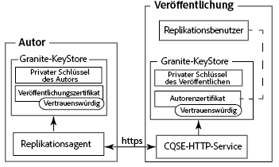
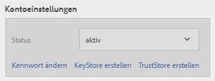
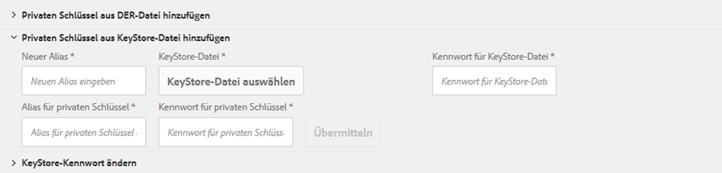
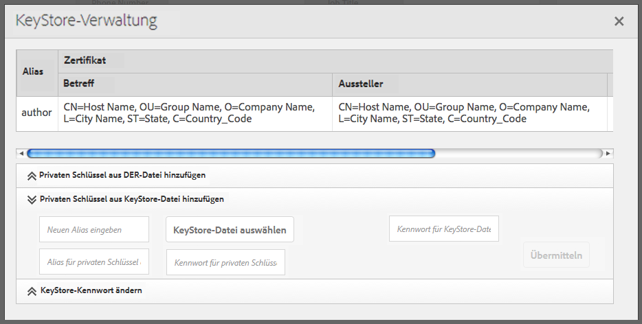
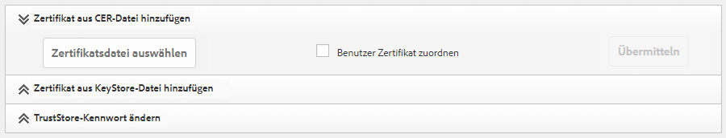
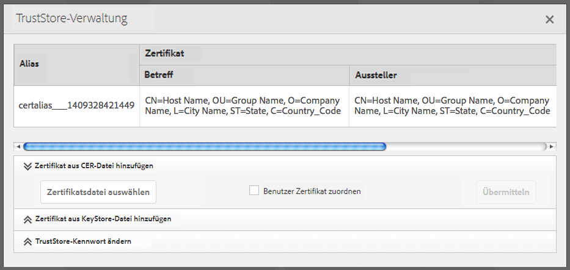
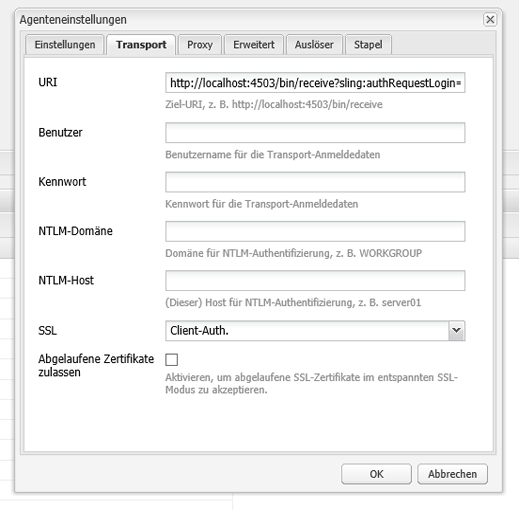

# Replizieren mit bidirektionaler SSL-Kommunikation{#replicating-using-mutual-ssl}

Konfigurieren Sie AEM so, dass ein Replikationsagent auf der Autoreninstanz gegenseitiges SSL (MSSL) für die Verbindung mit der Veröffentlichungsinstanz verwendet Bei Verwendung von MSSL verwenden der Replikationsagent und der HTTP-Dienst auf der Publishing-Instanz Zertifikate, um sich gegenseitig zu authentifizieren.

Die Konfiguration von MSSL für die Replikation umfasst die folgenden Schritte:

1. Erstellen oder beziehen Sie private Schlüssel und Zertifikate für die Authoring- und Publishing-Instanzen.
1. Installieren Sie die Schlüssel und Zertifikate auf der Autoren- und Veröffentlichungsinstanz:

   * Authoring-Instanz: Privater Schlüssel von Author und Zertifikat von Publish.
   * Publishing-Instanz: Privater Schlüssel von Publish und Zertifikat von Author. Das Zertifikat ist mit dem Benutzerkonto verknüpft, das mit dem Replikationsagenten authentifiziert ist.

1. Konfigurieren Sie den Jetty-basierten HTTP-Dienst auf der Publishing-Instanz.
1. Konfigurieren Sie die Transport- und SSL-Eigenschaften des Replikationsagenten.



Bestimmen Sie, welches Benutzerkonto die Replikation durchführt. Bei der Installation des vertrauenswürdigen Autorenzertifikats auf der Publishing-Instanz wird das Zertifikat mit diesem Benutzerkonto verknüpft.

## Abrufen oder Erstellen von Anmeldeinformationen für MSSL {#obtaining-or-creating-credentials-for-mssl}

Sie benötigen einen privaten Schlüssel und ein öffentliches Zertifikat für die Authoring- und Publishing-Instanz:

* Private Schlüssel müssen im PKCS#12- oder JKS-Format vorliegen.
* Zertifikate müssen im PKCS#12- oder JKS-Format vorliegen. Zusätzlich kann das im Format „CER“ enthaltene Zertifikat auch dem Granite Truststore hinzugefügt werden.
* Zertifikate können selbst signiert oder von einer anerkannten Zertifizierungsstelle signiert werden.

### JKS-Format {#jks-format}

Generieren Sie einen privaten Schlüssel und ein Zertifikat im JKS-Format. Der private Schlüssel wird in einer KeyStore-Datei gespeichert, und das Zertifikat wird in einer TrustStore-Datei gespeichert. Verwenden Sie [Java `keytool`](https://docs.oracle.com/javase/7/docs/technotes/tools/solaris/keytool.html), um beide zu erstellen.

Führen Sie mit dem Java-`keytool` folgende Schritte aus, um den privaten Schlüssel und die Anmeldedaten zu erstellen:

1. Generieren Sie ein öffentlich-privates Schlüsselpaar in einem KeyStore.
1. Erstellen oder beziehen Sie das Zertifikat:

   * Selbst signiert: Exportieren Sie das Zertifikat aus dem KeyStore.
   * Von einer Zertifizierungsstelle signiert: Generieren Sie eine Zertifikatanforderung und senden Sie sie an die Zertifizierungsstelle.

1. Importieren Sie das Zertifikat in einen TrustStore.

Führen Sie die folgenden Schritte aus, um einen privaten Schlüssel und ein selbst signiertes Zertifikat für die Authoring- und Publishing-Instanz zu erstellen. Verwenden Sie entsprechend unterschiedliche Werte für die Befehlsoptionen.

1. Öffnen Sie eine Befehlszeile oder ein Terminal. Um das Schlüsselpaar aus öffentlich-privaten Schlüssel zu erstellen, geben Sie den folgenden Befehl ein und verwenden die Optionswerte aus der folgenden Tabelle:

   ```shell
   keytool -genkeypair -keyalg RSA -validity 3650 -alias alias -keystore keystorename.keystore  -keypass key_password -storepass  store_password -dname "CN=Host Name, OU=Group Name, O=Company Name,L=City Name, S=State, C=Country_ Code"
   ```

   | Option | Autor | Veröffentlichung |
   |---|---|---|
   | -alias | author | publish |
   | -keystore | author.keystore | publish.keystore |

1. Um das Zertifikat zu exportieren, geben Sie folgenden Befehl anhand der Optionswerte in der nachfolgenden Tabelle ein:

   ```shell
   keytool -exportcert -alias alias -file cert_file -storetype jks -keystore keystore -storepass store_password
   ```

   | Option | Autor | Veröffentlichung |
   |---|---|---|
   | -alias | author | publish |
   | -file | author.cer | publish.cer |
   | -keystore | author.keystore | publish.keystore |

### PKCS#12-Format {#pkcs-format}

Generieren Sie einen privaten Schlüssel und ein Zertifikat im PKCS#12-Format. Verwenden Sie [openSSL](https://www.openssl.org/), um sie zu generieren. Führen Sie die folgenden Schritte aus, um einen privaten Schlüssel und eine Zertifikatanforderung zu generieren. Um das Zertifikat zu erhalten, signieren Sie die Anforderung entweder mit Ihrem privaten Schlüssel (selbstsigniertes Zertifikat) oder senden Sie die Anforderung an eine Zertifizierungsstelle. Erstellen Sie dann das PKCS#12-Archiv, das den privaten Schlüssel und das Zertifikat enthält.

1. Öffnen Sie eine Befehlszeile oder ein Terminal. Um den privaten Schlüssel zu erstellen, geben Sie folgenden Befehl anhand der Optionswerte in der nachfolgenden Tabelle ein:

   ```shell
   openssl genrsa -out keyname.key 2048
   ```

   | Option | Autor | Veröffentlichung |
   |---|---|---|
   | -out | author.key | publish.key |

1. Um eine Zertifikatanforderung zu generieren, geben Sie folgenden Befehl anhand der Optionswerte in der nachfolgenden Tabelle ein:

   ```shell
   openssl req -new -key keyname.key -out key_request.csr
   ```

   | Option | Autor | Veröffentlichung |
   |---|---|---|
   | -key | author.key | publish.key |
   | -out | author_request.csr | publish_request.csr |

   Signieren Sie entweder die Zertifikatanforderung oder senden Sie die Anforderung an eine Zertifizierungsstelle.

1. Um die Zertifikatanforderung zu signieren, geben Sie folgenden Befehl anhand der Optionswerte in der nachfolgenden Tabelle ein:

   ```shell
   openssl x509 -req -days 3650 -in key_request.csr -signkey keyname.key -out certificate.cer
   ```

   | Option | Autor | Veröffentlichung |
   |---|---|---|
   | -signkey | author.key | publish.key |
   | -in | author_request.csr | publish_request.csr |
   | -out | author.cer | publish.cer |

1. Um den privaten Schlüssel und das signierte Zertifikat einer PKCS#12-Datei hinzuzufügen, geben Sie folgenden Befehl anhand der Optionswerte in der nachfolgenden Tabelle ein:

   ```shell
   openssl pkcs12 -keypbe PBE-SHA1-3DES -certpbe PBE-SHA1-3DES -export -in certificate.cer -inkey keyname.key -out pkcs12_archive.pfx -name "alias"
   ```

   | Option | Autor | Veröffentlichung |
   |---|---|---|
   | -inkey | author.key | publish.key |
   | -out | author.pfx | publish.pfx |
   | -in | author.cer | publish.cer |
   | -name | author | publish |

## Installieren des privaten Schlüssels und des TrustStore auf der Authoring-Instanz {#install-the-private-key-and-truststore-on-author}

Installieren Sie die folgenden Elemente auf der Authoring-Instanz:

* Der private Schlüssel der Authoring-Instanz.
* Das Zertifikat der Publishing-Instanz.

Um das folgende Verfahren durchzuführen, müssen Sie als Admin der Authoring-Instanz angemeldet sein.

### Installieren des privaten Authoring-Schlüssels {#install-the-author-private-key}

1. Öffnen Sie die Benutzerverwaltungs-Seite für die Authoring-Instanz. ([http://localhost:4502/libs/granite/security/content/useradmin.html](http://localhost:4502/libs/granite/security/content/useradmin.html))
1. Um die Eigenschaften Ihres Benutzerkontos zu öffnen, klicken Sie auf Ihren Benutzernamen.
1. Wenn der Link „KeyStore erstellen“ im Bereich Kontoeinstellungen angezeigt wird, klicken Sie auf ihn. Konfigurieren Sie ein Kennwort und klicken Sie auf „OK“.
1. Klicken Sie im Bereich „Kontoeinstellungen“ auf „Keystore verwalten“.

   

1. Klicken Sie auf „Privaten Schlüssel aus KeyStore-Datei hinzufügen“.

   

1. Klicken Sie auf „Key Store-Datei auswählen“, suchen Sie die Datei „author.keystore“ oder die Datei „author.pfx“, wenn Sie PKCS#12 verwenden, und wählen Sie sie aus. Klicken Sie dann auf „Öffnen“.
1. Geben Sie einen Alias und das Kennwort für den KeyStore ein. Geben Sie den Alias und das Kennwort für den privaten Schlüssel ein und klicken Sie auf „Senden“.
1. Schließen Sie das Dialogfeld „KeyStore-Verwaltung“.

   

### Installieren des Veröffentlichungszertifikats {#install-the-publish-certificate}

1. Öffnen Sie die Benutzerverwaltungs-Seite für die Authoring-Instanz. ([http://localhost:4502/libs/granite/security/content/useradmin.html](http://localhost:4502/libs/granite/security/content/useradmin.html))
1. Um die Eigenschaften Ihres Benutzerkontos zu öffnen, klicken Sie auf Ihren Benutzernamen.
1. Wenn der Link „TrustStore erstellen“ im Bereich „Kontoeinstellungen“ angezeigt wird, klicken Sie auf den Link, erstellen Sie ein Kennwort für den TrustStore und klicken Sie auf „OK“.
1. Klicken Sie im Bereich „Kontoeinstellungen“ auf „TrustStore verwalten“.
1. Klicken Sie auf „Zertifikat aus CER-Datei hinzufügen“.

   

1. Deaktivieren Sie die Option „Zertifikat dem Benutzer zuordnen“. Klicken Sie auf „Zertifikatdatei auswählen“, wählen Sie „publish.cer“ und klicken Sie auf „Öffnen“.
1. Schließen Sie das Dialogfeld „TrustStore-Verwaltung“.

   

## Installieren von privatem Schlüssel und TrustStore auf der Publishing-Instanz {#install-private-key-and-truststore-on-publish}

Installieren Sie die folgenden Elemente auf der Publishing-Instanz:

* Den privaten Schlüssel der Publishing-Instanz.
* Das Zertifikat der Autoreninstanz. Verknüpfen Sie das Zertifikat mit der Person, die für die Ausführung von Replikationsanforderungen verantwortlich ist.

Um das folgende Verfahren durchzuführen, müssen Sie als Admin der Publishing-Instanz angemeldet sein.

### Installieren des privaten Publishing-Schlüssels {#install-the-publish-private-key}

1. Öffnen Sie die Seite „Benutzerverwaltung“ der Publishing-Instanz. ([http://localhost:4503/libs/granite/security/content/useradmin.html](http://localhost:4503/libs/granite/security/content/useradmin.html))
1. Um die Eigenschaften Ihres Benutzerkontos zu öffnen, klicken Sie auf Ihren Benutzernamen.
1. Wenn der Link „KeyStore erstellen“ im Bereich Kontoeinstellungen angezeigt wird, klicken Sie auf ihn. Konfigurieren Sie ein Kennwort und klicken Sie auf „OK“.
1. Klicken Sie im Bereich „Kontoeinstellungen“ auf „Keystore verwalten“.
1. Klicken Sie auf „Privaten Schlüssel aus Schlüsselspeicherdatei hinzufügen“.
1. Klicken Sie auf „Key Store-Datei auswählen“, suchen Sie die Datei „publish.keystore“ oder die Datei „publish.pfx“, wenn Sie PKCS#12 verwenden, und wählen Sie sie aus. Klicken Sie dann auf „Öffnen“.
1. Geben Sie einen Alias und das Kennwort für den KeyStore ein. Geben Sie den Alias und das Kennwort für den privaten Schlüssel ein und klicken Sie auf „Senden“.
1. Schließen Sie das Dialogfeld „KeyStore-Verwaltung“.

### Installieren des Authoring-Zertifikats {#install-the-author-certificate}

1. Öffnen Sie die Seite „Benutzerverwaltung“ der Publishing-Instanz. ([http://localhost:4503/libs/granite/security/content/useradmin.html](http://localhost:4503/libs/granite/security/content/useradmin.html))
1. Wenn der Link „TrustStore erstellen“ im Bereich „Global Trust Store“ angezeigt wird, klicken Sie auf den Link, erstellen Sie ein Kennwort für den TrustStore und klicken Sie auf „OK“.
1. Klicken Sie im Bereich „Kontoeinstellungen“ auf „TrustStore verwalten“.
1. Klicken Sie auf „Zertifikat aus CER-Datei hinzufügen“.
1. Stellen Sie sicher, dass die Option „Zertifikat dem Benutzer zuordnen“ ausgewählt ist. Klicken Sie auf „Zertifikatdatei auswählen“, wählen Sie „author.cer“ und klicken Sie auf „Öffnen“.
1. Klicken Sie auf „Senden“ und schließen Sie dann das Dialogfeld „TrustStore-Verwaltung“.

## Konfigurieren des HTTP-Dienstes auf der Publishing-Instanz {#configure-the-http-service-on-publish}

Konfigurieren Sie die Eigenschaften des Apache Felix Jetty-basierten HTTP-Dienstes auf der Publishing-Instanz so, dass beim Zugriff auf Granite Keystore HTTPS verwendet wird. Die PID des Dienstes ist `org.apache.felix.http`.

In der folgenden Tabelle sind die OSGi-Eigenschaften aufgeführt, die Sie konfigurieren müssen, wenn Sie die Web-Konsole verwenden.

| Eigenschaftsname in der Web-Konsole | OSGi-Eigenschaftsname | Wert |
|---|---|---|
| Aktivieren von HTTPS | org.apache.felix.https.enable | true |
| Aktivieren von HTTPS zur Verwendung von Granite KeyStore | org.apache.felix.https.use.granite.keystore | true |
| HTTPS-Port | org.osgi.service.http.port.secure | 8443 (oder anderer gewünschter Port) |
| Client-Zertifikat | org.apache.felix.https.clientcertificate | „Client-Zertifikat gewünscht“ |

## Konfigurieren des Replikationsagenten auf der Authoring-Instanz {#configure-the-replication-agent-on-author}

Konfigurieren Sie den Replikationsagenten auf der Autoreninstanz so, dass das HTTPS-Protokoll beim Herstellen einer Verbindung mit der Veröffentlichungsinstanz verwendet wird. Umfassende Informationen zum Konfigurieren von Replikationsagenten finden Sie unter [Konfigurieren Ihrer Replikationsagenten](/help/sites-deploying/replication.md#configuring-your-replication-agents).

Um MSSL zu aktivieren, konfigurieren Sie die Eigenschaften auf der Registerkarte „Transport“ entsprechend der folgenden Tabelle:

<table>
 <tbody>
  <tr>
   <th>Eigenschaft</th>
   <th>Wert</th>
  </tr>
  <tr>
   <td>URI</td>
   <td><p>https://server_name:SSL_port/bin/receive?sling:authRequestLogin=1</p> <p>Beispiel:</p> <p>http://localhost:8443/bin/receive?sling:authRequestLogin=1</p> </td>
  </tr>
  <tr>
   <td>User</td>
   <td>Kein Wert</td>
  </tr>
  <tr>
   <td>Passwort</td>
   <td>Kein Wert</td>
  </tr>
  <tr>
   <td>SSL</td>
   <td>Client-Auth.</td>
  </tr>
 </tbody>
</table>



Wenn Sie den Replikationsagenten konfiguriert haben, testen Sie die Verbindung, um zu überprüfen, ob MSSL richtig konfiguriert ist.

```xml
29.08.2014 14:02:46 - Create new HttpClient for Default Agent
29.08.2014 14:02:46 - * HTTP Version: 1.1
29.08.2014 14:02:46 - * Using Client Auth SSL configuration *
29.08.2014 14:02:46 - adding header: Action:Test
29.08.2014 14:02:46 - adding header: Path:/content
29.08.2014 14:02:46 - adding header: Handle:/content
29.08.2014 14:02:46 - deserialize content for delivery
29.08.2014 14:02:46 - No message body: Content ReplicationContent.VOID is empty
29.08.2014 14:02:46 - Sending POST request to http://localhost:8443/bin/receive?sling:authRequestLogin=1
29.08.2014 14:02:46 - sent. Response: 200 OK
29.08.2014 14:02:46 - ------------------------------------------------
29.08.2014 14:02:46 - Sending message to localhost:8443
29.08.2014 14:02:46 - >> POST /bin/receive HTTP/1.0
29.08.2014 14:02:46 - >> Action: Test
29.08.2014 14:02:46 - >> Path: /content
29.08.2014 14:02:46 - >> Handle: /content
29.08.2014 14:02:46 - >> Referer: about:blank
29.08.2014 14:02:46 - >> Content-Length: 0
29.08.2014 14:02:46 - >> Content-Type: application/octet-stream
29.08.2014 14:02:46 - --
29.08.2014 14:02:46 - << HTTP/1.1 200 OK
29.08.2014 14:02:46 - << Connection: Keep-Alive
29.08.2014 14:02:46 - << Server: Day-Servlet-Engine/4.1.64
29.08.2014 14:02:46 - << Content-Type: text/plain;charset=utf-8
29.08.2014 14:02:46 - << Content-Length: 26
29.08.2014 14:02:46 - << Date: Fri, 29 Aug 2014 18:02:46 GMT
29.08.2014 14:02:46 - << Set-Cookie: login-token=3529326c-1500-4888-a4a3-93d299726f28%3ac8be86c6-04bb-4d18-80d6-91278e08d720_98797d969258a669%3acrx.default; Path=/; HttpOnly; Secure
29.08.2014 14:02:46 - << Set-Cookie: cq-authoring-mode=CLASSIC; Path=/; Secure
29.08.2014 14:02:46 - <<
29.08.2014 14:02:46 - << R
29.08.2014 14:02:46 - << eplicationAction TEST ok.
29.08.2014 14:02:46 - Message sent.
29.08.2014 14:02:46 - ------------------------------------------------
29.08.2014 14:02:46 - Replication (TEST) of /content successful.
Replication test succeeded
```
