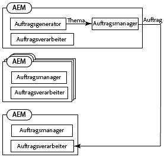
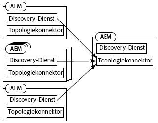
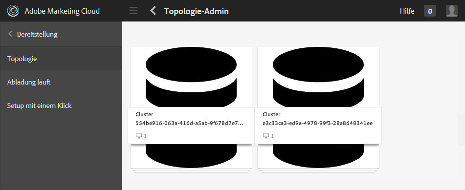
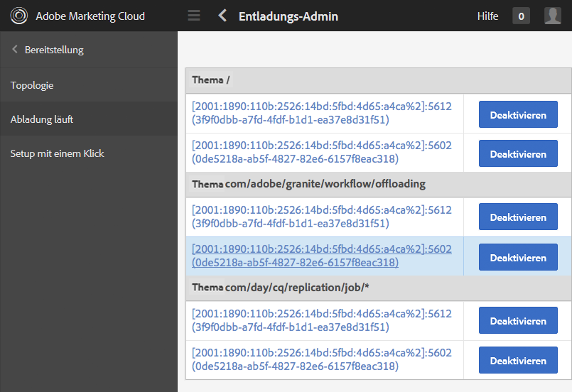
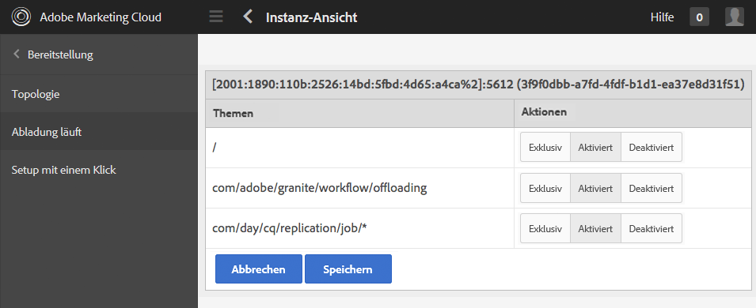
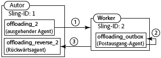
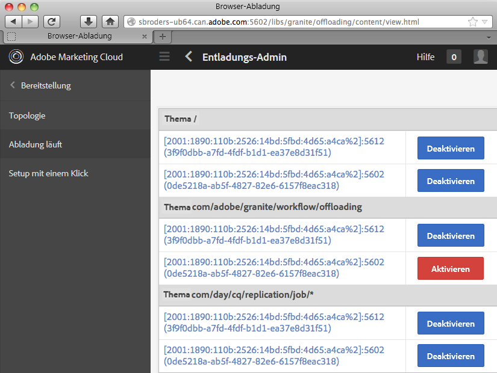

# Auslagern von Aufträgen{#offloading-jobs}

## Einführung {#introduction}

Mit der Abladung werden Verarbeitungsaufgaben auf die Experience Manager-Instanzen in einer Topologie verteilt. Mit der Abladung können Sie bestimmte Experience Manager-Instanzen zur Durchführung bestimmter Verarbeitungsarten verwenden. Durch eine spezialisierte Verarbeitung können Sie die Nutzung der verfügbaren Serverressourcen maximieren.

Die Abladung basiert auf den [Discovery](https://sling.apache.org/documentation/bundles/discovery-api-and-impl.html)- und JobManager-Funktionen von Apache Sling. Um die Abladung zu nutzen, müssen Sie Experience Manager-Cluster zu einer Topologie hinzufügen und die von den Clustern verarbeiteten Aufgabenthemen identifizieren. Cluster bestehen aus einer oder mehreren Experience Manager-Instanzen, sodass eine Instanz als Cluster gilt.

Informationen zum Hinzufügen von Instanzen zu einer Topologie finden Sie unter [Verwalten von Topologien](/help/sites-deploying/offloading.md#administering-topologies).

### Auftragsverteilung {#job-distribution}

Die Sling JobManager- und JobConsumer-Dienste ermöglichen die Erstellung von Aufträgen, die in einer Topologie verarbeitet werden:

* JobManager: Ein Dienst, der Aufträge für bestimmte Themen erstellt.
* JobConsumer: Ein Dienst, der Aufträge für ein oder mehrere Themen ausführt. Mehrere JobConsumer-Dienste können für dasselbe Thema registriert werden.

Wenn JobManager einen Auftrag erstellt, wählt das Abladungs-Framework einen Experience Manager-Cluster in der Topologie aus, um den Auftrag auszuführen:

* Der Cluster muss eine oder mehrere Instanzen enthalten, die einen JobConsumer ausführen, der für das Auftragsthema registriert ist.
* Das Thema muss für mindestens eine Instanz im Cluster aktiviert sein.

Siehe [Konfigurieren der Themennutzung](/help/sites-deploying/offloading.md#configuring-topic-consumption) für Informationen zur Raffinierung der Auftragsverteilung.

Wenn das Abladungs-Framework einen Cluster für die Ausführung eines Auftrags auswählt und der Cluster mehrere Instanzen umfasst, bestimmt die Sling-Verteilung, welche Instanz im Cluster den Auftrag ausführt.

### Auftrags-Payloads {#job-payloads}

Das Abladungs-Framework unterstützt Auftrags-Payloads, die Aufträge mit Ressourcen im Repository verknüpfen. Auftrags-Payloads sind nützlich, wenn Aufträge für Verarbeitungsressourcen erstellt und der Auftrag auf einen anderen Computer abgeladen wird.

Bei der Erstellung eines Auftrags befindet sich die Payload nur auf der Instanz, die den Auftrag erstellt. Beim Abladen des Auftrags stellen Replikationsagenten sicher, dass die Payload auf der Instanz erstellt wird, die den Auftrag schließlich verarbeitet. Wenn die Auftragsausführung abgeschlossen ist, führt die Rückwärtsreplikation dazu, dass die Payload zurück in die Instanz kopiert wird, die den Auftrag erstellt hat.

## Verwalten von Topologien {#administering-topologies}

Topologien sind lose verknüpfte Experience Manager-Cluster, die an der Abladung beteiligt sind. Ein Cluster besteht aus einer oder mehreren Experience Manager-Serverinstanzen (eine einzelne Instanz gilt als Cluster).

Jede Experience Manager-Instanz führt die folgenden Abladedienste aus:

* Discovery-Dienst: Sendet Anforderungen an einen Topologie-Connector, um dieser Topologie beizutreten.
* Topologie-Connector: Erhält die Join-Anfragen und akzeptiert oder lehnt jede Anfrage ab.

Der Discovery-Dienst aller Topologiemitglieder verweist auf den Topologie-Connector eines der Mitglieder. In den folgenden Abschnitten wird dieses Mitglied als Stammmitglied bezeichnet.

Jeder Cluster in der Topologie enthält eine Instanz, die als Leader erkannt wird. Der Cluster-Leader interagiert für die anderen Cluster-Mitglieder mit der Topologie. Wenn der Leader den Cluster verlässt, wird automatisch ein neuer Leader für den Cluster ausgewählt.

### Anzeigen der Topologie {#viewing-the-topology}

Mit dem Topologie-Browser können Sie den Status der Topologie überprüfen, zu der die Experience Manager-Instanz gehört. Im Topologie-Browser werden die Cluster und Instanzen der Topologie angezeigt.

Für jeden Cluster wird eine Liste der Cluster-Mitglieder angezeigt, die angibt, in welcher Reihenfolge die einzelnen Mitglieder dem Cluster beigetreten sind und welches Mitglied der Leader ist. Die Eigenschaft „Aktuell“ gibt die Instanz an, die Sie derzeit verwalten.

Für jede Instanz des Clusters werden verschiedene topologiebezogene Eigenschaften angezeigt:

* Eine Zulassungsliste mit Themen für den JobConsumer der Instanz.
* Die Endpunkte, die für die Verbindung mit der Topologie verfügbar gemacht werden.
* Die Auftragsthemen, für die die Instanz zum Abladen registriert ist.
* Die Auftragsthemen, die die Instanz verarbeitet.

1. Klicken Sie in der Touch-Benutzeroberfläche auf die Registerkarte Tools . ([http://localhost:4502/tools.html](http://localhost:4502/tools.html))
1. Klicken Sie im Bereich &quot;Granite-Vorgänge&quot;auf Browser-Abladung .
1. Klicken Sie im Navigationsfenster auf &quot;Topologie-Browser&quot;.

   Die an der Topologie teilnehmenden Cluster werden angezeigt.

   

1. Klicken Sie auf einen Cluster, um eine Liste der Instanzen im Cluster mit ihrer ID, ihrem aktuellen Status und dem Status &quot;Leader&quot;anzuzeigen.
1. Klicken Sie auf eine Instanz-ID, um detailliertere Eigenschaften anzuzeigen.

Sie können auch die Web-Konsole zum Anzeigen von Topologie-Informationen verwenden. Die Konsole enthält weitere Informationen zu den Topologie-Clustern:

* Welche Instanz ist die lokale Instanz?
* Die Topologie-Connector-Dienste, mit denen diese Instanz eine Verbindung zur Topologie (ausgehend) herstellt, und die Dienste, die eine Verbindung zu dieser Instanz herstellen (eingehende).
* Der Änderungsverlauf für die Topologie- und Instanzeigenschaften

Gehen Sie wie folgt vor, um die Seite „Topology Management“ der Web-Konsole zu öffnen:

1. Öffnen Sie die Web-Konsole in Ihrem Browser. ([http://localhost:4502/system/console](http://localhost:4502/system/console))
1. Klicken Sie auf Haupt > Topologieverwaltung.

   

### Konfigurieren der Topologiemitgliedschaft {#configuring-topology-membership}

Der ressourcenbasierte Apache Sling-Erkennungsdienst wird auf jeder Instanz ausgeführt, um zu steuern, wie Experience Manager-Instanzen mit einer Topologie interagieren.

Der Discovery-Dienst sendet regelmäßig POST-Anforderungen (Heartbeats) an Topologie-Connector-Dienste, um Verbindungen mit der Topologie herzustellen und aufrechtzuerhalten. Der Topologie-Connector-Dienst verwaltet eine Zulassungsliste mit IP-Adressen oder Host-Namen, die Mitglied der Topologie werden dürfen:

* Um eine Instanz zum Topologie-Mitglied zu machen, geben Sie die URL für den Topologie-Connector-Dienst des Stamm-Mitglieds an.
* Damit eine Instanz einer Topologie beitreten kann, fügen Sie die Instanz zur Zulassungsliste des Topologie-Connector-Dienstes des Stammmitglieds hinzu.

Verwenden Sie die Web-Konsole oder einen sling:OsgiConfig -Knoten, um die folgenden Eigenschaften des Diensts org.apache.sling.discovery.impt.Config zu konfigurieren:

<table>
 <tbody>
  <tr>
   <th>Eigenschaftsname</th>
   <th>OSGi-Name</th>
   <th>Beschreibung</th>
   <th>Standardwert</th>
  </tr>
  <tr>
   <td>Heartbeat-Timeout (Sekunden)</td>
   <td>heartbeatTimeout</td>
   <td>Die Zeit in Sekunden, die auf eine Heartbeat-Antwort gewartet wird, bevor die Targeting-Instanz als nicht verfügbar betrachtet wird. </td>
   <td>20</td>
  </tr>
  <tr>
   <td>Heartbeat-Intervall (Sekunden)</td>
   <td>heartbeatInterval</td>
   <td>Die Zeit in Sekunden zwischen Heartbeats.</td>
   <td>15</td>
  </tr>
  <tr>
   <td>Minimale Ereignisverzögerung (Sekunden)</td>
   <td>minEventDelay</td>
   <td>
Wenn eine Änderung an der Topologie eintritt, die Zeit der Verzögerung für die Änderung des Status von TOPOLOGY_CHANGING zu TOPOLOGY_CHANGED. Jede Änderung, die eintritt, wenn der Status TOPOLOGY_CHANGING lautet, erhöht die Verzögerung um diesen Zeitraum.
 
Diese Verzögerung verhindert, dass Listener mit Ereignissen überflutet werden. 
 
Um keine Verzögerung zu verwenden, geben Sie 0 oder eine negative Zahl an.
 </td>
   <td>3</td>
  </tr>
  <tr>
   <td>Topologie-Connector-URLs</td>
   <td>topologyConnectorUrls</td>
   <td>Die URLs der Topologie-Connector-Dienste zum Senden von Heartbeat-Nachrichten.</td>
   <td>http://localhost:4502/libs/sling/topology/connector</td>
  </tr>
  <tr>
   <td>Topologie-Connectoren-Zulassungsliste</td>
   <td>topologyConnectorWhitelist</td>
   <td>Die Liste der IP-Adressen oder Hostnamen, die der lokale Topologie-Connector-Dienst in der Topologie zulässt. </td>
   <td>
localhost
 
127.0.0.1
 </td>
  </tr>
  <tr>
   <td>Repository-Deskriptorname</td>
   <td>leaderElectionRepositoryDescriptor</td>
   <td> </td>
   <td>&lt;kein Wert&gt;</td>
  </tr>
 </tbody>
</table>

Gehen Sie wie folgt vor, um eine CQ-Instanz mit dem Stamm-Mitglied einer Topologie zu verbinden. Die Instanz verweist dann auf die Topologie-Connector-URL des Stamm-Mitglieds der Topologie. Führen Sie dieses Verfahren für alle Mitglieder der Topologie durch.

1. Öffnen Sie die Web-Konsole in Ihrem Browser. ([http://localhost:4502/system/console](http://localhost:4502/system/console))
1. Klicken Sie auf Haupt > Topologieverwaltung.
1. Klicken Sie auf Discovery-Dienst konfigurieren .
1. Fügen Sie ein Element zur Eigenschaft „Topology Connector URLs“ hinzu und geben Sie die URL des Topologie-Connector-Dienstes für das Stamm-Mitglied der Topologie an. Die URL hat die Form https://rootservername:4502/libs/sling/topology/connector.

Führen Sie die folgenden Schritte für das Stamm-Mitglied der Topologie aus. Dadurch werden die Namen der anderen Topologiemitglieder zur Discovery Service-Zulassungsliste hinzugefügt.

1. Öffnen Sie die Web-Konsole in Ihrem Browser. ([http://localhost:4502/system/console](http://localhost:4502/system/console))
1. Klicken Sie auf Haupt > Topologieverwaltung.
1. Klicken Sie auf Discovery-Dienst konfigurieren .
1. Fügen Sie für jedes Topologiemitglied ein Element zur Eigenschaft „Topologie-Connectoren-Zulassungsliste“ hinzu und geben Sie den Hostnamen oder die IP-Adresse des Topologiemitglieds an.

## Konfigurieren der Themennutzung {#configuring-topic-consumption}

Verwenden Sie die Browser-Abladung, um die Themenverarbeitung für die Experience Manager-Instanzen in der Topologie zu konfigurieren. Sie können die von jeder Instanz verarbeiteten Themen angeben. Um beispielsweise Ihre Topologie so zu konfigurieren, dass nur eine Instanz Themen eines bestimmten Typs verbraucht, deaktivieren Sie das Thema auf allen Instanzen außer einer.

Aufgaben werden mithilfe der Round-Robin-Logik auf die Instanzen verteilt, auf denen das verknüpfte Thema aktiviert ist.

1. Klicken Sie in der Touch-Benutzeroberfläche auf die Registerkarte Tools . ([http://localhost:4502/tools.html](http://localhost:4502/tools.html))
1. Klicken Sie im Bereich &quot;Granite-Vorgänge&quot;auf Browser-Abladung .
1. Klicken Sie im Navigationsfenster auf Browser-Abladung.

   Die Abladethemen und die Serverinstanzen, die die Themen verarbeiten können, werden angezeigt.

   

1. Um die Nutzung eines Themas für eine Instanz zu deaktivieren, klicken Sie unter dem Themennamen neben der Instanz auf „Deaktivieren“.
1. Um die Verarbeitung aller Themen für eine Instanz zu konfigurieren, klicken Sie auf die Instanz-ID unter einem beliebigen Thema.

   

1. Klicken Sie auf eine der folgenden Schaltflächen neben einem Thema, um das Verbrauchsverhalten für die Instanz zu konfigurieren, und klicken Sie dann auf Speichern:

   * Aktiviert: Diese Instanz verbraucht Aufträge dieses Themas.
   * Deaktiviert: Diese Instanz verarbeitet keine Aufträge für dieses Thema.
   * Exklusiv: Diese Instanz verarbeitet nur Aufträge für dieses Thema.

   **Hinweis:** Wenn Sie für ein Thema die Option Exklusiv auswählen, werden alle anderen Themen automatisch auf Deaktiviert gesetzt.

### Installierte Job Consumer {#installed-job-consumers}

Die Installation von Experience Manager umfasst mehrere implementierte JobConsumer-Dienste. Die Themen, für die diese JobConsumer-Dienste registriert sind, werden im Abladebrowser angezeigt. Bei den weiteren angezeigten Themen handelt es sich um von benutzerdefinierten JobConsumer-Diensten registrierte Themen. In der folgenden Tabelle werden die standardmäßigen JobConsumers beschrieben.

| Auftragsthema | Service-PID | Beschreibung |
|---|---|---|
| / | org.apache.sling.event.impl.jobs.deprecated.EventAdminBridge | Mit Apache Sling installiert. Verarbeitet Aufträge, die vom OSGi-Event-Admin-Dienst aus Gründen der Abwärtskompatibilität generiert werden. |
| com/day/cq/replication/job/&amp;ast; | com.day.cq.replication.impl.AgentManagerImpl | Ein Replikationsagent, der Auftrags-Payloads repliziert. |

<!--
| com/adobe/granite/workflow/offloading |com.adobe.granite.workflow.core.offloading.WorkflowOffloadingJobConsumer |Processes jobs that the DAM Update Asset Offloader workflow generates. |
-->

### Deaktivieren und Aktivieren von Themen für eine Instanz {#disabling-and-enabling-topics-for-an-instance}

Der Apache Sling Job Consumer Manager-Dienst stellt Eigenschaften für die Zulassungsliste und Blockierungsliste von Themen bereit. Konfigurieren Sie diese Eigenschaften, um die Verarbeitung von bestimmten Themen auf einer Experience Manager-Instanz zu aktivieren oder zu deaktivieren.

**Hinweis:** Wenn die Instanz zu einer Topologie gehört, können Sie Themen auch mit der Browser-Abladung auf einem beliebigen Computer der Topologie aktivieren oder deaktivieren.

Die Logik, die die Liste der aktivierten Themen erstellt, erlaubt zunächst alle Themen, die sich auf der Zulassungsliste befinden, und entfernt dann Themen, die sich auf der Blockierungsliste befinden. Standardmäßig sind alle Themen aktiviert (der Wert der Zulassungsliste ist `*`) und keine Themen sind deaktiviert (die Blockierungsliste hat keinen Wert).

Verwenden Sie die Web-Konsole oder einen `sling:OsgiConfig`-Knoten, um die folgenden Eigenschaften zu konfigurieren. Für `sling:OsgiConfig`-Knoten lautet die PID des Job Consumer Manager-Dienstes „org.apache.sling.event.impl.jobs.JobConsumerManager“.

| Eigenschaftsname in der Web-Konsole | OSGi-ID | Beschreibung |
|---|---|---|
| Themen auf der Zulassungsliste | job.consumermanager.whitelist | Eine Liste der Themen, die vom lokalen JobManager-Dienst verarbeitet werden. Der Standardwert „&amp;ast;“ sorgt dafür, dass alle Themen an den registrierten TopicConsumer-Dienst gesendet werden. |
| Themen auf der Blockierungsliste | job.consumermanager.blacklist | Eine Liste der Themen, die vom lokalen JobManager-Dienst nicht verarbeitet werden. |

## Erstellen von Replikationsagenten für die Abladung {#creating-replication-agents-for-offloading}

Das Abladungs-Framework überträgt Ressourcen mittels Replikation zwischen Autoren- und Worker-Instanzen. Das Framework erstellt automatisch Replikationsagenten, wenn Instanzen Mitglied der Topologie werden. Die Agenten werden mit Standardwerten erstellt. Sie müssen das Kennwort, das die Agenten für die Authentifizierung verwenden, manuell ändern.

>[!CAUTION]
>
>Es ist ein bekanntes Problem bei automatisch generierten Replikationsagenten, dass neue Agenten manuell erstellt werden müssen.

Erstellen Sie die Replikationsagenten, die Auftrags-Payloads zwischen Instanzen für die Abladung übertragen. Die nachfolgende Darstellung zeigt die erforderlichen Agenten für die Abladung von der Autoren- an die Worker-Instanz. Die Autoreninstanz hat die Sling-ID 1 und die Worker-Instanz die Sling-ID 2:

Für dieses Setup sind die folgenden drei Agenten erforderlich:

1. Ein ausgehender Agent in der Autoreninstanz, der auf die Worker-Instanz repliziert.
1. Ein Rückwärtsagent auf der Autoreninstanz, der aus dem Postausgang auf der Worker-Instanz abruft.
1. Ein Postausgangsagent auf der Worker-Instanz.

Dieses Replikationsschema gleicht dem für Autoren- und Veröffentlichungsinstanzen verwendeten. Für die Abladesituation sind jedoch alle beteiligten Instanzen Autoreninstanzen.

>[!NOTE]
>
>Das Abladungs-Framework nutzt die Topologie zum Abrufen der IP-Adressen der Abladungsinstanzen. Basierend auf diesen IP-Adressen erstellt das Framework dann automatisch die Replikationsagenten. Falls die IP-Adressen der Abladungsinstanzen später geändert werden, wird die Änderung nach dem Neustart der Instanz automatisch in der Topologie weitergegeben. Das Abladungs-Framework aktualisiert jedoch nicht automatisch die Replikationsagenten mit den neuen IP-Adressen. Um dieses Problem zu vermeiden, verwenden Sie feste IP-Adressen für alle Instanzen der Topologie.

### Benennen der Replikationsagenten für die Abladung {#naming-the-replication-agents-for-offloading}

Verwenden Sie ein spezielles Format für die Eigenschaft ***Name*** des Replikationsagenten, damit das Abladungs-Framework automatisch den richtigen Agenten für bestimmte Worker-Instanzen nutzt.

**Benennung des ausgehenden Agenten auf der Autoreninstanz:**

`offloading_<slingid>`, wobei `<slingid>` die Sling-ID der Worker-Instanz ist.

Beispiel: `offloading_f5c8494a-4220-49b8-b079-360a72f71559`

**Benennung des Rückwärtsagenten auf der Autoreninstanz:**

`offloading_reverse_<slingid>`, wobei `<slingid>` die Sling-ID der Worker-Instanz ist.

Beispiel: `offloading_reverse_f5c8494a-4220-49b8-b079-360a72f71559`

**Benennung des Postausgangs auf der Worker-Instanz:**

`offloading_outbox`

### Erstellen des ausgehenden Agenten {#creating-the-outgoing-agent}

1. Erstellen Sie einen **Replikationsagenten** auf der Autoreninstanz. (Weitere Informationen finden Sie in der [Dokumentation zu Replikationsagenten](/help/sites-deploying/replication.md).) Geben Sie einen beliebigen **Titel an**. Der **Name** muss der Namenskonvention entsprechen.
1. Erstellen Sie den Agenten mit den folgenden Eigenschaften:

   | Eigenschaft | Wert |
   |---|---|
   | Einstellungen > Serialisierungstyp | Standard |
   | Transport > Transport-URI | https://*`<ip of target instance>`*:*`<port>`*`/bin/receive?sling:authRequestLogin=1` |
   | Transport > Transport-Benutzer | Replikationsbenutzer auf Zielinstanz |
   | Transport > Transport-Passwort | Replizieren des Benutzerkennworts auf der Zielinstanz |
   | Erweitert > HTTP-Methode | POST |
   | Trigger > Standard ignorieren | True |

### Erstellen des Rückwärtsagenten {#creating-the-reverse-agent}

1. Erstellen Sie einen **Rückwärts-Replikationsagenten** auf der Autoreninstanz. (Weitere Informationen finden Sie in der [Dokumentation zu Replikationsagenten](/help/sites-deploying/replication.md).) Geben Sie einen beliebigen **Titel an**. Der **Name** muss der Namenskonvention entsprechen.
1. Erstellen Sie den Agenten mit den folgenden Eigenschaften:

   | Eigenschaft | Wert |
   |---|---|
   | Einstellungen > Serialisierungstyp | Standard |
   | Transport > Transport-URI | https://*`<ip of target instance>`*:*`<port>`*`/bin/receive?sling:authRequestLogin=1` |
   | Transport > Transport-Benutzer | Replikationsbenutzer auf Zielinstanz |
   | Transport > Transport-Passwort | Replizieren des Benutzerkennworts auf der Zielinstanz |
   | Erweitert > HTTP-Methode | GET |

### Erstellen des Postausgangs-Agenten {#creating-the-outbox-agent}

1. Erstellen Sie einen **Replikationsagenten** auf der Worker-Instanz. (Weitere Informationen finden Sie in der [Dokumentation zu Replikationsagenten](/help/sites-deploying/replication.md).) Geben Sie einen beliebigen **Titel an**. Der **Name** muss `offloading_outbox` lauten.
1. Erstellen Sie den Agenten mit den folgenden Eigenschaften.

   | Eigenschaft | Wert |
   |---|---|
   | Einstellungen > Serialisierungstyp | Standard |
   | Transport > Transport-URI | repo://var/replication/outbox |
   | Trigger > Standard ignorieren | True |

### Suchen der Sling-ID {#finding-the-sling-id}

Rufen Sie die Sling-ID einer Experience Manager-Instanz mit einer der folgenden Methoden ab:

* Öffnen Sie die Web-Konsole und suchen Sie in den Sling-Einstellungen nach dem Wert der Eigenschaft für die Sling-ID ([http://localhost:4502/system/console/status-slingsettings](http://localhost:4502/system/console/status-slingsettings)). Diese Methode ist hilfreich, wenn die Instanz noch nicht zur Topologie gehört.
* Ist sie bereits Teil der Topologie, verwenden Sie den Topologie-Browser.

<!--
## Offloading the Processing of DAM Assets {#offloading-the-processing-of-dam-assets}

Configure the instances of a topology so that specific instances perform the background processing of assets that are added or updated in DAM.

By default, Experience Manager executes the [!UICONTROL DAM Update Asset] workflow when a DAM asset changes or one is added to DAM. Change the default behavior so that Experience Manager instead executes the [!UICONTROL DAM Update Asset Offloader] workflow. This workflow generates a JobManager job that has a topic of `com/adobe/granite/workflow/offloading`. Then, configure the topology so that the job is offloaded to a dedicated worker.

>[!CAUTION]
>
>No workflow should be transient when used with workflow offloading. For example, the [!UICONTROL DAM Update Asset] workflow must not be transient when used for asset offloading. To set/unset the transient flag on a workflow, see [Transient Workflows](/help/assets/performance-tuning-guidelines.md#workflows).

The following procedure assumes the following characteristics for the offloading topology:

* One or more Experience Manager instance are authoring instances that users interact with for adding or updating DAM assets.
* Users to do not directly interact with one or more Experience Manager instances that process the DAM assets. These instances are dedicated to the background processing of DAM assets.

1. On each Experience Manager instance, configure the Discovery Service so that it points to the root Topography Connector. (See [Configuring Topology Membership](#title4).)
1. Configure the root Topography Connector so that the connecting instances are on the allow list.
1. Open Offloading Browser and disable the `com/adobe/granite/workflow/offloading` topic on the instances with which users interact to upload or change DAM assets.

   

1. On each instance that users interact with to upload or change DAM assets, configure workflow launchers to use the [!UICONTROL DAM Update Asset Offloading] workflow:

    1. Open the Workflow console.
    1. Click the Launcher tab.
    1. Locate the two Launcher configurations that execute the [!UICONTROL DAM Update Asset] workflow. One launcher configuration event type is Node Created, and the other type is Node Modified.
    1. Change both event types so that they execute the [!UICONTROL DAM Update Asset Offloading] workflow. (For information about launcher configurations, see [Starting Workflows When Nodes Change](/help/sites-administering/workflows-starting.md).)

1. On the instances that perform the background processing of DAM assets, disable the workflow launchers that execute the [!UICONTROL DAM Update Asset] workflow.
-->

## Weiterführende Literatur {#further-reading}

Zusätzlich zu den auf dieser Seite dargestellten Details können Sie auch Folgendes lesen:

* Weitere Information zur Verwendung von Java-APIs für die Erstellung von Aufträgen und JobConsumer-Diensten finden Sie unter [Erstellen und Nutzen von Aufträgen für die Abladung](/help/sites-developing/dev-offloading.md).
