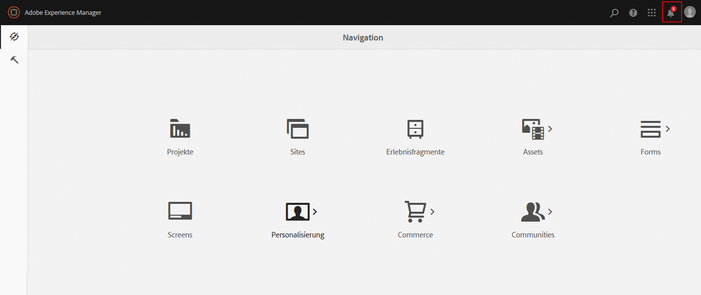
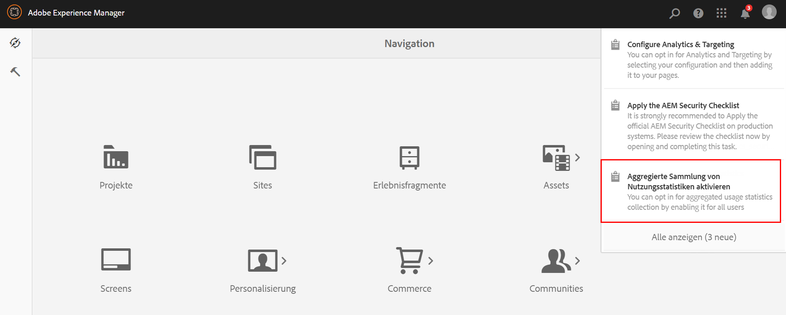
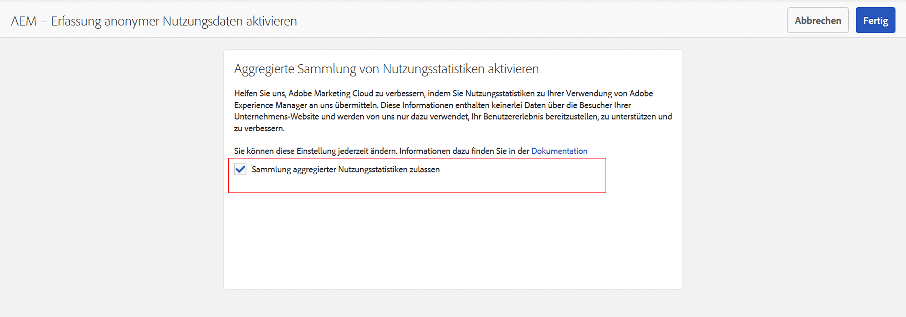
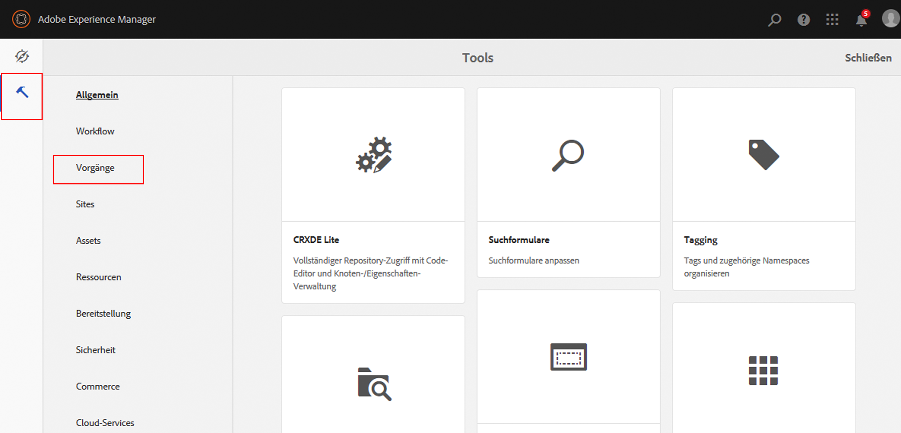
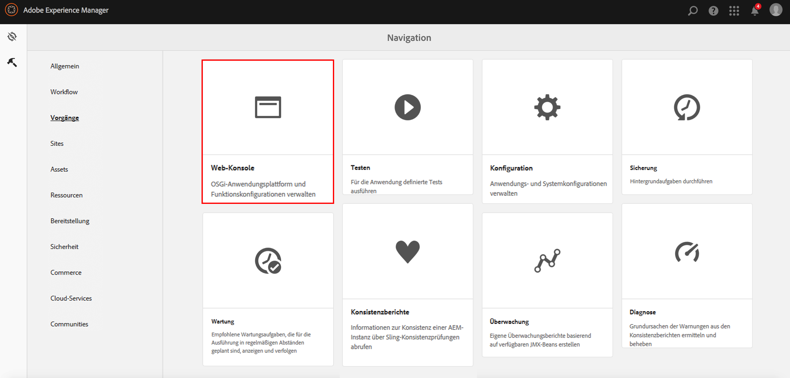

# Aktivieren der aggregierten Sammlung von Nutzungsstatistiken{#opting-into-aggregated-usage-statistics-collection}

## Einführung {#introduction}

Sie können dabei helfen, Adobe Marketing Cloud zu verbessern, indem Sie Statistiken über Ihre AEM-Interaktionen an Adobe senden. Diese Informationen enthalten keine Daten zu den Website-Besuchern Ihres Unternehmens. Sie dienen ausschließlich dazu, dass Adobe Benutzererlebnisse bereitstellen, unterstützen und verbessern kann.

Sie können die Sammlung von Nutzungsstatistiken über die Touch-Benutzeroberfläche oder die Web-Konsole aktivieren.

>[!NOTE]
>
>Es gibt verschiedene Datenschutz- und Datenschutzbestimmungen. einschließlich beispielsweise DSGVO und CCPA. AEM Sites ist bereit, Kunden bei der Erfüllung ihrer Datenschutzbestimmungen und Datenschutzbestimmungen zu unterstützen. Auf dieser Seite werden Kunden durch die Verfahren zum Aktivieren (oder Deaktivieren) der aggregierten Sammlung von Nutzungsstatistiken angeleitet.
>
>Weitere Informationen finden Sie auch im [Datenschutzzentrum der Adobe](https://www.adobe.com/privacy.html).

>[!NOTE]
>
>Sie können sich jederzeit abmelden, indem Sie entweder die [Web-Konsole](/help/sites-deploying/opt-in-aggregated-usage-statistics.md#opt-in-by-using-the-web-console) verwenden oder die Opt-in-Option auf dem AEM Opt-in-Bildschirm nicht auswählen.

## Aktivieren mithilfe der Touch-Benutzeroberfläche {#opt-in-by-using-the-touch-ui}

Bei der ersten Verwendung von AEM können Sie die Sammlungsfunktion mithilfe der Touch-Benutzeroberfläche wie folgt aktivieren:

1. Klicken Sie auf dem AEM-Navigationsschirm auf das Symbol des **Posteingangs** (Glocke).

   

1. Klicken Sie in der Dropdown-Liste auf **Aggregierte Sammlung von Nutzungsstatistiken aktivieren**.

   

1. Wählen Sie auf dem Aktivierungsbildschirm **Sammlung aggregierter Nutzungsstatistiken zulassen** aus.

   

1. Klicken Sie auf **Fertig**.

## Aktivieren mithilfe der Web-Konsole  {#opt-in-by-using-the-web-console}

Die Aktivierung (oder Deaktivierung) mithilfe der Web-Konsole funktioniert wie folgt:

1. Klicken Sie im Bildschirm AEM Navigation auf **Tools** und dann auf **Vorgänge**.

   

1. Klicken Sie im Fenster Vorgänge auf **Web Console**.

   

1. Suchen Sie nach **Aggregierte Sammlung von Nutzungsstatistiken**.
1. Klicken Sie auf das Symbol **Bearbeiten** .

   

1. Aktivieren Sie das Kontrollkästchen **Aktiviert** . Alternativ können Sie das Kontrollkästchen deaktivieren, wenn Sie die Erfassung von Nutzungsstatistiken deaktivieren möchten.

   

1. Klicken Sie auf **Speichern**.
