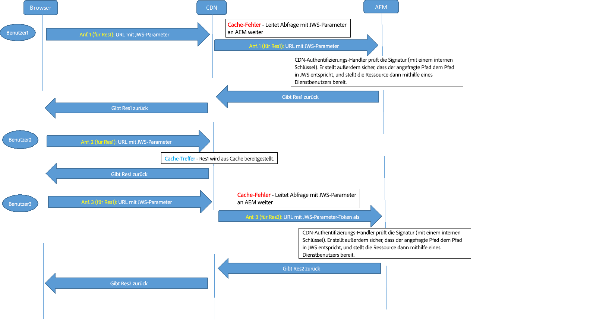

# OSGi-Konfigurationseinstellungen{#osgi-configuration-settings}

[OSGi](https://www.osgi.org/) ist ein grundlegendes Element im Technologiestapel von AEM. OSGi wird zur Steuerung der AEM-Bundles und ihrer Konfiguration verwendet.

OSGi *bietet standardisierte Grundbausteine – kleine, wiederverwendbare, gemeinsame genutzte Komponenten. Diese Komponenten können zu einem Programm zusammengefügt und bereitgestellt werden*&quot;.

Dies ermöglicht die einfache Verwaltung von Bundles, da diese einzeln angehalten, installiert und gestartet werden können. Die gegenseitigen Abhängigkeiten werden automatisch verwaltet. Jede OSGi-Komponente (siehe [OSGi-Spezifikation](https://www.osgi.org/Specifications/HomePage)) ist in einem der Bundles enthalten. Beim Arbeiten mit AEM haben Sie verschiedene Möglichkeiten, Konfigurationseinstellungen für diese Bundles zu verwalten. Einzelheiten und empfohlene Vorgehensweisen finden Sie unter [Konfigurieren von OSGi](/help/sites-deploying/configuring-osgi.md).

Die folgenden OSGi-Konfigurationseinstellungen (nach Bundle aufgelistet) sind für die Projektimplementierung relevant. Nicht alle aufgeführten Einstellungen müssen angepasst werden. Einige werden nur zum besseren Verständnis von AEM erwähnt.

>[!CAUTION]
>
>Die Liste soll als Leitfaden dienen und ist nicht vollständig. Nicht alle Bundles sind aufgelistet. Und für die genannten Bundles sind nicht alle Parameter aufgelistet.
>
>Die erforderliche Konfiguration hängt vom jeweiligen Projekt ab.
>
>Informationen zu den verwendeten Werten und Details zu den Parametern finden Sie in der Web-Konsole.

>[!NOTE]
>
>Das OSGi Configuration Diff-Tool, Teil des [AEM Tools](https://helpx.adobe.com/experience-manager/kb/tools/aem-tools.html)kann verwendet werden, um die standardmäßigen OSGi-Konfigurationen aufzulisten.

>[!NOTE]
>
>Für spezifische Funktionsbereiche in AEM sind möglicherweise weitere Bundles erforderlich. In solchen Fällen können Sie die Konfigurationsdetails der Seite entnehmen, die sich auf die entsprechende Funktion bezieht.

**AEM Replikations-Ereignis-Listener** Konfigurieren:

* Die **Ausführungsmodi**, in dem Replikationsereignisse an Listener verteilt werden. Wenn beispielsweise als Autor definiert, ist dies das System, das die Replikation &quot;initiiert&quot;.

* Ausführungsmodus **publish** muss hinzugefügt werden, wenn der Projekt-Code Replikationsereignisse (Rückwärtsreplikation) in einer Veröffentlichungsumgebung verarbeitet. Dies ist beispielsweise der Fall, wenn der Dispatcher zum Leeren aus der Veröffentlichungsumgebung verwendet wird oder wenn eine standardmäßige Replikation auf andere Veröffentlichungsinstanzen erfolgt.

**AEM Repository Change Listener** Konfigurieren:

* Die **Pfade**, Speicherorte, um auf Repository-Ereignisse zu warten, die für die Verteilung bereit sind.

**CRX Sling Client Repository** Konfigurieren Sie den Zugriff auf das zugrunde liegende Inhalts-Repository.

* Die **Administratorkennwort** nach der Installation geändert werden, um sicherzustellen, dass die [security](/help/sites-administering/security-checklist.md) Ihrer Instanz.
* Andere Änderungen sollten nicht erforderlich sein und müssen mit Vorsicht erfolgen, da sie den Zugriff auf das Repository beeinträchtigen können.

**Wiki Mail Service** Konfigurieren Sie die E-Mail-Einstellungen für E-Mails, die von einem Wiki gesendet werden.

**Apache Felix OSGi Management Console** Konfigurieren:

* **Plug-ins**: die Hauptnavigationselemente (Konsolen-Plug-ins), die als oberste Menüelemente in der **Apache Felix Web Management Console** verfügbar sein sollen. Deaktivieren Sie alle nicht benötigten Elemente, da sie sonst Platz und Ressourcen verbrauchen.

>[!CAUTION]
>
>Stellen Sie sicher, dass Sie Folgendes konfigurieren:
>
>**Benutzername** und **Kennwort**: die Anmeldedaten für den Zugriff auf die Apache Felix Web Management Console.
>Das Kennwort muss nach der ersten Installation geändert werden, damit die [Sicherheit](/help/sites-administering/security-checklist.md) Ihrer Instanz gewährleistet ist.

>[!NOTE]
>
>Nehmen Sie diese Konfiguration in der Felix Console vor, die zum Starten erforderlich ist – bevor das Repository verfügbar ist.

**Apache Sling Customizable Request Data Logger** Konfigurieren:

* **Name der Protokollfunktion** und **Protokollformat** für den Speicherort und das Format von Anforderungen und Zugriffsprotokollierung (Standard: `request.log`). Diese Protokolldatei ist sehr wichtig, wenn Sie die Leistung analysieren oder auf die Web-Kette bezogene Funktionen debuggen möchten.
Dieser ist gepaart mit dem [Apache Sling Request Logger](#apacheslingrequestlogger).

Weitere Informationen finden Sie unter [AEM-Protokollierung](/help/sites-deploying/configure-logging.md) und [Sling-Protokollierung](https://sling.apache.org/site/logging.html).

**Apache Sling Eventing Thread Pool** Konfigurieren:

* **Minimale Poolgröße** und **Maximale Poolgröße**: die Größe des Pools, der zum Speichern von Ereignis-Threads verwendet wird.

* **Warteschlangengröße**, die maximale Größe der Thread-Warteschlange, wenn der Pool erschöpft ist.
Der empfohlene Wert lautet `-1` da dies die Warteschlange auf unbegrenzt festlegt; Wenn ein Limit festgelegt ist, kann es bei Überschreitung zu Verlusten kommen.

* Eine Änderung dieser Einstellungen kann bei Szenarien mit einer hohen Anzahl von Ereignissen zur Leistung beitragen. z. B. starke AEM DAM- oder Workflow-Nutzung.
* Für Ihr Szenario spezifische Werte sollten mithilfe von Tests festgelegt werden.
* Diese Einstellungen können sich auf die Leistung Ihrer Instanz auswirken. Ändern Sie sie daher nicht ohne Grund und gebührende Berücksichtigung.

**Apache Sling GET Servlet** Konfigurieren Sie einige Aspekte des Renderings:

* **Auto Index** zum Aktivieren/Deaktivieren der Verzeichnisausgabe beim Browsen.
* **Aktivieren** (oder deaktivieren) Sie Standardausgaben wie **HMTL**, **Nur Text**, **JSON** oder **XML**.
Sie sollten JSON nicht deaktivieren.

>[!NOTE]
>
>Diese Einstellung wird für Produktionsinstanzen automatisch konfiguriert, wenn Sie AEM im [produktionsbereiten Modus](/help/sites-administering/production-ready.md) ausführen.

**Apache Sling Java Script Handler** Konfigurieren Sie Einstellungen für die Kompilierung von Java-Dateien als Skripten (Servlets).

Bestimmte Einstellungen können die Leistung beeinträchtigen. Deaktivieren Sie diese, falls möglich, insbesondere für Produktionsinstanzen.

* S **ource VM** und **Target VM** definieren die JDK-Version als die für Runtime JVM verwendete Version.

* Für Produktionsinstanzen:

   * Deaktivieren Sie **Generate Debug Info**.

**Apache Sling JCR-Installationsprogramm** Diese Parameter benötigen wahrscheinlich keine Konfiguration, können aber bei der Entwicklung oder beim Debugging nützlich sein, um sie zu kennen. Beispielsweise kann es nützlich sein, die Installationsordner ein- oder auszuchecken oder ein Paket zu erstellen.

* **Installation folders name regexp** und **Max hierarchy depth of install folders** geben an, wo und bis zu welcher Ebene Repository-Ordner nach zu installierenden Ressourcen durchsucht werden. Bei Verwendung eines Platzhalters (wie in*/install) werden alle passenden Treffer durchsucht, z. B. `/libs/sling/install` und `/libs/cq/core/install`.

* **Search Path** listet die Pfade auf, in denen jcrinstall nach zu installierenden Ressourcen sucht, und eine Ziffer, die den Gewichtungsfaktor für den Pfad angibt.

**Apache Sling Job Event Handler** Konfigurieren Sie Parameter, die die Auftragsplanung verwalten:

* **Wiederholungsintervall**, **Maximale Wiederholungen**, **Maximale Anzahl paralleler Aufträge**, **Wartezeit für Bestätigung**, unter anderem.

* Eine Änderung dieser Einstellungen kann die Leistung in Szenarien mit einer hohen Anzahl von Aufträgen verbessern. z. B. starke Nutzung von AEM DAM und Workflows.
* Für Ihr Szenario spezifische Werte sollten mithilfe von Tests festgelegt werden.
* Ändern Sie diese Einstellungen nicht ohne Grund, sondern nur nach gebührender Berücksichtigung.

**Apache Sling JSP Script Handler** Konfigurieren Sie leistungsrelevante Einstellungen für den JSP-Skript-Handler. Um die Leistung zu verbessern, sollten Sie so viele Parameter wie möglich deaktivieren.

Insbesondere für Produktionsinstanzen:

* Deaktivieren Sie **Generate Debug Info**.
* Deaktivieren Sie **Keep Generated Java**.
* Deaktivieren Sie **Mapped Content**.
* Deaktivieren Sie **Display Source Fragments**.

>[!NOTE]
>
>Diese Einstellung wird für Produktionsinstanzen automatisch konfiguriert, wenn Sie AEM im [produktionsbereiten Modus](/help/sites-administering/production-ready.md) ausführen.

**Apache Sling Logging Configuration** Konfigurieren:

* **Log Level** und **Log File** definieren den Speicherort und die Protokollebene der zentralen Protokollierungskonfiguration (error.log). Die Ebene kann auf einen von `DEBUG`, `INFO`, `WARN`, `ERROR` und `FATAL`.

* **Number of Log Files** und **Log File Threshold** geben die Größe und die Versionsrotation der Protokolldatei an.

* **Message Pattern** definiert das Format der Protokollmeldungen.

Weitere Informationen finden Sie unter [AEM-Protokollierung](/help/sites-deploying/configure-logging.md#global-logging) und [Sling-Protokollierung](https://sling.apache.org/site/logging.html).

**Apache Sling Logging Logger-Konfiguration (Werkskonfiguration)** Konfigurieren:

* **Log Level**, **Log File** und **Message Format** definieren Details in den Protokolldateien und -meldungen.

* **Logger** gibt die Kategorie an, z. B. nur Protokollierungen für com.day.cq.

* Anhand der **Factory-Konfigurationen** können beliebig viele zusätzliche Konfigurationen für die gewünschten Protokollierungsebenen und Kategorien hinzugefügt werden.
* Diese Konfigurationen sind bei der Entwicklung hilfreich, z. B. um TRACE-Benachrichtigungen für einen bestimmten Dienst in einer bestimmten Protokolldatei zu erfassen.
* Diese Konfigurationen sind in einer Produktionsumgebung hilfreich, z. B. Benachrichtigungen zu einem bestimmten, in einer Protokolldatei erfassten Dienst für eine einfachere Überwachung.

Weitere Informationen finden Sie unter [AEM-Protokollierung](/help/sites-deploying/configure-logging.md) und [Sling-Protokollierung](https://sling.apache.org/site/logging.html).

**Apache Sling Logging Writer Configuration (Factory Configuration)** Konfigurieren:

* **Log File** gibt an, dass eine Protokolldatei vorhanden ist.
* **Number of Log Files** gibt die Versionsrotation an.

* Der Verfasser kann von **Apache Sling Logging Logger**-Konfigurationen verwendet werden.

* Diese Konfigurationen sind bei der Entwicklung hilfreich, z. B. um TRACE-Benachrichtigungen für einen bestimmten Dienst in einer bestimmten Protokolldatei zu erfassen.
* Diese Konfigurationen sind in einer Produktionsumgebung hilfreich, z. B. Benachrichtigungen zu einem bestimmten, in einer Protokolldatei erfassten Dienst für eine einfachere Überwachung.

Weitere Informationen finden Sie unter [AEM-Protokollierung](/help/sites-deploying/configure-logging.md) und [Sling-Protokollierung](https://sling.apache.org/site/logging.html).

**Apache Sling Main Servlet** Konfigurieren:

* **Number of Calls per Request** und **Recursion Depth**, um das System vor unendlichen Rekursionen und übermäßigen Skript-Aufrufen zu schützen.

**Apache Sling MIME Type Service** Konfigurieren:

* **MIME-Typen**, um die für Ihr Projekt erforderlichen Typen hinzuzufügen. Dadurch kann eine `GET`-Anforderung einer Datei die richtige Kopfzeile für den Inhaltstyp zum Verknüpfen von Dateityp und Anwendung festlegen.

**Apache Sling Referrer Filter** Um bekannte Sicherheitsprobleme mit Cross-Site Request Forgery (CSRF) in CRX WebDAV und Apache Sling zu beheben, müssen Sie den Filter Referrer konfigurieren.

Der Referrer-Filter-Dienst ist ein OSGi-Dienst, mit dem Sie Folgendes konfigurieren können:

* Welche HTTP-Methoden gefiltert werden sollen
* Ob eine leere Referrer-Kopfzeile zulässig ist
* und eine Liste der Server, die zusätzlich zum Server-Host zulässig sein sollen.

Weitere Informationen finden Sie unter [Sicherheitsprüfliste – Probleme mit Site-übergreifenden Anforderungsfälschungen](/help/sites-administering/security-checklist.md#protect-against-cross-site-request-forgery).

>[!NOTE]
>
>Für den Apache Sling Referrer-Filter muss ein Quick Fix-Paket installiert werden.

**Apache Sling Request Logger** Konfigurieren:

* unterschiedliche Parameter, die festlegen, wie Anforderungen zugeordnet werden.
* **Enable Request Log** zum Aktivieren oder Deaktivieren.

* **Enable Access Log** zum Aktivieren oder Deaktivieren.

Dies ist gepaart mit dem [Apache Sling Customizable Request Data Logger](#apacheslingcustomizablerequestdatalogger).

Weitere Informationen finden Sie unter [AEM-Protokollierung](/help/sites-deploying/configure-logging.md) und [Sling-Protokollierung](https://sling.apache.org/site/logging.html).

**Apache Sling Resource Resolver Factory** Konfigurieren Sie zentrale Aspekte der Sling-Ressourcenauflösung:

* **Ressourcensuchpfad**(s) Fügen Sie projektspezifische Pfade hinzu (entfernen Sie sie jedoch nicht `/libs` oder `/apps`).

* **Virtual URLs** zum Definieren der Vanity-URL-Zuweisungen.

* **URL-Zuordnungen** Alias zu definieren; Beispiel aus `/content` nach `/`.

* **Zuordnungsort**, die Zuordnungskonfiguration, die in `/etc/map`.

* Verwenden Sie Ihre lokale Installation (z. B. `https://localhost:4502/system/console/jcrresolver`), um zu bestimmen, welcher Resource Resolver aktiv ist.

Weitere Informationen finden Sie unter [https://cwiki.apache.org/confluence/display/SLING/Flexible+Resource+Resolution.](https://cwiki.apache.org/confluence/display/SLING/Flexible+Resource+Resolution)

>[!CAUTION]
>
>Insbesondere diese Optionen müssen im Repository konfiguriert werden.
>
>Andernfalls werden die mit der Felix-Konsole vorgenommenen Änderungen an **URL-Zuordnungen** beim nächsten Neustart möglicherweise von AEM überschrieben.

**Apache Sling Servlet/Script-Resolver und Fehler-Handler** Das Sling-Servlet und der Skript-Resolver haben mehrere Aufgaben:

1. Sie werden als `ServletResolver` verwendet, die das Servlet oder Skript zum Abwickeln der Anforderung auswählen.

1. Sie fungiert als `SlingScriptResolver`.

1. Sie sind für die Fehlerbehebung zuständig, indem sie die `ErrorHandler`-Schnittstelle implementieren und dabei denselben Algorithmus für Servlets und Skripts auswählen, der auch für Servlets und Skripts für die Anforderungsabwicklung verwendet wird.

Verschiedene Parameter können festgelegt werden, z. B.:

* **Execution Paths** gibt die Pfade an, die nach ausführbaren Skripts durchsucht werden sollen. Durch Konfigurieren bestimmter Pfade können Sie begrenzen, welche Skripts ausgeführt werden. Wenn kein Pfad konfiguriert ist, wird der Standard verwendet ( `/` = root), dies ermöglicht die Ausführung aller Skripte.
Falls ein konfigurierter Pfadwert mit einem Schrägstrich endet, wird die gesamte Unterstruktur durchsucht. Ohne einen Schrägstrich am Ende wird das Skript nur ausgeführt, wenn es sich um eine genaue Übereinstimmung handelt.

* **Script User**: Mit dieser optionalen Eigenschaft kann das Repository-Benutzerkonto angegeben werden, das zum Lesen der Skripts verwendet wird. Falls kein Konto angegeben ist, wird standardmäßig das `admin`-Benutzerkonto verwendet.

* **Default Extensions**: Die Liste der Erweiterungen, für die das Standardverhalten verwendet wird. Dies bedeutet, dass das letzte Pfadsegment des Ressourcentyps als Skriptname verwendet werden kann.

**Day Commons GFX Font Helper** Beim Rendern von Grafiken können Sie DrawText verwenden, um Text einzubetten. Dazu können Sie auch Ihre eigenen Schriftarten installieren:

* Definieren Sie die **Schriftpfad** , um nach projektspezifischen Schriftarten zu suchen.
Beispiel: `/apps/myapp/fonts`.

**Apache HTTP Components Proxy Configuration** Proxy-Konfiguration für sämtlichen Code, der den Apache-HTTP-Client verwendet, der beim Erstellen eines HTTP verwendet wird; z. B. bei der Replikation.

Nehmen Sie beim Erstellen einer neuen Konfiguration keine Änderungen an der Werkskonfiguration vor, sondern erstellen Sie stattdessen eine neue Werkskonfiguration für diese Komponente mithilfe des Konfigurationsmanagers, der hier verfügbar ist: **https://localhost:4502/system/console/configMgr/**. Die Proxy-Konfiguration ist verfügbar unter **org.apache.http.proxyconfigurator.**

>[!NOTE]
>
>In AEM 6.0 und früheren Versionen wurde der Proxy im Day Commons-HTTP-Client konfiguriert. Ab AEM 6.1 erfolgt die Proxy-Konfiguration über die „Apache HTTP Components Proxy Configuration“ anstatt im „Day Commons HTTP Client“.

**Day CQ Antispam** Konfigurieren Sie den verwendeten Anti-Spam-Dienst (Akismet). Dazu müssen Sie Folgendes registrieren:

* **Provider**
* **API-Schlüssel**
* **Registrierte URL**

**Adobe Granite HTML Library Manager** Konfigurieren Sie dies, um die Verarbeitung von Client-Bibliotheken (css oder js) zu steuern. einschließlich beispielsweise der Darstellung der zugrunde liegenden Struktur.

* Für Produktionsinstanzen:

   * Aktivieren Sie **Minify** (um Neuzeilenzeichen [CRLF] und Leerzeichen zu löschen).
   * Aktivieren Sie **Gzip** (um Dateien als GZIP zu komprimieren und mit einer Anforderung darauf zuzugreifen).
   * Deaktivieren Sie **Debug**.
   * Deaktivieren Sie **Timing**.

* Für die JS-Entwicklung (insbesondere beim Firebugging/Debugging):

   * Deaktivieren Sie **Minify**.
   * Aktivieren Sie **Debug**, um die Dateien für das Debuggen und für die Verwendung mit Firebug zu trennen.
   * Aktivieren Sie **Timing**, falls das Timing von Interesse ist.
   * Aktivieren Sie **Debug Console**, um die Protokollmeldungen der JS-Konsole anzuzeigen.

>[!CAUTION]
>
>Wenn Sie die Einstellung für **Minimieren** oder **Gzip** Sie müssen auch den Inhalt von `/var/clientlibs`. Dies ist eine zwischengespeicherte Version der Client-Bibliotheken, die bei der nächsten Anforderung neu erstellt werden.

>[!NOTE]
>
>Diese Einstellung wird für Produktionsinstanzen automatisch konfiguriert, wenn Sie AEM im [produktionsbereiten Modus](/help/sites-administering/production-ready.md) ausführen.

**Day CQ HTTP Header Authentication Handler** Systemweite Einstellungen für die grundlegende Authentifizierungsmethode der HTTP-Anforderung.

Wenn Sie [geschlossene Benutzergruppen](/help/sites-administering/cug.md) verwenden, können Sie u. a. Folgendes konfigurieren:

* Den **HTTP-Bereich**
* Die **Standard-Anmeldeseite**

**Day CQ Link Checker Service** Überprüfen und konfigurieren Sie bei Bedarf Folgendes:

* **Scheduler Period**: definiert das Intervall, in dem externe Links automatisch überprüft werden.

* Überprüfen Sie **Bad Link Tolerance Interval** für den Zeitraum, nach dem ein nicht erfolgreicher externer Link als nicht korrekt betrachtet wird.
* **Link Check Override Patterns**: definiert alle Pfade, die von der Link-Überprüfung ausgenommen werden sollen.

**Day CQ Link Checker Task** Konfigurieren Sie die Einstellungen für eine Aufgabe mit einem einzelnen Link-Checker (eine Aufgabe, die einen externen Link überprüft):

* Überprüfen Sie die unter **Good Link Test Interval** und **Bad Link Test Interval**  festgelegten Intervalle.

* Die diversen Parameter, die sich auf Proxys für den Internetzugriff und NTLM beziehen und beim Überprüfen eines Links für den externen Zugriff benötigt werden.

**Day CQ Mail Service** Konfigurieren Sie den Hostnamen und die Zugriffsdetails für den E-Mail-Server. Einzelheiten finden Sie im Abschnitt Konfigurieren des E-Mail-Dienstes.

**Day CQ MCM Newsletter** Konfigurieren Sie die verschiedenen Einstellungen, die für den Newsletter verwendet werden.

**Day CQ Root Mapping** Konfigurieren:

* **Zielpfad** , um festzulegen, wo eine Anforderung an &quot; `/`&quot; umgeleitet werden.

In AEM sind zwei Benutzeroberflächen verfügbar:

* Die Touch-optimierte Benutzeroberfläche ist die standardmäßige Benutzeroberfläche von AEM
* und die veraltete klassische Benutzeroberfläche ist weiterhin voll funktionsfähig

Mit AEM Root Mapping können Sie die Benutzeroberfläche konfigurieren, die Sie als Standard für Ihre Instanz verwenden möchten:

* So verwenden Sie die Touch-optimierte Benutzeroberfläche als Standardbenutzeroberfläche **Zielpfad** sollte auf Folgendes verweisen:

   ```
      /projects.html
   ```

* Wenn Sie die klassische Benutzeroberfläche als Standard verwenden möchten, muss der **Zielpfad** auf Folgendes verweisen:

   ```
      /welcome.html
   ```

>[!NOTE]
>
>Nach einer Standardinstallation wird die Touch-optimierte Benutzeroberfläche zur Standardbenutzeroberfläche.

**Adobe Granite SSO Authentication Handler** Konfigurieren von Single Sign-On (SSO)-Details; Diese werden häufig in Unternehmensautorenkonfigurationen benötigt, häufig in Verbindung mit LDAP.

Verschiedene Eigenschaften können konfiguriert werden: 

* **Path** Der Pfad, für den dieser Authentifizierungs-Handler aktiv ist. Wenn dieser Parameter nicht angegeben wird, ist der Authentifizierungs-Handler deaktiviert. Beispielsweise wird beim Pfad / der Authentifizierungs-Handler für das gesamte Repository verwendet.

* **Service Ranking** Der Rangfolge-Wert für den OSGi-Framework-Dienst gibt die Reihenfolge an, in der dieser Dienst aufgerufen wird. Dies ist eine 
`int` -Wert, wobei höhere Werte eine höhere Priorität angeben.
Der Standardwert ist `0`.

* **Header Names** Die Namen von Kopfzeilen, die möglicherweise eine Benutzer-ID enthalten.

* **Cookie Names** Die Namen von Cookies, die möglicherweise eine Benutzer-ID enthalten.

* **Parameter Names** Die Namen von Anforderungsparametern, die möglicherweise eine Benutzer-ID angeben.

* **User Map** Für bestimmte Benutzer kann der aus der HTTP-Anforderung extrahierte Benutzername im Anmeldedaten-Objekt durch einen anderen Namen ersetzt werden. Die Zuordnung ist hier definiert. Wenn der Benutzername 
`admin` auf beiden Seiten der Zuordnung angezeigt wird, wird die Zuordnung ignoriert. Beachten Sie, dass das Zeichen „=“ durch ein führendes „\“ geschützt werden muss.

* **Format** Gibt das Format an, in dem die Benutzer-ID angegeben ist. Verwenden Sie:

   * `Basic`, falls die Benutzer-ID im HTTP-Standard-Authentifizierungsformat kodiert ist
   * `AsIs`, falls die Benutzer-ID im Nur-Text-Format bereitgestellt wird, oder jeder für reguläre Ausdrücke gültige Wert unverändert bzw. jeder reguläre Ausdruck verwendet werden soll

**Day CQ WCM Debug Filter** Dies ist bei der Entwicklung nützlich, da es die Verwendung von Suffixen wie ?debug=layout beim Zugriff auf eine Seite ermöglicht. Beispielsweise stellt https://localhost:4502/cf#/content/geometrixx/en/support.html?debug=layout Layoutinformationen bereit, die für den Entwickler von Interesse sein können.

* Deaktivieren Sie diese Option bei Produktionsinstanzen, um die Leistung und Sicherheit zu gewährleisten.

**Day CQ WCM Filter** Konfigurieren:

* **WCM-Modus **zum Definieren des Standardmodus.
* Auf einer Autoreninstanz kann dies `edit`, `disable,preview` oder `analytics`.
Die anderen Modi können über den Sidekick oder das Suffix aufgerufen werden `?wcmmode=disabled` kann verwendet werden, um eine Produktionsumgebung zu emulieren.

* Auf einer Veröffentlichungsinstanz muss für diesen Modus `disabled` festgelegt sein, um sicherzustellen, dass keine anderen Modi zugänglich sind.

>[!NOTE]
>
>Diese Einstellung wird für Produktionsinstanzen automatisch konfiguriert, wenn Sie AEM im [produktionsbereiten Modus](/help/sites-administering/production-ready.md) ausführen.

**Day CQ WCM Link Checker Configurator** Konfigurieren:

* Die **Liste der Rewrite-Konfigurationen** enthält die Speicherorte für Inhalts-basierte Link-Prüfer-Konfigurationen. Die Konfigurationen können auf dem Ausführungsmodus basieren. Es muss zwischen Autoren- und Veröffentlichungsumgebungen unterschieden werden, da die Einstellungen des Link-Prüfers für diese unterschiedlich sein können.

**Day CQ WCM Page Manager Factory** Konfigurieren:

* **Prüfung der Unterbaumaktivierung der Seite** für einen Benutzer (ohne Replikationsberechtigungen), um Seiten zu löschen oder zu verschieben (auch wenn die Seiten nicht aktiviert sind).

**Day CQ WCM Page Processor** Konfigurieren:

* **Paths**: eine Liste der Speicherorte, die das System auf Seitenänderungen überwacht, bevor ein `jcr:Event` ausgelöst wird.

**Adobe Page Impressions Tracker** Konfigurieren Sie für eine Autoreninstanz Folgendes:

* **sling.auth.requirements**: Legen Sie den Wert dieser Eigenschaft auf `-/libs/wcm/stats/tracker`

>[!CAUTION]
>
>Diese Konfiguration ermöglicht anonyme Anforderungen an den Nachverfolgungsdienst.

>[!NOTE]
>
>Weitere Informationen finden Sie unter [Seitenimpressionen](/help/sites-deploying/configuring.md#enabling-page-impressions).

**Day CQ WCM Page Statistics** Konfigurieren Sie für eine Veröffentlichungsinstanz Folgendes:

* **URL to send data**: konfiguriert die zum Nachverfolgen der Seitenstatistiken verwendete URL (wichtig, falls eine Nachverfolgungsanforderung über den Dispatcher geleitet wird); der Standardwert lautet beispielsweise `https://localhost:4502/libs/wcm/stats/tracker`.

* **Tracking script enabled**: aktiviert (`true`) oder deaktiviert (`false`) den Einschluss der Nachverfolgungsskripts auf den Seiten. Der Standardwert ist `false`.

>[!NOTE]
>
>Weitere Informationen finden Sie unter [Seitenimpressionen](/help/sites-deploying/configuring.md#enabling-page-impressions).

**Day CQ WCM Version Manager** Steuern Sie, ob und wie Versionen in Ihrem System verwaltet werden:

* **Create Version on Activation** ist bei der Standardinstallation aktiviert.
* **Enable Purging**

* **Purge Paths**: die von einem Suchvorgang durchsuchten Pfade.
* **Implicit Versioning Paths**: die Pfade, bei denen die implizite Versionierung aktiv ist.

* **Max Version Age**: das maximale Alter (in Tagen) einer Version.

* **Max Number Versions**: die maximale Anzahl der beizubehaltender Versionen.

Weitere Informationen finden Sie unter [Löschen von Versionen](/help/sites-deploying/version-purging.md).

**Day CQ Workflow Email Notification Service** Konfigurieren Sie die E-Mail-Einstellungen für Benachrichtigungen, die von einem Workflow gesendet werden.

**CQ-Rewriter – HTML-Parser-Factory**

Steuert den HTML-Parser für den CQ-Rewriter.

* **Additional Tags to Process**: Sie können HTML-Tags, die vom Parser verarbeitet werden sollen, hinzufügen oder entfernen. Standardmäßig werden die folgenden Tags verarbeitet: A, IMG, AREA, FORM, BASE, LINK, SCRIPT, BODY, HEAD.
* **Camel Case beibehalten** - Standardmäßig konvertiert der HTML-Parser Attribute in Binnenmajuskel-Schreibweise (z. B. eBay) in Kleinbuchstaben (z. B. ebay). Sie können dies jedoch deaktivieren, um die gemischte Groß-/Kleinschreibung von Attributen beizubehalten. Dies ist hilfreich, wenn Sie Frontend-Frameworks wie Angular 2 verwenden.

**Day Commons JDBC Connections Pool** Konfigurieren Sie den Zugriff auf eine externe Datenbank, die als Quelle für Inhalte verwendet wird.

Dies ist eine Factory-Konfiguration, sodass mehrere Instanzen konfiguriert werden. 

**Adobe CQ Media DPS-Sitzungsdienst** Verwalten von DPS-Sitzungen zur Verwendung mit Veröffentlichungen.

Insbesondere können Sie `dps.session.service.url.name` konfigurieren. Die Standardeinstellung ist [https://dpsapi2.digitalpublishing.acrobat.com/webservices/sessions](https://dpsapi2.digitalpublishing.acrobat.com/webservices/sessions)

**CDN Rewriter** Die Kommunikation zwischen AEM und einem CDN muss sichergestellt sein, damit Assets/Binärdateien auf sichere Weise an den Endbenutzer bereitgestellt werden. Dies beinhaltet zwei Aufgaben:

* Den Zugriff auf die Ressource von AEM aus über das CDN beim ersten Versuch (oder wenn sich die Ressource nicht mehr im Zwischenspeicher befindet).
* Den sicheren Zugriff auf die im CDN zwischengespeicherte Ressource, denn sobald die Ressource im CDN zwischengespeichert ist, wird die Anforderung nicht an AEM gerichtet, sondern alle Benutzer mit Zugriff auf die Ressource werden vom CDN bedient.

AEM stellt einen Rewriter für das Neuschreiben interner Asset-URLs als externe CDN-URLs bereit. Für den sicheren Zugriff auf das Asset schreibt AEM Links neu, die an das CDN weitergegeben werden, einschließlich einer JWS-Signatur und einer Ablaufzeit. Diese Funktion ist für die Verwendung auf Autoreninstanzen gedacht.

Der Gesamtablauf sieht wie folgt aus:

1. Der Benutzer authentifiziert sich bei AEM und fordert eine Seite mit Assets an.
1. Die angeforderte Seite enthält ein Asset, das dem `/content/dam/geometrixx-media/articles/paladin_trailer.jpg/jcr:content/renditions/cq5dam.thumbnail.319.319.png`
1. Rewriter wandelt den Link in eine CDN-URL um, die eine JWS-Signatur enthält:
   `CDN_domain/content/dam/geometrixx-media/articles/paladin_trailer.jpg/_jcr_content/renditions/cq5dam.thumbnail.319.319.png?cdn_sign=JWS_SIGNATURE`

1. Der Browser des Benutzers leitet die Asset-Anforderung an den CDN-Server weiter.
1. CDN sollte so konfiguriert werden, dass die Anforderung zusammen mit dem `cdn_sign`-Parameter an AEM weitergeleitet wird.
1. Ein Authentifizierungs-Handler validiert den `cdn_sign`-Parameter und gibt das Asset an CDN zurück. Von dort wird es an den Benutzer übermittelt.

Der Fluss zwischen dem Browser des Benutzers, dem CDN und AEM sieht wie folgt aus:



>[!NOTE]
>
>Diese Funktion ist derzeit nur für AEM-Autoreninstanzen aktiviert.

**CDNConfigServiceImpl** Bietet CDN-Konfigurationen

Die CDN-Umschreibungsfunktion kann durch Bereitstellung von **Domain-Name der CDN-Verteilung** in der Konfiguration für com.adobe.cq.cdn.rewriter.impl.CDNConfigServiceImpl.

Der Dienst enthält auch andere Konfigurationsoptionen wie das Aktivieren/Deaktivieren der CDN-Neuschreib-Funktion, Pfad-Präfixe für das Neuschreiben durch CDN, TTL-Werte und Protokolle (HTTP oder HTTPS).

**CDNRewriter** Ein Rewriter zum Neuschreiben interner Bild-URLs in CDN-URLs

Die **Tag-Attribute** -Wert in com.adobe.cq.cdn.rewriter.impl.CDNRewriter definiert werden, sodass nur selektive Bildlinks umgeschrieben werden.
