# Leistungsrichtlinien{#performance-guidelines}

Diese Seite erhält allgemeine Richtlinien zur Optimierung der Leistung Ihrer AEM-Installation. Wenn Sie ein neuer AEM-Benutzer sind, gehen Sie die folgenden Seiten durch, bevor Sie diese Leistungsrichtlinien lesen:

* [AEM – Grundkonzepte](/help/sites-deploying/deploy.md#basic-concepts)
* [Überblick über Speicher in AEM](/help/sites-deploying/storage-elements-in-aem-6.md#overview-of-storage-in-aem)
* [Empfohlene Bereitstellungen](/help/sites-deploying/recommended-deploys.md)
* [Technische Anforderungen](/help/sites-deploying/technical-requirements.md)

Nachfolgend sind die verfügbaren Bereitstellungsoptionen für AEM dargestellt (Bildlauf zur Ansicht aller Optionen):

<table>
 <tbody>
  <tr>
   <td>
<strong>AEM</strong>
 
<strong>Produkt</strong>
 </td>
   <td>
<strong>Topologie</strong>
 </td>
   <td>
<strong>Betriebssystem</strong>
 </td>
   <td>
<strong>Anwendungsserver</strong>
 </td>
   <td>
<strong>JRE </strong>
 </td>
   <td>
<strong>Sicherheit</strong>
 </td>
   <td>
<strong>Mikrokernel </strong>
 </td>
   <td>
<strong>Datenspeicher </strong>
 </td>
   <td>
<strong>Indizierung</strong>
 </td>
   <td>
<strong>Webserver</strong>
 </td>
   <td>
<strong>Browser</strong>
 </td>
   <td>
<strong>Marketing Cloud</strong>
 </td>
  </tr>
  <tr>
   <td>
Sites
 </td>
   <td>
Keine HA
 </td>
   <td>
Windows
 </td>
   <td>
CQSE
 </td>
   <td>
Oracle
 </td>
   <td>
LDAP
 </td>
   <td>
Tar
 </td>
   <td>
Segment
 </td>
   <td>
Property
 </td>
   <td>
Apache
 </td>
   <td>
Edge
 </td>
   <td>
Target
 </td>
  </tr>
  <tr>
   <td>
Assets
 </td>
   <td>
Veröffentlichen – HA
 </td>
   <td>
Solaris
 </td>
   <td>
WebLogic
 </td>
   <td>
IBM
 </td>
   <td>
SAML
 </td>
   <td>
MongoDB
 </td>
   <td>
File
 </td>
   <td>
Lucene
 </td>
   <td>
IIS
 </td>
   <td>
IE
 </td>
   <td>
Analytics
 </td>
  </tr>
  <tr>
   <td>
Communities
 </td>
   <td>
Autor – CS
 </td>
   <td>
Red Hat
 </td>
   <td>
WebSphere
 </td>
   <td>
HP
 </td>
   <td>
Oauth
 </td>
   <td>
RDB/Oracle
 </td>
   <td>
S3/Azure
 </td>
   <td>
Solr
 </td>
   <td>
iPlamet
 </td>
   <td>
Firefox
 </td>
   <td>
Campaign
 </td>
  </tr>
  <tr>
   <td>
Formulare
 </td>
   <td>
Autor – Abladung
 </td>
   <td>
HP-UX
 </td>
   <td>
Tomcat 
 </td>
   <td>
 
 </td>
   <td>
 
 </td>
   <td>
RDB/DB2
 </td>
   <td>
MongoDB
 </td>
   <td>
 
 </td>
   <td>
 
 </td>
   <td>
Chrome
 </td>
   <td>
Social
 </td>
  </tr>
  <tr>
   <td>
Mobilgerät
 </td>
   <td>
Autor – Cluster
 </td>
   <td>
IBM AIX
 </td>
   <td>
JBoss
 </td>
   <td>
 
 </td>
   <td>
 
 </td>
   <td>
RDB/MySQL
 </td>
   <td>
RDBMS
 </td>
   <td>
 
 </td>
   <td>
 
 </td>
   <td>
Safari
 </td>
   <td>
Audience
 </td>
  </tr>
  <tr>
   <td>
Multi-Site
 </td>
   <td>
ASRP
 </td>
   <td>
SUSE
 </td>
   <td>
 
 </td>
   <td>
 
 </td>
   <td>
 
 </td>
   <td>
RDB/SQL Server
 </td>
   <td>
 
 </td>
   <td>
 
 </td>
   <td>
 
 </td>
   <td>
 
 </td>
   <td>
Assets
 </td>
  </tr>
  <tr>
   <td>
Commerce
 </td>
   <td>
MSRP
 </td>
   <td>
Apple OS
 </td>
   <td>
 
 </td>
   <td>
 
 </td>
   <td>
 
 </td>
   <td>
 
 </td>
   <td>
 
 </td>
   <td>
 
 </td>
   <td>
 
 </td>
   <td>
 
 </td>
   <td>
Aktivierung
 </td>
  </tr>
  <tr>
   <td>
Dynamic Media
 </td>
   <td>
JSRP
 </td>
   <td>
 
 </td>
   <td>
 
 </td>
   <td>
 
 </td>
   <td>
 
 </td>
   <td>
 
 </td>
   <td>
 
 </td>
   <td>
 
 </td>
   <td>
 
 </td>
   <td>
 
 </td>
   <td>
Mobilgerät
 </td>
  </tr>
  <tr>
   <td>
Brand Portal
 </td>
   <td>
J2E
 </td>
   <td>
 
 </td>
   <td>
 
 </td>
   <td>
 
 </td>
   <td>
 
 </td>
   <td>
 
 </td>
   <td>
 
 </td>
   <td>
 
 </td>
   <td>
 
 </td>
   <td>
 
 </td>
   <td>
 
 </td>
  </tr>
  <tr>
   <td>
AoD
 </td>
   <td>
 
 </td>
   <td>
 
 </td>
   <td>
 
 </td>
   <td>
 
 </td>
   <td>
 
 </td>
   <td>
 
 </td>
   <td>
 
 </td>
   <td>
 
 </td>
   <td>
 
 </td>
   <td>
 
 </td>
   <td>
 
 </td>
  </tr>
  <tr>
   <td>
Livefyre
 </td>
   <td>
 
 </td>
   <td>
 
 </td>
   <td>
 
 </td>
   <td>
 
 </td>
   <td>
 
 </td>
   <td>
 
 </td>
   <td>
 
 </td>
   <td>
 
 </td>
   <td>
 
 </td>
   <td>
 
 </td>
   <td>
 
 </td>
  </tr>
  <tr>
   <td>
Screens
 </td>
   <td>
 
 </td>
   <td>
 
 </td>
   <td>
 
 </td>
   <td>
 
 </td>
   <td>
 
 </td>
   <td>
 
 </td>
   <td>
 
 </td>
   <td>
 
 </td>
   <td>
 
 </td>
   <td>
 
 </td>
   <td>
 
 </td>
  </tr>
  <tr>
   <td>
Document Security
 </td>
   <td>
 
 </td>
   <td>
 
 </td>
   <td>
 
 </td>
   <td>
 
 </td>
   <td>
 
 </td>
   <td>
 
 </td>
   <td>
 
 </td>
   <td>
 
 </td>
   <td>
 
 </td>
   <td>
 
 </td>
   <td>
 
 </td>
  </tr>
  <tr>
   <td>
Process Management
 </td>
   <td>
 
 </td>
   <td>
 
 </td>
   <td>
 
 </td>
   <td>
 
 </td>
   <td>
 
 </td>
   <td>
 
 </td>
   <td>
 
 </td>
   <td>
 
 </td>
   <td>
 
 </td>
   <td>
 
 </td>
   <td>
 
 </td>
  </tr>
  <tr>
   <td>
-Desktop-Programm 
 </td>
   <td>
 
 </td>
   <td>
 
 </td>
   <td>
 
 </td>
   <td>
 
 </td>
   <td>
 
 </td>
   <td>
 
 </td>
   <td>
 
 </td>
   <td>
 
 </td>
   <td>
 
 </td>
   <td>
 
 </td>
   <td>
 
 </td>
  </tr>
 </tbody>
</table>

>[!NOTE]
>
>Die Leistungsrichtlinien gelten hauptsächlich für AEM Sites.

## Nutzung der Leistungsrichtlinien {#when-to-use-the-performance-guidelines}

Die Leistungsrichtlinien sollten in den folgenden Situationen Einsatz finden:

* **Erstbereitstellung**: Wenn Sie zum ersten Mal die Bereitstellung von AEM Sites oder Assets planen, müssen Sie sich mit den verfügbaren Optionen zum Konfigurieren des Mikrokernels sowie des Knoten- und Datenspeichers vertraut machen (verglichen mit den Standardeinstellungen). Beispielsweise können die Standardeinstellungen des Datenspeichers für TarMK in einen Dateidatenspeicher geändert werden. 
* **Aktualisierung auf eine neue Version**: Bei der Aktualisierung auf eine neue Version müssen Sie sich über die Leistungsunterschiede im Vergleich zur aktuellen Umgebung im Klaren sein. Beispielsweise bei einer Aktualisierung von AEM 6.1 auf 6.2 oder von AEM 6.0 CRX2 auf 6.2 OAK.
* **Langsame Reaktionszeit**: Wenn die ausgewählte Knotenspeicher-Architektur Ihre Anforderungen nicht erfüllt, müssen Sie wissen, welche Leistungsunterschiede im Vergleich zu anderen Topologieoptionen bestehen. Beispielsweise wenn Sie TarMK anstatt MongoMK bereitstellen oder einen Dateidatenspeicher anstatt eines freigegebenen Amazon S3- oder Microsoft Azure-Datenspeichers verwenden.
* **Hinzufügen weiterer Autorknoten**: Wenn die empfohlene TarMK-Topologie die Leistungsanforderungen nicht erfüllt und durch Upsizing des Autorknotens die maximal verfügbare Kapazität erreicht wurde, müssen Sie wissen, welche Leistungsunterschiede im Vergleich zur Nutzung von MongoMK mit drei oder mehr Autorknoten bestehen. Beispielsweise beim Bereitstellen von MongoMK anstatt TarMK.
* **Hinzufügen weiterer Inhalte**: Wenn die empfohlene Datenspeicherarchitektur Ihre Anforderungen nicht erfüllt, müssen Sie wissen, welche Leistungsunterschiede im Vergleich zu anderen Datenspeicheroptionen bestehen. Beispielsweise bei Verwendung des Amazon S3- oder Microsoft Azure-Datenspeichers anstatt eines Dateidatenspeichers.

## Einführung {#introduction}

Dieses Kapitel gibt einen allgemeinen Überblick über die AEM-Architektur und ihre wichtigsten Komponenten. Darüber hinaus werden Entwicklungsrichtlinien bereitgestellt und Testszenarien beschrieben, die für die TarMK- und MongoMK-Benchmarktests genutzt wurden.

### Die AEM-Plattform  {#the-aem-platform}

Die AEM-Plattform besteht aus folgenden Komponenten:

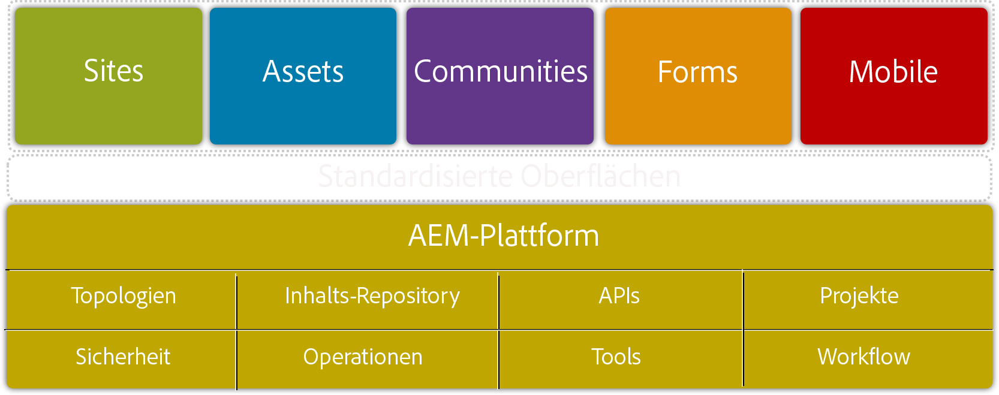

Weitere Informationen zur AEM finden Sie unter [Was ist AEM](/help/sites-deploying/deploy.md#what-is-aem)?

### Die AEM-Architektur {#the-aem-architecture}

Eine AEM-Bereitstellung umfasst drei wichtige Bausteine. Die **Autoreninstanz**, die von Inhaltsautoren, Redakteuren und Genehmigungsberechtigten zum Erstellen und Überprüfen von Inhalten verwendet wird. Wenn Inhalte genehmigt werden, werden sie auf einem zweiten Instanztyp, der **Veröffentlichungsinstanz** veröffentlicht, über die Endbenutzer auf die Inhalte zugreifen können. Der dritte Baustein ist der **Dispatcher**, ein Modul, das die Zwischenspeicherung und URL-Filterung verarbeitet und auf dem Webserver installiert ist. Weitere Informationen zur AEM-Architektur finden Sie unter [Typische Bereitstellungsszenarien](/help/sites-deploying/deploy.md#typical-deployment-scenarios).

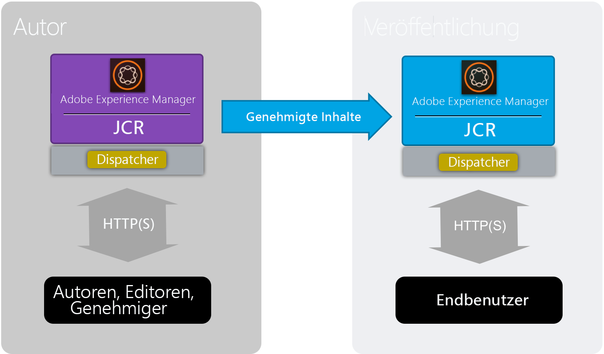

### Mikrokernels {#micro-kernels}

Mikrokernels fungieren als Persistenzmanager in AEM. Es gibt drei Arten von Micro-Kerneln, die mit AEM verwendet werden: TarMK, MongoDB und Relational Database (unter eingeschränkter Unterstützung). Welcher Mikrokernel Ihre Anforderungen erfüllt, hängt vom Zweck Ihrer Instanz und dem Bereitstellungstyp ab. Weitere Informationen zu Micro-Kerneln finden Sie auf der Seite [Empfohlene Bereitstellungen](/help/sites-deploying/recommended-deploys.md).

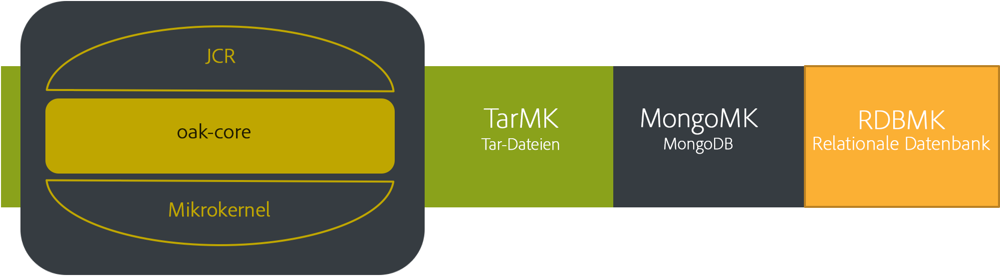

### Knotenspeicher {#nodestore}

In AEM können Binärdaten unabhängig von Inhaltsknoten gespeichert werden. Der Speicherort, an dem Binärdaten gespeichert werden, wird als **Datenspeicher** bezeichnet, während der Speicherort für die Inhaltsknoten und Eigenschaften der **Knotenspeicher** ist.

>[!NOTE]
>
>Adobe empfiehlt Kunden, TarMK als Standard-Persistenztechnologie für die Autoren- und die Veröffentlichungsinstanz von AEM zu verwenden.

>[!CAUTION]
>
>Der RDB-Mikrokernel wird nur eingeschränkt unterstützt. Bevor Sie diesen Mikrokernel verwenden, kontaktieren Sie den [Adobe-Kundendienst](https://helpx.adobe.com/de/marketing-cloud/contact-support.html).

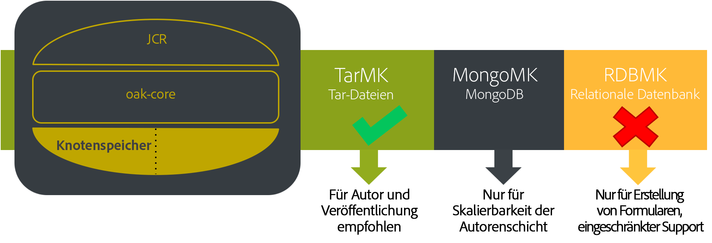

### Datenspeicher {#data-store}

Muss eine große Anzahl von Binärdateien verarbeitet werden, wird empfohlen, statt der Standard-Knotenspeicher einen externen Datenspeicher zu verwenden, um die Leistung zu maximieren. Wenn für Ihr Projekt z. B. eine große Anzahl von Medien-Assets erforderlich ist, wird ein schnellerer Zugriff ermöglicht, wenn Sie die Assets im Datei- oder Azure-/S3-Datenspeicher und nicht direkt in einer MongoDB speichern.

Weitere Informationen zu den verfügbaren Konfigurationsoptionen finden Sie unter [Konfigurieren von Knoten und Datenspeichern](/help/sites-deploying/data-store-config.md).

>[!NOTE]
>
>Adobe empfiehlt folgende Bereitstellungsoption: AEM auf Azure oder Amazon Web Services (AWS) mit Adobe Managed Services. Dadurch profitieren Kunden vom Zugang zu einem Expertenteam, das Erfahrung mit der Bereitstellung und dem Betrieb von AEM in diesen Cloud-Computing-Umgebungen hat. Bitte lesen Sie die [zusätzliche Dokumentation zu Adobe Managed Services](https://www.adobe.com/marketing-cloud/enterprise-content-management/managed-services-cloud-platform.html?aemClk=t).
>
>Für die Bereitstellung von AEM auf Azure oder AWS ohne Adobe Managed Services wird dringend empfohlen, direkt mit dem Cloud-Anbieter oder einem unserer Partner, der die Bereitstellung von AEM in der gewünschten Cloud-Umgebung unterstützt, zusammenzuarbeiten. Der ausgewählte Cloud-Anbieter oder Partner ist für die Größenspezifikation, das Design und die Implementierung der von ihm unterstützten Architektur verantwortlich, um Ihre spezifischen Anforderungen an Leistung, Last, Skalierbarkeit und Sicherheit zu erfüllen.
>
>Weitere Informationen finden Sie auf der Seite [Technische Anforderungen](/help/sites-deploying/technical-requirements.md#supported-platforms).

### Suche {#search-features}

In diesem Abschnitt sind die in AEM verwendeten benutzerdefinierten Index-Provider aufgeführt. Weitere Informationen zur Indexierung finden Sie unter [Oak-Abfragen und Indizierung](/help/sites-deploying/queries-and-indexing.md).

>[!NOTE]
>
>Für den Großteil der Bereitstellungen empfiehlt Adobe den Lucene-Index. Solr sollte nur aus Gründen der Skalierbarkeit in speziellen und komplexen Bereitstellungen verwendet werden.

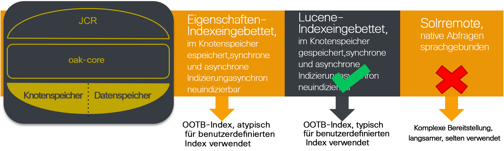

### Entwicklungsrichtlinien {#development-guidelines}

Bei der Entwicklung für AEM sollten **Leistung und Skalierbarkeit** im Mittelpunkt stehen. Nachfolgend finden Sie eine Reihe von Best Practices, die Sie befolgen können:

**EMPFOHLEN**

* Trennen Sie Darstellung, Logik und Inhalte
* Nutzen Sie vorhandene AEM-APIs (z. B.: Sling) und Tools (z. B.: Replikation)
* Entwickeln Sie im Kontext tatsächlicher Inhalte
* Entwickeln Sie für optimale Cachefähigkeit
* Reduzieren Sie die Anzahl der Speichervorgänge auf ein Minimum (z. B. mithilfe von Übergangs-Workflows)
* Stellen Sie sicher, dass alle HTTP-Endpunkte RESTful sind
* Schränken Sie die JCR-Überwachung ein
* Berücksichtigen Sie asynchrone Threads

**NICHT EMPFOHLEN**

* Verwenden Sie JCR-APIs nach Möglichkeit nicht direkt
* Ändern Sie „/libs“ nicht, sondern verwenden Sie Überlagerungen
* Verwenden Sie nach Möglichkeit keine Abfragen
* Verwenden Sie keine Sling-Bindungen zum Abrufen von OSGi-Diensten in Java-Code; nutzen Sie stattdessen:

   * @Reference in einer DS-Komponente
   * @Inject in einem Sling-Modell
   * sling.getService() in einer Sightly Use Class
   * sling.getService() in JSP
   * einen ServiceTracker
   * direkten Zugriff auf die OSGi-Dienstregistrierung

Weitere Einzelheiten zur Entwicklung in AEM finden Sie unter [Entwicklung – Grundlagen](/help/sites-developing/the-basics.md). Weitere Best Practices finden Sie unter [Best Practices für die Entwicklung](/help/sites-developing/best-practices.md).

### Benchmark-Szenarien  {#benchmark-scenarios}

>[!NOTE]
>
>Alle auf dieser Seite gezeigten Benchmarktests wurden in einer Lab-Umgebung durchgeführt.

Die unten beschriebenen Testszenarien werden für die Abschnitte mit den Benchmarktests der Kapitel „TarMK“, „MongoMK“ und „TarMK im Vergleich zu MongoMK“ verwendet. Um zu sehen, welches Szenario für einen bestimmten Benchmark-Test verwendet wurde, lesen Sie das Feld Szenario in der Tabelle [Technische Spezifikationen](/help/sites-deploying/performance-guidelines.md#tarmk-performance-benchmark).

**Einzelprodukt-Szenario**

AEM Assets:

* Benutzerinteraktionen: Assets durchsuchen/Nach Assets suchen/Asset herunterladen/Asset-Metadaten lesen/Asset-Metadaten aktualisieren/Asset hochladen/Workflow zum Hochladen von Assets ausführen
* Ausführungsmodus: gleichzeitige Benutzer, eine Interaktion pro Benutzer

**Szenario mit mehreren Produkten**

AEM Sites und Assets:

* Sites-Benutzerinteraktionen: Artikelseite lesen/Seite lesen/Absatz erstellen/Absatz bearbeiten/Inhaltsseite erstellen/Inhaltsseite aktivieren/Autorensuche
* Assets-Benutzerinteraktionen: Assets durchsuchen/Nach Assets suchen/Asset herunterladen/Asset-Metadaten lesen/Asset-Metadaten aktualisieren/Asset hochladen/Workflow zum Hochladen von Assets ausführen
* Ausführungsmodus: gleichzeitige Benutzer, gemischte Interaktion pro Benutzer

**Vertikales Nutzungsszenario**

Medien:

* Artikelseite lesen (27,4 %), Seite lesen (10,9 %), Sitzung erstellen (2,6 %), Inhaltsseite aktivieren (1,7 %), Inhaltsseite erstellen (0,4 %), Absatz erstellen (4,3 %), Absatz bearbeiten (0,9 %), Bildkomponente (0,9 %), Assets durchsuchen (20 %), Asset-Metadaten lesen (8,5 %), Asset herunterladen (4,2 %), Nach Asset suchen (0, 2 %), Asset-Metadaten aktualisieren (2,4 %), Asset hochladen (1,2 %), Projekt durchsuchen (4,9 %), Projekt lesen (6,6 %), Asset zu Projekt hinzufügen (1,2 %), Site zu Projekt hinzufügen (1,2 %), Projekt erstellen (0,1 %), Autorensuche (0,4 %)
* Ausführungsmodus: gleichzeitige Benutzer, gemischte Interaktion pro Benutzer

## TarMK  {#tarmk}

Dieses Kapitel enthält allgemeine Leistungsrichtlinien für TarMK sowie die Mindestanforderungen für die Architektur und die Konfigurationseinstellungen. Darüber hinaus werden Informationen zu Benchmarktests als zusätzliche Erläuterung bereitgestellt.

Adobe empfiehlt Kunden, TarMK als Standard-Persistenztechnologie in allen Bereitstellungsszenarien zu verwenden, sowohl für die Autoren- als auch die Veröffentlichungsinstanz von AEM.

Weitere Informationen zu TarMK finden Sie unter [Bereitstellungsszenarios](/help/sites-deploying/recommended-deploys.md#deployment-scenarios) und [Teer-Datenspeicherung](/help/sites-deploying/storage-elements-in-aem-6.md#tar-storage).

### Mindestarchitektur für TarMK – Richtlinien {#tarmk-minimum-architecture-guidelines}

>[!NOTE]
>
>Die unten angegebenen Richtlinien zur Mindestarchitektur gelten für Produktionsumgebungen und Sites mit einem hohen Traffic-Volumen. Dies sind **not** die [Minimalspezifikationen](/help/sites-deploying/technical-requirements.md#prerequisites), die zum Ausführen von AEM erforderlich sind.

Um bei Verwendung von TarMK eine optimale Leistung zu erzielen, sollten Sie als Ausgangspunkt eine Architektur mit folgenden Komponenten nutzen:

* Eine Autoreninstanz
* Zwei Veröffentlichungsinstanzen
* Zwei Dispatcher

Nachfolgend sind die Architekturrichtlinien für AEM Sites und AEM Assets beschrieben.

>[!NOTE]
>
>Wenn der Dateidatenspeicher freigegeben wird, muss die Binärdatei-lose Replikation **AKTIVIERT** sein.

**Tar-Architekturrichtlinien für AEM Sites**

**Tar-Architekturrichtlinien für AEM Assets**

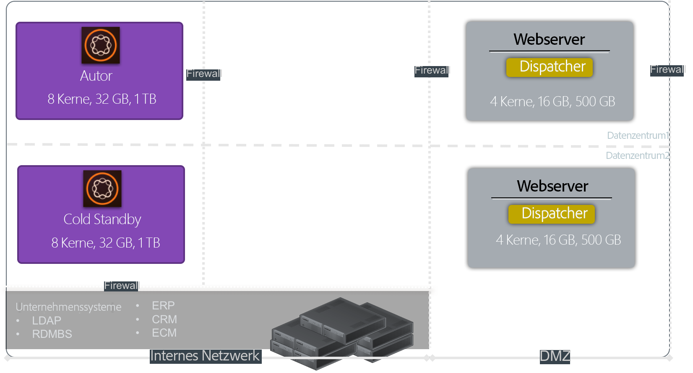

### TarMK-Einstellungen – Richtlinien {#tarmk-settings-guideline}

Um eine optimale Leistung zu erzielen, sollten Sie die nachfolgenden Einstellungsrichtlinien befolgen. Anweisungen zum Ändern der Einstellungen finden Sie auf dieser Seite [unter ](https://helpx.adobe.com/de/experience-manager/kb/performance-tuning-tips.html).

<table>
 <tbody>
  <tr>
   <td><strong>Einstellung</strong></td>
   <td><strong>Parameter</strong></td>
   <td><strong>Wert</strong></td>
   <td><strong>Beschreibung</strong></td>
  </tr>
  <tr>
   <td>Sling-Auftragswarteschlangen</td>
   <td><code>queue.maxparallel</code></td>
   <td>Setzen Sie den Wert auf die Hälfte der Anzahl der CPU-Kerne. </td>
   <td>Standardmäßig entspricht die Anzahl der gleichzeitigen Threads pro Auftragswarteschlange der Anzahl der CPU-Kerne.</td>
  </tr>
  <tr>
   <td>Warteschlange für die Granite-Übergangs-Workflows</td>
   <td><code>Max Parallel</code></td>
   <td>Setzen Sie den Wert auf die Hälfte der Anzahl der CPU-Kerne.</td>
   <td> </td>
  </tr>
  <tr>
   <td>JVM-Parameter  </td>
   <td>
<code>Doak.queryLimitInMemory</code>
 
<code>Doak.queryLimitReads</code>
 
<code>Dupdate.limit</code>
 
<code>Doak.fastQuerySize</code>
 </td>
   <td>
500000
 
100000
 
250000
 
True
 </td>
   <td>Fügen Sie diese JVM-Parameter zum AEM-Startskript hinzu, um zu verhindern, dass umfangreiche Abfragen die Systeme überlasten.</td>
  </tr>
  <tr>
   <td>Lucene-Indexkonfiguration</td>
   <td>
<code>CopyOnRead</code>
 
<code>CopyOnWrite</code>
 
<code>Prefetch Index Files</code>
 </td>
   <td>
Aktiviert
 
Aktiviert
 
Aktiviert
 </td>
   <td>Weitere Informationen zu den verfügbaren Parametern finden Sie auf <a href="https://jackrabbit.apache.org/oak/docs/query/lucene.html">dieser Seite</a>.</td>
  </tr>
  <tr>
   <td>Datenspeicher = S3-Datenspeicher</td>
   <td>
<code>maxCachedBinarySize</code>
 
<code>cacheSizeInMB</code>
 </td>
   <td>
1048576 (1 MB) oder kleiner
 
2–10 % der maximalen Heap-Größe
 </td>
   <td>Weitere Informationen finden Sie unter <a href="/help/sites-deploying/data-store-config.md#data-store-configurations">Datenspeicher-Konfigurationen</a>.</td>
  </tr>
  <tr>
   <td>Arbeitsablauf für DAM-Update-Asset</td>
   <td><code>Transient Workflow</code></td>
   <td>markiert</td>
   <td>Dieser Workflow verwaltet die Aktualisierung von Assets.</td>
  </tr>
  <tr>
   <td>DAM-Metadaten-Writeback</td>
   <td><code>Transient Workflow</code></td>
   <td>markiert</td>
   <td>Dieser Workflow verwaltet einen XMP-Writeback in die ursprünglichen Binärdaten und legt das Datum der letzten Änderung in der jcr fest.</td>
  </tr>
 </tbody>
</table>

### Leistungsbenchmarktest für TarMK  {#tarmk-performance-benchmark}

#### Technische Spezifikationen {#technical-specifications}

Die Benchmarktests wurden für die folgenden Spezifikationen durchgeführt:

|  | **Autorenknoten** |
|---|---|
| Server | Bare Metal Hardware (HP) |
| Betriebssystem | RedHat Linux |
| CPU/Kerne | Intel(R) Xeon(R) CPU E5-2407 bei 2,40 GHz, 8 Kerne |
| RAM | 32 GB |
| Festplatte | Magnetisch |
| Java | Oracle JRE-Version 8 |
| JVM-Heap | 16 GB |
| Produkt | AEM 6.2 |
| Knotenspeicher | TarMK |
| Datenspeicher  | Datei DS |
| Szenario | Einzelprodukt: Assets/30 parallele Threads |

#### Ergebnisse der Leistungsbenchmarktests {#performance-benchmark-results}

>[!NOTE]
>
>Die unten angegebenen Zahlen wurden mit 1 als Basislinie normiert und sind nicht die tatsächlichen Durchsatzzahlen.

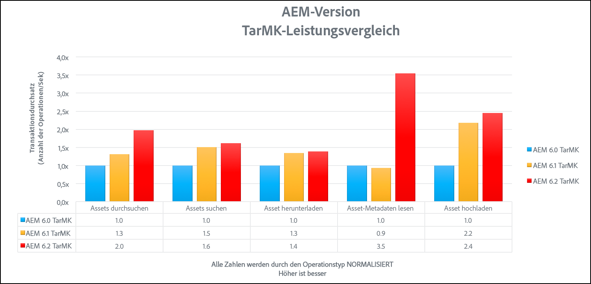 

## MongoMK {#mongomk}

Der Hauptgrund dafür, warum anstatt des TarMK der MongoMK als Persistenz-Backend ausgewählt werden sollte, liegt in der horizontalen Skalierung der Instanzen. Das bedeutet, dass immer mindestens zwei aktive Autoreninstanzen ausgeführt werden und MongoDB als Persistenzspeichersystem verwendet wird. Der Grund, warum mehr als eine Autoreninstanz ausgeführt werden muss, besteht im Allgemeinen darin, dass die CPU- und Speicherkapazität eines einzelnen Servers, der alle simultanen Bearbeitungsaktivitäten unterstützt, nicht mehr ausreichend ist.

Weitere Informationen zu TarMK finden Sie unter [Bereitstellungsszenarios](/help/sites-deploying/recommended-deploys.md#deployment-scenarios) und [Mongo-Datenspeicherung](/help/sites-deploying/storage-elements-in-aem-6.md#mongo-storage).

### Mindestarchitektur für MongoMK – Richtlinien {#mongomk-minimum-architecture-guidelines}

Um bei Verwendung von MongoMK eine optimale Leistung zu erzielen, sollten Sie als Ausgangspunkt eine Architektur mit folgenden Komponenten nutzen:

* Drei Autoreninstanzen
* Zwei Veröffentlichungsinstanzen
* Drei MongoDB-Instanzen
* Zwei Dispatcher

>[!NOTE]
>
>In Produktionsumgebungen wird MongoDB immer als Replikatgruppe mit einer primären und zwei sekundären Instanzen verwendet. Die Lese- und Schreibvorgänge gehen an die primäre Instanz und die Lesevorgänge können an die sekundären Instanzen gehen. Wenn kein Speicher verfügbar ist, kann eine der sekundären Instanzen durch einen Arbiter ersetzt werden. MongoDB-Replikatgruppen müssen jedoch immer aus einer ungeraden Anzahl von Instanzen bestehen.

>[!NOTE]
>
>Wenn der Dateidatenspeicher freigegeben wird, muss die Binärdatei-lose Replikation **AKTIVIERT** sein.

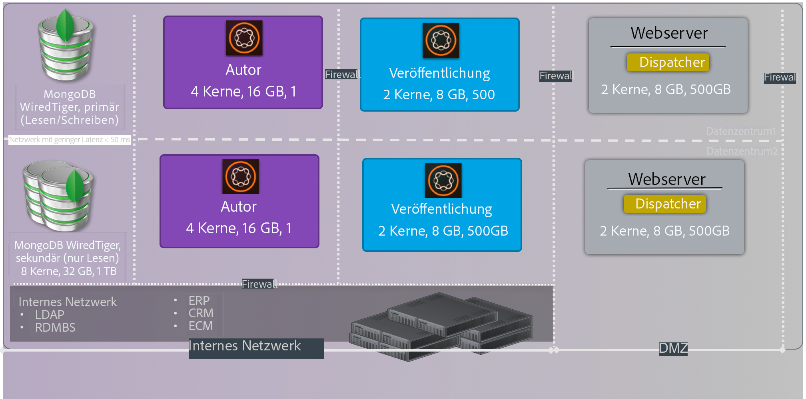

### MongoMK-Einstellungen – Richtlinien {#mongomk-settings-guidelines}

Um eine optimale Leistung zu erzielen, sollten Sie die nachfolgenden Einstellungsrichtlinien befolgen. Anweisungen zum Ändern der Einstellungen finden Sie auf dieser Seite [unter ](https://helpx.adobe.com/experience-manager/kb/performance-tuning-tips.html).

<table>
 <tbody>
  <tr>
   <td><strong>Einstellung</strong></td>
   <td><strong>Parameter</strong></td>
   <td><strong>Wert (default)</strong></td>
   <td><strong>Beschreibung</strong></td>
  </tr>
  <tr>
   <td>Sling-Auftragswarteschlangen</td>
   <td><code>queue.maxparallel</code></td>
   <td>Setzen Sie den Wert auf die Hälfte der Anzahl der CPU-Kerne. </td>
   <td>Standardmäßig entspricht die Anzahl der gleichzeitigen Threads pro Auftragswarteschlange der Anzahl der CPU-Kerne.</td>
  </tr>
  <tr>
   <td>Warteschlange für die Granite-Übergangs-Workflows</td>
   <td><code>Max Parallel</code></td>
   <td>Setzen Sie den Wert auf die Hälfte der Anzahl der CPU-Kerne.</td>
   <td> </td>
  </tr>
  <tr>
   <td>JVM-Parameter  </td>
   <td>
<code>Doak.queryLimitInMemory</code>
 
<code>Doak.queryLimitReads</code>
 
<code>Dupdate.limit</code>
 
<code>Doak.fastQuerySize</code>
 
<code>Doak.mongo.maxQueryTimeMS</code>
 </td>
   <td>
500000
 
100000
 
250000
 
true
 
60000
 </td>
   <td>Fügen Sie diese JVM-Parameter zum AEM-Startskript hinzu, um zu verhindern, dass umfangreiche Abfragen die Systeme überlasten.</td>
  </tr>
  <tr>
   <td>Lucene-Indexkonfiguration</td>
   <td>
<code>CopyOnRead</code>
 
<code>CopyOnWrite</code>
 
<code>Prefetch Index Files</code>
 </td>
   <td>
Aktiviert
 
Aktiviert
 
Aktiviert
 </td>
   <td>Weitere Einzelheiten zu verfügbaren Parametern finden Sie auf <a href="https://jackrabbit.apache.org/oak/docs/query/lucene.html">dieser Seite</a>.</td>
  </tr>
  <tr>
   <td>Datenspeicher = S3-Datenspeicher</td>
   <td>
<code>maxCachedBinarySize</code>
 
<code>cacheSizeInMB</code>
 </td>
   <td>
1048576 (1 MB) oder kleiner
 
2–10 % der maximalen Heap-Größe
 </td>
   <td>Weitere Informationen finden Sie unter <a href="/help/sites-deploying/data-store-config.md#data-store-configurations">Datenspeicher-Konfigurationen</a>.</td>
  </tr>
  <tr>
   <td>DocumentNodeStoreService</td>
   <td>
<code>cache</code>
 
<code>nodeCachePercentage</code>
 
<code>childrenCachePercentage</code>
 
<code>diffCachePercentage</code>
 
<code>docChildrenCachePercentage</code>
 
<code>prevDocCachePercentage</code>
 
<code>persistentCache</code>
 </td>
   <td>
2048
 
35 (25)
 
20 (10)
 
30 (5)
 
10 (3)
 
4 (4)
 
./cache,size=2048,binary=0,-compact,-compress
 </td>
   <td>
Die Standardgröße des Caches ist auf 256 MB eingestellt.
 
Hat Auswirkungen auf die Zeit, die es dauert, eine Invalidierung des Caches durchzuführen.
 </td>
  </tr>
  <tr>
   <td>oak-observation</td>
   <td>
<code>thread pool</code>
 
<code>length</code>
 </td>
   <td>
Min. und Max. = 20
 
50000
 </td>
   <td> </td>
  </tr>
 </tbody>
</table>

### Leistungsbenchmarktest für MongoMK {#mongomk-performance-benchmark}

### Technische Spezifikationen {#technical-specifications-1}

Die Benchmarktests wurden für die folgenden Spezifikationen durchgeführt:

|  | **Autorenknoten** | **MongoDB-Knoten** |
|---|---|---|
| Server | Bare Metal Hardware (HP) | Bare Metal Hardware (HP) |
| Betriebssystem | RedHat Linux | RedHat Linux |
| CPU/Kerne | Intel(R) Xeon(R) CPU E5-2407 bei 2,40 GHz, 8 Kerne | Intel(R) Xeon(R) CPU E5-2407 bei 2,40 GHz, 8 Kerne |
| RAM | 32 GB | 32 GB |
| Festplatte | Magnetisch - > 1 k IOPS | Magnetisch - > 1 k IOPS |
| Java | Oracle JRE-Version 8 | Nicht zutreffend |
| JVM-Heap | 16 GB | Nicht zutreffend |
| Produkt | AEM 6.2 | MongoDB 3.2 WiredTiger |
| Knotenspeicher | MongoMK | Nicht zutreffend |
| Datenspeicher  | Datei DS | Nicht zutreffend |
| Szenario | Einzelprodukt: Assets/30 parallele Threads | Einzelprodukt: Assets/30 parallele Threads |

### Ergebnisse der Leistungsbenchmarktests {#performance-benchmark-results-1}

>[!NOTE]
>
>Die unten angegebenen Zahlen wurden mit 1 als Basislinie normiert und sind nicht die tatsächlichen Durchsatzzahlen.

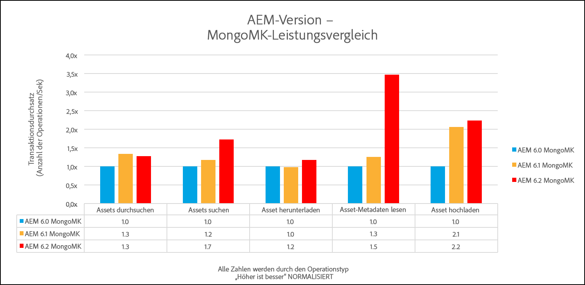 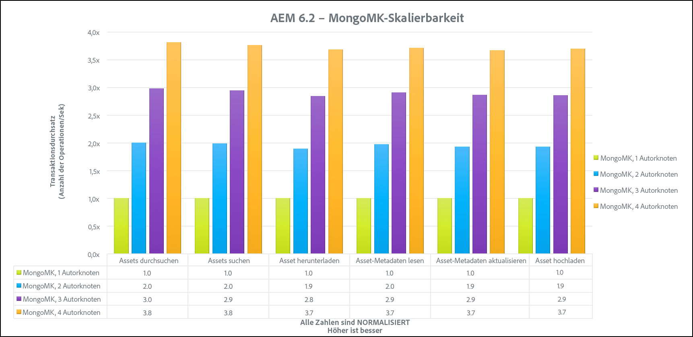

## TarMK im Vergleich zu MongoMK {#tarmk-vs-mongomk}

Bei der Wahl zwischen den beiden Mikrokernels muss eine Grundregel berücksichtigt werden: TarMK ist für Leistung konzipiert, während MongoMK für Skalierbarkeit eingesetzt wird. Adobe empfiehlt Kunden, TarMK als Standard-Persistenztechnologie in allen Bereitstellungsszenarien zu verwenden, sowohl für die Autoren- als auch die Veröffentlichungsinstanz von AEM.

Der Hauptgrund dafür, warum anstatt des TarMK der MongoMK als Persistenz-Backend ausgewählt werden sollte, liegt in der horizontalen Skalierung der Instanzen. Das bedeutet, dass immer mindestens zwei aktive Autoreninstanzen ausgeführt werden und MongoDB als Persistenzspeichersystem verwendet wird. Der Grund, warum mehr als eine Autoreninstanz ausgeführt werden muss, besteht im Allgemeinen darin, dass die CPU- und Speicherkapazität eines einzelnen Servers, der alle simultanen Bearbeitungsaktivitäten unterstützt, nicht mehr ausreichend ist.

Weitere Einzelheiten zu den Unterschieden zwischen TarMK und MongoMK finden Sie unter [Empfohlene Bereitstellungen](/help/sites-deploying/recommended-deploys.md#microkernels-which-one-to-use).

### MongoMK im Vergleich zu TarMK – Richtlinien  {#tarmk-vs-mongomk-guidelines}

**Vorteile von TarMK** 

* Wurde speziell für Content-Management-Anwendungen entwickelt
* Dateien sind immer konsistent und können mit einem beliebigen dateibasierten Sicherungstool gesichert werden
* Stellt einen Ausfallsicherungsmechanismus bereit - weitere Informationen finden Sie unter [Cold Standby](/help/sites-deploying/tarmk-cold-standby.md)
* Bietet hohe Leistung und zuverlässige Datenspeicherung bei minimalem Betriebsaufwand
* Niedrige Gesamtbetriebskosten

**Kriterien für die Auswahl von MongoMK**

* Anzahl der benannten, verbundenen Benutzer an einem Tag: Tausende oder mehr
* Anzahl der gleichzeitigen Benutzer: Hunderte oder mehr
* Volumen der erfassten Assets pro Tag: Hunderttausende oder mehr
* Volumen der Seitenbearbeitungen pro Tag: Hunderttausende oder mehr
* Volumen der Suchvorgänge pro Tag: Zehntausende oder mehr

### MongoMK im Vergleich zu TarMK – Benchmarktests  {#tarmk-vs-mongomk-benchmarks}

>[!NOTE]
>
>Die unten angegebenen Zahlen wurden mit 1 als Basislinie normiert und sind keine tatsächlichen Durchsatzzahlen.

### Szenario 1 – Technische Spezifikationen  {#scenario-technical-specifications}

<table>
 <tbody>
  <tr>
   <td><strong> </strong></td>
   <td><strong>OAK-Autorenknoten</strong></td>
   <td><strong>MongoDB-Knoten</strong></td>
   <td> </td>
  </tr>
  <tr>
   <td>Server</td>
   <td>Bare Metal Hardware (HP)</td>
   <td>Bare Metal Hardware (HP)</td>
   <td> </td>
  </tr>
  <tr>
   <td>Betriebssystem</td>
   <td>RedHat Linux</td>
   <td>RedHat Linux</td>
   <td> </td>
  </tr>
  <tr>
   <td>CPU/Kerne</td>
   <td>Intel(R) Xeon(R) CPU E5-2407 bei 2,40 GHz, 8 Kerne</td>
   <td>Intel(R) Xeon(R) CPU E5-2407 bei 2,40 GHz, 8 Kerne</td>
   <td> </td>
  </tr>
  <tr>
   <td>RAM</td>
   <td>32 GB</td>
   <td>32 GB</td>
   <td> </td>
  </tr>
  <tr>
   <td>Festplatte</td>
   <td>Magnetisch - &gt; 1 k IOPS</td>
   <td>Magnetisch - &gt; 1 k IOPS</td>
   <td> </td>
  </tr>
  <tr>
   <td>Java</td>
   <td>Oracle JRE-Version 8</td>
   <td>Nicht zutreffend</td>
   <td> </td>
  </tr>
  <tr>
   <td>JVM-Heap 16 GB</td>
   <td>16 GB</td>
   <td>Nicht zutreffend</td>
   <td> </td>
  </tr>
  <tr>
   <td>Produkt </td>
   <td>AEM 6.2</td>
   <td>MongoDB 3.2 WiredTiger</td>
   <td> </td>
  </tr>
  <tr>
   <td>Knotenspeicher</td>
   <td>TarMK oder MongoMK</td>
   <td>Nicht zutreffend</td>
   <td> </td>
  </tr>
  <tr>
   <td>Datenspeicher </td>
   <td>Datei DS </td>
   <td>Nicht zutreffend</td>
   <td> </td>
  </tr>
  <tr>
   <td>Szenario</td>
   <td>
  Einzelprodukt: Assets/30 parallele Threads pro Ausführung
 </td>
   <td> </td>
   <td> </td>
  </tr>
 </tbody>
</table>

### Szenario 1 – Ergebnisse der Benchmarktests {#scenario-performance-benchmark-results}

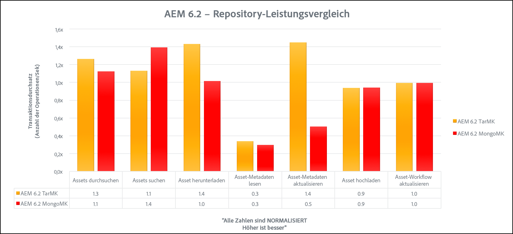

### Szenario 2 – Technische Spezifikationen {#scenario-technical-specifications-1}

>[!NOTE]
>
>Um bei Verwendung von MongoDB dieselbe Anzahl von Autoreninstanzen wie bei einem TarMK-System nutzen zu können, benötigen Sie einen Cluster mit zwei AEM-Knoten. Ein MongoDB-Cluster mit vier Knoten kann die 1,8-fache Anzahl von Autoreninstanzen einer TarMK-Instanz verarbeiten. Ein MongoDB-Cluster mit acht Knoten kann die 2,3-fache Anzahl von Autoreninstanzen einer TarMK-Instanz verarbeiten.

<table>
 <tbody>
  <tr>
   <td><strong> </strong></td>
   <td><strong>Autor-TarMK-Knoten</strong></td>
   <td><strong>Autor MongoMK-Knoten</strong></td>
   <td><strong>MongoDB-Knoten</strong></td>
  </tr>
  <tr>
   <td>Server</td>
   <td>AWS c3.8xlarge</td>
   <td>AWS c3.8xlarge</td>
   <td>AWS c3.8xlarge</td>
  </tr>
  <tr>
   <td>Betriebssystem</td>
   <td>RedHat Linux</td>
   <td>RedHat Linux</td>
   <td>RedHat Linux</td>
  </tr>
  <tr>
   <td>CPU/Kerne</td>
   <td>32</td>
   <td>32</td>
   <td>32</td>
  </tr>
  <tr>
   <td>RAM</td>
   <td>60 GB</td>
   <td>60 GB</td>
   <td>60 GB</td>
  </tr>
  <tr>
   <td>Festplatte</td>
   <td>SSD - 10.000 IOPS</td>
   <td>SSD - 10.000 IOPS</td>
   <td>SSD - 10.000 IOPS</td>
  </tr>
  <tr>
   <td>Java</td>
   <td>Oracle JRE-Version 8</td>
   <td>  Oracle JRE-Version 8</td>
   <td>Nicht zutreffend</td>
  </tr>
  <tr>
   <td>JVM-Heap 16 GB</td>
   <td>30 GB</td>
   <td>30 GB</td>
   <td>Nicht zutreffend</td>
  </tr>
  <tr>
   <td>Produkt </td>
   <td>AEM 6.2</td>
   <td>AEM 6.2</td>
   <td>  MongoDB 3.2 WiredTiger</td>
  </tr>
  <tr>
   <td>Knotenspeicher</td>
   <td>TarMK </td>
   <td>MongoMK</td>
   <td>  Nicht zutreffend</td>
  </tr>
  <tr>
   <td>Datenspeicher </td>
   <td>Datei DS </td>
   <td>  Datei DS</td>
   <td>  Nicht zutreffend</td>
  </tr>
  <tr>
   <td>Szenario</td>
   <td>
    Vertikaler Anwendungsfall: Media/2000 parallele Threads
 </td>
   <td></td>
   <td></td>
  </tr>
 </tbody>
</table>

### Szenario 2 – Ergebnisse der Benchmarktests {#scenario-performance-benchmark-results-1}

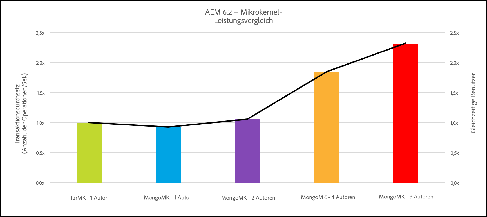

### Skalierbarkeitsrichtlinien für die Architektur für AEM Sites und Assets {#architecture-scalability-guidelines-for-aem-sites-and-assets}

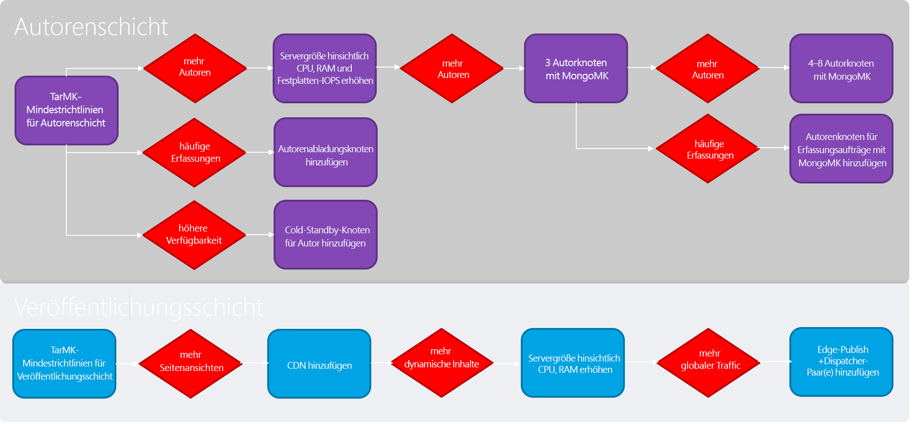

## Zusammenfassung der Leistungsrichtlinien  {#summary-of-performance-guidelines}

Die auf dieser Seite beschriebenen Richtlinien können wie folgt zusammengefasst werden:

* **TarMK mit Dateidatenspeicher** ist die empfohlene Architektur für den Großteil der Kunden:

   * Mindesttopologie: eine Autoreninstanz, zwei Veröffentlichungsinstanzen, zwei Dispatcher
   * Wenn der Dateidatenspeicher freigegeben wird, muss die Binärdatei-lose Replikation aktiviert sein

* **MongoMK** ist die empfohlene Architektur für die horizontale Skalierbarkeit der Autorenschicht:

   * Mindesttopologie: drei Autoreninstanzen, drei MongoDB-Instanzen, zwei Veröffentlichungsinstanzen, zwei Dispatcher
   * Wenn der Dateidatenspeicher freigegeben wird, muss die Binärdatei-lose Replikation aktiviert sein

* Der **Knotenspeicher** sollte auf der lokalen Festplatte und nicht auf einem NAS (Network Attached Storage) gespeichert werden
* Bei Verwendung von **Amazon S3**:

   * Der Amazon S3-Datenspeicher wird von der Autoren- und Veröffentlichungsschicht gemeinsam verwendet
   * Die Binärdatei-lose Replikation muss aktiviert sein
   * Für die Bereinigung des Datenspeichers ist ein erster Lauf auf allen Autoren- und Veröffentlichungsknoten, gefolgt von einem zweiten Lauf auf den Autorenknoten erforderlich

* **Neben dem vorkonfigurierten Index sollte ein benutzerdefinierter Index erstellt** werden, basierend auf den am häufigsten durchgeführten Suchen

   * Für die benutzerdefinierten Indizes sollten Lucene-Indizes verwendet werden

* **Durch Anpassen des Workflows kann die Leistung** erheblich verbessert werden, z. B. durch Entfernen des Videoschritts im Arbeitsablauf &quot;Asset aktualisieren&quot;, Deaktivieren von nicht verwendeten Listenern usw.

Weitere Einzelheiten finden Sie auch auf der Seite [Empfohlen Bereitstellungen](/help/sites-deploying/recommended-deploys.md).
