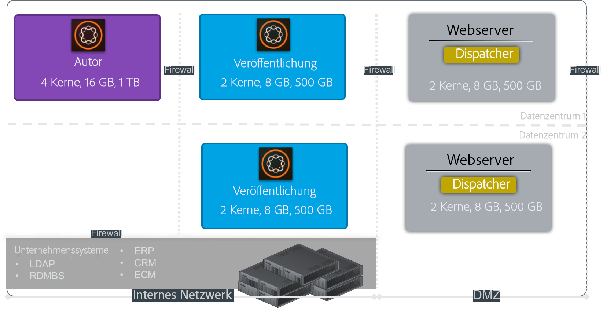
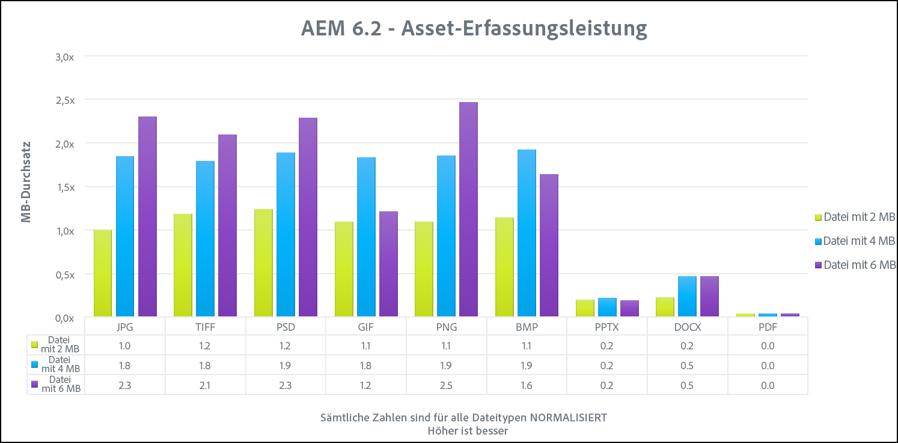

# Leistungsrichtlinien{#performance-guidelines}

Diese Seite erhält allgemeine Richtlinien zur Optimierung der Leistung Ihrer AEM-Bereitstellung. Wenn Sie noch nicht AEM sind, lesen Sie die folgenden Seiten, bevor Sie mit dem Lesen der Leistungsrichtlinien beginnen:

* [AEM – Grundkonzepte](/help/sites-deploying/deploy.md#basic-concepts)
* [Überblick über Speicher in AEM](/help/sites-deploying/storage-elements-in-aem-6.md#overview-of-storage-in-aem)
* [Empfohlene Bereitstellungen](/help/sites-deploying/recommended-deploys.md)
* [Technische Anforderungen](/help/sites-deploying/technical-requirements.md)

Nachstehend sind die verfügbaren Bereitstellungsoptionen für AEM dargestellt (führen Sie einen Bildlauf durch, um alle Optionen anzuzeigen):

<table>
 <tbody>
  <tr>
   <td>
<strong>AEM</strong>
 
<strong>Produkt</strong>
 </td>
   <td>
<strong>Topologie</strong>
 </td>
   <td>
<strong>Betriebssystem</strong>
 </td>
   <td>
<strong>Anwendungs-Server</strong>
 </td>
   <td>
<strong>JRE </strong>
 </td>
   <td>
<strong>Sicherheit</strong>
 </td>
   <td>
<strong>Mikrokernel </strong>
 </td>
   <td>
<strong>Datenspeicher </strong>
 </td>
   <td>
<strong>Indizierung</strong>
 </td>
   <td>
<strong>Webserver</strong>
 </td>
   <td>
<strong>Browser</strong>
 </td>
   <td>
<strong>Experience Cloud</strong>
 </td>
  </tr>
  <tr>
   <td>
Sites
 </td>
   <td>
Nicht-HA
 </td>
   <td>
Windows
 </td>
   <td>
CQSE
 </td>
   <td>
Oracle
 </td>
   <td>
LDAP
 </td>
   <td>
Tar
 </td>
   <td>
Segment
 </td>
   <td>
Eigenschaft
 </td>
   <td>
Apache
 </td>
   <td>
Edge
 </td>
   <td>
Ziel
 </td>
  </tr>
  <tr>
   <td>
Assets
 </td>
   <td>
Publish-HA
 </td>
   <td>
Solaris™
 </td>
   <td>
WebLogic
 </td>
   <td>
IBM®
 </td>
   <td>
SAML
 </td>
   <td>
MongoDB
 </td>
   <td>
File
 </td>
   <td>
Lucene
 </td>
   <td>
IIS
 </td>
   <td>
IE
 </td>
   <td>
Analyse
 </td>
  </tr>
  <tr>
   <td>
Communities
 </td>
   <td>
Author-CS
 </td>
   <td>
Red Hat®
 </td>
   <td>
WebSphere®
 </td>
   <td>
HP
 </td>
   <td>
Oauth
 </td>
   <td>
RDB/Oracle
 </td>
   <td>
S3/Azure
 </td>
   <td>
Solr
 </td>
   <td>
iPlanet
 </td>
   <td>
FireFox
 </td>
   <td>
Campaign
 </td>
  </tr>
  <tr>
   <td>
Formulare
 </td>
   <td>
author-offload
 </td>
   <td>
HP-UX
 </td>
   <td>
Tomcat
 </td>
   <td>
 
 </td>
   <td>
 
 </td>
   <td>
RDB/DB2
 </td>
   <td>
MongoDB
 </td>
   <td>
 
 </td>
   <td>
 
 </td>
   <td>
Chrome
 </td>
   <td>
Sozial
 </td>
  </tr>
  <tr>
   <td>
Mobilgerät
 </td>
   <td>
Author-Cluster
 </td>
   <td>
IBM® AIX®
 </td>
   <td>
JBoss®
 </td>
   <td>
 
 </td>
   <td>
 
 </td>
   <td>
RDB/MySQL
 </td>
   <td>
RDBMS
 </td>
   <td>
 
 </td>
   <td>
 
 </td>
   <td>
Safari
 </td>
   <td>
Zielgruppe
 </td>
  </tr>
  <tr>
   <td>
Multi-Site
 </td>
   <td>
ASRP
 </td>
   <td>
SUSE®
 </td>
   <td>
 
 </td>
   <td>
 
 </td>
   <td>
 
 </td>
   <td>
RDB/SQL Server
 </td>
   <td>
 
 </td>
   <td>
 
 </td>
   <td>
 
 </td>
   <td>
 
 </td>
   <td>
Assets
 </td>
  </tr>
  <tr>
   <td>
Commerce 
 </td>
   <td>
MSRP
 </td>
   <td>
Apple OS
 </td>
   <td>
 
 </td>
   <td>
 
 </td>
   <td>
 
 </td>
   <td>
 
 </td>
   <td>
 
 </td>
   <td>
 
 </td>
   <td>
 
 </td>
   <td>
 
 </td>
   <td>
Aktivierung
 </td>
  </tr>
  <tr>
   <td>
Dynamic Media
 </td>
   <td>
JSRP
 </td>
   <td>
 
 </td>
   <td>
 
 </td>
   <td>
 
 </td>
   <td>
 
 </td>
   <td>
 
 </td>
   <td>
 
 </td>
   <td>
 
 </td>
   <td>
 
 </td>
   <td>
 
 </td>
   <td>
Mobilgerät
 </td>
  </tr>
  <tr>
   <td>
Brand Portal
 </td>
   <td>
J2E
 </td>
   <td>
 
 </td>
   <td>
 
 </td>
   <td>
 
 </td>
   <td>
 
 </td>
   <td>
 
 </td>
   <td>
 
 </td>
   <td>
 
 </td>
   <td>
 
 </td>
   <td>
 
 </td>
   <td>
 
 </td>
  </tr>
  <tr>
   <td>
AoD
 </td>
   <td>
 
 </td>
   <td>
 
 </td>
   <td>
 
 </td>
   <td>
 
 </td>
   <td>
 
 </td>
   <td>
 
 </td>
   <td>
 
 </td>
   <td>
 
 </td>
   <td>
 
 </td>
   <td>
 
 </td>
   <td>
 
 </td>
  </tr>
  <tr>
   <td>
Livefyre
 </td>
   <td>
 
 </td>
   <td>
 
 </td>
   <td>
 
 </td>
   <td>
 
 </td>
   <td>
 
 </td>
   <td>
 
 </td>
   <td>
 
 </td>
   <td>
 
 </td>
   <td>
 
 </td>
   <td>
 
 </td>
   <td>
 
 </td>
  </tr>
  <tr>
   <td>
Screens
 </td>
   <td>
 
 </td>
   <td>
 
 </td>
   <td>
 
 </td>
   <td>
 
 </td>
   <td>
 
 </td>
   <td>
 
 </td>
   <td>
 
 </td>
   <td>
 
 </td>
   <td>
 
 </td>
   <td>
 
 </td>
   <td>
 
 </td>
  </tr>
  <tr>
   <td>
Document Security
 </td>
   <td>
 
 </td>
   <td>
 
 </td>
   <td>
 
 </td>
   <td>
 
 </td>
   <td>
 
 </td>
   <td>
 
 </td>
   <td>
 
 </td>
   <td>
 
 </td>
   <td>
 
 </td>
   <td>
 
 </td>
   <td>
 
 </td>
  </tr>
  <tr>
   <td>
Process Management
 </td>
   <td>
 
 </td>
   <td>
 
 </td>
   <td>
 
 </td>
   <td>
 
 </td>
   <td>
 
 </td>
   <td>
 
 </td>
   <td>
 
 </td>
   <td>
 
 </td>
   <td>
 
 </td>
   <td>
 
 </td>
   <td>
 
 </td>
  </tr>
  <tr>
   <td>
-Desktop-Programm
 </td>
   <td>
 
 </td>
   <td>
 
 </td>
   <td>
 
 </td>
   <td>
 
 </td>
   <td>
 
 </td>
   <td>
 
 </td>
   <td>
 
 </td>
   <td>
 
 </td>
   <td>
 
 </td>
   <td>
 
 </td>
   <td>
 
 </td>
  </tr>
 </tbody>
</table>

>[!NOTE]
>
>Die Leistungsrichtlinien gelten hauptsächlich für AEM Sites.

## Verwendung der Leistungsrichtlinien {#when-to-use-the-performance-guidelines}

Verwenden Sie die Leistungsrichtlinien in den folgenden Situationen:

* **Erstmalige Bereitstellung**: Bei der erstmaligen Bereitstellung von AEM Sites oder Assets ist es wichtig, die verfügbaren Optionen zu verstehen. Insbesondere bei der Konfiguration des Mikrokernels, Knotenspeichers und Datenspeichers (im Vergleich zu den Standardeinstellungen). Ändern Sie beispielsweise die Standardeinstellungen des Datenspeichers für TarMK in den Dateidatenspeicher.
* **Aktualisierung auf eine neue Version**: Bei der Aktualisierung auf eine neue Version müssen Sie sich über die Leistungsunterschiede im Vergleich zur aktuellen Umgebung im Klaren sein. Beispielsweise ein Upgrade von AEM 6.1 auf 6.2 oder von AEM 6.0 CRX2 auf 6.2 OAK.
* **Langsame Reaktionszeit**: Wenn die ausgewählte Knotenspeicher-Architektur Ihre Anforderungen nicht erfüllt, müssen Sie wissen, welche Leistungsunterschiede im Vergleich zu anderen Topologieoptionen bestehen. Beispielsweise die Bereitstellung von TarMK anstelle von MongoMK oder die Verwendung eines Dateidatenspeichers anstelle eines Amazon S3- oder Microsoft® Azure-Datenspeichers.
* **Hinzufügen weiterer Autoren**: Wenn die empfohlene TarMK-Topologie die Leistungsanforderungen nicht erfüllt und die Vergrößerung des Autorknotens die maximale verfügbare Kapazität erreicht hat, sollten Sie die Leistungsunterschiede verstehen. Vergleichen Sie die Verwendung von MongoMK mit drei oder mehr Autorknoten. Beispielsweise die Bereitstellung von MongoMK anstelle von TarMK.
* **Hinzufügen von mehr Inhalten**: Wenn die empfohlene Data Store-Architektur Ihre Anforderungen nicht erfüllt, sollten Sie die Leistungsunterschiede im Vergleich zu anderen Datenspeicheroptionen verstehen. Beispiel: Verwendung des Amazon S3- oder Microsoft® Azure-Datenspeichers anstelle eines Dateidatenspeichers.

## Einführung {#introduction}

Dieses Kapitel gibt einen allgemeinen Überblick über die AEM-Architektur und ihre wichtigsten Komponenten. Es enthält auch Entwicklungsrichtlinien und beschreibt die Testszenarien, die in den TarMK- und MongoMK-Benchmark-Tests verwendet werden.

### Die AEM {#the-aem-platform}

Die AEM Plattform besteht aus den folgenden Komponenten:

Weitere Informationen zur AEM-Plattform finden Sie unter [Was ist AEM?](/help/sites-deploying/deploy.md#what-is-aem).

### Die AEM Architektur {#the-aem-architecture}

Eine AEM-Bereitstellung umfasst drei wichtige Bausteine. Die **Autoreninstanz**, die von Inhaltsautoren, Redakteuren und Genehmigungsberechtigten zum Erstellen und Überprüfen von Inhalten verwendet wird. Wenn Inhalte genehmigt werden, werden sie auf einem zweiten Instanztyp, der **Veröffentlichungsinstanz** veröffentlicht, über die Endbenutzer auf die Inhalte zugreifen können. Der dritte Baustein ist der **Dispatcher**. Dies ist ein Modul für das Caching und die URL-Filterung, das auf dem Webserver installiert ist. Weitere Informationen zur AEM-Architektur finden Sie unter [Typische Bereitstellungsszenarien](/help/sites-deploying/deploy.md#typical-deployment-scenarios).

### Mikrokernels {#micro-kernels}

Mikrokernels fungieren als Persistenzmanager in AEM. In AEM werden drei Arten von Mikrokernels verwendet: TarMK, MongoDB und relationale Datenbank (mit eingeschränkter Unterstützung). Die Wahl eines solchen für Ihre Anforderungen hängt vom Zweck Ihrer Instanz und vom geplanten Bereitstellungstyp ab. Weitere Informationen zu Mikrokernels finden Sie auf der Seite [Empfohlene Bereitstellungen](/help/sites-deploying/recommended-deploys.md).

### Knotenspeicher {#nodestore}

In AEM können Binärdaten unabhängig von Inhaltsknoten gespeichert werden. Der Speicherort, an dem die Binärdaten gespeichert werden, wird als **Datenspeicher**, während der Speicherort der Inhaltsknoten und -eigenschaften als **Knotenspeicher**.

>[!NOTE]
>
>Adobe empfiehlt, TarMK als standardmäßige Persistenztechnologie zu verwenden, die von Kunden sowohl für die AEM-Autoren- als auch für die Veröffentlichungsinstanz verwendet wird.

>[!CAUTION]
>
>Der RDB-Mikrokernel wird nur eingeschränkt unterstützt. Kontakt [Adobe-Kundenunterstützung](https://experienceleague.adobe.com/?lang=de&amp;support-solution=General&amp;support-tab=home#support) bevor Sie diesen Mikrokernel verwenden.

### Datenspeicher {#data-store}

Für den Umgang mit einer großen Anzahl von Binärdateien wird empfohlen, anstelle der standardmäßigen Knotenspeicher einen externen Datenspeicher zu verwenden, um die Leistung zu maximieren. Wenn Ihr Projekt beispielsweise viele Medien-Assets benötigt, wird der Zugriff auf diese schneller, als direkt in einer MongoDB gespeichert zu werden, wenn Sie sie im Datei- oder Azure/S3-Datenspeicher speichern.

Weitere Einzelheiten zu den verfügbaren Konfigurationsoptionen finden Sie unter [Konfigurieren von Knotenspeichern und Datenspeichern](/help/sites-deploying/data-store-config.md).

>[!NOTE]
>
>Adobe empfiehlt, die Option zur Bereitstellung von AEM auf Azure oder Amazon Web Services (AWS) mithilfe von Adobe Managed Services zu wählen. Kunden profitieren von einem Team, das über die Erfahrung und die Fähigkeiten verfügt, AEM in diesen Cloud-Computing-Umgebungen bereitzustellen und zu betreiben. Siehe [Zusätzliche Dokumentation zu Adobe Managed Services](https://business.adobe.com/products/experience-manager/managed-services.html?aemClk=t).
>
>Für Empfehlungen zur Bereitstellung von AEM auf Azure oder AWS außerhalb von Adobe Managed Services empfiehlt Adobe, direkt mit dem Cloud-Anbieter zu arbeiten. Oder arbeiten Sie mit einem Partner der Adobe zusammen, der die Bereitstellung von AEM in der gewünschten Cloud-Umgebung unterstützt. Der ausgewählte Cloud-Anbieter oder -Partner ist für die Größenspezifikationen, das Design und die Implementierung der Architektur verantwortlich, die er unterstützt, um Ihre spezifischen Anforderungen an Leistung, Auslastung, Skalierbarkeit und Sicherheit zu erfüllen.
>Siehe auch [technische Anforderungen](/help/sites-deploying/technical-requirements.md#supported-platforms) Seite.
>
>
>
### Suchen {#search-features}

In diesem Abschnitt sind die in AEM verwendeten benutzerdefinierten Index-Provider aufgeführt. Weitere Informationen zur Indizierung finden Sie unter [Oak-Abfragen und Indizierung](/help/sites-deploying/queries-and-indexing.md).

>[!NOTE]
Für den Großteil der Bereitstellungen empfiehlt Adobe den Lucene-Index. Verwenden Sie Solr nur für die Skalierbarkeit in spezialisierten und komplexen Bereitstellungen.

### Entwicklungsrichtlinien {#development-guidelines}

Entwicklung für AEM, die **Leistung und Skalierbarkeit**. Im Folgenden finden Sie Best Practices, die Sie befolgen können:

**DO**

* Trennen von Präsentation, Logik und Inhalt
* Verwenden Sie bestehende AEM-APIs (z. B.: Sling und Werkzeuge (z. B.: Replikation)
* Im Kontext des tatsächlichen Inhalts entwickeln
* Entwickeln für optimale Zwischenspeicherbarkeit
* Minimieren Sie die Anzahl der Speichervorgänge (z. B.: durch Verwendung von Übergangs-Workflows)
* Stellen Sie sicher, dass alle HTTP-Endpunkte RESTful sind.
* Schränken Sie den Umfang der JCR-Beobachtung ein
* Achten Sie auf asynchrone Threads

**NICHT**

* Verwenden Sie JCR-APIs nicht direkt, wenn Sie
* Ändern Sie /libs nicht, sondern verwenden Sie Überlagerungen
* Verwenden Sie keine Abfragen, wo immer möglich
* Verwenden Sie keine Sling-Bindungen, um OSGi-Dienste in Java™-Code zu erhalten, sondern verwenden Sie stattdessen:

   * @Reference in einer DS-Komponente
   * @Inject in einem Sling-Modell
   * sling.getService() in einer Sightly Use Class
   * sling.getService() in einer JSP
   * a ServiceTracker
   * direkter Zugriff auf die OSGi-Dienstregistrierung

Weitere Informationen zur Entwicklung auf AEM finden Sie unter [Entwickeln - Grundlagen](/help/sites-developing/the-basics.md). Weitere Best Practices finden Sie unter [Best Practices für die Entwicklung](/help/sites-developing/best-practices.md).

### Benchmarkszenarios {#benchmark-scenarios}

>[!NOTE]
Alle auf dieser Seite angezeigten Benchmarktests wurden in einer Laboreinstellung durchgeführt.

Die unten beschriebenen Testszenarien werden für die Benchmark-Abschnitte der Kapitel TarMK, MongoMk und TarMK im Vergleich zu MongoMk verwendet. Um festzustellen, welches Szenario für einen bestimmten Benchmarktest verwendet wurde, sehen Sie im Feld „Szenario“ der Tabelle [Technische Spezifikationen](/help/sites-deploying/performance-guidelines.md#tarmk-performance-benchmark) nach.

**Einzelprodukt-Szenario**

AEM Assets:

* Benutzerinteraktionen: Assets durchsuchen/Assets suchen/Asset herunterladen/Asset-Metadaten lesen/Asset-Metadaten aktualisieren/Asset hochladen/Workflow zum Hochladen von Assets ausführen
* Ausführungsmodus: gleichzeitige Benutzer, einzelne Interaktion pro Benutzer

**Szenario mit gemischten Produkten**

AEM Sites und Assets:

* Sites-Benutzerinteraktionen: Artikelseite lesen/Seite lesen/Absatz erstellen/Absatz bearbeiten/Inhaltsseite erstellen/Inhaltsseite aktivieren/Inhaltssuche aktivieren
* Benutzerinteraktionen in Assets: Assets durchsuchen/Assets suchen/Asset herunterladen/Asset-Metadaten lesen/Asset-Metadaten aktualisieren/Asset hochladen/Workflow zum Hochladen von Assets ausführen
* Ausführungsmodus: gleichzeitige Benutzer, gemischte Interaktionen pro Benutzer

**Vertikales Nutzungsszenario**

Medien:

* `Read Article Page (27.4%), Read Page (10.9%), Create Session (2.6%), Activate Content Page (1.7%), Create Content Page (0.4%), Create Paragraph (4.3%), Edit Paragraph (0.9%), Image Component (0.9%), Browse Assets (20%), Read Asset Metadata (8.5%), Download Asset (4.2%), Search Asset (0.2%), Update Asset Metadata (2.4%), Upload Asset (1.2%), Browse Project (4.9%), Read Project (6.6%), Project Add Asset (1.2%), Project Add Site (1.2%), Create Project (0.1%), Author Search (0.4%)`
* Ausführungsmodus: gleichzeitige Benutzer, gemischte Interaktionen pro Benutzer

## TarMK {#tarmk}

Dieses Kapitel enthält allgemeine Leistungsrichtlinien für TarMK sowie die Mindestanforderungen für die Architektur und die Konfigurationseinstellungen. Benchmarktests werden ebenfalls zur weiteren Klärung bereitgestellt.

Adobe empfiehlt Kunden, TarMK als Standard-Persistenztechnologie in allen Bereitstellungsszenarien zu verwenden, sowohl für die Autoren- als auch die Veröffentlichungsinstanz von AEM.

Weitere Informationen zu TarMK finden Sie unter [Bereitstellungsszenarien](/help/sites-deploying/recommended-deploys.md#deployment-scenarios) und [TAR-Speicher](/help/sites-deploying/storage-elements-in-aem-6.md#tar-storage).

### Richtlinien zur Mindestarchitektur von TarMK {#tarmk-minimum-architecture-guidelines}

>[!NOTE]
Die folgenden Richtlinien zur minimalen Architektur beziehen sich auf Produktionsumgebungen und Sites mit hohem Traffic. Diese Leitlinien **not** die [Mindestanforderungen](/help/sites-deploying/technical-requirements.md#prerequisites) AEM.

Um bei der Verwendung von TarMK eine gute Leistung zu erzielen, sollten Sie mit der folgenden Architektur beginnen:

* Eine Autoreninstanz
* Zwei Veröffentlichungsinstanzen
* Zwei Dispatcher

Nachfolgend finden Sie die Architekturrichtlinien für AEM Sites und AEM Assets.

>[!NOTE]
Wenn der Dateidatenspeicher freigegeben wird, muss die Binärdatei-lose Replikation **AKTIVIERT** sein.

**Tar-Architekturrichtlinien für AEM Sites**

**Tar-Architekturrichtlinien für AEM Assets**

### TarMK-Einstellungsleitlinie {#tarmk-settings-guideline}

Um eine optimale Leistung zu erzielen, sollten Sie die nachfolgenden Einstellungsrichtlinien befolgen. Weitere Anweisungen zum Ändern der Einstellungen [finden Sie auf dieser Seite](https://experienceleague.adobe.com/docs/experience-manager-65/deploying/configuring/configuring-performance.html?lang=en).

<table>
 <tbody>
  <tr>
   <td><strong>Einstellung</strong></td>
   <td><strong>Parameter</strong></td>
   <td><strong>Wert </strong></td>
   <td><strong>Beschreibung</strong></td>
  </tr>
  <tr>
   <td>Sling-Auftragswarteschlangen</td>
   <td><code>queue.maxparallel</code></td>
   <td>Setzen Sie den Wert auf die Hälfte der Anzahl der CPU-Kerne. </td>
   <td>Standardmäßig entspricht die Anzahl der gleichzeitigen Threads pro Auftragswarteschlange der Anzahl der CPU-Kerne.</td>
  </tr>
  <tr>
   <td>Granite-Verlaufs-Workflow-Warteschlange</td>
   <td><code>Max Parallel</code></td>
   <td>Setzen Sie den Wert auf die Hälfte der Anzahl der CPU-Kerne.</td>
   <td> </td>
  </tr>
  <tr>
   <td>JVM-Parameter </td>
   <td>
<code>Doak.queryLimitInMemory</code>
 
<code>Doak.queryLimitReads</code>
 
<code>Dupdate.limit</code>
 
<code>Doak.fastQuerySize</code>
 </td>
   <td>
500000
 
100000
 
250000
 
True
 </td>
   <td>Um zu verhindern, dass umfassende Abfragen die Systeme überlasten, fügen Sie diese JVM-Parameter in das AEM-Startskript ein.</td>
  </tr>
  <tr>
   <td>Lucene-Indexkonfiguration</td>
   <td>
<code>CopyOnRead</code>
 
<code>CopyOnWrite</code>
 
<code>Prefetch Index Files</code>
 </td>
   <td>
Aktiviert
 
Aktiviert
 
Aktiviert
 </td>
   <td>Weitere Informationen zu den verfügbaren Parametern finden Sie unter <a href="https://jackrabbit.apache.org/oak/docs/query/lucene.html">diese Seite</a>.</td>
  </tr>
  <tr>
   <td>Datenspeicher = S3-Datenspeicher</td>
   <td>
<code>maxCachedBinarySize</code>
 
<code>cacheSizeInMB</code>
 </td>
   <td>
1048576 (1 MB) oder kleiner
 
2-10 % der maximalen Heap-Größe
 </td>
   <td>Siehe auch <a href="/help/sites-deploying/data-store-config.md#data-store-configurations">Datenspeicherkonfigurationen</a>.</td>
  </tr>
  <tr>
   <td>Workflow "DAM-Update-Asset"</td>
   <td><code>Transient Workflow</code></td>
   <td>aktiviert</td>
   <td>Dieser Workflow verwaltet die Aktualisierung von Assets.</td>
  </tr>
  <tr>
   <td>DAM-Metadaten-Writeback</td>
   <td><code>Transient Workflow</code></td>
   <td>aktiviert</td>
   <td>Dieser Workflow verwaltet XMP Zurückschreiben in die ursprüngliche Binärdatei und legt das Datum der letzten Änderung in JCR fest.</td>
  </tr>
 </tbody>
</table>

### TarMK-Leistungsbenchmark {#tarmk-performance-benchmark}

#### Technische Spezifikationen {#technical-specifications}

Die Benchmarktests wurden nach folgenden Spezifikationen durchgeführt:

|  | **Autorenknoten** |
|---|---|
| Server | Hardware für Bare Metal (HP) |
| Betriebssystem | Red Hat® Linux® |
| CPU/Kerne | Intel(R) Xeon(R) CPU E5-2407 mit 2,40 GHz, 8 Kerne |
| RAM | 32 GB |
| Festplatte | Magnetisch |
| Java™ | Oracle JRE Version 8 |
| JVM-Heap | 16 GB |
| Produkt | AEM 6.2 |
| Knotenspeicher | TarMK |
| Datenspeicher  | Datei-DS |
| Szenario | Einzelprodukt: Assets / 30 gleichzeitige Threads |

#### Performance-Benchmark-Ergebnisse {#performance-benchmark-results}

>[!NOTE]
Die folgenden Zahlen wurden auf 1 als Grundlinie normalisiert und sind nicht die tatsächlichen Durchsatzzahlen.

 

## MongoMK {#mongomk}

Der Hauptgrund dafür, warum anstatt des TarMK der MongoMK als Persistenz-Backend ausgewählt werden sollte, liegt in der horizontalen Skalierung der Instanzen. Dies bedeutet, dass immer zwei oder mehr aktive Autoreninstanzen ausgeführt und MongoDB als Persistenzspeichersystem verwendet werden. Die Notwendigkeit, mehr als eine Autoreninstanz auszuführen, resultiert im Allgemeinen aus der Tatsache, dass die CPU- und Speicherkapazität eines einzelnen Servers, der alle gleichzeitigen Authoring-Aktivitäten unterstützt, nicht mehr tragbar ist.

Weitere Informationen zu TarMK finden Sie unter [Bereitstellungsszenarien](/help/sites-deploying/recommended-deploys.md#deployment-scenarios) und [Mongo-Speicher](/help/sites-deploying/storage-elements-in-aem-6.md#mongo-storage).

### Richtlinien zur Mindestarchitektur von MongoMK {#mongomk-minimum-architecture-guidelines}

Um bei der Verwendung von MongoMK eine gute Leistung zu erzielen, sollten Sie mit der folgenden Architektur beginnen:

* Drei Autoreninstanzen
* Zwei Veröffentlichungsinstanzen
* Drei MongoDB-Instanzen
* Zwei Dispatcher

>[!NOTE]
In Produktionsumgebungen wird MongoDB immer als Replikatsatz mit einer primären und zwei sekundären Instanz verwendet. Die Lese- und Schreibvorgänge gehen an die primäre Instanz und die Lesevorgänge können an die sekundären Instanzen gehen. Wenn die Speicherung nicht verfügbar ist, kann eine der sekundären Instanzen durch einen Arbiter ersetzt werden. MongoDB-Replikatsätze müssen jedoch immer aus einer ungeraden Anzahl von Instanzen bestehen.

>[!NOTE]
Wenn der Dateidatenspeicher freigegeben wird, muss die Binärdatei-lose Replikation **AKTIVIERT** sein.

### MongoMK-Einstellungsrichtlinien {#mongomk-settings-guidelines}

Um eine optimale Leistung zu erzielen, sollten Sie die nachfolgenden Einstellungsrichtlinien befolgen. Weitere Anweisungen zum Ändern der Einstellungen [finden Sie auf dieser Seite](https://experienceleague.adobe.com/docs/experience-manager-65/deploying/configuring/configuring-performance.html?lang=en).

<table>
 <tbody>
  <tr>
   <td><strong>Einstellung</strong></td>
   <td><strong>Parameter</strong></td>
   <td><strong>Wert (Standard) </strong></td>
   <td><strong>Beschreibung</strong></td>
  </tr>
  <tr>
   <td>Sling-Auftragswarteschlangen</td>
   <td><code>queue.maxparallel</code></td>
   <td>Setzen Sie den Wert auf die Hälfte der Anzahl der CPU-Kerne. </td>
   <td>Standardmäßig entspricht die Anzahl der gleichzeitigen Threads pro Auftragswarteschlange der Anzahl der CPU-Kerne.</td>
  </tr>
  <tr>
   <td>Granite-Verlaufs-Workflow-Warteschlange</td>
   <td><code>Max Parallel</code></td>
   <td>Setzen Sie den Wert auf die Hälfte der Anzahl der CPU-Kerne.</td>
   <td> </td>
  </tr>
  <tr>
   <td>JVM-Parameter </td>
   <td>
<code>Doak.queryLimitInMemory</code>
 
<code>Doak.queryLimitReads</code>
 
<code>Dupdate.limit</code>
 
<code>Doak.fastQuerySize</code>
 
<code>Doak.mongo.maxQueryTimeMS</code>
 </td>
   <td>
500000
 
100000
 
250000
 
True
 
60000
 </td>
   <td>Um zu verhindern, dass umfassende Abfragen die Systeme überlasten, fügen Sie diese JVM-Parameter in das AEM-Startskript ein.</td>
  </tr>
  <tr>
   <td>Lucene-Indexkonfiguration</td>
   <td>
<code>CopyOnRead</code>
 
<code>CopyOnWrite</code>
 
<code>Prefetch Index Files</code>
 </td>
   <td>
Aktiviert
 
Aktiviert
 
Aktiviert
 </td>
   <td>Weitere Informationen zu verfügbaren Parametern finden Sie unter <a href="https://jackrabbit.apache.org/oak/docs/query/lucene.html">diese Seite</a>.</td>
  </tr>
  <tr>
   <td>Datenspeicher = S3-Datenspeicher</td>
   <td>
<code>maxCachedBinarySize</code>
 
<code>cacheSizeInMB</code>
 </td>
   <td>
1048576 (1 MB) oder kleiner
 
2-10 % der maximalen Heap-Größe
 </td>
   <td>Siehe auch <a href="/help/sites-deploying/data-store-config.md#data-store-configurations">Datenspeicherkonfigurationen</a>.</td>
  </tr>
  <tr>
   <td>DocumentNodeStoreService</td>
   <td>
<code>cache</code>
 
<code>nodeCachePercentage</code>
 
<code>childrenCachePercentage</code>
 
<code>diffCachePercentage</code>
 
<code>docChildrenCachePercentage</code>
 
<code>prevDocCachePercentage</code>
 
<code>persistentCache</code>
 </td>
   <td>
2048
 
35 (25)
 
20 (10)
 
30 (5)
 
10 (3)
 
4 (4)
 
./cache,size=2048,binary=0,-compact,-compress
 </td>
   <td>
Die Standardgröße des Caches ist auf 256 MB festgelegt.
 
Hat Auswirkungen auf die Zeit, die zum Ausführen der Cache-Invalidierung benötigt wird.
 </td>
  </tr>
  <tr>
   <td>oak-observation</td>
   <td>
<code>thread pool</code>
 
<code>length</code>
 </td>
   <td>
min &amp; max = 20
 
50000
 </td>
   <td> </td>
  </tr>
 </tbody>
</table>

### MongoMK-Performance-Benchmark {#mongomk-performance-benchmark}

### Technische Spezifikationen {#technical-specifications-1}

Die Benchmarktests wurden nach folgenden Spezifikationen durchgeführt:

|  | **Autorenknoten** | **MongoDB-Knoten** |
|---|---|---|
| Server | Hardware für Bare Metal (HP) | Hardware für Bare Metal (HP) |
| Betriebssystem | Red Hat® Linux® | Red Hat® Linux® |
| CPU/Kerne | Intel(R) Xeon(R) CPU E5-2407 mit 2,40 GHz, 8 Kerne | Intel(R) Xeon(R) CPU E5-2407 mit 2,40 GHz, 8 Kerne |
| RAM | 32 GB | 32 GB |
| Festplatte | Magnetisch – >1k IOPS | Magnetisch – >1k IOPS |
| Java™ | Oracle JRE Version 8 | Nicht zutreffend |
| JVM-Heap | 16 GB | Nicht zutreffend |
| Produkt | AEM 6.2 | MongoDB 3.2 WiredTiger |
| Knotenspeicher | MongoMK | Nicht zutreffend |
| Datenspeicher  | Datei-DS | Nicht zutreffend |
| Szenario | Einzelprodukt: Assets / 30 gleichzeitige Threads | Einzelprodukt: Assets / 30 gleichzeitige Threads |

### Performance-Benchmark-Ergebnisse {#performance-benchmark-results-1}

>[!NOTE]
Die folgenden Zahlen wurden auf 1 als Grundlinie normalisiert und sind nicht die tatsächlichen Durchsatzzahlen.

 

## TarMK im Vergleich zu MongoMK {#tarmk-vs-mongomk}

Die Grundregel, die bei der Auswahl zwischen den beiden berücksichtigt werden muss, ist, dass TarMK für die Leistung entwickelt wurde, während MongoMK für die Skalierbarkeit verwendet wird. Adobe empfiehlt Kunden, TarMK als Standard-Persistenztechnologie in allen Bereitstellungsszenarien zu verwenden, sowohl für die Autoren- als auch die Veröffentlichungsinstanz von AEM.

Der Hauptgrund dafür, warum anstatt des TarMK der MongoMK als Persistenz-Backend ausgewählt werden sollte, liegt in der horizontalen Skalierung der Instanzen. Diese Funktion bedeutet, dass immer zwei oder mehr aktive Autoreninstanzen ausgeführt werden und MongoDB als Persistenzspeichersystem verwendet wird. Die Notwendigkeit, mehr als eine Autoreninstanz auszuführen, resultiert im Allgemeinen aus der Tatsache, dass die CPU- und Speicherkapazität eines einzelnen Servers, der alle gleichzeitigen Authoring-Aktivitäten unterstützt, nicht mehr tragbar ist.

Weitere Informationen zu TarMK und MongoMK finden Sie unter [Empfohlene Bereitstellungen](/help/sites-deploying/recommended-deploys.md#microkernels-which-one-to-use).

### Richtlinien für TarMK und MongoMk {#tarmk-vs-mongomk-guidelines}

**Vorteile von TarMK**

* Für Content Management-Anwendungen konzipierte Ziele
* Dateien sind immer konsistent und können mit jedem dateibasierten Backup-Tool gesichert werden
* Stellt einen Failover-Mechanismus bereit – weitere Einzelheiten finden Sie unter [Cold Standby](/help/sites-deploying/tarmk-cold-standby.md)
* Bietet eine hohe Leistung und zuverlässige Datenspeicherung mit minimalem Betriebsaufwand
* Geringere TCO (Total Cost of Ownership)

**Kriterien für die Auswahl von MongoMK**

* Anzahl der benannten, verbundenen Benutzer an einem Tag: Tausende oder mehr
* Anzahl der gleichzeitigen Benutzer: Hunderte oder mehr
* Volumen der erfassten Assets pro Tag: Hunderttausende oder mehr
* Volumen der Seitenbearbeitungen pro Tag: Hunderttausende oder mehr
* Volumen der Suchvorgänge pro Tag: Zehntausende oder mehr

### TarMK vs. MongoMK-Benchmarks {#tarmk-vs-mongomk-benchmarks}

>[!NOTE]
Die folgenden Zahlen wurden auf 1 als Grundlinie normalisiert und sind keine tatsächlichen Durchsatzzahlen.

### Szenario 1 Technische Spezifikationen {#scenario-technical-specifications}

<table>
 <tbody>
  <tr>
   <td><strong> </strong></td>
   <td><strong>Autoren-OAK-Knoten</strong></td>
   <td><strong>MongoDB-Knoten</strong></td>
   <td> </td>
  </tr>
  <tr>
   <td>Server</td>
   <td>Hardware für Bare Metal (HP)</td>
   <td>Hardware für Bare Metal (HP)</td>
   <td> </td>
  </tr>
  <tr>
   <td>Betriebssystem</td>
   <td>Red Hat® Linux®</td>
   <td>Red Hat® Linux®</td>
   <td> </td>
  </tr>
  <tr>
   <td>CPU/Kerne</td>
   <td>Intel(R) Xeon(R) CPU E5-2407 mit 2,40 GHz, 8 Kerne</td>
   <td>Intel(R) Xeon(R) CPU E5-2407 mit 2,40 GHz, 8 Kerne</td>
   <td> </td>
  </tr>
  <tr>
   <td>RAM</td>
   <td>32 GB</td>
   <td>32 GB</td>
   <td> </td>
  </tr>
  <tr>
   <td>Festplatte</td>
   <td>Magnetisch – &gt;1k IOPS</td>
   <td>Magnetisch – &gt;1k IOPS</td>
   <td> </td>
  </tr>
  <tr>
   <td>Java™</td>
   <td>Oracle JRE Version 8</td>
   <td>Nicht zutreffend</td>
   <td> </td>
  </tr>
  <tr>
   <td>JVM-Heap 16 GB</td>
   <td>16 GB</td>
   <td>Nicht zutreffend</td>
   <td> </td>
  </tr>
  <tr>
   <td>Produkt </td>
   <td>AEM 6.2</td>
   <td>MongoDB 3.2 WiredTiger</td>
   <td> </td>
  </tr>
  <tr>
   <td>Knotenspeicher</td>
   <td>TarMK oder MongoMK</td>
   <td>Nicht zutreffend</td>
   <td> </td>
  </tr>
  <tr>
   <td>Datenspeicher </td>
   <td>Datei-DS </td>
   <td>Nicht zutreffend</td>
   <td> </td>
  </tr>
  <tr>
   <td>Szenario</td>
   <td>
  Einzelprodukt: Assets / 30 gleichzeitige Threads pro Ausführung
 </td>
   <td> </td>
   <td> </td>
  </tr>
 </tbody>
</table>

### Szenario 1 – Ergebnisse der Benchmarktests {#scenario-performance-benchmark-results}

### Szenario 2 Technische Spezifikationen {#scenario-technical-specifications-1}

>[!NOTE]
Um dieselbe Anzahl von Autoren mit MongoDB wie mit einem TarMK-System zu aktivieren, benötigen Sie einen Cluster mit zwei AEM Knoten. Ein MongoDB-Cluster mit vier Knoten kann die 1,8-fache Anzahl von Autoreninstanzen einer TarMK-Instanz verarbeiten. Ein MongoDB-Cluster mit acht Knoten kann die 2,3-fache Anzahl von Autoren als eine TarMK-Instanz verarbeiten.

<table>
 <tbody>
  <tr>
   <td><strong> </strong></td>
   <td><strong>Autoren-TarMK-Knoten</strong></td>
   <td><strong>Autoren-MongoMK-Knoten</strong></td>
   <td><strong>MongoDB-Knoten</strong></td>
  </tr>
  <tr>
   <td>Server</td>
   <td>AWS c3.8xlarge</td>
   <td>AWS c3.8xlarge</td>
   <td>AWS c3.8xlarge</td>
  </tr>
  <tr>
   <td>Betriebssystem</td>
   <td>Red Hat® Linux®</td>
   <td>Red Hat® Linux®</td>
   <td>Red Hat® Linux®</td>
  </tr>
  <tr>
   <td>CPU/Kerne</td>
   <td>32</td>
   <td>32</td>
   <td>32</td>
  </tr>
  <tr>
   <td>RAM</td>
   <td>60 GB</td>
   <td>60 GB</td>
   <td>60 GB</td>
  </tr>
  <tr>
   <td>Festplatte</td>
   <td>SSD – 10.000 IOPS</td>
   <td>SSD – 10.000 IOPS</td>
   <td>SSD – 10.000 IOPS</td>
  </tr>
  <tr>
   <td>Java™</td>
   <td>Oracle JRE Version 8</td>
   <td>  Oracle JRE Version 8</td>
   <td>Nicht zutreffend</td>
  </tr>
  <tr>
   <td>JVM-Heap 16 GB</td>
   <td>30 GB</td>
   <td>30 GB</td>
   <td>Nicht zutreffend</td>
  </tr>
  <tr>
   <td>Produkt </td>
   <td>AEM 6.2</td>
   <td>AEM 6.2</td>
   <td>  MongoDB 3.2 WiredTiger</td>
  </tr>
  <tr>
   <td>Knotenspeicher</td>
   <td>TarMK </td>
   <td>MongoMK</td>
   <td>  Nicht zutreffend</td>
  </tr>
  <tr>
   <td>Datenspeicher </td>
   <td>Datei-DS </td>
   <td>  Datei-DS</td>
   <td>  Nicht zutreffend</td>
  </tr>
  <tr>
   <td>Szenario</td>
   <td>
    Vertikaler Anwendungsfall: Medien / 2000 gleichzeitige Threads
 </td>
   <td></td>
   <td></td>
  </tr>
 </tbody>
</table>

### Szenario 2 – Ergebnisse der Benchmarktests {#scenario-performance-benchmark-results-1}

### Skalierbarkeitsrichtlinien für die Architektur für AEM Sites und Assets {#architecture-scalability-guidelines-for-aem-sites-and-assets}

## Zusammenfassung der Leistungsrichtlinien  {#summary-of-performance-guidelines}

Die auf dieser Seite vorgestellten Richtlinien lassen sich wie folgt zusammenfassen:

* **TarMK mit Dateidatenspeicher** - Die empfohlene Architektur für die meisten Kunden:

   * Mindesttopologie: eine Autoreninstanz, zwei Veröffentlichungsinstanzen, zwei Dispatcher
   * Die Binärdatei-lose Replikation ist aktiviert, wenn der Dateidatenspeicher freigegeben wird.

* **MongoMK mit Dateidatenspeicher** - Die empfohlene Architektur für die horizontale Skalierbarkeit der Autorenstufe:

   * Mindesttopologie: drei Autoreninstanzen, drei MongoDB-Instanzen, zwei Veröffentlichungsinstanzen, zwei Dispatcher
   * Die Binärdatei-lose Replikation ist aktiviert, wenn der Dateidatenspeicher freigegeben wird.

* **Nodestore** - Auf der lokalen Festplatte gespeichert, kein netzwerkgebundener Speicher (NAS)
* Wenn **Amazon S3** verwendet wird:

   * Der Amazon S3-Datenspeicher wird zwischen der Autoren- und der Veröffentlichungsstufe freigegeben.
   * Die Binärdatei-lose Replikation muss aktiviert sein
   * Die Speicherbereinigung erfordert einen ersten Lauf auf allen Autoren- und Veröffentlichungsknoten und einen zweiten Lauf auf auf der Autoreninstanz.

* **Zusätzlich zum vordefinierten Index sollte ein benutzerdefinierter Index erstellt werden** - Basierend auf den häufigsten Suchvorgängen

   * Lucene-Indizes sollten für die benutzerdefinierten Indizes verwendet werden

* **Die Anpassung des Workflows kann die Leistung erheblich verbessern** - Entfernen Sie den Videoschritt im Workflow &quot;Asset aktualisieren&quot;, deaktivieren Sie nicht verwendete Listener usw.

Weitere Einzelheiten finden Sie auch auf der Seite [Empfohlene Bereitstellungen](/help/sites-deploying/recommended-deploys.md).
