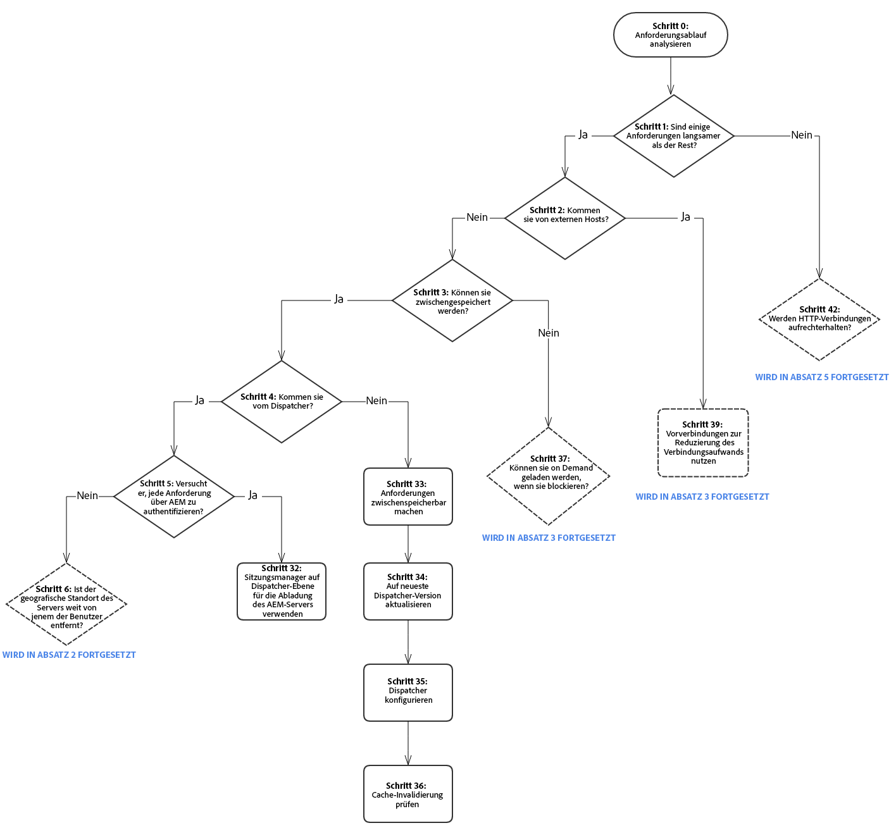
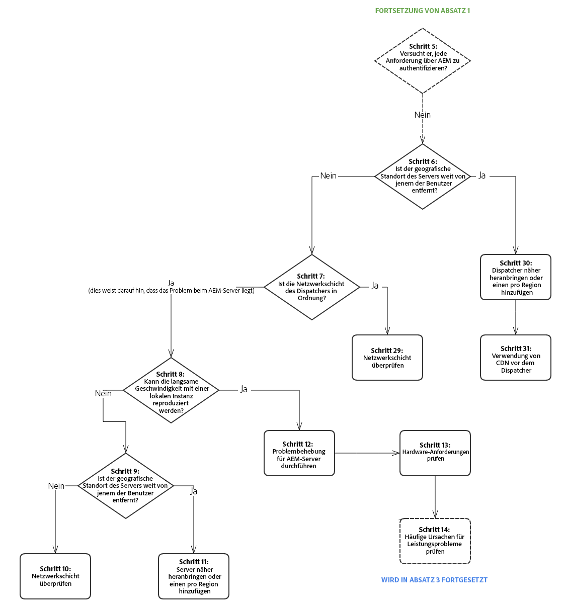
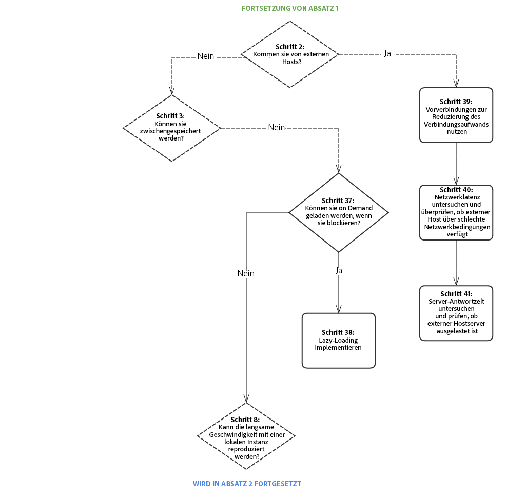
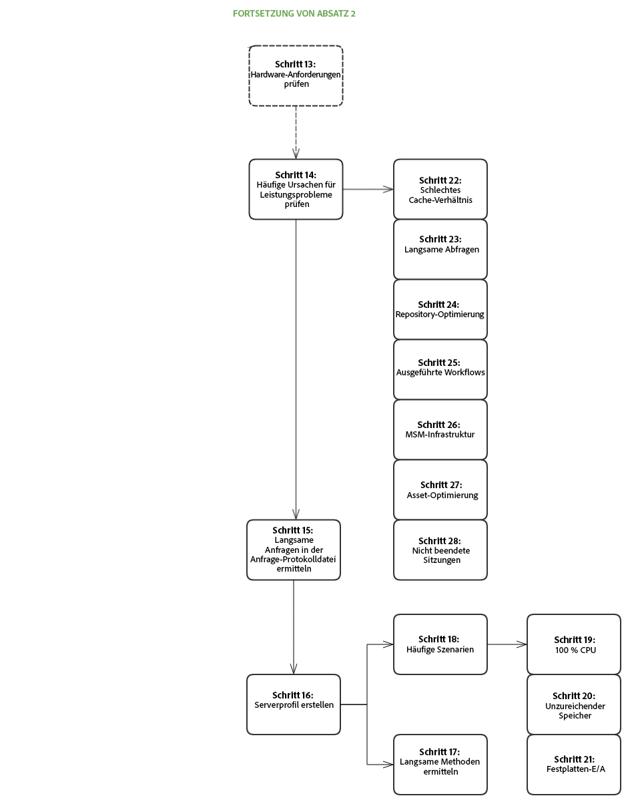
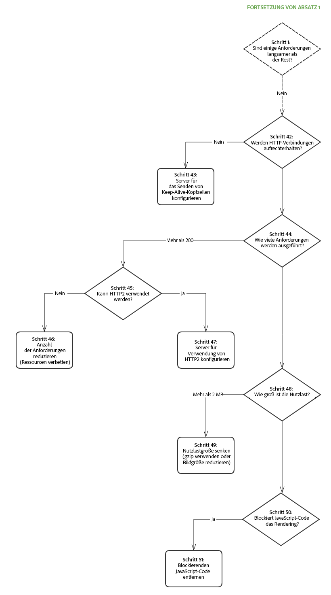

# Leistungsübersicht{#performance-tree}

## Anwendungsbereich {#scope}

Das nachfolgende Diagramm zeigt die erforderlichen Schritte zur Behebung von Leistungsproblemen. Aus Gründen der Lesbarkeit wurde das Diagramm in fünf Bereiche unterteilt.

Jeder Schritt im Diagramm ist mit einer Dokumentationsressource oder einer Empfehlung verknüpft.

## Voraussetzungen und Annahmen {#prerequisites-and-assumptions}

Es wird davon ausgegangen, dass ein Leistungsproblem auf einer Seite auftritt (einer AEM-Konsole oder einer Webseite) und konsistent reproduziert werden kann. Vor dem Start der Untersuchung muss es möglich sein, die Leistung zu testen oder zu überwachen.

Die Analyse beginnt mit Schritt 0. Das Ziel besteht darin, festzustellen, welche Einheit (Dispatcher, externer Host oder AEM) das Leistungsproblem verursacht, und dann zu bestimmen, welcher Bereich (Server oder Netzwerk) untersucht werden muss.

### Bereich 1 {#section}

### Bereich 2 {#section-1}

### Bereich 3 {#section-2}

### Bereich 4 {#section-3}

### Bereich 5 {#section-4}

## Referenzlinks {#reference-links}

<table>
 <tbody>
  <tr>
   <td><strong>Schritt</strong></td>
   <td><strong>Titel</strong></td>
   <td><strong>Ressourcen</strong></td>
  </tr>
  <tr>
   <td><strong>Schritt 0</strong></td>
   <td>Analyse des Anforderungsablaufs</td>
   <td>
Mit der Standard-HTTP-Anforderungsanalyse im Browser können Sie den Anforderungsablauf analysieren. Weitere Informationen dazu, wie Sie diesen Schritt in Chrome durchführen, finden Sie unter:  
 
<a href="https://developers.google.com/web/tools/chrome-devtools/profile/network-performance/resource-loading">https://developers.google.com/web/tools/chrome-devtools/profile/network-performance/resource-loading</a><a href="https://developers.google.com/web/tools/chrome-devtools/profile/network-performance/understanding-resource-timing">  https://developers.google.com/web/tools/chrome-devtools/profile/network-performance/understanding-resource-timing</a>  
 </td>
  </tr>
  <tr>
   <td><strong>Schritt 2</strong></td>
   <td>Gehen Anforderungen von externen Hosts ein?</td>
   <td>Mit der Standard-HTTP-Anforderungsanalyse im Browser können Sie den Anforderungsablauf analysieren. Weitere Informationen dazu, wie Sie diesen Schritt in Chrome durchführen, finden Sie unter den obigen links.  </td>
  </tr>
  <tr>
   <td><strong>Schritt 3</strong></td>
   <td>Können die Anforderungen zwischengespeichert werden?</td>
   <td>Weitere Informationen zu zwischenspeicherbaren Anforderungen und allgemeine Hinweise zur Optimierung der Dispatcher-Leistung finden Sie unter <a href="/help/sites-deploying/configuring-performance.md#optimizing-performance-when-using-the-dispatcher">Optimierung der Dispatcher-Leistung</a>.</td>
  </tr>
  <tr>
   <td><strong>Schritt 4</strong></td>
   <td>Gehen Anforderungen vom Dispatcher ein?</td>
   <td>
Überprüfen Sie die <a href="https://helpx.adobe.com/experience-manager/dispatcher/using/dispatcher-configuration.html#debugging">Dokumentation zum Dispatcher-Debugging</a>, um festzustellen, ob die Anforderungen ordnungsgemäß zwischengespeichert werden.  
 </td>
  </tr>
  <tr>
   <td><strong>Schritt 5</strong></td>
   <td>Versucht der Dispatcher jede Anforderung über AEM zu authentifizieren?</td>
   <td>Überprüfen Sie, ob der Dispatcher <code>HEAD</code>-Anforderungen zur Authentifizierung an AEM sendet, bevor er die zwischengespeicherte Ressource bereitstellt. Dazu können Sie im <code>HEAD</code> von AEM nach der <code>access.log</code>-Anforderung suchen. Weitere Informationen finden Sie unter <a href="/help/sites-deploying/configure-logging.md">Protokollierung</a>.  </td>
  </tr>
  <tr>
   <td><strong>Schritt 6</strong></td>
   <td>Ist der geografische Standort des Dispatchers weit von den Benutzern entfernt?</td>
   <td>Platzieren Sie den Dispatcher in der Nähe der Benutzer.</td>
  </tr>
  <tr>
   <td><strong>Schritt 7</strong></td>
   <td>Arbeitet die Netzwerkschicht des Dispatchers ordnungsgemäß?</td>
   <td>  Überprüfen Sie die Netzwerkschicht auf Sättigungs- und Latenzprobleme.
 
 </td>
  </tr>
  <tr>
   <td><strong>Schritt 8</strong></td>
   <td>Kann die langsame Geschwindigkeit mit einer lokalen Instanz reproduziert werden?</td>
   <td>  
Stellen Sie die Echtzeitbedingungen der Produktionsinstanzen mithilfe von <a href="/help/sites-developing/tough-day.md">Tough Day</a> nach. Wenn dies für Ihre Entwicklungsphase nicht realistisch ist, testen Sie die Produktionsinstanz (oder eine identische Staging-Instanz) in einem anderen Netzwerkkontext.  
 </td>
  </tr>
  <tr>
   <td><strong>Schritt 9</strong></td>
   <td>Ist der geografische Standort des Servers weit von den Benutzern entfernt?</td>
   <td>Platzieren Sie den Server in der Nähe der Benutzer.</td>
  </tr>
  <tr>
   <td><strong>Schritte 10 und 29</strong></td>
   <td>Untersuchung der Netzwerkschicht</td>
   <td>
Überprüfen Sie die Netzwerkschicht auf Sättigungs- und Latenzprobleme.
 
Für die Autorenschicht wird empfohlen, dass der Latenzwert 100 Millisekunden nicht übersteigt.
 
Weitere Tipps zur Leistungsoptimierung finden Sie auf <a href="https://helpx.adobe.com/de/experience-manager/kb/performance-tuning-tips.html">dieser Seite</a>.
 </td>
  </tr>
  <tr>
   <td><strong>Schritt 11</strong></td>
   <td>Server in der Nähe der Benutzer platzieren oder einen pro Region hinzufügen</td>
   <td> </td>
  </tr>
  <tr>
   <td><strong>Schritt 12</strong></td>
   <td>Problembehebung für den AEM-Server</td>
   <td>Überprüfen Sie die folgenden Teilschritte im Diagramm, um weitere Informationen zu erhalten.</td>
  </tr>
  <tr>
   <td><strong>Schritt 13</strong></td>
   <td>Überprüfung der Hardwareanforderungen</td>
   <td>Überprüfen Sie die Dokumentation zu den <a href="/help/managing/hardware-sizing-guidelines.md">Richtlinien für die Hardwaregröße</a>.  </td>
  </tr>
  <tr>
   <td><strong>Schritt 14</strong></td>
   <td>Überprüfung der häufigen Ursachen für Leistungsprobleme</td>
   <td> </td>
  </tr>
  <tr>
   <td><strong>Schritt 15</strong></td>
   <td>Suche nach langsamen Anforderungen</td>
   <td>
Um nach langsamen Anforderungen zu suchen, können Sie das Protokoll <code>request.log</code> analysieren oder die Datei <code>rlog.jar</code> verwenden.
 
Weitere Informationen zur Verwendung von „rlog.jar“ finden Sie auf dieser Seite.
 
Weitere Informationen finden Sie unter <a href="/help/sites-deploying/monitoring-and-maintaining.md#using-rlog-jar-to-find-requests-with-long-duration-times">Verwenden von rlog.jar bei der Suche nach Anforderungen mit langer Dauer</a>.  
 
 
 </td>
  </tr>
  <tr>
   <td><strong>Schritt 16</strong></td>
   <td>Profilserver</td>
   <td>
Weitere Informationen zu den Profilerstellungstools, die mit AEM verwendet werden können, finden Sie unter <a href="/help/sites-deploying/monitoring-and-maintaining.md#tools-for-monitoring-and-analyzing-performance">Tools für die Leistungsüberwachung und -analyse</a>.  
 </td>
  </tr>
  <tr>
   <td><strong>Schritt 17</strong></td>
   <td>Suche nach langsamen Methoden bei der Profilerstellung</td>
   <td> </td>
  </tr>
  <tr>
   <td><strong>Schritt 18</strong></td>
   <td>Allgemeine Szenarien bei der Profilerstellung</td>
   <td>Weitere Informationen finden Sie unter <a href="/help/sites-deploying/monitoring-and-maintaining.md#analyzing-specific-scenarios">Analyse spezieller Szenarien</a> im Abschnitt „Leistungsoptimierung“.  </td>
  </tr>
  <tr>
   <td><strong>Schritt 19</strong></td>
   <td>CPU-Auslastung 100 %</td>
   <td><a href="/help/sites-deploying/monitoring-and-maintaining.md#monitoring-performance">https://helpx.adobe.com/experience-manager/6-3/sites-deploying/monitoring-and-maintaining.html#MonitoringPerformance</a></td>
  </tr>
  <tr>
   <td><strong>Schritt 20</strong></td>
   <td>Unzureichender Speicher</td>
   <td> 
    <ol>
     <li><a href="/help/sites-deploying/monitoring-and-maintaining.md#out-of-memory">Unzureichender Speicher</a></li>
     <li><a href="/help/sites-deploying/troubleshooting.md">Meine Anwendung gibt Fehler über unzureichenden Speicher aus</a></li>
     <li><a href="https://helpx.adobe.com/de/experience-manager/kb/AnalyzeMemoryProblems.html">Analyse von Speicherproblemen mit der Helpx-Funktion.</a>  </li>
    </ol> </td>
  </tr>
  <tr>
   <td><strong>Schritt 21</strong></td>
   <td>Festplatten-I/O</td>
   <td>
Weitere Informationen finden Sie in der Dokumentation zur Überwachung und Wartung im Abschnitt <a href="/help/sites-deploying/monitoring-and-maintaining.md#disk-i-o">Festplatten-I/O</a>.
 </td>
  </tr>
  <tr>
   <td><strong>Schritte 22 und 22.1</strong></td>
   <td>Cache-Verhältnis</td>
   <td>Weitere Informationen finden Sie unter <a href="/help/sites-deploying/configuring-performance.md#calculating-the-dispatcher-cache-ratio">Berechnen des Dispatcher-Cache-Verhältnisses</a>.    </td>
  </tr>
  <tr>
   <td><strong>Schritt 23</strong></td>
   <td>Langsame Abfragen</td>
   <td><a href="/help/sites-deploying/best-practices-for-queries-and-indexing.md">Best Practices für Abfragen und Indizierung</a></td>
  </tr>
  <tr>
   <td><strong>Schritt 24</strong></td>
   <td>Repository-Optimierung</td>
   <td>
    <ul>
     <li><a href="https://helpx.adobe.com/experience-manager/kb/performance-tuning-tips.html">Tipps zur Leistungsoptimierung </a></li>
     <li><a href="/help/sites-deploying/configuring-performance.md#configuring-for-performance">Konfiguration zur Leistungsoptimierung</a></li>
     <li><a href="https://www.slideshare.net/jukka/repository-performance-tuning">Optimierung der Repository-Leistung</a></li>
    </ul> </td>
  </tr>
  <tr>
   <td><strong>Schritt 25</strong></td>
   <td>Ausführung von Workflows</td>
   <td>
    <ul>
     <li><a href="/help/sites-deploying/configuring-performance.md#concurrent-workflow-processing">Gleichzeitige Verarbeitung von Workflows</a></li>
     <li><a href="/help/sites-deploying/configuring-performance.md#configure-the-queue-for-a-specific-workflow">Konfigurieren der Warteschlange für einen spezifischen Workflow</a></li>
     <li><a href="/help/sites-administering/workflows-administering.md#regular-purging-of-workflow-instances">Regelmäßiges Bereinigen von Workflow-Instanzen</a></li>
     <li><a href="/help/sites-developing/workflows.md#transient-workflows">Übergangs-Workflows</a>  </li>
    </ul> 
 
 </td>
  </tr>
  <tr>
   <td><strong>Schritt 26</strong></td>
   <td>MSM-Infrastruktur</td>
   <td>
<a href="/help/sites-administering/msm-best-practices.md">Multi-Site-Manager – Best Practices</a>  
 </td>
  </tr>
  <tr>
   <td><strong>Schritt 27</strong></td>
   <td>Optimierung von Assets</td>
   <td>
    <ol>
     <li><a href="/help/sites-deploying/configuring-performance.md#cq-dam-asset-synchronization-service">Synchronisierungsdienst für Assets</a></li>
     <li><a href="/help/sites-deploying/configuring-performance.md#multiple-dam-instances">Mehrere DAM-Instanzen</a></li>
     <li>Artikel mit Tipps zur Leistungsoptimierung finden Sie <a href="https://helpx.adobe.com/experience-manager/kb/performance-tuning-tips.html">hier</a> und <a href="https://helpx.adobe.com/experience-manager/kb/performance-tuning-tips.html">hier</a>.  </li>
    </ol> </td>
  </tr>
  <tr>
   <td><strong>Schritt 28</strong></td>
   <td>Nicht beendete Sitzungen</td>
   <td>
 
 
<a href="/help/sites-administering/troubleshoot.md#checking-for-unclosed-jcr-sessions">Überprüfung auf nicht beendete JCR-Sitzungen</a>
 
 
 </td>
  </tr>
  <tr>
   <td><strong>Schritt 30</strong></td>
   <td>Platzierung des Dispatchers in der Nähe der Benutzer (einen pro „Region“ hinzufügen?)</td>
   <td> </td>
  </tr>
  <tr>
   <td><strong>Schritt 31</strong></td>
   <td>Verwendung von CDN vor dem Dispatcher</td>
   <td><a href="https://helpx.adobe.com/experience-manager/dispatcher/using/dispatcher.html#using-dispatcher-with-a-cdn">Verwenden des Dispatchers mit einem CDN </a>  </td>
  </tr>
  <tr>
   <td><strong>Schritt 32</strong></td>
   <td>Nutzung der Sitzungsverwaltung auf Dispatcher-Ebene für die AEM-Serverabladung</td>
   <td>
<a href="https://helpx.adobe.com/experience-manager/dispatcher/using/dispatcher-configuration.html#enabling-secure-sessions-sessionmanagement">Aktivierung von Sicherheitssitzungen</a>
 </td>
  </tr>
  <tr>
   <td><strong>Schritt 33</strong></td>
   <td>Anforderungen zwischenspeicherbar machen</td>
   <td>
    <ol>
     <li><a href="https://helpx.adobe.com/experience-manager/dispatcher/using/dispatcher.html">Allgemeine Dispatcher-Konfiguration</a></li>
     <li><a href="https://helpx.adobe.com/experience-manager/dispatcher/using/dispatcher-configuration.html#configuring-the-dispatcher-cache-cache">Konfigurieren des Dispatcher-Caches</a></li>
    </ol> 
Verbessern des Cache-Verhältnisses; Anforderungen zwischenspeicherbar machen (Best Practices für Dispatcher)
 
Berücksichtigen Sie bei der Optimierung Ihrer Zwischenspeicherungskonfigurationen auch die nachfolgenden Einstellungen  

    <ol>
     <li>Legen Sie eine „no-cache“-Regel für HTTP-Anforderungen fest, die keine GET-Anforderungen sind.</li>
     <li>Legen Sie fest, dass Abfragezeichenfolgen nicht zwischenspeicherbar sind.</li>
     <li>URLs mit fehlenden Erweiterungen dürfen nicht zwischengespeichert werden.</li>
     <li>Cache-Authentifizierungs-Header (Option seit Dispatcher-Version 4.1.10)</li>
    </ol> </td>
  </tr>
  <tr>
   <td><strong>Schritt 34</strong></td>
   <td>Aktualisierung der Dispatcher-Version</td>
   <td>
Sie können die aktuelle Dispatcher-Version hier herunterladen:
 
<a href="https://helpx.adobe.com/de/experience-manager/dispatcher/release-notes.html">Link folgen</a>
 </td>
  </tr>
  <tr>
   <td><strong>Schritt 35</strong></td>
   <td>Konfiguration des Dispatchers</td>
   <td><a href="https://helpx.adobe.com/experience-manager/dispatcher/using/dispatcher-configuration.html">Konfigurieren des Dispatchers</a>  </td>
  </tr>
  <tr>
   <td><strong>Schritt 36</strong></td>
   <td>Überprüfung der Cache-Invalidierung</td>
   <td> 
    <ul>
     <li><a href="https://helpx.adobe.com/experience-manager/dispatcher/using/page-invalidate.html#invalidating-dispatcher-cache-from-the-authoring-environment">Cache-Invalidierung für die Autorenschicht</a></li>
     <li><a href="https://helpx.adobe.com/experience-manager/dispatcher/using/page-invalidate.html#invalidating-dispatcher-cache-from-a-publishing-instance">Cache-Invalidierung für die Veröffentlichungsschicht</a></li>
    </ul> </td>
  </tr>
  <tr>
   <td><strong>Schritte 37 und 38</strong></td>
   <td>Lazy Loading</td>
   <td><a href="https://docs.adobe.com/ddc/en/gems/aem-web-performance.html">Weitere Informationen finden Sie in der Gem-Sitzung „AEM Web Performance“.</a>  </td>
  </tr>
  <tr>
   <td><strong>Schritt 39</strong></td>
   <td>Nutzung von Vorverbindungen zur Reduzierung des Verbindungsaufwands</td>
   <td>Weitere Informationen finden Sie in der oben genannten Gem-Sitzung sowie in der zusätzlichen Dokumentation zu Vorverbindungen von W3c: <a href="https://www.w3.org/TR/resource-hints/#dfn-preconnect">https://www.w3.org/TR/resource-hints/#dfn-preconnect</a></td>
  </tr>
  <tr>
   <td><strong>Schritte 40 und 41</strong>  </td>
   <td>Latenz- und Antwortzeit externer Hosts</td>
   <td>Untersuchung der Latenz- und Antwortzeit für die externen Hosts.</td>
  </tr>
  <tr>
   <td><strong>Schritte 45  und 47</strong>  </td>
   <td>Verwendung von HTTP/2</td>
   <td>Weitere Informationen finden Sie in der Gem-Sitzung für die Schritte 37, 38 und 39 Sehen Sie sich auch <a href="https://help-forums.adobe.com/content/adobeforums/en/experience-manager-forum/adobe-experience-manager.topic.html/forum__kdzc-does_anyoneknowwhe.html">diesen </a> Forumsbeitrag auf HTTP/2-Unterstützung an.  </td>
  </tr>
  <tr>
   <td><strong>Schritt 49</strong></td>
   <td>Reduzierung der Payload-Größe</td>
   <td><a href="/help/sites-deploying/osgi-configuration-settings.md">Aktivieren von Gzip</a> und <a href="https://docs.adobe.com/ddc/en/gems/aem-web-performance.html">Reduzieren der Bildgröße</a>.  </td>
  </tr>
  <tr>
   <td><strong>Schritte 42 und 43</strong></td>
   <td>Keep-Alive</td>
   <td>
Ist der <code>Keep-Alive</code>-Header in den verschiedenen Anforderungen zur Wiederverwendung von Verbindungen vorhanden? Andernfalls führen alle Anforderungen dazu, dass eine weitere Verbindung hergestellt wird, wodurch ein unnötiger Verbindungsaufwand entsteht. (Standard-HTTP-Anforderungsanalyse im Browser)
 
Mit dem <a href="/help/sites-administering/proxy-jar.md">Proxyserver-Tool</a> können Sie nach Keep-Alive-Verbindungen suchen.  
 </td>
  </tr>
  <tr>
   <td><strong>Schritt 44</strong></td>
   <td>Wie viele Anforderungen werden gestellt?</td>
   <td>Führen Sie eine Standard-HTTP-Anforderungsanalyse im Browser durch.</td>
  </tr>
  <tr>
   <td><strong>Schritt 46</strong></td>
   <td>Reduzierung der Anzahl von Anforderungen</td>
   <td>
    <ol>
     <li>Verketten Sie Ressourcen (Bilder, CSS-Sprites, JSON usw.)  </li>
     <li>Einbetten von clientlibs:
      <ol>
       <li><a href="/help/sites-developing/clientlibs.md#creating-client-library-folders">Erstellen von Client-Bibliotheksordnern</a>  - siehe Abschnitt Verwenden der Einbettung zum Minimieren von Anforderungen</li>
      </ol> </li>
    </ol> </td>
  </tr>
  <tr>
   <td><strong>Schritt 48</strong></td>
   <td>Wie groß ist die Nutzlast?</td>
   <td>Standard-HTTP-Anforderungsanalyse im Browser</td>
  </tr>
  <tr>
   <td><strong>Schritte 50 und 51</strong></td>
   <td>Blockierung von JS-Code</td>
   <td><a href="https://docs.adobe.com/ddc/en/gems/aem-web-performance.html">https://docs.adobe.com/ddc/en/gems/aem-web-performance.html</a></td>
  </tr>
 </tbody>
</table>
