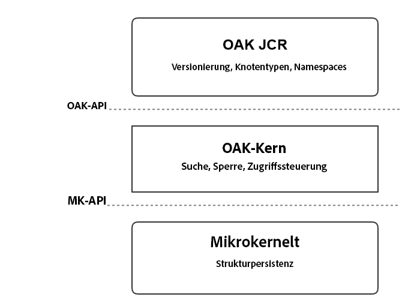
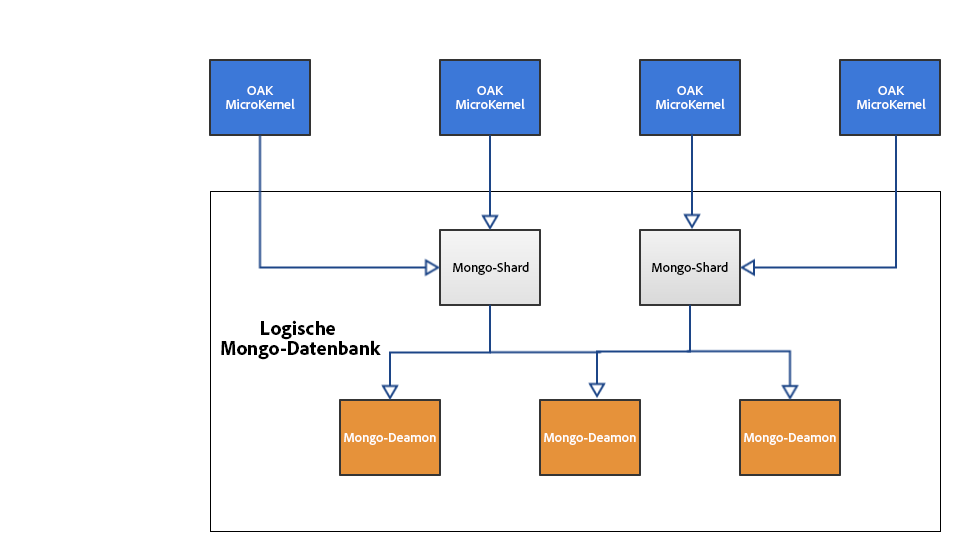

# Einführung in die AEM-Plattform{#introduction-to-the-aem-platform}

Die AEM-Plattform in AEM 6 basiert auf Apache Jackrabbit Oak.

Apache Jackrabbit Oak implementiert ein skalierbares und leistungsstarkes, hierarchisches Inhalts-Repository, das als Grundlage für moderne, erstklassige Websites und andere anspruchsvolle Inhaltsanwendungen dienen soll.

Es ist die Nachfolgerin von Jackrabbit 2 und wird von AEM 6 als Standard-Backend für sein Inhalts-Repository CRX verwendet.

## Designrichtlinien und -ziele {#design-principles-and-goals}

Oak implementiert die [JSR-283](https://www.day.com/day/en/products/jcr/jsr-283.html)-Spezifikation (JCR 2.0). Die wichtigsten Designziele der Lösung sind wie folgt:

* Bessere Unterstützung für große Repositorys
* Mehrere verteilte Clusterknoten für hohe Verfügbarkeit
* Bessere Leistung
* Unterstützung für eine Vielzahl von untergeordneten Knoten und Zugriffssteuerungsebenen

## Architekturkonzept {#architecture-concept}

### Speicherung {#storage}

Die Speicherschicht erfüllt folgende Zwecke:

* Implementierung eines Strukturmodells
* Austauschfähigkeit des Speichers
* Bereitstellung eines Clustering-Mechanismus

### Oak-Kern  {#oak-core}

Der Oak-Kern fügt mehrere Ebenen zur Speicherschicht hinzu:

* Zugriffssteuerungselemente
* Suche und Indizierung
* Überwachung

### Oak-JCR  {#oak-jcr}

Das Hauptziel des Oak-JCR besteht darin, die JCR-Semantik in Strukturvorgängen zu transformieren. Darüber hinaus erfüllt es folgende Zwecke:

* Implementieren der JCR-API
* Einbinden von CommitHooks, die JCR-Beschränkungen implementieren

Darüber hinaus sind jetzt nicht-Java-basierte Implementierungen möglich, die Teil des Oak-JCR-Konzepts bilden.

## Speicherüberblick {#storage-overview}

Die Oak-Speicherschicht stellt eine Abstraktionsschicht für die tatsächliche Speicherung der Inhalte bereit.

Zurzeit sind in AEM6 zwei Speicherimplementierungen verfügbar: **Tar Storage** und **MongoDB Storage**.

### TAR-Speicher {#tar-storage}

Der TAR-Speicher nutzt TAR-Dateien. Er speichert Inhalte als unterschiedliche Datensätze innerhalb größerer Segmente. Journale dienen dazu, den aktuellen Status des Repositorys zu verfolgen.

Diesem Speichertyp liegen mehrere zentrale Designrichtlinien zugrunde:

* **Unveränderliche Segmente**

Die Inhalte werden in Segmenten von bis zu 256 KB gespeichert. Sie sind unveränderlich, sodass häufig genutzte Segmente problemlos zwischengespeichert und Systemfehler vermieden werden, die das Repository beschädigen können.

Jedes Segment wird durch einen eindeutigen Bezeichner (Unique Identifier, UUID) identifiziert und enthält eine kontinuierliche Teilmenge der Inhaltsstruktur. Darüber hinaus können Segmente andere Inhalte referenzieren. Jedes Segment verwaltet eine Liste von UUIDs anderer referenzierter Segmente.

* **Speicherort**

Verwandte Datensätze wie etwa ein Knoten und dessen unmittelbare, untergeordnete Elemente werden normalerweise im selben Segment gespeichert. Dadurch kann das Repository sehr schnell durchsucht werden. Zudem werden die meisten Cache-Fehler für typische Clients vermieden, die pro Sitzung auf mehr als einen verwandten Knoten zugreifen.

* **Kompaktheit**

Die Formatierung der Datensätze wurde bezüglich der Größe optimiert, um die I/O-Kosten zu senken und möglichst viele Inhalte in Caches zwischenzuspeichern.

### Mongo-Speicher  {#mongo-storage}

Der MongoDB-Speicher nutzt MongoDB für Sharding und Clustering. Die Repository-Struktur wird in einer MongoDB-Datenbank gespeichert, wobei jeder Knoten ein separates Dokument ist.

Dieser Speichertyp weist mehrere Besonderheiten auf:

* Revisionen

Bei jeder Aktualisierung (Commit) von Inhalten wird eine neue Revision erstellt. Im Wesentlichen ist eine Revision eine Zeichenfolge, die aus drei Elementen besteht:

1. Ein von der Systemzeit des Rechners, auf dem sie erstellt wurde, abgeleiteter Zeitstempel
1. Ein Zähler, um zwischen Revisionen zu unterscheiden, die mit demselben Zeitstempel erstellt wurden
1. Die ID des Clusterknotens, auf dem die Revision erstellt wurde

* Verzweigungen

Es werden Verzweigungen unterstützt, damit Clients mehrere Änderungen bereitstellen und mit einem einzigen Zusammenführungsaufruf sichtbar machen können.

* Vorherige Dokumente

Der MongoDB-Speicher fügt bei jeder Änderung Daten zu einem Dokument hinzu. Daten werden jedoch nur gelöscht, wenn explizit eine Bereinigung ausgelöst wird. Alte Daten werden verschoben, wenn ein bestimmter Grenzwert erreicht wird. Vorherige Dokumente enthalten nur unveränderliche Daten, d. h. sie enthalten nur übergebene und zusammengeführte Revisionen.

* Clusterknoten-Metadaten

Daten zu aktiven und inaktiven Clusterknoten werden in der Datenbank gespeichert, um Cluster-Vorgänge zu vereinfachen.

Eine typische AEM-Clusterkonfiguration mit MongoDB-Speicher:

## Was unterscheidet sich von Jackrabbit 2? {#what-is-different-from-jackrabbit}

Da Oak für Abwärtskompatibilität mit dem JCR 1.0-Standard entwickelt wurde, gibt es auf Benutzerebene so gut wie keine Änderungen. Beim Konfigurieren einer Oak-basierten AEM-Installation muss jedoch eine Reihe wichtiger Änderungen berücksichtigt werden:

* Indizes in Oak werden nicht automatisch erstellt. Aus diesem Grund müssen bei Bedarf benutzerdefinierte Indizes erstellt werden.
* Im Gegensatz zu Jackrabbit 2, bei dem Sitzungen immer den aktuellen Status des Repositorys angegeben, zeigen Oak-Sitzungen eine unveränderte Ansicht des Repositorys zum Zeitpunkt, an dem die Sitzung erfasst wurde. Dies liegt am MVCC-Modell, auf dem Oak basiert.
* Same Name Siblings (SNS), d. h. untergeordnete Elemente mit demselben Namen, werden in Oak nicht unterstützt.

## Zusätzliche plattformbezogene Dokumentation {#other-platform-related-documentation}

Weitere Informationen zur AEM-Plattform finden Sie zudem in den nachfolgenden Artikeln:

* [Konfigurieren von Knotenspeichern und Datenspeichern in AEM 6](/help/sites-deploying/data-store-config.md)
* [Oak-Abfragen und Indizierung](/help/sites-deploying/queries-and-indexing.md)
* [Speicherelemente in AEM 6](/help/sites-deploying/storage-elements-in-aem-6.md)
* [AEM mit MongoDB](/help/sites-deploying/aem-with-mongodb.md)
