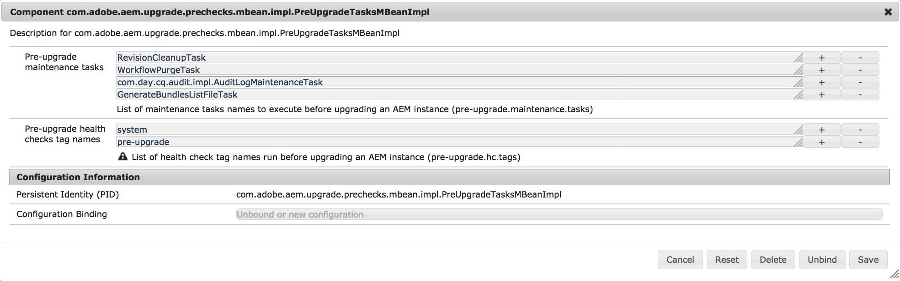

# Wartungsaufgaben vor einem Upgrade{#pre-upgrade-maintenance-tasks}

Bevor Sie mit dem Upgrade beginnen, ist es wichtig, die folgenden Wartungsaufgaben durchzuführen, damit das System bereit ist und zurückgesetzt werden kann, falls Probleme auftreten:

* [Überprüfung auf ausreichenden Festplattenspeicher](/help/sites-deploying/pre-upgrade-maintenance-tasks.md#ensure-sufficient-disk-space)
* [Vollständige Sicherung von AEM](/help/sites-deploying/pre-upgrade-maintenance-tasks.md#fully-back-up-aem)
* [Sicherung von Änderungen unter /etc](/help/sites-deploying/pre-upgrade-maintenance-tasks.md#backup-changes-etc)
* [Erstellen der quickstart.properties-Datei](/help/sites-deploying/pre-upgrade-maintenance-tasks.md#generate-quickstart-properties)
* [Konfigurieren von Workflow- und Auditprotokoll-Löschung](/help/sites-deploying/pre-upgrade-maintenance-tasks.md#configure-wf-audit-purging)
* [Installieren, Konfigurieren und Ausführen der Aufgaben vor dem Upgrade](/help/sites-deploying/pre-upgrade-maintenance-tasks.md#install-configure-run-pre-upgrade-tasks)
* [Deaktivieren von benutzerdefinierten Anmeldemodulen](/help/sites-deploying/pre-upgrade-maintenance-tasks.md#disable-custom-login-modules)
* [Entfernen von Updates aus dem /install-Verzeichnis](/help/sites-deploying/pre-upgrade-maintenance-tasks.md#remove-updates-install-directory)
* [Beenden aller Cold-Standby-Instanzen](/help/sites-deploying/pre-upgrade-maintenance-tasks.md#stop-tarmk-coldstandby-instance)
* [Deaktivieren von benutzerdefinierten geplanten Aufträgen](/help/sites-deploying/pre-upgrade-maintenance-tasks.md#disable-custom-scheduled-jobs)
* [Durchführen der Offline-Revisionsbereinigung](/help/sites-deploying/pre-upgrade-maintenance-tasks.md#execute-offline-revision-cleanup)
* [Durchführen der Datenspeicherbereinigung](/help/sites-deploying/pre-upgrade-maintenance-tasks.md#execute-datastore-garbage-collection)
* [Upgrade des Datenbankschemas bei Bedarf](/help/sites-deploying/pre-upgrade-maintenance-tasks.md#upgradethedatabaseschemaifneeded)
* [Löschen von Benutzern, die das Upgrade behindern könnten](/help/sites-deploying/pre-upgrade-maintenance-tasks.md#delete-users-that-might-hinder-the-upgrade)

* [Rotieren von Protokolldateien](/help/sites-deploying/pre-upgrade-maintenance-tasks.md#rotate-log-files)

## Überprüfung auf ausreichenden Festplattenspeicher {#ensure-sufficient-disk-space}

Wenn Sie das Upgrade durchführen, ist zusätzlich zur Aktualisierung von Inhalt und Code auch eine Migration des Repositorys erforderlich. Bei der Migration wird eine Kopie des Repositorys im neuen Segment-Tar-Format erstellt. Daher benötigen Sie genügend Speicherplatz, um eine zweite, möglicherweise größere Version Ihres Repositorys beizubehalten.

## Vollständige Sicherung von AEM {#fully-back-up-aem}

Bevor Sie mit dem Upgrade beginnen, sollten Sie eine vollständige Sicherungskopie von AEM erstellen. Stellen Sie sicher, dass Sie Ihr Repository, Ihre Anwendungsinstallation, Ihren Datenspeicher und gegebenenfalls Ihre Mongo-Instanzen sichern. Weitere Informationen zum Sichern und Wiederherstellen einer AEM-Instanz finden Sie unter [Sicherung und Wiederherstellung](/help/sites-administering/backup-and-restore.md).

## Sicherung von Änderungen unter /etc {#backup-changes-etc}

Ein Upgrade ist ein guter Anlass, um vorhandene Inhalte und Konfigurationen unter den Pfaden `/apps` und `/libs` im Repository zu pflegen und zusammenzuführen. Bei Änderungen, die am `/etc`-Pfad vorgenommen wurden, einschließlich Context Hub-Konfigurationen, ist es oft notwendig, diese Änderungen nach dem Upgrade erneut vorzunehmen. Auch wenn das Upgrade eine Sicherungskopie aller Änderungen erstellt, die nicht unter `/var` zusammengeführt werden können, empfiehlt Adobe, diese Änderungen vor dem Upgrade manuell zu sichern.

## Erzeugen der Datei quickstart.properties {#generate-quickstart-properties}

Beim Starten von AEM aus der .jar-Datei wird eine Datei `quickstart.properties` unter `crx-quickstart/conf` erzeugt. Falls AEM bisher nur mit dem Startskript gestartet wurde, ist diese Datei nicht vorhanden und das Upgrade schlägt fehl. Überprüfen Sie, ob diese Datei vorhanden ist, und starten Sie AEM aus der jar-Datei neu, falls sie nicht vorhanden ist.

## Konfigurieren von Workflow- und Auditprotokoll-Löschung {#configure-wf-audit-purging}

Für die Aufgaben `WorkflowPurgeTask` und `com.day.cq.audit.impl.AuditLogMaintenanceTask` sind separate OSGi-Konfigurationen erforderlich, ohne die sie nicht ausgeführt werden können. Falls diese Aufgaben beim Ausführen von Aufgaben vor dem Upgrade fehlschlagen, sind die Ursache dafür wahrscheinlich fehlende Konfigurationen. Daher müssen Sie die OSGi-Konfigurationen für diese Aufgaben hinzufügen oder diese Aufgaben vollständig aus der Liste der Optimierungsaufgaben vor dem Upgrade löschen, falls Sie diese nicht ausführen möchten. Die Dokumentation zum Konfigurieren von Workflow-Bereinigungsaufgaben finden Sie unter [Verwalten von Workflow-Instanzen](/help/sites-administering/workflows-administering.md). Die Konfiguration der Wartungsaufgaben im Auditprotokoll finden Sie unter [Auditprotokollwartung in AEM 6](/help/sites-administering/operations-audit-log.md).

Informationen zu Workflow- und Auditprotokolllöschungen in CQ 5.6 sowie zur Bereinigung von Auditprotokollen in AEM 6.0 finden Sie unter [Bereinigen von Workflow- und Auditknoten](https://helpx.adobe.com/de/experience-manager/kb/howtopurgewf.html).

## Installieren, Konfigurieren und Ausführen der Aufgaben vor dem Upgrade {#install-configure-run-pre-upgrade-tasks}

Da AEM ein hohes Maß an Anpassung erlaubt, gibt es in der Regel keine einheitliche Vorgehensweise für die Durchführung von Upgrades. Es ist deshalb schwierig, ein standardisiertes Verfahren für Upgrades zu entwickeln.

In vorherigen Versionen war es zudem problematisch, gestoppte oder fehlgeschlagene AEM-Upgrades wieder sicher fortzusetzen. Dieses Problem führte zu Situationen, in denen das Upgrade komplett neu gestartet werden musste oder fehlerhafte Upgrades durchgeführt wurden, ohne dass Warnungen ausgelöst wurden.

Um diese Probleme zu beheben, hat Adobe einige Verbesserungen am Upgrade-Prozess vorgenommen, sodass dieser jetzt ausfallsicherer und benutzerfreundlicher ist. Wartungsaufgaben vor einem Upgrade, die bisher manuell durchgeführt werden mussten, wurden optimiert und automatisiert. Darüber hinaus wurden Berichte hinzugefügt, die nach dem Upgrade erstellt werden, sodass der Vorgang umfassend überprüft werden kann und Probleme einfach identifizierbar sind.

Die Wartungsaufgaben vor einem Upgrade sind derzeit auf verschiedene Schnittstellen verteilt und werden teilweise oder vollständig manuell durchgeführt. Durch die in AEM 6.3 eingeführte Optimierungsfunktionen für die Wartungsaufgaben im Vorfeld des Upgrades können diese Aufgaben einheitlich ausgelöst und ihre Ergebnisse bei Bedarf überprüft werden.

Sämtliche Aufgaben, die zum Optimierungsschritt vor dem Upgrade gehören, sind mit allen Versionen (ab Version 6.0) kompatibel.

### Einrichtung {#how-to-set-it-up}

In AEM 6.3 und höher ist die Optimierung der Wartungsaufgaben vor einem Upgrade Teil der quickstart-Datei.

<!-- URLs below are all 404s. This content should probably be removed because it is entirely obsolete.

If you are upgrading from an older version of AEM 6, they are made available through separate packages that you can download from the Package Manager.

You can find the packages at these locations:

* [For upgrading from AEM 6.0](https://www.adobeaemcloud.com/content/marketplace/marketplaceProxy.html?packagePath=/content/companies/public/adobe/packages/cq600/product/pre-upgrade-tasks-content-cq60)

* [For upgrading from AEM 6.1](https://www.adobeaemcloud.com/content/marketplace/marketplaceProxy.html?packagePath=/content/companies/public/adobe/packages/cq610/product/pre-upgrade-tasks-content-cq61)

* [For upgrading from AEM 6.2](https://www.adobeaemcloud.com/content/marketplace/marketplaceProxy.html?packagePath=/content/companies/public/adobe/packages/cq620/product/pre-upgrade-tasks-content-cq62) -->

### Verwendung {#how-to-use-it}

Die OSGi-Komponente `PreUpgradeTasksMBean` ist mit einer Liste von Wartungsaufgaben vor dem Upgrade vorkonfiguriert, die gleichzeitig ausgeführt werden können. Sie können die Aufgaben mit den nachfolgenden Schritten konfigurieren:

1. Navigieren Sie zur Web-Konsole unter *https://Server-Adresse:Serverport/system/console/configMgr*.

1. Suchen Sie nach „**preupgradetasks**“ und klicken Sie auf die erste übereinstimmende Komponente. Der vollständige Name der Komponenten lautet `com.adobe.aem.upgrade.prechecks.mbean.impl.PreUpgradeTasksMBeanImpl`.

1. Ändern Sie die Liste der auszuführenden Wartungsaufgaben, wie unten dargestellt:

   

Die Aufgabenliste unterscheidet sich je nach dem verwendeten Ausführungsmodus zum Starten der Instanz. Nachfolgend finden Sie eine Beschreibung des Ausführungsmodus, für den jede Wartungsaufgabe entwickelt wurde.

<table>
 <tbody>
  <tr>
   <td><strong>Aufgabe</strong></td>
   <td><strong>Ausführungsmodus</strong></td>
   <td><strong>Anmerkungen</strong></td>
  </tr>
  <tr>
   <td><code>TarIndexMergeTask</code></td>
   <td>crx2</td>
   <td> </td>
  </tr>
  <tr>
   <td><code>DataStoreGarbageCollectionTask</code></td>
   <td>crx2</td>
   <td>Führt „mark“ und „sweep“ aus. Bei gemeinsam genutzten Datenspeichern entfernen Sie diesen Schritt und führen<br /> manuell aus oder bereiten die Instanzen vor der Ausführung ordnungsgemäß vor.</td>
  </tr>
  <tr>
   <td><code>ConsistencyCheckTask</code></td>
   <td>crx2</td>
   <td> </td>
  </tr>
  <tr>
   <td><code>WorkflowPurgeTask</code></td>
   <td>crx2/crx3</td>
   <td>Vor der Ausführung muss die Adobe Granite Workflow-Bereinigungskonfigurations-OSGi konfiguriert werden.</td>
  </tr>
  <tr>
   <td><code>GenerateBundlesListFileTask</code></td>
   <td>crx2/crx3</td>
   <td> </td>
  </tr>
  <tr>
   <td><code>RevisionCleanupTask</code></td>
   <td>crx3</td>
   <td>Führen Sie bei TarMK-Instanzen unter AEM 6.0 bis 6.2 stattdessen die Offline-Revisionsbereinigung manuell aus.</td>
  </tr>
  <tr>
   <td><code>com.day.cq.audit.impl.AuditLogMaintenanceTask</code></td>
   <td>crx3</td>
   <td>Vor der Ausführung muss die OSGi-Konfiguration für den Auditprotokolllöschungs-Planer konfiguriert werden.</td>
  </tr>
 </tbody>
</table>

>[!CAUTION]
>
>Die Aufgabe `DataStoreGarbageCollectionTask` ruft einen Vorgang zur Datenspeicherbereinigung mit der Mark- und Sweep-Phase auf, falls sie verwendet wird. Bei Bereitstellungen, die einen gemeinsam genutzten Datenspeicher verwenden, müssen Sie diesen entweder ordnungsgemäß neu konfigurieren oder die Instanz so vorbereiten, dass das Löschen von Elementen, auf die eine andere Instanz verweist, vermieden wird. Hierzu muss die Mark-Phase möglicherweise auf allen Instanzen manuell ausgeführt werden, bevor diese Aufgabe vor einem Upgrade ausgelöst wird.

### Standardkonfiguration der Konsistenzprüfungen vor einem Upgrade {#default-configuration-of-the-pre-upgrade-health-checks}

Die OSGi-Komponente `PreUpgradeTasksMBeanImpl` umfasst eine vorkonfigurierte Liste von Tags für Konsistenzprüfungen vor einem Upgrade, die ausgeführt werden sollen, wenn die Methode `runAllPreUpgradeHealthChecks` aufgerufen wird:

* **system** – das Tag, das von den Wartungs-Konsistenzprüfungen für Granite verwendet wird

* **pre-upgrade** – Ein benutzerdefiniertes Tag, das Sie allen Konsistenzprüfungen hinzufügen können, die vor einem Upgrade durchgeführt werden sollen

Die Liste kann bearbeitet werden. Sie können die Schaltflächen Plus **(+)** und Minus **(-)** neben den Tags verwenden, um weitere benutzerdefinierte Tags hinzuzufügen oder die standardmäßigen Tags zu entfernen.

**MBean-Methoden**

Auf die Funktion für verwaltete Beans kann über die [JMX-Konsole](/help/sites-administering/jmx-console.md) zugegriffen werden.

Sie können wie folgt auf die MBeans zugreifen:

1. Wechseln Sie zur JMX-Konsole unter *https://Server-Adresse:Serverport/system/console/jmx*.
1. Suchen Sie nach **PreUpgradeTasks** und klicken Sie auf das Ergebnis.

1. Wählen Sie im Bereich **Operations** eine Methode und im daraufhin angezeigten Fenster **Invoke** aus.

Nachfolgend finden Sie eine Liste aller verfügbaren Methoden, die von `PreUpgradeTasksMBeanImpl` bereitgestellt werden:

<table>
 <tbody>
  <tr>
   <td><strong>Name der Methode</strong></td>
   <td><strong>Typ</strong></td>
   <td><strong>Beschreibung</strong></td>
  </tr>
  <tr>
   <td><code>getAvailablePreUpgradeTasksNames()</code></td>
   <td>INFO</td>
   <td>Zeigt die Namensliste der verfügbaren Wartungsaufgaben vor dem Upgrade an.</td>
  </tr>
  <tr>
   <td><code>getAvailablePreUpgradeHealthChecksTagNames()</code></td>
   <td>INFO</td>
   <td>Zeigt die Namensliste Liste der Konsistenzprüfungen vor dem Upgrade an.</td>
  </tr>
  <tr>
   <td><code>runAllPreUpgradeTasks()</code></td>
   <td>ACTION</td>
   <td>Führt alle in der Liste genannten Wartungsaufgaben vor dem Upgrade aus.</td>
  </tr>
  <tr>
   <td><code>runPreUpgradeTask(preUpgradeTaskName)</code></td>
   <td>ACTION</td>
   <td>Führt die Wartungsaufgabe vor dem Upgrade mit dem als Parameter angegebenen Namen aus.</td>
  </tr>
  <tr>
   <td><code>isRunAllPreUpgradeTaskRunning()</code></td>
   <td>ACTION_INFO</td>
   <td>Überprüft, ob die Aufgabe <code>runAllPreUpgradeTasksmaintenance</code> gerade ausgeführt wird.</td>
  </tr>
  <tr>
   <td><code>getAnyPreUpgradeTaskRunning()</code></td>
   <td>ACTION_INFO</td>
   <td>Überprüft, ob gerade Wartungsaufgaben vor dem Upgrade ausgeführt werden und<br /> gibt ein Array mit den Namen der gerade laufenden Aufgaben zurück.</td>
  </tr>
  <tr>
   <td><code>getPreUpgradeTaskLastRunTime(preUpgradeTaskName)</code></td>
   <td>ACTION</td>
   <td>Gibt die genaue Ausführungszeit der Wartungsaufgaben vor dem Upgrade mit dem Namen als Parameter an.</td>
  </tr>
  <tr>
   <td><code>getPreUpgradeTaskLastRunState(preUpgradeTaskName)</code></td>
   <td>ACTION</td>
   <td>Gibt den letzten Ausführungsstatus der Wartungsaufgabe vor dem Upgrade mit dem Namen als Parameter an.</td>
  </tr>
  <tr>
   <td><code>runAllPreUpgradeHealthChecks(shutDownOnSuccess)</code></td>
   <td>ACTION</td>
   <td><p>Führt alle Konsistenzprüfungen vor dem Upgrade aus und speichert deren Status in der Datei <code>preUpgradeHCStatus.properties</code>, die im Sling-Stammpfad gespeichert ist. Wenn der Parameter <code>shutDownOnSuccess</code> auf <code>true</code> gesetzt ist, wird die AEM-Instanz heruntergefahren, allerdings nur, wenn der Status für alle Konsistenzprüfungen vor einem Upgrade „OK“ lautet.</p> <p>Die Eigenschaftendatei wird als Vorbedingung für zukünftige Upgrades verwendet<br />, und der Upgrade-Vorgang wird angehalten, wenn die Konsistenzprüfungen<br /> vor einem Upgrade fehlgeschlagen sind. Wenn Sie das Ergebnis der Konsistenzprüfungen <br />vor einem Upgrade ignorieren und das Upgrade trotzdem starten möchten, können Sie die Datei löschen.</p> </td>
  </tr>
  <tr>
   <td><code>detectUsageOfUnavailableAPI(aemVersion)</code></td>
   <td>ACTION</td>
   <td>Listet alle importierten Pakete auf, die nach dem<br /> Upgrade auf die angegebene AEM-Version nicht mehr kompatibel sind. Die Zielversion von AEM muss als Parameter<br /> angegeben werden.</td>
  </tr>
 </tbody>
</table>

>[!NOTE]
>
>Die MBean-Methoden können wie folgt aufgerufen werden:
>
>* Durch die JMX-Konsole
>* Durch jede externe Anwendung, die eine Verbindung zu JMX herstellt
>* cURL
>


## Deaktivieren von benutzerdefinierten Anmeldemodulen {#disable-custom-login-modules}

>[!NOTE]
>
>Dieser Schritt ist nur erforderlich, wenn Sie ein Upgrade von einer AEM 5-Version durchführen. Für Upgrades älterer AEM 6-Versionen kann der Schritt übersprungen werden.

Die Art und Weise, wie `LoginModules` für die Authentifizierung auf der Repository-Ebene konfiguriert werden, hat sich in Apache Oak entscheidend geändert.

In AEM-Versionen mit CRX2 wurde die Konfiguration in der Datei `repository.xml` platziert. Ab AEM 6 erfolgt sie über die Web-Konsole im Dienst „Apache Felix JAAS Configuration Factory“.

Daher müssen die vorhandenen Konfigurationen deaktiviert und für Apache Oak nach dem Upgrade erneut erstellt werden.

Um die in der JAAS-Konfiguration von `repository.xml` definierten benutzerdefinierten Module zu deaktivieren, müssen Sie die Konfiguration so bearbeiten, dass die Standardkonfiguration `LoginModule` verwendet wird, wie im folgenden Beispiel dargestellt:

```xml
<Security >
             ....
          <!--
                 Use LoginModule authenticating against repository itself
                 -->
                 <LoginModule class = "com.day.crx.core.CRXLoginModule" >
                     <param name = "anonymousId" value = "anonymous" />
                     <param name = "adminId" value ="admin" />
                     <param name = "disableNTLMAuth" value = "true" />
                     <param name = "tokenExpiration" value = "43200000" />
                     <!-- param name="trust_credentials_attribute" value="d5b9167e95dad6e7d3b5d6fa8df48af8"/
                -->
                 </LoginModule >
         </ Security>
```

>[!NOTE]
>
>Weitere Informationen finden Sie unter [Authentifizierung mit dem externen Anmeldemodul](https://jackrabbit.apache.org/oak/docs/security/authentication/externalloginmodule.html).
>
>Ein Beispiel der `LoginModule`-Konfiguration in AEM 6 finden Sie im Abschnitt [Konfigurieren von LDAP mit AEM 6](/help/sites-administering/ldap-config.md).

## Entfernen von Updates aus dem /install-Verzeichnis {#remove-updates-install-directory}

>[!NOTE]
>
>Entfernen Sie nur Pakete aus dem Verzeichnis „crx-quickstart/install“, NACHDEM Sie die AEM-Instanz heruntergefahren haben. Dies ist einer der letzten Schritte vor dem Start der ersetzenden Aktualisierung.

Entfernen Sie alle Service Packs, Feature Packs oder Hotfixes, die im lokalen Dateisystem im Verzeichnis `crx-quickstart/install` bereitgestellt wurden. Dadurch wird verhindert, dass nach Abschluss der Aktualisierung versehentlich alte Hotfixes und Service Packs zusätzlich zur neuen AEM-Version installiert werden.

## Beenden aller Cold-Standby-Instanzen {#stop-tarmk-coldstandby-instance}

Wenn Sie TarMK-Cold-Standby verwenden, beenden Sie alle Cold-Standby-Instanzen. Dies garantiert eine effiziente Möglichkeit, bei Problemen im Upgrade wieder online zu gehen. Nach erfolgreichem Upgrade müssen die Cold-Standby-Instanzen auf Basis der aktualisierten primären Instanzen neu erstellt werden.

## Deaktivieren von benutzerdefinierten geplanten Aufträgen {#disable-custom-scheduled-jobs}

Deaktivieren Sie alle geplanten OSGi-Aufträge, die im Anwendungs-Code enthalten sind.

## Durchführen der Offline-Revisionsbereinigung {#execute-offline-revision-cleanup}

>[!NOTE]
>
>Dieser Schritt ist nur für TarMK-Installationen erforderlich.

Falls Sie TarMK verwenden, sollten Sie vor dem Upgrade eine Offline-Revisionsbereinigung durchführen. Dadurch werden die Repository-Migration und die nachfolgenden Upgrade-Aufgaben wesentlich schneller ausgeführt. Dies wiederum unterstützt die erfolgreiche Online-Revisionsbereinigung nach dem Upgrade. Informationen zum Ausführen der Offline-Revisionsbereinigung finden Sie unter [Durchführen der Offline-Revisionsbereinigung](/help/sites-deploying/storage-elements-in-aem-6.md#performing-offline-revision-cleanup).

## Durchführen der Datenspeicherbereinigung {#execute-datastore-garbage-collection}

>[!NOTE]
>
>Dieser Schritt ist nur für Instanzen erforderlich, die crx3 ausführen

Nachdem Sie die Revisionsbereinigung auf crx3-Instanzen ausgeführt haben, sollten Sie die Datenspeicherbereinigung ausführen, um alle nicht referenzierten Blobs im Datenspeicher zu entfernen. Anweisungen finden Sie in der Dokumentation zur [Datenspeicherbereinigung](/help/sites-administering/data-store-garbage-collection.md).

## Upgrade des Datenbankschemas bei Bedarf {#upgrade-the-database-schema-if-needed}

Normalerweise übernimmt der zugrunde liegende Apache Oak-Stack, den AEM für die Persistenz verwendet, bei Bedarf das Upgrade des Datenbankschemas.

Es kann jedoch vorkommen, dass das Schema nicht automatisch aktualisiert werden kann. In solchen Fällen handelt es sich meistens um Hochsicherheitsumgebungen, in denen die Datenbank unter einer Person mit eingeschränkten Benutzerberechtigungen läuft. Wenn eine solche Situation eintritt, verwendet AEM weiterhin das alte Schema.

Um zu verhindern, dass ein solches Szenario eintritt, aktualisieren Sie das Schema wie folgt:

1. Beenden Sie die AEM-Instanz, die ein Upgrade benötigt.
1. Führen Sie ein Upgrade für das Datenbankschema durch. Lesen Sie die Dokumentation für Ihren Datenbanktyp, um zu sehen, welche Tools zum Erzielen des Ergebnisses erforderlich sind.

   Weitere Informationen dazu, wie Oak mit Schema-Upgrades umgeht, finden Sie auf [dieser Seite der Apache-Website](https://jackrabbit.apache.org/oak/docs/nodestore/document/rdb-document-store.html#upgrade).

1. Fahren Sie mit dem Upgrade von AEM fort.

## Löschen von Benutzern, die das Upgrade behindern könnten {#delete-users-that-might-hinder-the-upgrade}

>[!NOTE]
>
>Diese Wartungsaufgabe vor dem Upgrade ist nur erforderlich, wenn:
>
>* Sie führen ein Upgrade von AEM-Versionen durch, die älter als AEM 6.3 sind
>* Während des Upgrades werden alle unten aufgeführten Fehler angezeigt.
>


In Ausnahmefällen kann es vorkommen, dass Dienstbenutzer in einer älteren AEM-Version fälschlicherweise als reguläre Benutzer gekennzeichnet werden.

Wenn eine solche Situation eintritt, schlägt das Upgrade mit einer Meldung wie der folgenden fehl:

```
ERROR [Apache Sling Repository Startup Thread] com.adobe.granite.repository.impl.SlingRepositoryManager Exception in a SlingRepositoryInitializer, SlingRepository service registration aborted
java.lang.RuntimeException: Unable to create service user [communities-utility-reader]:java.lang.RuntimeException: Existing user communities-utility-reader is not a service user.
```

Um dieses Problem zu umgehen, gehen Sie folgendermaßen vor:

1. Trennen Sie die Instanz vom Produktions-Traffic
1. Erstellen Sie eine Sicherungskopie von einem oder mehreren Benutzern, die das Problem verursachen. Sie können diese Aufgabe über Package Manager durchführen. Weitere Informationen finden Sie unter [Arbeiten mit Paketen](/help/sites-administering/package-manager.md).
1. Löschen Sie einen oder mehrere Benutzer, die das Problem verursachen. Nachfolgend finden Sie eine Liste der Benutzer, die unter diese Kategorie fallen können:

   1. `dynamic-media-replication`
   1. `communities-ugc-writer`
   1. `communities-utility-reader`
   1. `communities-user-admin`
   1. `oauthservice`
   1. `sling-scripting`

## Rotieren von Protokolldateien {#rotate-log-files}

Bevor Sie mit dem Upgrade beginnen, empfiehlt Adobe, die aktuellen Protokolldateien zu archivieren. Dadurch können Sie Protokolldateien vor und nach dem Upgrade einfacher überwachen und scannen, um auftretende Probleme zu identifizieren.
