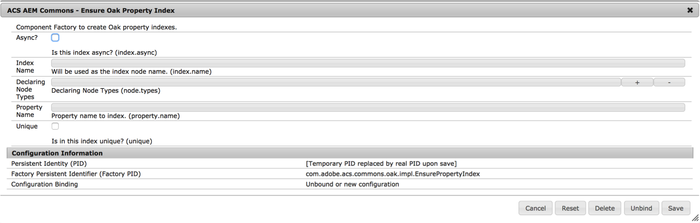

# Oak-Abfragen und Indizierung{#oak-queries-and-indexing}

>[!NOTE]
>
>In diesem Artikel wird die Konfiguration von Indizes in AEM 6 beschrieben. Informationen zur besten Vorgehensweise beim Optimieren von Abfragen- und Indizierungsleistung finden Sie unter [Best Practices für Abfragen und Indizierung](/help/sites-deploying/best-practices-for-queries-and-indexing.md).

## Einführung {#introduction}

Anders als bei Jackrabbit 2 wird Inhalt in Oak nicht standardmäßig indiziert. Indizes müssen daher bei Bedarf vom Benutzer erstellt werden, ähnlich wie bei herkömmlichen relationalen Datenbanken. Falls für eine spezifische Abfrage kein Index vorhanden ist, werden möglicherweise viele Knoten durchsucht. Die Abfrage kann zwar erfolgreich sein, wird jedoch sehr langsam verarbeitet.

Falls Oak eine nicht indizierte Abfrage findet, wird eine Protokollmeldung der Stufe WARNUNG ausgegeben:

```xml
*WARN* Traversed 1000 nodes with filter Filter(query=select ...) consider creating an index or changing the query
```

## Unterstützte Abfragesprachen {#supported-query-languages}

Die Abfrage-Engine von Oak unterstützt folgende Sprachen:

* XPath (empfohlen)
* SQL-2
* SQL (veraltet)
* JQOM

## Indexer-Typen und Kostenberechnung  {#indexer-types-and-cost-calculation}

Beim auf Apache Oak basierenden Backend können mehrere Indexer als Plug-in für das Repository verwendet werden.

Ein Indexer ist der **Eigenschaften-Index**, dessen Indexdefinition im Repository gespeichert wird.

Implementierungen für **Apache Lucene** und **Solr** sind ebenfalls standardmäßig verfügbar und unterstützen die Volltextindizierung.

Der **Traversal-Index** wird verwendet, wenn kein anderer Indexer verfügbar ist. Dies bedeutet, dass der Inhalt nicht indiziert ist und Inhaltsknoten durchsucht werden, um Übereinstimmungen mit der Abfrage zu finden.

Wenn mehrere Indexer für eine Abfrage verfügbar sind, berechnet jeder verfügbare Indexer die voraussichtlichen Kosten für das Ausführen der Abfrage. Oak wählt dann den Indexer mit den niedrigsten geschätzten Kosten aus.


Das obige Diagramm ist eine Übersicht über den Abfragevorgang von Apache Oak.

Zuerst wird die Abfrage in eine abstrakte Syntaxstruktur analysiert. Dann wird die Abfrage überprüft und in SQL-2, die native Sprache für Oak-Abfragen, umgewandelt.

Im nächsten Schritt werden von jedem Index die voraussichtlichen Kosten für die Abfrage berechnet. Anschließend werden die Ergebnisse des billigsten Index abgerufen. Diese Ergebnisse werden gefiltert, um sicherzustellen, dass der aktuelle Benutzer Schreibzugriff auf diese hat und sie mit der abgeschlossenen Abfrage übereinstimmen.

## Konfigurieren der Indizes  {#configuring-the-indexes}

>[!NOTE]
>
>Bei einem großen Repository ist das Erstellen eines Indexes ein zeitaufwendiger Vorgang. Dies gilt sowohl für das erstmalige Erstellen des Index als auch für eine Neuindizierung (Neuerstellung des Index nach einer Änderung der Definition). Siehe auch [Fehlerbehebung bei Oak-Indizes](/help/sites-deploying/troubleshooting-oak-indexes.md) und [Langsame Neuindizierung verhindern](/help/sites-deploying/troubleshooting-oak-indexes.md#preventing-slow-re-indexing).

Wenn sehr große Repositorys neu indiziert werden müssen, insbesondere wenn MongoDB verwendet wird und eine Volltextindizierung erforderlich ist, empfiehlt es sich gegebenenfalls, eine Textvorextraktion durchzuführen und den Ausgangsindex mit Oak-run zu erstellen und anschließend eine Neuindizierung durchzuführen. 

Indizes sind im Repository als Knoten unter dem Knoten **oak:index** konfiguriert.

Der Typ des Indexknotens muss **oak:QueryIndexDefinition lauten.** Für jeden Indexer sind diverse Konfigurationsoptionen als Knoteneigenschaften verfügbar. Weitere Informationen finden Sie in den Konfigurationsdetails für jeden Indexer-Typ unten.

### Der Eigenschaften-Index  {#the-property-index}

Der Eigenschaften-Index ist für Abfragen mit Eigenschaftenbeschränkungen und ohne Volltext geeignet. Der Index kann wie folgt konfiguriert werden:

1. Öffnen Sie CRXDE unter `http://localhost:4502/crx/de/index.jsp`
1. Erstellen Sie einen neuen Knoten unter **oak:index**.
1. Nennen Sie den Knoten **PropertyIndex** und legen Sie als Knotentyp **oak:QueryIndexDefinition** fest.
1. Legen Sie die folgenden Eigenschaften für den neuen Knoten fest:

   * **type:**  `property` (vom Typ String)
   * **propertyNames:**  `jcr:uuid` (vom Typ Name)

   Bei diesem Beispiel wird die Eigenschaft `jcr:uuid` indiziert, die dazu dient, die UUID (Universally Unique Identifier) des verknüpften Knotens anzuzeigen.

1. Speichern Sie die Änderungen.

Beim Eigenschaften-Index sind folgende Konfigurationsoptionen verfügbar:

* Die Eigenschaft **type** gibt den Indextyp an und muss in diesem Fall **property** lauten.

* Die Eigenschaft **propertyNames** gibt eine Liste der Eigenschaften an, die im Index gespeichert werden. Falls diese Eigenschaft fehlt, wird der Knotenname als Referenzwert des Eigenschaftennamen verwendet. In diesem Beispiel dient die Eigenschaft **jcr:uuid** dazu, die UUID (Universally Unique Identifier) des verknüpften Knotens anzuzeigen.

* Falls für die Kennzeichnung **unique** der Wert **true** festgelegt ist, wird dadurch eine Eindeutigkeitsbeschränkung auf den Eigenschaften-Index angewendet.

* Mit der Eigenschaft **declaringNodeTypes** können Sie einen bestimmten Knotentyp angeben, der für den Index gilt.
* Falls für die Kennzeichnung **reindex** der Wert **true** festgelegt ist, wird eine vollständige Neuindizierung des Inhalts ausgelöst.

### Der geordnete Index  {#the-ordered-index}

Der geordnete Index ist eine Erweiterung des Eigenschaften-Index. Er ist allerdings veraltet. Indizes dieses Typs müssen durch den [Lucene-Eigenschaftenindex](#the-lucene-property-index) ersetzt werden.

### Der Lucene-Volltext-Index {#the-lucene-full-text-index}

AEM 6 beinhaltet einen auf Apache Lucene basierten Indexer.

Falls ein Volltext-Index konfiguriert ist, wird dieser für alle Abfragen mit Volltext-Bedingung verwendet, unabhängig davon, ob andere indizierte Bedingungen gelten oder ob eine Pfadbeschränkung besteht.

Falls kein Volltext-Index konfiguriert ist, werden Abfragen mit Volltext-Bedingungen nicht wie erwartet verarbeitet.

Da der Index über einen asynchronen Hintergrund-Thread aktualisiert wird, sind bestimmte Volltext-Suchen für einen kurzen Zeitraum nicht verfügbar, bis die Prozesse im Hintergrund beendet sind.

Sie können einen Lucene-Volltext-Index wie folgt konfigurieren:

1. Öffnen Sie CRXDE und erstellen Sie einen neuen Knoten unter **oak:index**.
1. Nennen Sie den Knoten **LuceneIndex** und legen Sie als Knotentyp **oak:QueryIndexDefinition** fest.
1. Fügen Sie dem Knoten  folgende Eigenschaften hinzu:

   * **type:**  `lucene` (vom Typ String)
   * **async:**  `async` (vom Typ String)

1. Speichern Sie die Änderungen.

Für den Lucene-Index sind folgende Konfigurationsoptionen verfügbar:

* Für die Eigenschaft **type**, die den Indextyp angibt, muss **lucene** festgelegt sein.
* Für die Eigenschaft **async** muss **async** festgelegt sein. Dadurch wird die Index-Aktualisierung an einen Hintergrund-Thread gesendet.
* Die Eigenschaft **includePropertyTypes**, die angibt, welche Untermenge an Eigenschaftentypen im Index enthalten sind.
* Die **excludePropertyNames**-Eigenschaft, die eine Liste von Eigenschaftsnamen definiert - Eigenschaften, die aus dem Index ausgeschlossen werden sollen.
* Die Kennzeichnung **reindex**, die eine vollständige Neuindizierung von Inhalt auslöst, wenn für sie **true** festgelegt ist.

### Der Lucene-Eigenschaften-Index  {#the-lucene-property-index}

Ab **Oak 1.0.8** kann Lucene zum Erstellen von Indizes mit Eigenschaftenbeschränkungen ohne Volltext verwendet werden.

Um einen Lucene-Eigenschaften-Index zu erhalten, muss für die Eigenschaft **fulltextEnabled** immer „false“ festgelegt sein.

Sehen wir uns folgende Beispielabfrage an: 

```xml
select * from [nt:base] where [alias] = '/admin'
```

Um einen Lucene-Eigenschaften-Index für die obige Abfrage zu definieren, können Sie folgende Definition hinzufügen, indem Sie unter **oak:index:** einen neuen Knoten erstellen.

* **Name:** `LucenePropertyIndex`
* **Typ:** `oak:QueryIndexDefinition`

Sobald der Knoten erstellt wurde, fügen Sie die folgenden Eigenschaften hinzu:

* **type:**

   ```
   lucene (of type String)
   ```

* **asynchron:**

   ```
   async (of type String)
   ```

* **fulltextEnabled:**

   ```
   false (of type Boolean)
   ```

* **includePropertyNames:** `["alias"] (of type String)`

>[!NOTE]
>
>Verglichen mit dem normalen Eigenschaften-Index ist der Lucene-Eigenschaften-Index immer im asynchronen Modus konfiguriert. Daher entsprechen die vom Index ausgegebenen Ergebnisse möglicherweise nicht immer dem aktuellen Stand des Repositorys.

>[!NOTE]
>
>Weitere Informationen zum Lucene-Eigenschaften-Index finden Sie auf der Dokumentationsseite zu [Apache Jackrabbit Oak Lucene](https://jackrabbit.apache.org/oak/docs/query/lucene.html).

### Lucene-Analyzer {#lucene-analyzers}

Ab Version 1.2.0 unterstützt Oak Lucene-Analyzer.

Analyzer werden zum Indizieren von Dokumenten und für Abfragen verwendet. Ein Analyzer überprüft den Text von Feldern und generiert einen Token-Stream. Lucene-Analyzer beinhalten eine Reihe von Tokenizern und Filterklassen.

Die Analyzer können über den Knoten `analyzers` (vom Typ `nt:unstructured`) innerhalb der Definition `oak:index` konfiguriert werden.

Der Standard-Analyzer für einen Index wird im untergeordneten Knoten `default` des Analyzer-Knotens konfiguriert.


>[!NOTE]
>
>Eine Liste der verfügbaren Analyzer finden Sie in der API-Dokumentation der Lucene-Version, die Sie verwenden.

#### Direktes Festlegen der Analyzer-Klasse  {#specifying-the-analyzer-class-directly}

Falls Sie einen vorkonfigurierten Analyzer verwenden möchten, können Sie diesen wie folgt konfigurieren:

1. Suchen Sie im Knoten `oak:index` nach dem Index, mit dem Sie den Analyzer verwenden möchten.

1. Erstellen Sie unter dem Index einen untergeordneten Knoten mit dem Namen `default` des Typs `nt:unstructured`.

1. Fügen Sie dem Knoten „default“ eine Eigenschaft mit folgenden Eigenschaften hinzu:

   * **Name:** `class`
   * **Typ:** `String`
   * **Wert:** `org.apache.lucene.analysis.standard.StandardAnalyzer`

   Der Wert ist der Name der Analyzer-Klasse, die Sie verwenden möchten.

   Sie können auch einen Analyzer für eine bestimmte Lucene-Version festlegen, indem Sie die optionale String-Eigenschaft `luceneMatchVersion` verwenden. Eine gültige Syntax für die Verwendung mit Lucene 4.7 sieht wie folgt aus:

   * **Name:** `luceneMatchVersion`
   * **Typ:** `String`
   * **Wert:** `LUCENE_47`

   Wenn `luceneMatchVersion` nicht angegeben ist, verwendet Oak die im Lieferumfang enthaltene Version von Lucene.

1. Wenn Sie eine Stoppwörter-Datei zu Analyzer-Konfigurationen hinzufügen möchten, können Sie einen neuen Knoten unter dem Knoten `default` mit folgenden Eigenschaften erstellen:

   * **Name:** `stopwords`
   * **Typ:** `nt:file`

#### Erstellen von Analyzern durch Komposition {#creating-analyzers-via-composition}

Analyzer können auch basierend auf `Tokenizers`, `TokenFilters` und `CharFilters` zusammengestellt werden. Geben Sie dazu einen Analyzer an und erstellen Sie untergeordnete Knoten der optionalen Tokenizer und Filter, die in der aufgelisteten Reihenfolgen angewendet werden. Siehe auch [https://wiki.apache.org/solr/AnalyzersTokenizersTokenFilters#Specifying_an_Analyzer_in_the_schema](https://wiki.apache.org/solr/AnalyzersTokenizersTokenFilters#Specifying_an_Analyzer_in_the_schema)

Sehen Sie sich diese Knotenstruktur als Beispiel an:

* **Name:** `analyzers`

   * **Name:** `default`

      * **Name:** `charFilters`
      * **Typ:** `nt:unstructured`

         * **Name:** `HTMLStrip`
         * **Name:** `Mapping`
      * **Name:** `tokenizer`

         * **Eigenschaftsname:** `name`

            * **Typ:** `String`
            * **Wert:** `Standard`
      * **Name:** `filters`
      * **Typ:** `nt:unstructured`

         * **Name:** `LowerCase`
         * **Name:** `Stop`

            * **Eigenschaftsname:** `words`

               * **Typ:** `String`
               * **Wert:** `stop1.txt, stop2.txt`
            * **Name:** `stop1.txt`

               * **Typ:** `nt:file`
            * **Name:** `stop2.txt`

               * **Typ:** `nt:file`


Der Name der Filter „charFilters“ und „tokenizers“ wird durch Entfernen der Factory-Suffixe gebildet. Das heißt:

* `org.apache.lucene.analysis.standard.StandardTokenizerFactory` wird  `standard`

* `org.apache.lucene.analysis.charfilter.MappingCharFilterFactory` wird  `Mapping`

* `org.apache.lucene.analysis.core.StopFilterFactory` wird  `Stop`

Jeder für die Factory erforderliche Konfigurationsparameter wird als Eigenschaft des betreffenden Codes angegeben.

In Fällen wie beim Laden von Stoppwörtern, bei denen Inhalt aus externem Dateien geladen werden muss, kann der Inhalt als untergeordneter Knoten vom Typ `nt:file` für die betroffene Datei bereitgestellt werden.

### Der Solr-Index {#the-solr-index}

Der Solr-Index dient der Volltextsuche. Er kann jedoch auch für die Index-Suche nach Pfad, Eigenschaften- und Primärtyp-Beschränkungen verwendet werden. Der Solr-Index kann also in Oak für praktisch jeden Typ von JCR-Abfrage eingesetzt werden.

Die Integration in AEM erfolgt auf Repository-Ebene, damit Solr als möglicher Index in Oak, der neuen mit AEM ausgelieferten Repository-Implementierung, verwendet werden kann.

Die Konfiguration als in die AEM-Instanz eingebetteter Server oder als Remote-Server ist möglich.

### Konfigurieren von AEM mit einem eingebetteten Solr-Server  {#configuring-aem-with-an-embedded-solr-server}

>[!CAUTION]
>
>Verwenden Sie in einer Produktionsumgebung keinen eingebetteten Solr-Server. Dieser sollte nur in einer Entwicklungsumgebung verwendet werden.

AEM kann mit einem eingebetteten, über die Web-Konsole konfigurierten Solr-Server verwendet werden. In diesem Fall wird der Solr-Server in derselben JVM ausgeführt wie die AEM-Instanz, in die er eingebettet ist.

Sie können den eingebetteten Solr-Server wie folgt konfigurieren:

1. Wechseln zur Webkonsole unter `https://serveraddress:4502/system/console/configMgr`
1. Suchen Sie nach **Oak Solr server provider**.
1. Klicken Sie auf die Schaltfläche zum Bearbeiten und legen Sie im nächsten Fenster in der Dropdown-Liste den Servertyp als **Embedded Solr** fest.

1. Bearbeiten Sie dann **Oak Solr embedded server configuration** und erstellen Sie eine Konfiguration. Weitere Informationen zu den Konfigurationsoptionen finden Sie auf der [Apache Solr-Website](https://lucene.apache.org/solr/documentation.html).

   >[!NOTE]
   >
   >Die Konfiguration des Solr-Basisverzeichnisses (solr.home.path) sucht nach einem Ordner mit demselben Namen im AEM-Installationsordner.

1. Öffnen Sie CRXDE und melden Sie sich mit „Admin“ an.
1. Fügen Sie einen Knoten **solrlndex** vom Typ **oak:QueryIndexDefinition** unter **oak:index** mit folgenden Eigenschaften hinzu:

   * **type:** `solr`(vom Typ String)
   * **async:** `async`(vom Typ String)
   * **reindex:** `true`(vom Typ Boolean)

1. Speichern Sie die Änderungen.

### Konfigurieren von AEM mit einem einzelnen Remote-Solr-Server  {#configuring-aem-with-a-single-remote-solr-server}

AEM kann auch mit einer remoten Solr-Server-Instanz konfiguriert werden:

1. Laden Sie die neueste Version von Solr herunter und extrahieren Sie diese. Weitere Informationen zur Vorgehensweise finden Sie in der Dokumentation zur [Apache Solr-Installation](https://cwiki.apache.org/confluence/display/solr/Installing+Solr).
1. Erstellen Sie zwei Solr-Shards. Erstellen Sie dazu Ordner für jedes Shard in dem Ordner, in den Solr entpackt wurde:

   * Erstellen Sie für das erste Shard folgenden Ordner:

   `<solrunpackdirectory>\aemsolr1\node1`

   * Erstellen Sie für das zweite Shard folgenden Ordner: 

   `<solrunpackdirectory>\aemsolr2\node2`

1. Suchen Sie die Beispiel-Instanz im Solr-Paket. Sie befindet sich in der Regel im Ordner `example` im Stammverzeichnis des Pakets.
1. Kopieren Sie die folgenden Ordner aus der Beispielinstanz in die beiden Freigabeordner ( `aemsolr1\node1` und `aemsolr2\node2`):

   * `contexts`
   * `etc`
   * `lib`
   * `resources`
   * `scripts`
   * `solr-webapp`
   * `webapps`
   * `start.jar`

1. Erstellen Sie in jedem der beiden Shard-Ordner einen neuen Ordner mit dem Namen `cfg`.
1. Speichern Sie die Solr- und ZooKeeper-Konfigurationsdateien in den neu erstellten `cfg`-Ordnern.

   >[!NOTE]
   >
   >Weitere Informationen zur Solr- und ZooKeeper-Konfiguration finden Sie in der Dokumentation zur [Solr-Konfiguration](https://wiki.apache.org/solr/ConfiguringSolr) bzw. im [ZooKeeper-Handbuch „Erste Schritte“](https://zookeeper.apache.org/doc/r3.1.2/zookeeperStarted.html).

1. Starten Sie den ersten Shard mit ZooKeeper-Unterstützung, indem Sie zu `aemsolr1\node1` wechseln und folgenden Befehl ausführen:

   ```xml
   java -Xmx2g -Dbootstrap_confdir=./cfg/oak/conf -Dcollection.configName=myconf -DzkRun -DnumShards=2 -jar start.jar
   ```

1. Starten Sie den zweiten Shard, indem Sie zu `aemsolr2\node2` wechseln und folgenden Befehl ausführen:

   ```xml
   java -Xmx2g -Djetty.port=7574 -DzkHost=localhost:9983 -jar start.jar
   ```

1. Wenn Sie beide Shards gestartet haben, testen Sie die ordnungsgemäße Funktion, indem Sie eine Verbindung zur Solr-Schnittstelle unter `http://localhost:8983/solr/#/` /#/ herstellen.
1. Beginn AEM und wechseln Sie zur Web-Konsole unter `http://localhost:4502/system/console/configMgr`
1. Legen Sie folgende Konfiguration unter **Oak Solr remote server configuration** fest:

   * Solr HTTP-URL: `http://localhost:8983/solr/`

1. Wählen Sie **Remote Solr** in der Dropdown-Liste unter dem Serveranbieter **Oak Solr** aus.

1. Wechseln Sie zu CRXDE und melden Sie sich mit „Admin“ an.
1. Erstellen Sie einen neuen Knoten mit dem Namen **solrIndex** unter **oak:index** und legen Sie folgende Eigenschaften fest:

   * **type:** solr (vom Typ „String“)
   * **async:** async (vom Typ „String“)
   * **reindex:** true (vom Typ „Boolean“)

1. Speichern Sie die Änderungen.

#### Empfohlene Konfiguration für Solr  {#recommended-configuration-for-solr}

Unten sehen Sie ein Beispiel für eine Grundkonfiguration, die mit allen drei Solr-Bereitstellungen verwendet werden kann, die in diesem Artikel beschrieben sind. Diese Konfiguration basiert auf den dedizierten Eigenschaften-Indizes, die bereits in AEM vorhanden sind, und sollte nicht mit anderen Anwendungen verwendet werden.

Für die richtige Verwendung müssen Sie die Inhalte im Archiv direkt im Solr-Basisverzeichnis speichern. Bei Bereitstellungen mit mehreren Knoten muss der Inhalt direkt in den Stammorder der einzelnen Knoten gespeichert werden.

Empfohlene Solr-Konfigurationsdateien

[Datei laden](assets/recommended-conf.zip)

### AEM-Indizierungs-Tools {#aem-indexing-tools}

In AEM 6.1 sind auch zwei Indizierungs-Tools aus AEM 6.0 integriert, die Teil der Adobe Consulting Services Commons-Tools sind:

1. **Explain Query**: ein Tool, das Administratoren, das Verständnis erleichtert, wie Abfragen ausgeführt werden.
1. **Oak Index Manager**: eine Web-Benutzeroberfläche zur Pflege vorhandener Indizes.

Sie können diese Tools aufrufen, indem Sie vom AEM-Begrüßungsbildschirm zu **Tools > Vorgänge > Dashboard > Diagnose** navigieren.

Weitere Informationen zur Verwendung der Tools finden Sie in der Dokumentation zum [Vorgangs-Dashboard](/help/sites-administering/operations-dashboard.md).

#### Erstellen von Eigenschaften-Indizes über OSGi  {#creating-property-indexes-via-osgi}

Das ACS Commons-Paket enthält auch OSGi-Konfigurationen, die zum Erstellen von Eigenschaften-Indizes verwendet werden können.

Sie können über die Web-Konsole darauf zugreifen, indem Sie nach „**Ensure Oak Property Index**“ suchen.



### Fehlerbehebung bei Indizierungsproblemen {#troubleshooting-indexing-issues}

Unter Umständen dauert die Ausführung von Abfragen sehr lange und die allgemeine Systemreaktion ist langsam.

In diesem Abschnitt werden einige Empfehlungen gegeben, wie Sie vorgehen sollten, um die Ursache dieser Probleme zu finden und diese zu beheben.

#### Vorbereiten von Debugging-Informationen für die Analyse {#preparing-debugging-info-for-analysis}

Am einfachsten erhalten Sie die erforderlichen Informationen zu der ausgeführten Abfrage anhand des [Explain Query-Tools](/help/sites-administering/operations-dashboard.md#explain-query). Mit diesem Tool können Sie genaue Informationen zum Debuggen einer langsamen Abfrage erfassen, ohne Protokolldaten einsehen zu müssen. Dies ist hilfreich, wenn Sie wissen, welche Abfrage debuggt werden soll.

Falls dies aus irgendeinem Grund nicht möglich ist, können Sie die Indizierungsprotokolle in einer Datei zusammenfassen und diese zum Beheben des spezifischen Problems verwenden.

#### Aktivieren der Protokollierung  {#enable-logging}

Um die Protokollierung zu aktivieren, müssen Sie Protokolle auf **DEBUG**-Ebene für die Kategorien aktivieren, die für Oak-Indizierung und -Abfragen gelten. Diese Kategorien sind: 

* org.apache.jackrabbit.oak.plugins.index
* org.apache.jackrabbit.oak.query
* com.day.cq.search

Die Kategorie **com.day.cq.search** gilt nur, wenn Sie das von AEM bereitgestellte QueryBuilder-Dienstprogramm verwenden.

>[!NOTE]
>
>Es ist wichtig, für Protokolle nur für die Dauer der problematischen Abfrage, die Sie debuggen, DEBUG festzulegen, da andernfalls über einen längeren Zeitraum sehr viele Ereignisse in den Protokollen erzeugt werden. Daher sollten Sie, sobald Sie die erforderlichen Protokolle erfasst haben, für die Protokollierung der oben genannten Kategorien wieder INFO festlegen.

Sie können die Protokollierung wie folgt aktivieren:

1. Verweisen Sie Ihren Browser auf `https://serveraddress:port/system/console/slinglog`
1. Klicken Sie auf die Schaltfläche **Neue Protokollierung hinzufügen** unten in der Konsole.
1. Fügen Sie die oben genannten Kategorien in der neu erstellten Reihe hinzu. Verwenden Sie das **+**-Symbol, um einer Protokollierung mehr als eine Kategorie hinzuzufügen. 
1. Wählen Sie **DEBUG** aus der Dropdown-Liste **Protokollebene** aus.
1. Legen Sie die Ausgabedatei auf `logs/queryDebug.log` fest. Dadurch werden alle DEBUG-Ereignisse in einer Protokolldatei zusammengefasst.
1. Führen Sie die Abfrage aus oder geben Sie die Seite aus, auf der die Abfrage verwendet wird, die Sie debuggen möchten.
1. Wenn Sie die Abfrage ausgeführt haben, wechseln Sie zurück zur Protokollierungskonsole und ändern Sie die Protokollierungsebene der neu erstellten Protokollierung in **INFO**.

#### Indexkonfiguration {#index-configuration}

Ausschlaggebend für die Bewertung einer Abfrage ist die Indexkonfiguration. Es ist wichtig, die Indexkonfiguration abzurufen, um diese zu analysieren oder an den Support zu senden. Sie können die Konfiguration als Inhaltspaket oder als JSON-Ausgabe abrufen.

Da die Indexierungskonfiguration in den meisten Fällen unter dem Knoten `/oak:index` in CRXDE gespeichert wird, können Sie die JSON-Version abrufen unter:

`https://serveraddress:port/oak:index.tidy.-1.json`

Falls sich die Indexkonfiguration an einem anderen Speicherort befindet, ändern Sie den Pfad entsprechend.

#### MBean-Ausgabe  {#mbean-output}

In einigen Fällen ist es hilfreich, die Ausgabe Index-spezifischer MBeans für das Debuggen bereitzustellen. Gehen Sie dazu wie folgt vor:

1. Wechseln Sie zur JMX-Konsole unter:
   `https://serveraddress:port/system/console/jmx`

1. Suchen Sie nach folgenden MBeans:

   * Lucene Index statistics
   * CopyOnRead support statistics
   * Oak Query Statistics
   * IndexStats

1. Klicken Sie auf die einzelnen MBeans, um die Leistungsstatistiken anzuzeigen. Erstellen Sie einen Screenshot oder halten Sie die Daten fest, falls Sie diese an den Support weitergeben müssen.

Sie können auch die JSON-Version dieser Statistiken unter folgenden URLs abrufen:

* `https://serveraddress:port/system/sling/monitoring/mbeans/org/apache/jackrabbit/oak/%2522LuceneIndex%2522.tidy.-1.json`
* `https://serveraddress:port/system/sling/monitoring/mbeans/org/apache/jackrabbit/oak/%2522LuceneIndex%2522.tidy.-1.json`
* `https://serveraddress:port/system/sling/monitoring/mbeans/org/apache/jackrabbit/oak/%2522LuceneIndex%2522.tidy.-1.json`
* `https://serveraddress:port/system/sling/monitoring/mbeans/org/apache/jackrabbit/oak/%2522LuceneIndex%2522.tidy.-1.json`

Sie können auch eine konsolidierte JMX-Ausgabe über `https://serveraddress:port/system/sling/monitoring/mbeans/org/apache/jackrabbit/oak.tidy.3.json` bereitstellen. Hierdurch werden alle Oak-spezifischen MBean-Details im JSON-Format erfasst.

#### Weitere Details {#other-details}

Sie können zusätzliche Informationen sammeln, die die Problembehebung erleichtern können, zum Beispiel:

1. Die Oak-Version, auf der Ihre Instanz ausgeführt wird. Öffnen Sie dazu CRXDE. Die Version wird unten rechts auf der Begrüßungsseite anzeigt. Sie können die Version auch im `org.apache.jackrabbit.oak-core`-Bundle überprüfen.
1. Die Ausgabe des QueryBuilder-Debugger zu der problematischen Abfrage. Der Debugger kann unter folgender Adresse aufgerufen werden: `https://serveraddress:port/libs/cq/search/content/querydebug.html`

