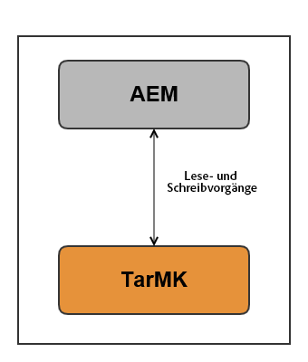
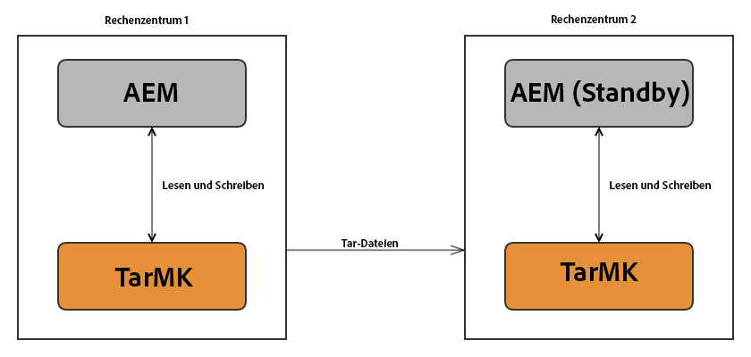
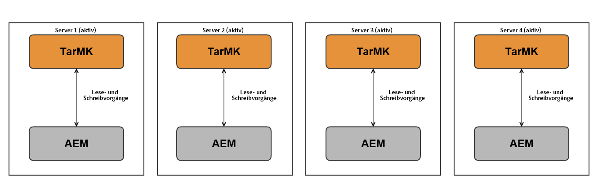
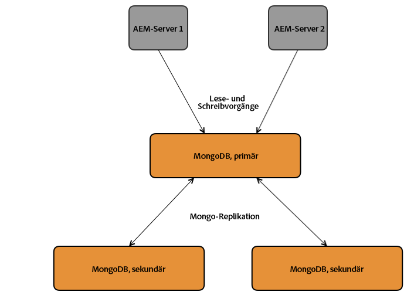
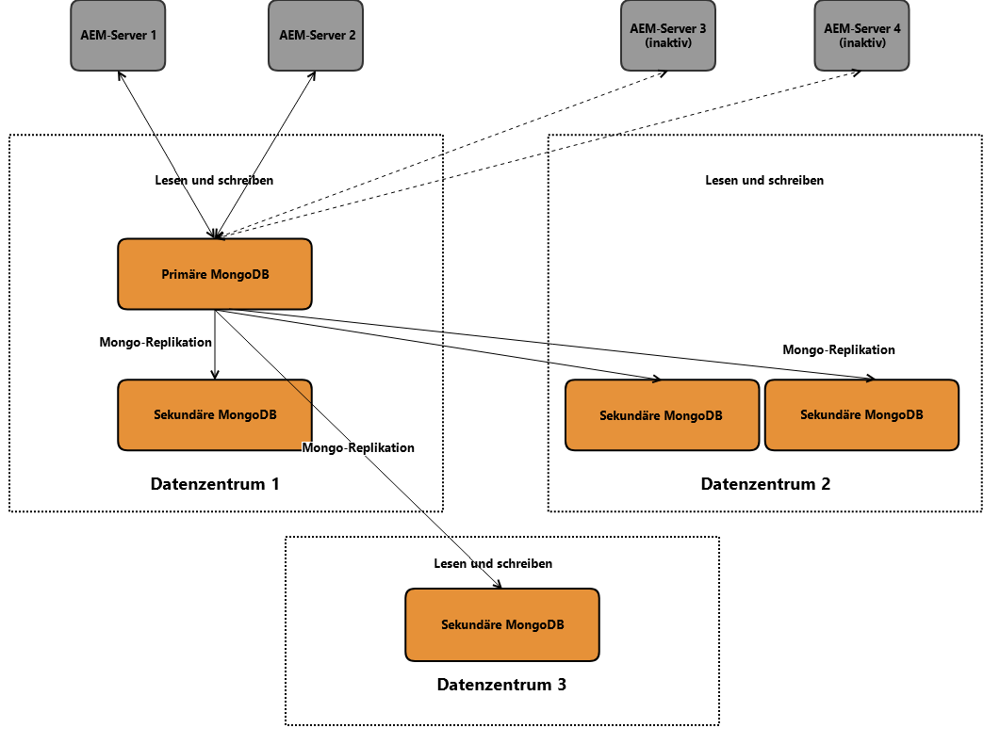
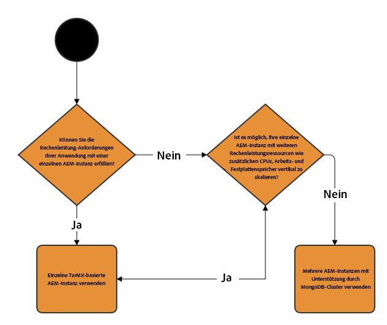
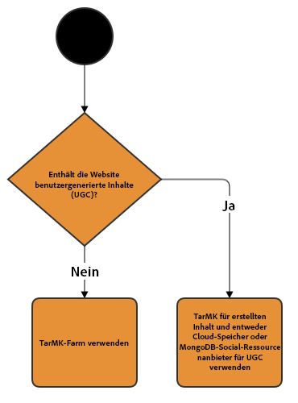

# Empfohlene Bereitstellungen{#recommended-deployments}

>[!NOTE]
>
>Diese Seite beschreibt empfohlene Topologien für AEM. Weitere Informationen zu Clustering-Funktionen und zum Konfigurieren derselben finden Sie in der [Apache Sling-Dokumentation zur Discovery-API](https://sling.apache.org/documentation/bundles/discovery-api-and-impl.html) (in englischer Sprache).

MicroKernels dienen als Persistenzmanager ab AEM 6.2. Die Auswahl eines Persistenzmanagers hängt vom Zweck Ihrer Instanz und vom geplanten Bereitstellungstyp ab.

Die nachfolgenden Beispiele sollen ihre empfohlene Verwendung in den gängigsten AEM-Konfigurationen veranschaulichen.

## Bereitstellungsszenarien  {#deployment-scenarios}

### Einzelne TarMK-Instanz {#single-tarmk-instance}

In diesem Szenario wird eine TarMK-Instanz auf einem Server ausgeführt.

**Dies ist das Standard-Bereitstellungsszenario für Autoreninstanzen.**

Die Vorteile:

* Benutzerfreundlich
* Einfache Verwaltung
* Gute Leistung

Die Nachteile:

* Nicht über die Grenzen der Serverkapazität hinaus skalierbar
* Keine Failover-Kapazität

### TarMK-Cold-Standby {#tarmk-cold-standby}

Eine TarMK-Instanz fungiert als primäre Instanz. Das Repository der primären Instanz wird auf einem Standby-Failover-System repliziert.

Der Cold-Standby-Mechanismus kann auch als Sicherungsmechanismus verwendet werden, da das gesamte Repository ständig auf dem Failover-Server repliziert wird. Der Failover-Server wird im Cold-Standby-Modus ausgeführt. Das bedeutet, dass nur der HttpReceiver der Instanz ausgeführt wird.

Die Vorteile:

* Benutzerfreundlichkeit
* Wartbarkeit
* Leistung
* Failover

Die Nachteile:

* Nicht über die Grenzen der Serverkapazität hinaus skalierbar
* Ein Server befindet sich die meiste Zeit im Leerlauf
* Kein automatisches Failover. Eine externe Erkennung ist erforderlich, bevor das Failover-System Anforderungen verarbeiten kann.

>[!NOTE]
>
>Weitere Informationen zum Konfigurieren von TarMK-Cold-Standby in AEM finden Sie in [diesem](/help/sites-deploying/tarmk-cold-standby.md) Artikel.

>[!NOTE]
>
>Für die Cold-Standby-Bereitstellung in diesem TarMK-Beispiel müssen die primäre und die Standby-Instanz separat lizenziert werden, da eine konstante Replikation auf dem Failover-Server stattfindet. Weitere Informationen zur Lizenzierung finden Sie unter [Allgemeine Lizenzbedingungen für Adoben](https://www.adobe.com/de/legal/terms/enterprise-licensing.html).

### TarMK-Farm {#tarmk-farm}

Mehrere Oak-Instanzen werden jeweils mit einer TarMK-Instanz ausgeführt. Die TarMK-Repositorys sind unabhängig voneinander und müssen synchronisiert werden.

Die Synchronisierung der Repositorys wird dadurch erreicht, dass der Autorenserver dieselben Inhalte auf allen Mitgliedern der Farm veröffentlicht. Weitere Informationen finden Sie unter [Replikation](/help/sites-deploying/replication.md).

Für AEM Communities werden benutzergenerierte Inhalte nie repliziert. Weitere Informationen zur Unterstützung von benutzergenerierten Inhalten in einer TarMK-Farm finden Sie unter [Faktoren für AEM Communities](#considerations-for-aem-communities).

**Dies ist das Standard-Bereitstellungsszenario für Veröffentlichungsumgebungen.**

Die Vorteile:

* Leistung
* Skalierbarkeit für Lesezugriff
* Failover

### Oak-Cluster mit MongMK-Failover für hohe Verfügbarkeit in einem einzelnen Rechenzentrum  {#oak-cluster-with-mongomk-failover-for-high-availability-in-a-single-datacenter}

Dieser Ansatz bedeutet, dass mehrere Oak-Instanzen auf ein MongoDB-Replikat in einem einzigen Rechenzentrum zugreifen und so einen aktiv-aktiven Cluster für die AEM-Autorenumgebung erstellen. In MongoDB dienen Replikatgruppen dazu, bei Hardware- oder Netzwerkausfällen für hohe Verfügbarkeit und Redundanz zu sorgen.

Die Vorteile:

* Möglichkeit der horizontalen Skalierung mit neuen AEM-Autoreninstanzen
* Hohe Verfügbarkeit, Redundanz und automatisiertes Failover der Datenebene

Die Nachteile:

* Die Leistung kann in einigen Szenarien geringer sein als mit TarMK.

### Oak-Cluster mit MongoMK-Failover in mehreren Rechenzentren {#oak-cluster-with-mongomk-failover-across-multiple-datacenters}

Dieser Ansatz bedeutet, dass mehrere Oak-Instanzen auf ein MongoDB-Replikat in mehreren Rechenzentren zugreifen und so einen aktiv-aktiven Cluster für die AEM-Autorenumgebung erstellen. Bei mehreren Rechenzentren bietet die MongoDB-Replikation dieselbe hohe Verfügbarkeit und Redundanz sowie jetzt die Möglichkeit, Rechenzentrumsausfälle zu bewältigen.

Die Vorteile:

* Möglichkeit der horizontalen Skalierung mit neuen AEM-Autoreninstanzen
* Hohe Verfügbarkeit, Redundanz und automatisiertes Failover der Datenebene (einschließlich Rechenzentrumsausfälle)

>[!NOTE]
>
>Im obigen Diagramm werden AEM Server 3 und AEM Server 4 mit einem inaktiven Status dargestellt, vorausgesetzt, dass zwischen den AEM Server in Rechenzentrum 2 und dem primären MongoDB-Knoten in Rechenzentrum 1 eine Netzwerklatenz besteht, die höher ist als die Anforderung, die hier [hier](/help/sites-deploying/aem-with-mongodb.md#checklists) beschrieben ist. Wenn die maximale Latenzzeit mit den Anforderungen vereinbar ist, z. B. durch die Verwendung von Verfügbarkeitszonen, können auch die AEM-Server im Rechenzentrum 2 aktiv sein und einen aktiv-aktiven AEM-Cluster über mehrere Rechenzentren hinweg bilden.

>[!NOTE]
>
>Weitere Informationen zu den in diesem Abschnitt beschriebenen MongoDB-Architekturkonzepten finden Sie unter [MongoDB-Replikation](https://docs.mongodb.org/manual/replication/).

## Mikrokernels: Auswahl des zu verwendenden Kernels {#microkernels-which-one-to-use}

Bei der Wahl zwischen den beiden verfügbaren Mikrokerneln muss eine Grundregel berücksichtigt werden: TarMK ist für Leistung konzipiert, während MongoMK für Skalierbarkeit eingesetzt wird.

Mit diesen Entscheidungshilfen können Sie den optimalen Bereitstellungstyp für Ihre Anforderungen bestimmen.

Adobe empfiehlt Kunden dringend, TarMK als Standard-Persistenztechnologie in allen Bereitstellungsszenarien zu verwenden, sowohl für AEM-Autoren- als auch Veröffentlichungsinstanzen, mit Ausnahme der unten beschriebenen Nutzungsszenarien.

### Gründe für den Einsatz von AEM-MongoMK anstatt TarMK auf Autoreninstanzen  {#exceptions-for-choosing-aem-mongomk-over-tarmk-on-author-instances}

Der Hauptgrund dafür, warum anstatt des TarMK der MongoMK als Persistenz-Backend ausgewählt werden sollte, liegt in der horizontalen Skalierung der Instanzen. Das bedeutet, dass immer mindestens zwei aktive Autoreninstanzen ausgeführt werden und MongoDB als Persistenzspeichersystem verwendet wird. Der Grund, warum mehr als eine Autoreninstanz ausgeführt werden muss, besteht im Allgemeinen darin, dass die CPU- und Speicherkapazität eines einzelnen Servers, der alle simultanen Bearbeitungsaktivitäten unterstützt, nicht mehr ausreichend ist.

Es ist quasi unmöglich, vorherzusagen, wie das genau Parallelitätsmodell nach der Live-Schaltung einer neuen Site aussehen wird. Daher empfiehlt Adobe, die folgenden Kriterien zu berücksichtigen, wenn beurteilt wird, ob MongoMK und zwei oder mehr aktive Autorenknoten verwendet werden sollen:

1. Anzahl der benannten, verbundenen Benutzer an einem Tag: Tausende oder mehr.
1. Anzahl der gleichzeitigen Benutzer: Hunderte oder mehr.
1. Volumen der erfassten Assets pro Tag: Hunderttausende oder mehr.
1. Volumen der Seitenbearbeitungen pro Tag: Hunderttausende oder mehr (einschließlich automatisierter Aktualisierungen über Multi Site Manager oder z. B. Nachrichten-Feed-Erfassung).
1. Volumen der Suchvorgänge pro Tag: Zehntausende oder mehr.

>[!NOTE]
>
>Mithilfe von Tough Day kann die Leistung der Kundenanwendung im Kontext der implementierten Hardwarekonfiguration bewertet werden. Weitere Informationen zu diesem Tool finden Sie [hier](/help/sites-developing/tough-day.md).

Eine Mindestbereitstellung mit MongoDB umfasst normalerweise folgende Topologie:

* Eine MongoDB-Replikatgruppe mit einem primären und zwei sekundären Knoten, wobei alle MongoDB-Instanzen in einer Verfügbarkeitszone mit einer Latenz von unter 15 Millisekunden für jeden Knoten ausgeführt werden.
* Ein Cluster von Autoreninstanzen mit einem Leader-Knoten und einem nicht als Leader ausgewiesenen Knoten, die beide immer aktiv sind, wobei alle Autoreninstanzen in jedem Rechenzentrum ausgeführt werden, in dem die primären und sekundären MongoDB-Instanzen laufen.

Darüber hinaus wird dringend empfohlen, den Datenspeicher auf einem freigegebenen Dateisystem oder Amazon S3 so zu konfigurieren, dass die Assets oder Binärdateien nicht in MongoDB gespeichert werden. So wird eine optimale Leistung für die Bereitstellung sichergestellt.

Ein weiterer Vorteil, der sich durch die Bereitstellung einer MongoDB-Replikatgruppe mit einem Cluster von zwei oder mehr Autoreninstanzen ergibt, ist das automatisierte Wiederherstellungsszenario mit minimalen Ausfallzeiten bei einem Ausfall der Autoreninstanzen, MongoDB-Replikatgruppe oder des gesamten Rechenzentrums. Dennoch sollte die Auswahl von MongoMK anstatt TarMK nicht allein durch die Wiederherstellungsanforderungen bestimmt werden, da TarMK ebenfalls eine Lösung mit minimalen Ausfallzeiten und einem gesteuerten Failover-Mechanismus bereitstellen kann.

Werden die obigen Kriterien in den ersten achtzehn Monaten der Bereitstellung voraussichtlich nicht erfüllt, sollte AEM zuerst mithilfe von TarMK bereitgestellt werden. Die Konfiguration sollte dann zu einem späteren Zeitpunkt neu bewertet werden, wenn die obigen Kriterien erfüllt werden, und schließlich sollte bestimmt werden, ob die TarMK-basierte Bereitstellung beibehalten oder eine Migration auf eine MongoMK-basierte Bereitstellung durchgeführt werden soll.

### Gründe für den Einsatz von AEM-MongoMK anstatt -TarMK auf Veröffentlichungsinstanzen  {#exceptions-for-choosing-aem-mongomk-over-tarmk-on-publish-instances}

Die Bereitstellung von MongoMK für Veröffentlichungsinstanzen wird nicht empfohlen. Die Veröffentlichungsschicht der Bereitstellung wird fast immer als Farm mit unabhängigen Veröffentlichungsinstanzen bereitgestellt, auf denen TarMK ausgeführt wird und die durch das Replizieren von Inhalten von den Autoreninstanzen synchronisiert werden. Diese für Veröffentlichnungsinstanzen geeignete Shared-Nothing-Architektur ermöglicht die horizontale, lineare Skalierung der bereitgestellten Veröffentlichungsschicht. Die Farm-Topologie bietet zudem dem Vorteil, dass Aktualisierungen fortlaufend auf Veröffentlichungsinstanzen angewendet werden können, sodass keine Ausfallzeiten bei Änderungen an der Veröffentlichungsschicht anfallen.

Dies gilt nicht für AEM Communities, das MongoMK-Cluster auf der Veröffentlichungsschicht verwendet, wenn mehr als ein Publisher vorhanden ist. Bei Auswahl von JSRP (siehe [Community-Inhaltsspeicher](/help/communities/working-with-srp.md)) wäre ein MongoMK-Cluster angemessen, ebenso wie jeder veröffentlichungsseitige Cluster unabhängig vom ausgewählten MK, z. B. MongoDB oder RDB.

### Voraussetzungen und Empfehlungen für die Bereitstellung von AEM mit MongoMK {#prerequisites-and-recommendations-when-deploying-aem-with-mongomk}

Falls Sie eine MongoMK-Bereitstellung für AEM in Betracht ziehen, liegt eine Reihe von Voraussetzungen und Empfehlungen für AEM vor.

**Obligatorische Voraussetzungen für MongoDB-Bereitstellungen:**

1. Die MongoDB-Bereitstellungsarchitektur und -Dimensionierung muss Teil der Projektimplementierung sein und mit Unterstützung von Adobe Consulting oder MongoDB Architects durchgeführt werden, die mit AEM vertraut sind.
1. Das Partner- oder Kundenteam muss über MongoDB-Expertise verfügen, um eine vorhandene oder neue MongoDB-Umgebung verwalten und warten zu können.
1. Sie können die kostenpflichtige oder die Open-Source-Version von MongoDB (AEM unterstützt beide) implementieren. Sie müssen jedoch einen Wartungs- und Support-Vertrag für MongoDB direkt von MongoDB Inc. erwerben.
1. Im Allgemeinen sollten AEM- und MongoDB-Architekturen und -Infrastrukturen klar definiert und von einem AEM Architect von Adobe validiert sein.
1. Sie müssen das Support-Modell für AEM-Bereitstellungen überprüfen, das MongoDB umfasst.

**Dringende Empfehlungen für MongoDB-Bereitstellungen:**

* Lesen Sie den [Artikel](https://www.mongodb.com/lp/contact/mongodb-adobe-experience-manager) zu MongoDB für Adobe Experience Manager.
* Gehen Sie die Produktions[prüfliste](https://docs.mongodb.org/manual/administration/production-checklist/) für MongoDB durch.
* Nehmen Sie an einer Zertifizierungsschulung für MongoDB teil, die online [hier](https://university.mongodb.com/) verfügbar ist.

>[!NOTE]
>
>Wenn Sie weitere Fragen zu diesen Richtlinien, Voraussetzungen und Empfehlungen haben, wenden Sie sich an den [Kundendienst von Adobe](https://helpx.adobe.com/de/marketing-cloud/contact-support.html).

### Faktoren für AEM Communities  {#considerations-for-aem-communities}

Bei Sites, bei denen die Bereitstellung von [AEM Communities](/help/communities/overview.md) geplant ist, wird empfohlen, [eine Bereitstellung auszuwählen](/help/communities/working-with-srp.md#characteristicsofstorageoptions), die für die Verarbeitung von benutzergenerierten Inhalten optimiert ist, welche von Community-Mitgliedern von der Veröffentlichungsumgebung aus veröffentlicht werden.

Durch die Verwendung eines [Common Store](/help/communities/working-with-srp.md) müssen benutzergenerierte Inhalte nicht zwischen Autoren- und anderen Veröffentlichungsinstanzen repliziert werden, um einen konsistenten Blick auf die Inhalte zu erhalten.

Mit den nachfolgenden Entscheidungshilfen können Sie den optimalen Persistenztyp für Ihre Bereitstellung auswählen:

#### Auswahl des Bereitstellungstyps für Autoreninstanzen {#choosing-the-deployment-type-for-author-instances}

#### Auswahl des Bereitstellungstyps für Veröffentlichungsinstanzen {#choosing-the-deployment-type-for-publish-instances}

>[!NOTE]
>
>MongoDB ist eine Drittanbietersoftware und nicht Bestandteil des AEM-Lizenzierungspakets. Weitere Informationen finden Sie auf der Seite mit der [MongoDB-Lizenzierungsrichtlinie](https://www.mongodb.org/about/licensing/).
>
>Adobe empfiehlt die Lizenzierung der MongoDB Enterprise-Version, damit Sie von der professionellen Unterstützung profitieren und die AEM-Bereitstellung optimal nutzen können.
>
>Die Lizenz umfasst eine Standard-Replikatgruppe. Diese besteht aus einer primären und zwei sekundären Instanzen, die für die Autoren- oder Veröffentlichungsbereitstellungen verwendet werden können.
>
>Falls Sie die Autoren- und Veröffentlichungsbereitstellung von MongoDB ausführen möchten, müssen zwei separate Lizenzen erworben werden.
>
>Weitere Informationen finden Sie auf der Seite für [MongoDB für Adobe Experience Manager](https://www.mongodb.com/lp/contact/mongodb-adobe-experience-manager).
