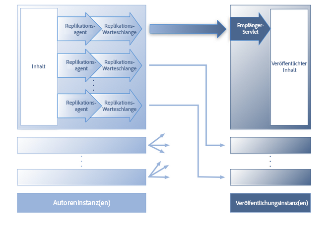
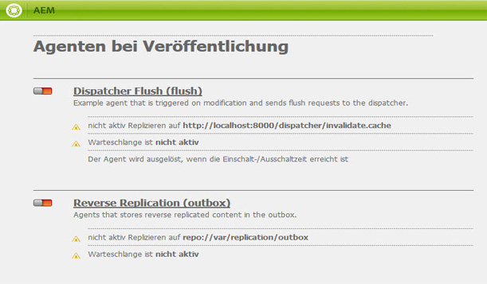
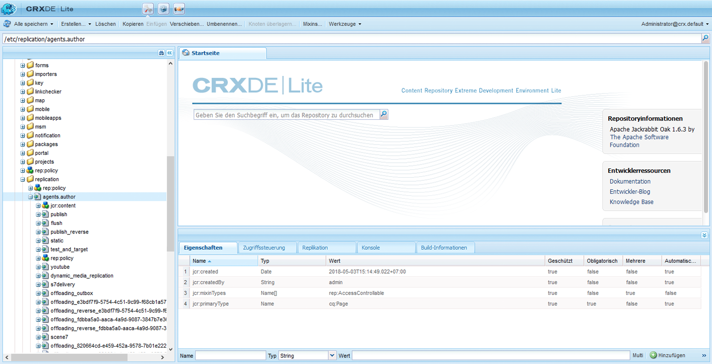
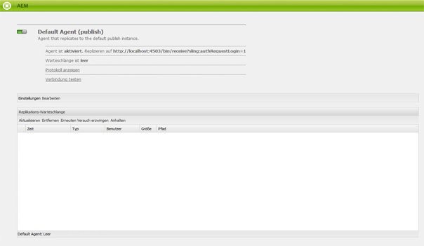
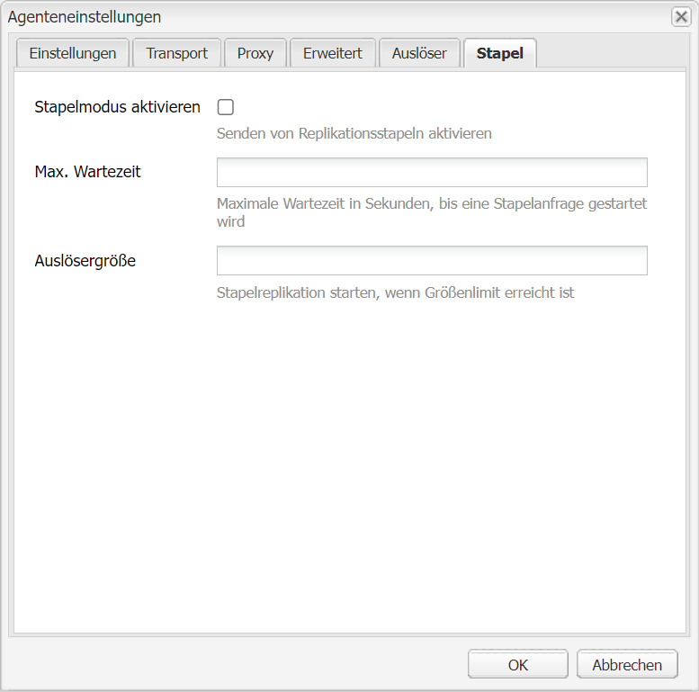

# Replikation{#replication}

Replikationsagenten bilden einen zentralen Bestandteil von Adobe Experience Manager (AEM). Sie dienen als Mechanismus zum:

* [Veröffentlichen (Aktivieren)](/help/sites-authoring/publishing-pages.md#activatingcontent) von Inhalten von einer Autoren- in einer Veröffentlichungsumgebung.
* Leeren von Inhalt im Dispatcher-Cache
* Zurückleiten von Benutzereingaben (z. B. Formulareingaben) von der Veröffentlichungs- an die Autorenumgebung (gesteuert von der Autorenumgebung).

Anforderungen werden zur Verarbeitung durch den entsprechenden Agenten in eine [Warteschlange gestellt](/help/sites-deploying/osgi-configuration-settings.md#apacheslingjobeventhandler).

>[!NOTE]
>
>Benutzerdaten (Benutzer, Benutzergruppen und -profile) werden nicht zwischen der Autoren- und der Veröffentlichungsinstanz repliziert.
>
>Bei mehreren Veröffentlichungsinstanzen werden Benutzerdaten mithilfe von Sling verteilt, wenn die [Benutzersynchronisierung](/help/sites-administering/sync.md) aktiviert ist.

## Replizieren von der Autoren- auf der Veröffentlichungsinstanz {#replicating-from-author-to-publish}

Die Replikation auf einer Veröffentlichungsinstanz oder einem Dispatcher verläuft in mehreren Schritten:

* Die Autoreninstanz fordert die Veröffentlichung (Aktivierung) bestimmter Inhalte an. Dabei kann es sich um eine manuelle oder eine automatisch ausgelöste Anforderung handeln, die vorkonfiguriert wurde.
* Die Anforderung wird an den entsprechenden Standard-Replikationsagenten übergeben. Eine Umgebung kann mehrere Standardagenten aufweisen, die immer für diese Aktionen ausgewählt werden.
* Der Replikationsagent „verpackt“ die Inhalte und stellt sie in die Replikations-Warteschlange.
* Auf der Registerkarte „Websites“ wird die [farbige Statusanzeige](/help/sites-authoring/publishing-pages.md#determiningpagepublicationstatus) für die einzelnen Seiten eingestellt.
* Die Inhalte werden aus der Warteschlange abgerufen und mithilfe des konfigurierten Protokolls (in der Regel HTTP) an die Veröffentlichungsumgebung übertragen.
* Ein Servlet in der Veröffentlichungsumgebung empfängt die Anforderung und veröffentlicht die erhaltenen Inhalte. Das Standard-Servlet ist `https://localhost:4503/bin/receive`.

* Es können mehrere Autoren- und Veröffentlichungsumgebungen konfiguriert werden.

### Replizieren von der Veröffentlichungs- auf der Autoreninstanz {#replicating-from-publish-to-author}

Benutzer können eine Reihe von Funktionen zum Eingeben von Daten in einer Veröffentlichungsinstanz nutzen.

In manchen Fällen ist eine bestimmte Form der Replikation erforderlich (die sog. Rückwärtsreplikation), um diese Daten an die Autorenumgebung zurückzuleiten, von wo sie erneut an andere Veröffentlichungsumgebungen verteilt werden. Aus Sicherheitsgründen muss der gesamte Traffic von der Veröffentlichungs- an die Autorenumgebung streng kontrolliert werden.

Die Rückwärtsreplikation nutzt einen Agenten in der Veröffentlichungsumgebung, der die Autorenumgebung referenziert. Dieser Agent legt die Daten in einem Postausgang ab. Diesem Postausgang sind Replikations-Listener in der Autorenumgebung zugeordnet. Die Listener fragen die Postausgänge ab, um darin abgelegte Daten abzurufen und diese dann ggf. zu verteilen. So wird sichergestellt, dass die Autorenumgebung den gesamten Traffic steuert.

In anderen Fällen wie etwa bei Communities-Funktionen (z. B. Foren, Blogs, Kommentare und Rezensionen) ist es schwierig, das hohe Volumen der in die Veröffentlichungsumgebung eingegebenen, benutzergenerierten Inhalte (UGC) mittels Replikation effizient auf allen AEM-Instanzen zu synchronisieren.

AEM [Communities](/help/communities/overview.md) verwendet nie Replizierung für UGC. Stattdessen ist zur Bereitstellung von benutzerdefinierten Inhalten für Communities ein Common Store erforderlich (siehe [Community-Inhaltsspeicher](/help/communities/working-with-srp.md)).

### Replikation – vorkonfiguriert {#replication-out-of-the-box}

Die in einer Standardinstallation von AEM enthaltene Website für den Handel kann zur Veranschaulichung der Replikation verwendet werden.

Um diesem Beispiel zu folgen und die standardmäßigen Replizierungsagenten zu verwenden, müssen Sie AEM[installieren mit:](/help/sites-deploying/deploy.md)

* die Autorenumgebung an Port `4502`
* die Veröffentlichungsumgebung an Port `4503`

>[!NOTE]
>
>Standardmäßig aktiviert:
>
>* Agenten für Autor: Standardagent („publish“)
>
>
Standardmäßig deaktiviert (ab AEM 6.1):
>
>* Agenten beim Autor: Replizierungsagenten umkehren (publish_reverse)
>* Agenten beim Veröffentlichen: Rückwärtsreplikation (Postausgang)

>
>
Der Status des Agenten oder der Warteschlange kann mithilfe der **Tools-Konsole** überprüft werden.
>Weitere Informationen finden Sie unter [Überwachen der Replikationsagenten](#monitoring-your-replication-agents).

#### Replikation (von der Autoren- auf der Veröffentlichungsinstanz) {#replication-author-to-publish}

1. Navigieren Sie zur Support-Seite in der Autorenumgebung.
   **https://localhost:4502/content/we-retail/us/en/experience.html** `<pi>`
1. Bearbeiten Sie die Seite, um neuen Text hinzuzufügen.
1. **Aktivieren Sie die Seite**, um die Änderungen zu veröffentlichen.
1. Öffnen Sie die Support-Seite auf der Umgebung &quot;Veröffentlichen&quot;:
   **https://localhost:4503/content/we-retail/us/en/experience.html**
1. Jetzt können Sie die Änderungen sehen, die Sie in der Autorenumgebung eingegeben haben.

Diese Replikation wird von der Autorenumgebung aus durch folgende Komponenten verarbeitet:

* **Standardagent („publish“)**  Dieser Agent repliziert Inhalte auf der Standard-Veröffentlichungsinstanz.
Die Details dazu (Konfiguration und Protokolle) können über die Tools-Konsole der Autor-Umgebung aufgerufen werden. oder:

   `https://localhost:4502/etc/replication/agents.author/publish.html`.

#### Replikationsagenten – vorkonfiguriert {#replication-agents-out-of-the-box}

Die folgenden Agenten sind in der Standard-AEM-Installation verfügbar:

* [Standardagent](#replication-author-to-publish) Dient zum Replizieren von der Autoren- auf der Veröffentlichungsinstanz.

* Dispatcher Flush Dient zum Verwalten des Dispatcher-Caches. Weitere Informationen finden Sie unter [Invalidierung des Dispatcher-Caches aus der Autorenumgebung](https://helpx.adobe.com/experience-manager/dispatcher/using/page-invalidate.html#invalidating-dispatcher-cache-from-the-authoring-environment) und [Invalidierung des Dispatcher-Caches von einer Veröffentlichungsinstanz](https://helpx.adobe.com/experience-manager/dispatcher/using/page-invalidate.html#invalidating-dispatcher-cache-from-a-publishing-instance).

* [Rückwärtsreplikation](#reverse-replication-publish-to-author) Dient zum Replizieren von der Veröffentlichungs- auf der Autoreninstanz. Die umgekehrte Replizierung wird nicht für Communities-Funktionen wie Foren, Blogs und Kommentare verwendet. Es ist effektiv deaktiviert, da der Postausgang nicht aktiviert ist. Für die Rückwärtsreplikation ist eine benutzerdefinierte Konfiguration erforderlich.

* Statischer Agent
Dies ist ein &quot;Agent, der eine statische Darstellung eines Knotens im Dateisystem speichert&quot;.
Bei den Standardeinstellungen werden z. B. Inhaltsseiten und DAM-Assets unter `/tmp` gespeichert, entweder als HTML oder das entsprechende Asset-Format. Siehe die Registerkarten `Settings` und `Rules` für die Konfiguration.
 Der Grund hierfür war, dass die Inhalte sichtbar sein sollten, wenn die Seite direkt vom Anwendungsserver angefordert wird. Hierbei handelt es sich um einen speziellen Agenten, der (wahrscheinlich) für den Großteil der Instanzen nicht benötigt wird.

## Replikationsagenten – Konfigurationsparameter {#replication-agents-configuration-parameters}

Beim Konfigurieren eines Replikationsagenten in der Tools-Konsole stehen vier Registerkarten zur Verfügung:

### Einstellungen {#settings}

* **Name**

   Ein eindeutiger Name für den Replikationsagenten.

* **Beschreibung**

   Eine Beschreibung des Zwecks des Replikationsagenten.

* **Aktiviert**

   Gibt an, ob der Replikationsagent derzeit aktiviert ist.

   Wenn der Agent **aktiviert** ist, wird der Status der Warteschlange wie folgt angezeigt:

   * **Aktiv**, wenn Elemente verarbeitet werden.
   * **Leer**, wenn die Warteschlange leer ist.
   * **Blockiert**, wenn die Warteschlange Elemente enthält, die jedoch nicht verarbeitet werden können, z. B. wenn die empfangende Warteschlange deaktiviert ist.

* **Anordnungstyp**

   Der Anordnungstyp:

   * **Standard**: Wird festgelegt, wenn der Agent automatisch ausgewählt werden soll.
   * **Dispatcher Flush**: Wählen Sie diese Einstellung aus, wenn der Agent zum Leeren des Dispatcher-Caches verwendet werden soll.

* **Verzögerung wiederh.**

   Die Verzögerung (Wartezeit in Millisekunden zwischen zwei Wiederholungen, wenn ein Problem auftritt.

   Default: `60000`

* **Agenten-Benutzer-ID**

   Abhängig von der Umgebung verwendet der Agent dieses Benutzerkonto, um folgende Aktionen durchzuführen:

   * Erfassen und Verpacken der Inhalte aus der Autorenumgebung
   * Erstellen und Schreiben der Inhalte in der Veröffentlichungsumgebung

   Lassen Sie dieses Feld leer, um das Systembenutzerkonto zu verwenden (das in Sling als Administrator definierte Konto; standardmäßig ist dies das `admin`-Konto).

   >[!CAUTION]
   >
   >Für einen Agenten in der Autorenumgebung *muss* dieses Konto Lesezugriff auf alle Pfade haben, die repliziert werden sollen.

   >[!CAUTION]
   >
   >Für einen Agenten in der Veröffentlichungsumgebung *muss* dieses Konto über die erforderlichen Erstellungs-/Schreibberechtigungen zum Replizieren der Inhalte verfügen.

   >[!NOTE]
   >
   >Dies kann als Mechanismus zum Auswählen bestimmter Inhalte für die Replikation dienen.

* **Protokollebene**

   Gibt den Detaillierungsgrad an, der für Protokollmeldungen verwendet werden soll.

   * `Error`: Nur Fehler werden protokolliert
   * `Info`: Fehler, Warnungen und andere Informationsmeldungen werden protokolliert
   * `Debug`: In den Meldungen wird eine hohe Detailgenauigkeit verwendet, hauptsächlich zu Debugging-Zwecken

   Standard: `Info`

* **Für Rückwärtsreplikation verwenden**

   Gibt an, ob dieser Agent für die Rückwärtsreplikation verwendet wird. Leitet Benutzereingaben von der Veröffentlichungsumgebung an die Autorenumgebung zurück.

* **Alias-Aktualisierung**

   Durch Auswahl dieser Option werden Anforderungen an den Dispatcher zur Invalidierung des Alias- oder Vanity-Pfads aktiviert. Siehe auch [Konfigurieren eines Dispatcher Flush-Agenten](/help/sites-deploying/replication.md#configuring-a-dispatcher-flush-agent).

#### Transport {#transport}

* **URI**

   Gibt das Empfangs-Servlet am Zielspeicherort an. Hier können Sie insbesondere den Hostnamen (oder Alias) und den Kontextpfad zur Zielinstanz angeben.

   Beispiel:

   * Ein Standardagent kann `https://localhost:4503/bin/receive` replizieren
   * Ein Dispatcher-Flush-Agent kann zu `https://localhost:8000/dispatcher/invalidate.cache` replizieren

   Das hier angegebene Protokoll (HTTP oder HTTPS) bestimmt die Transportmethode.

   Bei Dispatcher Flush-Agenten wird die URI-Eigenschaft nur verwendet, wenn Sie pfadbasierte virtualhost-Einträge verwenden, um zwischen Farmen zu unterscheiden. In diesem Feld können Sie die Farm für ungültig erklären. Beispiel: Farm 1 hat den virtuellen Host `www.mysite.com/path1/*` und Farm 2 den virtuellen Host `www.mysite.com/path2/*`. Mit der URL `/path1/invalidate.cache` können Sie die erste Farm und mit `/path2/invalidate.cache` die zweite Farm bestimmen.

* **Benutzer**

   Der Benutzername für das Konto, das zum Zugreifen auf das Ziel verwendet werden soll.

* **Kennwort**

   Der Kennwort für das Konto, das zum Zugreifen auf das Ziel verwendet werden soll.

* **NTLM-Domäne**

   Die Domäne für die NTLM-Authentifizierung.

* **NTLM-Host**

   Der Host für die NTLM-Authentifizierung.

* **Relaxed SSL aktivieren**

   Aktivieren Sie diese Option, wenn selbstzertifizierte SSL-Zertifikate akzeptiert werden sollen.

* **Abgelaufene Zertifikate zulassen**

   Aktivieren Sie diese Option, wenn abgelaufene SSL-Zertifikate akzeptiert werden sollen.

#### Proxy  {#proxy}

Die folgenden Einstellungen müssen nur festgelegt werden, wenn ein Proxy benötigt wird:

* **Proxy-Host**

   Hostname des für den Transport verwendeten Proxys.

* **Proxy-Port**

   Der Proxy-Port.

* **Proxy-Benutzer**

   Der Benutzername des zu verwendenden Kontos.

* **Proxy-Kennwort**

   Der Kennwort des zu verwendenden Kontos.

* **Proxy-NTLM-Domäne**

   Die NTLM-Domäne des Proxys.

* **Proxy-NTLM-Host**

   Die NTLM-Domäne des Proxys.

#### Erweitert  {#extended}

* **Benutzeroberfläche**

   Hier können Sie die Socket-Schnittstelle für die Verbindung definieren.

   Dadurch wird beim Erstellen von Verbindungen die lokale Adresse verwendet. Wurde diese Einstellung nicht festgelegt, wird die Standardadresse verwendet. Dies ist zum Festlegen der Schnittstelle nützlich, die für Multicast- oder geclusterte Systeme verwendet werden soll.

* **HTTP-Methode**

   Die zu verwendende HTTP-Methode.

   Für einen Dispatcher Flush-Agenten ist dies fast immer „GET“ und sollte nicht geändert werden (ein weiterer möglicher Wert ist POST).

* **HTTP-Kopfzeilen**

   Sie werden für Dispatcher Flush-Agenten verwendet und geben Elemente an, die entfernt werden müssen.

   Es sollte nicht notwendig sein, die drei Standardeinträge für einen Dispatcher Flush-Agenten zu ändern:

   * `CQ-Action:{action}`
   * `CQ-Handle:{path}`
   * `CQ-Path:{path}`

   Diese dienen ggf. dazu, die Aktion anzugeben, die beim Leeren des Handles oder Pfades verwendet werden soll. Die Unterparameter sind dynamisch:

   * `{action}` gibt eine Replizierungsaktion an

   * `{path}` gibt einen Pfad an

   Sie werden durch den für die Anforderungen relevanten Pfad bzw. die relevante Aktion ersetzt und müssen deshalb nicht hardcodiert sein:

   >[!NOTE]
   >
   >Wenn Sie AEM in einem anderen als dem empfohlenen Standardkontext installiert haben, müssen Sie den Kontext in den HTTP-Kopfzeilen registrieren. Beispiel:
   >`CQ-Handle:/<*yourContext*>{path}`

* **Verbindung schließen**

   Aktivieren Sie diese Option, um die Verbindung nach jeder Anforderung zu trennen.

* **Verbindungs-Zeitüberschreitung**

   Anzuwendende Zeitüberschreitung (in Millisekunden) beim Versuch, eine Verbindung herzustellen.

* **Socket-Zeitüberschreitung**

   Anzuwendende Zeitüberschreitung (in Millisekunden) beim Warten auf Traffic nach dem Herstellen einer Verbindung.

* **Protokollversion**

   Die Version des Protokolls, z. B. `1.0` für HTTP/1.0.

#### Auslöser {#triggers}

Diese Einstellungen werden verwendet, um Auslöser für die automatisierte Replikation zu definieren:

* **Standard ignorieren**

   Ist diese Option aktiviert, wird der Agent von der normalen Replikation ausgeschlossen, d. h. er wird nicht verwendet, wenn ein Inhaltsautor eine Replikationsaktion ausführt.

* **Bei Modifizierung**

   Hiermit wird automatisch eine Replikation durch diesen Agenten ausgelöst, wenn eine Seite geändert wird. Diese Einstellung wird hauptsächlich für Dispatcher Flush-Agenten aber auch für die Rückwärtsreplikation verwendet.

* **Bei Verteilung**

   Wenn diese Option aktiviert ist, repliziert der Agent automatisch alle Inhalte, die zur Verteilung gekennzeichnet sind, wenn diese geändert werden.

* **Einschaltzeit/Ausschaltzeit erreicht**

   Diese Einstellung löst eine automatische Replikation aus (um eine Seite ggf. zu aktivieren oder zu deaktivieren), wenn die für die Seite definierten Ein- oder Ausschaltzeiten erreicht werden. Sie wird hauptsächlich für Dispatcher Flush-Agenten verwendet.

* **Auf Empfang**

   Ist diese Option aktiviert, führt der Agent eine Kettenreplizierung durch, wenn er Replikationsereignisse erhält.

* **Keine Statusaktualisierung**

   Wenn diese Option aktiviert ist, erzwingt der Agent keine Aktualisierung des Replikationsstatus.

* **Keine Versionierung**

   Ist diese Option aktiviert, erzwingt der Agent keine Versionierung aktivierter Seiten.

## Konfigurieren der Replikationsagenten  {#configuring-your-replication-agents}

Weitere Informationen zum Verbinden von Replikationsagenten mit der Veröffentlichungsinstanz mithilfe von MSSL finden Sie unter [Replizieren mit MSSL](/help/sites-deploying/mssl-replication.md).

### Konfigurieren der Replikationsagenten aus der Autorenumgebung  {#configuring-your-replication-agents-from-the-author-environment}

Auf der Registerkarte „Tools“ der Autorenumgebung können Sie Replikationsagenten konfigurieren, die sich in der Autorenumgebung (**Agenten für Autor**) oder der Veröffentlichungsumgebung (**Agenten bei Veröffentlichung**) befinden. Das nachfolgende Verfahren zeigt das Konfigurieren eines Agenten für die Autorenumgebung. Es kann jedoch für beide Umgebungen verwendet werden.

>[!NOTE]
>
>Wenn ein Dispatcher HTTP-Anforderungen für Autoren- oder Veröffentlichungsinstanzen verarbeitet, muss die HTTP-Anforderung vom Replikationsagenten den Header „PATH“ enthalten. Zusätzlich zur nachfolgenden Vorgehensweise müssen Sie den Header „PATH“ zur Dispatcher-Liste der Client-Header hinzufügen. (Weitere Informationen finden Sie unter [/clientheaders (Client-Header)](https://helpx.adobe.com/experience-manager/dispatcher/using/dispatcher-configuration.html#specifying-the-http-headers-to-pass-through-clientheaders). 

1. Wechseln Sie in AEM zur Registerkarte **Tools**.
1. Klicken Sie auf **Replikation** (linker Fensterbereich, um den Ordner zu öffnen).
1. Doppelklicken Sie auf **Agenten für Autor** (linker oder rechter Fensterbereich).
1. Klicken Sie auf den jeweiligen Agenten (der als Link dargestellt ist), um detaillierte Informationen zu diesem Agenten anzuzeigen.
1. Klicken Sie auf **Bearbeiten**, um das Konfigurationsdialogfeld zu öffnen:

   

1. Die angegebenen Werte sollten für eine Standardinstallation ausreichend sein. Wenn Sie Änderungen vornehmen, klicken Sie auf **OK**, um sie zu speichern (weitere Informationen zu den einzelnen Parametern finden Sie unter [Replizierungsagenten - Konfigurationsparameter](#replication-agents-configuration-parameters)).

>[!NOTE]
>
>Bei einer Standardinstallation von AEM wird `admin` als Benutzer für die Transport-Anmeldedaten in den Standard-Replikationsagenten angegeben.
>
>Diese Angabe muss in ein Site-spezifisches Benutzerkonto für die Replikation geändert werden, das über Berechtigung zum Replizieren der erforderlichen Pfade verfügt.

### Konfigurieren der Rückwärtsreplikation  {#configuring-reverse-replication}

Die Rückwärtsreplikation dient dazu, Benutzerinhalte abzurufen, die auf einer Veröffentlichungsinstanz generiert wurden, und sie an die Autoreninstanz zurückzuleiten. Diese Art der Replikation wird im Allgemeinen für Funktionen wie Umfrage- und Registrierungsformulare verwendet.

Aus Sicherheitsgründen lassen die meisten Netzwerktopologien keine Verbindungen *aus* der „demilitarisierten Zone“ (DMZ) zu (ein Subnetzwerk, das externe Dienste für ein nicht vertrauenswürdiges Netzwerk wie das Internet bereitstellt).

Da sich die Veröffentlichungsumgebung in der Regel in der DMZ befindet, muss eine Verbindung von der Autoreninstanz aus initiiert werden, um Inhalte an die Autorenumgebung zurückzuleiten. Dies geschieht mithilfe der folgenden Elemente:

* Ein *Postausgang* in der Veröffentlichungsumgebung, in dem die Inhalte abgelegt werden.
* Ein Agent ( „publish“) in der Autorenumgebung, der den Postausgang regelmäßig auf neue Inhalte abfragt.

>[!NOTE]
>
>Bei AEM [Communities](/help/communities/overview.md) wird die Replizierung nicht für vom Benutzer generierte Inhalte in einer Veröffentlichungsinstanz verwendet. Weitere Informationen finden Sie unter [Community-Inhaltsspeicher](/help/communities/working-with-srp.md).

Hierzu benötigen Sie Folgendes:

**Ein Agenten für die Rückwärtsreplikation in der** AutorenumgebungDies dient als aktive Komponente zum Erfassen von Informationen aus dem Postausgang in der Umgebung &quot;Veröffentlichen&quot;:

Falls Sie die Rückwärtsreplikation nutzen möchten, muss dieser Agent aktiviert sein.

**Ein Agenten für die Rückwärtsreplikation in der Veröffentlichungs-Umgebung (ein Postausgang)** Dies ist das passive Element, da es als &quot;Outbox&quot;fungiert. Benutzereingaben werden hier abgelegt und vom Agenten in der Autorenumgebung abgerufen.

### Konfigurieren der Replikation für mehrere Veröffentlichungsinstanzen {#configuring-replication-for-multiple-publish-instances}

>[!NOTE]
>
>Nur Inhalte werden repliziert – keine Benutzerdaten (Benutzer, Benutzergruppen und -profile).
>
>Um Benutzerdaten über mehrere Instanzen im Veröffentlichungsmodus zu synchronisieren, aktivieren Sie [Benutzersynchronisierung](/help/sites-administering/sync.md).

Bei der Installation wird bereits ein Standardagent für die Replikation von Inhalten auf einer Veröffentlichungsinstanz konfiguriert, die an Port 4503 von localhost ausgeführt wird.

Zum Konfigurieren der Replikation von Inhalten für eine weitere Veröffentlichungsinstanz müssen Sie einen neuen Replikationsagenten erstellen und konfigurieren:

1. Öffnen Sie die Registerkarte **Tools** in AEM.
1. Wählen Sie im linken Bereich **Replikation** und dann **Agenten für Autor** aus.
1. Wählen Sie **Neu…** aus.
1. Legen Sie den **Titel** und **Namen** fest und wählen Sie dann **Replikationsagent** aus.
1. Klicken Sie auf **Erstellen**, um den neuen Agenten zu erstellen.
1. Doppelklicken Sie auf das neue Agentenelement, um das Konfigurationsfenster zu öffnen.
1. Klicken Sie auf **Bearbeiten**. Das Dialogfeld **Agenteneinstellungen** wird geöffnet. Der **Anordnungstyp** ist bereits auf „Standard“ gesetzt und diese Einstellung muss beibehalten werden.

   * Führen Sie auf der Registerkarte **Einstellungen** folgende Schritte aus:

      * Aktivieren Sie die Option **Aktiviert**.
      * Geben Sie eine **Beschreibung** ein.
      * Setzen Sie den Wert für **Verzögerung wiederh.** auf `60000`.

      * Lassen Sie **Serialisierungstyp** als `Default`.
   * Führen Sie auf der Registerkarte **Transport** folgende Schritte aus:

      * Geben Sie den erforderlichen URI für die neue Instanz im Veröffentlichungsmodus ein. zum Beispiel
         `https://localhost:4504/bin/receive`.

      * Geben Sie das Site-spezifische Benutzerkonto für die Replikation ein.
      * Die anderen Parameter können nach Bedarf konfiguriert werden.

1. Klicken Sie auf **OK**, um die Einstellungen zu speichern.

Sie können dann einen Funktionstest durchführen, indem Sie eine Seite in der Autorenumgebung aktualisieren und anschließend veröffentlichen.

Die Aktualisierungen werden auf allen Veröffentlichungsinstanzen angezeigt, die wie oben beschrieben konfiguriert wurden.

Falls Probleme auftreten, können Sie die Protokolle der Autoreninstanz überprüfen. Abhängig von der erforderlichen Detailstufe können Sie auch **Protokollierungsstufe** mithilfe des Dialogfelds **Agenteneinstellungen** auf `Debug` setzen.

>[!NOTE]
>
>Diese Einstellung kann zusammen mit der [Agenten-Benutzer-ID](#agentuserid) verwendet werden, um andere Inhalte für die Replikation auf den einzelnen Veröffentlichungsumgebungen auszuwählen. Gehen Sie für jede Veröffentlichungsumgebung wie folgt vor:
>
>1. Konfigurieren Sie einen Replikationsagenten für die Replikation auf dieser Veröffentlichungsumgebung.
>1. Konfigurieren Sie ein Benutzerkonto mit den nötigen Zugriffsrechten zum Lesen der Inhalte, die auf der spezifischen Veröffentlichungsumgebung repliziert werden.
>1. Weisen Sie das Benutzerkonto als **Agenten-Benutzer-ID** für den Replikationsagenten zu.

>

### Konfigurieren eines Dispatcher Flush-Agenten  {#configuring-a-dispatcher-flush-agent}

Die Installation umfasst Standardagenten. Es müssen jedoch trotzdem gewisse Konfigurationen vorgenommen werden. Dies gilt auch, wenn Sie einen neuen Agenten definieren:

1. Öffnen Sie die Registerkarte **Tools** in AEM.
1. Klicken Sie auf **Bereitstellung**.
1. Wählen Sie **Replication** und dann **Agenten bei der Veröffentlichung**.
1. Doppelklicken Sie auf das Element **Dispatcher Flush**, um die Übersicht zu öffnen.
1. Klicken Sie auf **Bearbeiten**. Das Dialogfeld **Agenteneinstellungen** wird geöffnet:

   * Führen Sie auf der Registerkarte **Einstellungen** folgende Schritte aus:

      * Aktivieren Sie die Option **Aktiviert**.
      * Geben Sie eine **Beschreibung** ein.
      * Behalten Sie **als** Anordnungstyp`Dispatcher Flush` bei oder legen Sie diese Einstellung fest, wenn Sie einen neuen Agenten erstellen.

      * (Optional) Wählen Sie **Alias-Update** aus, um Alias- oder Vanity-Pfadinvalidierungsanforderungen für Dispatcher zu aktivieren.
   * Führen Sie auf der Registerkarte **Transport** folgende Schritte aus:

      * Geben Sie den erforderlichen URI für die neue Instanz im Veröffentlichungsmodus ein. zum Beispiel
         `https://localhost:80/dispatcher/invalidate.cache`.

      * Geben Sie das Site-spezifische Benutzerkonto für die Replikation ein.
      * Die anderen Parameter können nach Bedarf konfiguriert werden.

   Bei Dispatcher Flush-Agenten wird die URI-Eigenschaft nur verwendet, wenn Sie pfadbasierte virtualhost-Einträge verwenden, um zwischen Farmen zu unterscheiden. In diesem Feld können Sie die Farm für ungültig erklären. Beispiel: Farm 1 hat den virtuellen Host `www.mysite.com/path1/*` und Farm 2 den virtuellen Host `www.mysite.com/path2/*`. Mit der URL `/path1/invalidate.cache` können Sie die erste Farm und mit `/path2/invalidate.cache` die zweite Farm bestimmen.

   >[!NOTE]
   >
   >Wenn Sie AEM in einem anderen als dem empfohlenen Standardkontext installiert haben, müssen Sie auf der Registerkarte [Erweitert](#extended) die **HTTP-Kopfzeilen** konfigurieren.

1. Klicken Sie auf **OK**, um die Änderungen zu speichern.
1. Kehren Sie zur Registerkarte **Tools** zurück. Hier können Sie den Agenten **Dispatcher Flush** (**Agenten bei Veröffentlichung**) **aktivieren**.

Auf der Autoreninstanz ist der Replikationsagent **Dispatcher Flush** nicht aktiv. Sie können auf dieselbe Seite in der Umgebung &quot;Veröffentlichen&quot;zugreifen, indem Sie den entsprechenden URI verwenden. zum Beispiel `https://localhost:4503/etc/replication/agents.publish/flush.html`.

### Steuern des Zugriffs auf Replikationsagenten {#controlling-access-to-replication-agents}

Der Zugriff auf die Seiten zum Konfigurieren der Replikationsagenten kann mithilfe von Berechtigungen für Benutzer- und/oder Gruppenseiten auf dem Knoten `etc/replication` gesteuert werden.

>[!NOTE]
>
>Das Festlegen dieser Berechtigungen hat keine Auswirkungen auf Benutzer, die Inhalte replizieren (z. B. über die Websites-Konsole oder die Sidekick-Option). Das Replikations-Framework verwendet keine Benutzersitzung des aktuellen Benutzers, um beim Replizieren von Seiten auf Replikationsagenten zuzugreifen.

### Konfigurieren der Replikationsagenten mit CRXDE Lite {#configuring-your-replication-agents-from-crxde-lite}

>[!NOTE]
>
>Die Erstellung von Replizierungsagenten wird nur im Repository-Speicherort `/etc/replication` unterstützt. Dies ist erforderlich, damit die zugehörigen ACLs ordnungsgemäß verarbeitet werden. Das Erstellen eines Replizierungsagenten an einem anderen Speicherort der Struktur kann zu nicht autorisiertem Zugriff führen.

Mit CRXDE Lite können verschiedene Parameter der Replikationsagenten konfiguriert werden.

Wenn Sie zu `/etc/replication` navigieren, sehen Sie die folgenden drei Knoten:

* `agents.author`
* `agents.publish`
* `treeactivation`

Die beiden `agents` halten Konfigurationsinformationen zur entsprechenden Umgebung und sind nur aktiv, wenn diese Umgebung ausgeführt wird. Beispielsweise wird `agents.publish` nur in der Veröffentlichungsumgebung verwendet. Der nachfolgende Screenshot zeigt den Veröffentlichungsagenten der Autorenumgebung, der im Lieferumfang von AEM WCM enthalten ist:

## Überwachen der Replikationsagenten {#monitoring-your-replication-agents}

Gehen Sie wie folgt vor, um Replikationsagenten zu überwachen:

1. Wechseln Sie in AEM zur Registerkarte **Tools**.
1. Klicken Sie auf **Replikation**.
1. Doppelklicken Sie auf den Link zu den Agenten für die jeweilige Umgebung (entweder der linke oder der rechte Fensterbereich); z. B.**Agenten für Autor**.

   Das daraufhin angezeigte Fenster gibt einen Überblick über alle Replikationsagenten für die Autorenumgebung, einschließlich ihrer Ziele und Status.

1. Klicken Sie auf den jeweiligen Agenten (der als Link dargestellt ist), um detaillierte Informationen zu diesem Agenten anzuzeigen:

   

   Folgende Informationen/Optionen sind verfügbar:

   * Ob der Agent aktiviert ist.
   * Das Ziel einer beliebigen Replikation.
   * Ob die Replikations-Warteschlange derzeit aktiv (aktiviert) ist.
   * Ob die Warteschlange Elemente enthält.
   * **Aktualisieren** oder **Löschen** zum Aktualisieren der angezeigten Elemente in der Warteschlange. Mit diesen Optionen können Sie Elemente anzeigen, die in die Warteschlange gestellt werden oder diese verlassen.

   * **Protokoll anzeigen** für den Zugriff auf das Protokoll beliebiger Aktionen des Replikationsagenten.
   * **Verbindung testen** zum Testen der Verbindung mit der Zielinstanz.
   * **Erneuten Versuch erzwingen**, um einen erneuten Versuch auf beliebigen Elementen der Warteschlange zu erzwingen, falls erforderlich.

   >[!CAUTION]
   >
   >Verwenden Sie den Link „Verbindung testen“ nicht für den Postausgang der Rückwärtsreplikation auf der Veröffentlichungsinstanz.
   >
   >
   >Falls Sie eine Replikation für eine Warteschlange in einem Postausgang testen, werden alle Elemente, die älter als die Testreplikation sind, bei jeder Rückwärtsreplikation erneut verarbeitet.
   >
   >
   >Wenn solche Elemente bereits in einer Warteschlange vorhanden sind, können Sie mit der folgenden XPath JCR-Abfrage danach suchen und diese entfernen.
   >
   >
   >`/jcr:root/var/replication/outbox//*[@cq:repActionType='TEST']`

## Batch-Replikation {#batch-replication}

Die Stapelreplikation repliziert keine einzelnen Seiten oder Assets, wartet jedoch darauf, dass der erste Schwellenwert der beiden je nach Zeit oder Größe ausgelöst wird.

Anschließend werden alle Replikationselemente in einem Paket zusammengefasst, das dann als eine einzelne Datei an den Herausgeber repliziert wird.

Der Herausgeber entpackt alle Elemente, speichert sie und meldet sie dem Autor zurück.

### Stapelreplikation konfigurieren {#configuring-batch-replication}

1. Wechseln zu `http://serveraddress:serverport/siteadmin`
1. Drücken Sie auf das Symbol **[!UICONTROL Tools]** oben auf dem Bildschirm.
1. Klicken Sie auf der linken Navigationsleiste auf **[!UICONTROL Replizierung - Agenten auf Autor]** und Dublette auf **[!UICONTROL Standardagent]**.
   * Sie können auch den standardmäßigen Agenten für die Veröffentlichungsreplikation erreichen, indem Sie direkt zu `http://serveraddress:serverport/etc/replication/agents.author/publish.html` gehen.
1. Drücken Sie die Taste **[!UICONTROL Bearbeiten]** über der Replikationswarteschlange.
1. Gehen Sie im folgenden Fenster zur Registerkarte **[!UICONTROL Stapel]**:
   
1. Konfigurieren Sie den Agenten.

### Parameter {#parameters}

* `[!UICONTROL Enable Batch Mode]` - Aktiviert oder deaktiviert den Stapelreplikationsmodus
* `[!UICONTROL Max Wait Time]` - Maximale Wartezeit bis zum Starten einer Stapelanforderung in Sekunden. Der Standardwert ist 2 Sekunden.
* `[!UICONTROL Trigger Size]` - Stapelreplikation von Beginn, wenn diese Größenbeschränkung

## Zusätzliche Ressourcen {#additional-resources}

Für weitere Informationen zu Fehlerbehebung können Sie die Seite [Fehlerbehebung bei der Replikation](/help/sites-deploying/troubleshoot-rep.md) lesen.