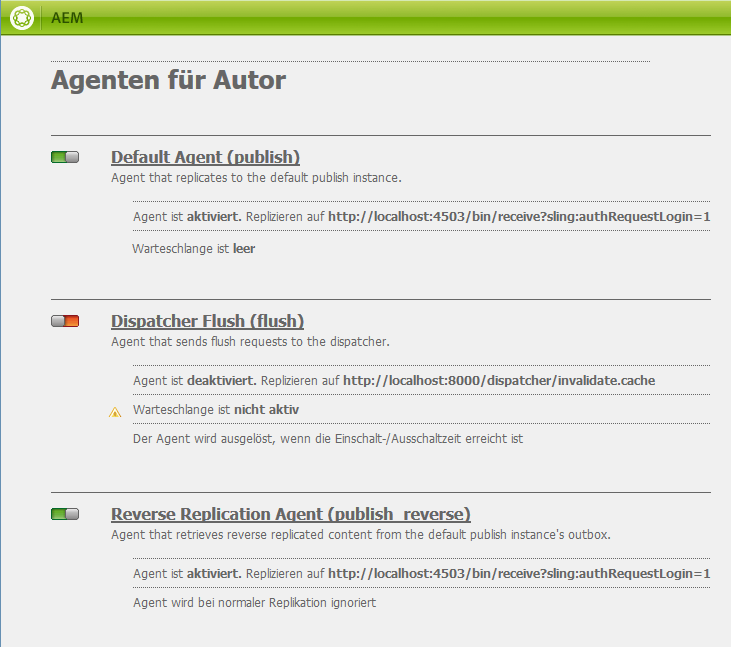

# Replikation{#replication}

Replikationsagenten sind von zentraler Bedeutung für Adobe Experience Manager (AEM), da der Mechanismus verwendet wird, um:

* [Veröffentlichen (aktivieren)](/help/sites-authoring/publishing-pages.md#activatingcontent) Inhalt von einer Autoren- in eine Veröffentlichungsumgebung.
* explizites Leeren von Inhalten aus dem Dispatcher-Cache
* Gibt Benutzereingaben (z. B. Formulareingaben) aus der Veröffentlichungsumgebung an die Autorenumgebung zurück (unter Kontrolle der Autorenumgebung).

Anforderungen sind [in Warteschlange](/help/sites-deploying/osgi-configuration-settings.md#apacheslingjobeventhandler) an den entsprechenden Agenten für die Verarbeitung.

>[!NOTE]
>
>Benutzerdaten (Benutzer, Benutzergruppen und Benutzerprofile) werden nicht zwischen Autoren- und Veröffentlichungsinstanzen repliziert.
>
>Bei mehreren Veröffentlichungsinstanzen werden Benutzerdaten Sling verteilt, wenn [Benutzersynchronisierung](/help/sites-administering/sync.md) aktiviert ist.

## Replizieren von der Autoren- zur Veröffentlichungsinstanz {#replicating-from-author-to-publish}

Die Replikation in einer Veröffentlichungsinstanz oder in einem Dispatcher erfolgt in mehreren Schritten:

* Der Autor fordert die Veröffentlichung (Aktivierung) bestimmter Inhalte an. Dies kann durch eine manuelle Anforderung oder durch vorkonfigurierte automatische Trigger eingeleitet werden.
* die Anforderung an den entsprechenden standardmäßigen Replikationsagenten übergeben wird. In einer Umgebung können mehrere Standardagenten vorhanden sein, die für solche Aktionen immer ausgewählt sind.
* Der Replikationsagent &quot;packt&quot;den Inhalt und legt ihn in die Replikationswarteschlange.
* auf der Registerkarte Websites [Farbstatus-Anzeige](/help/sites-authoring/publishing-pages.md#determiningpagepublicationstatus) für die einzelnen Seiten festgelegt ist.
* Der Inhalt wird aus der Warteschlange entfernt und mithilfe des konfigurierten Protokolls in die Veröffentlichungsumgebung übertragen. Normalerweise handelt es sich hierbei um HTTP.
* Ein Servlet in der Veröffentlichungsumgebung empfängt die Anforderung und veröffentlicht den empfangenen Inhalt. Das Standard-Servlet ist `https://localhost:4503/bin/receive`.

* Es können mehrere Autoren- und Veröffentlichungsumgebungen konfiguriert werden.

### Replizieren von der Veröffentlichungsinstanz zur Autoreninstanz {#replicating-from-publish-to-author}

Einige Funktionen ermöglichen es Benutzern, Daten in einer Veröffentlichungsinstanz einzugeben.

Manchmal ist ein Replikationstyp erforderlich, der als Rückwärtsreplikation bezeichnet wird, um diese Daten an die Autorenumgebung zurückzugeben, von der sie in andere Veröffentlichungsumgebungen weitergeleitet werden. Aus Sicherheitsgründen muss jeglicher Traffic von der Veröffentlichungs- zur Autorenumgebung streng kontrolliert werden.

Die Rückwärtsreplikation verwendet einen Agenten in der Veröffentlichungsumgebung, der auf die Autorenumgebung verweist. Dieser Agent legt die Daten in einem Postausgang ab. Dieser Postausgang wird mit Replikations-Listenern in der Autorenumgebung abgeglichen. Die Listener fragen die Postausgänge ab, um darin abgelegte Daten abzurufen und diese dann ggf. zu verteilen. Dadurch wird sichergestellt, dass die Autorenumgebung den gesamten Traffic steuert.

In anderen Fällen, z. B. bei Communities-Funktionen (z. B. Foren, Blogs, Kommentare und Überprüfungen), ist es schwierig, die Menge der in der Veröffentlichungsumgebung eingegebenen benutzergenerierten Inhalte (UGC) effizient mithilfe der Replikation zwischen AEM Instanzen zu synchronisieren.

AEM [Communities](/help/communities/overview.md) verwendet keine Replikation für benutzergenerierte Inhalte. Stattdessen ist zur Bereitstellung von benutzergenerierten Inhalten für Communities ein Common Store erforderlich (siehe [Community-Inhaltsspeicher](/help/communities/working-with-srp.md)).

### Replikation – vorkonfiguriert {#replication-out-of-the-box}

Am Beispiel der we-retail-Website, die Teil der Standardinstallation von AEM ist, kann die Replikation illustriert werden.

Um diesem Beispiel zu folgen und die standardmäßigen Replikationsagenten zu verwenden, [AEM installieren](/help/sites-deploying/deploy.md) mit:

* Autorenumgebung im Port `4502`
* Veröffentlichungsumgebung am Port `4503`

>[!NOTE]
>
>Standardmäßig aktiviert :
>
>* Agenten für Autor : Standardagent (Veröffentlichung)
>
>Standardmäßig deaktiviert (ab AEM 6.1) :
>
>* Agenten für Autor : Agenten für Rückwärtsreplikation (publish_reverse)
>* Agenten für Veröffentlichung : Rückwärtsreplikation (Postausgang)
>
>Um den Status des Agenten oder der Warteschlange zu überprüfen, verwenden Sie die **Instrumente** Konsole.
>Weitere Informationen finden Sie unter [Überwachen der Replikationsagenten](#monitoring-your-replication-agents).

#### Replikation (Autor zur Veröffentlichung) {#replication-author-to-publish}

1. Navigieren Sie zur Support-Seite in der Autorenumgebung.
   **https://localhost:4502/content/we-retail/us/en/experience.html** `<pi>`
1. Bearbeiten Sie die Seite, damit Sie neuen Text hinzufügen können.
1. **Seite aktivieren** damit Sie die Änderungen veröffentlichen können.
1. Öffnen Sie die Support-Seite in der Veröffentlichungsumgebung:
   **https://localhost:4503/content/we-retail/us/en/experience.html**
1. Sie können nun die Änderungen sehen, die Sie in der Autoreninstanz eingegeben haben.

Diese Replikation wird von der Autorenumgebung aus durch Folgendes ausgeführt:

* **Standardagent (publish)**
Dieser Agent repliziert Inhalte auf die standardmäßige Veröffentlichungsinstanz.
Details dazu (Konfiguration und Protokolle) können über die Tools-Konsole der Autorenumgebung aufgerufen werden. Oder:
  `https://localhost:4502/etc/replication/agents.author/publish.html` möglich.

#### Replikationsagenten - vorkonfiguriert {#replication-agents-out-of-the-box}

Die folgenden Agenten sind in einer standardmäßigen AEM-Installation verfügbar:

* [Standardagent](#replication-author-to-publish)
Wird für die Replikation von der Autoren- zur Veröffentlichungsinstanz verwendet.

* Dispatcher Flush
Dient zum Verwalten des Dispatcher-Caches. Weitere Informationen finden Sie unter [Invalidieren des Dispatcher-Cache aus der Autorenumgebung](https://experienceleague.adobe.com/docs/experience-manager-dispatcher/using/configuring/page-invalidate.html#invalidating-dispatcher-cache-from-the-authoring-environment) und [Invalidieren des Dispatcher-Cache von einer Veröffentlichungsinstanz](https://experienceleague.adobe.com/docs/experience-manager-dispatcher/using/configuring/page-invalidate.html?lang=de#invalidating-dispatcher-cache-from-a-publishing-instance).

* [Rückwärtsreplikation](#reverse-replication-publish-to-author)
Wird für die Replikation von der Veröffentlichungs- zur Autoreninstanz verwendet. Die Rückwärtsreplikation wird nicht für Communities-Funktionen wie Foren, Blogs und Kommentare verwendet. Sie ist effektiv deaktiviert, da der Postausgang nicht aktiviert ist. Für die Rückwärtsreplikation ist eine benutzerdefinierte Konfiguration erforderlich.

* Statischer Agent
Dies ist ein „Agent, der eine statische Repräsentation eines Knotens im Dateisystem speichert“.
Mit den Standardeinstellungen werden beispielsweise Inhaltsseiten und DAM-Assets unter gespeichert. `/tmp`, entweder als HTML oder das entsprechende Asset-Format. Weitere Einzelheiten zur Konfiguration finden Sie auf den Registerkarten `Settings` und `Rules`.
Der Grund hierfür war, dass die Inhalte sichtbar sein sollten, wenn die Seite direkt vom Anwendungs-Server angefordert wird. Dies ist ein spezieller Agent und (wahrscheinlich) nicht für die meisten Instanzen erforderlich.

## Replikationsagenten - Konfigurationsparameter {#replication-agents-configuration-parameters}

Beim Konfigurieren eines Replikationsagenten über die Tools-Konsole stehen vier Registerkarten im Dialogfeld zur Verfügung:

### Einstellungen {#settings}

* **Name**

  Ein eindeutiger Name für den Replikationsagenten.

* **Beschreibung**

  Eine Beschreibung des Zwecks, den dieser Replikationsagent erfüllt.

* **Aktiviert**

  Gibt an, ob der Replikationsagent aktiviert ist.

  Wenn der Agent **enabled**, wird die Warteschlange wie folgt angezeigt:

   * **Aktiv**, wenn Elemente verarbeitet werden.
   * **Leer**, wenn die Warteschlange leer ist.
   * **Blockiert**, wenn die Warteschlange Elemente enthält, die jedoch nicht verarbeitet werden können, z. B. wenn die empfangende Warteschlange deaktiviert ist.

* **Serialisierungstyp**

  Der Serialisierungstyp:

   * **Standard**: Legt fest, ob der Agent automatisch ausgewählt werden soll.
   * **Dispatcher Flush**: Wählen Sie diese Option aus, wenn der Agent zum Leeren des Dispatcher-Caches verwendet werden soll.

* **Wiederholungsverzögerung**

  Die Verzögerung (Wartezeit in Millisekunden) zwischen zwei Wiederholungen, wenn ein Problem auftritt.

  Standard: `60000`

* **Agenten-Benutzer-ID**

  Je nach Umgebung verwendet der Agent dieses Benutzerkonto für Folgendes:

   * den Inhalt aus der Autorenumgebung erfassen und verpacken
   * Inhalt in der Veröffentlichungsumgebung erstellen und schreiben

  Lassen Sie dieses Feld leer, um das Systembenutzerkonto zu verwenden (das in Sling als Admin definierte Konto; standardmäßig ist dies das `admin`-Konto).

  >[!CAUTION]
  >
  >Für einen Agenten in der Autorenumgebung dieses Konto *must* Sie haben Lesezugriff auf alle Pfade, die repliziert werden sollen.

  >[!CAUTION]
  >
  >Für einen Agenten in der Veröffentlichungsumgebung dieses Konto *must* verfügen über den zum Replizieren des Inhalts erforderlichen Erstellungs-/Schreibzugriff.

  >[!NOTE]
  >
  >Dies kann als Mechanismus zur Auswahl bestimmter Inhalte für die Replikation verwendet werden.

* **Protokollebene**

  Gibt die Detailtiefe an, die für Protokollmeldungen verwendet werden soll.

   * `Error`: nur Fehler werden protokolliert
   * `Info`: Fehler, Warnungen und andere Informationsmeldungen werden protokolliert.
   * `Debug`: In den Nachrichten wird eine hohe Detailtiefe verwendet, hauptsächlich zu Debugging-Zwecken

  Standard: `Info`

* **Verwendung für Rückwärtsreplikation**

  Gibt an, ob dieser Agent für die Rückwärtsreplikation verwendet wird. Gibt die Benutzereingabe aus der Umgebung &quot;In Autorenumgebung veröffentlichen&quot;zurück.

* **Alias-Update**

  Durch Auswahl dieser Option werden Anforderungen an den Dispatcher zur Invalidierung des Alias- oder Vanity-Pfads aktiviert. Weitere Informationen finden Sie auch unter [Konfigurieren eines Dispatcher Flush-Agenten](/help/sites-deploying/replication.md#configuring-a-dispatcher-flush-agent).

#### Transport {#transport}

* **URI**

  Gibt das Empfangs-Servlet am Zielspeicherort an. Insbesondere können Sie hier den Hostnamen (oder Alias) und den Kontextpfad zur Zielinstanz angeben.

  Beispiel:

   * Ein Standardagent wird möglicherweise unter `https://localhost:4503/bin/receive` repliziert.
   * Ein Dispatcher Flush-Agent wird möglicherweise unter `https://localhost:8000/dispatcher/invalidate.cache` repliziert.

  Das hier angegebene Protokoll (HTTP oder HTTPS) bestimmt die Transportmethode.

  Für Dispatcher Flush-Agenten wird die URI-Eigenschaft nur verwendet, wenn Sie pfadbasierte „VirtualHost“-Einträge nutzen, um zwischen Farmen zu unterscheiden. Dieses Feld dient dazu, die zu invalidierende Farm anzugeben. Beispiel: Farm 1 hat den virtuellen Host `www.mysite.com/path1/*` und Farm 2 den virtuellen Host `www.mysite.com/path2/*`. Mit der URL `/path1/invalidate.cache` können Sie die erste Farm und mit `/path2/invalidate.cache` die zweite Farm bestimmen.

* **Benutzer**

  Der Benutzername des Kontos, das für den Zugriff auf die Zielgruppe verwendet werden soll.

* **Kennwort**

  Kennwort für das Konto, das für den Zugriff auf das Ziel verwendet werden soll.

* **NTLM-Domäne**

  Domäne für NTML-Authentifizierung.

* **NTLM-Host**

  Host für NTML-Authentifizierung.

* **Relaxed SSL aktivieren**

  Aktivieren Sie diese Option, wenn selbstzertifizierte SSL-Zertifikate akzeptiert werden sollen.

* **Abgelaufene Zertifikate zulassen**

  Aktivieren Sie diese Option, wenn abgelaufene SSL-Zertifikate akzeptiert werden sollen.

#### Proxy {#proxy}

Die folgenden Einstellungen sind nur erforderlich, wenn ein Proxy erforderlich ist:

* **Proxy-Host**

  Hostname des für den Transport verwendeten Proxys.

* **Proxy-Port**

  Port des Proxys.

* **Proxy-Benutzer**

  Der Benutzername des zu verwendenden Kontos.

* **Proxy-Kennwort**

  Kennwort des zu verwendenden Kontos.

* **Proxy-NTLM-Domäne**

  Die NTLM-Proxy-Domäne.

* **Proxy-NTLM-Host**

  Die NTLM-Proxy-Domäne.

#### Erweitert {#extended}

* **Schnittstelle**

  Hier können Sie die Socket-Oberfläche definieren, an die Sie sich binden möchten.

  Dadurch wird beim Erstellen von Verbindungen die lokale Adresse verwendet. Wenn diese Option nicht festgelegt ist, wird die Standardadresse verwendet. Dies ist nützlich, um die Schnittstelle anzugeben, die auf Systemen mit mehreren Homepages oder Clustern verwendet werden soll.

* **HTTP-Methode**

  Die zu verwendende HTTP-Methode.

  Bei einem Dispatcher Flush-Agenten ist dies fast immer GET und sollte nicht geändert werden (POST wäre ein weiterer möglicher Wert).

* **HTTP-Header**

  Diese werden für Dispatcher Flush-Agenten verwendet und geben Elemente an, die geleert werden müssen.

  Für einen Dispatcher Flush-Agenten müssen die drei Standardeinträge nicht geändert werden:

   * `CQ-Action:{action}`
   * `CQ-Handle:{path}`
   * `CQ-Path:{path}`

  Diese dienen ggf. dazu, die Aktion anzugeben, die beim Leeren des Handles oder Pfades verwendet werden soll. Die Unterparameter sind dynamisch:

   * `{action}` zeigt eine Replikationsaktion an

   * `{path}` gibt einen Pfad an

  Sie werden durch den Pfad/die Aktion ersetzt, der/die für die Anfrage relevant ist, und müssen daher nicht &quot;hartcodiert&quot;sein:

  >[!NOTE]
  >
  >Wenn Sie AEM in einem anderen Kontext als dem empfohlenen Standardkontext installiert haben, müssen Sie den Kontext in den HTTP-Headern registrieren. Beispiel:
  >`CQ-Handle:/<*yourContext*>{path}`

* **Verbindung schließen**

  Aktivieren Sie diese Option, damit Sie die Verbindung nach jeder Anfrage schließen können.

* **Verbindungs-Timeout**

  Zeitüberschreitung (in Millisekunden), die beim Versuch der Herstellung einer Verbindung angewendet werden soll.

* **Socket-Zeitüberschreitung**

  Zeitüberschreitung (in Millisekunden), die beim Warten auf Traffic nach der Herstellung einer Verbindung angewendet wird.

* **Protokollversion**

  Version des Protokolls. Beispiel: `1.0` für HTTP/1.0.

#### Auslöser {#triggers}

Diese Einstellungen werden verwendet, um Trigger für die automatisierte Replikation zu definieren:

* **Standard ignorieren**

  Wenn diese Option aktiviert ist, wird der Agent von der Standardreplikation ausgeschlossen. Dies bedeutet, dass er nicht verwendet wird, wenn ein Inhaltsautor eine Replikationsaktion ausführt.

* **Bei Modifizierung**

  Hier wird eine Replikation durch diesen Agenten automatisch ausgelöst, wenn eine Seite geändert wird. Wird für Dispatcher Flush-Agenten, aber auch für die Rückwärtsreplikation verwendet.

* **Bei Verteilen**

  Wenn diese Option aktiviert ist, repliziert der Agent automatisch alle Inhalte, die zur Verteilung markiert sind, wenn er geändert wird.

* **On-/Offtime erreicht**

  Dadurch wird die automatische Replikation (um eine Seite zu aktivieren bzw. zu deaktivieren) Trigger, wenn die für eine Seite definierten Ein- oder Ausschaltzeiten auftreten. Dies wird hauptsächlich für Dispatcher Flush-Agenten verwendet.

* **Bei Erhalt**

  Wenn diese Option aktiviert ist, replizieren die Agentenketten jedes Mal, wenn Replikationsereignisse empfangen werden.

* **Keine Statusaktualisierung**

  Wenn diese Option aktiviert ist, erzwingt der Agent keine Aktualisierung des Replikationsstatus.

* **Keine Versionierung**

  Wenn diese Option aktiviert ist, erzwingt der Agent keine Versionierung aktivierter Seiten.

## Konfigurieren Ihrer Replikationsagenten {#configuring-your-replication-agents}

Informationen zum Verbinden von Replikationsagenten mit der Veröffentlichungsinstanz mithilfe von MSSL finden Sie unter [Replizieren mithilfe von bidirektionalem SSL](/help/sites-deploying/mssl-replication.md).

### Konfigurieren Ihrer Replikationsagenten über die Autorenumgebung {#configuring-your-replication-agents-from-the-author-environment}

Auf der Registerkarte Tools in der Autorenumgebung können Sie Replikationsagenten konfigurieren, die sich in der Autorenumgebung (**Agenten für Autor**) oder der Veröffentlichungsumgebung (**Agenten für Veröffentlichungen**). Die folgenden Verfahren veranschaulichen die Konfiguration eines Agenten für die Autorenumgebung, können jedoch für beide verwendet werden.

>[!NOTE]
>
>Wenn ein Dispatcher HTTP-Anforderungen für Autoren- oder Veröffentlichungsinstanzen verarbeitet, muss die HTTP-Anforderung des Replikationsagenten den PATH-Header enthalten. Zusätzlich zum folgenden Verfahren müssen Sie die PATH-Kopfzeile zur Dispatcher-Liste der Client-Kopfzeilen hinzufügen. Siehe [/clientheaders (Client-Header)](https://experienceleague.adobe.com/docs/experience-manager-dispatcher/using/configuring/dispatcher-configuration.html?lang=de#specifying-the-http-headers-to-pass-through-clientheaders).
>

1. Greifen Sie auf die Registerkarte **Tools** in AEM zu.
1. Klicks **Replikation** (linker Bereich, um den Ordner zu öffnen).
1. Doppelklicken **Agenten für Autor** (entweder der linke oder der rechte Bereich).
1. Klicken Sie auf den entsprechenden Agentennamen (der ein Link ist), um detaillierte Informationen zu diesem Agenten anzuzeigen.
1. Klicks **Bearbeiten** damit das Konfigurationsdialogfeld geöffnet wird:

   

1. Die angegebenen Werte sollten für eine Standardinstallation ausreichend sein. Wenn Sie Änderungen vornehmen, klicken Sie auf **OK** Speichern Sie sie (siehe [Replikationsagenten - Konfigurationsparameter](#replication-agents-configuration-parameters) für Informationen zu einzelnen Parametern).

>[!NOTE]
>
>Bei einer Standardinstallation von AEM wird `admin` als Benutzer für die Transport-Anmeldedaten in den Standard-Replikationsagenten angegeben.
>
>Dies sollte in ein Site-spezifisches Replikations-Benutzerkonto mit den Berechtigungen geändert werden, um die erforderlichen Pfade zu replizieren.

### Konfigurieren der Rückwärtsreplikation {#configuring-reverse-replication}

Die Rückwärtsreplikation wird verwendet, um Benutzerinhalte, die in einer Veröffentlichungsinstanz generiert wurden, zurück in eine Autoreninstanz zu bringen. Dies wird häufig für Funktionen wie Umfragen und Registrierungsformulare verwendet.

Aus Sicherheitsgründen lassen die meisten Netzwerktopologien keine Verbindungen zu *von* die &quot;demilitarisierte Zone&quot;(ein Subnetz, das die externen Dienste einem nicht vertrauenswürdigen Netzwerk wie dem Internet zur Verfügung stellt).

Da sich die Veröffentlichungsumgebung normalerweise in der DMZ befindet, muss die Verbindung von der Autoreninstanz aus initiiert werden, um Inhalte zurück in die Autorenumgebung zu erhalten. Dies geschieht mithilfe von:

* ein *Postausgang* in der Veröffentlichungsumgebung, in der der Inhalt platziert wird.
* einen Agenten (Veröffentlichung) in der Autorenumgebung, der den Postausgang regelmäßig auf neue Inhalte abfragt.

>[!NOTE]
>
>AEM [Communities](/help/communities/overview.md), wird die Replikation nicht für benutzergenerierte Inhalte auf einer Veröffentlichungsinstanz verwendet. Weitere Informationen finden Sie unter [Community-Inhaltsspeicher](/help/communities/working-with-srp.md).

Dazu müssen Sie Folgendes tun:

**Ein Rückwärtsreplikationsagent in der Autorenumgebung** - fungiert als aktive Komponente zum Erfassen von Informationen aus dem Postausgang in der Veröffentlichungsumgebung:

Wenn Sie die Rückwärtsreplikation verwenden möchten, stellen Sie sicher, dass dieser Agent aktiviert ist.

**Ein Agenten für die Rückwärtsreplikation in der Veröffentlichungsumgebung (Postausgang)** - Das passive Element, da es als &quot;Postausgang&quot;fungiert. Die Benutzereingabe wird hier platziert, von wo aus sie vom Agenten in der Autorenumgebung erfasst wird.

### Konfigurieren der Replikation für mehrere Veröffentlichungsinstanzen {#configuring-replication-for-multiple-publish-instances}

>[!NOTE]
>
>Nur Inhalte werden repliziert - Benutzerdaten werden nicht repliziert (Benutzer, Benutzergruppen und Benutzerprofile).
>
>Um Benutzerdaten über mehrere Veröffentlichungsinstanzen hinweg zu synchronisieren, aktivieren Sie [Benutzersynchronisierung](/help/sites-administering/sync.md).

Nach der Installation ist bereits ein Standardagent für die Replikation von Inhalten auf eine Veröffentlichungsinstanz konfiguriert, die auf Port 4503 des localhost ausgeführt wird.

Um die Replikation von Inhalten für eine zusätzliche Veröffentlichungsinstanz zu konfigurieren, erstellen und konfigurieren Sie einen neuen Replikationsagenten:

1. Öffnen Sie die **Instrumente** in AEM.
1. Auswählen **Replikation**, dann **Agenten für Autor** im linken Bereich.
1. Auswählen **Neu...**.
1. Legen Sie die **Titel** und **Name**, wählen Sie **Replikationsagent**.
1. Klicks **Erstellen** , damit Sie den Agenten erstellen können.
1. Doppelklicken Sie auf das neue Agentenelement, damit das Konfigurationsfenster geöffnet wird.
1. Klicks **Bearbeiten** - die **Agenteneinstellungen** wird geöffnet - das **Serialisierungstyp** bereits als Standard definiert ist, muss dies weiterhin der Fall sein.

   * Im **Einstellungen** tab:

      * Aktivieren **Aktiviert**.
      * Geben Sie einen **Beschreibung**.
      * Setzen Sie den Wert für **Verzögerung wiederh.** auf `60000`.

      * Behalten Sie für den **Anordnungstyp** die Einstellung `Default` bei.

   * Führen Sie auf der Registerkarte **Transport** folgende Schritte aus:

      * Geben Sie den erforderlichen URI für die neue Veröffentlichungsinstanz ein, z. B.
        `https://localhost:4504/bin/receive` möglich.

      * Geben Sie das Site-spezifische Benutzerkonto ein, das für die Replikation verwendet wird.
      * Sie können bei Bedarf weitere Parameter konfigurieren.

1. Klicken Sie auf **OK**.

Anschließend können Sie den Vorgang testen, indem Sie eine Seite in der Autorenumgebung aktualisieren und dann veröffentlichen.

Die Aktualisierungen werden auf allen Veröffentlichungsinstanzen angezeigt, die wie oben konfiguriert wurden.

Wenn Probleme auftreten, können Sie die Protokolle in der Autoreninstanz überprüfen. Abhängig vom erforderlichen Detaillierungsgrad können Sie die Einstellung für die **Protokollebene** auf `Debug` festlegen. Verwenden Sie hierzu das Dialogfeld **Agenteneinstellungen**, wie oben beschrieben.

>[!NOTE]
>
>Dies kann mit der Verwendung der [Agenten-Benutzer-ID](#agentuserid) , um verschiedene Inhalte für die Replikation auf die einzelnen Veröffentlichungsumgebungen auszuwählen. Für jede Veröffentlichungsumgebung:
>
>1. Konfigurieren Sie einen Replikationsagenten für die Replikation auf dieser Veröffentlichungsumgebung.
>1. Konfigurieren Sie ein Benutzerkonto mit den erforderlichen Zugriffsrechten zum Lesen des Inhalts, der in dieser bestimmten Veröffentlichungsumgebung repliziert wird.
>1. Weisen Sie das Benutzerkonto als **Agenten-Benutzer-ID** für den Replikationsagenten.
>

### Konfigurieren eines Dispatcher Flush-Agenten {#configuring-a-dispatcher-flush-agent}

Die Installation umfasst Standardagenten. Eine bestimmte Konfiguration ist jedoch weiterhin erforderlich, und dasselbe gilt, wenn Sie einen neuen Agenten definieren:

1. Öffnen Sie die **Instrumente** in AEM.
1. Klicks **Implementierung**.
1. Auswählen **Replikation** und dann **Agenten für Veröffentlichungen**.
1. Doppelklicken Sie auf die **Dispatcher Flush** -Element, um die Übersicht zu öffnen.
1. Klicks **Bearbeiten** - die **Agenteneinstellungen** wird geöffnet:

   * Im **Einstellungen** tab:

      * Aktivieren **Aktiviert**.
      * Geben Sie einen **Beschreibung**.
      * Lassen Sie die **Serialisierungstyp** as `Dispatcher Flush`oder legen Sie sie als solchen fest, wenn Sie einen Agenten erstellen.

      * (Optional) Wählen Sie **Alias-Aktualisierung** aus, um Invalidierungsanforderungen an den Dispatcher für Alias- oder Vanity-Pfade zu aktivieren.

   * Führen Sie auf der Registerkarte **Transport** folgende Schritte aus:

      * Geben Sie den erforderlichen URI für die neue Veröffentlichungsinstanz ein, z. B.
        `https://localhost:80/dispatcher/invalidate.cache` möglich.

      * Geben Sie das Site-spezifische Benutzerkonto ein, das für die Replikation verwendet wird.
      * Sie können bei Bedarf weitere Parameter konfigurieren.

   Für Dispatcher Flush-Agenten wird die URI-Eigenschaft nur verwendet, wenn Sie pfadbasierte „VirtualHost“-Einträge nutzen, um zwischen Farmen zu unterscheiden. Dieses Feld dient dazu, die zu invalidierende Farm anzugeben. Beispiel: Farm 1 hat den virtuellen Host `www.mysite.com/path1/*` und Farm 2 den virtuellen Host `www.mysite.com/path2/*`. Mit der URL `/path1/invalidate.cache` können Sie die erste Farm und mit `/path2/invalidate.cache` die zweite Farm bestimmen.

   >[!NOTE]
   >
   >Wenn Sie AEM in einem anderen Kontext als dem empfohlenen Standardkontext installiert haben, konfigurieren Sie die [HTTP-Header](#extended) im **Erweitert** Registerkarte.

1. Klicken Sie auf **OK**.
1. Kehren Sie zu **Instrumente** Registerkarte, von hier aus können Sie **Aktivieren** die **Dispatcher Flush** Agent (**Agenten für Veröffentlichungen**).

Die **Dispatcher Flush** Der Replikationsagent ist im Autor nicht aktiv. Sie können in der Veröffentlichungsumgebung auf dieselbe Seite zugreifen, indem Sie den entsprechenden URI verwenden, beispielsweise `https://localhost:4503/etc/replication/agents.publish/flush.html`.

### Steuern des Zugriffs auf Replikationsagenten {#controlling-access-to-replication-agents}

Der Zugriff auf die Seiten zum Konfigurieren der Replikationsagenten kann mithilfe von Berechtigungen für Benutzer- und/oder Gruppenseiten auf dem Knoten `etc/replication` gesteuert werden.

>[!NOTE]
>
>Das Festlegen solcher Berechtigungen hat keine Auswirkungen auf Benutzer, die Inhalte replizieren (z. B. über die Konsole &quot;Websites&quot;oder die Sidekick-Option). Das Replikations-Framework verwendet keine Benutzersitzung des aktuellen Benutzers, um beim Replizieren von Seiten auf Replikationsagenten zuzugreifen.

### Konfigurieren der Replikationsagenten mit CRXDE Lite {#configuring-your-replication-agents-from-crxde-lite}

>[!NOTE]
>
>Die Erstellung von Replikationsagenten wird nur im Repository-Speicherort `/etc/replication` unterstützt. Dies ist erforderlich, damit die zugehörigen ACLs ordnungsgemäß verarbeitet werden. Das Erstellen eines Replikationsagenten an einem anderen Speicherort der Baumstruktur kann zu nicht autorisiertem Zugriff führen.

Mit CRXDE Lite können verschiedene Parameter der Replikationsagenten konfiguriert werden.

Wenn Sie zu `/etc/replication`, können Sie die folgenden drei Knoten sehen:

* `agents.author`
* `agents.publish`
* `treeactivation`

Die beiden `agents`-Elemente beinhalten Konfigurationsinformationen über die entsprechende Umgebung und sind nur aktiv, wenn diese Umgebung ausgeführt wird. Beispiel: `agents.publish` wird nur in der Veröffentlichungsumgebung verwendet. Der folgende Screenshot zeigt den Veröffentlichungsagenten in der Autorenumgebung, wie er in AEM WCM enthalten ist:

## Überwachen von Replikationsagenten {#monitoring-your-replication-agents}

So überwachen Sie einen Replikationsagenten:

1. Greifen Sie auf die Registerkarte **Tools** in AEM zu.
1. Klicken Sie auf **Replikation**.
1. Doppelklicken Sie auf den Link zu Agenten für die entsprechende Umgebung (entweder im linken oder im rechten Bereich). Beispiel: **Agenten für Autor**.

   Das resultierende Fenster zeigt eine Übersicht über alle Replikationsagenten für die Autorenumgebung, einschließlich Ziel und Status.

1. Klicken Sie auf den Link mit dem entsprechenden Agentennamen, um detaillierte Informationen zu diesem Agenten anzuzeigen:

   

   Hier haben Sie folgende Möglichkeiten:

   * Überprüfen, ob der Agent aktiviert ist.
   * Anzeige der Zielgruppe jeder Replikation.
   * Überprüfen, ob die Replikations-Warteschlange aktiv (aktiviert) ist.
   * Überprüfen, ob sich Elemente in der Warteschlange befinden.
   * **Aktualisieren** oder **Löschen**, um die Anzeige der Warteschlangeneinträge zu aktualisieren. Auf diese Weise können Sie sehen, dass Elemente in die Warteschlange eintreten und diese verlassen.

   * **Protokoll anzeigen**, um auf das Protokoll jeder Aktion des Replikationsagenten zuzugreifen.
   * **Testen der Verbindung** mit der Zielinstanz.
   * **Erzwingen einer Wiederholung** für alle Warteschlangenelemente bei Bedarf.

   >[!CAUTION]
   >
   >Verwenden Sie nicht den Link &quot;Verbindung testen&quot;für den Postausgang &quot;Rückwärtsreplikation&quot;auf einer Veröffentlichungsinstanz.
   >
   >
   >Falls ein Replikationstest für eine Warteschlange in einem Postausgang durchgeführt wird, werden Elemente, die älter als die Testreplikation sind, bei jeder Rückwärtsreplikation erneut verarbeitet.
   >
   >
   >Falls solche Elemente in einer Warteschlange vorliegen, können Sie sie mit der folgenden XPath-JCR-Abfrage suchen und entfernen.
   >
   >
   >`/jcr:root/var/replication/outbox//*[@cq:repActionType='TEST']`

## Batch-Replikation {#batch-replication}

Die Batch-Replikation repliziert keine einzelnen Seiten oder Assets, sondern wartet darauf, dass der erste Schwellenwert der beiden ausgelöst wird, basierend auf Zeit oder Größe.

Anschließend werden alle Replikationselemente in einem Paket zusammengefasst, das dann als einzelne Datei an den Publisher repliziert wird.

Der Herausgeber entpackt alle Elemente, speichert sie und meldet sie erneut an den Autor.

### Konfigurieren der Batch-Replikation {#configuring-batch-replication}

1. Wechseln Sie zu `http://serveraddress:serverport/siteadmin`.
1. Drücken Sie die **[!UICONTROL Instrumente]** rechts oben im Bildschirm
1. Navigieren Sie in der linken Navigationsleiste zu **[!UICONTROL Replikation - Agenten für Autor]** und doppelklicken **[!UICONTROL Standardagent]**.
   * Sie können auch den standardmäßigen Agenten für die Veröffentlichungsreplikation erreichen, indem Sie direkt zu `http://serveraddress:serverport/etc/replication/agents.author/publish.html`
1. Wählen Sie die Schaltfläche **[!UICONTROL Bearbeiten]** oberhalb der Replikationswarteschlange.
1. Rufen Sie im folgenden Fenster die Registerkarte **[!UICONTROL Batch]** auf:
   
1. Konfigurieren Sie den Agenten.

### Parameter {#parameters}

* `[!UICONTROL Enable Batch Mode]`: Aktivierung oder Deaktivierung des Batch-Replikationsmodus
* `[!UICONTROL Max Wait Time]`: Maximale Wartezeit bis zum Start einer Batch-Anforderung in Sekunden. Der Standardwert ist 2 Sekunden.
* `[!UICONTROL Trigger Size]`: Start der Batch-Replikation bei dieser Größenbeschränkung

## Zusätzliche Ressourcen {#additional-resources}

Weitere Informationen zur Fehlerbehebung finden Sie unter [Fehlerbehebung bei der Replikation](/help/sites-deploying/troubleshoot-rep.md) Seite.
