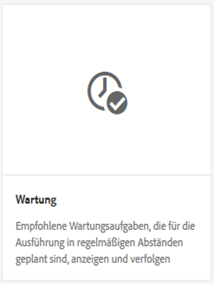
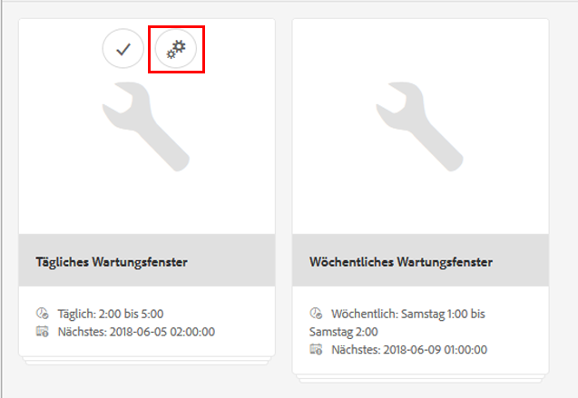
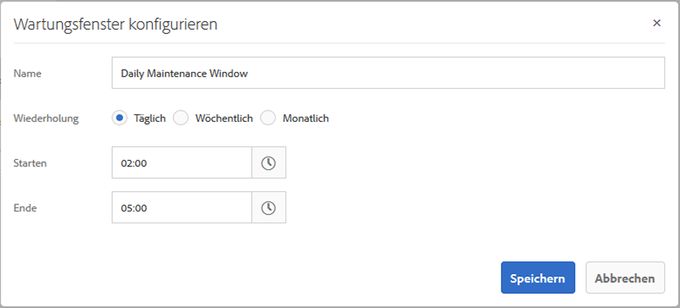
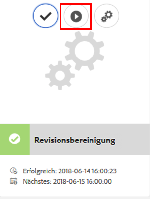
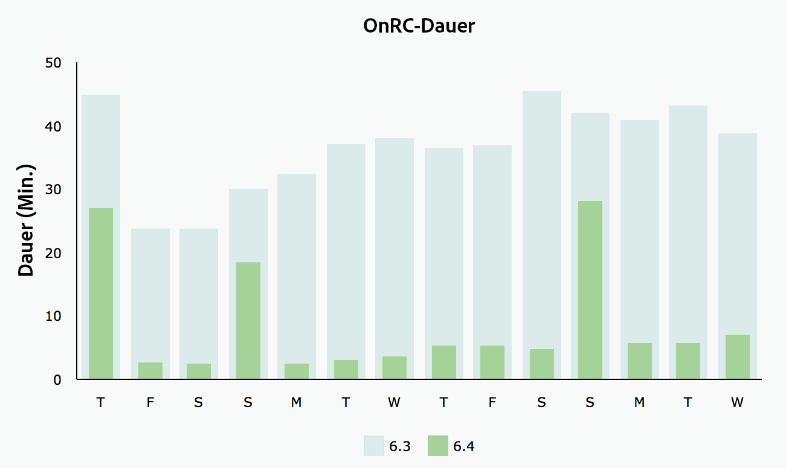
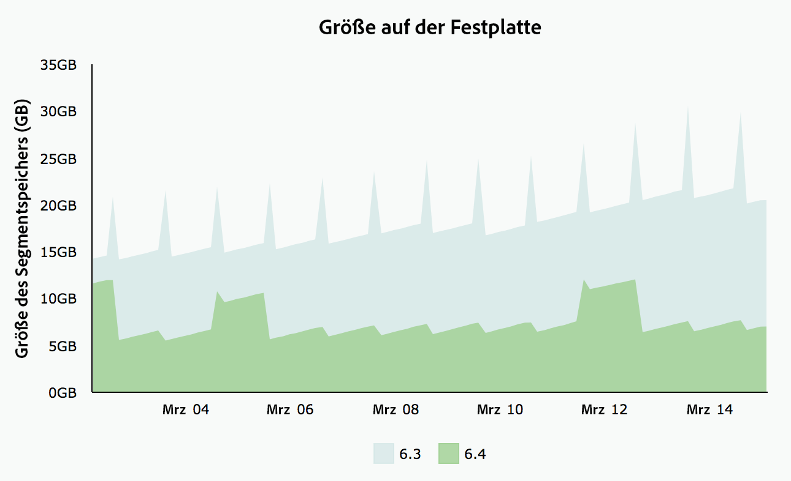

# Revisionsbereinigung {#revision-cleanup}

## Einführung {#introduction}

Jede Aktualisierung des Repositorys erzeugt eine Inhaltsrevision. Daher wächst das Repository mit jeder Aktualisierung. Alte Revisionen müssen bereinigt werden, um freie Festplattenressourcen zu erhalten – dies ist wichtig, um ein unkontrolliertes Repository-Wachstum zu vermeiden. Diese Wartungsfunktionalität wird als Revisionsbereinigung bezeichnet. Sie ist seit Adobe Experience Manager (AEM) 6.0 als Offline-Routine verfügbar.

Mit AEM 6.3 und höher wurde eine Online-Version dieser Funktion namens Online-Revisionsbereinigung eingeführt. Verglichen mit der Offline-Revisionsbereinigung, bei der die AEM-Instanz beendet werden muss, kann die Online-Revisionsbereinigung ausgeführt werden, wenn die AEM-Instanz online ist. Die Online-Revisionsbereinigung ist standardmäßig aktiviert und ist die empfohlene Methode zur Durchführung der Revisionsbereinigung.

**Hinweis**: [Im Video](https://experienceleague.adobe.com/docs/experience-manager-learn/foundation/administration/use-online-revision-clean-up.html?lang=de) finden Sie eine Einführung in die Verwendung der Online-Revisionsbereinigung.

Der Revisionsbereinigungsprozess besteht aus drei Phasen: **Schätzung**, **Komprimierung** und **Bereinigung**. Die Schätzung bestimmt, ob die nächste Phase (Komprimierung) ausgeführt werden soll oder nicht, je nachdem, wie viel Speicherabfall möglicherweise erfasst wird. Während der Komprimierungsphase werden Segmente und TAR-Dateien neu geschrieben, wobei nicht verwendete Inhalte ausgeschlossen werden. In der Bereinigungsphase werden dann die alten Segmente entfernt, einschließlich des möglicherweise vorhandenen Speicherabfalls. Im Offline-Modus kann in der Regel mehr Speicherplatz zurückgewonnen werden, da der Online-Modus den AEM-Arbeitssatz berücksichtigen muss, in dem zusätzliche Segmente nicht erfasst werden.

Weitere Informationen zur Revisionsbereinigung finden Sie unter den folgenden Links:

* [Ausführen der Online-Revisionsbereinigung](/help/sites-deploying/revision-cleanup.md#how-to-run-online-revision-cleanup)
* [Häufig gestellte Fragen zur Online-Revisionsbereinigung](/help/sites-deploying/revision-cleanup.md#online-revision-cleanup-frequently-asked-questions)
* [Ausführen der Offline-Revisionsbereinigung](/help/sites-deploying/revision-cleanup.md#how-to-run-offline-revision-cleanup)

Weitere Informationen finden Sie zudem in der [offiziellen Oak-Dokumentation](https://jackrabbit.apache.org/oak/docs/nodestore/segment/overview.html).

### Wann sollte die Online-Revisionsbereinigung anstelle der Offline-Revisionsbereinigung verwendet werden? {#when-to-use-online-revision-cleanup-as-opposed-to-offline-revision-cleanup}

**Die Online-Revisionsbereinigung ist die empfohlene Methode zur Durchführung der Revisionsbereinigung.** Die Offline-Revisionsbereinigung sollte nur in Ausnahmefällen erfolgen, beispielsweise bei der Migration zu einem neuen Speicherformat oder bei Aufforderung durch die Adobe-Kundenunterstützung.

## Ausführen der Online-Revisionsbereinigung {#how-to-run-online-revision-cleanup}

Die Online-Revisionsbereinigung ist standardmäßig so konfiguriert, dass sie einmal täglich sowohl in der Autoren- als auch in der Veröffentlichungsinstanz von AEM ausgeführt wird. Sie müssen lediglich das Wartungsfenster während eines Zeitraums mit der geringsten Benutzeraktivität definieren. Sie können die Online-Revisionsbereinigung wie folgt konfigurieren:

1. Wechseln Sie im AEM-Hauptfenster zu **Tools > Vorgänge > Dashboard > Wartung** oder öffnen Sie im Browser die URL: `https://serveraddress:serverport/libs/granite/operations/content/maintenance.html`

   

1. Zeigen Sie mit der Maus auf **Tägliches Wartungsfenster** und klicken Sie auf das Symbol für **Einstellungen**.

   

1. Geben Sie die gewünschten Werte (Wiederholung, Startzeit, Endzeit) ein und klicken Sie auf **Speichern**.

   

Wenn Sie die Revisionsbereinigung manuell durchführen möchten, gehen Sie wie folgt vor:

1. Wechseln Sie zu **Tools > Vorgänge > Dashboard > Wartung** oder direkt zu `https://serveraddress:serverport/libs/granite/operations/content/maintenance.html`.
1. Klicken Sie auf **Tägliches Wartungsfenster**.
1. Zeigen Sie mit der Maus auf das Symbol für **Revisionsbereinigung**.
1. Klicken Sie auf **Ausführen**.

   

### Ausführen der Online-Revisionsbereinigung nach der Offline-Revisionsbereinigung {#running-online-revision-cleanup-after-offline-revision-cleanup}

Der Revisionsbereinigungsprozess gewinnt alte Revisionen generationsweise zurück. Das bedeutet, dass jedes Mal, wenn Sie die Revisionsbereinigung ausführen, eine neue Generierung erstellt und auf der Festplatte gespeichert wird. Die beiden Typen der Revisionsbereinigung unterscheiden sich: Bei der Offline-Revisionsbereinigung wird eine Generation aufbewahrt, während bei der Online-Revisionsbereinigung zwei Generationen aufbewahrt werden. Wenn Sie also **nach** einer Offline-Revisionsbereinigung eine Online-Revisionsbereinigung durchführen, passiert Folgendes:

1. Nach dem ersten Durchlauf der Online-Revisionsbereinigung verdoppelt sich die Größe des Repositorys. Dies geschieht, weil jetzt zwei Generationen auf der Festplatte aufbewahrt werden.
1. Während der nachfolgenden Ausführungen wächst das Repository, solange die neue Generation erstellt wird, und stabilisiert sich dann wieder bei der Größe, die es nach dem ersten Durchlauf hatte, sobald der Online-Revisionsbereinigungsprozess die vorherige Generation zurückgewinnt.

Beachten Sie außerdem, dass je nach Typ und Anzahl der Commits jede Generierung im Vergleich zum vorherigen unterschiedlich groß sein kann, sodass die endgültige Größe von einer Ausführung zur anderen variieren kann.

Es empfiehlt sich deswegen, eine Festplatte zu wählen, die mindestens zwei- oder dreimal so groß ist wie die ursprünglich geschätzte Repository-Größe.

## Vollständiger und Tail-Komprimierungsmodus  {#full-and-tail-compaction-modes}

Mit **AEM 6.5** werden **zwei neue Modi** für die **Komprimierungsphase** des Online-Revisionsbereinigungsprozesses eingeführt:

* Der Modus für die **vollständige Komprimierung** schreibt alle Segmente und TAR-Dateien im gesamten Repository neu. Die nachfolgende Bereinigungsphase kann somit die maximale Menge an Speicherabfall im Repository entfernen. Da die vollständige Komprimierung sich auf das gesamte Repository auswirkt, ist dafür eine beträchtliche Menge an Systemressourcen und Zeit erforderlich. Die vollständige Komprimierung entspricht der Komprimierungsphase in AEM 6.3.
* Der Modus **Tail-Komprimierung** schreibt nur die aktuellsten Segmente und TAR-Dateien im Repository neu. Die neuesten Segmente und TAR-Dateien sind diejenigen, die seit der letzten vollständigen oder Tail-Komprimierung hinzugefügt wurden. Die nachfolgende Bereinigungsphase kann daher nur den im aktuellen Teil des im Repository enthaltenen Speicherabfall entfernen. Da die Tail-Komprimierung nur einen Teil des Repositorys betrifft, benötigt sie erheblich weniger Systemressourcen und Zeit als eine vollständige Komprimierung.

Diese Komprimierungsmodi stellen einen Kompromiss zwischen Effizienz und Ressourcenverbrauch dar: Die Tail-Komprimierung ist zwar weniger effektiv, hat dafür aber weniger Auswirkungen auf den normalen Systembetrieb. Die vollständige Komprimierung ist effektiver, hat aber auch wesentlich größere Auswirkungen auf den normalen Systembetrieb.

AEM 6.5 bietet bei der Komprimierung außerdem einen effizienteren Mechanismus für die Deduplizierung des Inhalts, was den Speicherbedarf des Repositorys weiter verringert.

Die beiden folgenden Diagramme enthalten die Ergebnisse aus internen Laborversuchen, die die Reduzierung der durchschnittlichen Ausführungszeiten und des durchschnittlichen Festplattenspeicherbedarfs in AEM 6.5 im Vergleich zu AEM 6.3 aufzeigen:

 

### Konfigurieren der vollständigen und Tail-Komprimierung {#how-to-configure-full-and-tail-compaction}

Bei der Standardkonfiguration wird an Werktagen eine Tail-Komprimierung und an Sonntagen eine vollständige Komprimierung durchgeführt. Die Standardkonfiguration kann über den neuen Konfigurationswert `full.gc.days` der `RevisionCleanupTask`-[Wartungsaufgabe](/help/sites-deploying/revision-cleanup.md#how-to-run-online-revision-cleanup) geändert werden.

Wenn Sie den Wert `full.gc.days` konfigurieren, wird die vollständige Komprimierung während der mit diesem Wert definierten Tage ausgeführt und die Tail-Komprimierung während der nicht mit diesem Wert definierten Tage. Wenn Sie beispielsweise die vollständige Komprimierung so konfigurieren, dass sie am Sonntag erfolgt, wird die Tail-Komprimierung von Montag bis Samstag ausgeführt. Wenn Sie beispielsweise die vollständige Komprimierung so konfigurieren, dass sie an jedem Wochentag erfolgt, wird die Tail-Komprimierung überhaupt nicht ausgeführt.

Beachten Sie außerdem Folgendes:

* Die **Tail-Komprimierung** ist weniger effektiv und hat weniger Auswirkungen auf den normalen Systembetrieb. Sie sollte daher an den Werktagen ausgeführt werden.
* Die **vollständige Komprimierung** ist effektiver, hat aber auch wesentlich größere Auswirkungen auf den normalen Systembetrieb. Sie ist daher zur Verwendung außerhalb der Werktage vorgesehen.
* Sowohl die Tail-Komprimierung als auch die vollständige Komprimierung sollte außerhalb der Spitzenzeiten ausgeführt werden.

### Fehlerbehebung {#troubleshooting}

Beachten Sie bei der Verwendung der neuen Komprimierungsmodi Folgendes:

* Sie können die Eingabe/Ausgabe-Aktivität (I/O) überwachen, z. B.: I/O-Vorgänge, CPU wartet auf IO, Commit-Warteschlangengröße. Auf diese Weise können Sie feststellen, ob das System I/O-gebunden wird und eine Vergrößerung erforderlich ist.
* Der `RevisionCleanupTaskHealthCheck` zeigt den Gesamtzustand der Online-Revisionsbereinigung. Es funktioniert genauso wie in AEM 6.3 und unterscheidet nicht zwischen vollständiger und Tail-Komprimierung.
* Die Protokollmeldungen enthalten relevante Informationen über die Komprimierungsmodi. Wenn beispielsweise die Online-Revisionsbereinigung beginnt, wird in den entsprechenden Protokollmeldungen der Komprimierungsmodus angegeben. In einigen seltenen Fällen kehrt das System außerdem zur vollständigen Komprimierung zurück, wenn eine Tail-Komprimierung geplant war. Die Protokollmeldungen zeigen diese Änderung an. Die folgenden Protokollbeispiele zeigen den Komprimierungsmodus und den Wechsel von der Tail-Komprimierung zur vollständigen Komprimierung an:

```
TarMK GC: running tail compaction
TarMK GC: no base state available, running full compaction instead
```

### Bekannte Einschränkungen {#known-limitations}

Manchmal verzögert der Wechsel zwischen dem Tail- und dem vollständigen Komprimierungsmodus den Bereinigungsprozess. Genauer gesagt wächst das Repository nach einer vollständigen Komprimierung (die Größe verdoppelt sich). Der zusätzliche Speicherplatz wird bei der nachfolgenden Tail-Komprimierung zurückgewonnen, wenn das Repository unter die Größe von vor der vollständigen Komprimierung fällt. Das parallele Durchführen von Wartungsaufgaben sollte ebenfalls vermieden werden.

**Es empfiehlt sich, eine Festplatte zu wählen, die mindestens zwei- oder dreimal so groß ist wie die ursprünglich geschätzte Repository-Größe.**

## Häufig gestellte Fragen zur Online-Revisionsbereinigung {#online-revision-cleanup-frequently-asked-questions}

### Aspekte der AEM 6.5-Aktualisierung {#aem-upgrade-considerations}

<table style="table-layout:auto">
 <tbody>
  <tr>
   <td>Fragen </td>
   <td>Antworten</td>
  </tr>
  <tr>
   <td>Was muss ich beachten, wenn ich auf AEM 6.5 aktualisiere?</td>
   <td><p>Das Persistenzformat von TarMK ändert sich mit AEM 6.5. Für diese Änderungen ist keine proaktive Migration erforderlich. Vorhandene Repositorys durchlaufen eine parallele Migration, die für Benutzende transparent ist. Der Migrationsprozess wird initiiert, wenn AEM 6.5 (oder zugehörige Tools) zum ersten Mal auf das Repository zugreifen.</p> <p><strong>Nachdem die Migration zum Persistenzformat von AEM 6.5 initiiert wurde, kann das Repository nicht mehr in das Persistenzformat von AEM 6.3 zurückgesetzt werden.</strong></p> </td>
  </tr>
 </tbody>
</table>

### Migrieren zum Oak-Segment-TAR {#migrating-to-oak-segment-tar}

<table style="table-layout:auto">
 <tbody>
  <tr>
   <td><strong>Fragen</strong></td>
   <td><strong>Antworten</strong></td>
   <td> </td>
  </tr>
  <tr>
   <td><strong>Warum muss ich das Repository migrieren?</strong></td>
   <td><p>In AEM 6.3 mussten Änderungen am Speicherformat durchgeführt werden, um insbesondere die Leistung und die Effektivität der Online-Revisionsbereinigung zu verbessern. Diese Änderungen sind nicht abwärtskompatibel, und Repositorys, die mit dem alten Oak-Segment (AEM 6.2 und früher) erstellt wurden, müssen migriert werden.</p> <p>Weitere Vorteile der Änderung des Speicherformats:</p>
    <ul>
     <li>Bessere Skalierbarkeit (optimierte Segmentgröße).</li>
     <li>Schnellere <a href="/help/sites-administering/data-store-garbage-collection.md" target="_blank">Datenspeicherbereinigung</a>.<br /> </li>
     <li>Grundlage für zukünftige Verbesserungen.</li>
    </ul> </td>
   <td> </td>
  </tr>
  <tr>
   <td><strong>Wird das vorherige TAR-Format weiterhin unterstützt?</strong></td>
   <td>Nur das neue Oak Segment Tar wird von AEM 6.3 oder höher unterstützt.</td>
   <td> </td>
  </tr>
  <tr>
   <td><strong>Ist die Migration des Inhalts immer obligatorisch?</strong></td>
   <td>Ja. Wenn Sie nicht mit einer neuen Instanz beginnen, müssen Sie den Inhalt immer migrieren.</td>
   <td> </td>
  </tr>
  <tr>
   <td><strong>Kann ich auf 6.3 oder höher aktualisieren und die Migration zu einem späteren Zeitpunkt durchführen (zum Beispiel in einem anderen Wartungsfenster)?</strong></td>
   <td>Nein, wie oben beschrieben, ist die Migration obligatorisch.</td>
   <td> </td>
  </tr>
  <tr>
   <td><strong>Kann die Ausfallzeit für die Migration vermieden werden?</strong></td>
   <td>Nein. Dies ist ein einmaliger Aufwand, der nicht auf einer laufenden Instanz ausgeführt werden kann.</td>
   <td> </td>
  </tr>
  <tr>
   <td><strong>Was passiert, wenn ich versehentlich das falsche Repository-Format verwende?</strong></td>
   <td>Wenn Sie versuchen, das Oak-Segment-Modul mit einem Oak-Segment-Tar-Repository auszuführen (oder umgekehrt), schlägt der Start mit dem Fehler <em>IllegalStateException</em> und der Meldung fehl, dass das Segmentformat ungültig ist. Es werden jedoch keine Daten beschädigt.</td>
   <td> </td>
  </tr>
  <tr>
   <td><strong>Müssen die Suchindizes neu indiziert werden? </strong></td>
   <td>Nein. Bei der Migration vom Oak-Segment-Format zum Oak-Segment-Tar-Format findet eine Änderung des Container-Formats statt. Die enthaltenen Daten sind davon nicht betroffen und werden nicht geändert.</td>
   <td> </td>
  </tr>
  <tr>
   <td><strong>Wie kann ich den während und nach der Migration erforderlichen Speicherplatz am besten berechnen?</strong></td>
   <td>Die Migration entspricht der Neuerstellung des Segmentspeichers in dem neuen Format. Auf Basis dieser Annahme können Sie den zusätzlich für die Migration erforderlichen Festplattenspeicher berechnen. Nach der Migration kann der alte Segmentspeicher gelöscht werden, um Speicherplatz zurückzugewinnen.</td>
   <td> </td>
  </tr>
  <tr>
   <td><strong>Wie kann ich die Dauer der Migration am besten abschätzen?</strong></td>
   <td>Die Migrationsleistung kann erheblich verbessert werden, wenn vor der Migration eine <a href="/help/sites-deploying/revision-cleanup.md#how-to-run-offline-revision-cleanup">Offline-Revisionsbereinigung</a> durchgeführt wird. Allen Kunden wird empfohlen, diese als Voraussetzung für die Aktualisierung auszuführen. Im Allgemeinen sollte die Dauer der Migration der Dauer der Aufgabe zur Bereinigung der Offline-Revision ähnlich sein, vorausgesetzt, dass die Aufgabe zur Bereinigung der Offline-Revision vor der Migration ausgeführt wurde.</td>
   <td> </td>
  </tr>
 </tbody>
</table>

### Ausführen der Online-Revisionsbereinigung {#running-online-revision-cleanup}

<table style="table-layout:auto">
 <tbody>
  <tr>
   <td><strong>Fragen</strong></td>
   <td><strong>Antworten</strong></td>
   <td> </td>
  </tr>
  <tr>
   <td><strong>Wie oft sollte die Online-Revisionsbereinigung durchgeführt werden?</strong></td>
   <td>Einmal pro Tag. Dies ist die Standardkonfiguration im Vorgangs-Dashboard.</td>
   <td> </td>
  </tr>
  <tr>
   <td><strong>Wie kann ich die Startzeit der Wartungsaufgabe für die Online-Revisionsbereinigung konfigurieren?</strong></td>
   <td>Hierzu finden Sie Informationen im Abschnitt <a href="/help/sites-deploying/revision-cleanup.md#how-to-run-online-revision-cleanup">Ausführen der Online-Revisionsbereinigung</a>. </td>
   <td> </td>
  </tr>
  <tr>
   <td><strong>Gibt es für die Online-Revisionsbereinigung eine maximale Frequenz, die nicht überschritten werden sollte?</strong></td>
   <td>Es wird empfohlen, die Online-Revisionsbereinigung einmal täglich auszuführen, wie dies standardmäßig konfiguriert ist.<br /> </td>
   <td> </td>
  </tr>
  <tr>
   <td><strong>Welche Indikatoren sind für die Frequenz entscheidend, in der die Online-Revisionsbereinigung ausgeführt werden sollte?</strong></td>
   <td>Es ist nicht notwendig, die Frequenz zu ermitteln, da die Online-Revisionsbereinigung als Wartungsaufgabe konfiguriert ist und täglich automatisch ausgeführt wird.</td>
   <td> </td>
  </tr>
  <tr>
   <td><strong>Warum gewinnt die Online-Revisionsbereinigung keinen Speicherplatz zurück, wenn sie das erste Mal ausgeführt wird?</strong></td>
   <td>Die Online-Revisionsbereinigung gewinnt alte Revisionen generationsweise zurück. Bei jeder Ausführung der Revisionsbereinigung wird eine neue Generierung erzeugt. Nur Inhalte, die mindestens zwei Generationen alt sind, werden zurückgewonnen, was bedeutet, dass bei einem ersten Durchlauf nichts zurückgewonnen werden kann.</td>
   <td> </td>
  </tr>
  <tr>
   <td><strong>Warum gewinnt die erste Online-Revisionsbereinigung keinen Speicherplatz zurück, wenn sie nach der Offline-Revisionsbereinigung ausgeführt wird?</strong></td>
   <td><p>Die Offline-Revisionsbereinigung gewinnt alles zurück bis auf die neueste Generierung, im Vergleich zu den letzten zwei Generierungen für die Online-Revisionsbereinigung. Im Falle eines neuen Repositorys wird beim erstmaligen Ausführen der Online-Revisionsbereinigung im Anschluss an die Offline-Bereinigung kein Speicherplatz zurückgewonnen, da keine Generation alt genug für eine Rückgewinnung ist.</p> <p>Lesen Sie hierzu auch den Abschnitt „Ausführen der Online-Revisionsbereinigung nach der Offline-Revisionsbereinigung“ in <a href="/help/sites-deploying/revision-cleanup.md#how-to-run-online-revision-cleanup">diesem Kapitel</a>.</p> </td>
   <td> </td>
  </tr>
  <tr>
   <td><strong>Haben Autoren- und Veröffentlichungsumgebungen in der Regel verschiedene Fenster für die Online-Revisionsbereinigung?</strong></td>
   <td>Dies hängt von den Arbeitszeiten und den Traffic-Mustern der Online-Präsenz für Kunden ab. Die Wartungsfenster sollten außerhalb der Hauptproduktionszeiten liegen, um die Bereinigung so effizient wie möglich durchzuführen. Bei mehreren AEM-Veröffentlichungsinstanzen (TarMK-Farm) empfiehlt es sich, die Wartungsfenster für die Online-Revisionsbereinigung zu staffeln.</td>
   <td> </td>
  </tr>
  <tr>
   <td><strong>Müssen vor dem Ausführen der Online-Revisionsbereinigung irgendwelche Voraussetzungen erfüllt sein?</strong></td>
   <td><p>Die Online-Revisionsbereinigung ist nur mit AEM 6.3 und höheren Versionen verfügbar. Wenn Sie daher eine ältere Version von AEM verwenden, müssen Sie zum neuen <a href="/help/sites-deploying/revision-cleanup.md#migrating-to-oak-segment-tar">Oak-Segment-Tar</a> migrieren.</p> </td>
   <td> </td>
  </tr>
  <tr>
   <td><strong>Welche Faktoren bestimmen die Dauer der Online-Revisionsbereinigung?</strong></td>
   <td>Die Faktoren sind:<br />
    <ul>
     <li>Repository-Größe</li>
     <li>Systemlast (Anforderungen pro Minute, insbesondere Schreibvorgänge)</li>
     <li>Aktivitätsmuster (Lese- und Schreibvorgänge)</li>
     <li>Hardware-Spezifikationen (CPU-Leistung, Speicher, IOPS)</li>
    </ul> </td>
   <td> </td>
  </tr>
  <tr>
   <td><strong>Können Autoren weiterarbeiten, während die Online-Revisionsbereinigung läuft?</strong></td>
   <td>Ja, die Online-Revisionsbereinigung kann gleichzeitige Schreibvorgänge handhaben. Die Online-Revisionsbereinigung funktioniert jedoch schneller und effizienter ohne gleichzeitige Schreibvorgänge. Adobe empfiehlt, die Wartungsaufgabe für die Online-Revisionsbereinigung für eine relativ ruhige Zeit ohne viel Traffic zu planen.</td>
   <td> </td>
  </tr>
  <tr>
   <td><strong>Welche Mindestanforderungen gelten für Festplatten- und Heap-Speicher, wenn die Online-Revisionsbereinigung ausgeführt wird?</strong></td>
   <td><p>Der Festplattenspeicher wird während der Online-Revisionsbereinigung kontinuierlich überwacht. Wenn der verfügbare Speicherplatz unter einen kritischen Wert fällt, wird der Prozess abgebrochen. Dieser kritische Wert beträgt 25 % des aktuell belegten Speicherplatzes des Repositorys und kann nicht konfiguriert werden.</p> <p><strong>Adobe empfiehlt, eine Festplatte zu wählen, die mindestens zwei- oder dreimal so groß ist wie die ursprünglich geschätzte Repository-Größe.</strong></p> <p>Der verfügbare Heap-Speicher wird während des Bereinigungsprozesses kontinuierlich überwacht. Falls der verfügbare Heap-Speicher unter einen kritischen Wert sinkt, wird der Vorgang abgebrochen. Der kritische Wert wird über org.apache.jackrabbit.oak.segment.SegmentNodeStoreService#MEMORY_THRESHOLD konfiguriert. Der Standardwert ist 15 %.</p> <p>Es gibt keine separaten Empfehlungen für die Mindestkomprimierung der Heap-Speichergröße zusätzlich zu den Empfehlungen für die AEM-Speichergröße. Als allgemeine Regel gilt: <strong>Falls eine AEM-Instanz ausreichend für die Anwendungsbereiche und die erwartete Payload dimensioniert ist, ist ausreichend Speicherplatz für den Bereinigungsvorgang vorhanden.</strong></p> </td>
   <td> </td>
  </tr>
  <tr>
   <td><strong>Mit welcher Auswirkung auf die Leistung muss beim Ausführen der Online-Revisionsbereinigung gerechnet werden?</strong></td>
   <td>Die Online-Revisionsbereinigung ist ein Hintergrundprozess, der gleichzeitig aus dem Repository liest und in das Repository schreibt, parallel zu den normalen Systemvorgängen. Insbesondere benötigt der Vorgang u. U. für einen kurzen Zeitraum exklusiven Zugang zum Repository, sodass andere Threads nicht in das Repository schreiben können.</td>
   <td> </td>
  </tr>
  <tr>
   <td><strong>Wie lange dauert die Ausführung der Online-Revisionsbereinigung erwartungsgemäß?</strong></td>
   <td>Ausgehend von den letzten von Adobe intern ausgeführten Leistungstests sollte die Ausführung nicht mehr als 2 Stunden dauern.</td>
   <td> </td>
  </tr>
  <tr>
   <td><strong>Was muss getan werden, wenn die Online-Revisionsbereinigung länger dauert?</strong></td>
   <td>
    <ul>
     <li>Stellen Sie sicher, dass sie täglich ausgeführt wird.<br /> </li>
     <li>Stellen Sie sicher, dass sie bei minimaler Repository-Aktivität ausgeführt wird, indem Sie die Wartungsfenster im Vorgangs-Dashboard entsprechend konfigurieren.</li>
     <li>Vergrößern Sie die Systemressourcen (CPU, Arbeitsspeicher, E/A).</li>
    </ul> </td>
   <td> </td>
  </tr>
  <tr>
   <td><strong>Was passiert, wenn die Online-Revisionsbereinigung das konfigurierte Wartungsfenster überschreitet?</strong></td>
   <td>Stellen Sie sicher, dass andere Wartungsaufgaben die Ausführung nicht verzögern. Dies kann der Fall sein, wenn innerhalb desselben Wartungsfensters noch andere Wartungsaufgaben als die Online-Revisionsbereinigung ausgeführt werden. Wartungsaufgaben werden nacheinander und ohne konfigurierbare Reihenfolge ausgeführt.</td>
   <td> </td>
  </tr>
  <tr>
   <td><strong>Warum wird die Revisionsbereinigung übersprungen?</strong></td>
   <td><p>Die Revisionsbereinigung beruht auf einer Schätzungsphase, in der entschieden wird, ob ausreichend Datenabfall zur Bereinigung vorhanden ist. Bei der Schätzung wird die aktuelle Größe mit der Größe des Repositorys nach der letzten Komprimierung verglichen. Wenn die Größe das konfigurierte Delta überschreitet, wird die Bereinigung ausgeführt. Der Deltawert für die Größe beträgt 1 GB. In der Praxis bedeutet dies: Falls die Repository-Größe seit der letzten Bereinigung um weniger als 1 GB gewachsen ist, wird die neue Iteration der Revisionsbereinigung übersprungen. </p> <p>Unten sehen Sie die für die Schätzungsphase relevanten Protokolleinträge:</p>
    <ul>
     <li>Revision GC runs: <em>Size delta is N% or N/N (N/N bytes), so running compaction</em></li>
     <li>Revision GC does <strong>not</strong> run: <em>Size delta is N% or N/N (N/N bytes), so skipping compaction for now</em></li>
    </ul> </td>
   <td> </td>
  </tr>
  <tr>
   <td><strong>Kann die automatische Komprimierung abgebrochen werden, falls die Auswirkung auf die Leistung zu groß ist?</strong></td>
   <td>Ja. Ab AEM 6.3 kann sie sicher über das Wartungsaufgaben-Fenster im Vorgangs-Dashboard oder über JMX beendet werden.</td>
   <td> </td>
  </tr>
  <tr>
   <td><strong>Wenn die AEM-Instanz während einer geplanten Bereinigungsaufgabe heruntergefahren wird, wird der Prozess dann sicher beendet oder ist ein Herunterfahren erst möglich, nachdem die Komprimierung abgeschlossen wurde?</strong></td>
   <td>Die Revisionsbereinigung wird unterbrochen und das Repository wird sicher heruntergefahren.</td>
   <td> </td>
  </tr>
  <tr>
   <td><strong>Was passiert, wenn das System während der Online-Revisionsbereinigung abstürzt?</strong></td>
   <td>In solchen Fällen besteht keine Gefahr einer Datenbeschädigung. Nicht bereinigte alte Daten werden bei der nächsten Bereinigung gelöscht.</td>
   <td> </td>
  </tr>
  <tr>
   <td><strong>Welche Folgen hat es, wenn die Online-Revisionsbereinigung nicht ausgeführt wird?</strong></td>
   <td>Die Leistung verschlechtert sich mit der Zeit.</td>
   <td> </td>
  </tr>
  <tr>
   <td><strong>Welche Revisionen werden erfasst?</strong></td>
   <td>Standardmäßig erfasst die Online-Revisionsbereinigung nur Revisionen, die mindestens 24 Stunden alt sind.</td>
   <td> </td>
  </tr>
  <tr>
   <td><strong>Was passiert, wenn zu viele gleichzeitige Schreibvorgänge im Repository zu starken Störungen führen?</strong></td>
   <td><p>Wenn im System gleichzeitige Schreibvorgänge stattfinden, benötigt die Online-Revisionsbereinigung möglicherweise einen exklusiven Schreibzugriff, um die Änderungen am Ende eines Komprimierungszyklus zu übermitteln. Das System wechselt in den <strong>forceCompact-Modus</strong>, der in der <a href="https://jackrabbit.apache.org/oak/docs/nodestore/segment/overview.html" target="_blank">Oak-Dokumentation</a> ausführlicher erläutert wird. Während der erzwungenen Komprimierung gilt eine exklusive Schreibsperre, damit die Änderungen endgültig übertragen werden können, ohne dass gleichzeitige Schreibvorgänge dazwischenkommen. Um die Auswirkungen auf die Antwortzeiten zu begrenzen, kann ein Zeitlimitwert definiert werden. Dieser Wert ist standardmäßig auf eine Minute gesetzt. Das bedeutet, dass der Komprimierungsprozess zugunsten gleichzeitiger Commits abgebrochen wird, wenn die erzwungene Komprimierung nicht innerhalb von einer Minute abgeschlossen wird.</p> <p>Die Dauer der erzwungenen Komprimierung hängt von folgenden Faktoren ab:</p>
    <ul>
     <li>Hardware: speziell IOPS. Die Dauer nimmt mit zunehmenden IOPS ab.</li>
     <li>Segmentspeichergröße: Die Dauer steigt mit der Größe des Segmentspeichers.</li>
    </ul> </td>
   <td> </td>
  </tr>
  <tr>
   <td><p><strong>Wie wird die Online-Revisionsbereinigung auf einer Standby-Instanz ausgeführt?</strong></p> </td>
   <td><p>In einem Setup mit Cold-Standby muss nur die primäre Instanz für die Ausführung der Online-Revisionsbereinigung konfiguriert sein. Auf der Standby-Instanz muss die Online-Revisionsbereinigung nicht explizit geplant werden.</p> <p>Der entsprechende Vorgang auf der Standby-Instanz ist die automatische Bereinigung; diese entspricht der Bereinigungsphase der Online-Revisionsbereinigung. Die automatische Bereinigung wird auf der Standby-Instanz ausgeführt, nachdem die Online-Revisionsbereinigung auf der primären Instanz ausgeführt wurde.</p> <p>Schätzungs- und Komprimierungsphasen werden nicht auf einer Standby-Instanz ausgeführt.</p> </td>
   <td> </td>
  </tr>
  <tr>
   <td><strong>Kann die Offline-Revisionsbereinigung mehr Speicherplatz freigeben als die Online-Revisionsbereinigung?</strong></td>
   <td><p>Bei der Offline-Revisionsbereinigung können alte Revisionen sofort entfernt werden, während bei der Online-Revisionsbereinigung alte Revisionen berücksichtigt werden müssen, auf die noch vom Anwendungsstapel verwiesen wird. Bei der Offline-Revisionsbereinigung werden alte Daten also aggressiver bereinigt, während sich bei der Online-Revisionsbereinigung der Effekt erst nach einigen Bereinigungszyklen zeigt.</p> <p>Lesen Sie hierzu auch den Abschnitt „Ausführen der Online-Revisionsbereinigung nach der Offline-Revisionsbereinigung“ in <a href="/help/sites-deploying/revision-cleanup.md#how-to-run-online-revision-cleanup">diesem Kapitel</a>.</p> </td>
   <td> </td>
  </tr>
  <tr>
   <td>Gibt es Aspekte, die bei Dateioperationen mit Speicherzuordnung beachtet werden müssen?</td>
   <td>
    <ul>
     <li><strong>In Windows-Umgebungen</strong> wird immer der reguläre Dateizugriff erzwungen, weshalb keine Speicherzuordnung verwendet wird. Ganz allgemein sollte der gesamte verfügbare RAM-Speicher dem Heap zugewiesen und die segmentCache-Größe erhöht werden. Um die segmentCache-Größe zu erhöhen, fügen Sie die Option segmentCache.size zu org.apache.jackrabbit.oak.segment.SegmentNodeStoreService.config hinzu (z. B. segmentCache.size=20480). Denken Sie daran, auch RAM für das Betriebssystem und andere Prozesse einzuplanen.</li>
     <li><strong>In Nicht-Windows-Umgebungen</strong> erhöhen Sie die Größe des physischen Speichers, um die Speicherzuordnung des Repositorys zu verbessern.</li>
    </ul> </td>
   <td>
    <ul>
     <li> </li>
    </ul> </td>
  </tr>
 </tbody>
</table>

### Überwachen der Online-Revisionsbereinigung {#monitoring-online-revision-cleanup}

<table style="table-layout:auto">
 <tbody>
  <tr>
   <td><strong>Was muss während der Online-Revisionsbereinigung überwacht werden?</strong></td>
   <td>
    <ul>
     <li>Wenn die Online-Revisionsbereinigung aktiviert ist, sollte der Festplattenspeicher überwacht werden. Die Bereinigung wird nicht ausgeführt oder wird vorzeitig beendet, falls nicht genügend Speicherplatz vorhanden ist.</li>
     <li>Überprüfen Sie die Protokolldateien auf die Ausführungsdauer der Online-Revisionsbereinigung. Sie sollte nicht länger als zwei Stunden in Anspruch nehmen.</li>
     <li>Anzahl der Prüfpunkte. Falls bei der Komprimierung mehr als drei Prüfpunkte auftreten, wird empfohlen, die Prüfpunkte zu bereinigen.</li>
    </ul> </td>
   <td> </td>
  </tr>
  <tr>
   <td><strong>Wie kann überprüft werden, ob die Online-Revisionsbereinigung erfolgreich abgeschlossen wurde?</strong></td>
   <td><p>Sie können überprüfen, ob die Online-Revisionsbereinigung erfolgreich abgeschlossen wurde, indem Sie die Protokolle überprüfen.</p> <p>Beispiel: „<code>TarMK GC #{}: compaction completed in {} ({} ms), after {} cycles</code>“ bedeutet, dass der Komprimierungsschritt erfolgreich abgeschlossen wurde, es sei denn, vorher wurde die Meldung „<code>TarMK GC #{}: compaction gave up compacting concurrent commits after {} cycles</code>“ angezeigt. Sie bedeutet, dass die gleichzeitige Last zu hoch war.</p> <p>Dementsprechend gibt es die Meldung „<code>TarMK GC #{}: cleanup completed in {} ({} ms</code>“ für den erfolgreichen Abschluss des Bereinigungsschritts.</p> </td>
   <td><p> </p> </td>
  </tr>
  <tr>
   <td><strong>Wo finden wir die Statistiken der letzten Online-Revisionsbereinigungen?</strong></td>
   <td><p>Status, Fortschritt und Statistiken werden über JMX (MBean <code>SegmentRevisionGarbageCollection</code>) verfügbar gemacht. Weitere Informationen zu MBean <code>SegmentRevisionGarbageCollection</code> finden Sie im <a href="https://jackrabbit.apache.org/oak/docs/nodestore/segment/overview.html#monitoring-via-jmx" target="_blank">folgenden Absatz</a>.</p> <p>Der Fortschritt kann wie folgt verfolgt werden: über das Attribut <code>EstimatedRevisionGCCompletion</code> von <code>SegmentRevisionGarbageCollection MBean.</code></p> <p>Sie können eine MBean-Referenz mit <code>ObjectName org.apache.jackrabbit.oak:name="Segment node store revision garbage collection",type="SegmentRevisionGarbageCollection"</code> abrufen.</p> <p>Beachten Sie, dass Statistiken nur ab dem letzten Systemstart verfügbar sind. <a href="/help/sites-administering/operations-dashboard.md#monitoring-with-external-services" target="_blank">Externes Monitoring-Tool kann verwendet werden, um die Daten über AEM Betriebszeit hinaus beizubehalten.</a></p> </td>
   <td> </td>
  </tr>
  <tr>
   <td><strong>Welche Protokolleinträge sind relevant?</strong></td>
   <td>
    <ul>
     <li>Die Online-Revisionsbereinigung wurde gestartet/beendet
      <ul>
       <li>Die Online-Revisionsbereinigung umfasst drei Phasen: Schätzung, Komprimierung und Bereinigung. In der Schätzungsphase kann das Überspringen der Komprimierung und Bereinigung erzwungen werden, falls das Repository nicht ausreichend viele alte Daten enthält. In der neuesten Version von AEM markiert die Meldung „<code>TarMK GC #{}: estimation started</code>“ den Beginn der Schätzung, „<code>TarMK GC #{}: compaction started, strategy={}</code>“ markiert den Beginn der Komprimierung und „T<code>arMK GC #{}: cleanup started. Current repository size is {} ({} bytes</code>“ markiert den Beginn der Bereinigung.</li>
      </ul> </li>
     <li>Durch die Revisionsbereinigung gewonnener Speicherplatz
      <ul>
       <li>Der Speicherplatz wird erst nach Abschluss der Bereinigungsphase zurückgewonnen. Der Abschluss der Bereinigungsphase wird durch die Protokollmeldung „T<code>arMK GC #{}: cleanup completed in {} ({} ms</code>“ markiert. Größe nach der Bereinigung ist {} ({} Bytes) und zurückgewonnener Platz {} ({} Bytes). Gewicht/Tiefe der Verdichtungskarte ist {}/{} ({} Bytes/{}).".</li>
      </ul> </li>
     <li>Während der Revisionsbereinigung ist ein Problem aufgetreten.
      <ul>
       <li>Es gibt viele Fehlerbedingungen. Alle sind durch WARN- oder ERROR-Protokollmeldungen gekennzeichnet, die mit „TarMK GC“ beginnen.</li>
      </ul> </li>
    </ul> <p>Siehe auch <a href="/help/sites-deploying/revision-cleanup.md#troubleshooting-based-on-error-messages">Fehlerbehebung basierend auf Fehlermeldungen</a> unten.</p> </td>
   <td> </td>
  </tr>
  <tr>
   <td><strong>Wie kann ich überprüfen, wie viel Speicherplatz nach Abschluss der Online-Revisionsbereinigung zurückgewonnen wurde?</strong></td>
   <td>Am Ende des Bereinigungszyklus wird im Protokoll die Meldung „<code>TarMK GC #3: cleanup completed</code>“ angezeigt. Sie enthält die Größe des Repositorys und die Menge des zurückgewonnenen Speicherplatzes.</td>
   <td> </td>
  </tr>
  <tr>
   <td><strong>Wie kann die Integrität des Repositorys nach Abschluss der Online-Revisionsbereinigung überprüft werden?</strong></td>
   <td><p>Nach der Online-Revisionsbereinigung ist keine Repository-Integritätsprüfung erforderlich. </p> <p>Sie können jedoch die folgenden Aktionen ausführen, um den Repository-Status nach der Bereinigung zu überprüfen:</p>
    <ul>
     <li>Eine <a href="/help/sites-deploying/consistency-check.md" target="_blank">Traversal-Überprüfung</a> für das Repository</li>
     <li>Verwenden Sie das Tool „oak-run“ nach Abschluss des Bereinigungsprozesses, um nach Inkonsistenzen zu suchen. Weitere Informationen hierzu finden Sie in der <a href="https://github.com/apache/jackrabbit-oak/blob/trunk/oak-doc/src/site/markdown/nodestore/segment/overview.md#check" target="_blank">Apache-Dokumentation</a>. Sie müssen AEM nicht beenden, um das Tool auszuführen.</li>
    </ul> </td>
   <td> </td>
  </tr>
  <tr>
   <td><strong>Wie kann ich feststellen, ob die Online-Revisionsbereinigung fehlgeschlagen ist, und welche Wiederherstellungsschritte sind erforderlich?</strong></td>
   <td>Fehlerbedingungen sind durch WARN- oder ERROR-Protokollmeldungen gekennzeichnet, die mit „TarMK GC“ beginnen. Siehe auch <a href="/help/sites-deploying/revision-cleanup.md#troubleshooting-based-on-error-messages">Fehlerbehebung basierend auf Fehlermeldungen</a> unten.</td>
   <td> </td>
  </tr>
  <tr>
   <td><strong>Welche Daten werden einer Konsistenzprüfiung bei der Online-Revisionsbereinigung unterzogen? Wie und wann tragen sie zu den farbkodierten Statusstufen bei? </strong></td>
   <td><p>Die Konsistenzprüfung der Revisionsbereinigung ist Teil des <a href="/help/sites-administering/operations-dashboard.md#health-reports" target="_blank">Vorgangs-Dashboards</a>.<br /> </p> <p>Der Status ist <strong>GRÜN</strong>, falls die letzte Wartungsaufgabe für die Online-Revisionsbereinigung erfolgreich abgeschlossen wurde.</p> <p>Er ist <strong>GELB</strong>, wenn die Wartungsaufgabe für die Online-Revisionsbereinigung einmal abgebrochen wurde.<br /> </p> <p>Er ist <strong>ROT</strong>, wenn die Wartungsaufgabe für die Online-Revisionsbereinigung dreimal nacheinander abgebrochen wurde. <strong>In diesem Fall ist eine manuelle Interaktion erforderlich</strong> oder die Online-Revisionsbereinigung schlägt wahrscheinlich wieder fehl. Weitere Informationen finden Sie im Abschnitt <a href="/help/sites-deploying/revision-cleanup.md#troubleshooting-online-revision-cleanup">Fehlerbehebung</a> unten.<br /> </p> <p>Beachten Sie außerdem, dass der Status der Konsistenzprüfung nach jedem Systemneustart zurückgesetzt wird. Eine neu gestartete Instanz zeigt daher einen grünen Status bei der Konsistenzprüfung der Revisionsbereinigung an.  <a href="/help/sites-administering/operations-dashboard.md#monitoring-with-external-services" target="_blank">Externes Monitoring-Tool kann verwendet werden, um die Daten über AEM Betriebszeit hinaus beizubehalten.</a></p> </td>
   <td> </td>
  </tr>
  <tr>
   <td><p><strong>Wie wird die automatische Bereinigung auf einer Standby-Instanz überwacht?</strong></p> </td>
   <td><p>Status, Fortschritt und Statistiken werden über JMX mithilfe des MBean <code>SegmentRevisionGarbageCollection</code> verfügbar gemacht. Siehe auch die folgende <a href="https://jackrabbit.apache.org/oak/docs/nodestore/segment/overview.html#monitoring-via-jmx" target="_blank">Oak-Dokumentation</a>. </p> <p>Sie können eine MBean-Referenz mit <code>ObjectName org.apache.jackrabbit.oak:name="Segment node store revision garbage collection",type="SegmentRevisionGarbageCollection"</code> abrufen.</p> <p>Die Statistiken sind erst seit dem letzten Systemstart verfügbar.  <a href="/help/sites-administering/operations-dashboard.md#monitoring-with-external-services" target="_blank">Externes Monitoring-Tool kann verwendet werden, um die Daten über AEM Betriebszeit hinaus beizubehalten.</a></p> <p>Anhand der Protokolldateien können Sie auch den Status, den Fortschritt und die Statistiken der automatischen Bereinigung überprüfen.</p> </td>
   <td> </td>
  </tr>
  <tr>
   <td><p><strong>Was muss während der automatischen Bereinigung auf einer Standby-Instanz überwacht werden?</strong></p> </td>
   <td>
    <ul>
     <li>Der Festplattenspeicher sollte überwacht werden, wenn die automatische Bereinigung ausgeführt wird.</li>
     <li>Die Ausführungsdauer (siehe Protokolle) sollte zwei Stunden nicht überschreiten.</li>
     <li>Die Größe des Segmentspeichers nach der automatischen Bereinigung. Der Segmentspeicher auf der Standby-Instanz sollte ungefähr so groß wie der auf der primären Instanz sein.</li>
    </ul> </td>
   <td> </td>
  </tr>
 </tbody>
</table>

### Fehlerbehebung bei der Online-Revisionsbereinigung {#troubleshooting-online-revision-cleanup}

<table style="table-layout:auto">
 <tbody>
  <tr>
   <td><strong>Was kann schlimmstenfalls passieren, falls die Online-Revisionsbereinigung nicht ausgeführt wird?</strong></td>
   <td>Die AEM-Instanz hat keinen Speicherplatz mehr, was zu Produktionsausfällen führt.</td>
   <td> </td>
  </tr>
  <tr>
   <td><strong>Ist ein hoher Benutzer-Traffic problematisch, wenn ich die Online-Revisionsbereinigung auf einer Veröffentlichungsinstanz ausführen möchte?</strong></td>
   <td>Hoher Benutzer-Traffic wirkt sich darauf aus, ob die Komprimierungsphase erfolgreich abgeschlossen wird oder nicht.<br /> </td>
   <td> </td>
  </tr>
  <tr>
   <td><strong>Gemäß Konsistenzprüfung und Protokolleinträgen ist die Online-Revisionsbereinigung dreimal in Folge fehlgeschlagen. Was ist erforderlich, um die Online-Revisionsbereinigung erfolgreich abzuschließen?</strong></td>
   <td>Sie können mehrere Schritte ausführen, um das Problem zu finden und zu beheben:<br />
    <ul>
     <li>Überprüfen Sie zunächst die Protokolleinträge.<br /> </li>
     <li>Gehen Sie je nach den Informationen in den Protokollen wie folgt vor:
      <ul>
       <li>Falls in den Protokolldateien fünf übersprungene Komprimierungszyklen und eine Zeitüberschreitung beim <code>forceCompact</code>-Zyklus angezeigt werden, planen Sie das Wartungsfenster für einen ruhigen Zeitraum, in dem wenige Schreibvorgänge im Repository erfolgen. Sie können das Repository mit dem Überwachungs-Tool für Repository-Metriken auf Schreibvorgänge überprüfen. Das Tool finden Sie unter <em>https://serveraddress:serverport/libs/granite/operations/content/monitoring/page.html</em></li>
       <li>Wenn die Bereinigung am Ende des Wartungsfensters angehalten wurde, stellen Sie sicher, dass in der Konfiguration des Wartungsfensters auf der Benutzeroberfläche für Wartungsaufgaben ein genügend großes Zeitfenster festgelegt ist.</li>
       <li>Wenn der verfügbare Heap-Speicher nicht ausreicht, stellen Sie sicher, dass die Instanz über ausreichend Speicher verfügt.</li>
       <li>Im Falle einer verspäteten Reaktion kann der Segmentspeicher zu stark anwachsen, sodass eine Online-Revisionsbereinigung selbst innerhalb eines längeren Wartungsfensters nicht abgeschlossen werden kann. Wenn beispielsweise in der letzten Woche eine Online-Revisionsbereinigung nicht erfolgreich abgeschlossen wurde, wird empfohlen, eine Offline-Wartung zu planen und die Offline-Revisionsbereinigung auszuführen, um den Segmentspeicher wieder auf eine überschaubare Größe zu bringen.</li>
      </ul> </li>
    </ul> </td>
   <td> </td>
  </tr>
  <tr>
   <td><strong>Wie ist vorzugehen, wenn die Warnfunktion bei der Konsistenzprüfung aktiviert ist?</strong></td>
   <td>Siehe vorherigen Punkt.</td>
   <td> </td>
  </tr>
  <tr>
   <td><strong>Was passiert, wenn die Zeit bei der Online-Revisionsbereinigung in einem geplanten Wartungsfenster überschritten wird?</strong></td>
   <td>Die Online-Revisionsbereinigung wird abgebrochen und die verbleibenden Elemente werden entfernt. Sie wird im nächsten geplanten Wartungsfenster erneut gestartet.</td>
   <td> </td>
  </tr>
  <tr>
   <td><strong>Was verursacht <code>SegmentNotFoundException</code>-Instanzen im <code>error.log</code>-Protokoll und wie erreiche ich eine Wiederherstellung?</strong></td>
   <td><p><code>SegmentNotFoundException</code> wird von TarMK beim Versuch protokolliert, auf eine Speichereinheit (ein Segment) zuzugreifen, die nicht auffindbar ist. Es gibt drei Szenarien, die dieses Problem verursachen können:</p>
    <ol>
     <li>Eine Anwendung, die die empfohlenen Zugriffsmechanismen (wie Sling und die JCR-API) umgeht und eine API/SPI auf niedrigerer Ebene verwendet, um auf das Repository zuzugreifen, und dann die Aufbewahrungsdauer eines Segments überschreitet. Das heißt, sie bewahrt einen Verweis auf eine Entität länger auf als die von der Online-Revisionsbereinigung erlaubte Aufbewahrungsdauer (standardmäßig 24 Stunden). Dieser Fall ist vorübergehend und führt nicht zu einer Beschädigung der Daten. Verwenden Sie für die Wiederherstellung das Tool „oak-run“, um den vorübergehenden Status der Ausnahme zu bestätigen (bei der Überprüfung mit „oak-run“ sollten keine Fehler gemeldet werden). Hierzu müssen Sie die Instanz in den Offline-Modus versetzen und anschließend neu starten.</li>
     <li>Ein externes Ereignis verursachte die Beschädigung der Daten auf der Festplatte. Dabei kann es sich um einen Datenträgerfehler, ungenügenden Speicherplatz oder eine versehentliche Änderung der erforderlichen Datendateien handeln. In diesem Fall muss die Instanz offline geschaltet und mithilfe der Prüfung mit „oak-run“ repariert werden. Weitere Informationen zum Ausführen von Prüfungen mit „oak-run“ finden Sie in der <a href="https://github.com/apache/jackrabbit-oak/blob/trunk/oak-doc/src/site/markdown/nodestore/segment/overview.md#check" target="_blank">Apache-Dokumentation</a>.</li>
     <li>Bei allen anderen Vorfällen wenden Sie sich an die <a href="https://experienceleague.adobe.com/?lang=de&amp;support-solution=General&amp;support-tab=home#support" target="_blank">Adobe-Kundenunterstützung</a>.</li>
    </ol> </td>
   <td> </td>
  </tr>
 </tbody>
</table>

### Fehlerbehebung basierend auf Fehlermeldungen {#troubleshooting-based-on-error-messages}

Die Fehlerprotokolleinträge sind ausführlich, falls es bei der Online-Revisionsbereinigung Probleme gab. In der folgenden Matrix werden die häufigsten Fehlermeldungen und mögliche Lösungen erläutert:

<!---| **Phase** |**Log Messages** |**Explanation** |**Next Steps** |
|---|---|---|---|
|   |  |  |  |
| Estimation |TarMK GC #2: estimation skipped because compaction is paused |The estimation phase is skipped when compaction is disabled on the system by configuration. |Enable Online Revision Cleanup. |
|   |TarMK GC #2: estimation interrupted: ${REASON}. Skipping compaction. |The estimation phase terminated prematurely. Some examples of events that could interrupt the estimation phase: not enough memory or disk space on the host system. |Depends on the given reason. |
| Compaction |TarMK GC #2: compaction paused |As long as the compaction phase is paused by configuration, neither the estimation phase nor the compaction phase will be executed. |Enable online revision cleanup. |
|   |TarMK GC #2: compaction cancelled: ${REASON}. |The compaction phase terminated prematurely. Some examples of events that could interrupt the compaction phase: not enough memory or disk space on the host system. Moreover, compaction can also be cancelled by shutting down the system or by explicitly cancelling it via administrative interfaces such as the Maintenance Window within the Operations Dashobard. |Depends on the given reason. |
|   |TarMK GC #2: compaction failed in 32.902 min (1974140 ms), after 5 cycles |This message does not mean that there was an unrecoverable error, but only that compaction was terminated after a certain amount of attempts. Also, read the [following paragraph](https://jackrabbit.apache.org/oak/docs/nodestore/segment/overview.html#how-does-compaction-works-with-concurrent-writes). |Read the following [Oak documentation](https://jackrabbit.apache.org/oak/docs/nodestore/segment/overview.html#how-does-compaction-works-with-concurrent-writes), and the last question of the [Running Online Revision Cleanup](/help/sites-deploying/revision-cleanup.md#running-online-revision-cleanup) section. |
| Cleanup |TarMK GC #2: cleanup interrupted |Cleanup has been cancelled by shutting down the repository. No impact on consistency is expected. Also, disk space is most likely not reclaimed to full extent. It will be reclaimed during next revision cleanup cycle. |Investigate why repository has been shut down and going forward try to avoid shutting down the repository during maintenance windows. |-->

<table style="table-layout:auto">
 <tbody>
  <tr>
    <th>Phase</th>
    <th>Protokollmeldungen</th>
    <th>Erklärung</th>
    <th>Nächste Schritte</th>
  </tr>  
  <tr>
    <td>Schätzung</td>
    <td>TarMK GC #2: estimation skipped because compaction is paused</td>
    <td>Die Schätzungsphase wird übersprungen, wenn die Komprimierung im System durch die Konfiguration deaktiviert ist.</td>
    <td>Aktivieren Sie die Online-Revisionsbereinigung.</td>
  </td>
  </tr>
  <tr>
    <td>Nicht zutreffend</td>
    <td>TarMK GC #2: estimation interrupted: ${REASON}. Skipping compaction.</td>
    <td>Die Schätzungsphase wurde frühzeitig beendet. Beispiele für Ereignisse, die die Schätzungsphase unterbrechen können: ungenügender Arbeitsspeicher oder Festplattenspeicher auf dem Host-System.</td>
    <td>Hängt von der Ursache ab.</td>
  </td>
  </tr>
  <tr>
    <td>Komprimierung</td>
    <td>TarMK GC #2: compaction paused.</td>
    <td>Solange die Komprimierungsphase durch die Konfiguration angehalten wird, werden weder die Schätzungsphase noch die Komprimierungsphase ausgeführt.</td>
    <td>Aktivieren Sie die Online-Revisionsbereinigung.</td>
  </td>
  </tr>
   <tr>
    <td>Nicht zutreffend</td>
    <td>TarMK GC #2: compaction cancelled: ${REASON}.</td>
    <td>Die Komprimierungsphase wurde frühzeitig beendet. Beispiele für Ereignisse, die die Komprimierungsphase unterbrechen können: ungenügender Arbeitsspeicher oder Festplattenspeicher auf dem Host-System. Eine Komprimierung kann auch abgebrochen werden, indem das System heruntergefahren wird oder indem sie explizit über administrative Schnittstellen wie das Wartungsfenster im Vorgangs-Dashboard abgebrochen wird.</td>
    <td>Hängt von der Ursache ab.</td>
  </td>
  </tr>
  <tr>
    <td>Nicht zutreffend</td>
    <td>TarMK GC #2: Die Verdichtung scheiterte in 32.902 min (1974140 ms), nach 5 Zyklen.</td>
    <td>Diese Meldung besagt nicht, dass ein nicht behebbarer Fehler aufgetreten ist, sondern nur, dass die Komprimierung nach einigen Versuchen beendet wurde. Lesen Sie auch den <a href="https://jackrabbit.apache.org/oak/docs/nodestore/segment/overview.html#how-does-compaction-works-with-concurrent-writes">folgenden Absatz.</a></td>
    <td>Lesen Sie die folgende <a href="https://jackrabbit.apache.org/oak/docs/nodestore/segment/overview.html#how-does-compaction-works-with-concurrent-writes">Oak-Dokumentation</a> und die letzte Frage im Abschnitt „Ausführen der Online-Revisionsbereinigung“.</a></td>
  </td>
  </tr>
  <tr>
    <td>Bereinigen</td>
    <td>TarMK GC #2: cleanup interrupted</td>
    <td>Die Bereinigung wurde durch Herunterfahren des Repositorys abgebrochen. Es sind keinerlei Auswirkungen auf die Konsistenz zu erwarten. Außerdem wird wahrscheinlich nicht der gesamte Festplattenspeicher zurückgewonnen. Dieser wird beim nächsten Revisionsbereinigungszyklus zurückgewonnen.</td>
    <td>Finden Sie heraus, warum das Repository heruntergefahren wurde, und versuchen Sie in Zukunft, das Repository nicht während eines Wartungsfensters herunterzufahren.</td>
  </td>
  </tr>
  </tbody>
</table>

## Ausführen der Offline-Revisionsbereinigung {#how-to-run-offline-revision-cleanup}

>[!CAUTION]
>
>Verwenden Sie eine Version des Oak-run-Tools mit einer Versionsnummer (sowohl Haupt- als auch Nebenversion), die mit der Oak-Kernversion Ihrer AEM-Installation übereinstimmt. Wenn Ihre AEM-Instanz beispielsweise über die Oak-Kernversion 1.22.x verfügt, sollten Sie die neueste Version des Oak-run-Tools 1.22.x verwenden.

Adobe stellt ein Tool namens **Oak-run** für die Ausführung von Revisionsbereinigungen bereit. Es kann unter folgender URL heruntergeladen werden:

[https://repo1.maven.org/maven2/org/apache/jackrabbit/oak-run/](https://repo1.maven.org/maven2/org/apache/jackrabbit/oak-run/)

Das Tool ist eine ausführbare JAR-Datei, die manuell ausgeführt werden kann, um das Repository zu komprimieren. Dieser Vorgang wird als Offline-Revisionsbereinigung bezeichnet, da das Repository zum korrekten Ausführen des Tools heruntergefahren werden muss. Planen Sie die Bereinigung entsprechend Ihrem Wartungsfenster.

Tipps, wie Sie die Leistung des Bereinigungsvorgangs steigern können, finden Sie unter [Steigern der Leistung der Offline-Revisionsbereinigung](/help/sites-deploying/revision-cleanup.md#increasing-the-performance-of-offline-revision-cleanup).

>[!NOTE]
>
>Sie können auch alte Checkpoints löschen, bevor die Wartung durchgeführt wird (Schritte 2 und 3 im unten beschriebenen Verfahren). Dies wird nur für Instanzen mit mehr als 100 Checkpoints empfohlen.

1. Stellen Sie stets sicher, dass Sie über eine aktuelle Sicherung der AEM-Instanz verfügen.

   Fahren Sie AEM herunter.

1. (Optional) Verwenden Sie das Tool, um alte Checkpoints zu finden:

   ```xml
   java -jar oak-run.jar checkpoints install-folder/crx-quickstart/repository/segmentstore
   ```

1. (Optional) Löschen Sie dann die nicht referenzierten Checkpoints:

   ```xml
   java -jar oak-run.jar checkpoints install-folder/crx-quickstart/repository/segmentstore rm-unreferenced
   ```

1. Führen Sie die Komprimierung aus und warten Sie, bis sie abgeschlossen ist:

   ```xml
   java -jar -Dsun.arch.data.model=32 oak-run.jar compact install-folder/crx-quickstart/repository/segmentstore
   ```

### Erhöhen der Leistung der Offline-Revisionsbereinigung {#increasing-the-performance-of-offline-revision-cleanup}

Das Oak-run-Tool führt mehrere Funktionen ein, die die Leistung des Revisionsbereinigungsprozesses steigern und das Wartungsfenster so weit wie möglich minimieren sollen.

Die Liste enthält einige Befehlszeilenparameter, wie im Folgenden beschrieben:

* **-mmap.** Sie können für diese Option „true“ oder „false“ festlegen. Wenn dies auf „true“ festgelegt ist, wird der Zugriff mit Speicherzuordnung verwendet. Wenn dies auf „false“ festgelegt ist, wird der Dateizugriff verwendet. Wenn kein Wert angegeben ist, wird auf 64-Bit-Systemen Zugriff mit Speicherzuordnung und auf 32-Bit-Systemen Dateizugriff verwendet. Unter Windows wird immer der reguläre Dateizugriff erzwungen, sodass diese Option ignoriert wird. **Dieser Parameter ersetzt den Parameter -Dtar.memoryMapped.**

* **-Dupdate.limit**. Definiert den Schwellenwert für das Leeren einer temporären Transaktion auf die Festplatte. Der Standardwert ist 10.000.

* **-Dcompress-interval**. Anzahl der Komprimierungszuordnungseinträge, die bis zum Komprimieren der aktuellen Zuordnung beibehalten werden sollen. Der Standardwert ist 1.000.000. Sie sollten diesen Wert auf eine noch höhere Zahl erhöhen, um einen schnelleren Durchsatz zu erzielen, wenn ausreichend Heap-Speicher verfügbar ist. **Dieser Parameter wurde in der Oak-Version 1.6 entfernt und hat keine Auswirkung.**

* **-Dcompaction-progress-log**. Die Anzahl der komprimierten Knoten, die protokolliert werden. Der Standardwert ist 150.000, d. h., die ersten 150.000 komprimierten Knoten werden bei einem Vorgang protokolliert. Verwenden Sie dies in Verbindung mit dem nächsten Parameter, der im Folgenden beschrieben wird.

* **-Dtar.PersistCompactionMap.** Legen Sie für diesen Parameter „true“ fest, um Festplattenspeicher statt Heap-Speicher für eine persistente Komprimierungszuordnung zu verwenden. Erfordert **Version 1.4** und höher des Tools „oak-run“. Weitere Informationen finden Sie unter Frage 3 im Abschnitt [Häufig gestellte Fragen zur Offline-Revisionsbereinigung](/help/sites-deploying/revision-cleanup.md#offline-revision-cleanup-frequently-asked-questions). **Dieser Parameter wurde in der Oak-Version 1.6 entfernt und hat keine Auswirkung.** 

* **--force.** Erzwingt die Komprimierung und ignoriert eine nicht übereinstimmende Segmentspeicherversion.

>[!CAUTION]
>
>Mit dem Parameter `--force` wird der Segmentspeicher auf die neueste Version aktualisiert, die nicht mit älteren Oak-Versionen kompatibel ist. Beachten Sie auch, dass kein Downgrade möglich ist. In der Regel sollten Sie diese Parameter mit Vorsicht verwenden und sie nur nutzen, wenn Sie sich mit ihrer Verwendung auskennen.

Ein Beispiel für die verwendeten Parameter:

```xml
java -Dupdate.limit=10000 -Dcompaction-progress-log=150000 -Dlogback.configurationFile=logback.xml -Xmx8g -jar oak-run-*.jar checkpoints <repository>
```

### Zusätzliche Methoden zum Auslösen der Revisionsbereinigung {#additional-methods-of-triggering-revision-cleanup}

Zusätzlich zu den oben beschriebenen Methoden können Sie den Revisionsbereinigungsmechanismus auch wie folgt mithilfe der JMX-Konsole auslösen:

1. Öffnen Sie die JMX-Konsole, indem Sie zu [http://localhost:4502/system/console/jmx](http://localhost:4502/system/console/jmx) wechseln.
1. Klicken Sie auf MBean **RevisionGarbageCollection**.
1. Klicken Sie im nächsten Fenster auf **startRevisionGC()** und dann auf **Invoke**, um den Vorgang der Revisionsbereinigung zu starten.

### Häufig gestellte Fragen zur Offline-Revisionsbereinigung {#offline-revision-cleanup-frequently-asked-questions}

<table style="table-layout:auto">
 <tbody>
  <tr>
   <td><strong>Welche Faktoren bestimmen die Dauer der Offline-Revisionsbereinigung? </strong></td>
   <td><p>Die Größe des Repositorys und die Anzahl der Revisionen, die bereinigt werden müssen, bestimmen die Dauer der Bereinigung.</p> </td>
  </tr>
  <tr>
   <td><strong>Was ist der Unterschied zwischen einer Revision und einer Seitenversion?</strong></td>
   <td>
    <ul>
     <li><strong>Oak-Revision:</strong> Oak organisiert den gesamten Inhalt in einer großen Baumstruktur, die aus Knoten und Eigenschaften besteht. Jeder Schnappschuss oder jede Revision dieser Inhaltsstruktur ist unveränderlich, und Änderungen an der Baumstruktur werden als eine Abfolge neuer Revisionen ausgedrückt. Normalerweise wird bei jeder Inhaltsänderung eine neue Revision ausgelöst. Siehe auch <a href="https://jackrabbit.apache.org/dev/ngp.html" target="_blank">Link folgen</a>.</li>
     <li><strong>Seitenversion:</strong> Durch die Versionierung wird eine „Momentaufnahme“ einer Seite zu einem bestimmten Zeitpunkt festgehalten. In der Regel wird eine neue Version erstellt, wenn eine Seite aktiviert ist. Weitere Informationen finden Sie unter <a href="/help/sites-authoring/working-with-page-versions.md" target="_blank">Arbeiten mit Seitenversionen</a>.</li>
    </ul> </td>
  </tr>
  <tr>
   <td><strong>Wie kann ich die Offline-Revisionsbereinigung beschleunigen, wenn diese Aufgabe nicht innerhalb von acht Stunden abgeschlossen wird?</strong></td>
   <td>Wenn die Revisionsaufgabe nicht innerhalb von acht Stunden abgeschlossen wird und die <a href="/help/sites-administering/operations-dashboard.md#diagnosis-tools" target="_blank">Thread-Dumps</a> zeigen, dass <code>InMemoryCompactionMap.findEntry</code> das Hauptproblem ist, verwenden Sie mit den <strong>Versionen 1.4</strong> oder höher des Tools „oak-run“ den folgenden Parameter: <code>-Dtar.PersistCompactionMap=true</code>. Der Parameter <code>-Dtar.PersistCompactionMap</code> ist in der Oak-Version 1.6 nicht mehr vorhanden.</td>
  </tr>
 </tbody>
</table>
