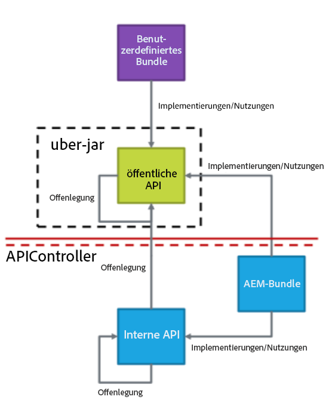
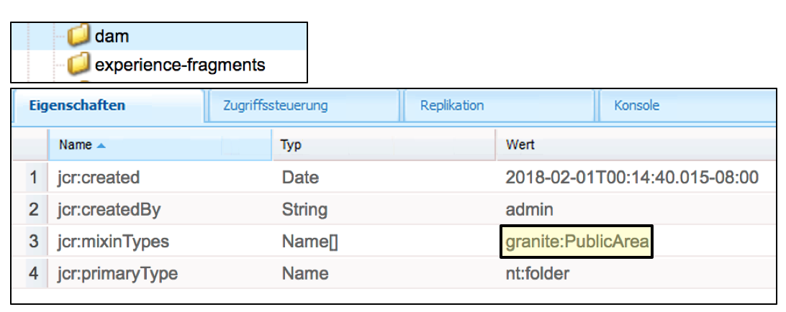
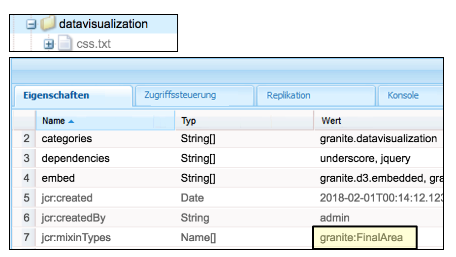
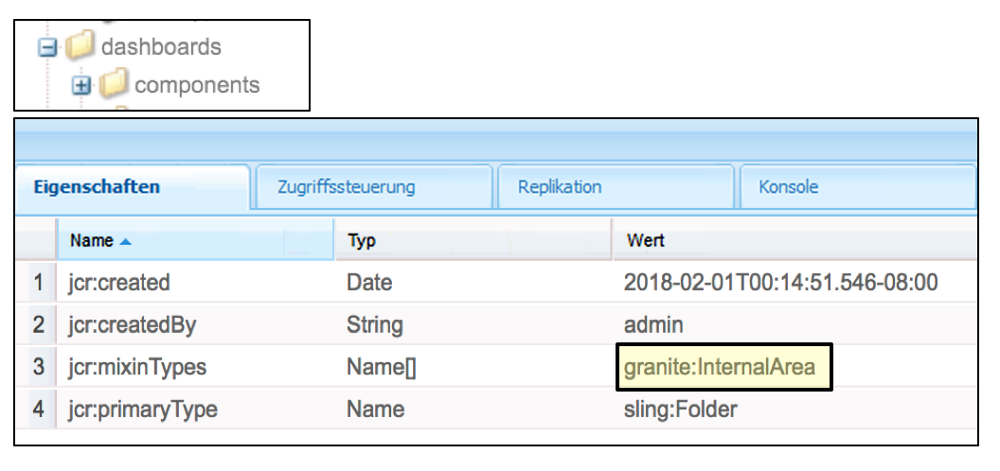
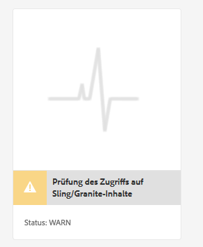
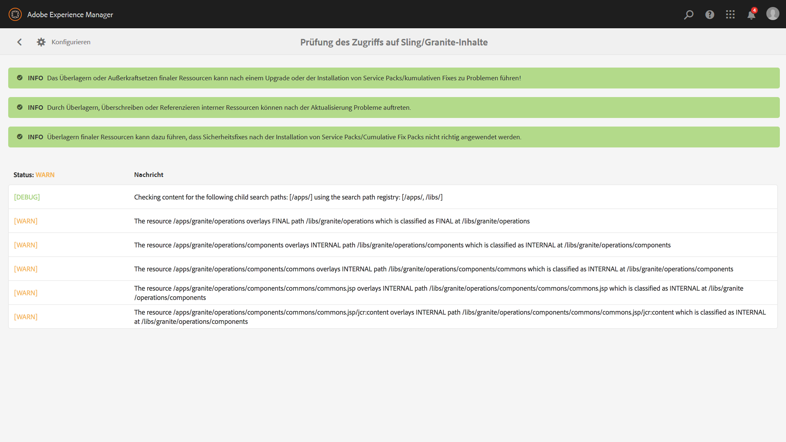
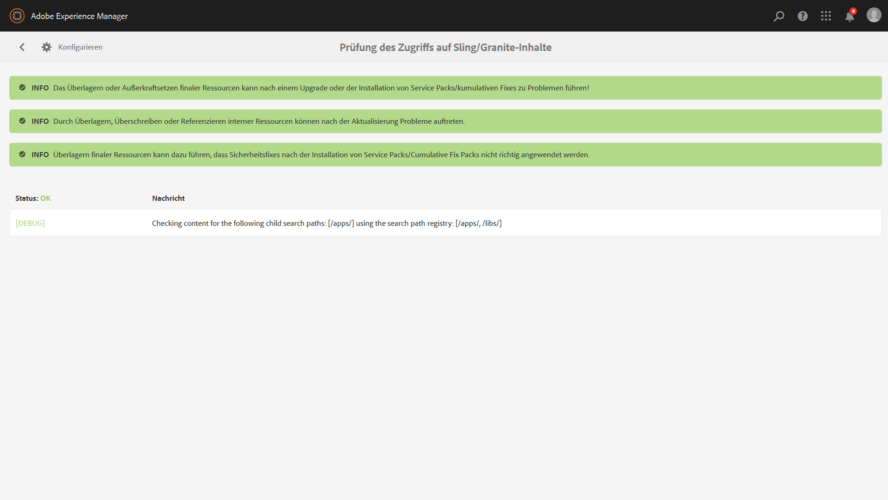

# Nachhaltige Aktualisierungen{#sustainable-upgrades} 

## Anpassungs-Framework {#customization-framework}

### Architektur (funktional/Infrastruktur/Inhalt/Anwendung)  {#architecture-functional-infrastructure-content-application}

Das Anpassungs-Framework hilft Ihnen, Verstöße in nicht erweiterbaren Bereichen des Codes (z. B. APIs) oder des Inhalts (z. B. Überlagerungen) einzuschränken, die Aktualisierungen behindern.

Das Anpassungs-Framework besteht aus zwei Komponenten: **API-Oberfläche** und **Inhaltsklassifizierung**.

#### API-Oberfläche {#api-surface}

In früheren Versionen von AEM wurden viele APIs über das Uber JAR verfügbar gemacht. Einige dieser APIs sollten nicht von Kunden verwendet werden, wurden jedoch verfügbar gemacht, um AEM-Funktionen der Pakete zu unterstützen. In Zukunft werden Java-APIs als „Öffentlich“ oder „Privat“ gekennzeichnet, damit Kunden erkennen, welche APIs im Hinblick auf Aktualisierungen sicher verwendet werden können. Weitere Besonderheiten:

* Als `Public` markierte Java-APIs können von benutzerdefinierten Implementierungspaketen verwendet und referenziert werden.

* Die öffentlichen APIs werden durch die Installation eines Kompatibilitätspakets abwärtskompatibel sein. 
* Das Kompatibilitätspaket wird ein Kompatibilitäts-Uber JAR enthalten, um die Abwärtskompatibilität sicherzustellen. 
* Als `Private` markierte Java-APIs sind nur für die Verwendung AEM internen Bundles vorgesehen und sollten nicht von benutzerdefinierten Bundles verwendet werden.

>[!NOTE]
>
>Das Konzept von `Private` und `Public` in diesem Kontext sollte nicht mit Java-Vorstellungen öffentlicher und privater Klassen verwechselt werden.

#### Inhaltsklassifizierungen {#content-classifications}

AEM hat lange das Prinzip von Überlagerungen und Sling Resource Merger verwendet, um Kunden die Möglichkeit zu bieten, AEM-Funktionen zu erweitern und anzupassen. Vordefinierte Funktionen für die AEM-Konsolen und die Benutzeroberfläche werden in **/libs** gespeichert. Kunden sollten niemals Objekte unter **/libs** ändern, konnten aber zusätzliche Inhalte unter **/apps** hinzufügen, um die in **/libs** definierte Funktionalität zu überlagern und zu erweitern. (Weitere Informationen finden Sie im Beitrag zur Entwicklung mit Überlagerungen.) Dies hat bei der Aktualisierung von AEM zu zahlreichen Problemen geführt, weil teilweise der Inhalt in **/libs** geändert wurde, weshalb die Überlagerungsfunktion auf unerwartete Weise fehlschlug. Kunden konnten AEM-Komponenten außerdem durch Vererbung über `sling:resourceSuperType` erweitern oder einfach durch einen Verweis auf eine Komponente in **/libs** direkt über sling:resourceType. Ähnliche Aktualisierungsprobleme konnten bei Anwendungsfällen mit Verweisen und Außerkraftsetzungen auftreten.

Um dies sicherer zu machen und für Kunden deutlicher zu kennzeichnen, welche Bereiche von **/libs** sie sicher verwenden können, wurde der Inhalt in **/libs** mit den folgenden Mixins klassifiziert:

* **Öffentlich (granite:PublicArea)** - Definiert einen Knoten als „Öffentlich“, damit er überlagert, vererbt (`sling:resourceSuperType`) oder direkt verwendet (`sling:resourceType`) werden kann. Als „Öffentlich“ gekennzeichnete Knoten unter /libs können sicher aktualisiert werden, indem ein Kompatibilitätspaket hinzugefügt wird. Kunden sollten grundsätzlich nur Knoten nutzen, die als „Öffentlich“ gekennzeichnet sind. 

* **Abstrakt (granite:AbstractArea)** - Definiert einen Knoten als „Abstrakt“. Knoten können überlagert oder geerbt werden ( `sling:resourceSupertype`), dürfen jedoch nicht direkt ( `sling:resourceType`) verwendet werden.

* **Endgültig (granite:FinalArea)** - Definiert einen Knoten als „Endgültig“. Als endgültig eingestufte Nodes sollten nicht überlagert oder vererbt werden. Endgültige Knoten können direkt über `sling:resourceType` verwendet werden. Unterknoten der endgültigen Knoten werden standardmäßig als intern eingestuft

* ***Internal (granite:InternalArea)*** *- *Definiert einen Knoten als intern. Als „intern“ klassifizierte Knoten sollten idealerweise nicht überlagert, vererbt oder direkt verwendet werden. Diese Knoten sind ausschließlich für interne Funktionen von AEM vorgesehen.

* **Keine Anmerkung** - Knoten übernehmen die Klassifizierung gemäß der Baumstruktur. Der /-Stamm ist standardmäßig „Öffentlich“. **Knoten mit einem übergeordneten Knoten, der als „Intern“ oder „Endgültig“ klassifiziert ist, werden ebenfalls als „Intern“ behandelt.** 

>[!NOTE]
>
>Diese Richtlinien werden nur für Mechanismen erzwungen, die auf dem Sling-Suchpfad basieren. Andere Bereiche von **/libs** wie eine clientseitige Bibliothek können als `Internal` markiert werden, können aber dennoch mit standardmäßiger clientlib-Einbindung verwendet werden. Es ist wichtig, dass Kunden in diesen Fällen die Klassifizierung „Intern“ beachten.

#### CRXDE Lite-Inhaltstypindikatoren   {#crxde-lite-content-type-indicators}

In CRXDE Lite angewendete Mixins zeigen Inhaltsknoten und Bäume an, die als `INTERNAL` ausgegraut markiert sind. Bei `FINAL` ist nur das Symbol grau ausgeblendet. Die untergeordneten Elemente dieser Knoten werden ebenfalls grau angezeigt. Die Überlagerungsknotenfunktion ist in beiden Fällen deaktiviert.

**Öffentlich**

**Endgültig** 

**Intern**

**Konsistenzprüfung des Inhalts**

>[!NOTE]
>
>Ab AEM 6.5 empfiehlt Adobe die Verwendung des Musterdetektors, um Inhaltszugriffsverletzungen zu erkennen. Musterdetektorberichte sind detaillierter, erkennen mehr Probleme und verringern die Wahrscheinlichkeit von Falsch-Positiv-Werten.
>
>Weitere Informationen finden Sie unter [Überprüfen der Aktualisierungskomplexität mit dem Musterdetektor](/help/sites-deploying/pattern-detector.md).

AEM 6.5 bietet außerdem eine Konsistenzprüfung, die Kunden warnt, wenn überlagerter oder referenzierter Inhalt auf eine Weise verwendet wird, die nicht der Inhaltsklassifizierung entspricht.

Die** Sling/Granite Content Access Check** ist eine neue Gesundheitsprüfung, die das Repository überwacht, um zu sehen, ob der Kundencode fälschlicherweise auf geschützte Knoten in AEM zugreift.

Dabei wird **/apps** gescannt. Dies dauert in der Regel einige Sekunden.

Verfahren Sie wie folgt, um auf diese neue Konsistenzprüfung zuzugreifen:

1. Navigieren Sie auf dem AEM-Startbildschirm zu **Tools > Vorgänge > Konsistenzberichte**.
1. Klicken Sie auf die **Prüfung des Sling/Granite-Inhaltszugriffs**, wie unten gezeigt:

   

Nachdem der Scan abgeschlossen ist, wird eine Liste mit Warnmeldungen angezeigt, die den Endbenutzer des unzulässig referenzierten geschützten Knotens informiert:

Nach der Korrektur der Verstöße wird der Zustand grün angezeigt:

Die Konsistenzprüfung zeigt die Informationen an, die von einem Hintergrunddienst gesammelt werden, der asynchron prüft, sobald eine Überlagerung oder ein Ressourcentyp in allen Sling-Suchpfaden verwendet wird. Wenn Content-Mixins unzulässig verwendet wurden, wird ein Verstoß gemeldet.
