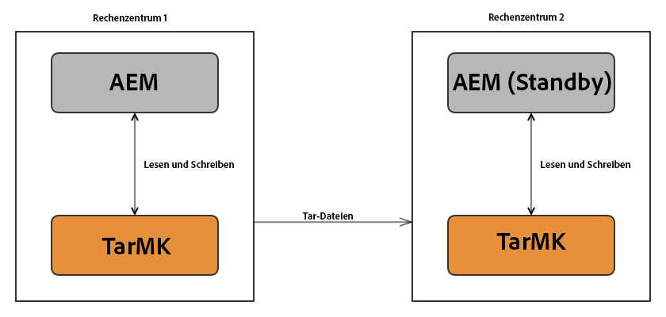

# Ausführen von AEM mit der TarMK-Cold-Standby-Funktion{#how-to-run-aem-with-tarmk-cold-standby}

## Einführung {#introduction}

Durch die Cold-Standby-Funktionalität des Tar-Mikrokernels können eine oder mehr AEM-Standby-Instanzen eine Verbindung mit einer primären Instanz herstellen. Die Synchronisierung ist dabei unidirektional, d. h. sie verläuft nur von der primären zur Standby-Instanz.

Die Standby-Instanz dient dazu sicherzustellen, dass eine Live-Datenkopie des Master-Repositorys vorhanden ist und ein schneller Wechsel ohne Datenverluste durchgeführt wird, wenn das Master-Repository aus irgendeinem Grund nicht verfügbar ist.

Inhalte werden linear zwischen der primären Instanz und den Standby-Instanzen synchronisiert. Dabei werden keine Integritätsprüfungen auf mögliche Datei- oder Repository-Beschädigungen durchgeführt. Aufgrund dieser Konfiguration sind die Standby-Instanzen exakte Kopien der primären Instanz. Sie können nicht dazu beitragen, Inkonsistenzen auf primären Instanzen zu verhindern.

>[!NOTE]
>
>Die Cold-Standby-Funktion ist für Szenarien bestimmt, in denen eine hohe Verfügbarkeit für **author**-Instanzen erforderlich ist. In Situationen, in den eine hohe Verfügbarkeit für **publish**-Instanzen unter Verwendung des Tar-Mikrokernels erforderlich ist, empfiehlt Adobe den Einsatz einer Veröffentlichungsfarm.
>
>Weitere Informationen zu verfügbaren Implementierungen finden Sie auf der Seite [Verfügbare Implementierungen](/help/sites-deploying/recommended-deploys.md). 

>[!NOTE]
>
>Wenn die Standby-Instanz eingerichtet ist oder vom Primären Knoten abgeleitet wird, ermöglicht sie nur den Zugriff auf die folgenden beiden Konsolen (für administrative Aktivitäten):
>
>* CRXDE Lite
>* OSGi-Webkonsole

>
>Andere Konsolen sind nicht verfügbar.

## Funktionsweise {#how-it-works}

Auf der primären AEM-Instanz ist ein TCP-Port geöffnet, der eingehende Nachrichten überwacht. Derzeit senden die Slaves zwei Arten von Nachrichten an den Master:

* Eine Nachricht, die die Segment-ID des aktuellen Heads anfordert.
* Eine Nachricht, die Segmentdaten mit einer angegebenen ID anfordert.

Die Standby-Instanz fordert regelmäßig die Segment-ID des aktuellen Heads der primären Instanz an. Wenn das Segment ein lokal unbekanntes Segment ist, wird es abgerufen. Ist es bereits vorhanden, werden die Segmente verglichen und referenzierte Segmente werden bei Bedarf ebenfalls angefordert.

>[!NOTE]
>
>Standby-Instanzen empfangen keine Anforderungen, da sie nur im Synchronisierungsmodus ausgeführt werden. Der einzige auf einer Standby-Instanz verfügbare Bereich ist die Web-Konsole, um die Konfiguration von Bundles und Diensten zu vereinfachen.

Eine typische TarMK-Cold-Standby-Implementierung: 



## Weitere Merkmale {#other-characteristics}

### Stabilität {#robustness}

Der Datenfluss soll Verbindungs- und Netzwerkprobleme automatisch erkennen und beheben. Alle Pakete sind mit Prüfsummen gebündelt und sobald Verbindungsprobleme oder beschädigte Pakete auftreten, werden Wiederholungsmechanismen ausgelöst.

#### Leistung {#performance}

Die Aktivierung der TarMK-Cold-Standby-Funktion auf der primären Instanz hat fast keine messbaren Auswirkungen auf die Leistung. Der zusätzliche CPU-Verbrauch ist äußerst gering und die zusätzliche Festplatte bzw. die zusätzlichen Netzwerk-I/O dürften keine Leistungsprobleme verursachen.

Auf der Standby-Instanz muss während des Synchronisierungsvorgangs mit einer hohen CPU-Nutzung gerechnet werden. Da es sich nicht um einen Multithread-Prozess handelt, kann dieser nicht durch mehrere Kerne beschleunigt werden. Werden keine Daten geändert oder übertragen, tritt keine messbare Aktivität auf. Die Verbindungsgeschwindigkeit variiert je nach Hardware und Netzwerkumgebung. Sie hängt jedoch nicht von der Größe des Repositorys oder der SSL-Nutzung ab. Dies sollte berücksichtigt werden, wenn die erforderliche Zeit für die Erstsynchronisierung geschätzt wird oder wenn zwischenzeitlich auf dem primären Knoten eine große Menge von Daten geändert wurde.

#### Sicherheit {#security}

Wird davon ausgegangen, dass alle Instanzen, in derselben Intranet-Sicherheitszone ausgeführt werden, ist die Gefahr einer Sicherheitsverletzung deutlich geringer. Sie können trotzdem eine zusätzliche Sicherheitsebene hinzufügen, indem Sie SSL-Verbindungen zwischen den Slaves und dem Master aktivieren. So wird die Wahrscheinlichkeit reduziert, dass Daten durch einen Man-in-the-Middle-Angriff kompromittiert werden.

Darüber hinaus können Sie festlegen, welche Standby-Instanzen eine Verbindung herstellen dürfen, indem Sie die IP-Adressen eingehender Anforderungen beschränken. Damit dürfte sichergestellt sein, dass niemand im Intranet das Repository kopieren kann.

>[!NOTE]
>
>Es wird empfohlen, einen Lastenausgleich zwischen dem Dispatcher und den Servern hinzuzufügen, die Teil der Cold-Standby-Konfiguration bilden. Der Lastenausgleich sollte so konfiguriert werden, dass Benutzer-Traffic nur an die **primäre** Instanz weitergeleitet wird. Dies soll die Konsistenz fördern und verhindern, dass Inhalte auf der Standby-Instanz mit anderen Mitteln als dem Cold-Standby-Mechanismus kopiert werden.

## Erstellen einer TarMK-Cold-Standby-Konfiguration für AEM {#creating-an-aem-tarmk-cold-standby-setup}

>[!CAUTION]
>
>Die PID für den Segment-Knotenspeicher und den Standby-Speicherdienst in AEM 6.3 wurde im Vergleich zu Vorgängerversionen wie folgt geändert:
>
>* von org.apache.jackrabbit.oak.**plugins**.segment.standby.store.StandbyStoreService zu org.apache.jackrabbit.oak.segment.standby.store.StandbyStoreService
>* von org.apache.jackrabbit.oak.**plugins**.segment.SegmentNodeStoreService zu org.apache.jackrabbit.oak.segment.SegmentNodeStoreService

>
>Stellen Sie sicher, dass Sie die erforderlichen Konfigurationsanpassungen vornehmen, um dieser Änderung Rechnung zu tragen.

Um eine TarMK-Cold-Standby-Konfiguration zu erstellen, müssen Sie zuerst die Standby-Instanzen erstellen. Erstellen Sie hierzu an einem neuen Speicherort eine Dateisystemkopie des gesamten Installationsordners der primären Instanz. Anschließend können Sie jede Instanz mit einem Ausführungsmodus starten, der die Rolle der Instanz angibt (`primary` oder `standby`).

Nachfolgend sind die erforderlichen Schritte zum Erstellen einer Konfiguration mit einer Master- und einer Standby-Instanz beschrieben:

1. Installieren Sie AEM.

1. Beenden Sie die Instanz und kopieren Sie deren Installationsordner an den Speicherort, von dem aus die Cold-Standby-Instanz ausgeführt werden soll. Selbst wenn sie auf unterschiedlichen Rechnern ausgeführt wird, müssen Sie jedem Ordner einen aussagekräftigen Namen zuweisen (z. B. *aem-primary* oder *aem-standby*), um zwischen den Instanzen zu unterscheiden.
1. Navigieren Sie zum Installationsordner der primären Instanz und führen Sie folgende Schritte aus:

   1. Überprüfen und löschen Sie alle vorherigen OSGi-Konfigurationen, die Sie unter `aem-primary/crx-quickstart/install` haben

   1. Erstellen Sie einen Ordner mit dem Namen `install.primary` unter `aem-primary/crx-quickstart/install`

   1. Erstellen Sie die erforderlichen Konfigurationen für den bevorzugten Knotenspeicher und Datenspeicher unter `aem-primary/crx-quickstart/install/install.primary`
   1. Erstellen Sie im selben Verzeichnis die Datei `org.apache.jackrabbit.oak.segment.standby.store.StandbyStoreService.config` und konfigurieren Sie sie entsprechend. Weitere Informationen zu den Konfigurationsoptionen finden Sie unter [Konfiguration](/help/sites-deploying/tarmk-cold-standby.md#configuration).

   1. Wenn Sie eine AEM TarMK-Instanz mit einem externen Datenspeicher verwenden, erstellen Sie einen Ordner mit dem Namen `crx3` unter `aem-primary/crx-quickstart/install` mit dem Namen `crx3`

   1. Speichern Sie die Konfigurationsdatei für den Datenspeicher im Ordner `crx3`.

   Wenn Sie beispielsweise eine AEM-TarMK-Instanz mit einer externen Datenspeicherdatei ausführen, benötigen Sie die folgenden Konfigurationsdateien:

   * `aem-primary/crx-quickstart/install/install.primary/org.apache.jackrabbit.oak.segment.SegmentNodeStoreService.config`
   * `aem-primary/crx-quickstart/install/install.primary/org.apache.jackrabbit.oak.segment.standby.store.StandbyStoreService.config`
   * `aem-primary/crx-quickstart/install/crx3/org.apache.jackrabbit.oak.plugins.blob.datastore.FileDataStore.config`

   Nachfolgend finden Sie Beispielkonfigurationen für die primäre Instanz:

   **Beispiel für** **org.apache.jackrabbit.oak.segment.SegmentNodeStoreService.config**

   ```xml
   org.apache.sling.installer.configuration.persist=B"false"
   customBlobStore=B"true"
   standby=B"false"
   ```

   **Beispiel für org.apache.jackrabbit.oak.segment.standby.store.StandbyStoreService.config**

   ```xml
   org.apache.sling.installer.configuration.persist=B"false"
   mode="primary"
   port=I"8023"
   ```

   **Beispiel für org.apache.jackrabbit.oak.plugins.blob.datastore.FileDataStore.config**

   ```xml
   org.apache.sling.installer.configuration.persist=B"false"
   path="./crx-quickstart/repository/datastore"
   minRecordLength=I"16384"
   ```

1. Starten Sie die primäre Instanz und stellen Sie dabei sicher, dass Sie den Ausführungsmodus „primary“ festlegen:

   ```shell
   java -jar quickstart.jar -r primary,crx3,crx3tar
   ```

1. Erstellen Sie einen neuen Apache Sling Logging Logger für das Paket **org.apache.jackrabbit.oak.segment**. Setzen Sie die Protokollebene auf &quot;Debuggen&quot;und verweisen Sie die Protokollausgabe auf eine separate Protokolldatei, z. B. */logs/tarmk-coldstandby.log*. Weitere Informationen finden Sie unter [Protokollierung](/help/sites-deploying/configure-logging.md).
1. Navigieren Sie zum Speicherort der Instanz **standby** und starten Sie diese durch Ausführen der JAR-Datei.
1. Erstellen Sie dieselbe Protokollierungskonfiguration wie für die primäre Instanz. Beenden Sie anschließend die Instanz.
1. Bereiten Sie dann die Standby-Instanz vor. Hierzu können Sie dieselben Schritte wie für die primäre Instanz ausführen:

   1. Löschen Sie alle Dateien, die Sie möglicherweise unter `aem-standby/crx-quickstart/install` haben.
   1. Erstellen Sie einen neuen Ordner mit dem Namen `install.standby` unter `aem-standby/crx-quickstart/install`

   1. Erstellen Sie zwei Konfigurationsdateien mit den folgenden Namen:

      * `org.apache.jackrabbit.oak.segment.SegmentNodeStoreService.config`
      * `org.apache.jackrabbit.oak.segment.standby.store.StandbyStoreService.config`
   1. Erstellen Sie einen neuen Ordner mit dem Namen `crx3` unter `aem-standby/crx-quickstart/install`

   1. Erstellen Sie die Datenspeicherkonfiguration und platzieren Sie sie unter `aem-standby/crx-quickstart/install/crx3`. Für dieses Beispiel müssen Sie die folgende Datei erstellen:

      * org.apache.jackrabbit.oak.plugins.blob.datastore.FileDataStore.config
   1. Bearbeiten Sie die Dateien und erstellen Sie die erforderlichen Konfigurationen.

   Nachfolgend finden Sie Beispiel-Konfigurationsdateien für eine typische Standby-Instanz:

   **Beispiel für org.apache.jackrabbit.oak.segment.SegmentNodeStoreService.config**

   ```xml
   org.apache.sling.installer.configuration.persist=B"false"
   name="Oak-Tar"
   service.ranking=I"100"
   standby=B"true"
   customBlobStore=B"true"
   ```

   **Beispiel für org.apache.jackrabbit.oak.segment.standby.store.StandbyStoreService.config**

   ```xml
   org.apache.sling.installer.configuration.persist=B"false"
   mode="standby"
   primary.host="127.0.0.1"
   port=I"8023"
   secure=B"false"
   interval=I"5"
   standby.autoclean=B"true"
   ```

   **Beispiel für org.apache.jackrabbit.oak.plugins.blob.datastore.FileDataStore.config**

   ```xml
   org.apache.sling.installer.configuration.persist=B"false"
   path="./crx-quickstart/repository/datastore"
   minRecordLength=I"16384"
   ```

1. Starten Sie die **standby**-Instanz über den Ausführungsmodus „standby“:

   ```xml
   java -jar quickstart.jar -r standby,crx3,crx3tar
   ```

Der Dienst kann auch über die Web-Konsole konfiguriert werden. Führen Sie hierzu folgende Schritte aus:

1. Wechseln Sie zur Web-Konsole unter: *https://serveraddress:serverport/system/console/configMgr*
1. Suchen Sie nach einem Dienst namens **Apache Jackrabbit Oak Segment Tar Cold Standby Service** und doppelklicken Sie darauf, um die Einstellungen zu bearbeiten.
1. Speichern Sie die Einstellungen und starten Sie die Instanzen neu, damit die neuen Einstellungen übernommen werden.

>[!NOTE]
>
>Sie können die Rolle einer Instanz jederzeit überprüfen, indem Sie in der Web-Konsole für die Sling-Einstellungen prüfen, ob die Ausführungsmodi **primary** oder **standby** vorhanden sind.
>
>Gehen Sie dazu zu *https://localhost:4502/system/console/status-slingsettings* und überprüfen Sie die Zeile **&quot;Ausführungsmodi&quot;** .

## Erstsynchronisierung {#first-time-synchronization}

Wenn die Vorbereitung abgeschlossen ist und die Standby-Instanz zum ersten Mal gestartet wird, tritt erhöhter Netzwerk-Traffic zwischen den Instanzen auf, da die Standby-Instanzen mit der primären Instanz synchronisiert werden. Anhand der Protokolle können Sie den Status der Synchronisierung überprüfen.

Im Protokoll *tarmk-coldstandby.log* werden dabei Einträge wie die folgenden angezeigt:

```xml
    *DEBUG* [defaultEventExecutorGroup-2-1] org.apache.jackrabbit.oak.segment.standby.store.StandbyStore trying to read segment ec1f739c-0e3c-41b8-be2e-5417efc05266

    *DEBUG* [nioEventLoopGroup-3-1] org.apache.jackrabbit.oak.segment.standby.codec.SegmentDecoder received type 1 with id ec1f739c-0e3c-41b8-be2e-5417efc05266 and size 262144

    *DEBUG* [defaultEventExecutorGroup-2-1] org.apache.jackrabbit.oak.segment.standby.store.StandbyStore got segment ec1f739c-0e3c-41b8-be2e-5417efc05266 with size 262144

    *DEBUG* [defaultEventExecutorGroup-2-1] org.apache.jackrabbit.oak.segment.file.TarWriter Writing segment ec1f739c-0e3c-41b8-be2e-5417efc05266 to /mnt/crx/author/crx-quickstart/repository/segmentstore/data00016a.tar
```

Im Protokoll *error.log* der Standby-Instanz wird folgender Eintrag angezeigt:

```xml
*INFO* [FelixStartLevel] org.apache.jackrabbit.oak.segment.standby.store.StandbyStoreService started standby sync with 10.20.30.40:8023 at 5 sec.
```

Im obigen Protokollausschnitt ist *10.20.30.40* die IP-Adresse der primären Instanz.

Im Protokoll *tarmk-coldstandby.log* der Instanz **primary** werden Einträge wie die folgenden angezeigt:

```xml
    *DEBUG* [nioEventLoopGroup-3-2] org.apache.jackrabbit.oak.segment.standby.store.CommunicationObserver got message ‘s.d45f53e4-0c33-4d4d-b3d0-7c552c8e3bbd’ from client c7a7ce9b-1e16-488a-976e-627100ddd8cd

    *DEBUG* [nioEventLoopGroup-3-2] org.apache.jackrabbit.oak.segment.standby.server.StandbyServerHandler request segment id d45f53e4-0c33-4d4d-b3d0-7c552c8e3bbd

    *DEBUG* [nioEventLoopGroup-3-2] org.apache.jackrabbit.oak.segment.standby.server.StandbyServerHandler sending segment d45f53e4-0c33-4d4d-b3d0-7c552c8e3bbd to /10.20.30.40:34998

    *DEBUG* [nioEventLoopGroup-3-2] org.apache.jackrabbit.oak.segment.standby.store.CommunicationObserver did send segment with 262144 bytes to client c7a7ce9b-1e16-488a-976e-627100ddd8cd
```

In diesem Fall ist der im Protokoll genannte „Client“ die Instanz **standby**.

Wenn diese Einträge nicht mehr im Protokoll angezeigt werden, können Sie davon ausgehen, dass der Synchronisierungsvorgang abgeschlossen ist.

Obwohl die obigen Einträge zeigen, dass der Abrufmechanismus ordnungsgemäß funktioniert, ist es häufig hilfreich festzustellen, ob bei Abrufvorgängen Daten synchronisiert werden. Suchen Sie hierzu nach Einträgen wie den folgenden:

```xml
*DEBUG* [defaultEventExecutorGroup-156-1] org.apache.jackrabbit.oak.segment.file.TarWriter Writing segment 3a03fafc-d1f9-4a8f-a67a-d0849d5a36d5 to /<<CQROOTDIRECTORY>>/crx-quickstart/repository/segmentstore/data00014a.tar
```

Darüber hinaus werden bei der Ausführung über einen nicht freigegebenen `FileDataStore` Meldungen wie die folgenden angezeigt, die bestätigen, dass die Binärdateien ordnungsgemäß übertragen werden:

```xml
*DEBUG* [nioEventLoopGroup-228-1] org.apache.jackrabbit.oak.segment.standby.codec.ReplyDecoder received blob with id eb26faeaca7f6f5b636f0ececc592f1fd97ea1a9#169102 and size 169102
```

### Konfiguration {#configuration}

Die folgenden OSGi-Einstellungen sind für den Cold-Standby-Dienst verfügbar:

* **Konfiguration beibehalten:** Bei Aktivierung dieser Option wird die Konfiguration im Repository anstatt wie üblich in den OSGi-Konfigurationsdateien gespeichert. Es wird empfohlen, diese Einstellung auf Produktionssystemen zu deaktivieren, damit die Konfiguration der primären Instanz nicht von der Standby-Instanz abgerufen wird.

* **Modus (`mode`):** Dadurch wird der Ausführungsmodus der Instanz ausgewählt.

* **Port (port):** Der für die Kommunikation zu verwendende Port. Der Standardwert lautet `8023`.

* **Primärer Host (`primary.host`):**  - der Host der primären Instanz. Diese Einstellung gilt nur für die Standby-Instanz.
* **Synchronisierungsintervall (`interval`):**  Diese Einstellung bestimmt das Intervall zwischen der Synchronisierungsanforderung und gilt nur für die Standby-Instanz.

* **Zulässige IP-Bereiche (`primary.allowed-client-ip-ranges`):**  - die IP-Bereiche, aus denen die primäre Instanz Verbindungen zulässt.
* **Sicher (`secure`):** Aktivieren Sie die SSL-Verschlüsselung. Damit Sie die Einstellung nutzen können, muss sie auf allen Instanzen aktiviert werden.
* **Standby-Lesezeitlimit (`standby.readtimeout`):**  Zeitüberschreitung für von der Standby-Instanz ausgegebene Anforderungen in Millisekunden. Der Standardwert ist 60000 (eine Minute).

* **Automatische Bereinigung im Standby-Modus (`standby.autoclean`):**  Rufen Sie die Bereinigungsmethode auf, wenn die Größe des Stores in einem Synchronisierungszyklus zunimmt.

>[!NOTE]
>
>Es wird dringend empfohlen, den primären und Standby-Instanzen unterschiedliche Repository-IDs zuzuweisen, damit sie für Dienste wie die Abladung einzeln identifizierbar sind.
>
>Am einfachsten geschieht dies durch Löschen der Datei *sling.id* auf der Standby-Instanz und Neustarten der Instanz.

## Failover-Verfahren {#failover-procedures}

Für den Fall, dass die primäre Instanz aus irgendeinem Grund ausfällt, können Sie festlegen, dass eine der Standby-Instanzen die Rolle der primären Instanz übernimmt. Hierzu müssen Sie den Ausführungsmodus für den Start wie nachfolgend beschrieben ändern:

>[!NOTE]
>
>Auch die Konfigurationsdateien müssen so modifiziert werden, dass sie den Einstellungen der Primärinstanz entsprechen.

1. Navigieren Sie zum Speicherort der installierten Standby-Instanz und beenden Sie sie.

1. Wenn Sie bei der Einrichtung einen Lastenausgleich konfiguriert haben, können Sie jetzt die primäre Instanz aus der Konfiguration des Lastenausgleichs entfernen.
1. Erstellen Sie eine Sicherungskopie des Ordners `crx-quickstart`, der im Installationsordner der Standby-Instanz zu finden ist. Sie kann als Basis für die Konfiguration einer neuen Standby-Instanz verwendet werden.

1. Starten Sie die Instanz über den Ausführungsmodus `primary` neu:

   ```shell
   java -jar quickstart.jar -r primary,crx3,crx3tar
   ```

1. Fügen Sie die neue primäre Instanz zum Lastenausgleich hinzu.
1. Erstellen und starten Sie eine neue Standby-Instanz. Weitere Informationen finden Sie im oben beschriebenen Verfahren [Erstellen einer TarMK-Cold-Standby-Konfiguration für AEM](/help/sites-deploying/tarmk-cold-standby.md#creating-an-aem-tarmk-cold-standby-setup).

## Anwenden von Hotfixes auf eine Cold-Standby-Konfiguration {#applying-hotfixes-to-a-cold-standby-setup}

Die empfohlene Methode zum Anwenden von Hotfixes auf eine Cold-Standby-Konfiguration besteht darin, sie auf der primären Instanz zu installieren und diese dann mit den installierten Hotfixes als neue Cold-Standby-Instanz zu klonen.

Führen Sie hierzu die nachfolgend beschriebenen Schritte aus:

1. Beenden Sie den Synchronisierungsprozess auf der Cold-Standby-Instanz, indem Sie zur JMX-Konsole navigieren und die **org.apache.jackrabbit.oak verwenden: Status (&quot;Standby&quot;)**Bean. Weitere Informationen dazu finden Sie im Abschnitt zu [Monitoring](#monitoring).
1. Beenden Sie die Cold-Standby-Instanz.
1. Installieren Sie den Hotfix auf der primären Instanz. Weitere Informationen zum Installieren eines Hotfixes finden Sie unter [Arbeiten mit Paketen](/help/sites-administering/package-manager.md).
1. Testen Sie die Instanz nach der Installation auf mögliche Probleme.
1. Entfernen Sie die Cold-Standby-Instanz durch Löschen des entsprechenden Installationsordners.
1. Beenden Sie die primäre Instanz und klonen Sie sie. Erstellen Sie hierzu eine Dateisystemkopie des gesamten Installationsordners am Speicherort der Cold-Standby-Instanz.
1. Konfigurieren Sie den neu erstellten Klon so, dass er als Cold-Standby-Instanz fungiert. Weitere Einzelheiten hierzu finden Sie unter [Erstellen einer TarMK-Cold-Standby-Konfiguration für AEM](/help/sites-deploying/tarmk-cold-standby.md#creating-an-aem-tarmk-cold-standby-setup).
1. Starten Sie die primäre und die Cold-Standby-Instanzen.

## Überwachung {#monitoring}

Diese Funktion stellt Informationen mithilfe von JMX oder MBeans bereit. So können Sie den aktuellen Status der Standby- und Master-Instanz mithilfe der [JMX-Konsole](/help/sites-administering/jmx-console.md) überprüfen. Die Informationen finden Sie in einem MBean von `type org.apache.jackrabbit.oak:type="Standby"`mit dem Namen `Status`.

**Standby**-Instanz

Beim Überwachen einer Standby-Instanz wird ein Knoten angezeigt. Die ID ist normalerweise eine generische UUID.

Dieser Knoten verfügt über fünf schreibgeschützte Attribute:

* `Running:` Ein boolescher Wert, der angibt, ob der Synchronisierungsvorgang ausgeführt wird oder nicht.

* `Mode:` Client: gefolgt von der UUID, die zur Identifizierung der Instanz verwendet wird. Beachten Sie, dass sich die UUID bei jeder Aktualisierung der Konfiguration ändert. 

* `Status:` eine Textdarstellung des aktuellen Status (wie  `running` oder  `stopped`).

* `FailedRequests:`Die Anzahl aufeinanderfolgender Fehler.
* `SecondsSinceLastSuccess:` die Anzahl der Sekunden seit der letzten erfolgreichen Kommunikation mit dem Server. Er zeigt `-1` an, wenn keine erfolgreiche Kommunikation stattgefunden hat.

Darüber hinaus gibt es drei aufrufbare Methoden:

* `start():` startet den Synchronisierungsprozess.
* `stop():` stoppt den Synchronisierungsprozess.
* `cleanup():` Führt den Bereinigungsvorgang auf der Standby-Instanz durch.

**Primäre Instanz**

Beim Überwachen der primären Instanz wird eine Reihe allgemeiner Informationen über ein MBean angezeigt, dessen ID-Value die Port-Nummer ist, die vom TarMK-Standby-Dienst verwendet wird (standardmäßig 8023). Die meisten Methoden und Attribute sind dieselben wie für die Standby-Instanz, mit einigen Ausnahmen:

* `Mode:` zeigt immer den Wert  `primary`an.

Desweiteren können Informationen für bis zu 10 Clients (Standby-Instanzen) abgerufen werden, die mit der Master-Instanz verbunden sind. Die MBean-ID ist die UUID der Instanz. Für diese MBeans sind keine aufrufbaren Methoden vorhanden, jedoch einige nützliche, schreibgeschützte Attribute:

* `Name:` Dies ist die ID des Clients.
* `LastSeenTimestamp:` Der Zeitstempel der letzten Anforderungen in Textform.
* `LastRequest:` Die letzte Anforderung des Clients.
* `RemoteAddress:` Die IP-Adresse des Clients.
* `RemotePort:` Der vom Client für die letzte Anforderung verwendete Port.
* `TransferredSegments:` Die Gesamtanzahl der an diesen Client übertragenen Segmente.
* `TransferredSegmentBytes:`Die Gesamtzahl der an diesen Client übertragenen Byte.

## Wartung des Cold-Standby-Repositorys {#cold-standby-repository-maintenance}

### Revisionsbereinigung {#revision-clean}

>[!NOTE]
>
>Wenn Sie auf der primären Instanz die [Online-Revisionsbereinigung](/help/sites-deploying/revision-cleanup.md) ausführen, ist das im Folgenden vorgestellte manuelle Verfahren nicht erforderlich. Wenn Sie die Online-Revisionsbereinigung verwenden, wird der `cleanup ()`-Vorgang auf der Standby-Instanz automatisch ausgeführt.

>[!NOTE]
>
>Führen Sie auf der Standby-Instanz keine Offline-Revisionsbereinigung aus. Dies ist nicht erforderlich und die Größe des Segmentspeichers wird dadurch nicht reduziert.

Adobe empfiehlt, regelmäßige Wartungsarbeiten durchzuführen, um ein übermäßiges Repository-Wachstum im Laufe der Zeit zu verhindern. Führen Sie zum manuellen Warten des Cold-Standby-Repositorys die folgenden Schritte aus:

1. Beenden Sie den Standby-Prozess auf der Standby-Instanz. Wechseln Sie dazu zur JMX-Konsole und verwenden Sie das Bean **org.apache.jackrabbit.oak: Status (&quot;Standby&quot;)**. Weitere Informationen finden Sie im obigen Abschnitt zur [Überwachung](/help/sites-deploying/tarmk-cold-standby.md#monitoring).

1. Beenden Sie die primäre AEM-Instanz.
1. Führen Sie auf der primären Instanz das Oak-Komprimierungs-Tool aus. Weitere Informationen finden Sie unter [Warten des Repositorys](/help/sites-deploying/storage-elements-in-aem-6.md#maintaining-the-repository).
1. Starten Sie die primäre Instanz.
1. Starten Sie den Standby-Prozess auf der Standby-Instanz. Verwenden Sie dazu dasselbe JMX-Bean wie im ersten Schritt beschrieben.
1. Überwachen Sie die Protokolle und warten Sie, bis die Synchronisierung abgeschlossen ist. Möglicherweise nimmt die Größe des Standby-Repositorys jetzt erheblich zu.
1. Führen Sie den Vorgang `cleanup()` auf der Standby-Instanz aus, indem Sie dasselbe JMX-Bean verwenden, wie im ersten Schritt beschrieben.

Es kann länger als üblich dauern, bis die Synchronisierung der Standby-Instanz mit der primären Instanz abgeschlossen ist, da bei der Offline-Komprimierung der Repository-Verlauf neu geschrieben wird und die Berechnung von Änderungen in den Repositorys deshalb länger dauert. Ebenfalls zu beachten ist, dass das Repository auf der Standby-Instanz nach Abschluss des Vorgangs etwa dieselbe Größe hat wie das Repository auf der primären Instanz.

Alternativ dazu kann das Repository der primären Instanz nach Durchführung der Komprimierung auf der primären Instanz manuell auf die Standby-Instanz kopiert werden, wodurch die Standby-Instanz bei jeder Komprimierung neu erstellt wird.

### Automatische Datenspeicherbereinigung {#data-store-garbage-collection}

Es ist wichtig, hin und wieder eine Speicherbereinigung (Garbage Collection) für die Dateidatenspeicher-Instanz durchzuführen, da andernfalls gelöschte Binärdateien im Dateisystem bleiben und mit der Zeit den Festplattenspeicherplatz belegen. Gehen Sie wie folgt vor, um eine Speicherbereinigung durchzuführen:

1. Führen Sie die Wartung des Cold-Standby-Repositorys aus, wie im Abschnitt [über](/help/sites-deploying/tarmk-cold-standby.md#cold-standby-repository-maintenance) beschrieben.
1. Wenn die Wartung abgeschlossen und die Instanz neu gestartet wurde, führen Sie die folgenden Schritte aus:

   * Führen Sie auf der primären Instanz die automatische Datenspeicherbereinigung über das entsprechende JMX-Bean aus, wie in [diesem Artikel](/help/sites-administering/data-store-garbage-collection.md#running-data-store-garbage-collection-via-the-jmx-console) beschrieben.
   * Auf der Standby-Instanz ist die automatische Datenspeicherbereinigung nur über das MBean **BlobGarbageCollection** - `startBlobGC()` verfügbar. Das MBean &quot;RepositoryManagement&quot;ist nicht auf der Standby-Instanz verfügbar.

   >[!NOTE]
   >
   >Wenn Sie keinen freigegebenen Datenspeicher verwenden, muss die Speicherbereinigung zuerst auf der primären und dann auf der Standby-Instanz ausgeführt werden.
