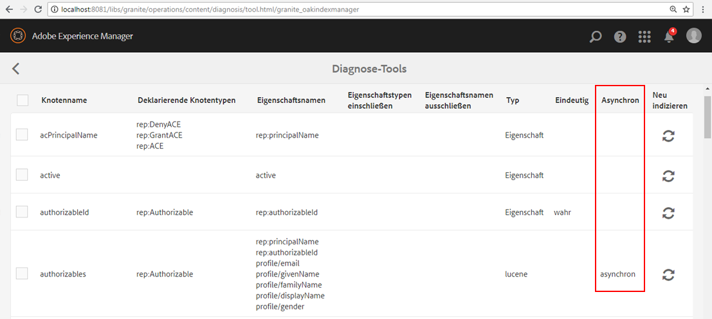

# Fehlerbehebung bei Oak-Indizes{#troubleshooting-oak-indexes}

## Langsame Neuindizierung  {#slow-re-indexing}

Der interne Neuindizierungsprozess von AEM erfasst Repository-Daten und speichert sie in Oak-Indizes, um eine leistungsfähige Inhaltsabfrage zu unterstützen. Bei außergewöhnlichen Umständen kann der Vorgang langsam werden oder sogar anhalten. Diese Seite dient als Anleitung zur Fehlerbehebung, um festzustellen, ob die Indizierung langsam ist, die Ursache zu finden und das Problem zu beheben.

Es ist wichtig, zwischen einer Neuindizierung, die unangemessen lange dauert, und einer Neuindizierung zu unterscheiden, die viel Zeit in Anspruch nimmt, da sie große Mengen von Inhalten indiziert. Die Zeit, die für die Indizierung von Inhalten benötigt wird, hängt beispielsweise von der Menge der Inhalte ab, sodass die Neuindizierung großer Produktions-Repositorys länger dauert als die kleiner Entwicklungs-Repositorys.

In den [Best Practices für Abfragen und Indizierung](/help/sites-deploying/best-practices-for-queries-and-indexing.md) finden Sie weitere Informationen darüber, wann und wie Inhalte neu indiziert werden sollten.

## Anfängliche Erkennung {#initial-detection}

Um eine langsame Indizierung anfänglich zu erkennen, müssen die `IndexStats`-JMX-MBeans überprüft werden. Klicken Sie auf die betroffene AEM-Instanz und gehen Sie wie folgt vor:

1. Öffnen Sie die Web-Konsole und klicken Sie auf die Registerkarte „JMX“. Oder wechseln Sie zu https://&lt;Host>:&lt;Port>/system/console/jmx (z. B. [http://localhost:4502/system/console/jmx](http://localhost:4502/system/console/jmx)).
1. Navigieren Sie zu den `IndexStats`-MBeans.
1. Öffnen Sie die `IndexStats`-MBeans für `async` und `fulltext-async`.

1. Überprüfen Sie für beide MBeans, ob die Zeitstempel **Done** und **LastIndexTime** weniger als 45 Minuten zurückliegen.

1. Falls für eines der MBeans der Zeitstempel (**Done** oder **LastIndexedTime**) mehr als 45 Minuten zurückliegt, dauert der Indizierungsvorgang zu lange oder ist fehlgeschlagen. Dies Problem führt dazu, dass die asynchronen Indizes veraltet sind.

## Die Indizierung wird nach einem erzwungenen Herunterfahren angehalten {#indexing-is-paused-after-a-forced-shutdown}

Ein erzwungenes Herunterfahren führt dazu, dass AEM die asynchrone Indizierung für bis zu 30 Minuten nach dem Neustart aussetzt. Für den ersten Durchgang der Neuindizierung werden in der Regel weitere 15 Minuten benötigt, sodass sich die Gesamtdauer auf etwa 45 Minuten beläuft (dies entspricht dem Zeitrahmen von 45 Minuten für die [anfängliche Erkennung](/help/sites-deploying/troubleshooting-oak-indexes.md#initial-detection)). Wenn die Indizierung nach einem erzwungenen Herunterfahren angehalten wird:

1. Ermitteln Sie zunächst, ob die AEM-Instanz erzwungen heruntergefahren wurde (der AEM-Prozess wurde zwangsweise beendet, oder es kam zu einem Stromausfall) und später neu gestartet wurde.

   * Hierfür kann die [AEM-Protokollierung](/help/sites-deploying/configure-logging.md) überprüft werden.

1. Wenn ein erzwungenes Herunterfahren stattgefunden hat, setzt AEM beim Neustart die Neuindizierung automatisch für bis zu 30 Minuten aus.
1. Warten Sie etwa 45 Minuten, bis AEM normale asynchrone Indizierungsvorgänge wieder aufnehmen kann.

## Thread-Pool überlastet {#thread-pool-overloaded}

>[!NOTE]
>
>Stellen Sie bei AEM 6.1 sicher, dass [AEM 6.1 CFP 11](https://experienceleague.adobe.com/docs/experience-manager-release-information/aem-release-updates/previous-updates/aem-previous-versions.html?lang=de) installiert ist.

In Ausnahmefällen kann der Thread-Pool, der zur Verwaltung der asynchronen Indizierung verwendet wird, überlastet werden. Um den Indizierungsvorgang zu isolieren, kann ein Thread-Pool konfiguriert werden, um zu verhindern, dass andere AEM-Vorgänge die Fähigkeit von Oak beeinträchtigen, Inhalte rechtzeitig zu indizieren. Gehen Sie in solchen Fällen wie folgt vor:

1. Definieren Sie einen neuen, isolierten Thread-Pool für den Apache Sling Scheduler, um ihn für die asynchrone Indizierung zu verwenden:

   * Nagivieren Sie auf der betroffenen AEM-Instanz zu „AEM-OSGi-Web-Konsole“ > „OSGi“ > „Konfiguration“ > „Apache Sling Scheduler“ oder zu https://&lt;Host>:&lt;Port>/system/console/configMgr (beispielsweise [http://localhost:4502/system/console/configMgr](http://localhost:4502/system/console/configMgr)).
   * Fügen Sie dem Feld „Zulässige Thread-Pools“ einen Eintrag mit dem Wert „oak“ hinzu.
   * Um die Änderungen zu speichern, klicken Sie unten rechts auf **Speichern**.

   

1. Überprüfen Sie, dass der neue Thread-Pool in Apache Sling Scheduler registriert ist und in der Statusanzeige der Web-Konsole von Apache Sling Scheduler angezeigt wird.

   * Navigieren Sie zu „AEM-OSGi-Web-Konsole“ > „Status“ > „Sling Scheduler“ oder zu https://&lt;Host>:&lt;Port>/system/console/status-slingscheduler (beispielsweise [http://localhost:4502/system/console/status-slingscheduler](http://localhost:4502/system/console/status-slingscheduler)).
   * Stellen Sie sicher, dass die folgenden Pool-Einträge vorhanden sind:

      * ApacheSlingoak
      * ApacheSlingdefault

   

## Beobachtungswarteschlange ist voll {#observation-queue-is-full}

Wenn in kurzer Zeit zu viele Änderungen und Commits am Repository vorgenommen werden, kann sich die Indizierung aufgrund einer vollen Beobachtungswarteschlange verzögern. Bestimmen Sie zunächst, ob die Beobachtungswarteschlange voll ist:

1. Wechseln Sie zur Web-Konsole und klicken Sie auf die Registerkarte „JMX“. Oder wechseln Sie zu https://&lt;Host>:&lt;Port>/system/console/jmx (beispielsweise [http://localhost:4502/system/console/jmx](http://localhost:4502/system/console/jmx)).
1. Öffnen Sie im Oak-Repository das Statistik-MBean und überprüfen Sie, ob einer der Werte für `ObservationQueueMaxLength` mehr als 10.000 beträgt.

   * Bei normalem Betrieb wird dieser Höchstwert letztendlich auf null reduziert (insbesondere im Abschnitt `per second`). Überprüfen Sie daher, ob der Sekundenwert für `ObservationQueueMaxLength` 0 beträgt.
   * Wenn die Werte 10.000 oder höher sind und stetig zunehmen, deutet dies darauf hin, dass mindestens eine Warteschlange (möglicherweise mehrere) nicht so schnell verarbeitet werden kann, wie neue Änderungen (Commits) auftreten.
   * Jede Beobachtungswarteschlange hat einen Grenzwert (standardmäßig 10,000). Wenn dieser Grenzwert erreicht ist, verschlechtert sich die Verarbeitung der Warteschlange.
   * Bei Verwendung von MongoMK verschlechtert sich die interne Leistung des Oak-Cache mit zunehmender Warteschlangengröße. Diese Korrelation zeigt sich in der größeren `missRate` beim `DocChildren`-Cache im Statistik-MBean `Consolidated Cache`.

1. Um zu vermeiden, dass die zulässigen Grenzwerte für Beobachtungswarteschlangen überschritten werden, wird Folgendes empfohlen:

   * Verringern Sie die konstante Rate von Commits. Kurze Spitzen bei den Commits sind akzeptabel, aber die konstante Rate sollte reduziert werden.
   * Vergrößern Sie den `DiffCache` wie unter [Tipps zur Leistungsoptimierung > Mongo-Speicheroptimierung > Dokument-Cache-Größe](/help/sites-deploying/configuring-performance.md) beschrieben.

## Identifizieren und Beheben eines stecken gebliebenen Neuindizierungsprozesses {#identifying-and-remediating-a-stuck-re-indexing-process}

Die Neuindizierung kann unter zwei Bedingungen als „völlig stecken geblieben“ betrachtet werden:

* Die Neuindizierung verläuft langsam bis zu dem Punkt, an dem in den Protokolldateien kein signifikanter Fortschritt mehr bezüglich der Anzahl der durchlaufenen Knoten gemeldet wird.

   * Wenn beispielsweise im Laufe einer Stunde keine Nachrichten vorhanden sind oder der Fortschritt so langsam ist, dass die Fertigstellung mindestens eine Woche dauert.

* Die Neuindizierung bleibt in einer Endlosschleife stecken, wenn im Indizierungs-Thread wiederholt Ausnahmen in den Protokolldateien erscheinen (z. B. `OutOfMemoryException`). Die Wiederholung einer oder mehrerer gleicher Ausnahmen im Protokoll deutet darauf hin, dass Oak wiederholt versucht, dieselbe Sache zu indizieren, aber jedes Mal an demselben Problem scheitert.

Gehen Sie wie folgt vor, um einen blockierten Neuindizierungsprozess zu identifizieren und zu beheben:

1. Um die Ursache für eine stecken gebliebene Indizierung zu ermitteln, müssen die folgenden Informationen erfasst werden:

   * Sammeln Sie für 5 Minuten Thread-Speicherauszüge, alle zwei Sekunden einen.
   * [Legen Sie die DEBUG-Ebene und die Protokolle für die Appender fest](/help/sites-deploying/configure-logging.md).

      * *org.apache.jackrabbit.oak.plugins.index.AsyncIndexUpdate*
      * *org.apache.jackrabbit.oak.plugins.index.IndexUpdate*

   * Erfassen Sie die Daten aus dem asynchronen `IndexStats`-MBean:

      * Navigieren Sie zu AEM OSGi-Web-Konsole > Hauptfenster > JMX > IndexStat > async

        oder gehen Sie zu [http://localhost:4502/system/console/jmx/org.apache.jackrabbit.oak%3Aname%3Dasync%2Ctype%3DIndexStats](http://localhost:4502/system/console/jmx/org.apache.jackrabbit.oak%3Aname%3Dasync%2Ctype%3DIndexStats)

   * Verwenden Sie den Befehl [oak-run.jar&#39;s console mode](https://github.com/apache/jackrabbit-oak/tree/trunk/oak-run), um Details zum *`/:async`*-Knoten abzurufen.
   * Erfassen Sie anhand des `CheckpointManager`-MBean eine Liste der Repository-Checkpoints:

      * AEM OSGi-Web-Konsole > Hauptfenster > JMX > CheckpointManager > listCheckpoints()

        oder gehen Sie zu [http://localhost:4502/system/console/jmx/org.apache.jackrabbit.oak%3Aname%3DSegment+node+store+checkpoint+management%2Ctype%3DCheckpointManager](http://localhost:4502/system/console/jmx/org.apache.jackrabbit.oak%3Aname%3DSegment+node+store+checkpoint+management%2Ctype%3DCheckpointManager)

1. Wenn Sie alle in Schritt 1 genannten Informationen erfasst haben, starten Sie AEM neu.

   * Ein Neustart von AEM kann das Problem lösen, wenn eine hohe gleichzeitige Belastung vorliegt (Überlauf der Beobachtungswarteschlange o. ä.).
   * Wenn ein Neustart das Problem nicht behebt, wenden Sie sich an die [Adobe-Kundenunterstützung](https://experienceleague.adobe.com/?lang=de&amp;support-solution=General&amp;support-tab=home#support) und geben Sie alle in Schritt 1 erfassten Informationen an.

## Sicheres Abbrechen der asynchronen Neuindizierung {#safely-aborting-asynchronous-re-indexing}

Die Neuindizierung kann über die Indizierungsspuren `async, async-reindex` und f`ulltext-async` (`IndexStats` Mbean) sicher abgebrochen werden, d. h. sie wird gestoppt, bevor sie abgeschlossen ist. Weitere Informationen finden Sie auch in der Dokumentation zu Apache Oak im Abschnitt [Abbrechen der Neuindizierung](https://jackrabbit.apache.org/oak/docs/query/indexing.html#abort-reindex). Beachten Sie außerdem Folgendes:

* Die Neuindizierung von Lucene und Lucene-Eigenschaftenindizes kann abgebrochen werden, da sie von Natur aus asynchron sind.
* Die Neuindizierung von Oak-Eigenschaftenindizes kann nur abgebrochen werden, wenn die Neuindizierung über das `PropertyIndexAsyncReindexMBean` initiiert wurde.

Gehen Sie wie folgt vor, um die Neuindizierung sicher abzubrechen:

1. Identifizieren Sie das IndexStats-MBean, das die Neuindizierungsspur steuert, die angehalten werden muss.

   * Navigieren Sie über die JMX-Konsole zum gewünschten IndexStats-MBean. Wechseln Sie dazu entweder zu „AEM-OSGi-Web-Konsole“ > „Haupt“ > „JMX“ oder zu https://&lt;host>:&lt;port>/system/console/jmx (beispielsweise [http://localhost:4502/system/console/jmx](http://localhost:4502/system/console/jmx)).
   * Öffnen Sie das IndexStats-MBean auf der Grundlage der Neuindizierungsspur, die Sie stoppen möchten (`async`, `async-reindex` oder `fulltext-async`)

      * Um die richtige Spur und die zugehörige Instanz des IndexStats-MBeans zu ermitteln, durchsuchen Sie die Oak-Indexeigenschaft „async“. Die Eigenschaft „async“ enthält den Spurnamen: `async`, `async-reindex`, oder `fulltext-async`.
      * Die Spur ist auch durch Zugriff auf den Index-Manager von AEM in der Spalte „Async“ verfügbar. Um auf den Index-Manager zuzugreifen, navigieren Sie zu „Vorgänge“ > „Diagnose“ > „Index-Manager“.

   

1. Rufen Sie den Befehl `abortAndPause()` auf dem entsprechenden `IndexStats`-MBean auf.
1. Markieren Sie die entsprechende Oak-Indexdefinition, um zu verhindern, dass die Neuindizierung fortgesetzt wird, wenn die Indizierungsspur fortgesetzt wird.

   * Wenn Sie einen **vorhandenen** Index neu indizieren, setzen Sie die Eigenschaft für die Neuindizierung auf „false“.

      * `/oak:index/someExistingIndex@reindex=false`

   * Oder tun Sie andernfalls für einen **neuen** Index Folgendes:

      * Setzen Sie entweder die Eigenschaft „Typ“ auf „deaktiviert“

         * `/oak:index/someNewIndex@type=disabled`

      * oder entfernen Sie die Indexdefinition ganz

   Übertragen Sie die Änderungen nach Abschluss in das Repository.

1. Setzen Sie schließlich die asynchrone Indizierung auf der abgebrochenen Indizierungsspur fort.

   * Rufen Sie im `IndexStats`-MBean, das den`abortAndPause()`-Befehl in Schritt 2 ausgegeben hat, den Befehl `resume()` auf.

## Verhindern einer langsamen Neuindizierung {#preventing-slow-re-indexing}

Die Neuindizierung empfiehlt sich zu ruhigen Zeiten (also nicht während der Verarbeitung großer Inhaltsmengen) und idealerweise während eines Wartungsfensters, wenn die AEM-Last bekannt und unter Kontrolle ist. Vergewissern Sie sich außerdem, dass Ihre Neuindizierung nicht während anderer Wartungstätigkeiten stattfindet.
