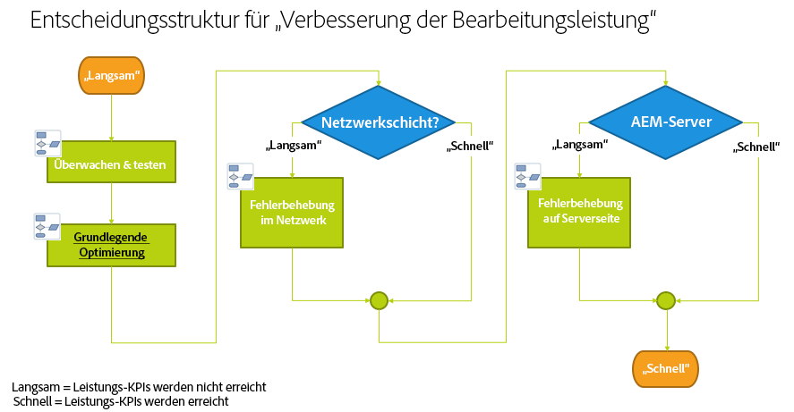
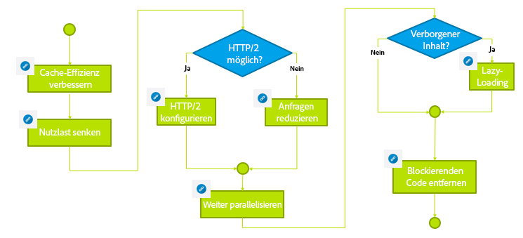

# Fehlerbehebung{#troubleshooting}

Dieser Abschnitt enthält detaillierte Informationen zu Protokollen, die Ihnen bei der Fehlerbehebung helfen. Darüber hinaus finden Sie Informationen zu einigen der Probleme, auf die Sie bei AEM stoßen können.

## Beheben von Leistungsproblemen auf der Autoreninstanz  {#troubleshoot-author-performance}

Das Analysieren von schlechter Leistung auf der Autoreninstanz kann sehr aufwendig sein. Zuerst sollten Sie herausfinden, auf welcher Stufe im Technologie-Stack die Leistung abnimmt.

Anhand der folgenden Entscheidungsstruktur können Sie die möglichen Ursachen von Leistungsengpässen einengen.

## Grundlegende Optimierung {#basic-optimization}

## Konfigurieren von Protokolldateien und Prüfprotokollen {#configuring-log-files-and-audit-logs}

AEM speichert detaillierte Protokolle, die Sie konfigurieren können, um Installationsprobleme zu beheben. Weitere Informationen finden Sie im Abschnitt [Arbeiten mit Prüfdatensätzen und Protokolldateien](/help/sites-deploying/monitoring-and-maintaining.md#working-with-audit-records-and-log-files).

## Verwenden der Option „verbose“ (ausführlich){#using-the-verbose-option}

Wenn Sie AEM WCM starten, können Sie die Option -v (verbose) wie folgt zur Befehlszeile hinzufügen: java -jar cq-wcm-quickstart-&lt;version>.jar -v.

Die Option „verbose“ zeigt einen Teil der Ausgabe des Schnellstartprotokolls in der Konsole an und kann somit für die Fehlerbehebung verwendet werden.

## Häufige Installationsprobleme  {#common-installation-issues}

Im folgenden Abschnitt werden einige Installationsprobleme und zugehörige Lösungen beschrieben.

### Beim Doppelklicken auf die JAR-Datei für den Schnellstart passiert entweder gar nichts oder die Datei wird mit einem anderen Programm (z. B. der Archivverwaltung) geöffnet  {#double-clicking-the-quickstart-jar-does-not-have-any-effect-or-opens-the-jar-file-with-another-program-for-example-archive-manager}

Dies weist normalerweise auf ein Problem mit der Konfiguration der Desktop-Umgebung Ihres Betriebssystems zum Öffnen von Dateien mit der Erweiterung .jar hin. Abgesehen davon kann es ein Hinweis darauf sein, dass Java nicht installiert ist oder dass Sie eine nicht unterstützte Version von Java verwenden.

Da JAR-Dateien das weit verbreitete ZIP-Format nutzen, wird der Desktop von manchen Archivierungsprogrammen automatisch so konfiguriert, dass JAR-Dateien als Archive geöffnet werden.

Beheben Sie dieses Problem wie folgt:

* Vergewissern Sie sich, dass Sie Version 1.6 oder eine neuere Version von Java installiert haben.
* Öffnen Sie das Kontextmenü des AEM WCM-Schnellstarts (in der Regel rechter Mausklick) und wählen Sie „Öffnen mit...“ aus.
* Überprüfen Sie, ob Java oder Sun Java aufgeführt ist, und versuchen Sie, AEM WCM damit auszuführen. Sollten mehrere Java-Versionen installiert sein, wählen Sie die unterstützte Version aus.

   Falls dieser Schritt erfolgreich verläuft und Ihr Betriebssystem die Option anbietet, JAR-Dateien immer mit dem ausgewählten Programm zu öffnen, wählen Sie diese aus. Ab sofort sollten Sie die Dateien mit einem Doppelklick öffnen können.

* Manchmal hilft es auch, die unterstützte Java-Version neu zu installieren, um die richtigen Zuordnungen wiederherzustellen.
* Sie haben jederzeit die Möglichkeit, CRX über eine Befehlszeile oder Start-/Stoppskripts wie zuvor in diesem Dokument beschrieben auszuführen.

### Über CRX ausgeführte Anwendung erzeugt Fehler wegen unzureichendem Arbeitsspeicher  {#my-application-running-on-crx-throws-out-of-memory-errors}

>[!NOTE]
>
>Siehe [Analysieren von Arbeitsspeicherproblemen](https://helpx.adobe.com/de/experience-manager/kb/AnalyzeMemoryProblems.html).

CRX selbst benötigt sehr wenig Arbeitsspeicher. Wenn die Anwendung, die in CRX ausgeführt wird, größere Mengen Arbeitsspeicher benötigt oder Vorgänge anfordert, die viel Arbeitsspeicher belegen, etwa große Transaktionen, muss die JVM-Instanz, in der CRX ausgeführt wird, mit entsprechenden Speichereinstellungen gestartet werden.

Verwenden Sie Java-Befehlsoptionen, um die Speichereinstellungen der JVM zu definieren (z. B. java -Xmx512m -jar crx&amp;ast;.jar , um die Heapgröße auf 512 MB festzulegen).

Legen Sie die Option für die Speichereinstellung fest, wenn AEM WCM über die Befehlszeile gestartet wird. Die Start-/Stoppskripts für AEM WCM oder benutzerdefinierte Skripts zur Verwaltung des Starts von AEM WCM können ebenfalls geändert werden, um die erforderlichen Speichereinstellungen zu definieren.

Wenn Sie die Heapgröße bereits auf 512 MB festgelegt haben, können Sie das Speicherproblem näher untersuchen, indem Sie ein Heapabbild erstellen:

Verwenden Sie den folgenden Befehl, um automatisch ein Heapabbild zu erstellen, wenn nicht genügend Arbeitsspeicher verfügbar ist:

java -Xmx256m -XX:+HeapDumpOnOutOfMemoryError -jar &amp;ast;.jar

Damit wird immer dann eine Heap-Abbilddatei erstellt (**java_...hprof**), wenn dem Vorgang nicht genügend Arbeitsspeicher zur Verfügung steht. Der Vorgang läuft möglicherweise noch weiter, nachdem das Heap-Abbild erstellt wurde. In der Regel reicht eine Heap-Abbilddatei, um das Problem zu analysieren.

### Der AEM-Begrüßungsbildschirm wird nicht im Browser angezeigt, nachdem auf den AEM-Schnellstart doppelt geklickt wurde.  {#the-aem-welcome-screen-does-not-display-in-the-browser-after-double-clicking-aem-quickstart}

Manchmal wird der AEM WCM-Begüßungsbildschirm nicht automatisch angezeigt, obwohl das Repository selbst fehlerfrei läuft. Dies kann von der Einrichtung des Betriebssystems, der Browserkonfiguration oder ähnlichen Faktoren abhängen.

Ein häufiges Symptom ist, dass im AEM WCM-Schnellstartfenster die Meldung „AEM WCM starting up, waiting for server startup...“ angezeigt wird. Sollte diese Meldung über einen relativ langen Zeitraum angezeigt werden, geben Sie die AEM WCM-URL manuell in das Browserfenster ein und verwenden Sie den Standardport 4502 oder den Port, über den die Instanz läuft: http://localhost:4502/.

Es ist auch möglich, den Grund dafür, dass der Browser nicht startet, in Protokollen zu finden.

Manchmal wird die Meldung „AEM WCM running on http://localhost:port/“ im AEM WCM-Schnellstartfenster angezeigt und der Browser startet nicht automatisch. Klicken Sie in diesem Fall auf die URL im AEM WCM-Schellstartfenster (es handelt sich dabei um einen Hyperlink) oder geben Sie die URL manuell im Browser ein.

Sollte das Problem durch keinen der Vorschläge gelöst werden können, überprüfen Sie die Protokolle, um herauszufinden, was passiert ist.

### Die Website wird nicht geladen oder schlägt gelegentlich mit Java 11 {#the-website-does-not-load-or-fails-intermittently-with-java11} fehl

Es gibt ein bekanntes Problem, bei dem AEM 6.5 auf Java 11 ausgeführt wird, bei dem die Website möglicherweise nicht zeitweise geladen wird oder fehlschlägt.

In diesem Fall folgen Sie der folgenden Problemumgehung:

1. Öffnen Sie die Datei `sling.properties` im Ordner `crx-quickstart/conf/` .
1. Suchen Sie die folgende Zeile:

   `org.osgi.framework.bootdelegation=sun.,com.sun.`

1. Ersetzen Sie sie durch Folgendes:

   `org.osgi.framework.bootdelegation=sun.,com.sun.,jdk.internal.reflect,jdk.internal.reflect.*`

1. Starten Sie die Instanz neu.

## Fehlerbehebung bei Installationen mit einem Anwendungsserver {#troubleshooting-installations-with-an-application-server}

### Meldung „Seite nicht gefunden“ wird angezeigt, wenn eine Geometrixx Outdoors-Seite angefordert wird {#page-not-found-returned-when-requesting-a-geometrixx-outdoor-page}

**Gilt für WebLogic 10.3.5 und JBoss 5.1**

Wenn eine englische Geometrixx Outdoors-Seite einen 404-Fehler (Seite nicht gefunden) zurückgibt, sollten Sie sich noch einmal vergewissern, dass Sie die zusätzliche „sling“-Eigenschaft in der Datei „sling.properties“ festgelegt haben, die für diese speziellen Applikationsserver erforderlich ist.

Weitere Informationen finden Sie in *AEM-Webapplikation bereitstellen*.

### Antwortkopfzeile kann größer als 4 KB sein {#response-header-size-can-be-greater-than-kb}

502-Fehler können darauf hinweisen, dass der Webserver mit der Größe der AEM-HTTP-Antwortkopfzeile nicht umgehen kann. AEM kann HTTP-Antwortkopfzeilen erstellen, die Cookies mit einer Größe von mehr als 4 KB beinhalten. Achten Sie darauf, dass Ihr Servletcontainer so konfiguriert ist, dass die maximale Größe der Antwortkopfzeile 4 KB übersteigen darf.

Bei Tomcat 7.0 zum Beispiel steuert das Attribut „maxHttpHeaderSize“ des [HTTP-Connectors](https://tomcat.apache.org/tomcat-7.0-doc/config/http.html) Größenbegrenzungen für Kopfzeilen.

## Deinstallieren von Adobe Experience Manager  {#uninstalling-adobe-experience-manager}

Da AEM nur in ein einzelnes Verzeichnis installiert wird, ist kein Deinstallationsprogramm erforderlich. Für eine Deinstallation kann es ausreichen, das gesamte Verzeichnis zu löschen, wobei die Art der Deinstallation von AEM davon abhängt, was Sie bezwecken möchten und welche Art beständigen Speicher Sie verwenden.

Falls beständiger Speicher in das Installationsverzeichnis integriert ist, beispielsweise in der standardmäßigen TarPM-Installation, werden durch Entfernen der Ordner auch alle Daten entfernt.

>[!NOTE]
>
>Adobe empfiehlt dringend, Ihr Repository zu sichern, bevor Sie AEM löschen. Wenn Sie das gesamte CQ-Installationsverzeichnis löschen, wird dabei auch das Repository gelöscht. Sichern Sie die Repository-Daten vor dem Löschen, indem Sie den Ordner „&lt;CQ-Installationsverzeichnis>/crx-quickstart/repository“ an einen anderen Speicherort verschieben oder kopieren, bevor Sie die anderen Ordner löschen.

Falls Ihre AEM-Installation externen Speicher nutzt, etwa einen Datenbankserver, werden beim Entfernen der Ordner nicht automatisch auch die Daten entfernt. Allerdings wird dabei die Speicherkonfiguration entfernt, wodurch die Wiederherstellung der JCR-Inhalte schwierig wird.

### JSP-Dateien werden von JBoss nicht kompiliert  {#jsp-files-are-not-compiled-on-jboss}

Wenn Sie JSP-Dateien über JBoss im Experience Manager installieren oder aktualisieren und die entsprechenden Servlets nicht kompiliert werden, überprüfen Sie, ob der JBoss-JSP-Compiler richtig konfiguriert ist. Weitere Informationen finden Sie unter
[JSP-Kompilierungsprobleme in JBoss](https://helpx.adobe.com/experience-manager/kb/jsps-dont-compile-jboss.html) -Artikel.
