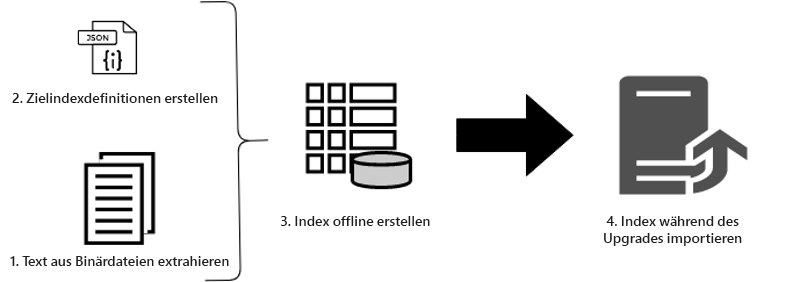
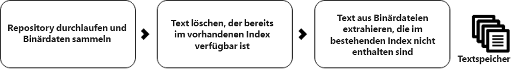
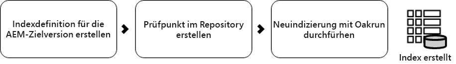

# Verwenden der Offline-Neudezierung zur Reduzierung der Ausfallzeit während eines Upgrades {#offline-reindexing-to-reduce-downtime-during-upgrades}

## Einführung {#introduction}

Eine der größten Herausforderungen bei der Aktualisierung von Adobe Experience Manager ist die Ausfallzeit im Zusammenhang mit der Autorenaktualisierung, wenn eine ersetzende Aktualisierung durchgeführt wird. Inhaltsersteller können während einer Aktualisierung nicht auf die Umgebung zugreifen. Daher ist es wünschenswert, die für die Durchführung der Aktualisierung benötigte Zeit möglichst gering zu halten. Bei großen Repositorys, insbesondere bei AEM Assets-Projekten, die in der Regel über große Datenspeicher und hohe Uploads von Assets pro Stunde verfügen, dauert die Neudeaktivierung von Oak-Indizes einen erheblichen Prozentsatz der Aktualisierungszeit.

In diesem Abschnitt wird beschrieben, wie Sie das Oak-run-Tool verwenden, um das Repository **vor der Durchführung der Aktualisierung neu zu indizieren, wodurch die Ausfallzeit während der eigentlichen Aktualisierung verringert wird.** Die angezeigten Schritte können auf [Lucene](https://jackrabbit.apache.org/oak/docs/query/lucene.html)-Indizes für die Versionen AEM 6.4 und höher angewendet werden.

## Überblick {#overview}

Neue Versionen der AEM führen zu Änderungen an Oak-Indexdefinitionen, wenn der Funktionssatz erweitert wird. Änderungen an den Oak-Indizes erzwingen eine erneute Deaktivierung, wenn die AEM aktualisiert wird. Die Neudezierung von Assets ist teuer, da Text in Assets (z. B. Text in der PDF-Datei) extrahiert und indiziert wird. Bei MongoMK-Repositorys bleiben die Daten über das Netzwerk erhalten, was die Zeit für die erneute Dekodierung weiter verlängert.

Das Problem, mit dem die meisten Kunden während eines Upgrades konfrontiert sind, ist die Reduzierung des Ausfallzeitfensters. Die Lösung besteht darin, **die Aktivität zum erneuten Dekonieren während der Aktualisierung zu überspringen.** Dies kann erreicht werden, indem die neuen Indizes **vor** erstellt werden, um die Aktualisierung durchzuführen, und dann einfach während der Aktualisierung importiert werden.

## Ansatz {#approach}



Der Index wird vor der Aktualisierung anhand der Indexdefinitionen der Zielgruppe AEM mit dem Tool [Oak-run](/help/sites-deploying/indexing-via-the-oak-run-jar.md) erstellt. Das obige Diagramm zeigt den Ansatz der Offline-Neudezierung.

Darüber hinaus ist dies die Reihenfolge der Schritte, die im Ansatz beschrieben werden:

1. Text aus Binärdateien wird zuerst extrahiert
2. Zielgruppen-Indexdefinitionen werden erstellt
3. Offline-Indizes werden erstellt
4. Die Indizes werden dann während des Aktualisierungsprozesses importiert

### Textextraktion {#text-extraction}

Um die vollständige Indexierung in AEM zu aktivieren, wird Text aus Binärdateien wie PDF extrahiert und dem Index hinzugefügt. Dies ist normalerweise ein teurer Schritt im Indexierungsvorgang. Die Extraktion von Text ist ein Optimierungsschritt, der besonders für die Neudezierung von Asset-Repositorys empfohlen wird, da dort eine große Anzahl von Binärdateien gespeichert wird.



Text aus im System gespeicherten Binärdateien kann mithilfe des Eichenlaufwerkzeugs mit der Keimbibliothek extrahiert werden. Ein Klon der Produktionssysteme kann vor der Aktualisierung genommen werden und für diese Extraktion des Textes verwendet werden. Dieser Prozess erstellt dann den Textspeicher, indem Sie die folgenden Schritte ausführen:

**1. Durchlaufen Sie das Repository und sammeln Sie die Details der Binärdateien**

Dieser Schritt erzeugt eine CSV-Datei, die mehrere Binärdateien enthält, die einen Pfad und eine Blob-ID enthalten.

Führen Sie den Befehl unten aus dem Verzeichnis aus, aus dem Sie den Index erstellen möchten. Im folgenden Beispiel wird der Basisordner des Repositorys angenommen.

```
java java -jar oak-run.jar tika <nodestore path> --fds-path <datastore path> --data-file text-extraction/oak-binary-stats.csv --generate
```

Dabei ist `nodestore path` `mongo_ur` oder `crx-quickstart/repository/segmentstore/`

Verwenden Sie den Parameter `--fake-ds-path=temp` anstelle von `–fds-path`, um den Prozess zu beschleunigen.

**2. Den binären Textspeicher, der im vorhandenen Index verfügbar ist, wiederverwenden**

Ziehen Sie die Indexdaten aus dem vorhandenen System und extrahieren Sie den Textspeicher.

Sie können die vorhandenen Indexdaten mithilfe des folgenden Befehls ablegen:

```
java -jar oak-run.jar index <nodestore path> --fds-path=<datastore path> --index-dump
```

Dabei ist `nodestore path` `mongo_ur` oder `crx-quickstart/repository/segmentstore/`

Verwenden Sie dann die oben stehende Indexablagerung, um den Store zu füllen:

```
java -jar oak-run.jar tika --data-file text-extraction/oak-binary-stats.csv --store-path text-extraction/store --index-dir ./indexing-result/index-dumps/<oak-index-name>/data populate
```

Dabei ist `oak-index-name` der Name des Volltextindex, z. B. &quot;lucene&quot;.

**3. Führen Sie die Extraktion des Textes mit der Keimbibliothek für die im obigen Schritt ausgelassenen Binärdateien aus.**

```
java -cp oak-run.jar:tika-app-1.21.jar org.apache.jackrabbit.oak.run.Main tika --data-file text-extraction/oak-binary-stats.csv --store-path text-extraction/store --fds-path <datastore path> extract
```

Dabei ist `datastore path` der Pfad zum binären Datenspeicher.

Der erstellte Textspeicher kann in Zukunft für die Neudezierung von Szenarien aktualisiert und wiederverwendet werden.

Weitere Informationen zur Extraktion des Textes finden Sie in der [Oak-run documentation](https://jackrabbit.apache.org/oak/docs/query/pre-extract-text.html).

### Offline-Neudexing {#offline-reindexing}



Erstellen Sie den Lucene-Index vor der Aktualisierung offline. Wenn Sie MongoMK verwenden, wird empfohlen, es direkt auf einem der MongoMk-Knoten auszuführen, da dies den Netzwerkaufwand vermeidet.

Gehen Sie wie folgt vor, um den Index offline zu erstellen:

**1. Oak Lucene-Indexdefinitionen für die Zielgruppe AEM Version** erstellen

Ziehen Sie die vorhandenen Indexdefinitionen. Indexdefinitionen, die geändert wurden, wurden mit dem Adobe Granite Repository Bundle der Zielgruppe AEM Version und Eichenausführung generiert.

Führen Sie folgenden Befehl aus, um die Indexdefinition aus der AEM **source**-Instanz zu entfernen:

>[!NOTE]
>
>Weitere Informationen zu Dumping-Indexdefinitionen finden Sie in der [Oak-Dokumentation](https://jackrabbit.apache.org/oak/docs/query/oak-run-indexing.html#async-index-data).

```
java -jar oak-run.jar index --fds-path <datastore path> <nodestore path> --index-definitions
```

Dabei stammen `datastore path` und `nodestore path` aus der **source**-AEM.

Generieren Sie dann Indexdefinitionen aus der AEM Version **Zielgruppe** mithilfe des Granite Repository Bundles der Zielgruppe-Version.

```
java -cp oak-run.jar:bundle-com.adobe.granite.repository.jar org.apache.jackrabbit.oak.index.IndexDefinitionUpdater --in indexing-definitions_source.json --out merge-index-definitions_target.json --initializer com.adobe.granite.repository.impl.GraniteContent
```

>[!NOTE]
>
> Der oben beschriebene Prozess zur Erstellung der Indexdefinition wird nur ab der `oak-run-1.12.0`-Version unterstützt. Das Targeting erfolgt mit dem Granite Repository Bundle `com.adobe.granite.repository-x.x.xx.jar`.

In den oben genannten Schritten wird eine JSON-Datei mit dem Namen `merge-index-definitions_target.json` erstellt, bei der es sich um die Indexdefinition handelt.

**2. Checkpoint im Repository erstellen**

Erstellen Sie einen Checkpoint in der Produktions-Instanz **source** mit langer Lebensdauer. Dies sollte vor dem Klonen des Repositorys erfolgen.

Über die JMX-Konsole unter `http://serveraddress:serverport/system/console/jmx` gehen Sie zu `CheckpointMBean` und erstellen Sie einen Checkpoint mit einer langen Lebensdauer (z. B. 200 Tage). Rufen Sie hierfür `CheckpointMBean#createCheckpoint` mit `17280000000` als Argument für die Lebensdauer in Millisekunden auf.

Kopieren Sie anschließend die neu erstellte Checkpoint-ID und überprüfen Sie die Lebensdauer mit JMX `CheckpointMBean#listCheckpoints`.

>[!NOTE]
>
> Dieser Checkpoint wird gelöscht, wenn der Index später importiert wird.

Weitere Informationen finden Sie unter [Checkpoint-Erstellung](https://jackrabbit.apache.org/oak/docs/query/oak-run-indexing.html#out-of-band-create-checkpoint) in der Oak-Dokumentation.

**Offline-Indizierung für die generierten Indexdefinitionen durchführen**

Die Reindexpling von Lucene kann offline mithilfe von Eichenlauf durchgeführt werden. Dieser Prozess erstellt Indexdaten auf der Festplatte unter `indexing-result/indexes`. Es schreibt **nicht** in das Repository und erfordert daher nicht, die laufende AEM Instanz zu beenden. Der erstellte Textspeicher wird in diesen Prozess eingebunden:

```
java -Doak.indexer.memLimitInMB=500 -jar oak-run.jar index <nodestore path> --reindex --doc-traversal-mode --checkpoint <checkpoint> --fds-path <datastore path> --index-definitions-file merge-index-definitions_target.json --pre-extracted-text-dir text-extraction/store

Sample <checkpoint> looks like r16c85700008-0-8
—fds-path: path to data store.
--pre-extracted-text-dir: Directory of pre-extracted text.
merge-index-definitions_target: JSON file having merged definitions for the target AEM instance. indexes in this file will be re-indexed.
```

Die Verwendung des Parameters `--doc-traversal-mode` ist bei MongoMK-Installationen praktisch, da er die reindex-Zeit erheblich verbessert, indem Repository-Inhalte in eine lokale flache Datei hochgeladen werden. Es benötigt jedoch zusätzlichen Speicherplatz in Dublette der Größe des Repositorys.

Im Fall von MongoMK kann dieser Prozess beschleunigt werden, wenn dieser Schritt in einer Instanz ausgeführt wird, die näher an der MongoDB-Instanz liegt. Bei Ausführung auf demselben Computer kann der Netzwerkaufwand vermieden werden.

Weitere technische Details finden Sie in der [oak-run-Dokumentation zur Indexierung](https://jackrabbit.apache.org/oak/docs/query/oak-run-indexing.html).

### Importieren von Indizes {#importing-indexes}

Mit AEM 6.4 und neueren Versionen verfügt AEM über die integrierte Funktion, Indizes von der Festplatte bei der Systemstartsequenz zu importieren. Der Ordner `<repository>/indexing-result/indexes` wird während des Starts auf das Vorhandensein von Indexdaten überwacht. Sie können den vordefinierten Index während des [Aktualisierungsprozesses](in-place-upgrade.md#performing-the-upgrade) an den oben angegebenen Speicherort kopieren, bevor Sie mit der neuen Version der **Zielgruppe**-AEM JAR beginnen. AEM importiert es in das Repository und entfernt den entsprechenden Checkpoint aus dem System. Ein Rentidex wird somit vollständig vermieden.

## Zusätzliche Tipps und Fehlerbehebung {#troubleshooting}

Nachstehend finden Sie hilfreiche Tipps und Anleitungen zur Fehlerbehebung.

### Verringerung der Auswirkungen auf das Live-Produktionssystem {#reduce-the-impact-on-the-live-production-system}

Es wird empfohlen, das Produktionssystem zu klonen und den Offlineindex mithilfe des Klons zu erstellen. Dadurch entfallen alle potenziellen Auswirkungen auf das Produktionssystem. Der für den Import des Index erforderliche Checkpoint muss jedoch im Produktionssystem vorhanden sein. Daher ist es wichtig, einen Checkpoint zu erstellen, bevor der Klon genommen wird.

### Bereiten Sie ein Runbook und eine Testausführung {#prepare-a-runbook-and-trial-run} vor

Es wird empfohlen, ein [runbook](https://docs.adobe.com/content/help/en/experience-manager-65/deploying/upgrading/upgrade-planning.html#building-the-upgrade-and-rollback-runbook) vorzubereiten und einige Tests durchzuführen, bevor die Aktualisierung in der Produktion ausgeführt wird.

### Doc-Übersichtsmodus mit Offline-Indizierung {#doc-traversal-mode-with-offline-indexing}

Die Offline-Indizierung erfordert mehrere Durchläufe des gesamten Repositorys. Bei MongoMK-Installationen wird auf das Repository über das Netzwerk zugegriffen, was die Performance des Indexierungsprozesses beeinträchtigt. Eine Möglichkeit ist, den Offline-Indizierungsprozess auf der MongoDB Replik selbst auszuführen, wodurch der Netzwerkaufwand beseitigt wird. Eine andere Option ist die Verwendung des Modus für die Dokumentdurchquerung.

Der Doc-Traversal-Modus kann angewendet werden, indem der Befehlszeilenparameter `—doc-traversal` dem oak-run-Befehl für die Offline-Indizierung hinzugefügt wird. In diesem Modus wird eine Kopie des gesamten Repositorys auf der lokalen Festplatte als flache Datei gefiltert und zum Ausführen der Indexierung verwendet.
