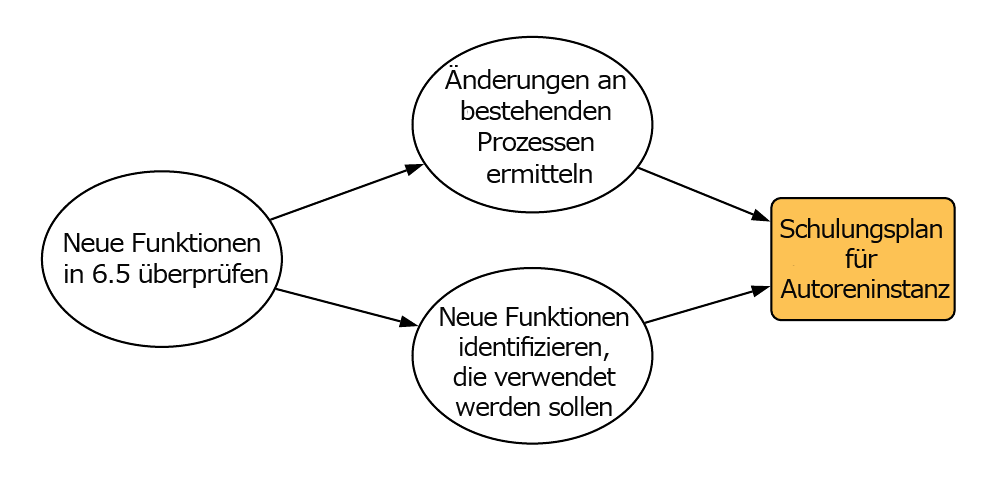
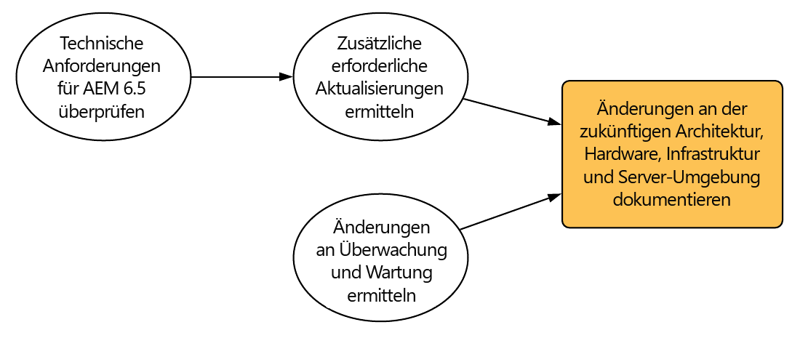
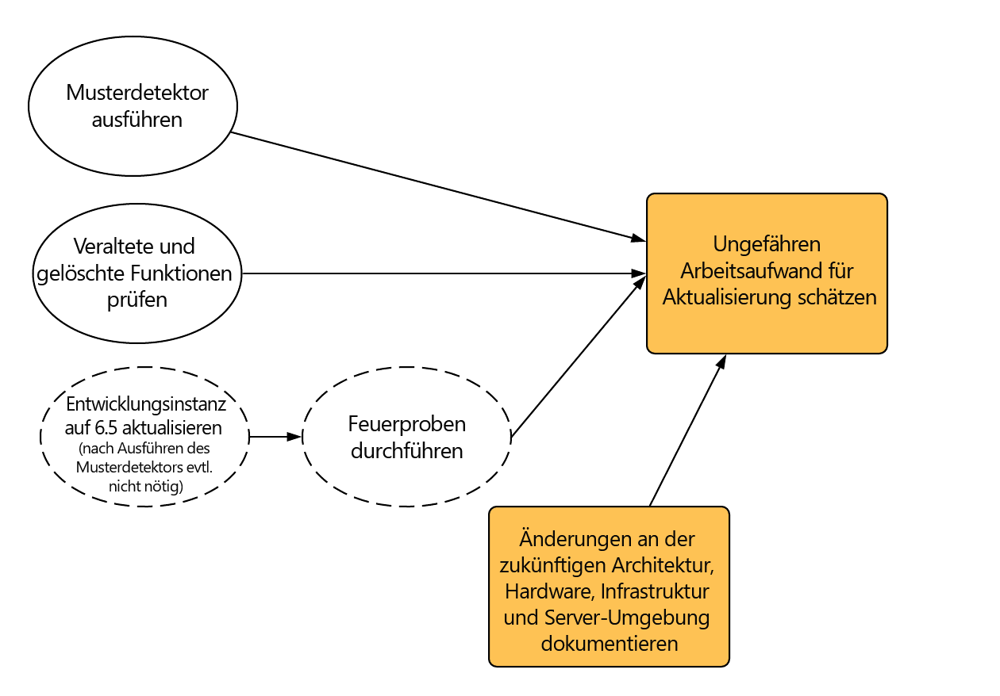
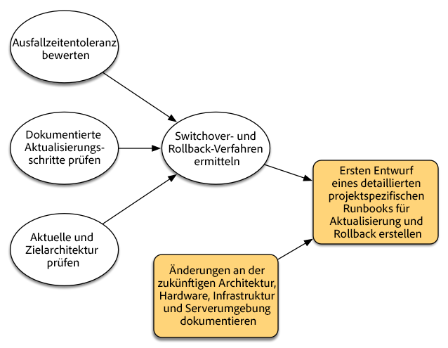
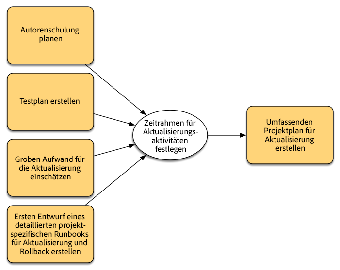
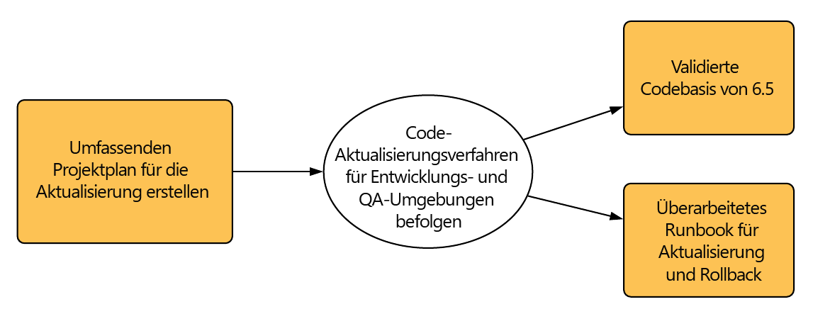
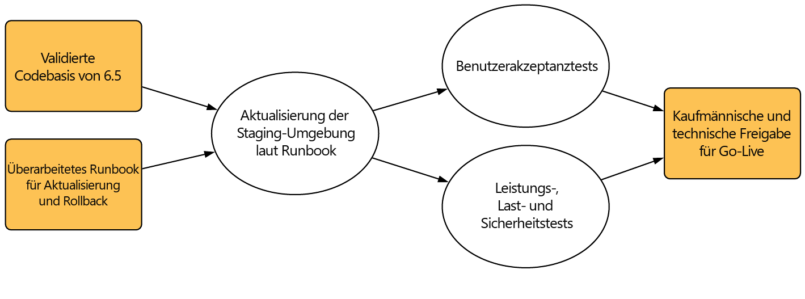
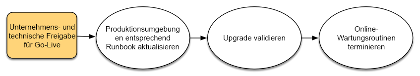

# Planung der Aktualisierung{#planning-your-upgrade}

## AEM-Projektüberblick {#aem-project-overview}

AEM kommt häufig in umfangreichen Bereitstellungen zum Einsatz, die möglicherweise von Millionen von Benutzern genutzt werden. Im Großteil der Fälle werden dabei benutzerdefinierte Anwendungen auf Instanzen bereitgestellt, wodurch die Komplexität weiter erhöht wird. Das Aktualisieren einer solchen Implementierung muss deshalb methodisch angegangen werden.

Dieser Leitfaden unterstützt Sie bei der Formulierung von klaren Zielen, Phasen und Ergebnissen bei der Planung der Aktualisierung. Im Mittelpunkt des Leitfadens stehen die Abwicklung und die Richtlinien des gesamten Projekts. Er gibt einen Überblick über die konkreten Aktualisierungsschritte und verweist auf verfügbare technische Ressourcen, falls erforderlich. Der Leitfaden sollte in Verbindung mit den verfügbaren technischen Ressourcen verwendet werden, auf die in diesem Dokument Bezug genommen wird.

Der Aktualisierungsprozess für AEM erfordert sorgfältig ausgeführte Planungs-, Analyse- und Durchführungsphasen, für die jeweils wichtige Ergebnisse festgelegt werden müssen.

Beachten Sie, dass ein direktes Upgrade von AEM Version 6.0 und bis zu 6.5 möglich ist. Kunden, die 5.6.x und älter ausführen, müssen ein Upgrade zuerst auf Version 6.0 oder höher durchführen, wobei 6.0 (SP3) empfohlen wird. Darüber hinaus wird seit 6.3 für den Segment-Knotenspeicher das neue OAK-Segment-TAR-Format verwendet. Eine Repository-Migration in dieses neue Format ist sogar für die Versionen 6.0, 6.1 und 6.2 obligatorisch.

>[!CAUTION]
>
>Wenn Sie von AEM 6.2 auf 6.3 aktualisieren, sollten Sie ENTWEDER von den Versionen **6.2-SP1-CFP1 - 6.2-SP1-CFP12.1** oder ab der Version **6.2-SP1-CFP15** aktualisieren. Wenn Sie jedoch von **6.2-SP1-CFP13/6.2-SP1CFP14** auf AEM 6.3 aktualisieren, müssen Sie mindestens auf Version **6.3.2.2** aktualisieren. Ansonsten kann AEM Sites nach der Aktualisierung nicht ausgeführt werden.

## Aktualisierungsumfang und -anforderungen {#upgrade-scope-requirements}

Nachfolgend finden Sie eine Liste der Bereiche, die von einem typischen AEM-Aktualisierungsprojekt betroffen sind:

<table>
 <tbody>
  <tr>
   <td><strong>Komponente</strong></td>
   <td><strong>Auswirkungen</strong></td>
   <td><strong>Beschreibung</strong></td>
  </tr>
  <tr>
   <td>Betriebssystem</td>
   <td>Ungewisse aber geringfügige Auswirkungen</td>
   <td>Möglicherweise muss bei der Aktualisierung von AEM auch das Betriebssystem aktualisiert werden. Dies kann gewisse Auswirkungen haben.</td>
  </tr>
  <tr>
   <td>Java-Laufzeitumgebung</td>
   <td>Moderate Auswirkungen</td>
   <td>AEM 6.3 erfordert JRE 1.7.x (64 Bit) oder höher. Derzeit ist JRE 1.8 die einzige von Oracle unterstützte Version.</td>
  </tr>
  <tr>
   <td>Hardware</td>
   <td>Moderate Auswirkungen</td>
   <td>Für die Online-Revisionsbereinigung sind freier  Speicherplatz, der 25 % des Repository-Volumens entspricht, sowie 15 % freier Heap-Speicher erforderlich,  um die Bereinigung erfolgreich abzuschließen. Möglicherweise müssen Sie Ihre Hardware aktualisieren, um  sicherzustellen, dass ausreichend Ressourcen für die vollständige Ausführung der Online-Revisionsbereinigung  verfügbar sind. Wenn Sie zudem eine Aktualisierung von einer Version vor AEM 6 durchführen,  sind u. U. zusätzliche Speicheranforderungen zu beachten.</td>
  </tr>
  <tr>
   <td>Inhalts-Repository (CRX oder Oak)</td>
   <td>Starke Auswirkungen</td>
   <td>Ab Version 6.1 bietet AEM keine Unterstützung für CRX2, sodass eine Migration auf  Oak (CRX3) erforderlich ist, wenn eine Aktualisierung von einer älteren Version durchgeführt wird. In AEM 6.3 wurde  ein neuer Segment-Knotenspeicher implementiert, der ebenfalls migriert werden muss. Hierzu wird das  CRX2OAK-Tool verwendet.</td>
  </tr>
  <tr>
   <td>AEM-Komponenten/-Inhalte</td>
   <td>Moderate Auswirkungen</td>
   <td><code>/libs</code> und <code>/apps</code> sind durch die Aktualisierung einfach zu handhaben, für <code>/etc</code> ist jedoch in der Regel eine manuelle Neuanwendung der Anpassungen erforderlich.</td>
  </tr>
  <tr>
   <td>AEM-Dienste</td>
   <td>Geringfügige Auswirkungen</td>
   <td>Der Großteil der AEM-Kerndienste wird für eine Aktualisierung getestet. Dies ist ein Bereich mit geringfügigen Auswirkungen.</td>
  </tr>
  <tr>
   <td>Benutzerdefinierte Anwendungsdienste</td>
   <td>Geringfügige bis starke Auswirkungen</td>
   <td>Je nach Anwendung und Grad der Anpassung liegen möglicherweise  Abhängigkeiten von JVM, Betriebssystemversionen und einige indizierungsbezogene  Änderungen vor, da Indizes in Oak nicht automatisch generiert werden.</td>
  </tr>
  <tr>
   <td>Benutzerdefinierte Anwendungsinhalte</td>
   <td>Geringfügige bis starke Auswirkungen</td>
   <td>Inhalte, die von der Aktualisierung nicht betroffen sind, können vorher gesichert  und dann wieder in das Repository verschoben werden. Die meisten Inhalte können mithilfe des Migrationstools verarbeitet werden.</td>
  </tr>
 </tbody>
</table>

Sie müssen sicherstellen, dass ein unterstütztes Betriebssystem, eine unterstützte Java-Laufzeitumgebung sowie eine unterstützte httpd- und Dispatcher-Version ausgeführt werden. Weitere Informationen finden Sie auf der Seite [Technische Anforderungen für AEM 6.5](/help/sites-deploying/technical-requirements.md). Die Aktualisierung dieser Komponenten muss im Projektplan berücksichtigt werden und sollte vor der AEM-Aktualisierung durchgeführt werden.

## Projektphasen  {#project-phases}

Mit der Planung und Durchführung einer AEM-Aktualisierung ist ein hoher Arbeitsaufwand verbunden. Um den Arbeitsaufwand besser zu verdeutlichen, haben wir die Planungs- und Durchführungsschritte in separate Phasen unterteilt. In den nachfolgenden Abschnitten resultiert jede Phase in einem Ergebnis, das häufig für eine zukünftige Phase des Projekts genutzt wird.

### Planen der Autorenschulung  {#planning-for-author-training}

In jeder neuen Version ist mit potenziellen Änderungen an der Benutzeroberfläche und den Benutzer-Workflows zu rechnen. Außerdem werden neue Funktionen eingeführt, deren Nutzung sich für das Unternehmen als vorteilhaft erweisen kann. Adobe empfiehlt die eingeführten Funktionsänderungen zu überprüfen und einen Schulungsplan für Benutzer zu erstellen, damit diese neue Funktionen effektiv nutzen können.

Neue Funktionen in AEM 6.5 finden Sie im [Bereich zu AEM auf adobe.com](/help/release-notes/release-notes.md). Achten Sie vor allem auf Änderungen an Benutzeroberflächen oder Produktfunktionen, die in Ihrem Unternehmen häufig verwendet werden. Wenn Sie sich über die neuen Funktionen informieren, achten Sie auch auf neue Funktionen, die für Ihr Unternehmen von Nutzen sein können. Sobald Sie sich mit den Änderungen in AEM 6.5 vertraut gemacht haben, entwickeln Sie einen Schulungsplan für Ihre Autoren. Hierzu können Sie kostenlos verfügbare Ressourcen wie Videos zu Funktionen des Adobe-Supports oder formelle Schulungen nutzen, die von [Adobe Digital Learning Services](https://www.adobe.com/training.html) angeboten werden.

### Erstellen eines Testplans  {#creating-a-test-plan}

Jede Kundenimplementierung von AEM ist einzigartig und auf die Geschäftsanforderungen des Unternehmens zugeschnitten. Deshalb ist es wichtig, alle am System vorgenommenen Anpassungen zu bestimmen, damit sie in einen Testplan einbezogen werden können. Dieser Testplan bildet die Basis für den QS-Prozess, der für aktualisierte Instanzen durchgeführt wird.

Die Produktionsumgebung muss exakt dupliziert und nach der Aktualisierung getestet werden, um sicherzustellen, dass alle Anwendungen und benutzerdefinierter Code weiterhin wie gewünscht ausgeführt werden. Sie müssen alle Anpassungen rückgängig machen und Leistungs-, Last- und Sicherheitstests durchführen. Beziehen Sie beim Organisieren des Testplans neben den vorkonfigurierten Benutzeroberflächen und Workflows, die für Ihre täglichen Betriebsabläufe verwendet werden, alle am System vorgenommenen Anpassungen in den Plan mit ein. Hierzu gehören möglicherweise benutzerdefinierte OSGi-Dienste und -Servlets, Integrationen mit Adobe Marketing Cloud, Integrationen mit Drittanbieteranwendungen über AEM-Connectors, benutzerdefinierte Drittanbieterintegrationen, benutzerdefinierte Komponenten und Vorlagen, benutzerdefinierte Benutzeroberflächen-Überlagerungen in AEM und benutzerdefinierte Workflows. Kunden, die eine Migration von einer Version vor AEM 6 durchführen, sollten alle benutzerdefinierten Abfragen analysieren, da diese u. U. indiziert werden müssen. Kunden die bereits eine AEM 6.x-Version verwenden, sollte diese Abfragen ebenfalls testen, um sicherzustellen, das ihre Indizes auch nach der Aktualisierung ordnungsgemäß arbeiten.

### Bestimmen der erforderlichen Architektur- und Infrastrukturänderungen  {#determining-architectural-and-infrastructure-changes-needed}

Sie müssen bei einer Aktualisierung möglicherweise auch andere Komponenten Ihres Technologie-Stacks aktualisieren, z. B. das Betriebssystem oder JVM. Darüber hinaus ist aufgrund von Änderungen an der Repository-Konfiguration u. U. zusätzliche Hardware erforderlich. Dies trifft in der Regel nur für Kunden zu, die eine Migration von Instanzen vor Version 6.x durchführen, muss jedoch berücksichtigt werden. Und schließlich müssen Sie möglicherweise Ihre Betriebspraktiken ändern, darunter Ihre Prozesse für die Überwachung, Wartung, Sicherung und Nofallwiederherstellung.

Überprüfen Sie die technischen Anforderungen für AEM 6.5 und stellen Sie sicher, dass Ihre Hardware und Software die Voraussetzungen erfüllen. Informationen zu potenziellen Änderungen an Ihren Betriebsabläufen finden Sie in den folgenden Dokumenten:

**Überwachung und Wartung**

[Vorgangs-Dashboard](/help/sites-administering/operations-dashboard.md)

[Asset-Überwachung – Best Practices](/help/assets/assets-monitoring-best-practices.md)

[Überwachen von Serverressourcen mit der JMX-Konsole](/help/sites-administering/jmx-console.md)

[Revisionsbereinigung](/help/sites-deploying/revision-cleanup.md)

**Sicherung/Wiederherstellung und Notfallwiederherstellung:**

[Sichern und Wiederherstellen](/help/sites-administering/backup-and-restore.md)

[Leistung und Skalierbarkeit](/help/sites-deploying/performance.md)

[Ausführen von AEM mit der TarMK-Cold-Standby-Funktion](/help/sites-deploying/tarmk-cold-standby.md)

#### Überlegungen zur Neustrukturierung des Contents {#content-restructuring-considerations}

Mit AEM werden Änderungen an der Repository-Struktur eingeführt, mit denen Upgrades noch nahtloser durchgeführt werden können. Diese Änderungen erfordern, dass Inhalte aus dem Ordner /etc in Ordner wie /libs, /apps und /content verschoben werden – je nachdem, ob Adobe oder der Kunde Eigentümer des Inhalts ist – um die Wahrscheinlichkeit zu verringern, dass Inhalte durch Aktualisierungen überschrieben werden. Die Repository-Neustrukturierung wurde so durchgeführt, dass zum Zeitpunkt der Aktualisierung von 6.5 keine Codeänderungen erforderlich sind. Es wird jedoch empfohlen, die Details unter [Repository-Neustrukturierung in AEM](/help/sites-deploying/repository-restructuring.md) während der Planung einer Aktualisierung zu überprüfen.

### Bewertung der Komplexität der Aktualisierung {#assessing-upgrade-complexity}

Aufgrund der von unseren Kunden an ihren AEM-Umgebungen vorgenommenen Anpassungen, die sich hinsichtlich des Umfangs und der Art der Anpassung weitgehend unterscheiden, ist es wichtig, vor einer Aktualisierung den damit verbundenen Aufwand zu bestimmen.

Es gibt zwei Ansätze zur Bewertung der Komplexität der Aktualisierung. In einer Vorbereitungsphase können Sie einfach den neuen Musterdetektor verwenden, der auf Ihren AEM 6.1-, 6.2- und 6.3-Instanzen ausgeführt werden kann. Der Musterdetektor bietet die einfachste Möglichkeit, die erwartete Gesamtkomplexität der Aktualisierung anhand der gefundenen Muster zu bewerten. Der Bericht des Musterdetektors enthält Muster, mit denen veraltete APIs identifiziert werden können, die von der benutzerdefinierten Codebasis verwendet werden (dies wurde in 6.3 mithilfe von Kompatibilitätsprüfungen vor der Aktualisierung durchgeführt).

Nach dieser anfänglichen Bewertung kann in einem umfangreicheren nächsten Schritt eine Aktualisierung einer Testinstanz durchgeführt werden, um einige grundlegende Tests durchzuführen. Adobe bietet auch einige . Außerdem sollte die Liste der [veralteten und entfernten Funktionen](/help/release-notes/deprecated-removed-features.md) überprüft werden, und zwar nicht nur in Bezug auf die Version, auf die Sie die Aktualisierung durchführen, sondern auch bezüglich der Versionen zwischen Ihrer Quell- und Zielversion. Bei einer Aktualisierung von AEM 6.2 auf 6.5 ist es beispielsweise wichtig, die veralteten und entfernten Funktionen von AEM 6.3 neben denen von AEM 6.5 zu überprüfen.

Der kürzlich eingeführte Musterdetektor liefert Ihnen eine recht genaue Schätzung dessen, was Sie während einer Aktualisierung in den meisten Fällen erwarten können. Für komplexere Anpassungen und Bereitstellungen mit inkompatiblen Änderungen können Sie jedoch eine Entwicklungsinstanz gemäß den Anweisungen unter [Durchführen einer ersetzenden Aktualisierung](/help/sites-deploying/in-place-upgrade.md) auf AEM 6.5 aktualisieren. Führen Sie nach der Aktualisierung eine Reihe Feuerproben der hohen Stufe für die Umgebung durch. Sie dienen nicht dazu, das Nutzungsszenario umfassend zu testen und eine formelle Liste mit Defekten zu erstellen. Vielmehr soll der geschätzte erforderliche Arbeitsaufwand für die Aktualisierung des Codes ermittelt werden, um die Kompatibilität mit Version 6.5 sicherzustellen. Wenn die [Mustererkennung](/help/sites-deploying/pattern-detector.md) mit den Änderungen an der Architektur kombiniert wird, die im vorherigen Abschnitt beschrieben wurden, liefert dies eine grobe Schätzung, mit deren Hilfe das Projektleiterteam die Aktualisierung planen kann.

### Erstellen des Runbooks für die Aktualisierung und das Rollback {#building-the-upgrade-and-rollback-runbook}

Obwohl Adobe den Prozess für die Aktualisierung von AEM-Instanzen dokumentiert hat, muss der Ansatz entsprechend dem Netzwerklayout, der Bereitstellungsarchitektur und den Anpassungen jedes Kunden optimiert und darauf zugeschnitten werden. Wir empfehlen deshalb die gesamte verfügbare Dokumentation zu lesen und auf dieser Basis ein projektspezifisches Runbook mit den speziellen Aktualisierungs- und Rollbackverfahren für Ihre Umgebung zu erstellen. Stellen Sie bei einer Aktualisierung von CRX2 sicher, dass Sie die Dauer der Inhaltsmigration von CRX2 auf Oak evaluieren. Diese kann bei großen Repositorys erheblich sein.

Unter [Aktualisierungsverfahren](/help/sites-deploying/upgrade-procedure.md) finden Sie Aktualisierung- und Rollbackverfahren sowie schrittweise Anleitungen für die Durchführung einer [ersetzenden Aktualisierung](/help/sites-deploying/in-place-upgrade.md). Diese Anweisungen sollten überprüft und für Ihre Systemarchitektur, Anpassungen und Ausfallzeitentoleranz berücksichtigt werden, um die entsprechenden Switchover- und Rollbackvorgänge zu bestimmen, die Sie während der Aktualisierung ausführen. Änderungen an der Architektur oder Servergröße sollten bei der Erstellung Ihres benutzerdefinierten Runbooks miteinbezogen werden. Beachten Sie, dass diese Version als erster Entwurf gelten sollte. Möglicherweise sind nach Abschluss der QS- und Entwicklungszyklen und der Bereitstellung der Aktualisierung in der Staging-Umgebung weitere Schritte erforderlich. Die Informationen im Dokument sollten möglichst umfassend sein, sodass Ihr Betriebspersonal die Aktualisierung anhand der darin enthaltenen Informationen vollständig durchführen und abschließen kann.

### Entwickeln eines Projektplans  {#developing-a-project-plan}

Anhand der Ergebnisse aus den vorherigen Schritten kann ein Projektplan erstellt werden, der die erwarteten Zeitrahmen für den Test- oder Entwicklungsaufwand, Schulungen und die tatsächliche Aktualisierung beinhaltet.

Ein umfassender Projektplan sollte folgende Punkte beinhalten:

* Finalisierung der Entwicklungs- und Testpläne
* Aktualisierung von Entwicklungs- und QS-Umgebungen
* Aktualisierung der benutzerdefinierten Codebasis für AEM 6.5
* Test- und Fehlerbehebungszyklus zur Qualitätssicherung
* Aktualisierung der Staging-Umgebung
* Integrations-, Leistungs- und Lasttests
* Zertifizierung der Umgebung
* Live-Schaltung

### Entwicklung und Qualitätssicherung (QS)  {#performing-development-and-qa}

Wir haben Verfahren für das [Aktualisieren von Code und Anpassungen](/help/sites-deploying/upgrading-code-and-customizations.md) bereitgestellt, damit diese mit AEM 6.5 kompatibel sind. Wenn dieser iterative Prozess ausgeführt wird, sollten nach Bedarf Änderungen am Runbook vorgenommen werden. Siehe auch [Abwärtskompatibilität in AEM 6.5](/help/sites-deploying/backward-compatibility.md) für Informationen dazu, wie Ihre Anpassungen in den meisten Fällen abwärtskompatibel bleiben können, ohne dass sofort nach der Aktualisierung eine Entwicklung erforderlich ist.

Der Entwicklungs- und Testprozess ist in der Regel iterativ. Änderungen, die aufgrund von Anpassungen während der Aktualisierung vorgenommen werden, können potenziell einen kompletten Teil des Produkts unbrauchbar machen. Wenn die Entwickler die Ursache des Problems behoben und das Testteam Zugriff auf die Funktionen hat, um diese zu testen, werden möglicherweise weitere Probleme gefunden. Werden Probleme identifiziert, die Anpassungen des Aktualisierungsprozesses erfordern, stellen Sie sicher, dass Sie diese zum benutzerdefinierten Runbook für die Aktualisierung hinzufügen. Nach mehreren Test- und Fehlerbehebungsphasen sollte die Codebasis vollständig validiert und zur Implementierung in der Staging-Umgebung bereit sein.

### Abschließende Tests  {#final-testing}

Nach der Autorisierung der Codebasis durch das QS-Team Ihres Unternehmens wird eine abschließende Testphase empfohlen. Dabei wird Ihr Runbook in einer Staging-Umgebung überprüft, gefolgt von Benutzerakzeptanz-, Leistungs- und Sicherheitstests.

Dieser Schritt ist notwendig, da dies die einzige Gelegenheit ist, bei der Sie die Schritte im Runbook in einer produktionsähnlichen Umgebung überprüfen können. Wenn die Umgebung aktualisiert wurde, müssen die Endbenutzer genügend Zeit haben, um sich anzumelden und ihre üblichen täglichen Aktivitäten im System durchzuführen. Nicht selten verwenden Benutzer einen Teil des Systems, den sie zuvor nicht genutzt haben. Durch die Identifizierung und Behebung von Fehlern in diesen Bereichen vor einer Live-Schaltung können teure Produktionsausfälle verhindert werden. Da eine neue AEM-Version erhebliche Änderungen der zugrunde liegenden Plattform mit sich bringt, ist es ebenfalls wichtig, Leistungs-, Last- und Sicherheitstests für das System durchzuführen, und zwar so, als ob dieses zum ersten Mal gestartet wird.

### Durchführen der Aktualisierung  {#performing-the-upgrade}

Wenn alle Beteiligten den Prozess abgezeichnet haben, ist es Zeit für die Ausführung der im Runbook festgelegten Verfahren. Unter [Aktualisierungsverfahren](/help/sites-deploying/upgrade-procedure.md) werden Schritte für die Aktualisierung und das Rollback sowie als Referenz die Installationsschritte bei der Durchführung einer [ersetzenden Aktualisierung](/help/sites-deploying/in-place-upgrade.md) beschrieben.

Die Aktualisierungsanweisungen enthalten eine Reihe von Schritten für die Überprüfung der Umgebung. Hierzu gehören grundlegende Prüfungen wie das Überprüfen der Aktualisierungsprotokolle und die Verifizierung des ordnungsgemäßen Starts aller OSGi-Bundles. Wir empfehlen jedoch auch eine Validierung anhand eigener Nutzungsszenarien für Ihre Geschäftsprozesse. Darüber hinaus empfiehlt Adobe die Überprüfung des Zeitplans für die Online-Revisionsbereinigung von AEM sowie der zugehörigen Routinen, um sicherzustellen, dass diese nicht zu Stoßzeiten durchgeführt werden. Diese Routinen sind wichtig, um langfristig die Leistung von AEM aufrechtzuerhalten.
