# Upgrade-Verfahren {#upgrade-procedure}

>[!NOTE]
>
>Für das Upgrade muss mit Ausfallzeiten für die Erstellungsebene gerechnet werden, da der Großteil der Adobe Experience Manager (AEM)-Upgrades als In-Place-Upgrade durchgeführt wird. Durch Befolgen dieser Best Practices können Sie Ausfallzeiten der Veröffentlichungsebene minimieren oder vermeiden.

Wenn Sie die AEM-Umgebungen aktualisieren, müssen Sie sich die Unterschiede beim Upgrade von Autorenumgebungen und Veröffentlichungsumgebungen bewusst machen, um Ausfallzeiten für Autorinnen und Autoren sowie Endbenutzende zu minimieren. Auf dieser Seite finden Sie einen Überblick über Upgrades einer AEM-Topologie, die auf einer AEM 6.x-Version ausgeführt wird. Da sich der Vorgang für die Autoren- und Veröffentlichungsebene und ebenfalls zwischen Bereitstellungen mit Mongo und TarMK unterscheidet, werden die einzelnen Ebenen und Mikro-Kernels in separaten Abschnitten behandelt. Adobe empfiehlt, beim Ausführen der Bereitstellung zuerst die Autorenumgebung zu aktualisieren und dann mit den Veröffentlichungsumgebungen fortzufahren.

<!--
>[!IMPORTANT]
>
>The downtime during the upgrade can be significally reduced by indexing the repository before performing the upgrade. For more information, see [Using Offline Reindexing To Reduce Downtime During an Upgrade](/help/sites-deploying/upgrade-offline-reindexing.md)
-->

## Erstellungsebene auf TarMK {#tarmk-author-tier}

### Starten der Topologie {#starting-topology}

In diesem Abschnitt wird von einer Topologie mit einem Autorenserver ausgegangen, der auf TarMK mit einem Cold Standby ausgeführt wird. Die Replikation erfolgt vom Autorenserver an die TarMK-Veröffentlichungsfarm. Obwohl hierin nicht beschrieben, kann dieser Ansatz auch für Bereitstellungen verwendet werden, die nach dem Prinzip des Offloadings arbeiten. Stellen Sie sicher, dass Sie die Offloading-Instanz auf der neuen Version upgraden oder neu erstellen, bevor Sie Replikationsagenten, die auf der Autoreninstanz deaktiviert waren, neu aktivieren.

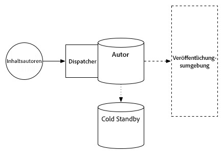

### Vorbereiten des Upgrades {#upgrade-preparation}

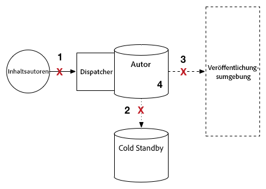

1. Beenden Sie die Inhaltserstellung.

1. Beenden Sie die Standby-Instanz.

1. Deaktivieren Sie Replikationsagenten auf der Autoreninstanz.

1. Führen Sie die [Wartungsaufgaben vor dem Upgrade](/help/sites-deploying/pre-upgrade-maintenance-tasks.md) aus.

### Ausführen des Upgrades {#upgrade-execution}

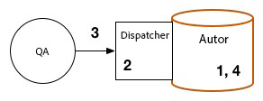

1. Führen Sie das [In-Place-Upgrade](/help/sites-deploying/in-place-upgrade.md) aus.
1. Aktualisieren Sie das Dispatcher-Modul, *falls erforderlich*.

1. Die Qualitätssicherung überprüft das Upgrade.

1. Beenden Sie die Autoreninstanz

### Bei erfolgreichem Upgrade {#if-successful}

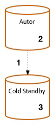

1. Kopieren Sie die aktualisierte Instanz, um eine neue Cold-Standby-Instanz zu erstellen.

1. Starten Sie die Autoreninstanz.

1. Starten Sie die Standby-Instanz.

### Bei fehlgeschlagenem Upgrade (Rollback) {#if-unsuccessful-rollback}

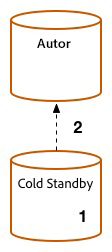

1. Starten Sie die Cold-Standby-Instanz als neue primäre Instanz.

1. Erstellen Sie die Autorenumgebung aus der Cold-Standby-Instanz neu.

## Autoren-Cluster auf MongoMK {#mongomk-author-cluster}

### Starten der Topologie {#starting-topology-1}

In diesem Abschnitt wird von einer Topologie mit einem MongoMK-Autoren-Cluster mit mindestens zwei AEM-Autoreninstanzen ausgegangen, gesichert von mindestens zwei MongoMK-Datenbanken. Die Autoreninstanzen nutzen einen gemeinsamen Datenspeicher. Diese Schritte gelten für S3- und Dateidatenspeicher. Die Replikation erfolgt von Autoren-Servern an die TarMK-Veröffentlichungsfarm.

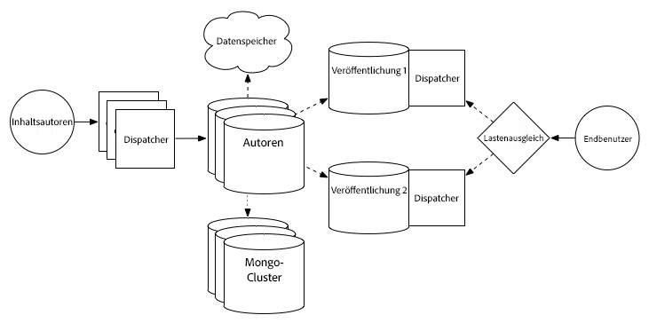

### Vorbereiten des Upgrades {#upgrade-preparation-1}

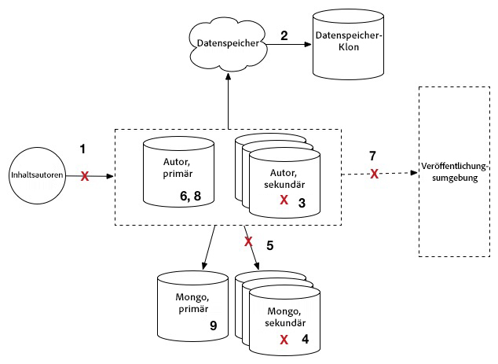

1. Beenden Sie die Inhaltserstellung.
1. Erstellen Sie einen Klon des Datenspeichers als Backup.
1. Beenden Sie alle AEM-Autoreninstanzen bis auf eine, die als primäre Autoreninstanz fungiert.
1. Entfernen Sie alle MongoDB-Knoten aus dem Replikationssatz bis auf einen, der als primäre Mongo-Instanz fungiert.
1. Aktualisieren Sie die Datei `DocumentNodeStoreService.cfg` auf der primären Autoreninstanz, dem einzigen Mitglied des Replikationssatzes.
1. Starten Sie die primäre Autoreninstanz neu, um sicherzustellen, dass diese richtig neu gestartet wird.
1. Deaktivieren Sie die Replikationsagenten auf der primären Autoreninstanz.
1. Führen Sie auf der primären Autoreninstanz die [Wartungsaufgaben vor einem Upgrade](/help/sites-deploying/pre-upgrade-maintenance-tasks.md) aus.
1. Falls erforderlich, aktualisieren Sie MongoDB auf der primären Mongo-Instanz mit WiredTiger auf Version 3.2.

### Ausführen des Upgrades {#Upgrade-execution-1}

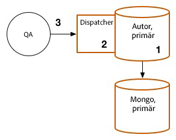

1. Führen Sie auf der primären Autoreninstanz ein [In-Place-Upgrade](/help/sites-deploying/in-place-upgrade.md) aus.
1. Aktualisieren Sie das Dispatcher- oder Web-Modul, *falls erforderlich*.
1. Die Qualitätssicherung überprüft das Upgrade.

### Bei erfolgreichem Upgrade {#if-successful-1}

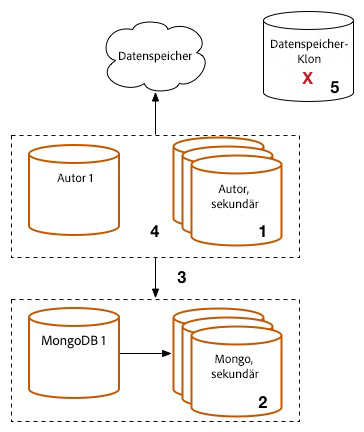

1. Erstellen Sie neue 6.5-Autoreninstanzen, die mit der upgegradeten Mongo-Instanz verbunden sind.

1. Erstellen Sie die MongoDB-Knoten neu, die aus dem Cluster entfernt wurden.

1. Aktualisieren Sie die Dateien `DocumentNodeStoreService.cfg`, damit der vollständige Replikationssatz berücksichtigt wird.

1. Starten Sie die Autoreninstanzen einzeln neu.

1. Entfernen Sie den geklonten Datenspeicher. 

### Bei fehlgeschlagenem Upgrade (Rollback)  {#if-unsuccessful-rollback-2}

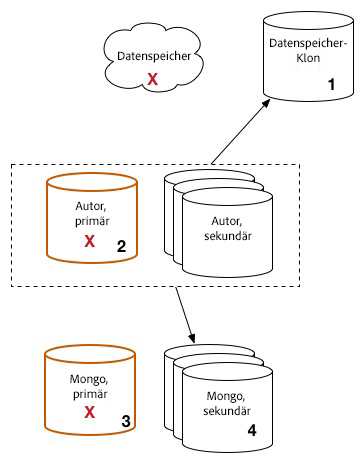

1. Konfigurieren Sie die sekundären Autoreninstanzen neu, um diese mit dem geklonten Datenspeicher zu verbinden.

1. Beenden Sie die aktualisierte primäre Autoreninstanz.

1. Beenden Sie die aktualisierte primäre Mongo-Instanz.

1. Starten Sie die sekundären Mongo-Instanzen, wobei eine dieser Instanzen als neue primäre Instanz fungieren muss.

1. Konfigurieren Sie die Dateien `DocumentNodeStoreService.cfg` auf den sekundären Autoreninstanzen so, dass sie auf den Replikationssatz der noch nicht aktualisierten Mongo-Instanzen verweisen.

1. Starten Sie die sekundären Autoreninstanzen.

1. Bereinigen Sie die aktualisierten Autoreninstanzen, den Mongo-Knoten und den Datenspeicher.

## TarMK-Veröffentlichungsfarm {#tarmk-publish-farm}

### TarMK-Veröffentlichungsfarm {#tarmk-publish-farm-1}

In diesem Abschnitt wird von einer Topologie mit zwei TarMK-Veröffentlichungsinstanzen ausgegangen, mit Dispatchern im Frontend, die wiederum einen Lastenausgleich im Frontend haben. Die Replikation erfolgt vom Autoren-Server an die TarMK-Veröffentlichungsfarm.

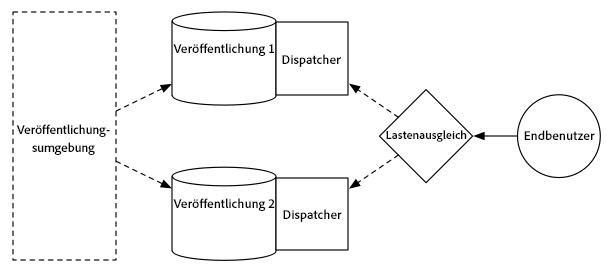

### Ausführen des Upgrades {#upgrade-execution-2}

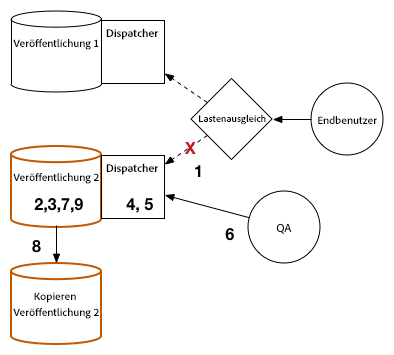

1. Beenden Sie den Traffic an die Veröffentlichungsinstanz 2 im Lastenausgleich.
1. Führen Sie die [Wartungsaufgaben vor einem Upgrade](/help/sites-deploying/pre-upgrade-maintenance-tasks.md) auf der Veröffentlichungsinstanz 2 aus.
1. Führen Sie ein [In-Place-Upgrade](/help/sites-deploying/in-place-upgrade.md) auf der Veröffentlichungsinstanz 2 aus.
1. Aktualisieren Sie das Dispatcher- oder Web-Modul, *falls erforderlich*.
1. Leeren Sie den Dispatcher-Cache.
1. Die Qualitätssicherung validiert die Veröffentlichungsinstanz 2 über den Dispatcher hinter der Firewall.
1. Beenden Sie die Veröffentlichungsinstanz 2.
1. Kopieren Sie die Veröffentlichungsinstanz 2.
1. Starten Sie die Veröffentlichungsinstanz 2.

### Bei erfolgreichem Upgrade {#if-successful-2}

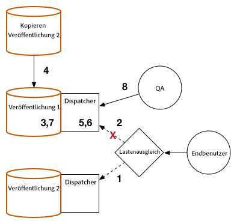

1. Aktivieren Sie Traffic an die Veröffentlichungsinstanz 2.
1. Beenden Sie Traffic an die Veröffentlichungsinstanz 1.
1. Beenden Sie die Veröffentlichungsinstanz 1.
1. Ersetzen Sie die Veröffentlichungsinstanz 1 durch eine Kopie der Veröffentlichungsinstanz 2.
1. Aktualisieren Sie das Dispatcher- oder Web-Modul, *falls erforderlich*.
1. Leeren Sie den Dispatcher-Cache der Veröffentlichungsinstanz 1.
1. Starten Sie die Veröffentlichungsinstanz 1.
1. Die Qualitätssicherung validiert die Veröffentlichungsinstanz 1 über den Dispatcher hinter der Firewall.

### Bei fehlgeschlagenem Upgrade (Rollback) {#if-unsuccessful-rollback-1}

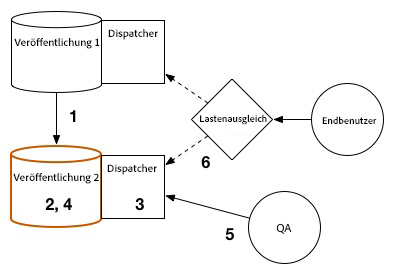

1. Erstellen Sie eine Kopie der Veröffentlichungsinstanz 1.
1. Ersetzen Sie die Veröffentlichungsinstanz 2 durch eine Kopie der Veröffentlichungsinstanz 1.
1. Leeren Sie den Dispatcher-Cache der Veröffentlichungsinstanz 2.
1. Starten Sie die Veröffentlichungsinstanz 2.
1. Die Qualitätssicherung validiert die Veröffentlichungsinstanz 2 über den Dispatcher hinter der Firewall.
1. Aktivieren Sie Traffic an die Veröffentlichungsinstanz 2.

## Abschließende Upgrade-Schritte {#final-upgrade-steps}

1. Aktivieren Sie den Traffic zur Veröffentlichungsinstanz 1.
1. Die Qualitätssicherung führt von einer öffentlichen URL aus die definitive Validierung durch.
1. Aktivieren Sie Replikationsagenten aus der Autorenumgebung.
1. Setzen Sie die Inhaltserstellung fort.
1. Führen Sie [Prüfungen nach dem Upgrade](/help/sites-deploying/post-upgrade-checks-and-troubleshooting.md) durch.

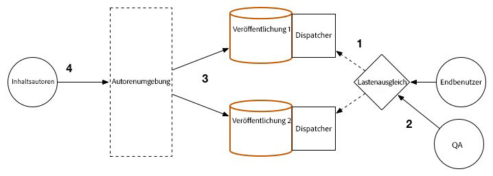
