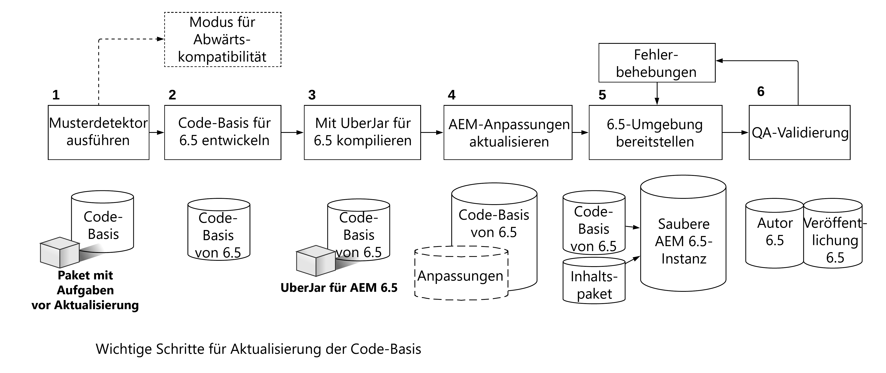

# Upgrades von Code und Anpassungen{#upgrading-code-and-customizations}

Bei der Planung eines Upgrades müssen die folgenden Bereiche einer Implementierung untersucht und berücksichtigt werden.

* [Upgrade der Code-Basis](#upgrade-code-base)
* [Anpassung an die 6.5-Repository-Struktur](#align-repository-structure)
* [AEM-Anpassungen](#aem-customizations)
* [Testverfahren](#testing-procedure)

## Übersicht {#overview}

1. **Mustererkennung**: Führen Sie die Mustererkennung aus, wie in der Upgrade-Planung beschrieben und ausführlich auf [dieser Seite](/help/sites-deploying/pattern-detector.md) beschrieben. Sie erhalten einen Mustererkennungsbericht, der weitere Details zu Bereichen enthält, die zusätzlich zu den nicht verfügbaren APIs/Bundles in der Zielversion von AEM behandelt werden müssen. Der Mustererkennungsbericht gibt Ihnen einen Hinweis auf eventuelle Inkompatibilitäten in Ihrem Code. Wenn keine vorhanden sind, ist Ihre Bereitstellung bereits mit 6.5 kompatibel. Sie können zwar weiterhin eine neue Entwicklung für die Verwendung von 6.5-Funktionen durchführen, benötigen diese jedoch nicht zur bloßen Erhaltung der Kompatibilität. Wenn Unverträglichkeiten gemeldet werden, können Sie den Kompatibilitätsmodus wählen und Ihre Entwicklung für neue 6.5-Funktionen oder Kompatibilität zurückstellen. Oder Sie können sich für die Entwicklung nach der Aktualisierung entscheiden und zu Schritt 2 wechseln. Weitere Informationen finden Sie unter [Abwärtskompatibilität in AEM 6.5](/help/sites-deploying/backward-compatibility.md).

1. **Entwickeln einer Code-Basis für 6.5** – Erstellen Sie eine dedizierte Verzweigung oder ein dediziertes Repository für die Code-Basis der Zielversion. Nutzen Sie bei der Kompatibilitätsprüfung die vor dem Upgrade erfassten Daten, um die Code-Bereiche zu planen, die aktualisiert werden sollen.
1. **Kompilieren mit 6.5 Uber jar** – Aktualisieren Sie die POM-Dateien der Code-Basis, sodass diese auf 6.5 uber jar verweisen, und kompilieren Sie Code dagegen.
1. **Aktualisieren von AEM-Anpassungen*** – *Alle Anpassungen und Erweiterungen von AEM müssen aktualisiert/validiert werden, um in 6.5 zu funktionieren, und zur 6.5-Code-Basis hinzugefügt werden. Dies beinhaltet Benutzeroberflächen-Suchformulare, Asset-Anpassungen und alle Komponenten, die „/mnt/overlay“ verwenden.

1. **Bereitstellung in der Umgebung von 6.5** – Eine neue Instanz von AEM 6.5 (Autor und Veröffentlichung) muss in einer Entwicklungs-/QS-Umgebung bereitgestellt werden. Stellen Sie die aktualisierte Code-Basis und ein repräsentatives Inhaltsbeispiel (aus der aktuellen Produktion) bereit.
1. **QS-Validierung und Fehlerkorrektur** – Die Anwendung muss auf der Autoren- und der Veröffentlichungsinstanz von 6.5 mit QS validiert werden. Korrigieren Sie die gefundenen Fehler und schließen Sie die Korrekturen in der Code-Basis von 6.5 mit ein. Wiederholen Sie den Entwicklungszyklus bei Bedarf, bis alle Fehler behoben sind.

Bevor Sie mit dem Upgrade beginnen, benötigen Sie eine stabile Anwendungs-Code-Basis, die sorgfältig gegen die Zielversion von AEM getestet wurde. Basierend auf den im Rahmen der Tests gemachten Beobachtungen kann der benutzerdefinierte Code möglicherweise optimiert werden. Dies kann die Umstrukturierung des Codes betreffen, um das Durchlaufen des Repositorys zu vermeiden, die benutzerdefinierte Indizierung zur Optimierung der Suche oder die Verwendung ungeordneter Knoten in JCR, um nur einige Beispiele zu nennen.

Neben der optionalen Aktualisierung Ihrer Code-Basis und Anpassungen für die neue AEM-Version hilft 6.5 auch bei der effizienteren Verwaltung Ihrer Anpassungen mit der Abwärtskompatibilitätsfunktion, wie auf [dieser Seite](/help/sites-deploying/backward-compatibility.md) beschrieben.

Wie oben erwähnt und im Diagramm unten dargestellt, kann die Ausführung der [Mustererkennung](/help/sites-deploying/pattern-detector.md) im ersten Schritt helfen, die Gesamtkomplexität des Upgrades zu beurteilen. Sie kann Ihnen auch bei der Entscheidung helfen, ob Sie im Kompatibilitätsmodus arbeiten oder Ihre Anpassungen aktualisieren möchten, um alle neuen Funktionen von AEM 6.5 zu nutzen. Weitere Informationen finden Sie auf der Seite [Abwärtskompatibilität in AEM 6.5](/help/sites-deploying/backward-compatibility.md).
[](assets/upgrade-code-base-highlevel.png)

## Upgrade der Code-Basis {#upgrade-code-base}

### Erstellen einer dedizierten Verzweigung für 6.5-Code in der Versionskontrolle   {#create-a-dedicated-branch-for-6.5-code-in-version-control}

Sämtlicher Code und alle Konfigurationen, die für Ihre AEM Implementierung erforderlich sind, sollten mit einer Versionskontrolle verwaltet werden. Es sollte eine dedizierte Verzweigung in der Versionskontrolle erstellt werden, um alle Änderungen zu verwalten, die für die Code-Basis in der Zielversion von AEM erforderlich sind. Iterative Tests der Code-Basis mit der Zielversion von AEM und nachfolgenden Fehlerbehebungen werden in dieser Verzweigung verwaltet.

### Aktualisieren der UberJar-Version von AEM {#update-the-aem-uber-jar-version}

AEM-UberJar beinhaltet alle AEM-APIs als einzelne Abhängigkeiten in der Datei `pom.xml` des Maven-Projekts. Es empfiehlt sich immer, das Uber Jar als einzelne Abhängigkeit einzubeziehen, anstatt einzelne AEM API-Abhängigkeiten einzubeziehen. Beim Upgrade der Code-Basis ändern Sie die Version des Uber Jar so, dass sie auf die Zielversion von AEM verweist. Wenn Ihr Projekt mit einer Version von AEM entwickelt wurde, die schon vor dem Uber Jar existierte, entfernen Sie alle einzelnen AEM-API-Abhängigkeiten. Ersetzen Sie sie durch eine einzelne Einbindung des Uber Jar für die Zielversion von AEM. Kompilieren Sie die Code-Basis erneut mit der neuen Version des Uber Jar. Aktualisieren Sie alle veralteten APIs oder Methoden, damit sie mit der Zielversion von AEM kompatibel sind.

```
<dependency>
    <groupId>com.adobe.aem</groupId>
    <artifactId>uber-jar</artifactId>
    <version>6.5.0</version>
    <classifier>apis</classifier>
    <scope>provided</scope>
</dependency>
```

### Auslaufen der Verwendung des administrativen Ressourcen-Resolvers {#phase-out-use-of-administrative-resource-resolver}

Die Verwendung einer administrativen Sitzung über `SlingRepository.loginAdministrative()` und `ResourceResolverFactory.getAdministrativeResourceResolver()` war in Code-Basen vor AEM 6.0 weit verbreitet. Diese Methoden sind aus Sicherheitsgründen veraltet, da sie einen zu umfassenden Zugriff ermöglichen. [In zukünftigen Versionen von Sling werden diese Methoden entfernt](https://sling.apache.org/documentation/the-sling-engine/service-authentication.html#deprecation-of-administrative-authentication). Es wird dringend empfohlen, jeden Code neu zu strukturieren, um stattdessen Service-Benutzende zu verwenden. Weitere Informationen zu Service-Benutzenden und [Informationen zum Auslaufen von administrativen Sitzungen finden Sie hier](/help/sites-administering/security-service-users.md#how-to-phase-out=admin-sessions)..

### Abfragen und Oak-Indizes {#queries-and-oak-indexes}

Abfragen in der Code-Basis müssen im Rahmen deren Upgrades sorgfältig getestet werden. Für Kundinnen und Kunden, die ein Upgrade von Jackrabbit 2 (AEM-Versionen älter als 6.0) durchführen, ist dieser Test besonders wichtig, da Oak Inhalte nicht automatisch indiziert und benutzerdefinierte Indizes erstellt werden müssen. Falls Sie von einer AEM 6.x-Version aus ein Upgrade durchführen, haben sich die vorkonfigurierten Oak-Indexdefinitionen möglicherweise geändert, was sich auf vorhandene Abfragen auswirken kann.

Die folgenden Tools stehen zur Analyse und Überprüfung der Abfrageleistung zur Verfügung:

* [AEM-Indizierungs-Tools](/help/sites-deploying/queries-and-indexing.md)

* [Vorgangsdiagnose-Tools für die Abfrageleistung](/help/sites-administering/operations-dashboard.md#diagnosis-tools)

<!-- URL is 404 as of 04/24/23; commenting out * [Oak Utils](https://oakutils.appspot.com/). This is an open source tool that is not maintained by Adobe. -->

### Klassisches Benutzeroberflächen-Authoring {#classic-ui-authoring}

Das klassische Benutzeroberflächen-Authoring ist in AEM 6.5 weiterhin verfügbar, ist jedoch veraltet. Weitere Informationen finden Sie [hier](/help/release-notes/deprecated-removed-features.md#pre-announcement-for-next-release). Falls Ihre Anwendung in einer Umgebung mit klassischem Benutzeroberflächen-Authoring ausgeführt wird, wird empfohlen, auf AEM 6.5 zu aktualisieren und die klassische Benutzeroberfläche weiterhin zu verwenden. Die Migration zur Touch-optimierten Benutzeroberfläche kann dann als separates Projekt geplant werden, das über mehrere Entwicklungszyklen hinweg durchgeführt wird. Um die klassische Benutzeroberfläche in AEM 6.5 zu verwenden, müssen mehrere OSGi-Konfigurationen in die Code-Basis aufgenommen werden. Einzelheiten zur Konfiguration finden Sie [hier](/help/sites-administering/enable-classic-ui.md).

## Anpassung an die 6.5-Repository-Struktur {#align-repository-structure}

Um Upgrades zu vereinfachen und um sicherzustellen, dass Konfigurationen nicht bei einem Upgrade überschrieben werden, wurde das Repository in 6.4 neu strukturiert, damit Inhalte und Konfiguration voneinander getrennt sind.

Daher müssen mehrere Einstellungen verschoben werden, damit sie nicht mehr wie bisher unter `/etc` zu finden sind. Eine vollständige Aufstellung aller fraglichen Punkte zur Repository-Neustrukturierung, die bei der Aktualisierung auf AEM 6.4 überprüft und berücksichtigt werden müssen, finden Sie unter [Repository-Neustrukturierung in AEM 6.4](/help/sites-deploying/repository-restructuring.md).

## AEM-Anpassungen  {#aem-customizations}

Alle Anpassungen an die AEM-Authoring-Umgebung in der Quellversion von AEM müssen identifiziert werden. Nach der Identifizierung wird empfohlen, jede Anpassung in der Versionskontrolle zu speichern oder mindestens als Teil eines Inhaltspakets zu sichern. Vor einem Produktions-Upgrade müssen alle Anpassungen in einer QA- oder Staging-Umgebung bereitgestellt und validiert werden, die auf der Zielversion von AEM ausgeführt wird.

### Allgemeines zu Überlagerungen {#overlays-in-general}

Es ist eine gängige Praxis, eine von AEM vorkonfigurierte Funktionalität zu erweitern, indem Knoten und/oder Dateien unter „/libs“ mit zusätzlichen Knoten unter „/apps“ überlagert werden. Diese Überlagerungen sollten in der Versionskontrolle nachverfolgt und mit der Zielversion von AEM getestet werden. Wenn eine Datei (z. B. JS, JSP, HTL) überlagert wird, empfiehlt Adobe, dass Sie einen Kommentar dazu hinterlassen, welche Funktionen erweitert wurden, um Regressionstests in der Zielversion von AEM zu erleichtern. Weitere Informationen zu Überlagerungen im Allgemeinen finden Sie [hier](/help/sites-developing/overlays.md). Anweisungen zu bestimmten AEM-Überlagerungen finden Sie im Anschluss.

### Upgrades von benutzerdefinierten Suchformularen {#upgrading-custom-search-forms}

Benutzerdefinierte Suchfacetten erfordern nach dem Upgrade einige manuelle Anpassungen, um ordnungsgemäß zu funktionieren. Weitere Einzelheiten finden Sie unter [Upgrades von benutzerdefinierten Suchformularen](/help/sites-deploying/upgrading-custom-search-forms.md).

### Anpassungen der Assets-Benutzeroberfläche {#assets-ui-customizations}

>[!NOTE]
>
>Dieses Verfahren ist nur für Upgrades von Versionen vor AEM 6.2 erforderlich.

Instanzen mit angepassten Asset-Bereitstellungen müssen für das Upgrade vorbereitet werden. Diese Aktion ist erforderlich, um sicherzustellen, dass alle angepassten Inhalte mit der neuen Knotenstruktur in 6.4 kompatibel sind.

Sie können die Assets-UI-Anpassungen wie folgt vorbereiten:

1. Öffnen Sie CRXDE Lite auf der Instanz, die aktualisiert wird, indem Sie zu *https://server:port/crx/de/index.jsp* gehen

1. Navigieren Sie zum folgenden Knoten:

   * `/apps/dam/content`

1. Benennen Sie den Inhaltsknoten in **content_backup** um, indem Sie mit der rechten Maustaste auf den Explorer-Bereich auf der linken Seite des Fensters klicken und **Umbenennen** auswählen.

1. Wenn Sie den Knoten umbenannt haben, erstellen Sie unter `/apps/dam` einen Knoten namens **content** und legen Sie als Knotentyp **sling:Folder** fest.

1. Verschieben Sie alle untergeordneten Knoten von **content_backup** zum neu erstellten Inhaltsknoten, indem Sie mit der rechten Maustaste auf jeden untergeordneten Knoten im Explorer-Bereich klicken und **Verschieben** auswählen.

1. Löschen Sie den Knoten **content_backup**.

1. Die aktualisierten Knoten unter `/apps/dam` mit dem richtigen Knotentyp `sling:Folder` sollten idealerweise in der Versionskontrolle gespeichert und mit der Code-Basis oder als minimale Sicherungskopie eines Inhaltspakets bereitgestellt werden.

### Generieren von Asset-IDs für vorhandene Assets {#generating-asset-ids-for-existing-assets}

Um Asset-IDs für vorhandene Assets zu generieren, führen Sie für diese ein Upgrade durch, wenn Sie die AEM-Instanz auf AEM 6.5 aktualisieren. Dieser Schritt ist erforderlich, um die Funktion [Assets Insights](/help/assets/asset-insights.md) zu aktivieren. Weitere Einzelheiten finden Sie unter [Hinzufügen von Einbettungs-Code](/help/assets/use-page-tracker.md#add-embed-code).

Um Assets upzugraden, konfigurieren Sie das Paket „Associate Asset IDs“ in der JMX-Konsole. Je nach Anzahl der Assets im Repository kann das Ausführen von `migrateAllAssets` lange dauern. Interne Tests von Adobe gehen von etwa einer Stunde für 125.000 Assets auf TarMK aus.


Falls Sie Asset-IDs für eine Untermenge Ihrer gesamten Assets benötigen, verwenden Sie die API `migrateAssetsAtPath`.

Verwenden Sie für alle anderen Zwecke die API `migrateAllAssets()`.

### InDesign-Skript-Anpassungen {#indesign-script-customizations}

Adobe empfiehlt, benutzerdefinierte Skripte unter `/apps/settings/dam/indesign/scripts` abzulegen. Weitere Informationen zu InDesign-Skript-Anpassungen finden Sie [hier](/help/assets/indesign.md#configuring-the-aem-assets-workflow).

### Wiederherstellen von ContextHub-Konfigurationen {#recovering-contexthub-configurations}

Upgrades wirken sich auf ContextHub-Konfigurationen aus. Anweisungen, wie Sie vorhandene ContextHub-Konfigurationen wiederherstellen, finden Sie [hier](/help/sites-developing/ch-configuring.md#recovering-contexthub-configurations-after-upgrading).

### Workflow-Anpassungen {#workflow-customizations}

Es ist gängige Praxis, vordefinierte Workflows zu bearbeiten, um nicht benötigte Funktionen hinzuzufügen oder zu entfernen. Der Workflow [!UICONTROL DAM-Update-Asset] ist ein typischer Workflow, der häufig angepasst wird. Erstellen Sie eine Sicherungskopie aller für eine angepasste Implementierung erforderlichen Workflows und speichern Sie diese in der Versionskontrolle, da sie möglicherweise bei einem Upgrade überschrieben werden.

### Bearbeitbare Vorlagen {#editable-templates}

>[!NOTE]
>
>Dieses Verfahren ist nur für Website-Upgrades erforderlich, bei denen bearbeitbare Vorlagen aus AEM 6.2 verwendet werden.

Die Struktur bearbeitbarer Vorlagen wurde zwischen AEM 6.2 und 6.3 geändert. Wenn Sie ein Upgrade von 6.2 oder früher durchführen und Ihr Site-Inhalt mithilfe bearbeitbarer Vorlagen erstellt wurde, müssen Sie das [Bereinigungs-Tool für responsive Knoten](https://github.com/Adobe-Marketing-Cloud/aem-sites-template-migration) verwenden. Das Tool muss **nach** einem Upgrade ausgeführt werden, um Inhalte zu bereinigen. Führen Sie sie sowohl auf der Authoring- als auch auf der Publishing-Ebene aus.

### Änderungen an der CUG-Implementierung {#cug-implementation-changes}

Die Implementierung von geschlossenen Benutzergruppen (Closed User Groups, CUG) hat sich erheblich geändert, um Leistungs- und Skalierbarkeitsbeschränkungen in früheren Versionen von AEM zu beheben. Die vorherige Version von CUG wurde in Version 6.3 eingestellt, und die neue Implementierung wird nur in der Touch-Benutzeroberfläche unterstützt. Wenn Sie ein Upgrade von 6.2 oder früher durchführen, finden Sie [hier](/help/sites-administering/closed-user-groups.md#upgradetoaem63) eine Anleitung für das Migrieren zur neuen CUG-Implementierung.

## Testverfahren {#testing-procedure}

Zum Testen von Upgrades sollte ein umfassender Testplan erstellt werden. Das Testen der aktualisierten Code-Basis und Anwendung muss zunächst in niedrigeren Umgebungen erfolgen. Alle Fehler müssen iterativ korrigiert werden, bis die Code-Basis stabil ist. Führen Sie erst dann Upgrades für Umgebungen auf höherer Ebene durch.

### Testen des Upgrade-Verfahrens {#testing-the-upgrade-procedure}

Testen Sie das hier beschriebene Upgrade-Verfahren in Entwicklungs- und QA-Umgebungen, wie im benutzerdefinierten Runbook dokumentiert (siehe [Planung des Upgrades](/help/sites-deploying/upgrade-planning.md)). Das Upgrade-Verfahren muss wiederholt werden, bis alle Schritte im Upgrade-Runbook dokumentiert sind und das Upgrade-Verfahren reibungslos läuft.

### Implementierungstestbereiche  {#implementation-test-areas-}

Im Folgenden sind wichtige Bereiche einer AEM-Implementierung genannt, die vom Testplan abgedeckt sein müssen, sobald die Umgebung upgegradet und die aktualisierte Code-Basis bereitgestellt wurde.

<table>
 <tbody>
  <tr>
   <td><strong>Funktioneller Testbereich</strong></td>
   <td><strong>Beschreibung</strong></td>
  </tr>
  <tr>
   <td>Veröffentlichte Sites</td>
   <td>Testen der AEM-Implementierung und des zugehörigen Codes auf der Veröffentlichungsebene<br /> über den Dispatcher. Sollte Kriterien für Seitenaktualisierungen und<br /> Cache-Invalidierung enthalten.</td>
  </tr>
  <tr>
   <td>Authoring</td>
   <td>Testen von AEM-Implementierung und zugehörigem Code auf der Autorenschicht. Sollte Seiten-, Komponenten-Authoring- und Dialogfelder enthalten.</td>
  </tr>
  <tr>
   <td>Integrationen mit Experience Cloud-Lösungen</td>
   <td>Validieren von Integrationen mit Produkten wie Analytics, DTM und Target.</td>
  </tr>
  <tr>
   <td>Integrationen mit Drittanbietersystemen</td>
   <td>Validieren aller Drittanbieterintegrationen auf der Authoring- und Publishing-Ebene.</td>
  </tr>
  <tr>
   <td>Authentifizierung, Sicherheit und Berechtigungen</td>
   <td>Alle Authentifizierungsmechanismen wie LDAP/SAML sollten überprüft werden.<br /> Berechtigungen und Gruppen sollten sowohl auf der Authoring- als auch auf der Publishing-Ebene<br /> getestet werden.</td>
  </tr>
  <tr>
   <td>Abfragen</td>
   <td>Benutzerdefinierte Indizes und Abfragen sollten zusammen mit der Abfrageleistung getestet werden.</td>
  </tr>
  <tr>
   <td>Benutzeroberflächenanpassungen</td>
   <td>Alle Erweiterungen oder Anpassungen der AEM-Benutzeroberfläche in der Autorenumgebung.</td>
  </tr>
  <tr>
   <td>Workflows</td>
   <td>Benutzerdefinierte und/oder vordefinierte Workflows und Funktionen.</td>
  </tr>
  <tr>
   <td>Leistungstests</td>
   <td>Lasttests sollten sowohl auf der Authoring- als auch auf der Publishing-Ebene durchgeführt werden, um reale Szenarien zu simulieren.</td>
  </tr>
 </tbody>
</table>

### Dokumenttestplan und Ergebnisse {#document-test-plan-and-results}

Es sollte ein Testplan erstellt werden, der die oben genannten Implementierungstestbereiche abdeckt. Oft ist es sinnvoll, den Testplan nach Aufgabenlisten für Authoring- und Publishing-Aufgaben zu trennen. Dieser Testplan muss auf Entwicklungs-, QA- und Staging-Umgebungen ausgeführt werden, bevor Produktionsumgebungen aktualisiert werden. Erfassen Sie die Testergebnisse und Leistungsmetriken aus Umgebungen niedrigerer Ebenen als Referenzwerte für das Upgrade der Staging- und Produktionsumgebungen.
