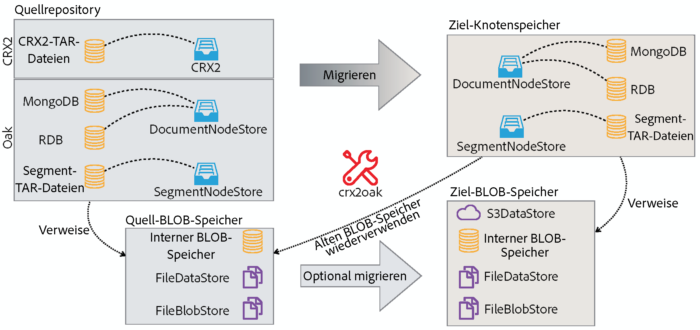
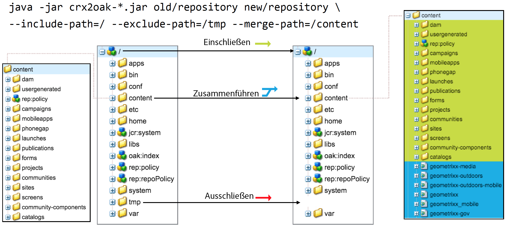
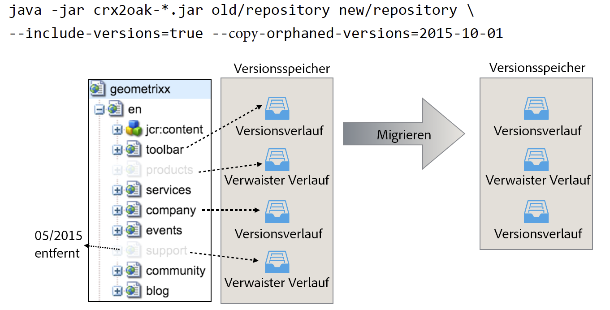

# Verwendung des CRX2OAK-Migrationstools{#using-the-crx-oak-migration-tool}

## Einführung {#introduction}

CRX2Oak ist ein Tool für die Migration von Daten zwischen verschiedenen Repositorys.

Es kann zur Migration von Daten aus älteren CQ-Versionen, die auf Apache Jackrabbit 2 basieren, nach Oak verwendet werden, sowie zum Kopieren von Daten zwischen Oak-Repositorys.

Sie können die neueste Version von crx2oak aus dem Repository der öffentlichen Adobe unter diesem Speicherort herunterladen:
[https://repo1.maven.org/maven2/com/adobe/granite/crx2oak/](https://repo1.maven.org/maven2/com/adobe/granite/crx2oak/)

Die Liste der Änderungen und Fehlerbehebungen für die aktuelle Version finden Sie in den [Versionshinweisen zu CRX2OAK](https://docs.adobe.com/content/help/en/experience-manager-64/release-notes/crx2oak.html).

>[!NOTE]
>
>Weitere Informationen zu Apache Oak sowie zu den Grundkonzepten der AEM-Persistenz finden Sie unter [Einführung in die AEM-Plattform](/help/sites-deploying/platform.md).

## Anwendungsfälle zu Migration {#migration-use-cases}

Dieses Tool kann für folgende Anwendungsfälle verwendet werden:

* Migration von älteren CQ 5-Versionen nach AEM 6
* Kopieren von Daten zwischen mehreren Oak-Repositorys
* Konvertieren von Daten zwischen unterschiedlichen Oak-Mikrokernel-Implementierungen.

Die Unterstützung für die Migration von Repositorys mit externen BLOB-Speichern (allgemein als Datenspeicher bekannt) wird in unterschiedlicher Form bereitgestellt. Ein möglicher Migrationspfad ist von einem CRX2-Repository, das einen externen `FileDataStore` nutzt, auf ein Oak-Repository, das einen `S3DataStore` verwendet.

Das nachfolgende Diagramm zeigt alle von CRX2Oak unterstützten Migrationsoptionen:



## Funktionen {#features}

CRX2OAK wird bei AEM-Aktualisierungen aufgerufen. Dabei kann der Benutzer ein vordefiniertes Migrationsprofil angeben, das die Rekonfiguration von Persistenzmodi automatisiert. Dies wird als Quickstart-Modus bezeichnet.

Das Tool kann auch separat ausgeführt werden, für den Fall, dass eine umfassendere Anpassung erforderlich ist. Beachten Sie jedoch, dass in diesem Modus Änderungen nur am Repository vorgenommen werden und dass jede weitere Neukonfiguration von AEM manuell durchgeführt werden muss. Dies wird als Standalone-Modus bezeichnet.

Eine weitere Besonderheit besteht darin, dass mit den Standardeinstellungen des Standalone-Modus nur der Knotenspeicher migriert wird und dass das neue Repository den alten Binärspeicher wiederverwendet.

### Automatisierter Quickstart-Modus {#automated-quickstart-mode}

Ab AEM 6.3 kann das CRX2OAK-Tool benutzerdefinierte Migrationsprofile verarbeiten. Diese können so konfiguriert werden, dass alle Migrationsoptionen bereits verfügbar sind. Damit wird die Flexibilität gesteigert und eine Automatisierung der AEM-Konfiguration ermöglicht. Funktionen wie diese stehen nicht zur Verfügung, wenn Sie das Tool im Standalone-Modus verwenden.

Um CRX2OAK in den Quickstart-Modus zu schalten, müssen Sie den Pfad zum Ordner „crx-quickstart“ im AEM-Installationsverzeichnis mithilfe der folgenden Betriebssystemvariablen definieren:

**Für UNIX-basierte Systeme und Mac OS:**

```shell
export SLING_HOME="/path/to/crx-quickstart"
```

**Für Windows:**

```shell
SET "SLING_HOME=/path/to/crx-quickstart"
```

#### Fortsetzung der Unterstützung {#resume-support}

Die Migration kann jederzeit unterbrochen und anschließend wieder fortgesetzt werden.

#### Anpassbare Aktualisierungslogik {#customizable-upgrade-logic}

Mithilfe von `CommitHooks` kann auch eine benutzerdefinierte Java-Logik implementiert werden. Benutzerdefinierte `RepositoryInitializer`-Klassen können implementiert werden, um das Repository mit benutzerdefinierten Werten zu initialisieren.

#### Unterstützung für Speicherzuordnungsvorgänge {#support-for-memory-mapped-operations}

CRX2OAK unterstützt standardmäßig auch Speicherzuordnungsvorgänge. Durch die Speicherzuordnung wird die Leistung erheblich verbessert. Diese Funktion sollte deshalb nach Möglichkeit verwendet werden.

>[!CAUTION]
>
>Beachten Sie jedoch, dass Speicherzuordnungsvorgänge für Windows-Plattformen nicht unterstützt werden. Daher wird empfohlen, die **—disable-mmap** -Parameter bei der Migration unter Windows.

#### Selektive Migration von Inhalten {#selective-migration-of-content}

Standardmäßig migriert das Tool das gesamte Repository unter dem `"/"` Pfad. Sie haben jedoch die vollständige Kontrolle darüber, welche Inhalte migriert werden sollen.

Wenn ein Teil des Inhalts auf der neuen Instanz nicht benötigt wird, können Sie die `--exclude-path` -Parameter, um den Inhalt auszuschließen und das Aktualisierungsverfahren zu optimieren.

#### Zusammenführung von Pfaden {#path-merging}

Wenn Daten zwischen zwei Repositorys kopiert werden müssen und Sie einen Inhaltspfad haben, der von beiden Instanzen unterschiedlich ist, können Sie sie im `--merge-path` Parameter. CRX2OAK kopiert dann nur die neuen Knoten in das Ziel-Repository und behält die alten im anderen Repository bei.



#### Versionsunterstützung {#version-support}

Standardmäßig erstellt AEM eine Version jedes Knotens oder jeder Seite, der bzw. die geändert wird, und speichert diese/n im Repository. Diese Versionen können dann zum Wiederherstellen eines früheren Status der Seite verwendet werden.

Allerdings werden diese Versionen nie bereinigt, auch wenn die Originalseite gelöscht wird. Bei Repositorys, die bereits lange Zeit verwendet werden, muss bei der Migration möglicherweise ein hohes Volumen von redundanten Daten verarbeitet werden. Schuld daran sind verwaiste Versionen.

Eine nützliche Funktion für diese Arten von Situationen ist das Hinzufügen der `--copy-versions` Parameter. Sie kann verwendet werden, um die Versionsknoten während der Migration oder Kopie eines Repositorys zu überspringen.

Sie können auch festlegen, ob verwaiste Versionen kopiert werden sollen, indem Sie `--copy-orphaned-versions=true`.

Beide Parameter unterstützen auch eine `YYYY-MM-DD` Datumsformat, falls Sie Versionen bis zu einem bestimmten Datum kopieren möchten.



#### Open-Source-Version {#open-source-version}

Eine Open-Source-Version von CRX2OAK ist als „Oak-Upgrade“ verfügbar. Es unterstützt alle Funktionen, mit Ausnahme der folgenden:

* CRX2-Unterstützung
* Unterstützung für Migrationsprofilen
* Unterstützung für die automatisierte AEM-Neukonfiguration

Siehe [Apache-Dokumentation](https://jackrabbit.apache.org/oak/docs/migration.html) für weitere Informationen.

## Parameter {#parameters}

### Knotenspeicheroptionen {#node-store-options}

* `--cache`: Die Cache-Größe in MB (der Standardwert beträgt `256`)

* `--mmap`: Aktivieren des Zugriffs auf die Speicherdatei für die Segmentspeicherung
* `--src-password:` Das Kennwort für die RDB-Quell-Datenbank

* `--src-user:` Der Benutzer für die Quell-RDB

* `--user`: Der Benutzer für die Ziel-RDB

* `--password`: Kennwort für die Ziel-RDB.

### Migrationsoptionen {#migration-options}

* `--early-shutdown`: Fährt das JCR2-Quell-Repository nach dem Kopieren der Knoten herunter, bevor die CommitHooks angewendet werden
* `--fail-on-error`: Erzwingt ein Fehlschlagen der Migration, wenn die Knoten nicht aus dem Quell-Repository gelesen werden können.
* `--ldap`: Migriert LDAP-Benutzer von einer CQ 5.x-Instanz zu einer Oak-basierten Instanz. Dies funktioniert jedoch nur, wenn der Identitätsanbieter in der Oak-Konfiguration als „ldap“ angegeben ist. Weitere Informationen finden Sie in der [LDAP-Dokumentation](/help/sites-administering/ldap-config.md).

* `--ldap-config:` Verwenden Sie dies zusammen mit dem `--ldap` Parameter für CQ 5.x-Repositorys, die mehrere LDAP-Server zur Authentifizierung verwendet haben. Sie können es verwenden, um auf CQ 5.x zu verweisen. `ldap_login.conf` oder `jaas.conf` Konfigurationsdateien. Das Format lautet `--ldapconfig=path/to/ldap_login.conf`.

### Optionen für die Versionsspeicherung {#version-store-options}

* `--copy-orphaned-versions`: Überspringt das Kopieren verwaister Versionen. Folgende Parameter werden unterstützt: `true`, `false` und `yyyy-mm-dd`. Standardwert ist `true`.

* `--copy-versions:` Kopiert den Versionsspeicher. Parameter: `true`, `false`, `yyyy-mm-dd`. Standardwert ist `true`.

#### Pfadoptionen {#path-options}

* `--include-paths:` Kommagetrennte Liste von Pfaden, die beim Kopieren einbezogen werden sollen
* `--merge-paths`: Kommagetrennte Liste der beim Kopieren zusammenzuführenden Pfade
* `--exclude-paths:` Eine kommagetrennte Liste der beim Kopieren auszuschließenden Pfade.

### Quell BLOB-Speicheroptionen {#source-blob-store-options}

* `--src-datastore:` Das Datenspeicherverzeichnis, das als Quelle verwendet werden soll `FileDataStore`

* `--src-fileblobstore`: Das Datenspeicherverzeichnis, das als Quelle verwendet werden soll `FileBlobStore`

* `--src-s3datastore`: Das Datenspeicherverzeichnis, das für die Quelle verwendet werden soll `S3DataStore`

* `--src-s3config`: Die Konfigurationsdatei für die Quelle `S3DataStore`.

### Ziel BLOB-Speicheroptionen {#destination-blobstore-options}

* `--datastore:` Das Datenspeicherverzeichnis, das als Ziel verwendet werden soll `FileDataStore`

* `--fileblobstore:` Das Datenspeicherverzeichnis, das als Ziel verwendet werden soll `FileBlobStore`

* `--s3datastore`: Das für das Ziel zu verwendende Datenspeicherverzeichnis. `S3DataStore`

* `--s3config`: Die Konfigurationsdatei für die Zielgruppe `S3DataStore`.

### Hilfeoptionen {#help-options}

* `-?, -h, --help:` Zeigt Hilfeinformationen an.

## Debugging {#debugging}

Sie können für den Migrationsvorgang auch Informationen zur Fehlerbehebung aktivieren, sodass potenziell auftretende Fehler behoben werden können. Hierzu gibt es verschiedene Optionen, je nachdem, in welchem Modus das Tool ausgeführt werden soll:

<table>
 <tbody>
  <tr>
   <td><strong>CRX2Oak-Modus</strong></td>
   <td><strong>Aktion</strong></td>
  </tr>
  <tr>
   <td>Quickstart-Modus</td>
   <td>Sie können die <strong>—log-level-TRACE</strong> oder <strong>—DEBUG auf Protokollebene </strong>Optionen zur Befehlszeile beim Ausführen von CRX2Oak. In diesem Modus werden Protokolle automatisch an die <strong>Datei upgrade.log</strong>.</td>
  </tr>
  <tr>
   <td>Standalone-Modus</td>
   <td><p>Fügen Sie die <strong>—trace</strong> Optionen zur CRX2Oak-Befehlszeile hinzufügen, um TRACE-Ereignisse bei der Standardausgabe anzuzeigen (Sie müssen die Protokolle selbst mithilfe eines Umleitungszeichens umleiten: '&gt;' oder 'tee'-Befehl für die spätere Überprüfung).</p> </td>
  </tr>
 </tbody>
</table>

## Weitere Überlegungen {#other-considerations}

Bei der Migration auf eine MongoDB-Replikatgruppe muss der Parameter `WriteConcern` für alle Verbindungen mit der Mongo-Datenbank auf `2` gesetzt werden.

Hierzu können Sie den Parameter `w=2` wie nachfolgend gezeigt am Ende der Verbindungszeichenfolge hinzufügen:

```xml
java -Xmx4092m -XX:MaxPermSize=1024m -jar crx2oak.jar crx-quickstart/repository/ mongodb://localhost:27017/aem-author?replicaset=replica1&w=2
```

>[!NOTE]
>
>Weitere Informationen finden Sie in der Dokumentation zur MongoDB-Verbindungszeichenfolge unter [WriteConcerns](https://docs.mongodb.org/manual/reference/connection-string/#write-concern-options).
