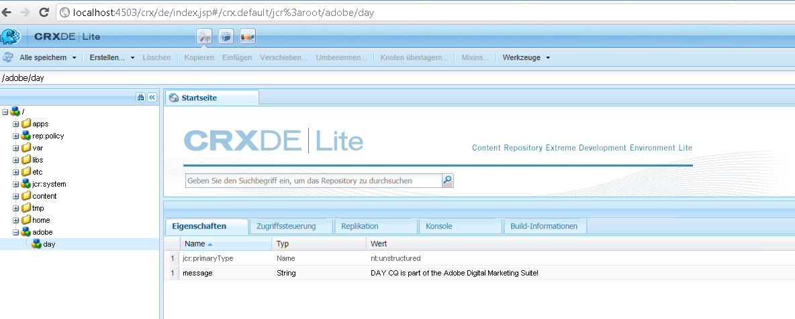

# Anleitung für den programmgesteuerten Zugriff auf das AEM-JCR{#how-to-programmatically-access-the-aem-jcr}

Sie können programmgesteuert Knoten und Eigenschaften ändern, die sich innerhalb des Adobe CQ-Repositorys befinden, das Teil von Adobe Marketing Cloud ist. Für den Zugriff auf das CQ-Repository verwenden Sie die Java Content Repository (JCR)-API. Mit der JCR-API können Sie Erstellungs-, Ersetzungs-, Aktualisierungs- und Lösch- (CRUD)-Vorgänge für Inhalte im Adobe CQ-Repository durchführen. Weitere Informationen zur Java JCR-API finden Sie unter [https://jackrabbit.apache.org/jcr/jcr-api.html](https://jackrabbit.apache.org/jcr/jcr-api.html).

>[!NOTE]
>
>Dieser Entwicklungsartikel modifiziert das Adobe CQ-JCR aus einer externen Java-Anwendung. Es besteht auch die Möglichkeit, das JCR aus einem OSGi-Bundle mithilfe der JCR-API zu modifizieren. Weitere Informationen finden Sie unter [Beständige CQ-Daten im Java Content Repository](https://helpx.adobe.com/experience-manager/using/persisting-cq-data-java-content1.html).

>[!NOTE]
>
>Um die JCR-API zu verwenden, fügen Sie die Datei `jackrabbit-standalone-2.4.0.jar` zum Klassenpfad Ihrer Java-Anwendung hinzu. Sie können diese JAR-Datei von der Java JCR API-Webseite unter [https://jackrabbit.apache.org/jcr/jcr-api.html](https://jackrabbit.apache.org/jcr/jcr-api.html) abrufen.

>[!NOTE]
>
>Eine Anleitung zur Abfrage des Adobe CQ-JCR mithilfe der JCR-Abfrage-API finden Sie in [Abfragen von Adobe Experience Manager-Daten mit der JCR-API](https://helpx.adobe.com/experience-manager/using/querying-experience-manager-data-using1.html).

## Repository-Instanz erstellen  {#create-a-repository-instance}

Es gibt unterschiedliche Verfahren zur Herstellung einer Verbindung mit einem Repository. In diesem Entwicklungsartikel wird eine statische Methode verwendet, die der Klasse `org.apache.jackrabbit.commons.JcrUtils` zuzuordnen ist. Der Name der Methode lautet `getRepository`. Diese Methode verwendet einen Zeichenfolgenparameter, der die URL des Adobe CQ-Servers darstellt. Beispiel `http://localhost:4503/crx/server`.

Die Methode `getRepository` gibt eine `Repository`-Instanz zurück, was im folgenden Codebeispiel veranschaulicht wird.

```java
//Create a connection to the AEM JCR repository running on local host
Repository repository = JcrUtils.getRepository("http://localhost:4503/crx/server");
```

## Sitzungsinstanz erstellen {#create-a-session-instance}

Die `Repository`Instanz stellt das CRX-Repository dar. Sie verwenden die `Repository`Instanz, um eine Sitzung mit dem Repository einzurichten. Um eine Sitzung zu erstellen, rufen Sie die `login`Instanz-Methode auf und übergeben Sie ein `javax.jcr.SimpleCredentials`-Objekt. `Repository` Die `login`Methode gibt eine `javax.jcr.Session` -Instanz zurück.

Sie erstellen ein `SimpleCredentials`Objekt, indem Sie dessen Konstruktor verwenden und die folgenden Zeichenfolgenwerte übergeben:

* den Benutzernamen und
* das zugehörige Kennwort

Rufen Sie beim Übergeben des zweiten Parameters die `toCharArray`Methode des String-Objekts auf. Der folgende Code zeigt, wie die `login`Methode aufgerufen wird, die einen `javax.jcr.Sessioninstance` zurückgibt.

```java
//Create a Session instance
javax.jcr.Session session = repository.login( new SimpleCredentials("admin", "admin".toCharArray()));
```

## Knoteninstanz erstellen {#create-a-node-instance}

Verwenden Sie eine `Session`Instanz, um eine `javax.jcr.Node`-Instanz zu erstellen. Mit einer `Node`Instanz können Sie Knotenvorgänge ausführen. Beispielsweise können Sie einen neuen Knoten erstellen. Um einen Knoten zu erstellen, der den Stammknoten darstellt, rufen Sie die `getRootNode`-Methode der `Session`Instanz auf, wie in der folgenden Codezeile dargestellt.

```java
//Create a Node
Node root = session.getRootNode();
```

Nachdem Sie eine `Node`Instanz erstellt haben, können Sie Aufgaben wie das Erstellen eines anderen Knotens und das Hinzufügen eines Werts dazu ausführen. Mit dem folgenden Code werden beispielsweise zwei Knoten erstellt und dem zweiten Knoten ein Wert hinzugefügt.

```java
// Store content
Node day = adobe.addNode("day");
day.setProperty("message", "Adobe CQ is part of the Adobe Digital Marketing Suite!");
```

## Knotenwerte abrufen  {#retrieve-node-values}

Um einen Knoten und dessen Wert abzurufen, rufen Sie die `getNode`Instanz-Methode auf und übergeben Sie einen Zeichenfolgenwert, der den vollständig qualifizierten Pfad zum Knoten darstellt. `Node` Betrachten Sie die Knotenstruktur, die im vorherigen Codebeispiel erstellt wurde. Zum Abrufen des Tagesknotens geben Sie „adobe/day“ an, wie das folgende Codebeispiel zeigt:

```java
// Retrieve content
Node node = root.getNode("adobe/day");
System.out.println(node.getPath());
System.out.println(node.getProperty("message").getString());
```

## Knoten im Adobe CQ-Repository erstellen  {#create-nodes-in-the-adobe-cq-repository}

Das folgende Java-Codebeispiel stellt eine Java-Klasse dar, die eine Verbindung zu Adobe CQ herstellt, eine `Session`Instanz erstellt und neue Knoten hinzufügt. Einem Knoten wird ein Datenwert zugewiesen, woraufhin der Wert des Knotens und seines Pfades aus der Konsole geschrieben wird. Wenn Sie mit der Sitzung fertig sind, melden Sie sich ab.

```java
/*
 * This Java Quick Start uses the jackrabbit-standalone-2.4.0.jar
 * file. See the previous section for the location of this JAR file
 */

import javax.jcr.Repository;
import javax.jcr.Session;
import javax.jcr.SimpleCredentials;
import javax.jcr.Node;

import org.apache.jackrabbit.commons.JcrUtils;
import org.apache.jackrabbit.core.TransientRepository;

public class GetRepository {

public static void main(String[] args) throws Exception {

try {

    //Create a connection to the CQ repository running on local host
    Repository repository = JcrUtils.getRepository("http://localhost:4503/crx/server");

   //Create a Session
   javax.jcr.Session session = repository.login( new SimpleCredentials("admin", "admin".toCharArray()));

  //Create a node that represents the root node
  Node root = session.getRootNode();

  // Store content
  Node adobe = root.addNode("adobe");
  Node day = adobe.addNode("day");
  day.setProperty("message", "Adobe CQ is part of the Adobe Digital Marketing Suite!");

  // Retrieve content
  Node node = root.getNode("adobe/day");
  System.out.println(node.getPath());
  System.out.println(node.getProperty("message").getString());

  // Save the session changes and log out
  session.save();
  session.logout();
  }
 catch(Exception e){
  e.printStackTrace();
  }
 }
}
```

Nachdem Sie das vollständige Codebeispiel ausgeführt und die Knoten erstellt haben, können Sie die neuen Knoten in der **[!UICONTROL CRXDE Lite]** anzeigen, wie in der folgenden Abbildung dargestellt.


