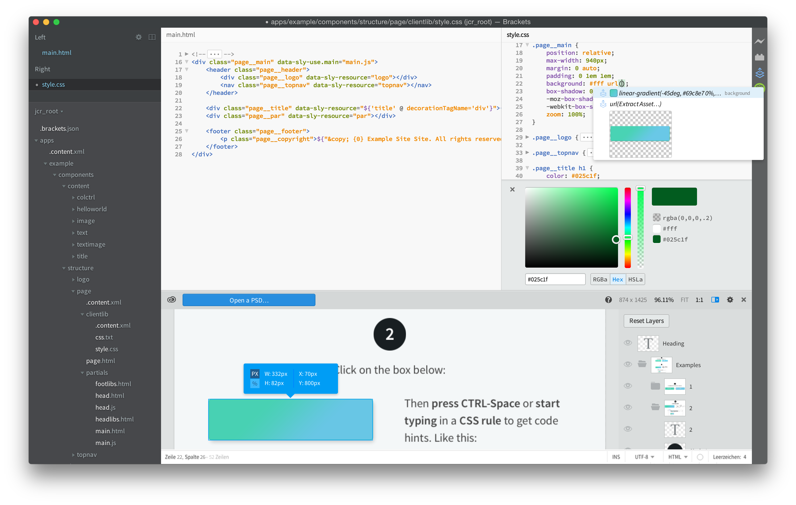
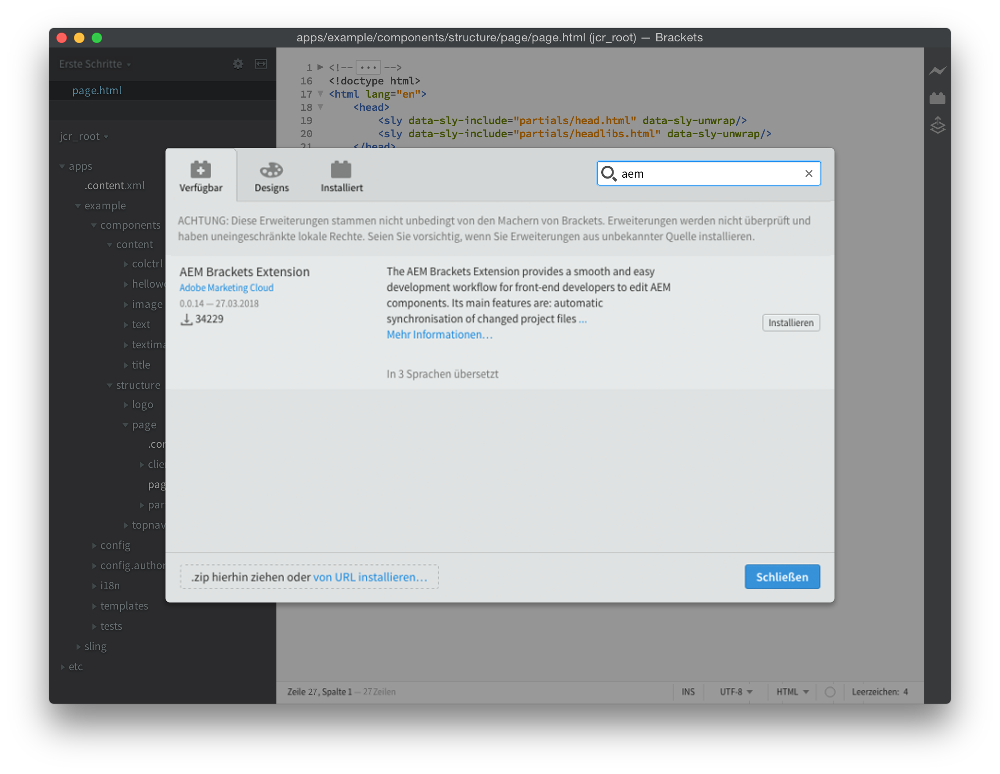
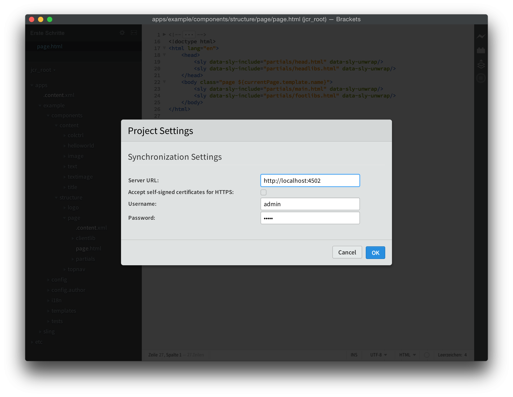
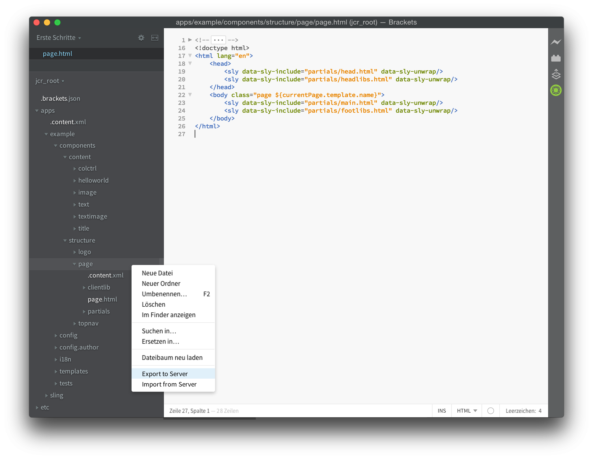
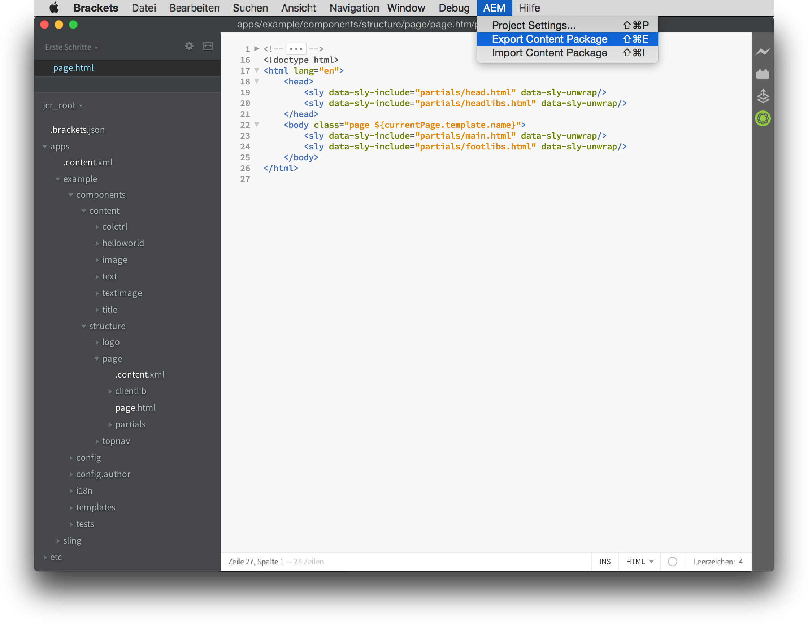
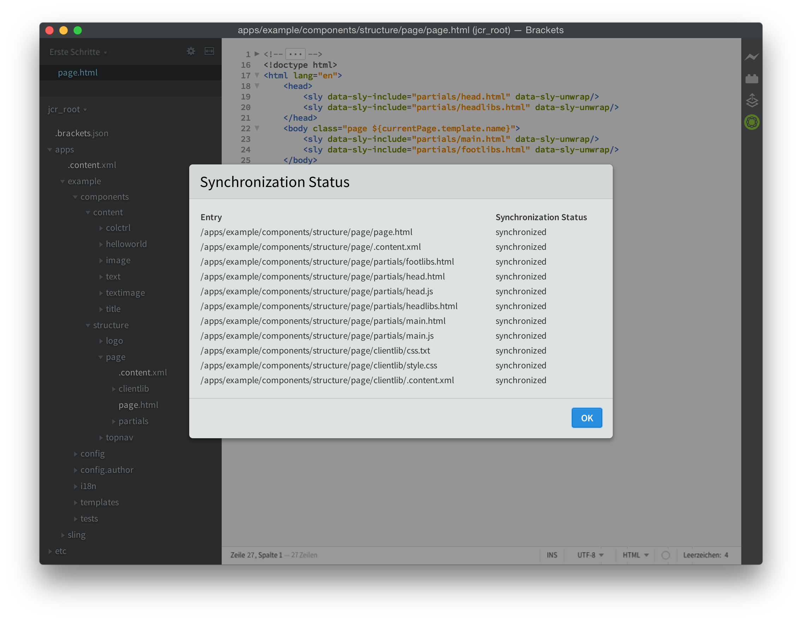

# AEM Brackets-Erweiterung{#aem-brackets-extension}

## Überblick {#overview}

Die AEM Brackets-Erweiterung bietet einen reibungslosen Workflow für die Bearbeitung von AEM-Komponenten und Client-Bibliotheken und nutzt die Leistungsfähigkeit des [Brackets](https://brackets.io/)-Code-Editors, der den Zugriff auf Photoshop-Dateien und -Ebenen über den Code-Editor ermöglicht. Die durch die Erweiterung gebotene einfache Synchronisation (kein Maven oder File Vault erforderlich) erhöht die Effizienz der Entwickler und hilft auch Frontend-Entwicklern mit begrenztem AEM-Wissen, an Projekten teilzunehmen. Diese Erweiterung bietet auch Unterstützung für die [HTML Template Language (HTL)](https://docs.adobe.com/content/help/de-DE/experience-manager-htl/using/overview.html), die die Komplexität von JSP eliminiert, um die Komponentenentwicklung zu vereinfachen und sicherer zu machen.

### Funktionen {#features}

Die Hauptmerkmale der AEM Brackets-Erweiterung sind:

* Automatisierte Synchronisierung geänderter Dateien mit der AEM Entwicklungsinstanz.
* Manuelle bidirektionale Synchronisation von Dateien und Ordnern.
* Vollständige Inhaltspaketsynchronisierung des Projekts.
* HTL-Code-Vervollständigung für Ausdrücke und Blockanweisungen `data-sly-*`.

Zusätzlich bietet Brackets viele nützliche Funktionen für AEM-Frontend-Entwickler:

* Photoshop-Dateiunterstützung zum Extrahieren von Informationen aus einer PSD-Datei, wie Schichten, Maße, Farben, Schriftarten, Texte usw.
* Codehinweise aus der PSD, um diese extrahierten Informationen im Code einfach wiederzuverwenden.
* CSS-Präprozessor-Unterstützung, wie LESS und SCSS.
* Und Hunderte zusätzlicher Erweiterungen, die spezifischere Anforderungen abdecken.

## Installation {#installation}

### Brackets {#brackets}

Die AEM Brackets-Erweiterung unterstützt Brackets Version 1.0 oder höher.

Laden Sie die neueste Brackets-Version von [brackets.io](https://brackets.io/) herunter.

### Die Erweiterung {#the-extension}

Um die Erweiterung zu installieren, gehen Sie wie folgt vor:

1. Öffnen Sie Brackets. Wählen Sie im Menü **Datei** den **Extension Manager...**
1. Geben Sie **AEM** in die Suchleiste ein und suchen Sie nach **AEM Brackets-Erweiterung**.

   

1. Klicken Sie auf **Installieren**.
1. Schließen Sie das Dialogfeld und den Extension Manager nach Abschluss der Installation.

## Erste Schritte {#getting-started}

### Das Content-Package-Projekt {#the-content-package-project}

Nachdem die Erweiterung installiert wurde, können Sie mit der Entwicklung von AEM-Komponenten beginnen, indem Sie mit Brackets einen content-package-Ordner aus Ihrem Dateisystem öffnen.

Das Projekt muss mindestens enthalten:

1. einen Ordner `jcr_root` (z. B. `myproject/jcr_root`)

1. eine `filter.xml` -Datei (z. B. `myproject/META-INF/vault/filter.xml`); Weitere Informationen zur Struktur der `filter.xml`-Datei finden Sie in der [Definition des Workspace-Filters](https://jackrabbit.apache.org/filevault/filter.html).

Im Menü **Datei** von Brackets wählen Sie **Ordner öffnen...** und wählen Sie entweder den Ordner `jcr_root` oder den übergeordneten Projektordner.

>[!NOTE]
>
>Wenn Sie kein eigenes Projekt mit einem Inhaltspaket haben, können Sie das [HTL TodoMVC-Beispiel](https://github.com/Adobe-Marketing-Cloud/aem-sightly-sample-todomvc) ausprobieren. Klicken Sie auf GitHub auf **ZIP** herunterladen, extrahieren Sie die Dateien lokal und öffnen Sie wie oben beschrieben den Ordner `jcr_root` in Brackets. Führen Sie dann die folgenden Schritte aus, um die **Projekteinstellungen** einzurichten, und laden Sie schließlich das gesamte Paket in Ihre AEM-Entwicklungsinstanz hoch, indem Sie ein **Inhaltspaket exportieren** ausführen, wie weiter unten im Abschnitt Vollständige Inhaltspaketsynchronisierung beschrieben.
>
>Nach diesen Schritten sollten Sie auf die URL `/content/todo.html` in Ihrer AEM-Entwicklungsinstanz zugreifen können. Sie können Änderungen am Code in Brackets vornehmen und sehen, wie die Änderungen nach einer Aktualisierung im Webbrowser sofort mit dem AEM-Server synchronisiert wurden.

### Projekteinstellungen {#project-settings}

Um Ihren Inhalt mit einer AEM-Entwicklungsinstanz zu synchronisieren, müssen Sie Ihre Projekteinstellungen definieren. Gehen Sie dazu zum Menü **AEM** und wählen Sie **Projekteinstellungen..**.

Die Projekteinstellungen erlauben die Definition von Folgendem:

1. Die Server-URL (z. B. `http://localhost:4502`)
1. Ob Server ohne gültiges HTTPS-Zertifikat toleriert werden sollen (deaktivieren Sie diese Option, falls nicht erforderlich)
1. Benutzername, der für die Synchronisierung von Inhalten verwendet wird (z. B. `admin`)
1. Das Kennwort des Benutzers (z. B. `admin`)

## Synchronisieren von Inhalten {#synchronizing-content}

Die AEM Brackets-Erweiterung bietet die folgenden Arten der Inhaltssynchronisierung für Dateien und Ordner, die durch die in `filter.xml` definierten Filterregeln zulässig sind:

### Automatisierte Synchronisierung von geänderten Dateien {#automated-synchronization-of-changed-files}

Diese synchronisiert nur Änderungen von Brackets mit der AEM-Instanz, aber niemals umgekehrt.

### Manuelle bidirektionale Synchronisierung  {#manual-bidirectional-synchronization}

Öffnen Sie im Projekt-Explorer das Kontextmenü, indem Sie mit der rechten Maustaste auf eine beliebige Datei oder einen beliebigen Ordner klicken. Daraufhin können Sie auf die Optionen **Auf Server exportieren** oder **Aus Server importieren** zugreifen.

>[!NOTE]
>
>Wenn sich der ausgewählte Eintrag außerhalb des Ordners `jcr_root` befindet, sind die Kontextmenüeinträge **Auf Server exportieren** und **Import von Server** deaktiviert.

### Vollständige Content-Package-Synchronisierung {#full-content-package-synchronization}

Im Menü **AEM** können die Optionen **Inhaltspaket exportieren** oder **Inhaltspaket importieren** das gesamte Projekt mit dem Server synchronisieren.

### Synchronisierungsstatus {#synchronization-status}

Die AEM Brackets-Erweiterung verfügt über ein Benachrichtigungssymbol in der Symbolleiste rechts im Fenster „Brackets“, das den Status der letzten Synchronisierung angibt:

* grün - alle Dateien wurden erfolgreich synchronisiert
* blau - eine Synchronisierung wird ausgeführt
* gelb - einige der Dateien wurden nicht synchronisiert
* rot - keine Dateien wurden synchronisiert

Wenn Sie auf das Benachrichtigungssymbol klicken, wird das Dialogfeld „Synchronisierungsstatusbericht“ geöffnet, das den Status aller synchronisierten Dateien anzeigt.

>[!NOTE]
>
>Nur Inhalt, der in den Filterregeln von `filter.xml` als enthalten gekennzeichnet ist, wird unabhängig von der verwendeten Synchronisierungsmethode synchronisiert.
>
>Darüber hinaus werden `.vltignore`-Dateien unterstützt, um Inhalte von der Synchronisierung mit und aus dem Repository auszuschließen.

## Bearbeiten von HTL-Code {#editing-htl-code}

Die AEM Brackets-Erweiterung bietet auch eine automatische Vervollständigung, um das Schreiben von HTL-Attributen und -Ausdrücken zu vereinfachen.

### Automatische Vervollständigung von Attributen {#attribute-auto-completion}

1. Geben Sie in einem HTML-Attribut `sly` ein. Das Attribut wird automatisch zu `data-sly-` - vervollständigt.
1. Wählen Sie das HTL-Attribut in der Dropdown-Liste aus.

### Automatische Vervollständigung von Ausdrücken  {#expression-auto-completion}

Innerhalb eines Ausdrucks `${}` werden allgemeine Variablennamen automatisch ausgefüllt.

## Weitere Informationen {#more-information}

Die AEM Brackets-Erweiterung ist ein Open-Source-Projekt, das von [Adobe Marketing Cloud](https://github.com/Adobe-Marketing-Cloud) unter der Apache-Lizenz Version 2.0 auf GitHub gehostet wird:

* Code-Repository: [https://github.com/Adobe-Marketing-Cloud/aem-sightly-brackets-extension](https://github.com/Adobe-Marketing-Cloud/aem-sightly-brackets-extension)
* Apache-Lizenz, Version 2.0: [https://www.apache.org/licenses/LICENSE-2.0.html](https://www.apache.org/licenses/LICENSE-2.0.html)

Der Brackets-Code-Editor ist auch ein Open-Source-Projekt, das von der [Adobe Systems Incorporated](https://github.com/adobe)-Organisation auf GitHub gehostet wird:

* Code-Repository: [https://github.com/adobe/brackets](https://github.com/adobe/brackets)

Sie können gern dazu beitragen!
