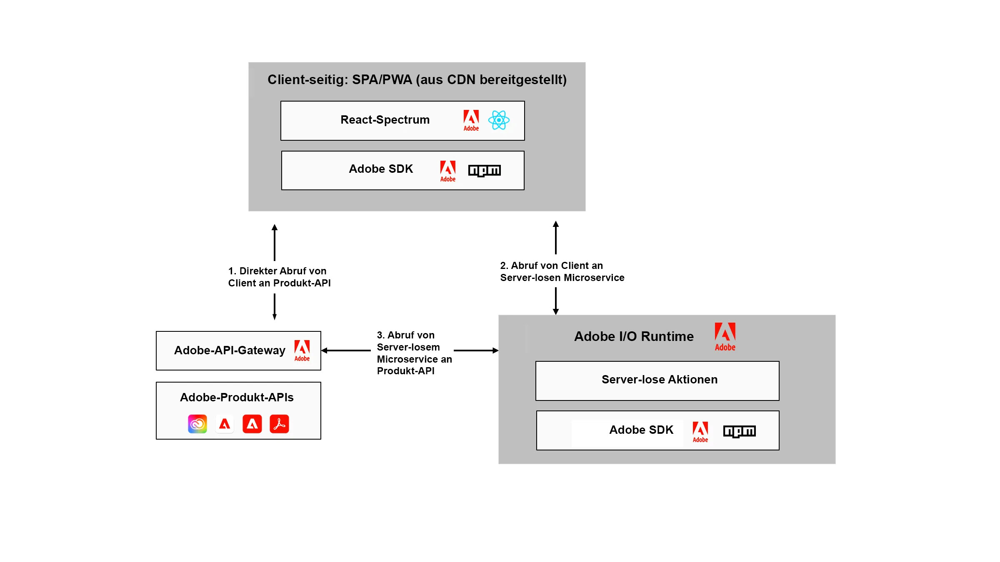

# Erweitern von [!DNL Adobe Experience Manager] mit dem Adobe Developer App Builder {#extend-using-app-builder}

## Was ist der App Builder für AEM? {#project-appbuilder}

Der neue Adobe Developer App Builder bietet ein Erweiterbarkeits-Framework, mit dem Entwickler Funktionen von AEM einfach erweitern können.

Der App Builder bietet ein einheitliches Erweiterungs-Framework für Drittanbieter zur Integration und Erstellung benutzerdefinierter Erlebnisse, die Adobe Experience Manager erweitern. Mit diesem vollständigen Erweiterbarkeits-Framework, das auf der Infrastruktur der Adobe basiert, können Entwickler benutzerdefinierte Microservices erstellen, Adobe Experience Manager über Adobe-Lösungen und den Rest des IT-Stacks erweitern und integrieren.

Der App Builder bietet Kunden eine Möglichkeit, Adobe Experience Manager in verschiedenen Anwendungsfällen einfach zu erweitern:

* Middleware-Erweiterbarkeit: Verbinden Sie externe Systeme mit Adobe-Anwendungen, indem Sie benutzerdefinierte Connectoren erstellen oder eine Suite vorgefertigter Integrationen nutzen.
* Erweiterbarkeit der Hauptdienste: Erweiterung der Kernanwendungsfunktionen durch Erweiterung des Standardverhaltens um benutzerdefinierte Funktionen und Geschäftslogik.
* Benutzererlebnis-Erweiterbarkeit: Erweitern Sie das Kernerlebnis, um Geschäftsanforderungen zu unterstützen oder kundenspezifische digitale Eigenschaften, Storefronts und Back-Office-Apps zu erstellen.

App Builder steht seit Sommer 2020 für Unternehmenskunden und -partner über die Entwicklervorschau von Adobe zur Verfügung. Die allgemeine Verfügbarkeit von App Builder ist für Dezember 2021 geplant. Adobe lädt Entwicklerinnen und Entwickler dazu ein, App Builder über unser [Testprogramm](https://developer.adobe.com/app-builder/trial/) von Adobe auszuprobieren.

>[!NOTE]
>
>Für Kundinnen und Kunden von AEM as a Cloud Service, die App Builder verwenden möchten, siehe [Erweiterung von Adobe Experience Manager als Cloud Service mit Adobe Developer App Builder](https://experienceleague.adobe.com/docs/experience-manager-65/developing/extending-aem/app-builder.html?lang=de).

## Architektur {#architecture}

Anstelle einer vordefinierten Lösung bietet der Adobe Developer App Builder eine gemeinsame, konsistente und standardisierte Entwicklungsplattform für die Erweiterung von Adobe Cloud-Lösungen wie AEM, einschließlich:

* Adobe Developer Console – Für die Entwicklung benutzerdefinierter Microservices und Erweiterungen können Entwickler Projekte erstellen und verwalten, während sie auf alle Tools und APIs zugreifen, die sie zum Erstellen von Plug-ins und Integrationen benötigen.
* Entwicklertools – Open-Source-Tools, SDKs und Bibliotheken, mit denen Entwickler einfach benutzerdefinierte Erweiterungen und Integrationen erstellen können. Verwenden Sie React Spectrum (UI-Toolkit von Adobe), um eine gemeinsame Benutzeroberfläche für alle Adobe-Anwendungen zu haben.
* Services – I/O Runtime für das Hosting der Infrastruktur auf der Server-losen Plattform von Adobe und I/O Events für ereignisbasierte Integrationen. Adobe bietet auch native Unterstützung für das Speichern von Daten und Dateien.
* Adobe Experience Cloud – Entwickler können Erweiterungen und Integrationen übermitteln, die in ihrer Experience Cloud-Organisation veröffentlicht werden sollen. Systemadministratoren können diese Erweiterungen dann überprüfen, verwalten und genehmigen. Nach der Veröffentlichung finden Sie Ihre benutzerdefinierten App Builder-Erweiterungen und -Tools zusammen mit anderen Adobe Experience Cloud-Anwendungen.

Die folgende Abbildung zeigt, wie eine auf App Builder aufbauende Standardanwendung diese Funktionen nutzt:

Weitere Informationen zur App Builder-Architektur finden Sie unter [Überblick über die Architektur](https://developer.adobe.com/app-builder/docs/guides/).

## Erste Schritte mit dem App Builder {#additional-resources}

Um die ersten Schritte mit App Builder zu erleichtern, wurde für den Einstieg eine Reihe von Dokumentationen erstellt:

* [App Builder – Erste Schritte](https://developer.adobe.com/app-builder/docs/getting_started/)

## Weiteres Lernen mit Dokumentation {#appbuilder-documentation}

Für den App Builder gibt es Videos und Dokumentation für Entwickler, einschließlich Handbüchern, und Referenzdokumentation, die Sie bei der Entwicklung Ihrer eigenen benutzerdefinierten Anwendungen unterstützen:

* [App Builder–Dokumentation](https://developer.adobe.com/app-builder/docs/overview/)
* [App Builder–Videos](https://www.youtube.com/playlist?list=PLcVEYUqU7VRfDij-Jbjyw8S8EzW073F_o)

## Testen einer der Beispielanwendungen {#appbuilder-codesamples}

Sind Sie bereit, mit der Entwicklung zu beginnen? Es gibt viele Beispielanwendungen, mit denen Sie schnell loslegen können:

* [App Builder Code Labs auf der Adobe Developer Website](https://developer.adobe.com/app-builder/docs/resources/)

